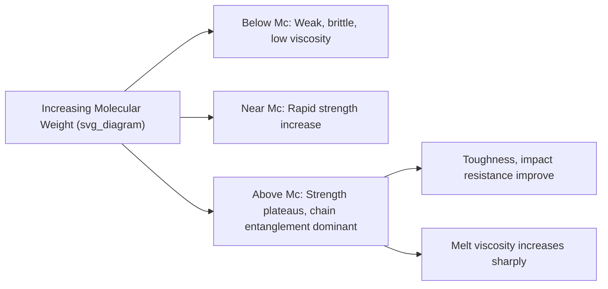

## Molecular Weight and Its Effect on Properties

### Fundamental Concepts

Unlike small molecules with a single, well-defined molecular weight, polymers synthesized via typical polymerization processes consist of chains with a statistical distribution of lengths, since chain initiation, propagation, and termination events occur stochastically throughout the reaction. Consequently, polymer molecular weight must be described using **statistical averages** and a measure of distribution breadth, rather than a single value.

### Molecular Weight Averages

**Number-Average Molecular Weight ($M_n$)**

The arithmetic mean, weighted by the number of chains of each molecular weight — directly reflects the total mass divided by the total number of molecules:

$$M_n = \frac{\sum N_i M_i}{\sum N_i}$$

where $N_i$ is the number of chains with molecular weight $M_i$. $M_n$ is highly sensitive to the presence of low-molecular-weight species (short chains, oligomers), since it counts each molecule equally regardless of size.

**Weight-Average Molecular Weight ($M_w$)**

Weighted by the mass fraction of chains of each molecular weight, giving greater statistical weight to larger chains:

$$M_w = \frac{\sum N_i M_i^2}{\sum N_i M_i}$$

$M_w$ is more sensitive to the presence of high-molecular-weight species (long chains, gel-like fractions) than $M_n$.

**Z-Average Molecular Weight ($M_z$)**

An even higher-order average, further emphasizing the high-molecular-weight tail of the distribution:

$$M_z = \frac{\sum N_i M_i^3}{\sum N_i M_i^2}$$

**Viscosity-Average Molecular Weight ($M_v$)**

Derived from intrinsic viscosity measurements via the Mark-Houwink relationship, falling between $M_n$ and $M_w$ (closer to $M_w$ for typical Mark-Houwink exponents):

$$[\eta] = K M_v^a$$

where $[\eta]$ is intrinsic viscosity, and $K$, $a$ are Mark-Houwink constants specific to the polymer-solvent-temperature system.

**Key Points**

- For any real, polydisperse polymer sample: $M_n < M_v < M_w < M_z$; all averages converge to the same value only for a perfectly monodisperse (single molecular weight) sample
- Different characterization techniques measure different averages: membrane osmometry and end-group analysis yield $M_n$; light scattering yields $M_w$; gel permeation/size exclusion chromatography (GPC/SEC) yields the full molecular weight distribution, from which any average can be calculated

### Polydispersity Index (PDI)

$$PDI = \frac{M_w}{M_n}$$

A measure of the breadth of the molecular weight distribution:

- $PDI = 1$: theoretically monodisperse (achieved closely in living/controlled polymerizations, e.g., PDI < 1.1 for well-controlled anionic or ATRP/RAFT systems)
- $PDI \approx 1.5$–2: typical for many commercial free-radical-polymerized thermoplastics
- $PDI \approx 2$: theoretical value for an ideal linear step-growth (condensation) polymer following the most probable (Flory-Schulz) distribution at high conversion
- $PDI$ significantly $> 2$: broad distribution, often indicating multiple reaction pathways, branching, or a blend of different molecular weight fractions

### Degree of Polymerization and Chain Length Relationships

$$M = DP \times M_0$$

where $DP$ is the degree of polymerization (number of repeat units) and $M_0$ is the repeat unit molecular weight. Because mechanical, rheological, and thermal properties depend on chain length primarily through the extent of **chain entanglement**, a critical molecular weight concept governs the transition between distinct property regimes.

### Effect of Molecular Weight on Mechanical Properties

**Key Points**

Mechanical strength and toughness increase with molecular weight up to a point, then plateau, following a characteristic relationship:

$$\sigma \approx \sigma_\infty - \frac{K}{M_n}$$

where $\sigma_\infty$ is the limiting (plateau) strength at very high molecular weight and $K$ is a material-specific constant — reflecting that below a **critical entanglement molecular weight ($M_c$)**, chains are too short to form a sufficient density of physical entanglements to effectively transfer stress between chains, resulting in low strength and brittle, easily fractured material.

Above $M_c$, chain entanglements act as effective (though temporary/physical, not covalent) network junctions capable of transferring load between chains during deformation, dramatically improving tensile strength, toughness, and resistance to crack propagation (fracture toughness) compared to unentangled short-chain material.

### Effect of Molecular Weight on Melt Viscosity and Processability

Melt (or solution) viscosity exhibits one of the most dramatic and well-established molecular weight dependencies in polymer science, governed by the presence or absence of chain entanglement:

$$\eta_0 \propto M_w^{1} \quad (M_w < M_c, \text{unentangled regime})$$

$$\eta_0 \propto M_w^{3.4} \quad (M_w > M_c, \text{entangled regime})$$

where $\eta_0$ is the zero-shear melt viscosity. This strong 3.4-power dependence above $M_c$ (an empirically well-established scaling relationship across many polymer systems) means that relatively modest increases in molecular weight above the entanglement threshold produce very large increases in processing viscosity.

**Key Points**

- This creates a fundamental materials engineering trade-off: higher molecular weight generally improves mechanical properties (strength, toughness, environmental stress crack resistance) but substantially increases melt viscosity, making the material more difficult and energy-intensive to process (extrude, injection mold)
- Commercial polymer grades are therefore engineered to balance target mechanical performance against acceptable processability, often specified industrially via **melt flow index (MFI)** or **melt flow rate (MFR)** — an inverse, practically measured proxy for molecular weight/melt viscosity (higher MFI generally corresponds to lower molecular weight and easier processing, but reduced mechanical performance)

### Effect of Molecular Weight on Thermal Properties

**Glass Transition Temperature ($T_g$)**

$T_g$ increases with molecular weight at low molecular weights (where chain-end free volume is significant relative to total volume) but plateaus at higher molecular weights, described by the Flory-Fox equation:

$$T_g = T_{g,\infty} - \frac{K}{M_n}$$

where $T_{g,\infty}$ is the limiting glass transition temperature at infinite molecular weight and $K$ is a material-specific constant. This behavior arises because chain ends possess higher free volume/mobility than mid-chain segments; at low molecular weight, the higher proportional concentration of chain ends increases overall free volume and lowers $T_g$, while at high molecular weight, the diminishing chain-end concentration relative to total chain length reduces this effect.

**Melting Temperature ($T_m$, semi-crystalline polymers)**

$T_m$ shows a similar, though generally weaker, increase with molecular weight at low $M$, plateauing at higher molecular weight — additionally complicated by the fact that very high molecular weight can hinder chain folding and crystallization kinetics, sometimes reducing achievable crystallinity even as $T_m$ of the crystalline fraction itself remains relatively stable.

### Effect of Molecular Weight on Solution and Rheological Behavior

**Intrinsic Viscosity**

Governed by the Mark-Houwink equation, intrinsic viscosity in dilute solution increases with molecular weight, forming the basis of viscometric molecular weight determination — a widely used, relatively low-cost characterization technique, though it yields an average ($M_v$) rather than the full distribution.

**Solution/Melt Elasticity**

Above $M_c$, entangled polymer melts and concentrated solutions exhibit **viscoelastic** behavior (combining viscous flow and elastic recoil), manifesting practically as phenomena such as die swell during extrusion and melt fracture at high shear rates — behaviors essentially absent in low-molecular-weight, unentangled polymer melts.

### Effect of Molecular Weight on Environmental and Long-Term Performance

- **Environmental stress cracking resistance (ESCR)**: Generally improves with increasing molecular weight, since higher entanglement density resists the combined effect of applied stress and solvent/chemical exposure that promotes crack initiation and propagation
- **Creep resistance**: Higher molecular weight generally improves resistance to long-term viscous flow (creep) under sustained load, since a denser entanglement network more effectively resists chain slippage over time
- **Fatigue resistance**: [Inference — generally correlates positively with molecular weight and entanglement density, though the relationship is also strongly influenced by crystallinity, morphology, and processing-induced defects, so molecular weight alone is not a complete predictor]

### Practical Characterization Techniques

| Technique | Average(s) Obtained | Principle |
| --- | --- | --- |
| Gel Permeation/Size Exclusion Chromatography (GPC/SEC) | Full distribution ($M_n$, $M_w$, $M_z$, PDI) | Separation by hydrodynamic volume through a porous column; calibrated against standards |
| Membrane osmometry | $M_n$ | Colligative property (osmotic pressure) measurement |
| End-group analysis (titration, NMR) | $M_n$ | Quantification of known chain-end functional groups |
| Static light scattering | $M_w$ | Intensity of scattered light proportional to molecular weight |
| Viscometry (dilute solution) | $M_v$ | Mark-Houwink relationship between intrinsic viscosity and molecular weight |
| Melt flow index (MFI) testing | Indirect/practical proxy | Extrusion rate through a standardized die under fixed load/temperature |

**Example**

Ultra-high molecular weight polyethylene (UHMWPE), with molecular weight typically exceeding 3–6 million g/mol (versus ~100,000–500,000 g/mol for conventional HDPE), illustrates the practical extreme of the molecular weight-property relationship: the exceptionally high entanglement density confers outstanding abrasion resistance, impact toughness, and low friction coefficient (used in orthopedic implants, high-performance fibers, and industrial wear components), but the correspondingly extreme melt viscosity makes UHMWPE essentially unprocessable by conventional melt-based methods (injection molding, extrusion), requiring specialized processing routes such as ram extrusion, compression molding/sintering, or gel-spinning for fiber production.

**Next Steps**

- Gel permeation chromatography (GPC/SEC) instrumentation and calibration
- Chain entanglement theory and reptation dynamics
- Flory-Fox equation and free volume theory of the glass transition
- Melt rheology: shear thinning, die swell, and melt fracture
- Mark-Houwink constants and solution viscometry technique
- Structure-property relationships in ultra-high molecular weight polymers