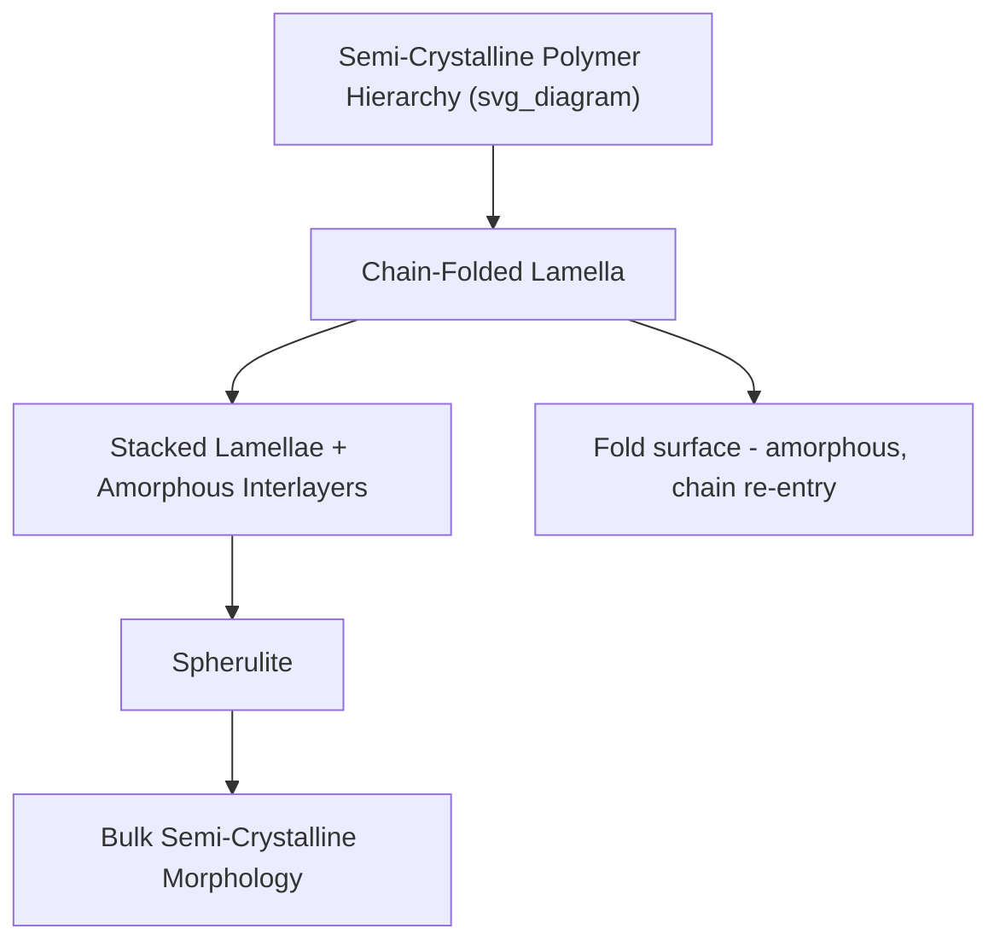

## Crystallinity in Polymers

### Fundamental Concepts

Unlike metals and ceramics, which can achieve essentially complete crystallinity, polymers are never fully crystalline in the bulk solid state due to the inherent difficulty of long, flexible chain molecules achieving perfect, extended three-dimensional periodic packing throughout their entire length. Real semi-crystalline polymers instead consist of **ordered crystalline regions coexisting with disordered amorphous regions**, with the crystalline fraction ranging typically from roughly 10% to 80% depending on polymer chemistry, chain regularity, and processing conditions.

**Key Points**

- Crystallinity requires structural regularity: a polymer chain must possess a sufficiently regular, repeating chemical structure to permit ordered packing — irregular structures (random copolymers, atactic vinyl polymers, highly branched chains) generally cannot crystallize
- Crystallinity is a matter of degree (percent crystallinity), not a binary state, distinguishing polymer crystallinity fundamentally from the largely complete crystallinity typical of metallic and ceramic solids

### Structural Requirements for Crystallizability

For a polymer to crystallize, several structural conditions are generally necessary:

1. **Chain regularity/stereoregularity**: Isotactic or syndiotactic configurations (regular substituent placement) permit ordered packing; atactic (random) configurations generally prevent crystallization
2. **Chemical structure regularity**: Homopolymers and regular alternating/block copolymers crystallize more readily than random copolymers, since compositional irregularity disrupts the periodicity required for lattice formation
3. **Minimal branching**: Linear chains pack more efficiently than branched chains; extensive branching (as in LDPE) reduces achievable crystallinity relative to linear analogs (as in HDPE) of the same base chemistry
4. **Sufficient intermolecular forces/chain flexibility balance**: Chains must be flexible enough to fold and pack into a lattice, yet possess sufficient intermolecular attraction (hydrogen bonding, dipole interactions) to stabilize the ordered state once formed

### The Fringed Micelle and Chain-Folded Lamellar Models

**Historical Fringed Micelle Model**

An early model proposing that a single chain passes through multiple small crystalline regions (micelles) interspersed with amorphous regions, with each chain contributing segments to several different crystallites. Largely superseded by direct experimental evidence (particularly from single-crystal studies) for chain folding.

**Chain-Folded Lamellar Model**

The currently accepted structural model: polymer chains fold back on themselves repeatedly to form thin, plate-like crystalline structures called **lamellae**, typically 10–20 nm thick, with the chain axis oriented roughly perpendicular to the lamellar surface.

**Key Points**

- The lamellar fold surface is inherently disordered (amorphous), since the chain must reverse direction sharply at the lamellar edge — this fold-surface disorder is a major contributor to the amorphous fraction in semi-crystalline polymers
- Amorphous interlamellar regions contain chain segments connecting adjacent lamellae (tie molecules), loose chain folds, and chain ends; tie molecules play a critical mechanical role in transmitting stress between lamellae during deformation

### Spherulites

Under typical melt-crystallization conditions (cooling from the melt without strong external orientation), lamellae grow radially outward from a central nucleation site, twisting and branching to fill space, ultimately forming spherical (or, when growth is impinged by neighboring spherulites, polyhedral) superstructures called **spherulites** — typically ranging from micrometers to millimeters in diameter, often visible via polarized light microscopy due to their characteristic birefringent "Maltese cross" extinction pattern.

**Key Points**

- Spherulite size is strongly influenced by nucleation density: rapid cooling or the presence of nucleating agents produces many small nuclei and correspondingly small spherulites, generally improving optical clarity and, in some cases, toughness
- Slow cooling promotes fewer, larger spherulites, which can create larger inter-spherulitic weak zones and increase brittleness, along with increased light scattering (reduced optical clarity) due to larger structural features relative to the wavelength of visible light

### Quantifying Percent Crystallinity

**Density Method**

$$\% X_c = \frac{\rho_c(\rho - \rho_a)}{\rho(\rho_c - \rho_a)} \times 100$$

where $\rho$ is the measured bulk density, and $\rho_c$, $\rho_a$ are the densities of the theoretically fully crystalline and fully amorphous phases, respectively (determined independently, e.g., $\rho_c$ from X-ray crystal structure analysis, $\rho_a$ from rapidly quenched or high-temperature melt density extrapolation).

**Differential Scanning Calorimetry (DSC) Method**

$$\% X_c = \frac{\Delta H_m}{\Delta H_m^{\circ}} \times 100$$

where $\Delta H_m$ is the measured heat of fusion (area under the melting endotherm) of the sample, and $\Delta H_m^{\circ}$ is the heat of fusion of a hypothetically 100% crystalline sample of the same polymer (a reference value determined independently, often via extrapolation methods).

**X-Ray Diffraction (XRD) Method**

$$\% X_c = \frac{A_c}{A_c + A_a} \times 100$$

where $A_c$ and $A_a$ are the integrated areas under the crystalline (sharp) and amorphous (broad halo) contributions to the diffraction pattern, respectively — deconvolution of overlapping crystalline and amorphous scattering is required.

**Key Points**

- Different methods can yield somewhat different percent crystallinity values for the same sample, since each technique is sensitive to a slightly different physical manifestation of order (density packing, enthalpy of fusion, diffraction coherence length), so reported crystallinity values should always be interpreted alongside the measurement technique used
- [Inference — discrepancies between methods are generally modest for well-characterized common polymers but can be more significant for polymers with imperfect crystal structures or a broad distribution of crystallite sizes/perfection]

### Effect of Crystallinity on Properties

| Property | Effect of Increasing Crystallinity |
| --- | --- |
| Density | Increases (crystalline regions pack more densely than amorphous) |
| Stiffness/modulus | Increases (crystallites act as reinforcing, rigid domains) |
| Yield strength | Generally increases |
| Ductility/elongation at break | Generally decreases (crystalline regions restrict chain mobility) |
| Optical clarity | Generally decreases (light scattering at crystalline-amorphous interfaces and spherulite boundaries) |
| Chemical/solvent resistance | Generally increases (crystalline regions are less accessible to solvent penetration) |
| Permeability (gas/vapor barrier) | Generally decreases (crystallites act as impermeable barriers, lengthening diffusion path) |
| Melting behavior | Sharper, more defined melting endotherm; higher heat of fusion |
| Shrinkage during processing | Generally increases (density increase upon crystallization causes volumetric contraction) |

**Key Points**

- The stiffness-toughness trade-off is a central practical consideration in semi-crystalline polymer engineering: increasing crystallinity (via slower cooling, annealing, or nucleating agents) increases stiffness and strength but typically reduces toughness and impact resistance, requiring formulation/processing optimization for specific application requirements

### Factors Controlling Crystallinity Development

**Cooling Rate**

Slower cooling from the melt provides more time for chain diffusion and ordering, generally increasing achievable crystallinity (up to the polymer's inherent maximum); rapid quenching can suppress crystallization substantially, producing a predominantly amorphous or low-crystallinity structure even in an inherently crystallizable polymer (e.g., rapidly quenched PET is nearly amorphous and transparent, while slow-cooled or subsequently annealed PET is opaque and significantly more crystalline).

**Molecular Weight**

Very high molecular weight can hinder crystallization kinetics (increased melt viscosity restricts chain diffusion/folding during the available crystallization time window), sometimes reducing achievable crystallinity despite otherwise favorable chain regularity.

**Nucleating Agents**

Additives that provide heterogeneous nucleation sites, increasing nucleation density, refining spherulite size, and often accelerating overall crystallization kinetics — widely used industrially to improve clarity, reduce cycle time, and control mechanical property consistency (e.g., in injection-molded polypropylene).

**Mechanical Orientation (Strain-Induced Crystallization)**

Applied stress/strain (as in fiber spinning, film stretching/biaxial orientation) can align chains and dramatically promote crystallization along the strain direction, producing highly oriented crystalline structures with substantially enhanced tensile strength and modulus in the orientation direction — the structural basis for high-strength polymer fibers (e.g., oriented PET fiber, ultra-high-molecular-weight polyethylene fiber).

**Annealing**

Heat treatment below $T_m$ (but above $T_g$) allows continued chain mobility and reorganization, generally increasing crystallinity, crystallite perfection, and lamellar thickness in an already-solidified semi-crystalline polymer, analogous in purpose (though different in underlying mechanism) to annealing in metals.

### Crystallization Kinetics: Avrami Analysis

Isothermal crystallization kinetics are commonly described using the Avrami equation, analogous to its application in metallic phase transformations:

$$X(t) = 1 - \exp(-kt^n)$$

where $X(t)$ is the relative crystallinity fraction transformed at time $t$, $k$ is a rate constant (temperature- and nucleation-mechanism-dependent), and $n$ is the Avrami exponent, whose value provides inference about nucleation mode (homogeneous vs. heterogeneous) and crystal growth geometry (rod-like, disc-like, or spherulitic growth).

**Key Points**

- $n$ is often reported in the range of 2–4 for polymer spherulitic crystallization, though interpretation of the exact mechanistic significance of non-integer or intermediate $n$ values requires caution, since real systems often deviate from the idealized assumptions underlying the Avrami model [Inference — the Avrami framework is widely used as a practical kinetic-fitting tool, but mechanistic interpretation of the exponent should be treated with appropriate caution given known model limitations for polymer systems]

### Characterization Techniques Summary

| Technique | Information Obtained |
| --- | --- |
| DSC | $T_m$, $\Delta H_m$ (crystallinity via heat of fusion), crystallization temperature/kinetics |
| Wide-angle X-ray diffraction (WAXD) | Crystal structure, unit cell parameters, percent crystallinity, crystallite size |
| Small-angle X-ray scattering (SAXS) | Lamellar long period (lamella + amorphous interlayer thickness) |
| Polarized light microscopy (PLM) | Spherulite size, morphology, growth rate observation |
| Density gradient column | Bulk density for density-based crystallinity calculation |
| Infrared/Raman spectroscopy | Crystalline-sensitive vibrational bands, conformational order |

**Example**

Polyethylene terephthalate (PET) provides a widely cited illustration of processing-controlled crystallinity: rapidly quenched PET (as in typical beverage bottle blow-molding) solidifies in a largely amorphous, transparent state due to insufficient time for crystallization during rapid cooling, while the same material, if slow-cooled or subsequently heat-set/annealed (as in certain PET fiber or tray/container applications), develops substantial crystallinity, becoming opaque (white, translucent) and exhibiting markedly higher stiffness, reduced gas permeability, and improved heat resistance — demonstrating that a single polymer chemistry can present dramatically different property profiles purely as a function of processing-controlled crystallinity.

**Next Steps**

- Spherulite growth kinetics and nucleation theory
- Differential scanning calorimetry (DSC) interpretation and thermal history effects
- Strain-induced crystallization in fiber and film processing
- Lamellar thickness and melting point relationships (Gibbs-Thomson/Hoffman-Weeks analysis)
- Polymer morphology characterization via SAXS/WAXD
- Structure-property relationships in semi-crystalline engineering thermoplastics