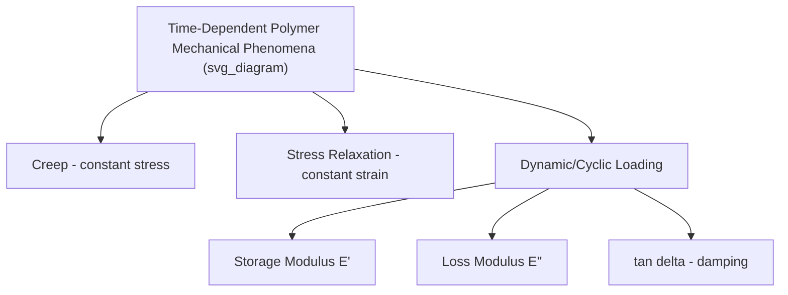
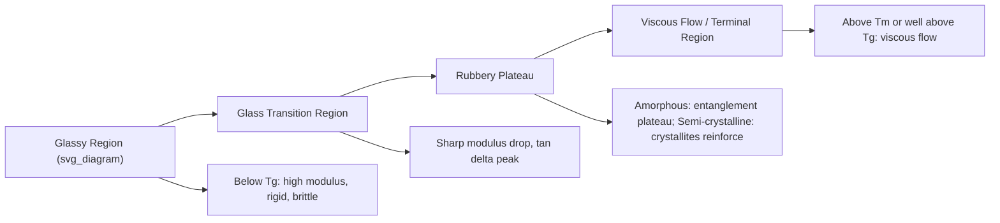

## Mechanical Behavior of Polymers

### Overview and Distinguishing Features

The mechanical behavior of polymers differs fundamentally from that of metals and ceramics due to their molecular architecture: long-chain macromolecules connected by a combination of covalent backbone bonds and weaker secondary (or sparse cross-link) inter-chain bonding. This structure gives rise to **viscoelasticity** — a time-, temperature-, and rate-dependent mechanical response combining both elastic (recoverable) and viscous (permanent, flow-like) deformation components — which is largely absent, or present to a much lesser degree, in metallic and ceramic materials at typical service conditions.

**Key Points**

- Polymer mechanical response cannot generally be described by a single, temperature/rate-independent modulus value, unlike the comparatively rate-insensitive elastic modulus of most metals and ceramics at moderate strain rates
- Molecular relaxation processes (segmental motion, chain slippage, entanglement dynamics) occurring on timescales comparable to the loading timescale are the physical origin of viscoelastic behavior

### Viscoelasticity: Fundamental Models

**Elastic (Spring) Element**

$$\sigma = E\varepsilon$$

Instantaneous, fully recoverable deformation (Hookean behavior).

**Viscous (Dashpot) Element**

$$\sigma = \eta\dot{\varepsilon}$$

Rate-dependent, non-recoverable (permanent) flow, where $\eta$ is viscosity.

**Maxwell Model**

Spring and dashpot in series — useful for describing **stress relaxation** (decreasing stress under constant applied strain):

$$\sigma(t) = \sigma_0 \exp\left(-\frac{t}{\tau}\right)$$

where $\tau = \eta/E$ is the relaxation time.

**Kelvin-Voigt Model**

Spring and dashpot in parallel — useful for describing **creep** (increasing strain under constant applied stress):

$$\varepsilon(t) = \frac{\sigma_0}{E}\left[1 - \exp\left(-\frac{t}{\tau}\right)\right]$$

**Key Points**

- Neither simple model alone captures full real polymer behavior; more advanced multi-element (generalized Maxwell/Kelvin, or standard linear solid) models combine multiple springs and dashpots to better approximate the broad relaxation spectrum of real polymers
- These linear viscoelastic models are valid only within the small-strain regime; polymer behavior becomes markedly nonlinear at larger strains, particularly near and beyond yield

### Stress-Strain Behavior

Polymer stress-strain curves vary dramatically depending on polymer class (thermoplastic, thermoset, elastomer), crystallinity, and temperature relative to $T_g$/$T_m$, but several characteristic curve shapes are commonly observed:

**Brittle Fracture (Glassy Polymers Below $T_g$)**

Approximately linear elastic behavior up to fracture, with little or no yielding; e.g., polystyrene, PMMA at room temperature (well below their $T_g$).

**Ductile Yielding with Necking (Semi-Crystalline Polymers)**

Initial linear elastic region, followed by a distinct yield point, then a region of **cold drawing** where a localized neck propagates along the gauge length at roughly constant stress (the neck region undergoes strain-induced crystalline reorientation/orientation hardening), followed by strain hardening and eventual fracture; characteristic of many semi-crystalline thermoplastics (e.g., HDPE, nylon) tested above $T_g$.

**Elastomeric Behavior**

Highly nonlinear, low-modulus response capable of very large reversible strain (often several hundred percent), typically showing an initial low-modulus region, a strain-hardening upturn at high extension (associated with limited chain extensibility and, in strain-crystallizing elastomers such as natural rubber, strain-induced crystallization), and high resilience upon unloading.

| Behavior Type | Modulus | Yield | Elongation at Break | Representative Examples |
| --- | --- | --- | --- | --- |
| Brittle | High | None/minimal | Low (a few percent) | PS, PMMA (below $T_g$), thermosets |
| Ductile (yielding) | Moderate-high | Distinct yield point | Moderate-high (tens to hundreds of percent) | HDPE, PP, nylon (above $T_g$) |
| Elastomeric | Very low | None (continuous nonlinear curve) | Very high (hundreds of percent) | Natural rubber, silicone rubber |

### Effect of Temperature Relative to $T_g$ and $T_m$

Mechanical modulus of polymers shows characteristic regions as a function of temperature, most clearly visualized via dynamic mechanical analysis (DMA):

- **Glassy region** (below $T_g$): Segmental chain motion is frozen out; modulus is high (typically 1–3 GPa for amorphous thermoplastics), behavior is generally brittle
- **Glass transition region**: Sharp drop in modulus (often 2–3 orders of magnitude over a relatively narrow temperature range) as segmental mobility activates
- **Rubbery plateau region**: For amorphous polymers, modulus is governed by entanglement density (for uncross-linked polymers) or cross-link density (for elastomers/thermosets); for semi-crystalline polymers, the crystalline fraction acts as reinforcing, physically cross-linking domains, extending useful mechanical properties well above $T_g$ up to near $T_m$
- **Terminal/flow region**: Above $T_m$ (semi-crystalline) or well above $T_g$ with insufficient entanglement/cross-linking, the material flows viscously

**Key Points**

- This is why semi-crystalline thermoplastics (e.g., HDPE, $T_g \approx -110°C$, $T_m \approx 130°C$) remain useful structural materials at room temperature despite being well above their $T_g$ — the crystalline fraction provides mechanical reinforcement that a purely amorphous polymer of similar $T_g$ would lack
- Cross-linked elastomers and thermosets do not exhibit a terminal flow region at all (chemically cross-linked network prevents viscous flow), instead undergoing chemical degradation at sufficiently high temperature

### Time-Temperature Superposition and the WLF Equation

Because viscoelastic relaxation processes are thermally activated, the effects of temperature and time (or frequency) on mechanical response are related, enabling construction of a **master curve** spanning a much broader effective time/frequency range than directly measurable at a single temperature, via the **time-temperature superposition principle**.

**Williams-Landel-Ferry (WLF) Equation**

For amorphous polymers in the range $T_g$ to $T_g + 100°C$, the temperature shift factor $a_T$ follows:

$$\log a_T = \frac{-C_1(T-T_r)}{C_2 + (T-T_r)}$$

where $T_r$ is a reference temperature and $C_1$, $C_2$ are material constants (with commonly cited "universal" values $C_1 \approx 17.4$ and $C_2 \approx 51.6$ K when $T_r = T_g$, though actual constants vary by polymer). [Unverified] The so-called "universal" WLF constants are known to vary meaningfully between different polymer systems in practice, so polymer-specific constants should be used for quantitative predictions where available.

### Dynamic Mechanical Behavior

Under oscillatory (cyclic) loading, viscoelastic materials exhibit a phase lag $\delta$ between applied stress and resulting strain, decomposed into:

$$E^* = E' + iE''$$

- **Storage modulus ($E'$)**: The in-phase component, representing the elastic (energy-storing) response
- **Loss modulus ($E''$)**: The out-of-phase component, representing the viscous (energy-dissipating) response
- **Loss tangent ($\tan\delta = E''/E'$)**: A measure of damping capacity; $\tan\delta$ peaks are commonly used to identify $T_g$ and other secondary molecular relaxation transitions via DMA

### Impact and Fracture Behavior

**Ductile-Brittle Transition**

Many polymers exhibit a temperature-dependent transition from ductile (high energy absorption) to brittle (low energy absorption) fracture behavior, analogous conceptually to the ductile-brittle transition in body-centered-cubic metals, though arising from different underlying molecular mechanisms (activation/deactivation of specific molecular relaxation processes, particularly secondary, sub-$T_g$ relaxations associated with local chain segment motion).

**Toughening Mechanisms**

- **Rubber toughening**: Dispersing a rubbery phase (e.g., as discrete particles) within a rigid, otherwise brittle polymer matrix (e.g., high-impact polystyrene, HIPS; ABS) to promote energy-absorbing mechanisms such as crazing and shear yielding, substantially increasing impact toughness at some cost to stiffness and strength
- **Crazing**: A polymer-specific fracture precursor mechanism (particularly prominent in glassy amorphous thermoplastics such as polystyrene) involving localized yielding with fibrillated, void-containing microstructure ahead of a crack tip, distinct from classical shear yielding and capable of absorbing significant energy prior to eventual crack propagation through craze fibril rupture

### Fatigue Behavior

Polymers exhibit fatigue behavior broadly analogous to metals (progressive damage accumulation under cyclic loading, describable via S-N curves), but with additional complications:

- **Hysteretic (thermal) heating**: Cyclic viscoelastic energy dissipation can cause significant self-heating at high frequency/stress amplitude, potentially leading to thermal softening and accelerated failure distinct from purely mechanical fatigue crack growth
- **Strong frequency dependence**: Because underlying deformation mechanisms are time-dependent, polymer fatigue life can be significantly more frequency-sensitive than typical metal fatigue behavior [Inference — the degree of frequency sensitivity varies substantially between polymer types and loading conditions, so this should not be treated as a fixed, universal magnitude]

### Effect of Key Structural Variables on Mechanical Behavior

| Variable | Effect on Mechanical Behavior |
| --- | --- |
| Molecular weight (above $M_c$) | Increased entanglement density improves strength, toughness, ESCR |
| Crystallinity | Increases stiffness/strength, generally decreases ductility/toughness |
| Cross-link density | Increases stiffness and solvent resistance, decreases extensibility |
| Temperature relative to $T_g$/$T_m$ | Governs whether behavior is glassy/brittle, rubbery, or viscous flow |
| Strain rate | Higher strain rate generally increases apparent modulus/strength, reduces ductility (analogous to lowering effective temperature, per time-temperature equivalence) |
| Plasticizer content | Lowers $T_g$, increases flexibility and elongation, generally reduces stiffness and strength |
| Filler/reinforcement | Can increase stiffness/strength (rigid fillers, fibers) or toughness (rubber toughening), depending on filler type and interfacial adhesion |

**Example**

Polycarbonate at room temperature (well below its $T_g \approx 147°C$) illustrates the practical consequence of secondary relaxations on toughness: despite being a glassy amorphous polymer, polycarbonate exhibits unusually high impact toughness for a glassy thermoplastic, attributed to an active sub-$T_g$ secondary relaxation process enabling local energy-dissipating molecular motion even in the nominally glassy state — a molecular-level explanation for its widespread use in impact-resistant applications (safety glazing, protective equipment) where other glassy polymers such as PMMA or polystyrene would be comparatively brittle.

**Next Steps**

- Dynamic mechanical analysis (DMA) technique and interpretation
- Creep and stress relaxation testing standards and design implications
- Crazing and shear yielding micromechanisms in glassy polymers
- Rubber toughening mechanisms and morphology-property relationships
- Time-temperature superposition and master curve construction
- Polymer fatigue testing methods and frequency-dependent failure mechanisms