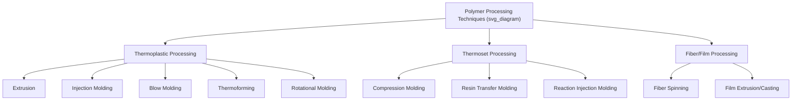

## Polymer Processing Techniques

### Overview

Polymer processing encompasses the range of techniques used to convert raw polymer resin (pellets, powder, liquid resin) into finished or semi-finished products. Technique selection depends on polymer class (thermoplastic, thermoset, elastomer), desired geometry, production volume, and required dimensional tolerances. Thermoplastic processing is generally based on reversible melting and shaping, while thermoset processing involves shaping an uncured or partially cured precursor followed by an irreversible curing reaction.

### Extrusion

**Process**

A continuous process in which polymer pellets are fed into a heated barrel containing a rotating screw, which conveys, melts (via a combination of shear heating and barrel heating), and homogenizes the polymer, forcing it through a shaped die under pressure to produce a continuous profile.

**Key Process Zones (Single-Screw Extruder)**

1. **Feed zone**: Solid conveying of pellets from hopper
2. **Compression (transition) zone**: Progressive melting; decreasing screw channel depth increases pressure and shear
3. **Metering zone**: Final melt homogenization and pressure generation prior to the die

**Key Points**

- Extrusion is inherently a continuous, high-volume process, well suited to constant cross-section products: pipe, sheet, film, wire/cable coating, and profiles
- Screw design (compression ratio, L/D ratio) is tailored to specific polymer melt rheology; inadequate screw design can cause incomplete melting, thermal degradation, or inconsistent output
- Die design must account for **die swell** (viscoelastic extrudate expansion upon exiting the die due to elastic recovery of stored deformation) and drawdown during downstream cooling/sizing

**Applications**

Pipe, sheet, film (blown and cast), wire and cable insulation, profile extrusion (window frames, weatherstripping), and as a compounding/pelletizing step upstream of other processes.

### Injection Molding

**Process**

Molten polymer is injected under high pressure into a closed, precision-machined mold cavity, where it cools and solidifies to the cavity shape before the mold opens and the part is ejected. The dominant process for high-volume, complex-geometry thermoplastic parts.

**Process Stages**

1. **Plasticization**: Reciprocating screw (functioning similarly to an extruder screw) melts and meters a precise shot volume of polymer
2. **Injection**: Rapid forward screw motion forces molten polymer into the mold cavity under high pressure
3. **Packing/holding**: Additional pressure applied to compensate for volumetric shrinkage as the part cools
4. **Cooling**: Part solidifies sufficiently for safe ejection (often the most time-consuming stage, particularly for semi-crystalline polymers or thick sections)
5. **Ejection**: Mold opens; ejector pins release the finished part

**Key Points**

- Cycle time is often dominated by cooling time, which scales approximately with the square of wall thickness — a key driver of wall thickness minimization in injection-molded part design
- Semi-crystalline polymers exhibit greater volumetric shrinkage than amorphous polymers due to the density increase associated with crystallization, requiring careful mold and process design to control dimensional accuracy and warpage
- Mold design must account for gate location, venting, and cooling channel layout to achieve uniform filling, minimize weld lines (where flow fronts meet), and ensure efficient, uniform cooling

**Variants**

- **Gas-assisted injection molding**: Injected gas creates hollow internal channels, reducing material use and sink marks in thick sections
- **Multi-shot (overmolding) injection molding**: Sequential injection of different materials/colors into a single mold for multi-material parts (e.g., soft-touch grips over rigid substrates)
- **Micro-injection molding**: Specialized equipment for very small, precision parts (medical devices, micro-connectors)

### Blow Molding

**Process**

A hollow parison (extrusion blow molding) or preform (injection blow molding, injection stretch blow molding) is inflated with compressed air within a closed mold, forcing the softened polymer against the mold walls to form a hollow part.

**Variants**

- **Extrusion blow molding**: A continuously extruded parison is captured between mold halves and inflated; used for bottles, containers, automotive ducting, fuel tanks
- **Injection stretch blow molding (ISBM)**: An injection-molded preform is reheated (or processed hot, in single-stage systems), then mechanically stretched axially and simultaneously blown radially, inducing significant **biaxial orientation** — the dominant process for PET beverage bottles, exploiting strain-induced crystallization/orientation to achieve high stiffness, clarity, and gas barrier properties in a thin-walled container

### Thermoforming

**Process**

A pre-extruded thermoplastic sheet is heated to a formable (rubbery, above $T_g$ for amorphous polymers) state, then shaped against a mold using vacuum, air pressure, or mechanical force (matched-mold forming), followed by cooling and trimming.

**Key Points**

- Generally lower tooling cost than injection molding, favoring lower-volume production and large, thin-walled parts (packaging trays, disposable cups, automotive interior trim panels, refrigerator liners)
- Wall thickness distribution is generally less uniform than injection molding, since material thins disproportionately in regions of greatest draw (deepest/most complex mold features)

### Rotational Molding

**Process**

Polymer powder (or, less commonly, liquid resin) is loaded into a hollow mold, which is then rotated biaxially while heated in an oven; centrifugal and gravitational forces distribute and fuse the melting polymer evenly against the interior mold surface, after which the mold is cooled (still rotating) and the part demolded.

**Key Points**

- No internal pressure or shear is applied during forming (unlike injection or blow molding), making it well suited to large, hollow, stress-free parts with relatively uniform wall thickness (storage tanks, playground equipment, kayaks, large containers)
- Generally lower tooling cost than blow molding for large parts, but longer cycle times and typically limited to relatively simple resin formulations (predominantly polyethylene) compatible with powder processing

### Compression Molding

**Process**

A pre-measured charge of material (often a thermoset molding compound, or occasionally thermoplastic) is placed into an open, heated mold cavity, which is then closed under pressure, causing the material to flow and fill the cavity while simultaneously curing (for thermosets) or consolidating (for thermoplastics/composites).

**Key Points**

- The dominant process for many thermoset molding compounds (phenolic, melamine, bulk/sheet molding compound composites) and for compression-molded fiber-reinforced composite parts
- Generally lower shear/flow-induced fiber damage than injection molding, making it favored for long-fiber or continuous-fiber-reinforced thermoset composite parts

### Reaction Injection Molding (RIM)

**Process**

Two or more low-viscosity reactive liquid components (commonly for polyurethane systems: isocyanate and polyol) are mixed via high-pressure impingement mixing immediately prior to injection into a closed mold, where polymerization/cross-linking (curing) occurs in-mold.

**Key Points**

- Enables production of large, relatively lightweight parts (automotive body panels, bumper fascia) with relatively low clamping force requirements compared to conventional injection molding of an equivalent thermoplastic part, since the low-viscosity reactive mixture fills the mold before substantial polymerization/viscosity increase occurs
- Reinforced variants (RRIM, structural RIM/SRIM) incorporate fillers or fiber reinforcement (including pre-placed fiber mats, in SRIM) for enhanced stiffness and dimensional stability

### Resin Transfer Molding (RTM) and Related Composite Processes

**Process**

Liquid thermoset resin is injected under pressure (or drawn via vacuum, in vacuum-assisted RTM/VARTM) into a closed mold containing a pre-placed dry fiber reinforcement preform, impregnating the fibers before curing.

**Key Points**

- Widely used for higher-performance fiber-reinforced composite parts (aerospace, automotive, wind turbine components) requiring precise fiber volume fraction control and good surface finish on both mold faces (unlike open-mold hand layup)
- Process variants trade off cycle time, tooling cost, and achievable part complexity/fiber volume fraction (RTM, VARTM, high-pressure RTM/HP-RTM for higher-volume automotive applications)

### Fiber Spinning

**Process**

Molten polymer (melt spinning), polymer solution (dry or wet spinning), or a polymer-solvent gel (gel spinning) is extruded through a multi-hole spinneret to form continuous filaments, which are subsequently drawn (stretched) to induce molecular orientation and, in crystallizable polymers, strain-induced crystallization, substantially enhancing filament tensile strength and modulus.

| Spinning Method | Feedstock | Representative Fibers |
| --- | --- | --- |
| Melt spinning | Molten polymer | Polyester (PET), nylon, polypropylene |
| Dry spinning | Polymer dissolved in volatile solvent, evaporated in air | Acrylic (some grades), spandex |
| Wet spinning | Polymer solution extruded into a coagulation bath | Acrylic, some aramid fibers |
| Gel spinning | Polymer-solvent gel, drawn before full solvent removal | Ultra-high molecular weight polyethylene (UHMWPE) high-strength fiber, some aramid fibers |

### Film and Sheet Processing

- **Blown film extrusion**: Molten polymer extruded through an annular die as a tube, inflated by internal air pressure into a "bubble" that simultaneously stretches the film biaxially while cooling, producing balanced biaxial orientation; widely used for polyethylene packaging film
- **Cast film extrusion**: Molten polymer extruded through a flat (slot) die directly onto a chilled roll, producing generally higher optical clarity and more precise thickness control than blown film, but typically less balanced (primarily machine-direction) orientation unless subsequently biaxially oriented (as in BOPP/BOPET film production via sequential or simultaneous stretching)

### Additive Manufacturing (3D Printing) of Polymers

- **Fused Deposition Modeling/Fused Filament Fabrication (FDM/FFF)**: Thermoplastic filament melted and extruded layer-by-layer through a moving nozzle; widely accessible, though prone to anisotropic mechanical properties (weaker inter-layer bonding than in-plane) and voids between deposited beads
- **Stereolithography (SLA) / Digital Light Processing (DLP)**: Liquid photopolymer resin selectively cured layer-by-layer via UV light exposure, generally producing higher-resolution parts than FDM but limited to photocurable thermoset resin chemistries
- **Selective Laser Sintering (SLS)**: Polymer powder (commonly nylon) selectively fused layer-by-layer using a laser, producing parts without the need for support structures (surrounding unsintered powder provides support), generally with more isotropic properties than FDM

**Key Points**

- [Inference — additive manufacturing generally trades production speed and, in many cases, achievable mechanical isotropy/performance for geometric design freedom and elimination of tooling costs; suitability is highly application- and volume-dependent rather than universally favorable over conventional processing]

### Process Selection Considerations

| Factor | Influence on Process Selection |
| --- | --- |
| Production volume | High volume favors injection molding/extrusion (high tooling cost, low per-part cost); low volume favors thermoforming, RTM, or additive manufacturing (lower tooling cost) |
| Part geometry | Hollow parts favor blow/rotational molding; constant cross-section favors extrusion; complex 3D geometry favors injection molding |
| Material type | Thermoset vs. thermoplastic fundamentally determines process family; fiber-reinforced composites require specialized processes (RTM, compression molding, filament winding) |
| Wall thickness uniformity requirements | Injection molding generally offers best control; thermoforming/blow molding show greater thickness variation |
| Tolerance/surface finish requirements | Injection molding generally offers tightest tolerances and best surface replication |

**Example**

PET beverage bottle production illustrates how process selection directly determines achievable properties from a single base resin: injection stretch blow molding induces substantial biaxial molecular orientation and strain-induced crystallization in the bottle wall, yielding high clarity combined with good stiffness and gas barrier performance essential for carbonated beverage packaging — properties that would not be achieved from the same PET resin processed via simple injection molding or extrusion without the biaxial stretching step.

**Next Steps**

- Injection molding process optimization and defect troubleshooting (warpage, sink marks, weld lines)
- Extrusion die design and melt rheology considerations
- Composite processing: fiber volume fraction control and void minimization
- Biaxial orientation and strain-induced crystallization in film/fiber/bottle processing
- Additive manufacturing process-property relationships for polymers
- Mold design fundamentals (cooling channel layout, gating, venting)