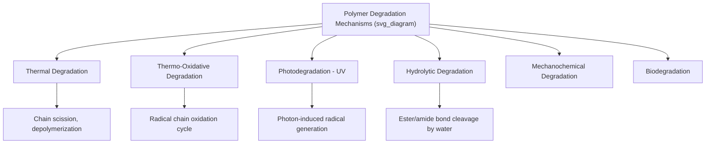
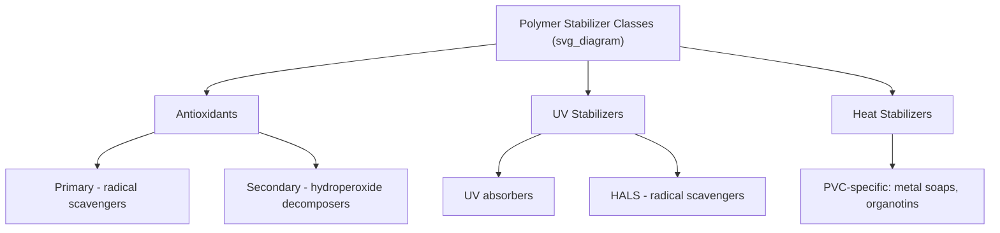

## Polymer Degradation and Additives

### Overview

Polymers are susceptible to progressive chemical and physical degradation during processing, storage, and service life, arising from thermal, oxidative, photochemical (UV), mechanical, chemical, and biological mechanisms. Degradation manifests as chain scission (molecular weight reduction), cross-linking, or the formation of chromophoric/reactive degradation products, ultimately compromising mechanical, optical, and chemical properties. Additives are compounded into polymer formulations specifically to mitigate these degradation pathways or to impart other functional/processing benefits.

### Thermal Degradation

**Mechanism**

At sufficiently elevated temperature (during processing or in high-temperature service), polymer chains can undergo random or chain-end **scission**, breaking backbone bonds and reducing molecular weight, or, in some polymers, **depolymerization** (unzipping), where the chain sequentially releases monomer units from a chain end.

**Key Points**

- Susceptibility to thermal degradation is strongly chemistry-dependent: PMMA and polyoxymethylene (POM/acetal) are notably prone to unzipping depolymerization, while many vinyl polymers (e.g., polyethylene) undergo predominantly random chain scission
- Processing-related thermal degradation is a major practical concern in extrusion and injection molding, where localized shear heating can create hot spots exceeding the nominal set processing temperature, particularly in regions of high shear (screw tips, gates, thin sections)
- Consequences include reduced molecular weight (loss of mechanical properties, increased melt flow/reduced viscosity), discoloration (yellowing, browning), and, in severe cases, generation of volatile decomposition products (odor, surface defects, potential processing hazards)

### Thermo-Oxidative Degradation

**Mechanism**

The dominant degradation pathway for most polymers under combined heat and oxygen exposure (including during melt processing in the presence of residual/entrained air), proceeding via a well-established autocatalytic **radical chain mechanism**:

$$\text{Initiation:} \quad RH \rightarrow R^{\bullet} + H^{\bullet}$$

$$\text{Propagation:} \quad R^{\bullet} + O_2 \rightarrow ROO^{\bullet}$$

$$ROO^{\bullet} + RH \rightarrow ROOH + R^{\bullet}$$

$$\text{Branching:} \quad ROOH \rightarrow RO^{\bullet} + {\cdot}OH$$

$$\text{Termination:} \quad R^{\bullet} + R^{\bullet} \rightarrow \text{(inert products)}$$

The hydroperoxide (ROOH) decomposition step is particularly significant because it generates two new radical species from one hydroperoxide molecule, creating a **branching, autocatalytic** cycle in which degradation rate accelerates over time unless interrupted.

**Key Points**

- Because the mechanism is self-propagating and self-accelerating once initiated, effective stabilization strategies must interrupt the cycle at multiple points (radical scavenging and hydroperoxide decomposition), rather than relying on a single mechanism
- Products of thermo-oxidative degradation (carbonyl groups, chain scission fragments, cross-linked gel) directly cause the discoloration, embrittlement, and property loss characteristic of aged/degraded polymer parts

### Photodegradation (UV Degradation)

**Mechanism**

Absorption of ultraviolet radiation (particularly UV-B, 280–315 nm, and UV-A, 315–400 nm, present in terrestrial sunlight) by chromophoric groups within the polymer (either inherent to the polymer chemistry, or introduced as processing-related impurities/degradation products) provides sufficient energy to cleave covalent bonds, generating free radicals that then propagate via the same oxidative radical chain mechanism described above — this combined process is often termed **photo-oxidation**.

**Key Points**

- Certain polymers are intrinsically more UV-susceptible due to chromophoric structural features: polymers containing carbonyl groups, aromatic rings, or unsaturation (e.g., polyolefins are relatively more susceptible than might be expected from their simple saturated hydrocarbon backbone, due to trace processing-induced carbonyl/hydroperoxide chromophores acting as UV absorbers that initiate degradation)
- Photodegradation is typically most severe at or very near the exposed surface, since UV absorption is strongest in the outermost material layer, often producing a characteristic surface-localized embrittlement, chalking, or cracking (craze networks) distinct from bulk thermal degradation
- Outdoor/weathering durability testing (natural exposure racks, accelerated weathering via xenon-arc or UV-fluorescent chambers) is standard practice for evaluating photodegradation resistance in application-relevant formulations

### Hydrolytic Degradation

**Mechanism**

Applicable primarily to condensation polymers containing hydrolytically susceptible backbone linkages (ester, amide, carbonate, urethane), in which water molecules react with and cleave the backbone linkage, reducing molecular weight.

$$\text{–C(O)–O–} + H_2O \rightarrow \text{–C(O)–OH} + \text{HO–}$$

**Key Points**

- Rate is strongly temperature- and humidity-dependent, and often catalyzed by acidic or basic conditions
- Practically significant for polyesters (PET, PLA), polyamides (nylon), polycarbonate, and polyurethanes, particularly during high-temperature processing of insufficiently dried resin (residual moisture causes molecular weight loss during melt processing, a critical quality control consideration for these resin families) and during long-term humid-environment service
- Deliberately exploited for biodegradable/bioresorbable polymers (e.g., polylactic acid, PLA; polyglycolic acid, PGA; and their copolymers) used in compostable packaging and resorbable medical implants/sutures, where controlled hydrolytic degradation is a design objective rather than a failure mode

### Mechanochemical and Other Degradation Modes

- **Mechanochemical degradation (shear degradation)**: High shear stress during processing (particularly in high-viscosity or filled/reinforced systems) can mechanically rupture chain bonds directly, independent of thermal or oxidative mechanisms, particularly significant for ultra-high molecular weight polymers
- **Ozone degradation**: Particularly significant for unsaturated (diene-based) elastomers, where ozone attacks residual carbon-carbon double bonds, causing characteristic surface cracking (often oriented perpendicular to applied/residual strain) in rubber products
- **Biodegradation**: Microbial/enzymatic attack on susceptible polymer chemistries (natural polymers, and deliberately designed biodegradable synthetic polymers such as PLA, PHA, and certain aliphatic polyesters), generally negligible for conventional commodity thermoplastics under typical service conditions but an active area of sustainable materials development

### Stabilizing Additives

**Antioxidants**

- **Primary antioxidants (radical scavengers)**: Typically hindered phenols or aromatic amines, which donate a hydrogen atom to peroxy radicals, interrupting the propagation cycle: $ROO^{\bullet} + AH \rightarrow ROOH + A^{\bullet}$, where the resulting antioxidant radical $A^{\bullet}$ is resonance-stabilized and relatively unreactive
- **Secondary antioxidants (hydroperoxide decomposers)**: Typically phosphites or thioesters, which decompose hydroperoxides via a non-radical pathway, preventing the branching step that would otherwise generate additional radicals
- Primary and secondary antioxidants are commonly used in combination (synergistic blends) to interrupt the oxidative cycle at multiple points

**UV Stabilizers**

- **UV absorbers**: Compounds (e.g., benzophenones, benzotriazoles) that preferentially absorb UV radiation and dissipate the energy harmlessly as heat, before it can be absorbed by polymer chromophores
- **Hindered Amine Light Stabilizers (HALS)**: Function primarily by scavenging radicals generated during photo-oxidation (via a regenerative nitroxide radical cycle), rather than by direct UV absorption; widely regarded as highly effective, particularly for polyolefins, and often used in combination with UV absorbers
- **Pigments (carbon black, TiO₂)**: Can provide substantial UV protection as a secondary function by physically blocking/scattering UV radiation, in addition to their primary coloring function

**Heat Stabilizers**

Particularly critical for PVC, which is prone to autocatalytic dehydrochlorination (HCl elimination) at typical processing temperatures. Heat stabilizers (historically lead- and cadmium-based, increasingly replaced by calcium-zinc and organotin systems due to toxicity/regulatory concerns) function by scavenging liberated HCl and/or replacing labile chlorine sites in the polymer backbone, suppressing the autocatalytic degradation cycle.

### Functional (Non-Stabilizing) Additives

| Additive Class | Function | Examples/Notes |
| --- | --- | --- |
| Plasticizers | Increase chain mobility, lower $T_g$, improve flexibility | Phthalates, adipates, citrates (phthalate use increasingly restricted in some applications due to health/regulatory concerns) |
| Fillers | Reduce cost, modify stiffness/properties | Calcium carbonate, talc, glass fiber, carbon black |
| Flame retardants | Reduce flammability, char formation, or interrupt combustion radical chain | Halogenated compounds (declining use), phosphorus-based, metal hydroxides (Al(OH)₃, Mg(OH)₂) |
| Colorants | Impart color | Organic pigments, inorganic pigments, dyes |
| Impact modifiers | Improve toughness | Rubber/elastomeric particles, core-shell impact modifiers |
| Nucleating agents | Control crystallization, refine spherulite size | Sorbitol derivatives, talc, specialty organic nucleators |
| Slip/anti-block agents | Reduce surface friction, prevent film sticking | Fatty acid amides (e.g., erucamide) |
| Antistatic agents | Reduce static charge accumulation | Ethoxylated amines, quaternary ammonium compounds |
| Blowing agents | Generate cellular/foamed structure | Chemical (azodicarbonamide) or physical (pentane, CO₂) blowing agents |

**Key Points**

- Plasticizers function by inserting small molecules between polymer chains, increasing free volume and chain mobility, thereby lowering $T_g$ and increasing flexibility — but plasticizers can migrate out of the polymer over time (particularly relevant for phthalate plasticizers in flexible PVC), causing embrittlement and raising environmental/health exposure considerations that have driven adoption of alternative, less migratory plasticizer chemistries
- Flame retardant selection involves significant trade-offs: halogenated flame retardants are often highly effective but raise toxicity/environmental persistence concerns (driving regulatory restriction in many jurisdictions), while non-halogenated alternatives (metal hydroxides, phosphorus-based systems) often require higher loading levels, which can compromise mechanical properties

### Characterizing and Monitoring Degradation

- **Molecular weight/GPC analysis**: Direct measurement of chain scission (molecular weight reduction) or cross-linking (molecular weight/gel increase) over time or exposure
- **FTIR spectroscopy**: Tracking growth of carbonyl absorption bands (carbonyl index) as a quantitative measure of oxidative degradation extent
- **Melt flow index (MFI) drift**: Practical, widely used indirect indicator of molecular weight change (thermal/oxidative degradation) during processing or reprocessing
- **Mechanical property retention testing**: Tensile, impact, or elongation-at-break testing before/after accelerated aging or weathering exposure, often the most application-relevant degradation metric
- **Discoloration/yellowing index measurement**: Optical assessment (e.g., via spectrophotometry, yellowness index per relevant standard methods) as a sensitive early indicator of oxidative/thermal degradation onset

**Example**

Unstabilized polypropylene provides a widely cited illustration of the practical necessity of stabilization additives: due to the tertiary hydrogen atoms present along its backbone (more readily abstracted than the secondary hydrogens in polyethylene), polypropylene is intrinsically highly susceptible to thermo-oxidative degradation, and unstabilized polypropylene can become significantly embrittled after only limited processing or short-term thermal/UV exposure — commercial polypropylene resins are therefore essentially always compounded with antioxidant packages (primary/secondary antioxidant combinations) and, for outdoor applications, HALS-based UV stabilization, without which the material would be commercially unviable for most durable-goods applications.

**Next Steps**

- Radical chain oxidation kinetics and stabilizer mechanism design
- Accelerated weathering testing methods (xenon-arc, QUV) and correlation to real-world exposure
- Biodegradable and compostable polymer design (PLA, PHA degradation pathways)
- PVC stabilization chemistry and regulatory trends in stabilizer selection
- Flame retardant mechanisms (gas-phase vs. condensed-phase action)
- Recycling and reprocessing effects on polymer molecular weight and stabilizer depletion