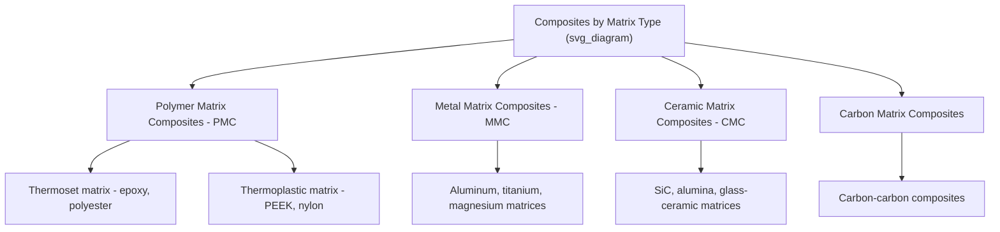
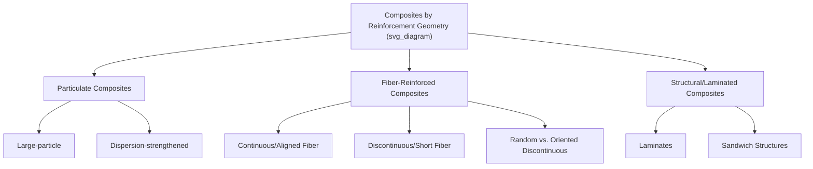

## Classification of Composite Materials

### Fundamental Definition

A composite material is a macroscopic combination of two or more chemically or physically distinct constituent materials, engineered to produce a material with properties superior to, or different from, those of the individual constituents acting alone. Composites are characterized by a **matrix phase** (continuous, surrounding phase) and a **reinforcement phase** (discontinuous or embedded phase), with a distinct interface between them that remains identifiable at the microstructural level — distinguishing composites from alloys or solid solutions, where constituents blend at the atomic/molecular scale.

**Key Points**

- The properties of a composite depend not only on the properties of the constituent phases individually, but critically on the geometry (shape, size, orientation, distribution) of the reinforcement phase and the quality of the matrix-reinforcement interfacial bond
- Composite classification schemes are generally organized along two primary axes: **matrix material type** and **reinforcement geometry/form**

### Classification by Matrix Material

**Polymer Matrix Composites (PMCs)**

The most widely used composite class by volume, employing thermoset (epoxy, polyester, vinyl ester, phenolic) or thermoplastic (PEEK, PPS, nylon, polypropylene) matrices. Advantages include low density, ease of processing, and relatively low cost; limitations include lower maximum service temperature and lower stiffness/strength ceiling compared to metal or ceramic matrix systems.

**Metal Matrix Composites (MMCs)**

Employ metallic matrices (commonly aluminum, titanium, magnesium) reinforced with ceramic particles, whiskers, or continuous fibers (SiC, Al₂O₃, carbon). Offer higher operating temperature capability, higher stiffness, and better thermal/electrical conductivity than PMCs, at generally higher cost and processing complexity, and often reduced ductility relative to the unreinforced metal.

**Ceramic Matrix Composites (CMCs)**

Employ ceramic matrices (SiC, alumina, glass-ceramics) reinforced predominantly with ceramic fibers (SiC, carbon, alumina), specifically engineered to overcome the intrinsic brittleness of monolithic ceramics — a crack propagating through the matrix is deflected or arrested at fiber-matrix interfaces, dramatically improving fracture toughness and enabling a degree of pseudo-ductile, graceful (non-catastrophic) failure absent in monolithic ceramics.

**Carbon-Carbon Composites**

Carbon fiber reinforcement within a carbon (graphitic/amorphous) matrix, offering exceptional high-temperature strength retention (often improving in strength up to ~2000°C in inert atmosphere), low density, and excellent thermal shock resistance, but requiring oxidation-protective coatings for use in oxidizing high-temperature environments (e.g., atmospheric re-entry, brake systems).

### Classification by Reinforcement Geometry

**Particulate Composites**

Reinforcement phase consists of particles with roughly equiaxed dimensions, embedded within the matrix.

- **Large-particle composites**: Particles are large enough (generally micrometer scale or larger) that load transfer and strengthening occur primarily through direct mechanical constraint of matrix deformation by the harder, stiffer particles; particle-matrix interaction is analyzed via continuum mechanics rather than atomic-scale interactions. Examples: concrete (cement matrix with sand/gravel aggregate), particle-filled polymers, cermets (ceramic particles in a metal matrix, e.g., WC-Co cutting tool materials)
- **Dispersion-strengthened composites**: Very fine particles (typically 0.01–0.1 μm), too small to be resolved by conventional optical microscopy, that strengthen the matrix primarily by impeding dislocation motion at the atomic/nanoscale (analogous in mechanism to precipitation strengthening, but the dispersed particles are typically thermally stable and not formed by phase transformation within the matrix itself). Example: thoria-dispersed (TD) nickel, oxide-dispersion-strengthened (ODS) superalloys

**Fiber-Reinforced Composites**

Reinforcement phase consists of fibers, exploiting the fact that fibrous materials generally exhibit much higher strength than the same material in bulk form (due to reduced flaw population/size in fine fiber cross-sections, per Griffith/Weibull statistical size effects).

- **Continuous (aligned) fiber composites**: Fibers span the full part dimension in the loading direction, providing maximum stiffness/strength in the fiber direction but pronounced anisotropy (much weaker transverse to the fiber direction)
- **Discontinuous (short) fiber composites**: Fibers are shorter than the part dimension; can be aligned (via processing-induced flow orientation) or randomly oriented, generally offering lower stiffness/strength than continuous fiber composites but improved processability (compatible with injection molding, for example) and reduced anisotropy in randomly oriented systems

**Key Points**

- Load transfer in discontinuous fiber composites depends critically on the **critical fiber length ($l_c$)** — the minimum fiber length required for the fiber to be stressed to its full strength via interfacial shear load transfer before fiber pull-out or matrix failure occurs; fibers shorter than $l_c$ transfer load inefficiently
- Fiber orientation distribution is a first-order determinant of discontinuous fiber composite mechanical anisotropy and must be characterized (e.g., via micro-CT or optical sectioning) for accurate property prediction, particularly in injection-molded short-fiber composites where flow-induced orientation varies significantly with location and processing conditions

### Classification by Structural (Laminated) Form

**Laminate Composites**

Composed of two or more distinct layers (plies) bonded together, each ply often itself a fiber-reinforced composite with a specific fiber orientation; stacking sequence and individual ply orientation are primary design variables governing overall laminate stiffness, strength, and anisotropy (analyzed via classical laminate theory).

**Sandwich Structures**

A specific structural composite configuration consisting of two thin, stiff, strong face sheets (often themselves fiber-reinforced composite laminates, or metal) bonded to a thick, low-density core (honeycomb, foam, or balsa wood), engineered to maximize bending stiffness-to-weight ratio by placing the stiff face sheets at maximum distance from the neutral bending axis, analogous in structural principle to an I-beam.

$$\frac{EI_{\text{sandwich}}}{W} \gg \frac{EI_{\text{solid}}}{W}$$

for equivalent panel weight $W$, reflecting the disproportionate bending stiffness benefit gained by concentrating stiff material away from the neutral axis — the core's primary structural role is to resist shear and maintain face sheet separation, rather than to carry significant bending load itself.

### Classification by Reinforcement Material

| Reinforcement Type | Characteristics | Typical Use |
| --- | --- | --- |
| Glass fiber (E-glass, S-glass) | High strength, low cost, moderate stiffness, electrically insulating | General-purpose FRP, marine, automotive, wind turbine blades |
| Carbon fiber | Very high stiffness and strength, low density, electrically conductive, higher cost | Aerospace, high-performance automotive, sporting goods |
| Aramid fiber (e.g., Kevlar-type) | High tensile strength, excellent impact/ballistic energy absorption, poor compressive strength | Ballistic armor, ropes, impact-resistant panels |
| Boron fiber | Very high stiffness, historically significant, high cost | Selected aerospace structural applications (largely superseded by carbon fiber) |
| Ceramic fiber (SiC, alumina) | High-temperature stability, used in CMCs and select MMCs | High-temperature aerospace, CMC turbine components |
| Natural fiber (flax, hemp, jute) | Lower cost, lower density, renewable, more variable properties | Automotive interior panels, sustainable/lightweight applications |

### Hybrid and Multi-Scale Composites

**Hybrid Composites**

Incorporate two or more distinct reinforcement types (e.g., glass and carbon fiber together) within a single matrix, engineered to balance cost, stiffness, strength, and impact toughness by exploiting complementary properties of each reinforcement type (e.g., carbon fiber for stiffness combined with aramid or glass fiber for improved impact tolerance).

**Nanocomposites**

Incorporate reinforcement with at least one dimension at the nanoscale (typically <100 nm) — nanoparticles, nanoclays, carbon nanotubes, or graphene — exploiting very high specific surface area to achieve significant property enhancement (stiffness, barrier properties, flame retardancy) at relatively low reinforcement loading compared to conventional micro-scale fillers. [Inference — property enhancement magnitude and consistency in nanocomposites is strongly dependent on achieving good nanoscale dispersion and interfacial bonding, which remains a practical processing challenge affecting real-world performance variability]

### Comparative Summary by Matrix Class

| Property | PMC | MMC | CMC |
| --- | --- | --- | --- |
| Density | Lowest | Intermediate | Intermediate-high |
| Maximum service temperature | Lowest (typically <300°C) | Intermediate (up to ~500–600°C) | Highest (often >1000°C) |
| Stiffness/strength (specific) | High specific strength/stiffness | High, better high-temp retention than PMC | High stiffness, primary advantage is toughness relative to monolithic ceramic |
| Fracture behavior | Generally brittle-ish at fiber failure but with some energy absorption | More ductile than CMC, less than unreinforced metal | Pseudo-ductile via crack deflection; still limited relative to metals |
| Relative cost/processing complexity | Lowest-intermediate | Intermediate-high | Highest |

**Example**

Carbon fiber reinforced polymer (CFRP) aircraft primary structure illustrates the practical interplay of multiple classification axes simultaneously: it is a polymer matrix composite (thermoset epoxy matrix), employing continuous, aligned fiber reinforcement (carbon fiber), assembled as a laminate structure with a carefully engineered stacking sequence of plies at different fiber orientations (e.g., 0°/±45°/90°) to achieve a tailored, application-specific balance of stiffness and strength in multiple loading directions — demonstrating that real engineering composites are typically classified along several of these schemes simultaneously rather than fitting a single category alone.

**Next Steps**

- Rule of mixtures and micromechanics of fiber-reinforced composite stiffness/strength
- Classical laminate theory and stacking sequence design
- Interfacial bonding and fiber-matrix load transfer mechanisms
- Ceramic matrix composite toughening via crack deflection
- Sandwich panel core material selection (honeycomb, foam)
- Nanocomposite dispersion techniques and property scaling