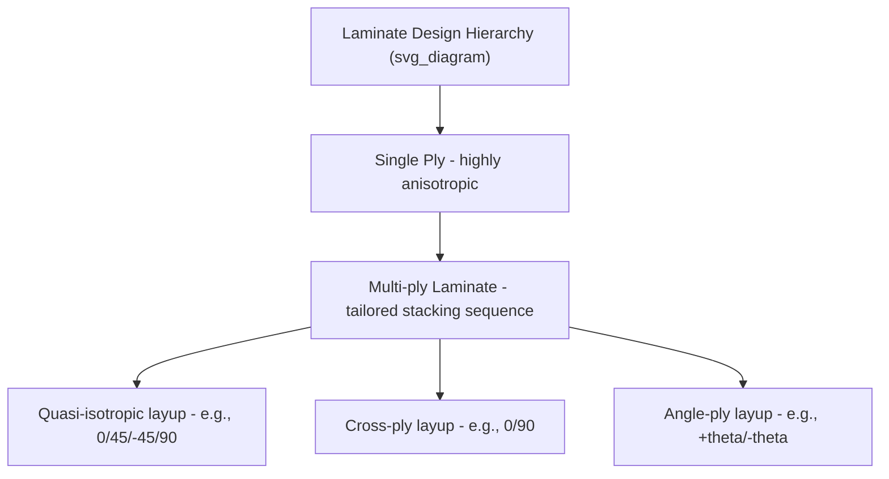

## Fiber Reinforced Composites

### Fundamental Concept

Fiber-reinforced composites (FRCs) combine a continuous or discontinuous fiber reinforcement phase, which typically carries the majority of applied mechanical load, with a matrix phase that binds the fibers together, distributes and transfers load to and between fibers, and protects fibers from environmental damage and abrasion. The exceptional strength-to-weight and stiffness-to-weight ratios achievable in FRCs arise from combining high-strength, high-stiffness fibers (exploiting the reduced flaw population of fine fiber cross-sections) with a lightweight, tough matrix capable of effective load transfer.

**Key Points**

- Fibers alone typically cannot be used as structural materials directly (they are one-dimensional and cannot resist compressive buckling or transverse/shear loads); the matrix provides these complementary functions
- The matrix alone is typically far weaker and less stiff than the reinforced composite; the fiber reinforcement provides the primary mechanical performance improvement

### Constituent Phases and Their Roles

**Fiber (Reinforcement) Phase**

Carries the majority of applied load, particularly along the fiber axis; provides primary stiffness and strength.

**Matrix Phase**

- Transfers and distributes load between fibers (particularly critical at fiber breaks or fiber ends in discontinuous systems)
- Protects fibers from abrasion, moisture, and chemical/environmental degradation
- Provides transverse and shear load-carrying capability (directions where fibers alone contribute little)
- Prevents/delays fiber buckling under compressive loading
- Determines maximum service temperature and processing method

**Interface/Interphase**

The region of contact (and often chemical/physical transition) between fiber and matrix, critically governing load transfer efficiency, fracture behavior (fiber pull-out vs. fiber-matrix debonding vs. fiber fracture), and environmental durability. Fiber surface treatments (sizing agents, coupling agents such as silanes for glass fiber-polymer systems) are specifically engineered to optimize this interfacial bond strength.

### Fiber Types and Properties

| Fiber Type | Tensile Strength (approx.) | Tensile Modulus (approx.) | Density (g/cm³) | Notable Characteristics |
| --- | --- | --- | --- | --- |
| E-glass | ~3.4 GPa | ~72 GPa | ~2.5 | Low cost, electrically insulating, moderate stiffness |
| S-glass | ~4.5 GPa | ~86 GPa | ~2.5 | Higher strength/stiffness than E-glass, higher cost |
| Carbon (standard modulus) | ~3.5–4.5 GPa | ~230 GPa | ~1.8 | High stiffness/strength, electrically conductive |
| Carbon (high modulus) | ~2.5–3.5 GPa | ~400+ GPa | ~1.9–2.0 | Very high stiffness, generally reduced strength/strain-to-failure |
| Aramid (e.g., Kevlar-type) | ~3.0–3.6 GPa | ~70–130 GPa | ~1.4 | Excellent toughness/impact resistance, poor compressive strength |
| Boron | ~3.5 GPa | ~400 GPa | ~2.6 | Very high stiffness, high cost, largely historical use |
| Basalt | ~3.0–4.8 GPa | ~80–90 GPa | ~2.7 | Natural mineral fiber, moderate cost, good thermal resistance |

[Unverified] Exact property values vary meaningfully between fiber grades, manufacturers, and test methods; values above represent typical/illustrative ranges rather than fixed material constants.

### Micromechanics: Rule of Mixtures

**Longitudinal Modulus (isostrain, Voigt model)**

For continuous, aligned fibers loaded parallel to the fiber direction, both phases experience equal strain, giving a volume-fraction-weighted average modulus:

$$E_1 = E_f V_f + E_m V_m$$

where $E_f$, $E_m$ are fiber and matrix moduli, and $V_f$, $V_m$ are fiber and matrix volume fractions ($V_f + V_m = 1$).

**Transverse Modulus (isostress, Reuss model)**

For loading perpendicular to the fiber direction, both phases experience approximately equal stress:

$$\frac{1}{E_2} = \frac{V_f}{E_f} + \frac{V_m}{E_m}$$

**Key Points**

- Longitudinal modulus is dominated by the stiffer phase (typically the fiber), while transverse modulus is disproportionately limited by the compliant phase (typically the matrix) — this fundamental asymmetry is the mechanistic origin of the pronounced anisotropy characteristic of unidirectional fiber composites
- Real transverse modulus is generally somewhat lower than the simple Reuss prediction due to stress concentration effects around fibers not captured by the simplified isostress assumption; more refined micromechanics models (e.g., Halpin-Tsai equations) are commonly used for improved transverse property prediction

**Longitudinal Tensile Strength**

For a well-bonded composite with fiber strain-to-failure less than matrix strain-to-failure (the typical case), longitudinal strength is approximately:

$$\sigma_{1}^{*} = \sigma_f^{*} V_f + \sigma_m' (1-V_f)$$

where $\sigma_f^{*}$ is fiber tensile strength and $\sigma_m'$ is the matrix stress at the fiber failure strain (not matrix ultimate strength) — reflecting that composite failure is generally governed by fiber fracture, with the matrix contributing at whatever stress level it has reached at that strain.

### Critical Fiber Length and Discontinuous Fiber Load Transfer

For discontinuous (short) fiber composites, load is transferred into the fiber via interfacial shear stress along the fiber length rather than applied directly at fiber ends. The **critical fiber length** $l_c$ is the minimum length required for the fiber to reach its full tensile strength at its midpoint before matrix/interface shear failure or fiber pull-out occurs:

$$l_c = \frac{\sigma_f^{*} d}{2\tau_c}$$

where $d$ is fiber diameter and $\tau_c$ is the fiber-matrix interfacial shear strength (or matrix shear yield strength, whichever is limiting).

**Key Points**

- Fibers shorter than $l_c$ never reach their full tensile strength before pulling out, contributing less effectively to composite strength than longer fibers
- Fibers substantially longer than $l_c$ (typically $l > 15 l_c$ is often cited as approaching near-continuous-fiber efficiency) behave mechanically similar to continuous fibers for practical design purposes, though a stress-free (or reduced-stress) region persists at each fiber end regardless of overall fiber length
- Discontinuous fiber orientation efficiency factor ($\eta_o$) and length efficiency factor ($\eta_l$) are commonly incorporated into modified rule-of-mixtures expressions (e.g., the Krenchel or modified Halpin-Tsai/Cox shear-lag approaches) to account for real, non-ideal fiber length distributions and orientation states in discontinuous fiber composites

### Anisotropy and Laminate Design

A single unidirectional fiber-reinforced ply is highly **orthotropic** — exhibiting distinct mechanical properties along three mutually perpendicular material directions (fiber direction, in-plane transverse direction, and through-thickness direction), with the fiber direction typically an order of magnitude stiffer/stronger than the transverse direction.

To achieve balanced, application-appropriate properties in multiple directions, individual unidirectional plies are stacked at varying orientations (0°, ±45°, 90°, etc.) to form a **laminate**, with overall laminate stiffness and strength predicted using **classical laminate theory (CLT)**, which combines individual ply stiffness (transformed to a common global coordinate system) into an overall laminate stiffness matrix.

- **Cross-ply laminates** (0°/90°): Balance stiffness/strength in two orthogonal directions
- **Angle-ply laminates** (±θ): Tailored for specific combined loading (e.g., torsion, pressure vessels)
- **Quasi-isotropic laminates** (e.g., 0°/+45°/-45°/90°, repeated): Approximate in-plane isotropic behavior by combining multiple orientations, at some sacrifice of maximum achievable stiffness/strength in any single direction compared to a fully unidirectional layup

### Failure Mechanisms

**Key Points**

Fiber composite failure is generally more complex than isotropic material failure, often involving multiple, sometimes sequential, competing mechanisms:

- **Fiber fracture**: Governs longitudinal tensile failure when fiber strain-to-failure is reached
- **Matrix cracking**: Often the first observable damage mode, particularly in transverse or off-axis loading, occurring before ultimate laminate failure
- **Fiber-matrix debonding**: Interfacial failure, often preceding or accompanying fiber pull-out
- **Fiber pull-out**: Fibers pulling out of the matrix rather than fracturing, an important energy-absorbing toughening mechanism, particularly relevant to discontinuous fiber composites and post-matrix-cracking behavior in continuous fiber laminates
- **Delamination**: Separation between adjacent plies, often initiated at free edges, ply drops, or impact-damaged sites, and a particularly critical failure mode because it is often difficult to detect visually (especially from impact damage that leaves minimal surface indication) while substantially reducing compressive and buckling load capacity
- **Fiber microbuckling/kinking**: Compressive failure mode in which fibers buckle at a microscale, often within a localized kink band, generally the limiting mechanism for longitudinal compressive strength (compressive strength of unidirectional composites is typically lower than tensile strength, unlike many monolithic materials)

### Processing Methods for FRCs

- **Hand layup/wet layup**: Manual placement of fiber reinforcement (fabric or fiber mat) with resin applied by hand; low tooling cost, suited to low-volume/large/complex parts, generally higher void content and greater property variability than automated processes
- **Filament winding**: Continuous fiber, impregnated with resin, wound onto a rotating mandrel under controlled tension and angle; well suited to axisymmetric parts (pressure vessels, pipes)
- **Prepreg/autoclave processing**: Pre-impregnated fiber material (prepreg, with resin partially cured to a tacky "B-stage") laid up into the desired shape, then cured under heat and pressure in an autoclave; offers excellent fiber volume fraction control and low void content, widely used for high-performance aerospace structures
- **Resin transfer molding (RTM) and vacuum-assisted RTM (VARTM)**: Dry fiber preform placed in a closed mold, resin subsequently injected or infused; enables good surface finish on both faces and controlled fiber volume fraction
- **Pultrusion**: Continuous fiber pulled through a resin bath and then a heated shaping die, producing continuous constant-cross-section profiles (structural shapes, rebar) at high production rate

### Applications

- **Aerospace**: Primary and secondary structure (wings, fuselage sections, empennage) in modern commercial and military aircraft, exploiting high specific stiffness/strength for weight reduction
- **Wind energy**: Turbine blades (predominantly glass fiber, with carbon fiber increasingly used in spar caps for longer blades), requiring high fatigue resistance over multi-decade service life
- **Automotive**: Structural and semi-structural components in high-performance and increasingly mainstream vehicles, driven by lightweighting for fuel efficiency/range
- **Marine**: Boat hulls (predominantly glass fiber/polyester or vinyl ester), exploiting corrosion resistance and moldability into complex hull shapes
- **Sporting goods**: Bicycle frames, golf club shafts, tennis rackets, exploiting high specific stiffness and fatigue resistance
- **Civil infrastructure**: FRP rebar, structural strengthening wraps (particularly carbon fiber wrap for seismic retrofit and structural reinforcement of existing concrete/masonry structures)

### Key Design Parameters Summary

| Parameter | Influence on Composite Performance |
| --- | --- |
| Fiber volume fraction ($V_f$) | Higher $V_f$ generally increases stiffness/strength up to practical processing limits (typically ~60–70% max for continuous fiber composites) |
| Fiber orientation | Governs directional stiffness/strength; primary design variable in laminate engineering |
| Fiber length (discontinuous systems) | Must exceed critical length $l_c$ for efficient load transfer |
| Fiber-matrix interfacial bond quality | Governs load transfer efficiency, fracture toughness, and environmental durability |
| Void content | Even modest void content (a few percent) can significantly reduce interlaminar shear strength and fatigue performance |
| Stacking sequence | Governs bending stiffness distribution, interlaminar stresses, and susceptibility to delamination |

**Example**

A quasi-isotropic carbon fiber/epoxy laminate (e.g., [0/+45/-45/90]ₙs stacking sequence) illustrates the practical trade-off inherent in laminate design: while a fully unidirectional (all 0°) layup of the same total fiber content would achieve substantially higher stiffness and strength along the fiber direction, the quasi-isotropic layup sacrifices some of that peak directional performance in exchange for approximately uniform in-plane stiffness in all directions — a necessary design choice whenever the in-service loading direction is not reliably known in advance or varies significantly during service, as is common in many structural applications.

**Next Steps**

- Classical laminate theory (CLT) and the ABD stiffness matrix
- Micromechanics models: Halpin-Tsai and shear-lag theory
- Failure criteria for composites (Tsai-Wu, Tsai-Hill, maximum stress/strain)
- Delamination mechanics and interlaminar fracture toughness testing
- Fatigue behavior of fiber-reinforced composites
- Non-destructive inspection methods for composite structures (ultrasonic C-scan, thermography)