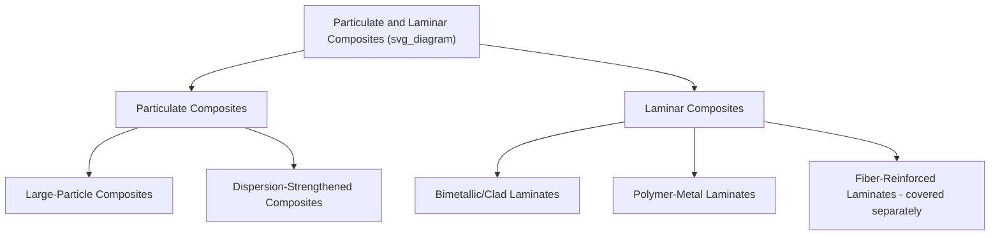

## Particulate and Laminar Composites

### Overview

Particulate and laminar composites represent two structurally distinct composite classes, differing fundamentally from fiber-reinforced composites in reinforcement geometry and, correspondingly, in the micromechanical basis for property enhancement. Particulate composites incorporate roughly equiaxed reinforcement particles dispersed within a matrix, while laminar composites are built from bonded, distinct layers (which may themselves be different materials, or the same material with differing orientation/properties).

### Particulate Composites: Classification

**Large-Particle Composites**

Reinforcement particles are large enough (generally >1 μm, often much larger) that the strengthening mechanism operates via continuum-mechanics-scale load transfer and constraint of matrix deformation, rather than through direct atomic-scale interaction with dislocations. The particle-matrix interaction is typically analyzed using bulk mechanical property combination rules rather than dislocation theory.

**Dispersion-Strengthened Composites**

Reinforcement particles are very fine (typically 0.01–0.1 μm, i.e., nanoscale), too small to be resolved by conventional optical microscopy, and strengthen the matrix primarily by impeding dislocation motion at the atomic/nanoscale — mechanistically analogous to precipitation hardening, but the dispersed particles are generally thermally stable, non-coherent, and not formed by phase transformation within the matrix (often introduced via powder metallurgy techniques such as mechanical alloying rather than precipitated from solid solution).

**Key Points**

- The size distinction between "large-particle" and "dispersion-strengthened" composites reflects a genuine mechanistic distinction, not merely an arbitrary size cutoff: large particles act as rigid mechanical constraints/load-sharing elements, while nanoscale dispersoids act as discrete, closely spaced obstacles that directly impede individual dislocation glide

### Micromechanics of Large-Particle Composites

**Rule of Mixtures (Elastic Modulus Bounds)**

Analogous to fiber composite bounds, large-particle composite elastic modulus is bracketed between an upper (Voigt, isostrain) and lower (Reuss, isostress) bound:

$$E_{upper} = E_p V_p + E_m V_m \qquad E_{lower} = \left(\frac{V_p}{E_p} + \frac{V_m}{E_m}\right)^{-1}$$

where subscripts $p$ and $m$ denote particle and matrix phases, respectively. Real particulate composite modulus typically falls between these bounds, since particle reinforcement (being non-continuous and randomly distributed, unlike aligned continuous fiber) does not achieve either idealized isostrain or isostress loading condition throughout the microstructure.

**Key Points**

- Because particulate reinforcement lacks the strong directional alignment of continuous fiber, particulate composites are generally quasi-isotropic (similar properties in all directions), a significant practical advantage over the pronounced anisotropy of unidirectional fiber composites when multi-directional loading is expected
- Particle shape, size distribution, volume fraction, and particle-matrix interfacial bonding all significantly influence achieved properties; well-bonded, well-dispersed particles generally provide more effective and predictable reinforcement than poorly dispersed or weakly bonded particles

### Dispersion Strengthening Mechanism

Dispersion strengthening operates via the **Orowan bowing mechanism**: dislocations moving through the matrix must bow between closely spaced, hard, non-shearable particles, requiring additional applied stress proportional to the inverse of the interparticle spacing:

$$\Delta\tau_{Orowan} \propto \frac{Gb}{\lambda}$$

where $G$ is shear modulus, $b$ is the Burgers vector magnitude, and $\lambda$ is the interparticle spacing.

**Key Points**

- Because dispersoid particles (typically stable oxides such as ThO₂ or Y₂O₃) are thermally stable and resist coarsening/dissolution even at elevated temperature, dispersion-strengthened composites retain strength at temperatures where conventional precipitation-hardened alloys would over-age and soften (precipitate coarsening/dissolution is a major limitation of precipitation hardening at high homologous temperature) — this is the primary practical advantage of dispersion strengthening over precipitation hardening for high-temperature structural applications
- Examples: thoria-dispersed (TD) nickel, oxide-dispersion-strengthened (ODS) superalloys (Y₂O₃-dispersed Fe- or Ni-based alloys) used in gas turbine and nuclear reactor high-temperature components

### Representative Particulate Composite Systems

| System | Matrix | Particle Reinforcement | Application |
| --- | --- | --- | --- |
| Concrete | Cement paste | Sand, gravel aggregate | Construction, structural |
| Cermets (e.g., WC-Co) | Cobalt (metal) | Tungsten carbide (ceramic) | Cutting tools, wear-resistant parts |
| Filled/particulate polymers | Thermoplastic/thermoset | CaCO₃, talc, silica, glass beads | Cost reduction, stiffness modification, general-purpose molded parts |
| Metal matrix particulate composites | Aluminum, magnesium | SiC, Al₂O₃ particles | Automotive brake rotors, aerospace structural components |
| ODS superalloys | Ni- or Fe-based superalloy | Y₂O₃ nanoscale dispersoids | Gas turbine blades, high-temperature components |
| Elastomer-particulate composites | Rubber | Carbon black, silica | Tire compounds (reinforcement, wear resistance) |

**Example**

Carbon black-reinforced rubber in tire tread compounds illustrates a particularly important practical particulate composite: fine carbon black particles (often in the tens of nanometers range, spanning the boundary between large-particle and dispersion-scale reinforcement) dramatically improve tensile strength, abrasion resistance, and tear resistance of the rubber matrix compared to unfilled rubber, primarily through strong particle-matrix interaction and the particles' effect on local chain mobility and network structure — a reinforcement mechanism distinct from, though sometimes compared to, dispersion strengthening in metals.

### Laminar Composites: Definition and Rationale

Laminar (laminate) composites consist of two or more distinct layers bonded together, engineered to combine the favorable properties of each individual layer while offsetting the limitations of any single layer used alone, or to achieve directional property tailoring by controlling the properties/orientation of successive layers.

**Key Points**

- Laminar composites are distinguished from fiber-reinforced laminates (covered separately) primarily by the nature of the layer itself: laminar composites broadly include any bonded-layer structure, including metal-metal, metal-polymer, and metal-ceramic combinations, not solely stacked unidirectional fiber-reinforced plies
- The primary structural/functional rationale for lamination is typically one or more of: combining dissimilar property advantages (e.g., corrosion resistance of one layer with strength of another), achieving directional property tailoring, or providing a specific functional surface (wear, corrosion, decorative) over a structural core

### Types of Laminar Composites

**Bimetallic/Clad Laminates**

Two or more distinct metal layers metallurgically bonded (via roll bonding, explosive welding, or diffusion bonding), combining properties unattainable in a single alloy.

- **Clad metals**: A base metal bonded to a thin surface layer of a different metal chosen for corrosion resistance, wear resistance, or appearance, while the base metal provides bulk structural properties at lower cost than a monolithic part of the cladding alloy (e.g., stainless steel-clad carbon steel pressure vessel plate, combining stainless corrosion resistance with lower-cost carbon steel structural bulk)
- **Bimetallic strips**: Two metals with significantly different coefficients of thermal expansion bonded together, exploited for temperature-sensing/actuating applications (thermostats, circuit breakers) where differential thermal expansion causes predictable, repeatable bending/curvature change with temperature

**Polymer-Metal and Polymer-Polymer Laminates**

- **Safety glass (laminated glass)**: Glass plies bonded with a polymer interlayer (PVB), combining glass's stiffness/optical clarity with the polymer interlayer's ability to hold fragments together upon fracture and absorb impact energy
- **Multilayer packaging films**: Combining distinct polymer layers (e.g., a barrier layer such as EVOH sandwiched between polyolefin structural/sealant layers) to achieve a combination of gas barrier, mechanical, and heat-sealing properties unattainable from any single polymer layer alone

**Honeycomb and Sandwich Laminates**

Though sometimes classified separately, sandwich structures (thin, stiff face sheets bonded to a low-density core) represent a specific and structurally important laminar composite configuration, engineered to maximize bending stiffness-to-weight ratio, as discussed in the context of fiber-reinforced composite structural forms.

### Mechanical Analysis Considerations for Laminates

- **Rule of mixtures (through-thickness properties)**: For properties measured parallel to the layer plane (in-plane modulus, for instance), a volume-fraction-weighted average (isostrain-type) approach is generally applicable, analogous to fiber composite longitudinal modulus prediction
- **Interfacial bond integrity**: Delamination (separation at the layer interface) is a critical and often limiting failure mode in laminar composites generally, not only in fiber-reinforced laminates — bond quality, thermal expansion mismatch between layers, and residual stresses from the bonding process all influence delamination resistance
- **Residual stress from processing**: Laminar composites bonded at elevated temperature (e.g., roll-bonded or hot-pressed clad metals) develop residual stresses upon cooling to room temperature if the constituent layers have differing coefficients of thermal expansion — this can be either detrimental (promoting delamination or warping) or deliberately exploited (as in bimetallic strip actuators, or in some cases to induce beneficial compressive surface stress in a cladding layer)

### Applications Summary

| Application | Composite Type | Key Benefit |
| --- | --- | --- |
| Cutting tool inserts | Particulate (cermet, WC-Co) | Combines ceramic hardness with metallic toughness |
| Concrete structures | Particulate (aggregate-cement) | Low-cost, high compressive strength structural material |
| Gas turbine blades | Particulate (ODS superalloy) | High-temperature strength retention |
| Corrosion-resistant pressure vessels | Laminar (clad metal) | Corrosion resistance at reduced material cost |
| Thermostats/circuit breakers | Laminar (bimetallic strip) | Predictable thermally-driven mechanical actuation |
| Vehicle windshields | Laminar (laminated safety glass) | Post-fracture integrity, impact energy absorption |
| Food/pharmaceutical packaging | Laminar (multilayer polymer film) | Combined gas barrier and mechanical/sealing performance |
| Tire tread compounds | Particulate (carbon black-rubber) | Improved abrasion resistance and strength |

**Next Steps**

- Orowan bowing mechanism and dispersion strengthening kinetics
- Cermet and hardmetal processing (powder metallurgy, sintering)
- Roll bonding and explosive welding processes for clad metal production
- Classical laminate theory for fiber-reinforced laminate stacking design
- Delamination mechanics and interfacial fracture toughness testing
- Concrete as a particulate composite: aggregate grading and interfacial transition zone