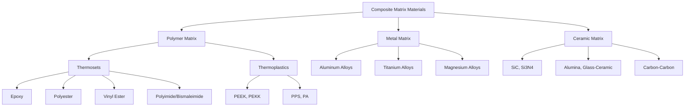

## Matrix Materials for Composites

### Definition and Function

The matrix in a composite material is the continuous phase that surrounds and binds the reinforcement (fibers, particles, or whiskers) into a coherent structural unit. While the reinforcement typically carries the majority of applied load due to its superior stiffness and strength, the matrix performs several indispensable roles:

- **Load transfer**: Transmits externally applied stresses to the reinforcement via interfacial shear
- **Fiber protection**: Shields reinforcement from environmental degradation (moisture, oxidation, chemical attack) and mechanical abrasion
- **Fiber positioning**: Maintains fiber orientation, spacing, and alignment as designed
- **Damage tolerance**: Provides a crack-blunting or crack-deflecting mechanism, preventing catastrophic propagation between fibers
- **Interlaminar/transverse properties**: Governs properties in directions where fibers do not dominate (e.g., through-thickness shear, compression)
- **Surface finish**: Determines the composite's final surface quality, chemical resistance, and dielectric behavior

The matrix generally has lower stiffness and strength than the reinforcement but higher ductility and toughness (with exceptions, such as ceramic matrices).

### Classification of Matrix Materials

Matrix materials are classified by chemistry into three broad families, each defining a distinct composite category:

### Polymer Matrix Composites (PMCs)

PMCs are the most widely used composite class due to low density, ease of processing, and low cost relative to metal and ceramic matrices.

#### Thermosetting Matrices

Thermosets cure via irreversible cross-linking reactions, forming a rigid three-dimensional network that cannot be remelted or reshaped once cured.

**Epoxy Resins**

- Formed by reaction of epoxide-terminated prepolymers (commonly diglycidyl ether of bisphenol A, DGEBA) with curing agents (amines, anhydrides)
- Cure shrinkage is low (typically 1-5%), minimizing residual stress and dimensional distortion
- Excellent adhesion to fiber reinforcements due to polar hydroxyl and ether groups
- Glass transition temperature ($T_g$) ranges from approximately 120°C to 220°C depending on formulation
- Dominant matrix in aerospace-grade carbon fiber reinforced polymer (CFRP), representing the majority of primary structure on modern commercial aircraft
- Limitations: moisture absorption reduces $T_g$ and mechanical properties in hot/wet service; relatively brittle unless toughened with rubber or thermoplastic modifiers

**Polyester Resins (Unsaturated Polyester, UP)**

- Cured via free-radical copolymerization with styrene monomer, initiated by peroxide catalysts
- Lower cost and faster cure than epoxy; widely used in marine, automotive, and construction applications
- Higher cure shrinkage (5-8%) than epoxy, leading to greater residual stress
- Lower mechanical properties and thermal resistance compared to epoxy and vinyl ester

**Vinyl Ester Resins**

- Structurally similar to epoxy (epoxy backbone) but terminated with unsaturated ester groups, cured like polyester via free-radical mechanism
- Combines epoxy-like toughness and corrosion resistance with polyester-like processing speed
- Common in corrosion-resistant tanks, pipes, and marine hulls

**Polyimides and Bismaleimides (BMI)**

- High-temperature thermosets retaining mechanical properties up to 250-300°C (polyimide) or 230-260°C (BMI)
- Used in engine nacelles, high-temperature aerospace structures
- More brittle and costlier to process than epoxy; often require high-temperature autoclave cure cycles

**Phenolic Resins**

- Formed by condensation of phenol and formaldehyde
- Excellent fire, smoke, and toxicity (FST) performance; low flammability and low smoke generation
- Used in aircraft interior panels, mass transit interiors
- Cure releases water vapor, which can create voids if not managed via controlled pressure cure

#### Thermoplastic Matrices

Thermoplastics consist of linear or branched polymer chains held together by secondary (van der Waals or hydrogen) bonding, allowing repeated melting and reforming.

**Key Advantages over Thermosets**

- Higher fracture toughness ($G_{IC}$) due to ductile chain sliding mechanisms
- Unlimited shelf life at room temperature (no refrigeration required, unlike thermoset prepregs)
- Faster processing cycles (minutes vs. hours) via melt consolidation, amenable to automated tape placement and welding
- Recyclable and reformable
- Generally superior chemical and moisture resistance

**Common Thermoplastic Matrices**

- **PEEK (polyetheretherketone)**: semi-crystalline, $T_g \approx 143°C$, melting point $\approx 343°C$; used in aerospace brackets, medical implants
- **PEKK (polyetherketoneketone)**: similar to PEEK with tunable crystallization kinetics via ketone/ether ratio
- **PPS (polyphenylene sulfide)**: good chemical resistance, lower cost than PEEK, melting point $\approx 285°C$
- **PA (polyamide/nylon)**: common in automotive and general industrial composites
- **PEI (polyetherimide)**: amorphous, high $T_g$, good flame resistance

**Processing Challenge**: High melt viscosities (orders of magnitude greater than uncured thermoset resins) require elevated temperatures and pressures for fiber impregnation, historically limiting thermoplastic composite adoption to prepreg tape or powder-impregnated forms.

#### Comparison Table

| Property | Thermosets (Epoxy) | Thermoplastics (PEEK) |
| --- | --- | --- |
| Processing temperature | Room temp to ~180°C cure | 350-400°C melt |
| Processing time | Hours (cure cycle) | Minutes (consolidation) |
| Fracture toughness | Lower (brittle) | Higher (ductile) |
| Shelf life (uncured) | Limited, requires refrigeration | Unlimited |
| Solvent resistance | Generally good | Excellent |
| Reformability | None (thermoset network) | Reformable/weldable |
| Typical cost | Lower | Higher |

### Metal Matrix Composites (MMCs)

MMCs use a ductile metallic matrix, typically reinforced with ceramic fibers, whiskers, or particulates, to combine metallic toughness/conductivity with ceramic stiffness/wear resistance.

**Common Matrix Alloys**

- **Aluminum alloys** (2xxx, 6xxx series): most common MMC matrix due to low density ($\approx 2.7 \text{ g/cm}^3$), good processability, and compatibility with SiC or Al₂O₃ reinforcement
- **Titanium alloys** (Ti-6Al-4V): used where higher-temperature capability and specific strength are required, e.g., SiC-fiber-reinforced Ti for jet engine components
- **Magnesium alloys**: lowest density metallic matrix option, used where weight is critical

**Processing Routes**

- Liquid-state: stir casting, squeeze casting, infiltration
- Solid-state: powder metallurgy, diffusion bonding, hot isostatic pressing (HIP)
- In-situ: reinforcement phase formed by controlled reaction within the melt

**Key Considerations**

- Coefficient of thermal expansion (CTE) mismatch between metal matrix and ceramic reinforcement generates residual thermal stresses on cooling from processing temperature
- Interfacial reactions (e.g., Al reacting with SiC to form Al₄C₃) can degrade the interface; often mitigated with fiber coatings (e.g., carbon or TiB₂ barrier layers)
- Higher operating temperature capability than PMCs, with improved wear resistance and thermal/electrical conductivity retained from the metallic matrix

### Ceramic Matrix Composites (CMCs)

CMCs address the intrinsic brittleness of monolithic ceramics by embedding fibers (typically SiC or carbon) that bridge cracks and enable graceful, non-catastrophic failure.

**Common Matrix Materials**

- **Silicon carbide (SiC)**: high-temperature capability (>1200°C), used in aerospace turbine components (e.g., CFM LEAP engine CMC shrouds and combustor liners)
- **Silicon nitride (Si₃N₄)**: good thermal shock resistance
- **Alumina (Al₂O₃)**: oxide-oxide CMCs offering superior oxidation resistance since both fiber and matrix are already oxides
- **Glass-ceramics** (e.g., lithium aluminosilicate, LAS): lower processing temperatures than SiC-based systems
- **Carbon**: carbon-carbon (C/C) composites, used in rocket nozzles, brake discs, and atmospheric re-entry heat shields

**Processing Routes**

- Chemical vapor infiltration (CVI): gaseous precursor infiltrates a fiber preform and deposits matrix via decomposition; slow but yields high-purity matrix with controlled porosity
- Polymer infiltration and pyrolysis (PIP): preceramic polymer infiltrates preform, then pyrolyzes to ceramic; typically requires multiple infiltration cycles to reduce residual porosity
- Melt infiltration (MI): molten silicon infiltrates a porous carbon/SiC preform, reacting to form SiC in situ
- Reaction bonding and sintering: for oxide-based systems

**Key Design Principle**: The fiber-matrix interface must be engineered (often with a weak boron nitride or carbon interphase coating) to promote crack deflection along the interface rather than crack propagation straight through the fiber, which is what confers pseudo-ductile, non-catastrophic failure behavior on CMCs.

### Matrix Selection Criteria

| Criterion | Governs |
| --- | --- |
| Service temperature | Excludes matrices below their $T_g$ or melting point at operating conditions |
| Environmental exposure | Moisture, UV, fuel/chemical resistance requirements |
| Processing method compatibility | Autoclave, resin transfer molding, filament winding, etc. |
| Mechanical toughness requirements | Damage tolerance, impact resistance |
| Cost and production volume | Thermosets favor low-to-mid volume; thermoplastics favor high-volume/automotive |
| Fiber compatibility | Chemical/thermal compatibility, wetting behavior, interfacial bond strength |

### Matrix-Dominated vs. Fiber-Dominated Properties

In continuous fiber composites, properties along the fiber direction (longitudinal modulus, longitudinal strength) are fiber-dominated and follow rule-of-mixtures behavior:

$$E_1 = E_f V_f + E_m V_m$$

Properties transverse to the fiber, and interlaminar shear strength, are matrix-dominated and depend heavily on matrix modulus, matrix strength, and fiber-matrix interfacial bond quality. The transverse modulus is commonly estimated using the Halpin-Tsai or inverse rule-of-mixtures relation:

$$\frac{1}{E_2} = \frac{V_f}{E_f} + \frac{V_m}{E_m}$$

This distinction explains why matrix selection critically governs off-axis strength, compressive strength (fiber microbuckling is resisted by matrix shear stiffness), interlaminar fracture toughness, and hot/wet performance, even though the matrix contributes only a minor fraction of longitudinal strength.

### Interfacial Bonding

The fiber-matrix interface is often treated as a distinct third phase governing load transfer efficiency. Sizing agents (e.g., silane coupling agents on glass fibers, epoxy-compatible sizings on carbon fibers) are applied to fiber surfaces to:

- Promote chemical or mechanical bonding to the matrix
- Protect fibers from processing damage
- Control interfacial shear strength (IFSS), balancing load transfer against desired failure mode (fiber pull-out vs. brittle fracture)

Interfacial shear strength is commonly characterized via single-fiber fragmentation tests or microbond pull-out tests.

**Related Topics**

- Reinforcement Fibers (Glass, Carbon, Aramid, Ceramic)
- Fiber-Matrix Interface and Interfacial Shear Strength
- Composite Manufacturing Processes (Autoclave, RTM, Filament Winding, Pultrusion)
- Micromechanics: Rule of Mixtures and Halpin-Tsai Equations
- Residual Stresses and CTE Mismatch in Composites
- Failure Mechanisms in Composites (Delamination, Microbuckling, Fiber Pull-out)
- Sizing Agents and Coupling Chemistry
- Prepreg Technology and Cure Kinetics