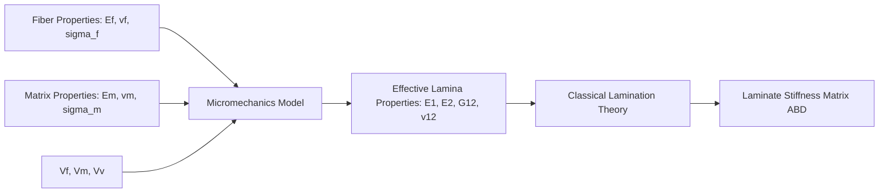

## Micromechanics of Composites

### Scope and Purpose

Micromechanics analyzes composite behavior at the constituent scale (fiber, matrix, and interface) to predict effective macroscopic (lamina-level) properties from constituent properties and geometric arrangement. It bridges the gap between materials science (constituent properties) and structural mechanics (laminate/structure analysis), providing the input properties—longitudinal modulus, transverse modulus, shear modulus, Poisson's ratio, strengths—used in classical lamination theory and structural design.

Micromechanics operates under the assumption of a representative volume element (RVE): a statistically representative sample of the composite microstructure, small relative to the structure but large relative to fiber diameter and spacing, over which averaged (effective/homogenized) properties are computed.

### Fundamental Parameters

**Fiber Volume Fraction ($V_f$)**

The single most influential micromechanical parameter, defined as:

$$V_f = \frac{v_f}{v_f + v_m + v_v}$$

where $v_f$, $v_m$, $v_v$ are the volumes of fiber, matrix, and voids respectively. Typical practical values range from 0.5 to 0.65 for aerospace-grade prepreg laminates; theoretical maximum packing (hexagonal array) is approximately 0.9069, but this is unachievable in practice due to fiber misalignment and processing constraints.

**Matrix Volume Fraction ($V_m$)** and **Void Volume Fraction ($V_v$)** complete the volume balance: $V_f + V_m + V_v = 1$. Void content above roughly 1-2% is typically flagged as a manufacturing quality concern, since voids degrade matrix-dominated properties disproportionately.

**Mass/Weight Fraction Conversion**

Fiber weight fraction ($W_f$) relates to volume fraction via constituent densities:

$$V_f = \frac{W_f / \rho_f}{W_f/\rho_f + W_m/\rho_m}$$

### Rule of Mixtures (ROM)

The simplest micromechanics model, based on the assumption of iso-strain (longitudinal) or iso-stress (transverse) loading conditions.

#### Longitudinal Modulus ($E_1$)

Under longitudinal loading, fiber and matrix are assumed to experience equal strain (iso-strain, Voigt model):

$$E_1 = E_f V_f + E_m V_m$$

This linear ROM prediction agrees well with experimental data for longitudinal modulus because the stiff, continuous fibers dominate the response and strain compatibility at the interface is a reasonable assumption.

#### Transverse Modulus ($E_2$)

Under transverse loading, fiber and matrix are assumed to experience equal stress (iso-stress, Reuss model), giving the inverse rule of mixtures:

$$\frac{1}{E_2} = \frac{V_f}{E_f} + \frac{V_m}{E_m}$$

This simple inverse ROM significantly underpredicts actual transverse modulus because it neglects fiber-matrix interaction and stress concentration effects; it is rarely used for design without correction factors.

#### Major Poisson's Ratio ($\nu_{12}$)

$$\nu_{12} = \nu_f V_f + \nu_m V_m$$

#### In-Plane Shear Modulus ($G_{12}$)

Analogous inverse ROM form:

$$\frac{1}{G_{12}} = \frac{V_f}{G_f} + \frac{V_m}{G_m}$$

Like $E_2$, this simple form underpredicts real shear modulus and is typically replaced by semi-empirical models in practice.

### Halpin-Tsai Equations

The Halpin-Tsai model [Unverified: exact origin often attributed to Halpin and Tsai's 1969 interpolation of Hermans' self-consistent field solution] is a semi-empirical approach that significantly improves transverse and shear modulus predictions by introducing a curve-fitting parameter that captures reinforcement geometry effects. The general form is:

$$\frac{P}{P_m} = \frac{1 + \xi \eta V_f}{1 - \eta V_f}$$

where $P$ is the composite property (e.g., $E_2$, $G_{12}$), $P_m$ is the corresponding matrix property, and:

$$\eta = \frac{(P_f/P_m) - 1}{(P_f/P_m) + \xi}$$

$\xi$ is an empirical geometry/packing factor:

- $\xi = 2$ for $E_2$ prediction (circular fiber cross-section, square packing)
- $\xi = 1$ for $G_{12}$ prediction
- As $\xi \to \infty$, the equation reduces to the standard (Voigt) ROM
- As $\xi \to 0$, it reduces to the inverse (Reuss) ROM

The Halpin-Tsai formulation is widely used in industry practice because it offers a reasonable accuracy-to-complexity tradeoff without requiring finite element analysis, though it remains an approximation calibrated against experimental and numerical data rather than a closed-form elasticity solution.

### Elasticity-Based and Refined Models

**Chamis Equations**

A set of semi-empirical relations developed by Chamis, offering closed-form predictions for $E_2$, $G_{12}$, and $G_{23}$ incorporating a fiber packing/misalignment factor, commonly used in NASA and industry design tools.

**Composite Cylinder Assemblage (CCA) / Self-Consistent Field Models**

Exact elasticity solutions for concentric cylinder geometries (Hashin, Hill), providing exact bounds on transverse and shear moduli for the idealized case of a fiber surrounded by a matrix annulus, embedded in effective medium.

**Hashin-Shtrikman Bounds**

Provide rigorous upper and lower bounds on effective composite moduli based on variational principles, independent of specific microstructural geometry assumptions, useful for validating other models or bounding the possible range of properties when exact geometry is unknown.

### Micromechanics for Strength Prediction

Strength prediction is inherently more complex than stiffness prediction because failure is governed by local stress concentrations, statistical fiber strength distributions (typically modeled via Weibull statistics), and interfacial bond quality, rather than volume-averaged behavior.

#### Longitudinal Tensile Strength

Approximated (upper-bound, "rule of mixtures" strength) as:

$$\sigma_{1}^{ult} \approx \sigma_f^{ult} V_f + \sigma_m^{'} V_m$$

where $\sigma_m^{'}$ is the matrix stress at the fiber failure strain (not the matrix ultimate strength). This simple model neglects statistical fiber strength variability and progressive fiber failure accumulation; more rigorous treatments use Weibull-based fiber bundle theory or Monte Carlo simulation of sequential fiber breaks and local load redistribution.

#### Longitudinal Compressive Strength

Governed primarily by fiber microbuckling, a matrix-dominated instability mode. A widely cited approximate model (Rosen's model, [Unverified: simplified form; several refinements exist in the literature]) estimates:

$$\sigma_{1c}^{ult} \approx \frac{G_m}{1 - V_f}$$

This shear-mode microbuckling estimate typically overpredicts actual compressive strength because it neglects fiber waviness/misalignment and matrix nonlinearity; real composite compressive strengths are usually 20-60% of this idealized prediction and are heavily sensitive to manufacturing-induced fiber misalignment.

#### Transverse Tensile Strength

Highly sensitive to voids, interfacial bond quality, and local stress concentration around fibers; typically determined experimentally rather than predicted analytically due to sensitivity to microstructural defects.

### Representative Volume Element and Homogenization

Modern micromechanics increasingly relies on computational homogenization using finite element analysis of an RVE with periodic boundary conditions, allowing prediction of full stiffness tensors, nonlinear behavior, damage initiation, and progressive failure without closed-form assumptions. This approach captures effects that analytical models cannot, including:

- Realistic (non-idealized) fiber packing and clustering
- Local stress concentration fields around fibers
- Nonlinear matrix plasticity or viscoelasticity
- Progressive micro-damage (fiber-matrix debonding, matrix microcracking)

### Micromechanics Model Comparison

| Model | $E_1$ Accuracy | $E_2$/$G_{12}$ Accuracy | Complexity | Typical Use |
| --- | --- | --- | --- | --- |
| Rule of Mixtures | Good | Poor (underpredicts) | Very low | Preliminary/hand calculations |
| Halpin-Tsai | Good | Good | Low | Industry-standard design estimates |
| Chamis | Good | Good | Low | Design tools (e.g., legacy NASA codes) |
| CCA/Elasticity-based | Good | Very good | Moderate | Verification, bounding solutions |
| FE-based RVE Homogenization | Excellent | Excellent | High | Research, detailed design, damage prediction |

### Schematic: Micromechanics Input-Output Flow

### Representative Volume Element Schematic (svg_diagram)

<svg xmlns="http://www.w3.org/2000/svg" viewBox="0 0 500 300">
<rect x="0" y="0" width="500" height="300" fill="none" />
<text x="250" y="25" font-size="16" text-anchor="middle" font-family="sans-serif" font-weight="bold">Fiber Packing Arrangement (svg_diagram)</text>

<text x="120" y="55" font-size="13" text-anchor="middle" font-family="sans-serif">Square Packing</text>

<rect x="40" y="70" width="160" height="160" fill="`#e8e8e8`" stroke="#333" stroke-width="1.5" />

<circle cx="80" cy="110" r="28" fill="`#4a7ab5`" stroke="#222" />

<circle cx="160" cy="110" r="28" fill="`#4a7ab5`" stroke="#222" />

<circle cx="80" cy="190" r="28" fill="`#4a7ab5`" stroke="#222" />

<circle cx="160" cy="190" r="28" fill="`#4a7ab5`" stroke="#222" />

<line x1="80" y1="110" x2="160" y2="110" stroke="#c00" stroke-width="1.5" stroke-dasharray="4,3" />

<text x="120" y="105" font-size="11" text-anchor="middle" font-family="sans-serif" fill="#c00">s</text>

<text x="360" y="55" font-size="13" text-anchor="middle" font-family="sans-serif">Hexagonal Packing</text>

<rect x="280" y="70" width="160" height="160" fill="`#e8e8e8`" stroke="#333" stroke-width="1.5" />

<circle cx="320" cy="105" r="26" fill="`#4a7ab5`" stroke="#222" />

<circle cx="400" cy="105" r="26" fill="`#4a7ab5`" stroke="#222" />

<circle cx="360" cy="155" r="26" fill="`#4a7ab5`" stroke="#222" />

<circle cx="320" cy="205" r="26" fill="`#4a7ab5`" stroke="#222" />

<circle cx="400" cy="205" r="26" fill="`#4a7ab5`" stroke="#222" />

<text x="120" y="255" font-size="11" text-anchor="middle" font-family="sans-serif">Max Vf ≈ 0.785</text>

<text x="360" y="255" font-size="11" text-anchor="middle" font-family="sans-serif">Max Vf ≈ 0.907</text>

<rect x="40" y="270" width="14" height="14" fill="#4a7ab5" stroke="#222" />
<text x="60" y="281" font-size="11" font-family="sans-serif">Fiber</text>
<rect x="120" y="270" width="14" height="14" fill="#e8e8e8" stroke="#333" />
<text x="140" y="281" font-size="11" font-family="sans-serif">Matrix</text>
</svg>

### Worked Example

**Given**: Carbon/epoxy lamina with $E_f = 230$ GPa, $E_m = 3.5$ GPa, $\nu_f = 0.2$, $\nu_m = 0.35$, $V_f = 0.60$.

**Find**: $E_1$, $E_2$ (Halpin-Tsai, $\xi = 2$), $\nu_{12}$

$$E_1 = (230)(0.60) + (3.5)(0.40) = 138 + 1.4 = 139.4 \text{ GPa}$$

$$\nu_{12} = (0.2)(0.60) + (0.35)(0.40) = 0.12 + 0.14 = 0.26$$

For $E_2$ via Halpin-Tsai:

$$\eta = \frac{(230/3.5) - 1}{(230/3.5) + 2} = \frac{64.71 - 1}{64.71 + 2} = \frac{63.71}{66.71} = 0.955$$

$$E_2 = E_m \left[\frac{1 + 2(0.955)(0.60)}{1 - (0.955)(0.60)} \right] = 3.5 \left[\frac{1 + 1.146}{1 - 0.573}\right] = 3.5 \left[\frac{2.146}{0.427}\right] \approx 17.6 \text{ GPa}$$

This result illustrates the characteristic strong anisotropy of unidirectional composites: $E_1/E_2 \approx 7.9$, driven by fiber dominance along the load axis versus matrix dominance transverse to it.

**Related Topics**

- Classical Lamination Theory (CLT) and the ABD Stiffness Matrix
- Fiber Volume Fraction Determination (Burn-off, Acid Digestion, Image Analysis)
- Weibull Statistics for Fiber Strength
- Finite Element Homogenization and RVE Modeling
- Transverse and Shear Failure Modes
- Void Content and Its Effect on Matrix-Dominated Properties
- Anisotropic Elasticity and Compliance Tensors