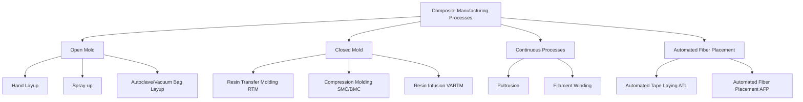

## Manufacturing of Composite Materials

### Overview

Composite manufacturing processes are selected based on part geometry, production volume, matrix type (thermoset vs. thermoplastic), required mechanical performance, and cost constraints. Unlike monolithic metals where material and part are formed separately, most composite processes form the material and the final part simultaneously—the fiber architecture, matrix consolidation, and geometry are created in a single integrated operation. This makes process selection a first-order design decision, not merely a downstream manufacturing detail.

### Process Classification

### Hand Layup

The simplest and most labor-intensive process: dry or pre-impregnated fiber layers (fabric, mat, or tape) are placed manually into or onto a mold, with resin applied by brush, roller, or squeegee for wet layup, or already present in prepreg form.

**Process Characteristics**

- Low tooling cost; suitable for low-volume, large, or complex parts (boat hulls, wind turbine blades, prototype tooling)
- High labor content and operator-dependent quality
- Fiber volume fraction typically limited to 25-40% for wet layup (lower than automated processes) due to manual resin application
- Often combined with vacuum bagging and autoclave cure for aerospace-grade quality (see below)

### Vacuum Bagging and Autoclave Processing

The dominant process for high-performance aerospace laminates using prepreg (pre-impregnated fiber/resin) material.

**Process Sequence**

1. Prepreg plies cut and laid up on a tool surface in the specified stacking sequence
2. Layup covered with release film, breather/bleeder fabric, and a sealed vacuum bag
3. Vacuum applied (typically full vacuum, ~1 atm) to consolidate plies and remove entrapped air/volatiles
4. Assembly placed in an autoclave (pressurized oven) and cured under combined heat and pressure (typically 85-100 psi / 590-690 kPa, and 120-180°C for common aerospace epoxies) per a defined cure cycle

**Function of Autoclave Pressure**

- Suppresses void formation by keeping entrapped gases and volatiles in solution/compressed during cure
- Achieves high, consistent fiber volume fraction (typically 58-65%) and low void content (<1%)
- Enables the highest mechanical property allowables among composite processes, which is why autoclave-cured prepreg remains the benchmark for primary aerospace structure

**Cure Cycle Considerations**

- Cure cycles are defined by temperature ramp rate, dwell temperature/time, and pressure application timing, engineered around the resin's cure kinetics (often characterized via differential scanning calorimetry, DSC) to balance full cross-linking against minimizing thermal gradients and residual stress in thick sections
- Exothermic reaction heat in thick laminates can cause significant through-thickness temperature overshoot if ramp rates are not controlled

**Limitations**: High capital cost (autoclave equipment), size-limited by autoclave chamber dimensions, batch (non-continuous) process, energy-intensive.

### Resin Transfer Molding (RTM)

A closed-mold process in which dry fiber preform is placed into a rigid two-part mold, the mold is closed, and liquid resin is injected under pressure to impregnate the fiber before curing.

**Process Characteristics**

- Produces parts with two finished (Class A) surfaces, unlike open-mold processes
- Good dimensional control and repeatability suitable for medium-volume production
- Fiber volume fractions of 50-60% achievable
- Preform can incorporate 3D reinforcement architectures (e.g., stitched, braided, or woven near-net-shape preforms) not achievable with flat prepreg tape
- Variants: **Vacuum-Assisted RTM (VARTM)** uses vacuum rather than positive injection pressure to draw resin through the preform in a one-sided (rigid mold + vacuum bag) tool, reducing tooling cost at the expense of achievable fiber volume fraction and dimensional control on the bag-side surface
- **High-Pressure RTM (HP-RTM)**: uses fast-curing resins and high injection pressure/clamp force for automotive-volume production cycle times (minutes)

### Compression Molding (SMC/BMC)

Uses molding compounds—**Sheet Molding Compound (SMC)** or **Bulk Molding Compound (BMC)**—consisting of chopped fibers pre-mixed with resin, fillers, and additives, formed into a charge and compression-molded between matched metal dies under heat and pressure.

**Process Characteristics**

- High-volume, short-cycle-time process (typically 1-5 minutes per part), dominant in automotive composite production
- Chopped/random fiber architecture yields quasi-isotropic but lower properties than continuous-fiber processes
- Good surface finish achievable directly from matched-die tooling; suitable for Class A automotive exterior panels

### Pultrusion

A continuous process for producing constant-cross-section profiles (rods, beams, channels, structural shapes).

**Process Sequence**

1. Continuous fiber rovings/mats pulled from creels through a resin bath (wet-out)
2. Resin-impregnated fiber pulled through a heated, shaped die that consolidates the profile and initiates cure
3. Cured profile continuously pulled by a gripping mechanism and cut to length

**Process Characteristics**

- Highly automated, continuous, high production rate; economical for constant-section structural members
- High fiber volume fraction and excellent longitudinal properties, since fiber remains straight and continuous along the pull direction
- Limited to constant or near-constant cross-sections; not suitable for complex 3D geometry

### Filament Winding

Continuous fiber tows (typically pre-impregnated with resin, "wet winding," or dry tow with subsequent resin infusion) are wound under controlled tension onto a rotating mandrel in a precisely programmed pattern.

**Process Characteristics**

- Ideal for axisymmetric hollow structures: pressure vessels, pipes, rocket motor cases, drive shafts
- Winding angle directly controls the ratio of hoop to axial stiffness/strength, allowing the fiber path to be tailored to the pressure vessel stress state (e.g., the classical "magic angle" of $54.7°$ for a thin-walled cylindrical pressure vessel under internal pressure, at which hoop and axial fiber stresses are balanced according to netting analysis)
- High fiber volume fraction (60-70%) and excellent property translation for axisymmetric geometries
- Mandrel must be removable (collapsible, soluble, or left in place as a liner) after cure

### Automated Tape Laying (ATL) and Automated Fiber Placement (AFP)

Computer-controlled robotic systems that lay prepreg tape (ATL, wide tape, typically 75-300 mm) or narrow tow/slit-tape (AFP, typically 3.2-12.7 mm width, multiple tows fed simultaneously) onto a tool surface following programmed toolpaths.

**Process Characteristics**

- Enables precise fiber steering, variable-stiffness laminate design, and on-the-fly ply drop/add (course termination) not achievable with hand layup
- AFP's narrow tow width allows placement on doubly curved surfaces with reduced wrinkling/bridging compared to wide ATL tape
- High deposition rates and repeatability suitable for large aerospace structures (wing skins, fuselage barrel sections)
- Requires subsequent autoclave or out-of-autoclave (OOA) cure cycle
- Defects specific to this process (gaps, overlaps, tow wander, foreign object debris) are typically monitored via in-process laser or camera-based inspection systems

### Out-of-Autoclave (OOA) Processing

Resin systems and process approaches (typically vacuum-bag-only cure) engineered to achieve near-autoclave properties without autoclave pressure, reducing capital and energy cost and removing part-size limitations imposed by autoclave chamber dimensions. [Inference: OOA prepreg systems generally still trail autoclave-cured systems in void content and interlaminar properties, though the gap has narrowed considerably with modern engineered resin systems—actual performance is formulation- and process-dependent.]

### Thermoplastic Composite Processing

Because thermoplastic matrices melt and reform rather than cure irreversibly, processing routes differ fundamentally from thermosets:

- **Thermoforming**: consolidated thermoplastic composite sheet (laminate) reheated above matrix melting/softening point and stamped or formed into shape, analogous to sheet metal stamping; fast cycle times suitable for automotive volumes
- **In-situ consolidation (AFP for thermoplastics)**: tow is melted at the point of deposition (via laser, hot gas torch, or other heat source) and consolidated in a single pass, potentially eliminating a separate autoclave/oven cure step
- **Injection molding**: for short/chopped fiber thermoplastic composites, using conventional injection molding equipment adapted for abrasive fiber-filled feedstock
- **Welding**: thermoplastic composite structures can be joined via resistance, ultrasonic, or induction welding, offering an assembly advantage unavailable to thermosets (which require adhesive bonding or mechanical fastening)

### Process Selection Comparison

| Process | Volume Fraction | Production Volume | Geometric Complexity | Relative Cost | Typical Application |
| --- | --- | --- | --- | --- | --- |
| Hand Layup | Low-Moderate | Low | High | Low tooling | Boats, prototypes |
| Autoclave Prepreg | High | Low-Moderate | High | High | Aerospace primary structure |
| RTM | Moderate-High | Moderate | High (3D preform) | Moderate-High | Aerospace secondary, automotive |
| Compression Molding (SMC) | Moderate | High | Moderate | Low (per part, high volume) | Automotive panels |
| Pultrusion | High | High (continuous) | Low (constant section) | Low (continuous) | Structural profiles |
| Filament Winding | High | Moderate | Low (axisymmetric) | Moderate | Pressure vessels, pipes |
| AFP/ATL | High | Moderate-High | High | High capital | Large aerospace structures |

### Common Manufacturing Defects

| Defect | Cause | Primary Effect |
| --- | --- | --- |
| Voids/Porosity | Entrapped air, volatiles, insufficient consolidation pressure | Reduced matrix-dominated strength, interlaminar shear strength |
| Delamination | Contamination, inadequate cure, impact damage | Loss of interlaminar strength, stiffness degradation |
| Fiber Wrinkling/Waviness | Tool geometry, compaction over curved surfaces, thermal mismatch | Reduced compressive strength |
| Dry Spots | Incomplete resin infiltration (RTM/infusion) | Local property loss, moisture ingress path |
| Resin-Rich/Resin-Starved Areas | Uneven resin distribution, incorrect fiber volume fraction | Localized stiffness/strength variation |
| Porosity from Cure Exotherm | Excessive thermal gradient in thick sections | Micro-cracking, residual stress |

**Behavioral note**: The relationship between process parameters (pressure, temperature ramp, dwell time) and resulting defect population is formulation- and geometry-specific; stated pressure/temperature values above reflect common industry practice ranges and may vary with specific resin system datasheets and part thickness.

**Related Topics**

- Prepreg Technology and Cure Kinetics (DSC, Rheology)
- Non-Destructive Inspection of Composites (Ultrasonic C-scan, Thermography)
- Fiber Preform Architectures (Weaving, Braiding, Stitching, 3D Preforms)
- Tooling Materials and CTE-Matched Tooling
- Out-of-Autoclave Resin Systems
- Thermoplastic Composite Welding Methods
- Residual Stress and Process-Induced Distortion (Spring-in, Warpage)