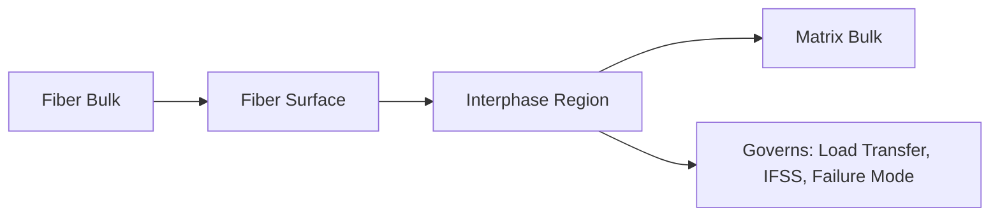

## Interface and Interphase in Composites

### Definitions and Distinction

The **interface** is the two-dimensional boundary surface separating the reinforcement (fiber) from the matrix. In practice, this boundary is rarely a mathematically sharp discontinuity; instead, a region of finite thickness with properties distinct from both bulk fiber and bulk matrix typically develops, referred to as the **interphase**.

The interphase arises from mechanisms such as:

- Diffusion of matrix constituents into the fiber surface (and vice versa) during processing
- Preferential resin chemistry/crosslink density gradients near the fiber surface, influenced by the fiber's sizing chemistry
- Residual thermal stresses concentrated in the near-fiber region due to CTE mismatch
- Deliberate engineered coatings (e.g., interphase coatings in ceramic matrix composites)

The interphase is often treated as a distinct "third phase" in micromechanical models because its properties (modulus, toughness) can differ substantially from bulk matrix properties, and its thickness and character strongly influence load transfer efficiency and failure behavior.

### Function of the Interface/Interphase

- **Load transfer**: Shear stress transfer from matrix to fiber occurs across the interface; interface quality directly governs the efficiency of this transfer and thus the extent to which fiber strength/stiffness is utilized
- **Failure mode control**: Interface strength relative to fiber and matrix strength determines whether failure proceeds via fiber pull-out (weaker interface, more energy absorption, higher toughness) or brittle fiber/matrix fracture (stronger interface, higher strength but potentially lower toughness)
- **Environmental barrier**: A well-bonded interface can retard moisture ingress along the fiber-matrix boundary, a primary degradation pathway in hot/wet PMC service
- **Stress concentration mitigation**: In CMCs particularly, a compliant/weak interphase layer deflects cracks around fibers rather than through them, enabling pseudo-ductile failure

### Interfacial Shear Strength (IFSS)

IFSS quantifies the shear stress the interface can sustain before debonding, and is the primary metric used to characterize interfacial bond quality.

**Shear-Lag Model**

The simplest analytical treatment of load transfer is the shear-lag model, which describes how fiber axial stress builds up from zero at a fiber end (or break) to the far-field value over a characteristic transfer length, mediated by interfacial shear stress. For a fiber embedded in matrix under longitudinal loading, fiber stress $\sigma_f(x)$ at distance $x$ from the fiber end follows:

$$\sigma_f(x) = \sigma_f^{\infty} \left[1 - \exp(-\beta x)\right]$$

where $\beta$ is a shear-lag parameter dependent on fiber/matrix modulus ratio, fiber radius, and fiber spacing, and $\sigma_f^{\infty}$ is the far-field (fully loaded) fiber stress. This model underlies the concept of **critical fiber length** ($l_c$), the minimum embedded fiber length required for the fiber to reach its full strength before interfacial debonding or pull-out occurs:

$$l_c = \frac{\sigma_f^{ult} \, d}{2 \tau_{IFSS}}$$

where $d$ is fiber diameter and $\tau_{IFSS}$ is the interfacial shear strength. Fibers shorter than $l_c$ (as in short-fiber/discontinuous composites) cannot be loaded to their full strength before pulling out, which is why continuous-fiber composites achieve substantially higher property translation than short-fiber composites using the same fiber and matrix.

### Experimental Characterization Methods

**Single-Fiber Fragmentation Test (SFFT)**

- A single fiber embedded in a matrix dogbone specimen is loaded in tension; as load increases, the fiber fragments progressively at flaw sites until fragment lengths become too short to sustain further breaks (fragments reach the critical length)
- IFSS is back-calculated from the saturation fragment length distribution using shear-lag or related analysis
- Provides an average IFSS value integrated over many fragmentation events, offering good statistical representativeness

**Microbond (Microdroplet) Pull-Out Test**

- A small droplet of matrix resin is cured onto an isolated fiber, then mechanically sheared off (pulled through a blade or knife-edge) while measuring debond/pull-out force
- IFSS calculated as $\tau = F_{max} / (\pi d L_e)$, where $L_e$ is the embedded droplet length
- Allows direct measurement of both debond initiation force and subsequent frictional pull-out force, separating adhesive bond strength from post-debond friction

**Fiber Pull-Out Test**

- A single fiber embedded to a controlled depth in a bulk matrix block is pulled out; force-displacement response yields debond and friction characteristics, similar in principle to microbond testing but at different embedment length scales

**Short-Beam Shear (SBS) / Interlaminar Shear Strength (ILSS) Test**

- Though this is a laminate-level (not single-fiber) test, it is commonly used as an indirect, practical indicator of interfacial bond quality in production quality control, since interlaminar shear strength is strongly influenced by interfacial bond quality
- Standardized per ASTM D2344, applying three-point bending on a short specimen to induce interlaminar shear failure

### Fiber Surface Treatments and Sizing

**Sizing** refers to a thin coating applied to fibers immediately after formation (e.g., during glass fiber drawing or carbon fiber surface treatment), serving multiple functions:

- **Protection**: Prevents fiber-to-fiber abrasion damage during handling, weaving, and winding
- **Coupling**: Promotes chemical or mechanical adhesion to the specific matrix resin system the fiber is designed for
- **Compatibility**: Different sizing chemistries are formulated for epoxy, polyester, vinyl ester, or thermoplastic matrices; using a fiber with sizing mismatched to the intended matrix can result in poor wet-out and weak interfacial bonding
- **Handleability**: Improves fiber tow cohesion and processability (reduces "fuzz," fiber breakage) during weaving, braiding, and prepreg impregnation

**Glass Fiber Sizing**: Typically silane-based coupling agents (organofunctional silanes), which form covalent bonds to surface silanol groups on the glass and compatible chemical bonds (e.g., via reactive functional groups) with the matrix resin, bridging the inorganic glass surface and organic polymer matrix.

**Carbon Fiber Surface Treatment**: Involves two distinct steps—surface oxidation (electrolytic or gas-phase oxidation) to introduce oxygen-containing functional groups (carboxyl, hydroxyl) that improve wettability and chemical bonding, followed by application of a thin epoxy-compatible sizing layer (often itself a dilute epoxy formulation) for handleability and matrix compatibility.

### Interphase Engineering in Ceramic Matrix Composites

CMCs represent the case where interphase engineering is most deliberate and critical. A weak, compliant interphase coating (commonly pyrolytic carbon or boron nitride, applied via chemical vapor deposition prior to matrix infiltration) is intentionally introduced between fiber and matrix.

**Mechanism**: When a matrix crack approaches a coated fiber, the weak interphase debonds and allows the crack to deflect along the fiber-matrix interface rather than propagating straight through the fiber. This crack deflection:

- Dissipates fracture energy
- Allows fibers to bridge the crack and continue carrying load
- Converts what would otherwise be brittle, catastrophic ceramic failure into a graceful, pseudo-ductile failure process with substantial work-of-fracture

This is a case where interfacial bond *strength must be deliberately minimized* (within limits) rather than maximized, inverting the typical PMC design objective of maximizing interfacial adhesion.

### Interface Effects on Failure Mode (schematic)

<svg xmlns="http://www.w3.org/2000/svg" viewBox="0 0 520 260">
<text x="260" y="22" font-size="15" text-anchor="middle" font-family="sans-serif" font-weight="bold">Interface Strength vs. Failure Mode (svg_diagram)</text>

<text x="130" y="50" font-size="12" text-anchor="middle" font-family="sans-serif">Weak Interface</text>

<rect x="40" y="65" width="180" height="110" fill="`#eef2f7`" stroke="#333" />

<line x1="60" y1="120" x2="200" y2="120" stroke="`#4a7ab5`" stroke-width="10" />

<line x1="60" y1="120" x2="90" y2="120" stroke="#fff" stroke-width="10" />

<text x="130" y="150" font-size="10" text-anchor="middle" font-family="sans-serif">Debond + Pull-out</text>

<text x="130" y="165" font-size="10" text-anchor="middle" font-family="sans-serif" fill="#555">Higher toughness</text>

<text x="390" y="50" font-size="12" text-anchor="middle" font-family="sans-serif">Strong Interface</text>

<rect x="300" y="65" width="180" height="110" fill="`#eef2f7`" stroke="#333" />

<line x1="320" y1="120" x2="460" y2="120" stroke="`#4a7ab5`" stroke-width="10" />

<line x1="386" y1="105" x2="386" y2="135" stroke="#c00" stroke-width="3" />

<text x="390" y="150" font-size="10" text-anchor="middle" font-family="sans-serif">Brittle Fracture</text>

<text x="390" y="165" font-size="10" text-anchor="middle" font-family="sans-serif" fill="#555">Higher strength, lower toughness</text>

<text x="260" y="205" font-size="11" text-anchor="middle" font-family="sans-serif" fill="#555">Interface design balances load transfer efficiency against damage tolerance</text>

</svg>

### Environmental Degradation of the Interface

- **Hydrothermal aging**: Water molecules preferentially diffuse to and accumulate at the fiber-matrix interface, hydrolyzing coupling agent bonds and plasticizing the interphase, reducing IFSS over time; this is a principal driver of "hot/wet" property knockdowns applied in aerospace design allowables
- **Thermal cycling**: Repeated CTE-mismatch-driven stress cycling at the interface can initiate and grow microscale debonds even absent external mechanical load
- **UV/oxidative degradation**: Primarily affects exposed matrix surface but can propagate degradation toward near-surface interfaces over long exposure periods

### Micromechanical Modeling Implications

Because the interphase can have a finite thickness and distinct modulus, refined micromechanics models (three-phase models, e.g., generalized self-consistent field models) explicitly incorporate an interphase layer between fiber and matrix, rather than assuming a perfectly bonded two-phase (fiber + matrix) system. [Inference: the practical significance of explicitly modeling interphase thickness/properties, versus lumping its effect into an "effective" fiber-matrix bond parameter, depends on the interphase's actual thickness relative to fiber diameter and the property contrast involved—for typical PMC systems, this is often difficult to resolve experimentally.]

**Related Topics**

- Micromechanics of Composites (Shear-Lag Theory, Critical Fiber Length)
- Matrix Materials for Composites (Sizing Compatibility)
- Reinforcement Fibers and Surface Treatment
- Moisture Absorption and Hygrothermal Effects in Composites
- Fracture Toughness and Delamination (Mode I/II Interlaminar Fracture)
- Ceramic Matrix Composite Interphase Coatings (CVI Processing)
- Failure Mechanisms in Fiber-Reinforced Composites