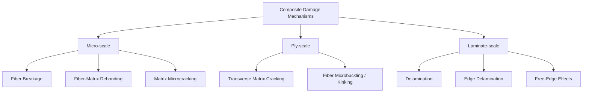

## Damage and Failure in Composites

### Overview

Damage and failure in fiber-reinforced composites differ fundamentally from failure in isotropic metals. Rather than a single dominant crack propagating to fracture, composites typically accumulate multiple, spatially distributed damage mechanisms—matrix microcracking, fiber-matrix debonding, delamination, and fiber breakage—that interact and evolve progressively under load. This multi-mechanism, progressive character makes composite failure prediction considerably more complex than classical isotropic fracture mechanics, and is the reason composite structures are typically designed using a hierarchy of failure criteria applied at multiple scales.

### Damage Mechanisms Hierarchy

### Lamina-Level Failure Modes

**Fiber-Dominated Tensile Failure**

Occurs when longitudinal tensile stress exceeds fiber strength. Because fiber strength follows a statistical (typically Weibull) distribution rather than a single deterministic value, failure initiates at the weakest fiber flaw location and progresses via a stochastic process:

1. Individual fibers break at random locations governed by their local flaw population
2. Broken fiber ends shed load to neighboring fibers via matrix shear (stress concentration)
3. As load increases, breaks accumulate and cluster; when a critical cluster size is reached, unstable crack propagation occurs across the ply

This statistical accumulation process is the physical basis for fiber bundle theory and Weibull-based strength models, and explains why longitudinal tensile strength does not scale simply with average single-fiber strength.

**Fiber-Dominated Compressive Failure (Microbuckling/Kinking)**

Compressive failure is matrix-stability-dominated: fibers under compression are susceptible to elastic microbuckling, resisted primarily by the surrounding matrix's shear stiffness. Failure typically manifests as a **kink band**—a narrow zone of localized fiber rotation and fracture, oriented at a characteristic angle to the loading direction, formed once initial fiber misalignment (present in all real composites due to manufacturing) triggers local matrix shear yielding and progressive fiber rotation. Compressive strength is highly sensitive to as-manufactured fiber waviness/misalignment, which is why measured compressive strengths typically fall well below idealized microbuckling predictions (see Micromechanics of Composites).

**Matrix-Dominated Transverse Cracking**

Under transverse tension or shear loading (relative to fiber direction), cracks initiate in the matrix, typically nucleating at fiber-matrix interface flaws or resin-rich regions, and propagate parallel to the fibers through the ply thickness. In multidirectional laminates, transverse (matrix) cracking is often the *first* damage mode to appear under load, well before ultimate laminate failure, and is used as a serviceability/damage-onset criterion in some design approaches (particularly for cryogenic tanks, where matrix cracks provide leak paths).

**In-Plane Shear Failure**

Matrix-dominated failure under in-plane shear loading, governed by matrix yield/fracture behavior and interfacial bond quality; often exhibits nonlinear stress-strain response prior to failure due to matrix plasticity/microcracking.

### Delamination

Delamination—separation between adjacent plies—is often the most structurally significant damage mode in laminated composites because standard 2D lamina failure theories do not inherently capture it (it is fundamentally a 3D, interlaminar phenomenon), and its onset can precipitate rapid loss of laminate stiffness and load-carrying capacity.

**Causes**

- **Interlaminar stresses at free edges**: Classical lamination theory assumes plane-stress behavior, but near free edges (laminate boundaries, ply drops, holes), out-of-plane (interlaminar normal and shear) stresses develop to satisfy equilibrium and traction-free boundary conditions, often concentrated within a boundary layer roughly one laminate thickness wide
- **Impact damage**: Low-velocity impact (tool drop, runway debris, hail) can create delamination that is often barely visible on the impacted surface ("barely visible impact damage," BVID) while causing significant internal delamination and compressive strength reduction—a critical design and inspection concern in aerospace structures
- **Manufacturing defects**: Voids, contamination, or incomplete cure at ply interfaces act as delamination initiation sites
- **Ply drops and geometric discontinuities**: Stress concentrations at internal ply terminations

**Fracture Mechanics Treatment**

Delamination growth is analyzed using linear elastic fracture mechanics (LEFM), characterizing crack driving force via strain energy release rate $G$, decomposed into three fracture modes:

- **Mode I** ($G_I$): opening mode, crack faces separate perpendicular to the crack plane
- **Mode II** ($G_{II}$): in-plane shear (sliding) mode
- **Mode III** ($G_{III}$): out-of-plane (tearing) shear mode

Delamination propagates when the total (or mode-mixity-weighted) energy release rate reaches the material's interlaminar fracture toughness, $G_C$:

$$G = G_I + G_{II} + G_{III} \geq G_C$$

Mixed-mode failure criteria (e.g., the Benzeggagh-Kenane, B-K, criterion) are commonly used to interpolate fracture toughness between pure Mode I ($G_{IC}$) and pure Mode II ($G_{IIC}$) values for arbitrary mode mixity:

$$G_C = G_{IC} + (G_{IIC} - G_{IC})\left(\frac{G_{II}}{G_I + G_{II}}\right)^{\eta}$$

where $\eta$ is an empirically fitted material parameter.

**Standard Test Methods**

- **Double Cantilever Beam (DCB)**, ASTM D5528: measures $G_{IC}$
- **End-Notched Flexure (ENF)**: measures $G_{IIC}$
- **Mixed-Mode Bending (MMB)**, ASTM D6671: measures mixed-mode fracture toughness across a range of mode ratios

### Lamina Failure Criteria (Macroscopic)

Several phenomenological failure theories are used to predict onset of failure at the lamina (ply) level from macroscopic stress/strain state, without explicitly resolving underlying micromechanisms.

**Maximum Stress Criterion**

Failure predicted independently when any stress component exceeds its corresponding strength:

$$\sigma_1 \geq X_t \text{ or } \sigma_1 \leq -X_c, \quad \sigma_2 \geq Y_t \text{ or } \sigma_2 \leq -Y_c, \quad \tau_{12} \geq S$$

where $X_t, X_c$ are longitudinal tensile/compressive strengths, $Y_t, Y_c$ are transverse tensile/compressive strengths, and $S$ is shear strength. Simple to apply but does not capture stress interaction effects.

**Maximum Strain Criterion**

Analogous to maximum stress but formulated in terms of strain components and allowable strains; can predict different failure envelopes than maximum stress theory due to Poisson effects.

**Tsai-Hill Criterion**

An interactive criterion adapted from the Hill anisotropic yield criterion for orthotropic materials, combining stress components into a single failure index:

$$\left(\frac{\sigma_1}{X}\right)^2 - \frac{\sigma_1 \sigma_2}{X^2} + \left(\frac{\sigma_2}{Y}\right)^2 + \left(\frac{\tau_{12}}{S}\right)^2 = 1$$

Captures stress interaction but does not distinguish tension from compression strength (single $X$, $Y$ values), limiting accuracy for materials with strongly asymmetric tensile/compressive behavior.

**Tsai-Wu Criterion**

A more general quadratic interactive criterion incorporating separate tensile and compressive strength terms and a stress-interaction coefficient:

$$F_1 \sigma_1 + F_2 \sigma_2 + F_{11}\sigma_1^2 + F_{22}\sigma_2^2 + F_{66}\tau_{12}^2 + 2F_{12}\sigma_1\sigma_2 = 1$$

with coefficients defined in terms of $X_t, X_c, Y_t, Y_c, S$. Widely used in industry due to its generality, though the interaction coefficient $F_{12}$ is difficult to determine experimentally with confidence and is often estimated or set to zero in practice.

**Hashin Criteria**

Distinguishes between distinct physical failure modes (fiber tension, fiber compression, matrix tension, matrix compression) with separate quadratic equations for each, providing not only failure prediction but also identification of the governing failure mechanism—a significant advantage for damage model development, since different modes are associated with different post-failure degradation behavior (e.g., fiber failure causes near-total loss of load-carrying capacity in that direction, while matrix cracking causes partial stiffness reduction).

$$\text{Fiber tension } (\sigma_1 > 0): \quad \left(\frac{\sigma_1}{X_t}\right)^2 + \left(\frac{\tau_{12}}{S}\right)^2 = 1$$

$$\text{Matrix tension } (\sigma_2 > 0): \quad \left(\frac{\sigma_2}{Y_t}\right)^2 + \left(\frac{\tau_{12}}{S}\right)^2 = 1$$

[Note: full Hashin criteria include additional compression-mode equations; forms shown are representative, and specific coefficient forms vary across published variants and implementations in commercial FE codes.]

### Failure Criteria Comparison

| Criterion | Distinguishes T/C Strength | Identifies Failure Mode | Captures Stress Interaction | Complexity |
| --- | --- | --- | --- | --- |
| Maximum Stress | Yes | No | No | Low |
| Maximum Strain | Yes | No | No | Low |
| Tsai-Hill | No | No | Yes | Moderate |
| Tsai-Wu | Yes | No | Yes | Moderate |
| Hashin | Yes | Yes | Partial (per-mode) | Moderate-High |
| Puck / LaRC (Inference: advanced criteria) | Yes | Yes | Yes (physically motivated) | High |

[Inference: More recent physically-based criteria such as Puck's action-plane theory and the LaRC (Langley Research Center) criteria refine matrix failure prediction by accounting for the fracture plane angle under compressive transverse loading; these are increasingly used in advanced design but require additional material parameters not always characterized in standard test programs.]

### Progressive Damage and First-Ply Failure vs. Last-Ply Failure

In multidirectional laminates, failure is progressive rather than instantaneous:

- **First-Ply Failure (FPF)**: load/stress level at which the first ply within the laminate reaches its failure criterion (commonly matrix cracking in an off-axis ply)
- **Progressive degradation**: failed plies are assigned reduced (degraded) stiffness properties, and the laminate is re-analyzed under continued load, redistributing stress to remaining intact plies
- **Last-Ply Failure (LPF)**: load level at which sufficient plies have failed that the laminate can no longer sustain load, representing ultimate laminate failure

This FPF-to-LPF margin means significant additional load-carrying capacity often exists beyond first matrix cracking, and design allowables must specify explicitly whether they are based on FPF (conservative, serviceability-oriented) or ultimate/LPF (higher, but requiring validated progressive damage models) criteria.

### Fatigue Damage Accumulation

Composite fatigue behavior differs from metal fatigue: rather than a single dominant crack, composites accumulate multiple distributed damage mechanisms over cycling (matrix microcracking saturating into a "characteristic damage state," followed by delamination growth and eventual fiber breakage), producing a distinctly different S-N curve shape and damage progression pattern than isotropic metals. [Inference: general fatigue life trends—fiber-dominated laminates showing relatively flat S-N behavior, matrix/shear-dominated laminates showing steeper fatigue sensitivity—are well established in the literature, though quantitative fatigue life prediction remains layup- and material-system-specific and typically requires empirical characterization.]

### Damage Tolerance and Compression-After-Impact (CAI)

Aerospace composite structures are commonly evaluated for **compression-after-impact (CAI)** strength: a specimen is subjected to a controlled low-velocity impact (inducing internal delamination and matrix cracking, often with minimal visible surface indication), then loaded in compression to failure. CAI strength is typically substantially lower than pristine (undamaged) compressive strength, since impact-induced delaminations act as local buckling initiation sites (sublaminate buckling), and this knockdown is a primary driver of design allowables and inspection requirements (e.g., BVID thresholds) in aerospace certification.

### Damage Progression Schematic (svg_diagram)

<svg xmlns="http://www.w3.org/2000/svg" viewBox="0 0 540 260">
<text x="270" y="20" font-size="14" text-anchor="middle" font-family="sans-serif" font-weight="bold">Progressive Damage Sequence in a Laminate (svg_diagram)</text>
<rect x="20" y="45" width="110" height="90" fill="#eef2f7" stroke="#333" />
<text x="75" y="150" font-size="10" text-anchor="middle" font-family="sans-serif">1. Matrix</text>
<text x="75" y="163" font-size="10" text-anchor="middle" font-family="sans-serif">Microcracking</text>
<line x1="40" y1="60" x2="40" y2="120" stroke="#c00" stroke-width="2" />
<line x1="65" y1="60" x2="65" y2="120" stroke="#c00" stroke-width="2" />
<line x1="90" y1="60" x2="90" y2="120" stroke="#c00" stroke-width="2" />
<rect x="150" y="45" width="110" height="90" fill="#eef2f7" stroke="#333" />
<text x="205" y="150" font-size="10" text-anchor="middle" font-family="sans-serif">2. Fiber-Matrix</text>
<text x="205" y="163" font-size="10" text-anchor="middle" font-family="sans-serif">Debonding</text>
<circle cx="180" cy="70" r="10" fill="none" stroke="#c00" stroke-width="2" />
<circle cx="205" cy="95" r="10" fill="none" stroke="#c00" stroke-width="2" />
<circle cx="230" cy="115" r="10" fill="none" stroke="#c00" stroke-width="2" />
<rect x="280" y="45" width="110" height="90" fill="#eef2f7" stroke="#333" />
<text x="335" y="150" font-size="10" text-anchor="middle" font-family="sans-serif">3. Ply-level</text>
<text x="335" y="163" font-size="10" text-anchor="middle" font-family="sans-serif">Transverse Crack</text>
<line x1="300" y1="90" x2="370" y2="90" stroke="#c00" stroke-width="3" />
<rect x="410" y="45" width="110" height="90" fill="#eef2f7" stroke="#333" />
<text x="465" y="150" font-size="10" text-anchor="middle" font-family="sans-serif">4. Delamination /</text>
<text x="465" y="163" font-size="10" text-anchor="middle" font-family="sans-serif">Ultimate Failure</text>
<line x1="420" y1="70" x2="500" y2="70" stroke="#c00" stroke-width="3" />
<line x1="420" y1="110" x2="500" y2="110" stroke="#c00" stroke-width="3" />
<line x1="130" y1="90" x2="150" y2="90" stroke="#333" stroke-width="1.5" marker-end="url(#arrow)" />
<line x1="260" y1="90" x2="280" y2="90" stroke="#333" stroke-width="1.5" marker-end="url(#arrow)" />
<line x1="390" y1="90" x2="410" y2="90" stroke="#333" stroke-width="1.5" marker-end="url(#arrow)" />
<text x="270" y="200" font-size="11" text-anchor="middle" font-family="sans-serif" fill="#555">Increasing load / cycles →</text>

</svg>

### Non-Destructive Inspection (NDI) Relevance

Because much composite damage (delamination, matrix cracking) can be internal and not visible on the surface, damage tolerance design relies heavily on NDI methods—ultrasonic C-scan (most common for delamination detection), thermography, and X-ray/CT for void and porosity characterization—integrated with the damage mechanisms and failure criteria described above to establish inspection intervals and detectable damage size thresholds in certified structures.

**Related Topics**

- Micromechanics of Composites (Fiber Strength Statistics, Shear-Lag Theory)
- Interface and Interphase in Composites (IFSS, Debonding)
- Fracture Mechanics: Mode I/II/III Energy Release Rate
- Non-Destructive Inspection Methods (Ultrasonic C-scan, Thermography)
- Fatigue of Composite Materials (S-N Behavior, Characteristic Damage State)
- Classical Lamination Theory and Interlaminar Stress at Free Edges
- Impact Damage and Compression-After-Impact (CAI) Testing