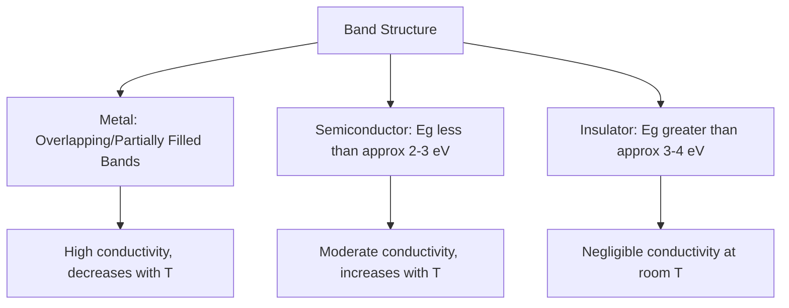

## Electrical Conduction in Materials

### Overview

Electrical conduction describes the transport of charge carriers—electrons, holes, or ions—through a material under an applied electric field. The conduction behavior of a material, spanning more than 25 orders of magnitude in resistivity from superconductors to the best insulators, is governed fundamentally by its electronic band structure: the distribution of allowed and forbidden electron energy states, and the occupation of those states as dictated by quantum statistics.

### Classical Framework: Ohm's Law and Conductivity

At the macroscopic level, conduction in most materials under moderate fields follows Ohm's law:

$$J = \sigma E$$

where $J$ is current density, $E$ is electric field, and $\sigma$ is electrical conductivity (units: S/m or $(\Omega \cdot \text{m})^{-1}$). Resistivity $\rho = 1/\sigma$ is more commonly tabulated for materials characterization.

**Drude/Classical Free Electron Model**

Conductivity in metals can be expressed as:

$$\sigma = n e \mu$$

where $n$ is charge carrier concentration, $e$ is elementary charge, and $\mu$ is carrier mobility—the proportionality constant relating carrier drift velocity to applied field ($v_d = \mu E$). Mobility itself relates to the mean free time between scattering events ($\tau$) and effective carrier mass ($m^*$):

$$\mu = \frac{e \tau}{m^*}$$

This framework, while classical in origin, remains the standard starting point for conductivity analysis, with $n$ and $\mu$ subsequently understood through quantum band theory.

### Band Theory Basis for Conduction Classification

The energy band structure of a solid, arising from the overlap of atomic orbitals in a periodic lattice, determines whether a material behaves as a conductor, semiconductor, or insulator. The key structural features are the **valence band** (highest energy band that is normally filled or largely filled with electrons at 0 K) and the **conduction band** (next higher band, into which electrons must be promoted to participate in conduction), separated by an energy gap $E_g$ (the "band gap") in non-metals.

### Metals

In metals, the valence and conduction bands overlap, or the valence band is only partially filled, so a large density of electron states exists immediately above the Fermi level $E_F$ with no energy gap to overcome. Electrons near $E_F$ can be readily excited into unoccupied nearby states by an applied field, producing high conductivity even at low field strengths.

**Free Electron (Fermi Gas) Model**: Conduction electrons are treated as a gas of free particles obeying Fermi-Dirac statistics, filling available states up to the Fermi energy $E_F$ at 0 K. Only electrons within approximately $k_BT$ of $E_F$ participate meaningfully in conduction and thermal transport, since deeper states are fully occupied and have no accessible empty states to scatter into (Pauli exclusion).

**Temperature Dependence**: Metal resistivity *increases* with increasing temperature, primarily due to increased phonon (lattice vibration) scattering of conduction electrons. This is commonly described via Matthiessen's rule, which treats scattering contributions as additive:

$$\rho_{total}(T) = \rho_{thermal}(T) + \rho_{impurity} + \rho_{defect}$$

where $\rho_{thermal}(T)$ increases roughly linearly with temperature at temperatures well above the material's Debye temperature, while $\rho_{impurity}$ and $\rho_{defect}$ are temperature-independent residual contributions from point defects, impurities, and dislocations (dominant at low temperature, giving rise to the "residual resistivity" measured as $T \to 0$).

**Matthiessen's Rule Implication**: Alloying and cold work, which introduce solute atoms and dislocations, generally *increase* metal resistivity relative to the pure, annealed base metal, since these defects add independent scattering contributions.

### Semiconductors

Semiconductors possess a band gap small enough (typically below approximately 2-3 eV, though this is a practical rather than a sharply defined threshold) that thermal energy at room temperature can promote a meaningful (though still small relative to metals) population of electrons across the gap into the conduction band, leaving behind mobile positive vacancies ("holes") in the valence band.

**Intrinsic Semiconductors**

In a pure, defect-free semiconductor, electrons and holes are generated in equal numbers via thermal excitation across the band gap. Carrier concentration follows an exponential (Arrhenius-type) temperature dependence:

$$n = n_i = N_c N_v^{1/2} \exp\left(-\frac{E_g}{2k_BT}\right)$$

(commonly simplified in introductory treatments to $n_i \propto \exp(-E_g/2k_BT)$), where $N_c$ and $N_v$ are the effective densities of states in the conduction and valence bands. This exponential dependence means intrinsic carrier concentration—and hence conductivity—rises rapidly (roughly exponentially) with increasing temperature, in direct contrast to metals.

**Extrinsic (Doped) Semiconductors**

Deliberate introduction of impurity atoms (doping) dominates the carrier population in essentially all practical semiconductor devices, since intrinsic carrier concentrations at room temperature are typically far too low for useful device performance.

- **n-type doping**: Donor impurities (e.g., Group V elements—P, As, Sb—in Group IV Si or Ge) contribute an extra valence electron weakly bound to the donor atom, occupying a shallow energy level just below the conduction band edge. At room temperature, essentially all donors are thermally ionized, contributing free electrons as majority carriers
- **p-type doping**: Acceptor impurities (e.g., Group III elements—B, Al, Ga—in Si or Ge) create an electron deficiency, introducing a shallow acceptor level just above the valence band edge that accepts a valence electron, leaving a mobile hole as majority carrier

**Extrinsic Conductivity**:

$$\sigma = n e \mu_n + p e \mu_p$$

where $n$, $p$ are electron and hole concentrations and $\mu_n$, $\mu_p$ their respective mobilities. In extrinsic material at typical operating temperatures, one carrier type (set by dopant type and concentration) dominates, and conductivity is approximately proportional to dopant concentration over the range where essentially full ionization holds ("extrinsic/saturation regime").

**Temperature Regimes in Doped Semiconductors**: Conductivity vs. temperature in a doped semiconductor typically exhibits three distinct regimes: (1) a low-temperature "freeze-out" regime where not all dopants are thermally ionized and conductivity increases with T as ionization increases; (2) an intermediate "extrinsic/saturation" regime (encompassing typical device operating temperatures) where essentially all dopants are ionized and carrier concentration is roughly constant, with conductivity changes dominated by mobility's (weak, phonon-scattering-driven) temperature dependence; (3) a high-temperature "intrinsic" regime where thermally generated intrinsic carriers begin to dominate over the fixed dopant concentration, and conductivity again rises steeply.

### Insulators

Insulators possess a large band gap (commonly cited threshold on the order of 3-4 eV or greater, though again this is a practical distinction rather than a sharp physical boundary) such that negligible thermal population of the conduction band occurs at room temperature. Conduction in nominal insulators, when observed, typically arises from extrinsic mechanisms—ionic impurities, defect-mediated hopping conduction, or, at very high fields, dielectric breakdown—rather than intrinsic band conduction.

### Ionic Conduction

In ionic solids (many ceramics, solid electrolytes, glasses), charge transport can occur via migration of ions (rather than electrons/holes) through the lattice, typically mediated by point defects (vacancies or interstitials).

$$\sigma_{ionic} = \sum_i n_i e_i \mu_i$$

Ionic mobility is thermally activated (following an Arrhenius relation, since ion migration requires hopping over an energy barrier between lattice sites) and is generally many orders of magnitude lower than electronic mobility at a given temperature, though ionic conductors specifically engineered for high ionic mobility (e.g., yttria-stabilized zirconia for oxygen-ion conduction in solid oxide fuel cells, or lithium-conducting solid electrolytes for batteries) are an important materials class in energy storage and sensing applications.

### Comparison of Conduction Mechanisms

| Material Class | Dominant Carrier | Band Gap | $\sigma$ Range (S/m, approx.) | T-Dependence of $\sigma$ |
| --- | --- | --- | --- | --- |
| Metals | Free electrons | None (overlapping bands) | $10^6 - 10^8$ | Decreases with T |
| Semiconductors (intrinsic) | Electrons + holes | ~0.1-3 eV | $10^{-6} - 10^4$ | Increases with T (exponential) |
| Semiconductors (extrinsic) | Majority carrier (e⁻ or h⁺) | ~0.1-3 eV | $10^{-2} - 10^5$ | Complex (freeze-out/saturation/intrinsic regimes) |
| Insulators | Negligible (extrinsic defects only) | >3-4 eV | $10^{-10} - 10^{-20}$ | Weakly increases with T (defect-mediated) |
| Ionic conductors | Mobile ions | Variable | $10^{-6} - 10^2$ | Increases with T (Arrhenius) |
| Superconductors (below $T_c$) | Cooper pairs | N/A | Effectively infinite ($\rho = 0$) | Discontinuous transition at $T_c$ |

### Band Diagram Schematic (svg_diagram)

<svg xmlns="http://www.w3.org/2000/svg" viewBox="0 0 560 240">
<text x="280" y="20" font-size="14" text-anchor="middle" font-family="sans-serif" font-weight="bold">Band Structure Comparison (svg_diagram)</text>

<text x="90" y="45" font-size="12" text-anchor="middle" font-family="sans-serif">Metal</text>

<rect x="40" y="55" width="100" height="35" fill="`#4a7ab5`" />

<rect x="40" y="90" width="100" height="60" fill="`#4a7ab5`" opacity="0.5" />

<text x="90" y="75" font-size="9" text-anchor="middle" fill="#fff" font-family="sans-serif">Conduction</text>

<text x="90" y="125" font-size="9" text-anchor="middle" fill="#fff" font-family="sans-serif">Valence</text>

<text x="90" y="165" font-size="10" text-anchor="middle" font-family="sans-serif">Overlapping bands</text>

<text x="280" y="45" font-size="12" text-anchor="middle" font-family="sans-serif">Semiconductor</text>

<rect x="230" y="55" width="100" height="35" fill="`#e8e8e8`" stroke="#333" />

<rect x="230" y="105" width="100" height="45" fill="`#4a7ab5`" />

<text x="280" y="76" font-size="9" text-anchor="middle" font-family="sans-serif">Conduction</text>

<text x="280" y="130" font-size="9" text-anchor="middle" fill="#fff" font-family="sans-serif">Valence</text>

<line x1="230" y1="90" x2="330" y2="90" stroke="#c00" stroke-width="1" stroke-dasharray="3,2" />

<line x1="230" y1="105" x2="330" y2="105" stroke="#c00" stroke-width="1" stroke-dasharray="3,2" />

<text x="340" y="100" font-size="9" font-family="sans-serif" fill="#c00">Eg small</text>

<text x="280" y="165" font-size="10" text-anchor="middle" font-family="sans-serif">Narrow gap</text>

<text x="470" y="45" font-size="12" text-anchor="middle" font-family="sans-serif">Insulator</text>

<rect x="420" y="55" width="100" height="35" fill="`#e8e8e8`" stroke="#333" />

<rect x="420" y="130" width="100" height="20" fill="`#4a7ab5`" />

<text x="470" y="76" font-size="9" text-anchor="middle" font-family="sans-serif">Conduction</text>

<text x="470" y="143" font-size="9" text-anchor="middle" fill="#fff" font-family="sans-serif">Valence</text>

<line x1="420" y1="90" x2="520" y2="90" stroke="#c00" stroke-width="1" stroke-dasharray="3,2" />

<line x1="420" y1="130" x2="520" y2="130" stroke="#c00" stroke-width="1" stroke-dasharray="3,2" />

<text x="530" y="112" font-size="9" font-family="sans-serif" fill="#c00">Eg large</text>

<text x="470" y="165" font-size="10" text-anchor="middle" font-family="sans-serif">Wide gap</text>

</svg>

### Mobility-Limiting Scattering Mechanisms

Carrier mobility, and hence conductivity, is governed by the frequency and effectiveness of scattering events that interrupt carrier drift:

- **Phonon (lattice vibration) scattering**: Dominant mechanism at higher temperatures in relatively pure crystals; scattering rate increases with temperature, so mobility (and metal conductivity) decreases as T increases
- **Ionized impurity scattering**: Dominant at low temperature in doped semiconductors; scattering rate decreases with increasing temperature (faster carriers are deflected less by a given Coulomb potential), producing mobility that *increases* with T in this regime—opposite to phonon scattering's trend
- **Neutral impurity and defect scattering**: Point defects, dislocations, grain boundaries; largely temperature-independent, contributing to residual resistivity
- **Grain boundary scattering**: Significant in polycrystalline thin films and nanostructured materials where grain size approaches or falls below the electron mean free path

Because phonon scattering (increasing with T) and ionized impurity scattering (decreasing with T) have opposite temperature trends, doped semiconductor mobility often exhibits a characteristic peak at intermediate temperature, a signature used to help diagnose which mechanism dominates in a given material and doping regime. [Inference: the specific temperature and magnitude of this mobility peak is material- and doping-concentration-dependent and requires empirical characterization for any specific system.]

### Superconductivity (Brief Context)

Below a critical temperature $T_c$, certain materials exhibit zero electrical resistance (superconductivity), attributed in conventional (BCS-theory) superconductors to electron pairing (Cooper pairs) mediated by phonon interactions, allowing paired electrons to move through the lattice without the dissipative scattering that produces normal-state resistivity. This is generally treated as a distinct topic area (Superconducting Materials) given its distinct theoretical framework and material systems (conventional low-$T_c$ superconductors vs. cuprate/iron-based high-$T_c$ superconductors).

**Related Topics**

- Band Theory and the Fermi-Dirac Distribution
- Semiconductor Doping and p-n Junction Formation
- Dielectric Properties and Polarization Mechanisms
- Superconducting Materials and the Meissner Effect
- Thermoelectric Materials (Seebeck/Peltier Effects)
- Point Defects and Their Effect on Electronic Properties
- Hall Effect and Carrier Concentration Measurement