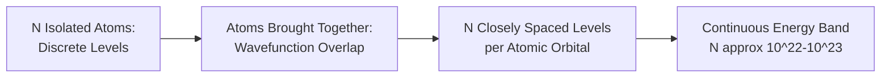

## Band Theory of Solids

### Physical Origin: From Discrete Levels to Bands

Isolated atoms possess discrete, quantized electron energy levels. When atoms are brought together into a crystalline solid, the electron wavefunctions of neighboring atoms overlap, and by the Pauli exclusion principle, no two electrons in the combined system can occupy an identical quantum state. Consequently, each discrete atomic energy level splits into a set of closely spaced levels—one for each atom in the interacting ensemble. For a macroscopic crystal containing on the order of $10^{22}$-$10^{23}$ atoms/cm³, this splitting produces an effectively continuous **energy band** rather than a discrete level.

This band-formation process occurs independently for each atomic orbital (1s, 2s, 2p, etc.), producing multiple bands separated by **forbidden energy gaps**—ranges of energy for which no allowed electron states exist in the solid, a direct consequence of the periodic potential experienced by electrons in the crystal lattice.

### Quantum Mechanical Basis

**Bloch's Theorem**

Electron wavefunctions in a periodic crystal potential take the form of a plane wave modulated by a function with the periodicity of the lattice:

$$\psi_k(r) = u_k(r) \, e^{ikr}$$

where $u_k(r)$ has the same periodicity as the crystal lattice and $k$ is the electron wavevector. This result, known as Bloch's theorem, underlies the entire band structure framework: it establishes that allowed electron states in a crystal are labeled by a continuous wavevector $k$ within each band, and that energy $E(k)$ varies continuously with $k$ within a band.

**Kronig-Penney Model**

A standard simplified model (a 1D periodic square-well/barrier potential) used pedagogically to demonstrate, via direct solution of the Schrödinger equation in a periodic potential, that allowed energy states form bands separated by forbidden gaps, and that the gap width depends on the strength of the periodic potential. [Inference: while the Kronig-Penney model is a simplified 1D idealization rather than a quantitatively accurate description of any real 3D crystal, it remains the standard introductory tool for demonstrating the qualitative origin of band gaps from a periodic potential.]

**Nearly-Free Electron Model**

An alternative and complementary approach starting from free electrons and treating the periodic lattice potential as a weak perturbation. Band gaps arise at specific $k$-values (Brillouin zone boundaries) where the electron wave undergoes Bragg reflection from the periodic lattice, opening an energy gap at those points in $k$-space.

### The Brillouin Zone and E-k Diagrams

Because the crystal lattice is periodic in real space, the electron wavevector $k$ is meaningfully defined only within a bounded region of $k$-space called the first **Brillouin zone**; equivalent physics repeats at $k$ values differing by a reciprocal lattice vector. Band structure is conventionally plotted as energy $E$ versus $k$ along high-symmetry directions of the Brillouin zone, producing an "E-k diagram" or "band diagram" that is the fundamental descriptive tool of solid-state electronic structure.

**Effective Mass**

Near a band extremum (band minimum or maximum), $E(k)$ can typically be approximated as parabolic, analogous to a free electron's $E = \hbar^2k^2/2m$ dispersion but with an **effective mass** $m^*$ that captures the influence of the periodic crystal potential on electron dynamics:

$$m^* = \hbar^2 \left(\frac{d^2E}{dk^2}\right)^{-1}$$

Effective mass can differ substantially from the free electron mass (both in magnitude and, in principle, sign near a band maximum, which is the basis for treating holes as positive-mass, positive-charge quasiparticles) and is a key parameter governing carrier mobility and density of states in a given material.

### Band Filling and the Fermi Level

At absolute zero, electrons fill available states from the lowest energy upward, obeying the Pauli exclusion principle, up to a maximum energy called the **Fermi energy** ($E_F$). At finite temperature, occupation of states near $E_F$ is described by the **Fermi-Dirac distribution**:

$$f(E) = \frac{1}{1 + \exp\left(\frac{E - E_F}{k_BT}\right)}$$

This gives the probability that a state of energy $E$ is occupied by an electron at temperature $T$. At $T = 0$, $f(E)$ is a step function (1 below $E_F$, 0 above); at finite $T$, occupation is "smeared" over an energy range of order $k_BT$ around $E_F$, which is why only electrons near $E_F$—not the entire electron population—participate meaningfully in conduction and other transport phenomena in metals.

### Classification by Band Filling

The way successive bands are filled, relative to gaps between them, is what determines whether a material is a metal, semiconductor, or insulator—not simply the presence or absence of a gap per se, but the position of $E_F$ relative to that gap.

**Metals**

Occur when either (a) the highest occupied band is only partially filled, leaving many empty states immediately above $E_F$ available for electrons to be excited into by an arbitrarily small applied field, or (b) two bands overlap in energy (as in many divalent metals), such that even though each individual band might nominally be full, the overlap creates a combined partially-filled state structure at $E_F$.

**Insulators and Semiconductors**

Occur when the highest occupied band (**valence band**) is completely filled at $T=0$, and separated by a gap $E_g$ from the next, empty band (**conduction band**). With the valence band completely full, no net current can flow under an applied field at 0 K (there are no adjacent empty states within the same band for electrons to shift into), and conduction can only occur if electrons are thermally or otherwise excited across the gap into the conduction band.

The distinction between "semiconductor" and "insulator" is one of degree, not a fundamental structural difference: both have a filled valence band separated by a gap from an empty conduction band; a semiconductor's gap ($E_g$ roughly below ~2-3 eV) is small enough that thermal excitation at practical temperatures produces a technologically useful carrier population, while an insulator's gap (roughly above ~3-4 eV) is too large for significant thermal excitation at ordinary temperatures.

### Direct vs. Indirect Band Gap

A further important distinction, particularly for optoelectronic applications, is whether the conduction band minimum and valence band maximum occur at the same value of $k$ (**direct gap**) or at different $k$ values (**indirect gap**).

- **Direct gap** (e.g., GaAs, InP, most III-V compound semiconductors): an electron can transition between valence and conduction band extrema by absorbing/emitting a photon alone, since photon momentum is negligible on the crystal momentum scale and no change in $k$ is required. This makes direct-gap semiconductors efficient light emitters, and they are the material class used in LEDs and laser diodes
- **Indirect gap** (e.g., Si, Ge): the transition requires a simultaneous change in $k$, which cannot be supplied by photon absorption/emission alone (photon momentum is negligible) and instead requires a phonon (lattice vibration quantum) to conserve crystal momentum. This three-particle process (electron + photon + phonon) is much less probable than a direct transition, making Si and Ge inefficient light emitters despite their central importance in electronic (as opposed to optoelectronic) device applications

### Band Diagram Schematic: Direct vs. Indirect Gap (svg_diagram)

<svg xmlns="http://www.w3.org/2000/svg" viewBox="0 0 520 260">
<text x="260" y="20" font-size="14" text-anchor="middle" font-family="sans-serif" font-weight="bold">Direct vs. Indirect Band Gap (svg_diagram)</text>

<text x="130" y="45" font-size="12" text-anchor="middle" font-family="sans-serif">Direct Gap (e.g. GaAs)</text>

<line x1="40" y1="200" x2="220" y2="200" stroke="#333" stroke-width="1" />

<line x1="130" y1="60" x2="130" y2="200" stroke="#333" stroke-width="1" />

<path d="M 50 150 Q 130 90 210 150" fill="none" stroke="`#4a7ab5`" stroke-width="2.5" />

<path d="M 50 200 Q 130 150 210 200" fill="none" stroke="#c00" stroke-width="2.5" />

<line x1="130" y1="120" x2="130" y2="163" stroke="#0a0" stroke-width="2" marker-end="url(#arr2)" />

<text x="145" y="145" font-size="9" font-family="sans-serif" fill="#0a0">Eg (photon)</text>

<text x="130" y="215" font-size="9" text-anchor="middle" font-family="sans-serif">k</text>

<text x="20" y="130" font-size="9" font-family="sans-serif">Ec</text>

<text x="20" y="175" font-size="9" font-family="sans-serif">Ev</text>

<text x="390" y="45" font-size="12" text-anchor="middle" font-family="sans-serif">Indirect Gap (e.g. Si)</text>

<line x1="300" y1="200" x2="480" y2="200" stroke="#333" stroke-width="1" />

<line x1="390" y1="60" x2="390" y2="200" stroke="#333" stroke-width="1" />

<path d="M 310 100 Q 350 90 430 140" fill="none" stroke="`#4a7ab5`" stroke-width="2.5" />

<path d="M 310 200 Q 390 150 470 200" fill="none" stroke="#c00" stroke-width="2.5" />

<line x1="350" y1="95" x2="390" y2="163" stroke="#0a0" stroke-width="2" stroke-dasharray="3,2" marker-end="url(#arr2)" />

<text x="395" y="130" font-size="9" font-family="sans-serif" fill="#0a0">Eg (phonon+photon)</text>

<text x="390" y="215" font-size="9" text-anchor="middle" font-family="sans-serif">k</text>

</svg>

### Density of States

The **density of states** $g(E)$ describes the number of allowed electron states per unit energy per unit volume at a given energy, a critical quantity for computing carrier concentrations, optical absorption, and other band-structure-dependent properties. For a parabolic (free-electron-like) band in three dimensions:

$$g(E) \propto \sqrt{E - E_{band edge}}$$

giving zero density of states exactly at the band edge, rising as the square root of energy above it—a result used directly in deriving the effective density of states ($N_c$, $N_v$) that appear in semiconductor carrier concentration formulas.

### Band Structure Comparison Across Material Classes

| Material Class | Band Filling at 0K | Gap Character | Representative Examples |
| --- | --- | --- | --- |
| Alkali metals (Na, K) | Partially filled band | None | Na, K |
| Divalent metals | Overlapping bands | None (overlap) | Mg, Ca, Zn |
| Elemental semiconductors | Filled VB, empty CB, small gap | Indirect | Si ($E_g \approx 1.12$ eV), Ge ($E_g \approx 0.66$ eV) |
| III-V compound semiconductors | Filled VB, empty CB, small-moderate gap | Direct (most) | GaAs ($E_g \approx 1.42$ eV), InP |
| Wide-bandgap semiconductors | Filled VB, empty CB, larger gap | Direct or indirect | GaN, SiC, diamond |
| Ionic/covalent insulators | Filled VB, empty CB, large gap | Typically indirect or wide direct | Diamond ($E_g \approx 5.5$ eV), SiO₂, Al₂O₃ |

[Note: band gap values cited are representative literature values at room temperature; $E_g$ itself is temperature-dependent (typically decreasing modestly with increasing T for most semiconductors) and can vary slightly across sources depending on measurement method and temperature reference.]

### Practical Implications of Band Theory

Band theory is the foundational framework underlying essentially all subsequent semiconductor device physics topics: it explains why doping works (shallow donor/acceptor states sit within the gap, close to band edges), why direct-gap materials are used for photonic devices, why effective mass (rather than free electron mass) governs device-relevant transport and optical properties, and why alloying/heterostructure engineering (e.g., varying composition in III-V alloys like AlGaAs) can be used to tune band gap and band alignment for specific device applications (quantum wells, heterojunction transistors, laser diodes).

**Related Topics**

- Electrical Conduction in Materials (Carrier Concentration, Mobility)
- Semiconductor Doping and Carrier Statistics
- p-n Junction Theory and Diode Behavior
- Optical Properties of Semiconductors (Absorption, Photoluminescence)
- Heterostructures and Band Alignment (Type I/II/III)
- Density of States and Effective Mass
- Brillouin Zones and Crystal Momentum