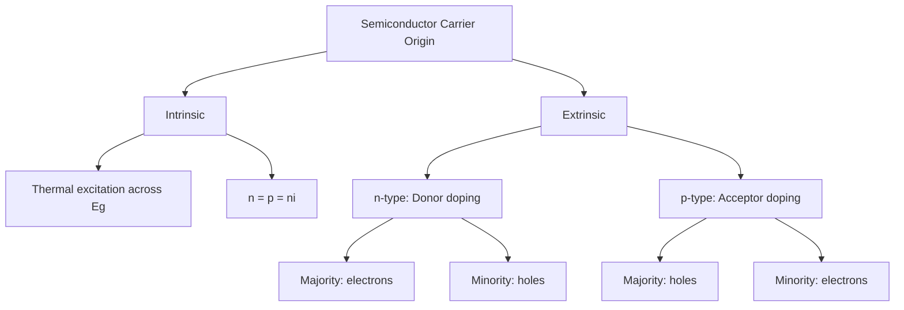

## Intrinsic and Extrinsic Semiconductors

### Overview

Semiconductors are classified by the origin of their charge carriers into two categories: **intrinsic** semiconductors, in which carriers arise solely from thermal excitation across the material's own band gap, and **extrinsic** semiconductors, in which carrier population is dominated by deliberately introduced impurity (dopant) atoms. This distinction underlies essentially all practical semiconductor device engineering, since virtually all commercial semiconductor devices operate in the extrinsic regime, with intrinsic behavior representing a limiting case and a baseline reference point.

### Intrinsic Semiconductors

An intrinsic semiconductor is chemically pure (or, more precisely, compensated such that dopant effects cancel), with all charge carriers generated exclusively by thermal excitation of valence electrons across the band gap $E_g$ into the conduction band. Each such excitation event creates an electron-hole pair simultaneously, so in an intrinsic material:

$$n = p = n_i$$

where $n$ is electron concentration, $p$ is hole concentration, and $n_i$ is the intrinsic carrier concentration.

**Intrinsic Carrier Concentration**

$$n_i = \sqrt{N_c N_v} \, \exp\left(-\frac{E_g}{2k_BT}\right)$$

where $N_c$ and $N_v$ are the effective densities of states at the conduction and valence band edges respectively (themselves temperature-dependent, scaling as $T^{3/2}$ for a parabolic band). The exponential term dominates the overall temperature dependence, meaning $n_i$ increases very rapidly (over orders of magnitude) with modest increases in temperature—a direct consequence of the Fermi-Dirac distribution's exponential tail describing the probability of an electron acquiring sufficient thermal energy ($\gtrsim E_g$) to cross the gap.

**Representative Intrinsic Carrier Concentrations at 300 K** [Unverified: literature values vary somewhat by source and measurement method; order-of-magnitude figures shown]:

| Material | $E_g$ (eV, 300K) | $n_i$ (cm⁻³, approx.) |
| --- | --- | --- |
| Ge | 0.66 | $\sim 2 \times 10^{13}$ |
| Si | 1.12 | $\sim 1 \times 10^{10}$ |
| GaAs | 1.42 | $\sim 2 \times 10^{6}$ |

This table illustrates directly how sensitively $n_i$ depends on $E_g$: a roughly two-fold increase in $E_g$ from Ge to GaAs corresponds to roughly seven orders of magnitude reduction in $n_i$, consistent with the exponential relationship above.

**Fermi Level in Intrinsic Material**

Because $n = p$ by definition, the Fermi level in an intrinsic semiconductor lies very close to the midpoint of the band gap, with a small correction term accounting for any difference between $N_c$ and $N_v$ (i.e., between electron and hole effective masses):

$$E_i \approx \frac{E_c + E_v}{2} + \frac{k_BT}{2}\ln\left(\frac{N_v}{N_c}\right)$$

### Extrinsic Semiconductors

Extrinsic semiconductors have their carrier population dominated by intentionally introduced substitutional impurity atoms (dopants) rather than intrinsic thermal generation. Because dopant concentrations used in practice (typically $10^{15}$-$10^{20}$ cm⁻³) vastly exceed intrinsic carrier concentrations at room temperature for common semiconductors like Si, extrinsic carriers dominate conduction in essentially all practical devices at normal operating temperatures.

#### n-Type Doping (Donors)

Donor impurities contribute an extra electron relative to the host lattice. For Group IV hosts (Si, Ge), Group V elements (P, As, Sb) serve as donors: four of the five valence electrons participate in covalent bonding with neighboring host atoms, while the fifth is only weakly bound to the donor ion core (via a hydrogen-atom-like Coulomb potential screened by the host material's dielectric constant), occupying a shallow energy level $E_d$ located just below the conduction band edge $E_c$.

**Ionization Energy**: The donor ionization energy (binding energy of the extra electron) can be estimated using a hydrogenic (Bohr model) approximation:

$$E_c - E_d = \frac{m^*}{m_0} \cdot \frac{1}{\varepsilon_r^2} \times 13.6 \text{ eV}$$

where $m^*/m_0$ is the ratio of electron effective mass to free electron mass and $\varepsilon_r$ is the host material's relative permittivity. For Si and Ge, this typically yields donor ionization energies on the order of tens of meV—small enough that essentially all donors are thermally ionized at room temperature ($k_BT \approx 25.9$ meV at 300 K), which is why the "freeze-out" regime (incomplete ionization) is only encountered at cryogenic temperatures for these materials.

At room temperature, with essentially complete ionization, electron concentration approximately equals donor concentration when $N_D \gg n_i$:

$$n \approx N_D$$

Electrons are the **majority carrier** and holes the **minority carrier** in n-type material.

#### p-Type Doping (Acceptors)

Acceptor impurities contribute one fewer valence electron than the host, creating an electron deficiency. For Si/Ge hosts, Group III elements (B, Al, Ga, In) serve as acceptors: the dopant atom's three valence electrons participate in covalent bonding, leaving one bond incomplete; this vacancy readily accepts an electron from a neighboring valence band state (equivalently, contributes a mobile hole to the valence band), with the acceptor level $E_a$ located just above the valence band edge $E_v$.

Analogous to the donor case, with essentially complete ionization at room temperature:

$$p \approx N_A$$

Holes are the **majority carrier** and electrons the **minority carrier** in p-type material.

### Mass-Action Law

Regardless of doping level, the product of electron and hole concentrations in a semiconductor at thermal equilibrium remains constant (equal to $n_i^2$), a relation known as the **law of mass action**:

$$n \cdot p = n_i^2$$

This relation holds for both intrinsic and extrinsic material at equilibrium and provides a direct way to compute minority carrier concentration once majority carrier concentration is known: e.g., in n-type material with $n \approx N_D$, the minority hole concentration is $p \approx n_i^2/N_D$, which decreases as doping concentration increases—heavier doping suppresses minority carrier population even though it does not change $n_i$ itself.

### Compensated Semiconductors

When both donor and acceptor impurities are present simultaneously in the same material (intentionally, via counter-doping, or unintentionally, via contamination), the net carrier type and concentration is governed by the difference between donor and acceptor concentrations:

$$n - p \approx N_D - N_A \quad (\text{if } N_D > N_A, \text{ n-type})$$

$$p - n \approx N_A - N_D \quad (\text{if } N_A > N_D, \text{ p-type})$$

Compensation is both a practical concern (unintentional impurities in raw material or introduced during processing can partially cancel intended doping) and a deliberate device engineering tool (e.g., counter-doping to locally adjust net carrier concentration and type in device fabrication).

### Fermi Level Position vs. Doping

The Fermi level position shifts systematically with doping type and concentration, and is the single most useful conceptual indicator of a semiconductor's doping state on a band diagram:

- **n-type**: $E_F$ shifts upward, toward $E_c$, with heavier donor doping moving $E_F$ closer to (or, in degenerate doping, into) the conduction band
- **p-type**: $E_F$ shifts downward, toward $E_v$, with heavier acceptor doping moving $E_F$ closer to (or into) the valence band
- **Intrinsic**: $E_F$ sits near midgap

$$n = N_c \exp\left(-\frac{E_c - E_F}{k_BT}\right), \qquad p = N_v \exp\left(-\frac{E_F - E_v}{k_BT}\right)$$

These Boltzmann-approximation relations (valid for non-degenerate doping, i.e., $E_F$ not too close to a band edge) directly show that carrier concentration increases exponentially as $E_F$ moves toward the corresponding band edge.

### Fermi Level Schematic (svg_diagram)

<svg xmlns="http://www.w3.org/2000/svg" viewBox="0 0 560 240">
<text x="280" y="20" font-size="14" text-anchor="middle" font-family="sans-serif" font-weight="bold">Fermi Level vs. Doping Type (svg_diagram)</text>

<text x="90" y="45" font-size="11" text-anchor="middle" font-family="sans-serif">Intrinsic</text>

<rect x="40" y="55" width="100" height="20" fill="`#e8e8e8`" stroke="#333" />

<rect x="40" y="150" width="100" height="20" fill="`#4a7ab5`" />

<text x="150" y="68" font-size="9" font-family="sans-serif">Ec</text>

<text x="150" y="163" font-size="9" font-family="sans-serif">Ev</text>

<line x1="30" y1="112" x2="150" y2="112" stroke="#c00" stroke-width="1.5" stroke-dasharray="4,2" />

<text x="90" y="125" font-size="9" text-anchor="middle" fill="#c00" font-family="sans-serif">EF (midgap)</text>

<text x="280" y="45" font-size="11" text-anchor="middle" font-family="sans-serif">n-type</text>

<rect x="230" y="55" width="100" height="20" fill="`#e8e8e8`" stroke="#333" />

<rect x="230" y="150" width="100" height="20" fill="`#4a7ab5`" />

<line x1="220" y1="85" x2="340" y2="85" stroke="#c00" stroke-width="1.5" stroke-dasharray="4,2" />

<text x="280" y="98" font-size="9" text-anchor="middle" fill="#c00" font-family="sans-serif">EF (near Ec)</text>

<text x="470" y="45" font-size="11" text-anchor="middle" font-family="sans-serif">p-type</text>

<rect x="420" y="55" width="100" height="20" fill="`#e8e8e8`" stroke="#333" />

<rect x="420" y="150" width="100" height="20" fill="`#4a7ab5`" />

<line x1="410" y1="140" x2="530" y2="140" stroke="#c00" stroke-width="1.5" stroke-dasharray="4,2" />

<text x="470" y="133" font-size="9" text-anchor="middle" fill="#c00" font-family="sans-serif">EF (near Ev)</text>

</svg>

### Temperature Dependence of Carrier Concentration (Extrinsic Material)

Carrier concentration in a doped semiconductor exhibits three characteristic regimes as temperature is varied, commonly illustrated on a plot of $\ln(n)$ vs. $1/T$:

1. **Freeze-out regime** (low T): Thermal energy insufficient to fully ionize all dopants; carrier concentration increases with T as an increasing fraction of dopants ionize, with an apparent activation energy related to the donor/acceptor ionization energy
2. **Extrinsic (saturation) regime** (intermediate T, encompassing typical device operation): Essentially all dopants are ionized; $n \approx N_D$ (or $p \approx N_A$) is approximately constant, only weakly dependent on T
3. **Intrinsic regime** (high T): Thermally generated intrinsic carriers ($n_i$) grow large enough to dominate over the fixed dopant concentration; carrier concentration again rises steeply with T, converging toward intrinsic behavior

[Inference: the specific temperature boundaries between these regimes are material- and doping-concentration-dependent; heavier doping generally extends the extrinsic plateau to higher temperature before the intrinsic regime takes over, since a higher $N_D$ or $N_A$ requires larger $n_i$ (hence higher T) to become comparable.]

### Practical Implications

- **Device operating temperature limits**: The upper temperature limit for reliable semiconductor device operation is often set by the onset of the intrinsic regime, beyond which the device loses its designed extrinsic (doping-controlled) behavior—this is a key reason wide-bandgap semiconductors (SiC, GaN, with correspondingly smaller $n_i$ at a given T) are attractive for high-temperature power electronics applications
- **Resistivity control**: Doping concentration is the primary lever for engineering semiconductor resistivity across many orders of magnitude for specific device applications, from lightly doped drift regions in power devices to heavily doped (degenerate) contact regions
- **Junction formation**: Adjacent n-type and p-type regions within a single crystal form the basis of the p-n junction, the fundamental building block of diodes, transistors, and most semiconductor devices

**Related Topics**

- Band Theory of Solids (Fermi-Dirac Statistics, Effective Mass)
- Electrical Conduction in Materials (Mobility, Scattering Mechanisms)
- p-n Junction Theory and Diode Behavior
- Semiconductor Doping Techniques (Diffusion, Ion Implantation)
- Wide-Bandgap Semiconductors (SiC, GaN) for High-Temperature Applications
- Hall Effect Measurement of Carrier Type and Concentration
- Degenerate Doping and the Mott Transition