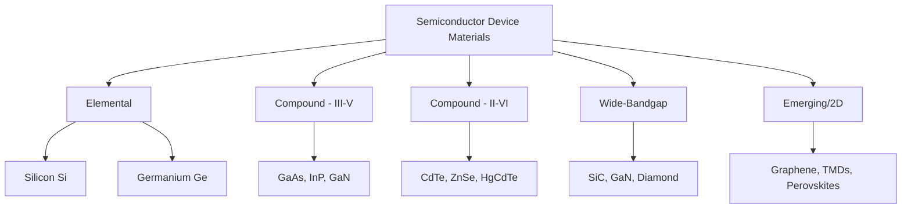

## Semiconductor Device Materials

### Overview

Semiconductor device materials encompass the specific elemental, compound, and engineered semiconductor systems selected and processed for use in electronic and optoelectronic devices. Material selection is driven by the interplay of band gap, carrier mobility, crystal quality/defect density, thermal properties, and manufacturability, with different material systems dominating different device application spaces despite silicon's overwhelming dominance in overall device volume.

### Silicon (Si)

Silicon remains the dominant semiconductor device material by volume, underpinning essentially the entire integrated circuit (IC) and mainstream power electronics industry.

**Key Properties**

- Indirect band gap, $E_g \approx 1.12$ eV at 300 K
- Abundant raw material (second most abundant element in Earth's crust), enabling low-cost, high-purity production
- Forms a native oxide (SiO₂) via thermal oxidation with exceptionally low interface trap density—a property unmatched by essentially any other semiconductor and the foundational enabler of the planar MOSFET, and by extension modern CMOS technology
- Well-established, mature, and highly refined crystal growth (Czochralski method), wafer processing, doping (diffusion, ion implantation), and lithography infrastructure developed over more than six decades

**Applications**: CMOS logic and memory ICs, discrete power devices (MOSFETs, IGBTs) up to moderate voltage/frequency ranges, standard photovoltaic cells, and the substrate for the overwhelming majority of commercial semiconductor manufacturing.

**Limitations**: Indirect band gap makes Si a poor light emitter, precluding its use in lasers and LEDs; moderate carrier mobility and moderate breakdown field limit high-frequency and high-voltage power performance relative to compound and wide-bandgap alternatives.

### Germanium (Ge)

Historically the first semiconductor used in transistors (point-contact and early junction transistors, late 1940s-1950s) before silicon's superior native oxide displaced it for mainstream IC manufacturing.

**Key Properties**

- Indirect band gap, $E_g \approx 0.66$ eV — smaller than Si, giving higher intrinsic carrier concentration and higher carrier mobility, but poorer high-temperature performance (intrinsic conduction onset at lower temperature)
- Higher electron and hole mobility than Si

**Modern Applications**: Reintroduced in modern devices primarily as a strain-engineering and mobility-boosting component—SiGe alloys in heterojunction bipolar transistors (HBTs) and strained-Si channel MOSFETs, and Ge or SiGe layers for high-speed RF and photonics applications (Ge photodetectors integrated with Si photonics, leveraging Ge's higher absorption in near-infrared wavelengths relevant to optical fiber communication).

### III-V Compound Semiconductors

Formed from Group III (Al, Ga, In) and Group V (N, P, As, Sb) elements, offering a wide range of tunable band gaps, direct band gaps in many compositions (enabling efficient light emission), and generally higher electron mobility than Si.

**Gallium Arsenide (GaAs)**

- Direct band gap, $E_g \approx 1.42$ eV, enabling efficient LED and laser diode operation
- Significantly higher electron mobility than Si, making it attractive for high-frequency RF applications
- Applications: RF/microwave ICs (power amplifiers in mobile handsets, satellite communications), laser diodes, high-efficiency multi-junction solar cells (often combined with Ge and other III-V layers)
- Higher cost and more difficult processing than Si; lacks a high-quality native oxide analogous to SiO₂

**Indium Phosphide (InP)**

- Direct band gap, $E_g \approx 1.35$ eV, with excellent high-frequency and high-speed electron transport properties
- Key material for long-haul fiber-optic telecommunications (lasers and photodetectors operating at the 1.3 and 1.55 μm low-loss/low-dispersion fiber wavelength windows) and high-speed electronic devices (HEMTs for millimeter-wave applications)

**Gallium Nitride (GaN)**

- Wide, direct band gap, $E_g \approx 3.4$ eV
- Enabled practical blue and white LEDs [Unverified: the development of efficient GaN-based blue LEDs is widely credited to Akasaki, Amano, and Nakamura, recognized with the 2014 Nobel Prize in Physics; specific technical priority details are well documented in the literature but not restated here in full]
- High breakdown field and high electron saturation velocity make GaN (typically in AlGaN/GaN heterostructure form, exploiting the two-dimensional electron gas formed at the heterojunction) an increasingly important material for high-power, high-frequency RF devices and high-efficiency power electronics (fast-switching power converters, chargers)

**Aluminum Gallium Arsenide (AlGaAs) and Related Alloys**

Ternary and quaternary III-V alloys (AlGaAs, InGaAs, InGaAsP, AlGaN) allow continuous tuning of band gap and lattice constant by varying composition, enabling engineered heterostructures (quantum wells, superlattices) used extensively in laser diodes, high-electron-mobility transistors (HEMTs), and heterojunction bipolar transistors (HBTs). Lattice matching between adjacent layers (to avoid strain-induced defects) is a critical design constraint in heterostructure engineering.

### II-VI Compound Semiconductors

Formed from Group II (Zn, Cd, Hg) and Group VI (O, S, Se, Te) elements.

**Cadmium Telluride (CdTe)**

- Direct band gap, $E_g \approx 1.5$ eV, close to the theoretical optimum for single-junction photovoltaic conversion under the Shockley-Queisser limit
- A leading thin-film photovoltaic technology, offering lower material usage (thin absorber layer, on the order of a few microns, versus hundreds of microns for crystalline Si) and correspondingly different manufacturing economics

**Mercury Cadmium Telluride (HgCdTe, "MCT")**

- Alloy of HgTe (semimetal) and CdTe (semiconductor) with composition-tunable band gap spanning from near-zero to over 1 eV
- The dominant material for high-performance infrared detectors (including mid- and long-wave infrared imaging for military, astronomical, and scientific applications), since its band gap can be tuned to match specific infrared wavelength bands of interest

### Wide-Bandgap Semiconductors

A materials class defined by band gaps significantly larger than Si (typically greater than 2 eV), enabling higher breakdown voltage, higher operating temperature, and higher-frequency operation than Si-based devices.

**Silicon Carbide (SiC)**

- Indirect band gap (varies by polytype; the common 4H-SiC polytype has $E_g \approx 3.3$ eV)
- High thermal conductivity (exceeding that of Si and most other semiconductors) aids heat dissipation in power devices
- High breakdown electric field allows thinner drift layers for a given blocking voltage, reducing on-resistance relative to Si at equivalent voltage rating
- Established as the material system of choice for high-voltage power electronics (electric vehicle traction inverters, fast EV charging, grid infrastructure), displacing Si in applications where its higher device cost is offset by system-level efficiency and size/weight benefits [Inference: the pace and extent of SiC's continued displacement of Si in specific power electronics segments depends on evolving cost/yield trends in SiC wafer and device manufacturing, which is an area of active industrial development]

**Diamond**

- Very wide band gap ($E_g \approx 5.5$ eV) and the highest known bulk thermal conductivity of any material, giving in-principle superior high-power/high-temperature device performance
- Remains primarily a research/niche material due to significant challenges in large-area, low-defect-density single-crystal synthesis and controllable doping (particularly n-type doping, which remains comparatively difficult)

### Comparison of Key Device Material Properties

| Material | $E_g$ (eV) | Gap Type | Relative Electron Mobility | Primary Application Domain |
| --- | --- | --- | --- | --- |
| Si | 1.12 | Indirect | Baseline | CMOS logic/memory, general power electronics |
| Ge | 0.66 | Indirect | Higher than Si | SiGe HBTs, strained channels, IR photonics |
| GaAs | 1.42 | Direct | Higher than Si | RF/microwave ICs, LEDs, multi-junction PV |
| InP | 1.35 | Direct | Very high | Fiber-optic lasers/photodetectors, mm-wave HEMTs |
| GaN | 3.4 | Direct | High (in heterostructure) | High-power RF, fast power switching |
| SiC (4H) | ~3.3 | Indirect | Moderate | High-voltage power electronics |
| CdTe | 1.5 | Direct | Moderate | Thin-film photovoltaics |
| HgCdTe | 0-1.5 (tunable) | Direct | High | Infrared detectors |

### Emerging and 2D Semiconductor Materials

**Graphene**: A single atomic layer of sp²-bonded carbon exhibiting exceptionally high carrier mobility and a zero band gap (semimetal), limiting its direct use in conventional transistor switching applications (no natural "off" state) but making it of interest for RF and sensing applications, and as a component in heterostructure stacks with other 2D materials.

**Transition Metal Dichalcogenides (TMDs)**, e.g., MoS₂, WSe₂: Layered 2D semiconductors exhibiting a transition from indirect (bulk) to direct (monolayer) band gap as thickness is reduced to a single layer, of significant current research interest for ultra-thin transistors and optoelectronic devices. [Speculation: whether TMDs achieve broad commercial device deployment, versus remaining primarily a research materials system, remains an open question dependent on unresolved large-area synthesis and contact-resistance challenges.]

**Halide Perovskites**: Solution-processable direct-bandgap semiconductors (e.g., methylammonium lead iodide) that have achieved rapidly rising photovoltaic conversion efficiencies in laboratory-scale devices; long-term operational stability and lead-toxicity concerns remain active areas of ongoing materials research. [Speculation: commercial-scale, long-lifetime deployment of perovskite photovoltaics is an evolving area; current published stability figures should be verified against the most recent literature given the field's rapid pace of change.]

### Device Material Selection Framework (svg_diagram)

<svg xmlns="http://www.w3.org/2000/svg" viewBox="0 0 560 260">
<text x="280" y="20" font-size="14" text-anchor="middle" font-family="sans-serif" font-weight="bold">Material Selection by Application Domain (svg_diagram)</text>
<line x1="60" y1="220" x2="520" y2="220" stroke="#333" stroke-width="1.5" />
<text x="290" y="245" font-size="10" text-anchor="middle" font-family="sans-serif">Band Gap (eV) →</text>
<line x1="60" y1="220" x2="60" y2="50" stroke="#333" stroke-width="1.5" />

<text x="90" y="230" font-size="9" text-anchor="middle" font-family="sans-serif">0.7</text>

<text x="170" y="230" font-size="9" text-anchor="middle" font-family="sans-serif">1.1</text>

<text x="260" y="230" font-size="9" text-anchor="middle" font-family="sans-serif">1.4</text>

<text x="380" y="230" font-size="9" text-anchor="middle" font-family="sans-serif">3.3</text>

<text x="470" y="230" font-size="9" text-anchor="middle" font-family="sans-serif">5.5</text>

<circle cx="90" cy="180" r="8" fill="#4a7ab5" />
<text x="90" y="200" font-size="9" text-anchor="middle" font-family="sans-serif">Ge</text>
<circle cx="170" cy="150" r="10" fill="#4a7ab5" />
<text x="170" y="200" font-size="9" text-anchor="middle" font-family="sans-serif">Si</text>
<text x="170" y="130" font-size="8" text-anchor="middle" font-family="sans-serif" fill="#555">Logic/Power</text>
<circle cx="260" cy="110" r="9" fill="#0a6" />
<text x="260" y="200" font-size="9" text-anchor="middle" font-family="sans-serif">GaAs/InP</text>
<text x="260" y="95" font-size="8" text-anchor="middle" font-family="sans-serif" fill="#555">RF/Photonics</text>
<circle cx="380" cy="80" r="9" fill="#c60" />
<text x="380" y="200" font-size="9" text-anchor="middle" font-family="sans-serif">SiC/GaN</text>
<text x="380" y="65" font-size="8" text-anchor="middle" font-family="sans-serif" fill="#555">High-Power/High-T</text>
<circle cx="470" cy="60" r="7" fill="#888" />
<text x="470" y="200" font-size="9" text-anchor="middle" font-family="sans-serif">Diamond</text>
</svg>

### Crystal Growth and Substrate Considerations

Device material selection is inseparable from substrate/crystal growth practicality:

- Si benefits from mature, large-diameter (up to 300-450 mm), low-defect Czochralski crystal growth
- III-V and wide-bandgap materials are generally more difficult and costly to grow as large, low-defect single crystals, and are often grown heteroepitaxially on a different, more readily available substrate (e.g., GaN commonly grown on sapphire, SiC, or Si substrates), introducing lattice-mismatch and thermal-expansion-mismatch-induced defect density challenges that constrain achievable device performance and yield

**Related Topics**

- Band Theory of Solids (Direct vs. Indirect Gap)
- Intrinsic and Extrinsic Semiconductors (Doping Strategies)
- Electrical Conduction in Materials (Mobility Comparison)
- Heteroepitaxy and Lattice Mismatch
- Power Electronics Device Structures (MOSFET, IGBT, HEMT)
- Photovoltaic Materials and the Shockley-Queisser Limit
- Optoelectronic Devices (LEDs, Laser Diodes, Photodetectors)