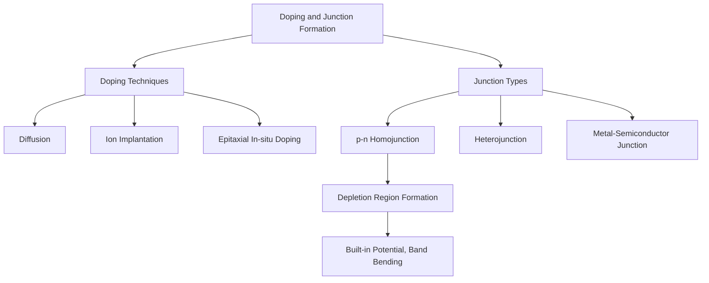

## Doping and Junction Formation

### Overview

Doping—the controlled introduction of impurity atoms into a semiconductor crystal—and junction formation—the process of creating adjacent regions of differing doping type or concentration within a single crystal—together constitute the core fabrication toolkit underlying nearly all semiconductor devices. Doping determines local electronic properties (carrier type, concentration, conductivity), while junction formation between differently doped regions creates the built-in electric fields and energy barriers that give diodes, transistors, and virtually all active semiconductor devices their functional behavior.

### Doping Techniques

**Thermal Diffusion**

Dopant atoms are introduced at the wafer surface (via a solid, liquid, or gaseous dopant source) and driven into the crystal by high-temperature (typically 900-1200°C) thermal diffusion, following Fick's laws of diffusion. The resulting dopant concentration profile is characteristically graded, following an error-function or Gaussian distribution depending on the diffusion source condition (constant-source vs. limited-source diffusion):

$$C(x,t) = C_s \, \text{erfc}\left(\frac{x}{2\sqrt{Dt}}\right) \quad \text{(constant surface concentration)}$$

where $D$ is the temperature-dependent diffusion coefficient of the specific dopant species in the host lattice, $C_s$ is surface concentration, and $x$ is depth. Diffusion was the dominant doping technique in early IC manufacturing but has been largely supplanted by ion implantation for precision applications, though it remains used for certain deep-junction and specific process steps.

**Ion Implantation**

Dopant atoms are ionized, accelerated to high energy (typically tens to hundreds of keV), and directed into the wafer surface via an electric field in a controlled beam. This is the dominant doping technique in modern IC manufacturing due to superior control.

**Key Advantages**

- Precise, independently controllable dose (total number of implanted atoms per unit area, via beam current and implant time) and depth profile (via accelerating energy)
- Depth profile approximates a Gaussian distribution centered at a "projected range" $R_p$ determined by ion energy and species/target combination, with a characteristic straggle (spread) $\Delta R_p$
- Can dope through a masking layer (photoresist, oxide) at room temperature, enabling precise lateral pattern control via standard lithography, unlike diffusion which requires higher-temperature masking
- Allows selective-area, self-aligned doping (a cornerstone of modern MOSFET fabrication, where the gate electrode itself serves as an implant mask to self-align source/drain regions to the gate)

**Key Drawback and Mitigation**: The high-energy ion bombardment damages the crystal lattice, displacing host atoms and disrupting the periodic structure. A subsequent high-temperature **annealing** step (rapid thermal annealing, RTA, is commonly used in modern processes to minimize dopant diffusion during the anneal) is required to repair lattice damage and electrically activate implanted dopants by moving them onto substitutional lattice sites where they can act as effective donors/acceptors.

**In-Situ (Epitaxial) Doping**

Dopant gas is introduced during epitaxial crystal growth (e.g., chemical vapor deposition, CVD), incorporating dopant atoms directly into the growing crystal lattice as it forms. This produces very sharp, well-controlled doping profiles (limited primarily by growth interruption/gas switching characteristics rather than post-growth diffusion) and avoids the lattice damage associated with ion implantation, making it valuable for precision heterostructure and superlattice device fabrication.

### Doping Technique Comparison

| Technique | Profile Control | Lattice Damage | Lateral Precision | Typical Use |
| --- | --- | --- | --- | --- |
| Diffusion | Moderate (graded) | None (thermal process) | Moderate (mask-limited) | Legacy processes, deep junctions |
| Ion Implantation | High (dose/energy independent) | Yes (requires anneal) | High (room-T masking) | Modern IC/MOSFET fabrication |
| In-situ Epitaxial | Very high (sharp profiles) | None | Limited to blanket/selective epitaxy | Heterostructures, precision devices |

### The p-n Junction: Formation and Equilibrium

A **p-n junction** forms at the interface between a p-type region and an n-type region within a single continuous semiconductor crystal (a homojunction, as opposed to a heterojunction formed between two different semiconductor materials).

**Formation Process (conceptual)**: Immediately upon contact (conceptually; in practice the junction is fabricated directly via selective-area doping of an initially uniform substrate), a large carrier concentration gradient exists across the interface—high electron concentration on the n-side, high hole concentration on the p-side. This gradient drives **diffusion current**: electrons diffuse from n-side to p-side, holes diffuse from p-side to n-side.

**Depletion Region Formation**: As majority carriers diffuse across the junction and recombine with the opposite majority carrier on the other side, they leave behind fixed, immobile ionized dopant atoms (positively charged donor ions on the n-side, negatively charged acceptor ions on the p-side) in a narrow region straddling the junction, since the mobile carriers that originally balanced these fixed charges have diffused away. This region, depleted of mobile carriers, is called the **depletion region** (or space-charge region).

**Built-in Electric Field and Drift-Diffusion Equilibrium**: The exposed fixed charges in the depletion region create an internal electric field pointing from the n-side toward the p-side, which opposes further diffusion of majority carriers (it pushes electrons back toward the n-side and holes back toward the p-side). This field also drives a **drift current** of minority carriers in the opposite direction to the diffusion current. At thermal equilibrium (zero external bias), diffusion and drift currents for each carrier type exactly balance, giving zero net current—a dynamic, not static, equilibrium.

### Built-in Potential

The equilibrium electric field corresponds to a built-in potential difference $V_{bi}$ across the junction, related to the doping concentrations on each side:

$$V_{bi} = \frac{k_BT}{e} \ln\left(\frac{N_A N_D}{n_i^2}\right)$$

This relation shows $V_{bi}$ increases (logarithmically) with heavier doping on either side, and depends on temperature both explicitly (via $k_BT/e$) and implicitly (via $n_i$'s strong temperature dependence). For silicon at room temperature with typical doping levels ($N_A, N_D \sim 10^{16}$-$10^{18}$ cm⁻³), $V_{bi}$ is typically on the order of 0.6-0.8 V.

### Depletion Region Width

Solving Poisson's equation across the junction under the standard depletion (abrupt junction) approximation gives depletion width:

$$W = \sqrt{\frac{2\varepsilon_s}{e}\left(\frac{1}{N_A} + \frac{1}{N_D}\right)(V_{bi} - V_{applied})}$$

where $\varepsilon_s$ is the semiconductor's permittivity and $V_{applied}$ is any externally applied bias (positive for forward bias, negative for reverse bias, following standard sign convention). Key implications directly follow from this expression:

- **Heavier doping narrows the depletion region** on the more heavily doped side, and reduces overall $W$
- **Forward bias** ($V_{applied} > 0$, p-side positive relative to n-side) reduces the net potential barrier ($V_{bi} - V_{applied}$), narrowing $W$ and lowering the barrier to majority carrier diffusion, exponentially increasing diffusion current relative to drift current—this asymmetric response to bias polarity is the physical origin of diode rectifying behavior
- **Reverse bias** ($V_{applied} < 0$) widens $W$ and increases the barrier, suppressing diffusion current so that only a small, largely bias-independent drift (minority carrier) current flows (the reverse saturation current)

### Junction Band Diagram Schematic (svg_diagram)

<svg xmlns="http://www.w3.org/2000/svg" viewBox="0 0 540 260">
<text x="270" y="20" font-size="14" text-anchor="middle" font-family="sans-serif" font-weight="bold">p-n Junction at Equilibrium (svg_diagram)</text>

<text x="90" y="50" font-size="11" font-family="sans-serif">p-type</text>

<text x="420" y="50" font-size="11" font-family="sans-serif">n-type</text>

<path d="M 40 90 L 220 90 L 320 150 L 500 150" fill="none" stroke="#4a7ab5" stroke-width="2.5" />
<text x="510" y="153" font-size="9" font-family="sans-serif">Ec</text>
<path d="M 40 190 L 220 190 L 320 130 L 500 130" fill="none" stroke="#c00" stroke-width="2.5" />
<text x="510" y="133" font-size="9" font-family="sans-serif">Ev</text>
<line x1="40" y1="140" x2="500" y2="140" stroke="#333" stroke-width="1" stroke-dasharray="5,3" />
<text x="20" y="143" font-size="9" font-family="sans-serif">EF</text>
<rect x="220" y="75" width="100" height="130" fill="#f5e6c8" opacity="0.5" />
<text x="270" y="220" font-size="10" text-anchor="middle" font-family="sans-serif">Depletion Region (W)</text>
<line x1="270" y1="95" x2="270" y2="185" stroke="#0a0" stroke-width="1.5" marker-start="url(#arrd)" marker-end="url(#arru)" />
<text x="285" y="140" font-size="9" font-family="sans-serif" fill="#0a0">e·Vbi</text>
</svg>

### Junction Profile Types: Abrupt vs. Graded

- **Abrupt (step) junction**: Doping concentration transitions sharply from $N_A$ to $N_D$ at the metallurgical junction, a good approximation for ion-implanted junctions with shallow implant depth relative to subsequent processing, and the standard assumption underlying the depletion-width formula above
- **Linearly graded junction**: Doping concentration varies approximately linearly through the junction region, a better approximation for diffused junctions where the dopant profile is inherently graded; requires a modified (though qualitatively similar) depletion-width analysis

### Heterojunctions

A **heterojunction** forms between two different semiconductor materials (rather than the same material with different doping, as in a homojunction) with generally different band gaps, electron affinities, and lattice constants. This introduces discontinuities in the conduction and valence band edges at the interface (**band offsets**, $\Delta E_c$ and $\Delta E_v$), in addition to the built-in potential arising from any doping difference.

**Design Considerations**

- **Lattice matching**: Significant lattice constant mismatch between the two materials introduces strain and, above a critical thickness, misfit dislocations that degrade device performance (carrier lifetime, leakage current); heterostructure material systems are often chosen specifically for close lattice matching (e.g., AlGaAs/GaAs) or engineered with strain-compensating layers
- **Band alignment type**: Heterojunctions are classified as Type I (straddling gap, where one material's gap lies entirely within the other's), Type II (staggered gap), or Type III (broken gap), each producing different carrier confinement behavior exploited in different device designs (quantum wells, tunnel junctions)

Heterojunctions enable device functionality unavailable in homojunctions, notably carrier confinement in heterojunction bipolar transistors (HBTs, improving emitter injection efficiency) and quantum wells in laser diodes and HEMTs (confining carriers to a thin high-mobility channel).

### Metal-Semiconductor Junctions

Contacts between a metal and a semiconductor form either a **Schottky barrier** (rectifying, diode-like behavior) or an **ohmic contact** (linear, low-resistance behavior), depending on the relative work functions of the metal and semiconductor and the doping level at the semiconductor surface.

- **Schottky contact**: Forms when metal work function and semiconductor properties create a potential barrier to majority carrier flow (analogous in some respects to a p-n junction, but based on majority rather than minority carrier transport, giving faster switching and no minority-carrier storage effects); used in Schottky diodes and as the gate contact in MESFETs
- **Ohmic contact**: Achieved in practice primarily via heavy doping of the semiconductor surface region beneath the metal contact, which narrows the barrier depletion width sufficiently that carriers can tunnel through it regardless of the nominal barrier height, giving a low-resistance, non-rectifying contact essential for connecting devices to external circuitry

### Practical Process Integration

Modern device fabrication combines these doping and junction-formation techniques within an integrated process flow: ion implantation (with photoresist or hard-mask patterning) defines source/drain and well regions; thermal annealing activates dopants and repairs implant damage while being carefully budgeted (time-temperature product) to avoid excessive dopant diffusion that would blur precisely placed junction profiles ("thermal budget" management, an increasingly critical constraint as device dimensions shrink); and epitaxial growth with in-situ doping is used for precision layers such as MOSFET channel regions, source/drain stressor layers, or compound-semiconductor heterostructures.

**Related Topics**

- Intrinsic and Extrinsic Semiconductors (Carrier Statistics)
- Diode I-V Characteristics and Rectification
- MOSFET Structure and Operation
- Heterojunction Bipolar Transistors (HBTs) and HEMTs
- Rapid Thermal Annealing and Dopant Activation
- Schottky Barrier Theory and Ohmic Contact Formation
- Ion Implantation Damage and Channeling Effects