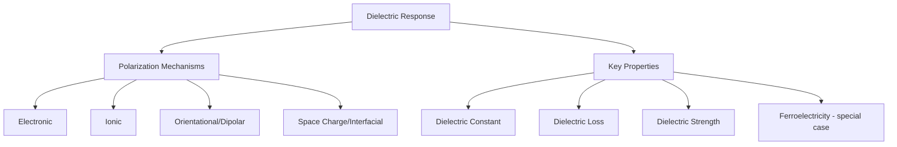

## Dielectric Materials and Insulators

### Overview

Dielectric materials are electrically insulating substances that, unlike conductors, do not support free charge flow but instead respond to an applied electric field through **polarization**—a redistribution of bound charge within the material. This distinguishes dielectrics from ideal insulators in a subtle but important way: while both classes exhibit negligible DC conductivity, "dielectric" specifically emphasizes the material's response to time-varying or static fields via polarization mechanisms, which is the property exploited in capacitors, gate oxides, and electromagnetic applications, whereas "insulator" more broadly emphasizes the absence of free-carrier conduction (see Electrical Conduction in Materials and Band Theory of Solids for the band-structure basis of this behavior).

### Polarization Mechanisms

When an electric field is applied to a dielectric, several distinct physical mechanisms can contribute to the material's net polarization response, each with characteristic response speed (and therefore a characteristic frequency range over which it remains active):

**Electronic Polarization**

The electron cloud of each atom displaces slightly relative to its nucleus under the applied field, creating a small induced dipole. This mechanism is present in all materials (since all matter contains electrons bound to nuclei) and responds essentially instantaneously, remaining active up to optical (ultraviolet) frequencies, since electron cloud displacement is an extremely fast process.

**Ionic Polarization**

In ionic or partially ionic bonded materials, the applied field displaces positive and negative ion sublattices relative to each other, creating a net dipole moment. This mechanism responds more slowly than electronic polarization (governed by ion mass and bond stiffness, i.e., phonon frequencies) and typically remains active up to infrared frequencies, above which ion displacement can no longer track the oscillating field.

**Orientational (Dipolar) Polarization**

In materials containing permanent molecular or structural dipoles (e.g., polar molecules like water, or asymmetric polymer chain segments), an applied field tends to align these dipoles against the randomizing effect of thermal agitation. This mechanism is comparatively slow (limited by the rotational/reorientation time of the dipole-bearing unit) and typically becomes ineffective above radio or microwave frequencies depending on the specific dipole's characteristic relaxation time.

**Space Charge (Interfacial) Polarization**

Mobile charge carriers (often ionic impurities or defects) migrate and accumulate at internal interfaces—grain boundaries, phase boundaries, electrode interfaces—under an applied field, creating large-scale charge separation. This is typically the slowest mechanism, significant primarily at low frequencies (below the audio/kHz range) and strongly dependent on microstructure (grain boundary density, impurity content).

### Frequency Dependence of Polarization Mechanisms

As frequency increases, each polarization mechanism sequentially "drops out" once the applied field oscillates faster than that mechanism's characteristic response time, producing a step-like decrease in the real part of the dielectric constant with characteristic loss peaks at each transition frequency.

### Dielectric Response vs. Frequency (svg_diagram)

<svg xmlns="http://www.w3.org/2000/svg" viewBox="0 0 560 260">
<text x="280" y="20" font-size="14" text-anchor="middle" font-family="sans-serif" font-weight="bold">Polarization Mechanisms vs. Frequency (svg_diagram)</text>
<line x1="60" y1="210" x2="520" y2="210" stroke="#333" stroke-width="1.5" />
<line x1="60" y1="210" x2="60" y2="50" stroke="#333" stroke-width="1.5" />
<text x="290" y="235" font-size="10" text-anchor="middle" font-family="sans-serif">Frequency (log scale) →</text>
<text x="30" y="130" font-size="10" text-anchor="middle" font-family="sans-serif" transform="rotate(-90 30 130)">ε' (dielectric const.)</text>
<path d="M 70 70 L 150 70 L 165 130 L 230 130 L 245 165 L 320 165 L 335 190 L 500 190" fill="none" stroke="#4a7ab5" stroke-width="2.5" />

<text x="90" y="65" font-size="9" font-family="sans-serif">Space charge</text>

<text x="180" y="125" font-size="9" font-family="sans-serif">Dipolar</text>

<text x="265" y="160" font-size="9" font-family="sans-serif">Ionic</text>

<text x="400" y="185" font-size="9" font-family="sans-serif">Electronic</text>

<text x="150" y="230" font-size="8" text-anchor="middle" font-family="sans-serif">kHz</text>

<text x="245" y="230" font-size="8" text-anchor="middle" font-family="sans-serif">MHz</text>

<text x="335" y="230" font-size="8" text-anchor="middle" font-family="sans-serif">IR</text>

<text x="480" y="230" font-size="8" text-anchor="middle" font-family="sans-serif">UV</text>

</svg>

### Key Dielectric Properties

**Dielectric Constant (Relative Permittivity, $\varepsilon_r$)**

Defines the ratio of a material's permittivity to that of free space, quantifying its polarizability and, practically, the degree to which the material enhances capacitance relative to vacuum:

$$C = \varepsilon_r \varepsilon_0 \frac{A}{d}$$

for a parallel-plate capacitor of area $A$ and separation $d$, where $\varepsilon_0$ is the permittivity of free space. Materials with high $\varepsilon_r$ ("high-k" dielectrics) are valuable for achieving high capacitance in a compact geometry, notably in modern transistor gate dielectrics (see below) and multilayer ceramic capacitors.

**Dielectric Loss and Loss Tangent**

Real dielectrics dissipate some energy as heat when subjected to an oscillating field, characterized by expressing permittivity as a complex quantity:

$$\varepsilon_r^* = \varepsilon_r' - i\varepsilon_r''$$

where $\varepsilon_r'$ is the (energy-storing) real part and $\varepsilon_r''$ is the (energy-dissipating) imaginary part. The **loss tangent** (dissipation factor) is:

$$\tan\delta = \frac{\varepsilon_r''}{\varepsilon_r'}$$

Loss tangent is typically frequency-dependent, exhibiting peaks near each polarization mechanism's characteristic relaxation frequency (where energy is maximally dissipated as that mechanism struggles to keep pace with the field). Low loss tangent is critical for RF/microwave dielectric applications and for minimizing self-heating in high-frequency capacitors.

**Dielectric Strength (Breakdown Field)**

The maximum electric field a dielectric can withstand before catastrophic electrical breakdown (formation of a conductive path, typically through avalanche ionization or localized thermal runaway) occurs. Dielectric strength is highly sensitive to material defects (voids, inclusions, moisture), sample geometry/thickness (thinner samples often exhibit higher apparent breakdown field due to reduced defect population and different thermal dissipation characteristics), and test conditions, so measured values should be interpreted alongside the specific test standard and geometry used. [Inference: quantitative breakdown field values reported in datasheets and literature can vary considerably across sources depending on these factors, and comparisons across materials are most meaningful when measurement conditions are matched.]

### Dielectric Materials in Electronic Devices

**Gate Oxide / Gate Dielectric Materials**

In MOSFET devices, the gate dielectric electrically isolates the gate electrode from the semiconductor channel while capacitively coupling gate voltage to channel charge.

- **Silicon Dioxide (SiO₂)**: The historical and, for decades, essentially universal gate dielectric, owing to silicon's uniquely high-quality native oxide (low interface trap density, excellent electrical and thermal stability). $\varepsilon_r \approx 3.9$
- **High-k Dielectrics (e.g., HfO₂-based)**: As transistor scaling drove gate oxide thickness toward the physical limit where direct quantum-mechanical tunneling current through ultrathin SiO₂ became prohibitive (a few nm), the semiconductor industry transitioned to high-k dielectric materials (hafnium-based oxides being the dominant choice in modern CMOS logic, [Unverified: specific formulation details are proprietary/process-node-dependent and not standardized across manufacturers]), which allow a physically thicker layer (suppressing tunneling leakage) while maintaining equivalent gate capacitance, since a higher $\varepsilon_r$ compensates for greater thickness in the capacitance formula above

**Interlayer/Interconnect Dielectrics**

Low-k dielectric materials (porous or fluorine-doped oxide variants, with $\varepsilon_r$ below that of standard SiO₂) are used between metal interconnect layers in advanced ICs to minimize parasitic capacitive coupling and associated RC delay/crosstalk as interconnect spacing shrinks, directly analogous in motivation (though opposite in direction) to the high-k gate dielectric transition described above.

**Capacitor Dielectrics**

Ceramic dielectrics (barium titanate, BaTiO₃, and related perovskite-structure ferroelectric/paraelectric ceramics) dominate multilayer ceramic capacitor (MLCC) applications due to very high achievable $\varepsilon_r$ (hundreds to thousands, though strongly temperature- and field-dependent for ferroelectric compositions), while polymer film dielectrics (polypropylene, polyester) offer lower $\varepsilon_r$ but superior stability, lower loss, and self-healing breakdown characteristics valued in power electronics and precision applications.

### Ferroelectricity (Special Case)

A subset of dielectric materials, notably certain perovskite-structure ceramics (BaTiO₃, PZT), exhibit **ferroelectricity**: a spontaneous electric polarization that persists in the absence of an applied field and can be reversed (switched) by a sufficiently strong applied field, in direct analogy to ferromagnetism's spontaneous, switchable magnetization. Ferroelectric materials exhibit hysteresis in their polarization-field (P-E) response and a Curie temperature above which ferroelectric order is lost (transitioning to a conventional, non-hysteretic paraelectric state)—these materials underpin applications including high-permittivity capacitors, piezoelectric actuators/sensors (many ferroelectrics are also piezoelectric), and non-volatile ferroelectric memory (FeRAM). [Inference: given ferroelectricity's substantial conceptual and application scope, it is often addressed as a related but distinct topic area in materials curricula rather than treated purely as a subset of dielectric behavior.]

### Bulk Insulating Materials

Beyond thin-film device dielectrics, bulk electrical insulators serve structural and isolation roles across electrical and electronic engineering:

- **Ceramic insulators** (alumina, porcelain): high dielectric strength, thermal stability, and mechanical robustness; used in high-voltage power transmission insulators and electronic packaging substrates
- **Polymeric insulators** (polyethylene, PTFE, epoxy, silicone rubber): used extensively in wire/cable insulation, potting compounds, and printed circuit board substrates (e.g., FR-4 glass-epoxy laminate); generally lower cost and easier to process than ceramics but with lower maximum operating temperature and, in some cases, greater susceptibility to environmental degradation (UV, moisture, tracking)
- **Glass insulators**: used in specific high-voltage and hermetic sealing applications, combining reasonable dielectric strength with excellent environmental sealing properties

### Dielectric Material Comparison

| Material | $\varepsilon_r$ (approx.) | Loss Tangent | Primary Application |
| --- | --- | --- | --- |
| SiO₂ (thermal) | ~3.9 | Very low | Legacy gate oxide, general IC insulation |
| HfO₂-based high-k | ~15-25 | Low-moderate | Modern MOSFET gate dielectric |
| Low-k (porous/F-doped oxide) | ~2.5-3.0 | Low | IC interconnect dielectric |
| BaTiO₃ (ferroelectric ceramic) | Hundreds-thousands (T/field-dependent) | Moderate | MLCC capacitors |
| Polypropylene film | ~2.2 | Very low | Film/power capacitors |
| Al₂O₃ (alumina ceramic) | ~9-10 | Low | Substrates, high-voltage insulators |
| PTFE | ~2.1 | Very low | RF/microwave insulation, cable jacketing |

### Design Trade-offs

Dielectric material selection in any given application generally involves balancing competing requirements: higher $\varepsilon_r$ enables greater capacitance density but is often accompanied by higher loss and, in ferroelectric ceramics, strong temperature/voltage dependence of capacitance (an important design limitation for precision analog applications); higher dielectric strength permits thinner insulation layers (beneficial for size/capacitance) but material choices favoring high dielectric strength do not always simultaneously optimize for low loss or high $\varepsilon_r$, so real designs typically represent an application-specific compromise among these interrelated properties.

**Related Topics**

- Electrical Conduction in Materials (Insulator Band Structure)
- Ferroelectric and Piezoelectric Materials
- MOSFET Gate Dielectric Scaling and High-k Materials
- Capacitor Design and Multilayer Ceramic Capacitors (MLCCs)
- Polymer Insulation Materials and Aging Mechanisms
- Dielectric Breakdown Mechanisms (Avalanche, Thermal, Partial Discharge)
- Piezoelectricity and Electromechanical Coupling