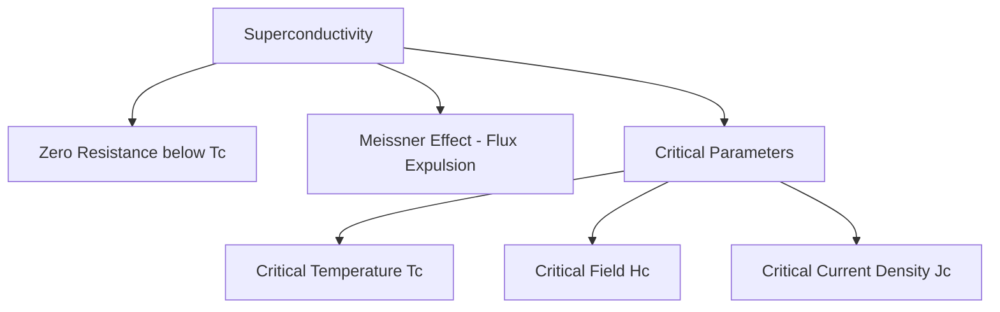
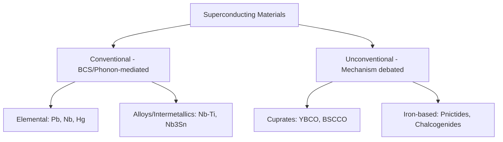

## Superconducting Materials

### Definition and Defining Phenomena

Superconductivity is a state of matter in which a material exhibits exactly zero electrical resistance and expels applied magnetic fields (perfect diamagnetism) below a characteristic **critical temperature** $T_c$. Two phenomena together define the superconducting state, and both must be present for a material to be classified as a true superconductor rather than merely an exceptionally good conductor:

- **Zero electrical resistance**: Below $T_c$, DC resistivity drops discontinuously to an immeasurably small value (experimentally indistinguishable from zero, verified by persistent-current experiments showing negligible current decay over periods of years)
- **Meissner effect**: Below $T_c$, a superconductor actively expels magnetic flux from its interior (perfect diamagnetism, $\chi = -1$), a phenomenon distinct from and not fully explained by zero resistance alone—a hypothetical perfect conductor (zero resistance without the Meissner effect) would merely trap whatever flux was present when it became resistance-free, rather than actively expelling pre-existing flux, which is what makes the Meissner effect diagnostic of true superconductivity

### Critical Parameters

A superconductor's operating envelope is bounded by three interrelated critical parameters, exceeding any one of which destroys superconductivity:

- **Critical temperature ($T_c$)**: temperature above which superconductivity is lost
- **Critical magnetic field ($H_c$)**: applied magnetic field above which superconductivity is destroyed at a given temperature (for Type I superconductors) or above which flux begins penetrating the material (for Type II, see below)
- **Critical current density ($J_c$)**: current density above which superconductivity is destroyed, since current flow itself generates a magnetic field that can locally exceed the critical field

These three parameters are interdependent (each decreases as the other two increase, tracing out a critical surface in $T$-$H$-$J$ space), meaning a superconductor's usable operating envelope for a given application (e.g., magnet windings requiring both high current and high field) must account for all three simultaneously rather than treating $T_c$ alone as the defining figure of merit.

### Type I vs. Type II Superconductors

**Type I Superconductors**

Exhibit a single, sharp critical field $H_c$: below $H_c$, the material is a perfect diamagnet (complete Meissner expulsion); above $H_c$, superconductivity is abruptly and completely destroyed. Type I superconductors are typically elemental metals (Pb, Hg, Sn, Al) with relatively low $T_c$ (below approximately 10 K) and low $H_c$ values, limiting their practical use in high-field applications.

**Type II Superconductors**

Exhibit two critical fields, $H_{c1}$ and $H_{c2}$, with an intermediate "mixed state" (vortex state) between them: below $H_{c1}$, complete Meissner expulsion occurs as in Type I; between $H_{c1}$ and $H_{c2}$, magnetic flux partially penetrates the material in discrete quantized flux lines (Abrikosov vortices), each carrying a single flux quantum and surrounded by a circulating supercurrent vortex, while superconductivity persists in the regions between vortices; above $H_{c2}$, superconductivity is fully destroyed.

Type II superconductors, including virtually all technologically important high-field superconducting materials, can sustain much higher critical fields than Type I materials because the mixed state allows the material to accommodate substantial magnetic flux while retaining zero resistance in the bulk. **Flux pinning**—the immobilization of vortices at microstructural defects (grain boundaries, precipitates, dislocations)—is critical to practical Type II superconductor performance, since unpinned vortices can move under Lorentz force from an applied current, dissipating energy and effectively reintroducing resistance; deliberate defect engineering to enhance flux pinning is a major materials-processing lever for improving practical critical current density.

### BCS Theory (Conventional Superconductivity)

The Bardeen-Cooper-Schrieffer (BCS) theory, developed in 1957, provides the microscopic explanation for conventional (low-$T_c$) superconductivity: [Unverified: BCS theory was recognized with the 1972 Nobel Prize in Physics; this is well-documented historical fact not requiring further elaboration here].

**Cooper Pairing Mechanism**: Below $T_c$, electrons near the Fermi surface can form weakly bound pairs (**Cooper pairs**) mediated by an attractive, phonon-mediated interaction: one electron slightly distorts the local lattice (polarizing nearby positive ion cores), and a second electron is attracted to this transient region of enhanced positive charge density before the lattice distortion relaxes. Although the direct Coulomb interaction between two electrons is repulsive, this phonon-mediated, retarded interaction can produce a net attractive effective interaction under appropriate conditions.

**Energy Gap and Condensate Behavior**: Cooper pairs condense into a single, coherent quantum ground state (a macroscopic quantum phenomenon, analogous in spirit to Bose-Einstein condensation though Cooper pairs are not simple bosons), separated from the normal (unpaired electron) excited states by an energy gap $\Delta$. This gap must be overcome to break a Cooper pair (e.g., via thermal excitation or scattering), and its existence is what prevents the usual resistive scattering mechanisms (which rely on individual electron scattering events) from operating in the paired, condensed state—since scattering a single electron out of the condensate costs energy $\Delta$ that is often unavailable at low temperature.

**BCS Relation for $T_c$**: In the weak-coupling limit, BCS theory predicts a characteristic relationship between the superconducting energy gap and critical temperature:

$$2\Delta(0) \approx 3.53 \, k_B T_c$$

a relation experimentally well-verified for many conventional superconductors, serving as one of the classic quantitative tests of BCS theory.

### Conventional Superconducting Materials

| Material | $T_c$ (K, approx.) | Type | Notes |
| --- | --- | --- | --- |
| Hg | 4.2 | I | First superconductor discovered (Kamerlingh Onnes, 1911) [Unverified: widely documented discovery date/attribution] |
| Pb | 7.2 | I | Common Type I reference material |
| Nb | 9.3 | II | Highest $T_c$ among elemental superconductors |
| Nb-Ti alloy | ~9-10 | II | Dominant commercial low-$T_c$ magnet wire material (MRI magnets) |
| Nb₃Sn | ~18 | II | Higher $T_c$/$H_c$ than Nb-Ti; used in high-field magnets (e.g., ITER, high-field research magnets) |

**Nb-Ti** remains the dominant commercial superconducting material for MRI magnets and many other applications due to its excellent mechanical ductility (allowing conventional wire drawing into multi-filamentary composite conductors) combined with adequate $T_c$ and critical field for operation in liquid helium (4.2 K). **Nb₃Sn**, an intermetallic compound, offers higher critical field and current density than Nb-Ti but is brittle, requiring specialized "react-and-wind" or "wind-and-react" fabrication processes to form the final magnet coil geometry, since the brittle intermetallic phase cannot be drawn into fine wire after formation.

### High-Temperature Superconductors (Cuprates)

The 1986 discovery of superconductivity above 30 K in a lanthanum-barium-copper-oxide compound [Unverified: attributed to Bednorz and Müller, recognized with the 1987 Nobel Prize in Physics; well-documented but noted here as historical attribution rather than a figure requiring independent verification in this context] initiated intensive research into **cuprate superconductors**—layered copper-oxide perovskite-related ceramic materials exhibiting $T_c$ values well above the liquid nitrogen boiling point (77 K), a transformative practical threshold since liquid nitrogen cooling is vastly cheaper and more accessible than liquid helium cooling required for conventional superconductors.

**Representative Cuprate Materials**

| Material | $T_c$ (K, approx.) |
| --- | --- |
| YBa₂Cu₃O₇ (YBCO / "1-2-3" compound) | ~93 |
| Bi₂Sr₂Ca₂Cu₃O₁₀ (BSCCO-2223) | ~110 |
| HgBa₂Ca₂Cu₃O₈ | ~133-135 (highest reported at ambient pressure among cuprates) |

**Mechanism**: Unlike conventional BCS superconductors, the pairing mechanism in cuprate high-$T_c$ superconductors is not fully established as simple phonon-mediated BCS coupling and remains, in significant respects, an active area of condensed matter physics research. [Speculation/active research area: while it is well established that cuprate superconductivity involves unconventional (commonly d-wave symmetry) Cooper pairing rather than conventional s-wave BCS pairing, and that the copper-oxide planes are central to the mechanism, a complete, broadly agreed-upon microscopic theory analogous to BCS theory for conventional superconductors has not been definitively established; this should be treated as an evolving research topic rather than settled theory.]

**Practical Challenges**: Cuprates are brittle ceramics with highly anisotropic properties (superconducting behavior concentrated in copper-oxide planes, with much weaker coupling between planes), complicating wire/tape fabrication for magnet and power applications relative to ductile conventional metal superconductors; commercial high-$T_c$ conductors are typically produced as textured, layered tape structures (e.g., YBCO-coated conductors on textured metallic substrates) rather than conventional round wire.

### Iron-Based Superconductors

A distinct family of high-$T_c$ superconductors (iron pnictides and iron chalcogenides) discovered in 2008, [Unverified: initial discovery widely attributed to Hosono and coworkers; specific compound and $T_c$ progression details are well documented in the specialized literature but not restated in full here], with $T_c$ values up to approximately 55 K in some compositions—lower than the best cuprates but notable for occurring in materials containing iron, an element whose magnetism was historically considered antithetical to conventional superconductivity, making this family scientifically significant for probing the relationship (and apparent competition/cooperation) between magnetism and superconducting pairing mechanisms.

### Superconductor Classification Overview

### Critical Field Behavior Schematic (svg_diagram)

<svg xmlns="http://www.w3.org/2000/svg" viewBox="0 0 540 260">
<text x="270" y="20" font-size="14" text-anchor="middle" font-family="sans-serif" font-weight="bold">Type I vs. Type II Field Behavior (svg_diagram)</text>

<text x="130" y="45" font-size="12" text-anchor="middle" font-family="sans-serif">Type I</text>

<line x1="50" y1="180" x2="230" y2="180" stroke="#333" stroke-width="1" />

<line x1="50" y1="180" x2="50" y2="60" stroke="#333" stroke-width="1" />

<line x1="50" y1="90" x2="150" y2="90" stroke="`#4a7ab5`" stroke-width="3" />

<line x1="150" y1="90" x2="150" y2="180" stroke="`#4a7ab5`" stroke-width="3" />

<line x1="150" y1="180" x2="220" y2="180" stroke="`#4a7ab5`" stroke-width="3" />

<text x="150" y="200" font-size="9" text-anchor="middle" font-family="sans-serif">Hc</text>

<text x="30" y="90" font-size="9" font-family="sans-serif">M</text>

<text x="130" y="220" font-size="9" text-anchor="middle" font-family="sans-serif">Applied Field H →</text>

<text x="400" y="45" font-size="12" text-anchor="middle" font-family="sans-serif">Type II</text>

<line x1="300" y1="180" x2="510" y2="180" stroke="#333" stroke-width="1" />

<line x1="300" y1="180" x2="300" y2="60" stroke="#333" stroke-width="1" />

<line x1="300" y1="90" x2="360" y2="90" stroke="#0a6" stroke-width="3" />

<path d="M 360 90 Q 420 100 440 180" fill="none" stroke="#0a6" stroke-width="3" />

<line x1="440" y1="180" x2="500" y2="180" stroke="#0a6" stroke-width="3" />

<text x="360" y="200" font-size="9" text-anchor="middle" font-family="sans-serif">Hc1</text>

<text x="440" y="200" font-size="9" text-anchor="middle" font-family="sans-serif">Hc2</text>

<text x="395" y="130" font-size="9" text-anchor="middle" font-family="sans-serif" fill="#0a6">Mixed State</text>

<text x="400" y="220" font-size="9" text-anchor="middle" font-family="sans-serif">Applied Field H →</text>

</svg>

### Applications

- **MRI and NMR magnets**: Nb-Ti superconducting windings, operated in liquid helium, remain the dominant commercial application by installed volume, exploiting persistent, dissipation-free current flow to sustain stable, high-uniformity magnetic fields
- **High-field research magnets and fusion research**: Nb₃Sn and increasingly high-$T_c$ coated conductors (e.g., in next-generation compact fusion magnet designs) for fields beyond Nb-Ti's practical range
- **Particle accelerator magnets**: Superconducting dipole/quadrupole magnets (e.g., at large accelerator facilities) rely on high-current-density Nb-Ti and Nb₃Sn conductors
- **Superconducting quantum interference devices (SQUIDs)**: Exploit Josephson junction physics (quantum tunneling of Cooper pairs across a thin weak-link barrier) for extremely sensitive magnetic field measurement
- **Power transmission and fault current limiters**: An area of ongoing development leveraging high-$T_c$ tape conductors, motivated by potentially reduced transmission losses, though widespread grid-scale deployment remains limited by conductor cost and cryogenic infrastructure requirements relative to conventional transmission technology [Inference: the economic competitiveness of superconducting power transmission versus conventional technology is application- and infrastructure-context-dependent and continues to evolve with conductor cost trends]

### Materials Engineering Challenges

Practical superconductor deployment involves substantial materials engineering beyond simply identifying a high-$T_c$ compound: mechanical properties (ductility for wire drawing, or specialized processing for brittle intermetallics/ceramics), achieving high critical current density via microstructural defect engineering for flux pinning, thermal and mechanical stability under large Lorentz forces in high-field magnet windings, and, for cuprate/iron-based materials, managing pronounced property anisotropy and grain-boundary weak-link effects that can severely degrade bulk critical current density relative to single-crystal values.

**Related Topics**

- Electrical Conduction in Materials (Baseline Resistive Behavior)
- Band Theory of Solids (Fermi Surface, Electron-Phonon Coupling)
- Magnetic Materials and the Meissner Effect
- Josephson Junctions and Quantum Devices (SQUIDs)
- Cryogenic Engineering and Refrigeration Systems
- Flux Pinning and Critical Current Density Engineering
- Ceramic Processing of Brittle Superconducting Tapes