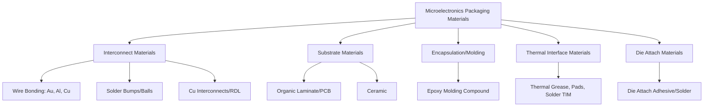

## Materials for Microelectronics and Packaging

### Overview

Microelectronics packaging encompasses the materials and processes that electrically connect, mechanically support, protect, and thermally manage a semiconductor die (chip) within a functioning electronic system. While die-level device materials (Si, GaAs, SiC, etc.) receive the most direct attention in device physics, packaging materials are equally critical to overall system performance, reliability, and cost—a poorly designed package can bottleneck an otherwise excellent die through thermal, electrical, or mechanical limitations.

### Interconnect Materials

**Wire Bonding**

The traditional and still widely used method for connecting die bond pads to package leads/substrate, using fine wire thermosonically or thermocompression bonded at each end.

- **Gold (Au) wire**: Historically dominant due to excellent oxidation resistance (critical for reliable ball-bond formation and long-term joint stability), high ductility, and good electrical conductivity; remains preferred for high-reliability applications despite higher material cost
- **Copper (Cu) wire**: Increasingly adopted as a lower-cost alternative to gold, offering higher electrical and thermal conductivity, but requiring more tightly controlled bonding process parameters and often an inert/reducing bonding atmosphere due to Cu's greater susceptibility to oxidation during bonding
- **Aluminum (Al) wire**: Common for larger-diameter, higher-current wedge bonds (particularly in power device packaging), though more susceptible to certain reliability failure mechanisms (e.g., "purple plague," the formation of brittle intermetallic Au-Al compounds at Au-Al bond interfaces under thermal stress, historically a significant concern in mixed Au/Al wire-pad material systems)

**Solder Bump / Flip-Chip Interconnects**

For higher I/O density and improved electrical performance (shorter interconnect length, lower inductance) than wire bonding, the die is flipped and directly bonded to the substrate via an array of solder bumps across the die's active surface, rather than wire bonds around its perimeter.

- **Lead-based solders** (e.g., Sn-Pb eutectic): Historically standard due to favorable melting point and reflow characteristics, but now largely phased out in most consumer/commercial electronics due to RoHS (Restriction of Hazardous Substances) and similar regulatory requirements restricting lead content
- **Lead-free solders** (predominantly SAC alloys—tin-silver-copper, e.g., Sn-Ag-Cu, "SAC305" being a common composition): Now the dominant solder system for mainstream electronics assembly, though generally exhibiting somewhat higher melting point and different reflow/reliability characteristics than eutectic Sn-Pb, requiring corresponding process and reliability qualification adjustments
- **Copper pillar bumps**: An evolution of solder-bump technology using a copper pillar capped with a thin solder layer, providing finer pitch capability and improved electromigration resistance relative to traditional solder-ball bumps, increasingly used in advanced high-density packaging

**Redistribution Layers (RDL) and Through-Silicon Vias (TSVs)**

Advanced packaging (wafer-level packaging, 2.5D/3D integration) uses thin-film copper redistribution layers to fan out or reroute die I/O to a different pitch/pattern than the native die bond pad layout, and through-silicon vias (copper-filled vertical vias etched through the silicon die) to enable direct vertical electrical connection between stacked die—both essential enabling technologies for modern high-bandwidth, high-density 3D-stacked packages (e.g., high-bandwidth memory, HBM, stacks).

### Substrate Materials

**Organic (Laminate) Substrates**

Multilayer organic laminate substrates, built up from glass-fiber-reinforced epoxy resin (compositionally related to standard FR-4 printed circuit board material but with finer-pitch, more precisely controlled build-up layers) with embedded copper wiring layers, are the dominant substrate technology for mainstream IC packaging (ball grid array, BGA, packages) due to relatively low cost and mature, high-volume manufacturing infrastructure.

**Ceramic Substrates**

Alumina (Al₂O₃) or, for higher-performance applications, aluminum nitride (AlN) ceramic substrates offer superior thermal conductivity, dimensional stability, and hermeticity compared to organic laminates, at higher cost and with generally lower achievable wiring density.

- **Alumina**: Widely used, moderate cost, moderate thermal conductivity (roughly 20-30 W/m·K, well below metals but substantially above organic laminates)
- **Aluminum nitride (AlN)**: Significantly higher thermal conductivity (commonly cited in the range of 150-200+ W/m·K depending on purity and processing) than alumina, valued for high-power device packaging (RF power amplifiers, power modules) where efficient heat extraction directly from the substrate is critical
- Applications: hermetic and high-reliability packages (military/aerospace, automotive under-hood), RF/microwave modules, high-power device substrates

**Silicon and Glass Interposers**

In advanced 2.5D/3D packaging, a silicon or glass interposer layer—itself fabricated with fine-pitch wiring (and TSVs, for silicon interposers)—sits between the die and the package substrate, providing a high-density electrical routing layer with a coefficient of thermal expansion (CTE) closely matched to silicon, mitigating thermomechanical stress in fine-pitch die-to-interposer connections.

### CTE Matching as a Governing Design Principle

Coefficient of thermal expansion (CTE) mismatch between dissimilar materials joined within a package (die, substrate, mold compound, solder joints) is one of the central reliability drivers in microelectronics packaging, since repeated thermal cycling during device operation and environmental exposure induces cyclic mechanical stress at CTE-mismatched interfaces, potentially leading to fatigue cracking of solder joints, delamination, or die cracking over the product's operational lifetime.

| Material | CTE (ppm/°C, approx.) |
| --- | --- |
| Silicon | ~2.6 |
| Alumina | ~7-8 |
| Aluminum Nitride | ~4.5-5.5 |
| Copper | ~17 |
| Organic laminate (FR-4-type) | ~13-17 (in-plane, varies by direction and construction) |
| Epoxy molding compound | ~8-20 (highly filler-content dependent) |
| Sn-Ag-Cu (SAC) solder | ~17-21 |

This table illustrates directly why CTE mismatch is unavoidable to some degree: silicon's low CTE sits far below that of copper, organic laminate, and solder, meaning every silicon-die-to-package joint inherently spans a substantial CTE gradient that package design (compliant interconnects, underfill, substrate CTE tailoring) must accommodate rather than eliminate.

### Die Attach Materials

The die attach layer bonds the die to its package substrate or lead frame, and must satisfy competing mechanical (stress accommodation), thermal (heat extraction path), and, in some applications, electrical (grounding) requirements.

- **Epoxy die attach adhesives**: Filled (often silver-filled for electrical/thermal conductivity, or unfilled/non-conductive for isolation) epoxy adhesives, widely used for cost-effective, moderate-performance die attach
- **Solder die attach**: Higher thermal and electrical conductivity than epoxy adhesives, used in power device and high-reliability applications where superior heat extraction or electrical continuity through the die attach layer is required
- **Sintered silver (Ag) die attach**: An increasingly adopted high-performance alternative, particularly for wide-bandgap power devices (SiC, GaN), offering higher thermal conductivity and higher-temperature capability than conventional solder, formed via low-temperature sintering of silver nanoparticle/microparticle paste under pressure and moderate heat

### Encapsulation and Molding Compounds

**Epoxy Molding Compounds (EMC)**

The dominant encapsulation material for mainstream plastic IC packages, consisting of an epoxy resin matrix heavily filled (commonly 70-90 wt%) with inorganic filler particles (typically fused silica), formulated to:

- Provide mechanical protection against physical damage and handling stress
- Provide environmental protection against moisture ingress and contamination
- Tailor the compound's bulk CTE (via filler content/type) toward the die/substrate CTE to minimize package-level thermomechanical stress
- Provide adequate flame retardancy and electrical insulation

**Underfill (Flip-Chip Packages)**

A specialized epoxy formulation dispensed and capillary-flowed beneath a flip-chip die after solder bump reflow, filling the gap between die and substrate to mechanically couple the solder bumps and redistribute thermomechanical stress across the entire bump array rather than concentrating it at individual bumps—critical for flip-chip solder joint reliability given the substantial die-to-substrate CTE mismatch typically present.

**Hermetic Packaging**

For applications demanding the highest reliability (military, aerospace, some medical implantables), hermetic packages using metal or ceramic housings with glass or metal-braze seals provide a fully sealed, moisture- and contamination-impermeable enclosure, at substantially higher cost than plastic molded packages, reserved for applications where the cost premium is justified by reliability/lifetime requirements.

### Thermal Interface Materials (TIMs)

TIMs fill microscopic surface roughness gaps between mating thermal interfaces (die-to-heat-spreader, heat-spreader-to-heatsink) to minimize thermal contact resistance, since even nominally flat, polished surfaces have microscale roughness that would otherwise trap poorly conducting air gaps.

| TIM Type | Thermal Conductivity (W/m·K, approx.) | Characteristics |
| --- | --- | --- |
| Thermal grease | 1-8 | Good conformability, potential for pump-out/dry-out over long-term thermal cycling |
| Phase-change materials | 1-5 | Solid at room T, melts/conforms at operating T |
| Thermal pads (filled elastomer) | 1-6 | Easier handling/rework than grease, generally higher bulk thermal resistance |
| Solder TIM | 20-80 | Highest performance, used in high-power applications; requires solderable surfaces |
| Sintered metal/graphite-based | Variable, can exceed 10-15+ | Emerging higher-performance options for demanding thermal applications |

[Inference: specific TIM thermal conductivity and long-term reliability performance are strongly formulation- and application-condition-dependent; datasheet values should be interpreted alongside the specific test method and bond-line thickness used, and long-term degradation behavior under thermal cycling varies significantly by TIM class.]

### Package Cross-Section Schematic (svg_diagram)

<svg xmlns="http://www.w3.org/2000/svg" viewBox="0 0 540 260">
<text x="270" y="20" font-size="14" text-anchor="middle" font-family="sans-serif" font-weight="bold">Flip-Chip BGA Package Cross-Section (svg_diagram)</text>
<rect x="60" y="40" width="420" height="15" fill="#888" />
<text x="270" y="35" font-size="10" text-anchor="middle" font-family="sans-serif">Heat Spreader / Lid</text>
<rect x="60" y="55" width="420" height="8" fill="#c9a227" />
<text x="500" y="62" font-size="8" font-family="sans-serif">TIM</text>
<rect x="120" y="63" width="300" height="40" fill="#4a7ab5" />
<text x="270" y="87" font-size="10" text-anchor="middle" fill="#fff" font-family="sans-serif">Silicon Die</text>
<rect x="120" y="103" width="300" height="12" fill="#e8b923" />
<text x="500" y="112" font-size="8" font-family="sans-serif">Underfill</text>
<rect x="60" y="115" width="420" height="60" fill="#e8e8e8" stroke="#333" />
<text x="270" y="150" font-size="10" text-anchor="middle" font-family="sans-serif">Organic/Ceramic Substrate</text>
<circle cx="100" cy="185" r="9" fill="#999" />
<circle cx="150" cy="185" r="9" fill="#999" />
<circle cx="200" cy="185" r="9" fill="#999" />
<circle cx="270" cy="185" r="9" fill="#999" />
<circle cx="340" cy="185" r="9" fill="#999" />
<circle cx="390" cy="185" r="9" fill="#999" />
<circle cx="440" cy="185" r="9" fill="#999" />
<text x="270" y="215" font-size="10" text-anchor="middle" font-family="sans-serif">Solder Balls (BGA)</text>
<rect x="30" y="230" width="480" height="10" fill="#444" />
<text x="270" y="253" font-size="9" text-anchor="middle" font-family="sans-serif">PCB</text>
</svg>

### Reliability-Driven Material Selection

Packaging material selection is heavily reliability-driven, with qualification typically involving accelerated stress testing—thermal cycling, temperature-humidity-bias (THB) testing, highly accelerated stress testing (HAST), and drop/vibration testing—to verify the material system survives the expected field environment over the product's intended lifetime. Common reliability failure modes tied directly to material choices include solder joint fatigue cracking (driven by CTE mismatch and thermal cycling), wire bond intermetallic degradation, moisture-induced popcorn cracking (rapid vaporization of absorbed moisture during solder reflow, causing internal package delamination/cracking—a key driver of moisture sensitivity level, MSL, classification and handling requirements for plastic packages), and TIM degradation (pump-out, dry-out, or delamination reducing thermal performance over time).

**Related Topics**

- Semiconductor Device Materials (Die-Level Material Systems)
- Solder Metallurgy and Lead-Free Alloy Systems
- Thermal Management in Electronic Systems
- Through-Silicon Via (TSV) and 3D IC Integration
- Moisture Sensitivity Level (MSL) and Popcorn Cracking
- Wire Bonding Reliability and Intermetallic Compound Formation
- Wide-Bandgap Power Device Packaging (SiC/GaN-Specific Challenges)