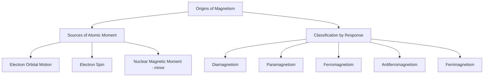

## Origins of Magnetism in Materials

### Overview

Magnetism in materials arises fundamentally from the motion and spin of electrons, which together give each electron a magnetic dipole moment. How these individual atomic-scale magnetic moments align, interact, and respond to external fields—governed by quantum mechanical exchange interactions and the electronic structure of the constituent atoms—determines a material's macroscopic magnetic behavior and classification. Understanding these origins is the essential foundation for the subsequent study of ferromagnetic domains, hysteresis, and engineered magnetic materials.

### Sources of Atomic Magnetic Moment

**Orbital Magnetic Moment**

An electron orbiting an atomic nucleus constitutes a microscopic current loop, which by classical electromagnetism generates a magnetic dipole moment. Quantum mechanically, this orbital moment is quantized and associated with the electron's orbital angular momentum quantum number:

$$\mu_{orbital} = -\frac{e}{2m_e} L$$

where $L$ is orbital angular momentum. In many solids, particularly transition metals, the orbital contribution to the net magnetic moment is significantly reduced from its free-atom value by the crystal field (the electrostatic environment of surrounding lattice atoms), a phenomenon known as **orbital quenching**, leaving spin magnetism as the dominant contributor to the net atomic moment in most practical ferromagnetic engineering materials.

**Spin Magnetic Moment**

Each electron possesses an intrinsic angular momentum ("spin") independent of its orbital motion, with an associated intrinsic magnetic moment:

$$\mu_{spin} = -g_s \frac{e}{2m_e} S$$

where $S$ is spin angular momentum and $g_s \approx 2$ is the electron spin g-factor. This spin moment is the dominant source of magnetism in most technologically important magnetic materials (iron, cobalt, nickel and their alloys), since orbital quenching suppresses the orbital contribution while spin moments remain largely unaffected by the crystal field.

**Bohr Magneton**

The natural unit for atomic-scale magnetic moments is the **Bohr magneton**:

$$\mu_B = \frac{e\hbar}{2m_e} \approx 9.274 \times 10^{-24} \text{ J/T}$$

Atomic and ionic magnetic moments in materials are conventionally expressed as a multiple of $\mu_B$ (e.g., the Fe²⁺ ion has a moment on the order of several $\mu_B$, depending on its electronic configuration and crystal field environment).

**Nuclear Magnetic Moment**

Atomic nuclei also possess magnetic moments (due to nuclear spin), but these are roughly three orders of magnitude smaller than electron-derived moments (since the moment scales inversely with particle mass, and nucleons are roughly 1800 times more massive than electrons), making nuclear magnetism negligible for bulk magnetic material classification and behavior, though nuclear magnetic moments are of course centrally important in nuclear magnetic resonance (NMR) and MRI, which probe nuclear rather than electronic magnetism.

### Electron Configuration and Net Atomic Moment

Whether an atom or ion possesses a net magnetic moment depends on its electron configuration, specifically whether electron spins are paired or unpaired within its orbitals, following Hund's rule (which favors maximizing unpaired spins within a partially filled subshell, since parallel spins in different orbitals minimize electron-electron Coulomb repulsion).

- **Fully paired electron configurations** (closed shells/subshells): Individual electron spin and orbital moments cancel pairwise, giving zero net atomic magnetic moment—this is the origin of diamagnetism (see below), present to some degree in all materials
- **Unpaired electron configurations**: A net atomic magnetic moment exists, most prominently in atoms/ions with partially filled inner shells—notably the 3d transition metals (Fe, Co, Ni, Mn, Cr) and 4f rare-earth (lanthanide) elements, whose partially filled, spatially localized d- and f-orbitals give rise to substantial unpaired-spin moments and are consequently the elemental basis of essentially all strong engineering magnetic materials

### Classification of Magnetic Behavior

The response of a material's atomic moments to an applied field, and their mutual interaction in the absence of a field, defines five principal classes of magnetic behavior.

**Diamagnetism**

Present, to some degree, in all materials, arising from the orbital motion of paired electrons responding to an applied field via Lenz's-law-like induced circulating currents that oppose the applied field (a quantum mechanical effect, though the classical Lenz's law analogy is a useful conceptual aid). Diamagnetism produces a very weak, negative magnetic susceptibility ($\chi < 0$, typically of order $-10^{-5}$) that is essentially temperature-independent. In materials with no net unpaired-electron moment (e.g., many covalently or ionically bonded compounds, noble gases, most organic materials), diamagnetism is the only magnetic response present, and such materials are classified as diamagnetic.

**Paramagnetism**

Occurs in materials whose constituent atoms/ions possess a net magnetic moment (due to unpaired electrons) but where these moments do not interact strongly with one another and are, in the absence of an applied field, randomly oriented by thermal agitation, giving zero net macroscopic magnetization. Under an applied field, individual moments partially align with the field (competing against thermal randomization), producing a weak, positive susceptibility ($\chi > 0$, typically of order $10^{-3}$ to $10^{-5}$) that decreases with increasing temperature as thermal agitation increasingly disrupts field-induced alignment, following the **Curie law**:

$$\chi = \frac{C}{T}$$

where $C$ is the material-specific Curie constant. This inverse temperature dependence directly reflects the competition between the ordering influence of the applied field and the randomizing influence of thermal energy.

**Ferromagnetism**

Occurs in materials where a strong quantum mechanical **exchange interaction** between neighboring atomic moments favors parallel alignment, causing spontaneous magnetic ordering (magnetization) even in the absence of an applied field, below a critical temperature (the **Curie temperature**, $T_C$). This spontaneous, cooperative alignment—fundamentally distinct from paramagnetism's field-induced, non-cooperative alignment—is what gives ferromagnetic materials (Fe, Co, Ni, and many alloys/compounds) their characteristically large magnetic response and permanent magnetization capability, addressed in depth in the dedicated Ferromagnetism and Magnetic Domains topic.

**Antiferromagnetism**

Occurs when the exchange interaction between neighboring moments favors *antiparallel* alignment, and the crystal structure is such that this antiparallel arrangement results in two (or more) magnetic sublattices of exactly equal and opposite moment, producing zero net macroscopic magnetization despite strong local magnetic ordering. Above a critical temperature (the **Néel temperature**, $T_N$, analogous in role to the Curie temperature), thermal agitation overcomes the antiferromagnetic exchange ordering and the material becomes paramagnetic. Examples include MnO, NiO, and Cr metal.

**Ferrimagnetism**

Similar to antiferromagnetism in that neighboring sublattices are aligned antiparallel by exchange interaction, but the two sublattices have *unequal* magnitude moments (due to different ion types or different numbers of ions on each sublattice), so the antiparallel alignment does not fully cancel, leaving a net macroscopic magnetization. Ferrimagnetic materials therefore behave macroscopically much like ferromagnets (spontaneous magnetization, hysteresis, a Curie-like ordering temperature) despite their underlying antiparallel microscopic spin arrangement. **Magnetite** (Fe₃O₄) and the broader family of technologically important **ferrite ceramics** (spinel ferrites, garnets) are the classic and most industrially significant ferrimagnetic materials, valued in part because their ceramic (oxide, electrically insulating) nature gives very low eddy current losses at high frequency compared to metallic ferromagnets—a property exploited extensively in RF/microwave and high-frequency transformer core applications.

### Magnetic Classification Comparison

| Class | Net Atomic Moment | Inter-Moment Interaction | Zero-Field Magnetization | Susceptibility | Temperature Dependence |
| --- | --- | --- | --- | --- | --- |
| Diamagnetic | None | None | None | Small, negative | Essentially none |
| Paramagnetic | Present | Negligible | None (random orientation) | Small, positive | $\chi \propto 1/T$ (Curie law) |
| Ferromagnetic | Present | Strong, parallel-favoring | Present (spontaneous) | Large, positive | Ordering lost above $T_C$ |
| Antiferromagnetic | Present (sublattices) | Strong, antiparallel-favoring | None (moments cancel) | Small, positive | Peaks near $T_N$ |
| Ferrimagnetic | Present (unequal sublattices) | Strong, antiparallel-favoring | Present (incomplete cancellation) | Large, positive | Ordering lost above $T_C$ |

### Magnetic Moment Alignment Schematic (svg_diagram)

<svg xmlns="http://www.w3.org/2000/svg" viewBox="0 0 560 260">
<text x="280" y="20" font-size="14" text-anchor="middle" font-family="sans-serif" font-weight="bold">Atomic Moment Arrangements (svg_diagram)</text>

<text x="80" y="50" font-size="11" text-anchor="middle" font-family="sans-serif">Paramagnetic</text>

<g stroke="`#4a7ab5`" stroke-width="2.5" marker-end="url(#ah)">

<line x1="40" y1="90" x2="55" y2="70" />

<line x1="80" y1="90" x2="70" y2="65" />

<line x1="120" y1="90" x2="130" y2="68" />

<line x1="40" y1="130" x2="30" y2="150" />

<line x1="80" y1="130" x2="95" y2="150" />

<line x1="120" y1="130" x2="110" y2="155" />

</g>

<text x="80" y="195" font-size="9" text-anchor="middle" font-family="sans-serif">Random orientation</text>

<text x="280" y="50" font-size="11" text-anchor="middle" font-family="sans-serif">Ferromagnetic</text>

<g stroke="#c00" stroke-width="2.5" marker-end="url(#ah)">

<line x1="240" y1="130" x2="240" y2="90" />

<line x1="280" y1="130" x2="280" y2="90" />

<line x1="320" y1="130" x2="320" y2="90" />

</g>

<text x="280" y="195" font-size="9" text-anchor="middle" font-family="sans-serif">Parallel alignment</text>

<text x="470" y="50" font-size="11" text-anchor="middle" font-family="sans-serif">Ferrimagnetic</text>

<line x1="440" y1="130" x2="440" y2="90" stroke="#c00" stroke-width="3" marker-end="url(#ah)" />

<line x1="470" y1="90" x2="470" y2="130" stroke="`#4a7ab5`" stroke-width="1.5" marker-end="url(#ah2)" />

<line x1="500" y1="130" x2="500" y2="90" stroke="#c00" stroke-width="3" marker-end="url(#ah)" />

<text x="470" y="195" font-size="9" text-anchor="middle" font-family="sans-serif">Unequal antiparallel</text>

</svg>

### Exchange Interaction: Physical Basis

The **exchange interaction**, responsible for the strong, cooperative ordering seen in ferro-, antiferro-, and ferrimagnetic materials, is a purely quantum mechanical effect arising from the combination of the Pauli exclusion principle and electron-electron Coulomb repulsion—it has no classical analog. Qualitatively, when two electrons have parallel spins, the Pauli exclusion principle requires their overall wavefunction to be antisymmetric in a way that keeps their spatial wavefunctions apart, reducing Coulomb repulsion energy; this spin-dependent modulation of electrostatic energy is what produces an effective, spin-dependent interaction energy (the exchange energy) that can favor either parallel (ferromagnetic-type) or antiparallel (antiferromagnetic-type) alignment depending on the specific orbital overlap geometry and electron configuration involved. [Inference: the sign and magnitude of the exchange interaction in any specific material depend on detailed features of the electronic structure and interatomic distances—summarized qualitatively by the Bethe-Slater curve relating exchange interaction sign to the ratio of interatomic spacing to 3d orbital radius for transition metals—and detailed first-principles prediction for a specific compound generally requires computational electronic structure methods rather than simple qualitative rules alone.]

### Practical Significance of the Classification

This classification scheme, rooted in atomic-scale electron configuration and exchange interaction, directly explains observed macroscopic magnetic engineering behavior: why iron, cobalt, and nickel (with their partially filled, exchange-coupled 3d shells) are the elemental basis of essentially all strong permanent and soft magnetic materials; why most other elements and compounds are only weakly (para- or dia-) magnetic and unsuitable for magnetic applications; and why ferrite ceramics, despite containing no metallic iron in elemental form, achieve useful ferrimagnetic behavior through their specific crystal structure and mixed-valence iron-oxide chemistry, combined with the electrically insulating character valuable for high-frequency applications.

**Related Topics**

- Ferromagnetism and Magnetic Domains
- Hysteresis and Magnetic Material Classification (Soft vs. Hard)
- Ferrite Ceramics and Spinel/Garnet Structures
- Curie and Néel Temperature Phenomena
- Magnetic Anisotropy and Crystal Field Effects
- Rare-Earth Permanent Magnets (Nd-Fe-B, SmCo)
- Electron Configuration and Hund's Rule