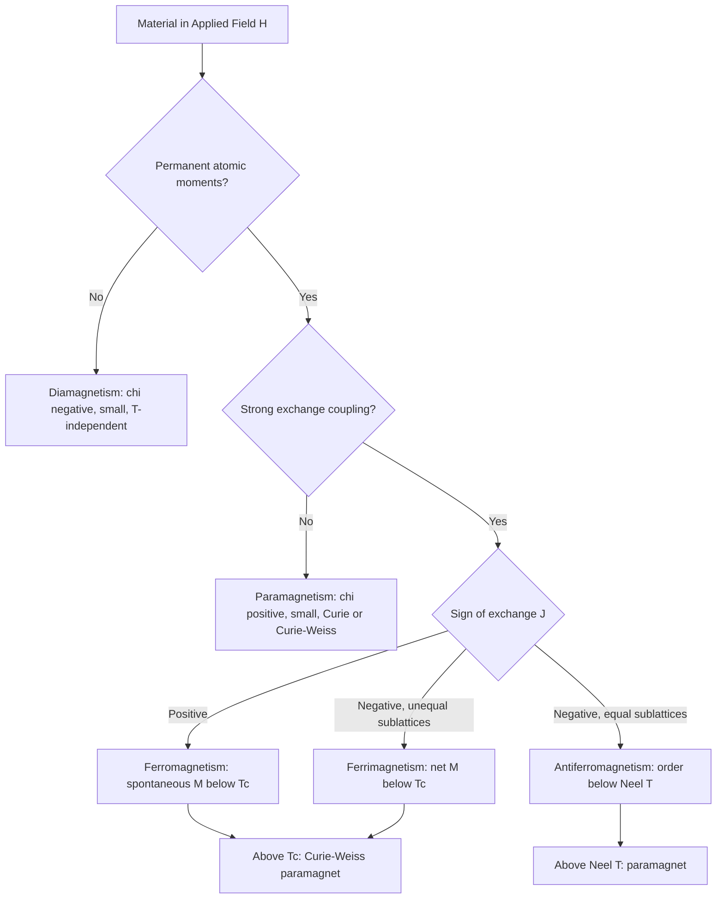

## Diamagnetism, Paramagnetism, and Ferromagnetism

### Overview

Every material responds to an applied magnetic field $\mathbf{H}$ by developing a magnetization $\mathbf{M}$ (magnetic moment per unit volume). The nature of this response, which depends on the electronic structure, the presence of unpaired electrons, and the interactions among atomic moments, classifies materials into distinct magnetic types.

**Key Points**

- Magnetism originates from two electron contributions: orbital motion around the nucleus and intrinsic spin. Nuclear moments are roughly three orders of magnitude smaller and are negligible for bulk magnetic classification.
- Diamagnetism is universal (present in all matter) but weak, and it dominates only when no atomic moments are present.
- Paramagnetism requires permanent atomic moments that do not interact strongly with each other.
- Ferromagnetism requires permanent atomic moments plus a strong quantum-mechanical exchange interaction that aligns them spontaneously below the Curie temperature $T_C$.

### Fundamental Quantities and Units

#### Definitions

The flux density $\mathbf{B}$ in a material relates to the field and magnetization by (SI):

$$\mathbf{B} = \mu_0(\mathbf{H} + \mathbf{M})$$

The volume susceptibility and relative permeability are:

$$\chi = \frac{M}{H}, \qquad \mu_r = 1 + \chi, \qquad \mu = \mu_0 \mu_r$$

The mass susceptibility is $\chi_m = \chi/\rho$ and the molar susceptibility is $\chi_{mol} = \chi_m \cdot M_w$.

#### SI vs CGS

| Quantity | SI | CGS (emu) |
| --- | --- | --- |
| Field $H$ | A/m | Oe |
| Flux density $B$ | T | G |
| Magnetization $M$ | A/m | emu/cm³ |
| Susceptibility $\chi$ | dimensionless | dimensionless (emu/cm³·Oe) |
| Conversion | $\chi_{SI} = 4\pi\,\chi_{CGS}$ |  |

#### Bohr Magneton

The natural unit of atomic magnetic moment is the Bohr magneton:

$$\mu_B = \frac{e\hbar}{2m_e} = 9.274 \times 10^{-24}\ \text{J/T}$$

### Classification by Susceptibility

| Type | Sign of $\chi$ | Typical $\lvert\chi\rvert$ (SI) | Temperature dependence | Atomic moments |
| --- | --- | --- | --- | --- |
| Diamagnetic | Negative | $10^{-6}$ to $10^{-5}$ (superconductors: $\chi = -1$) | Essentially independent | None (closed shells) |
| Paramagnetic | Positive | $10^{-5}$ to $10^{-3}$ | Curie or Curie-Weiss | Present, non-interacting |
| Ferromagnetic | Positive, large | $10^{1}$ to $10^{6}$ (nonlinear) | Vanishes above $T_C$ | Present, exchange-coupled |
| Antiferromagnetic | Small positive | $10^{-5}$ to $10^{-3}$ | Maximum at $T_N$ | Present, antiparallel |
| Ferrimagnetic | Positive, large | $10^{1}$ to $10^{4}$ | Complex | Present, unequal antiparallel |

### Diamagnetism

#### Physical Origin

When a magnetic field is applied, Lenz's law induces circulating electron currents whose induced moment opposes the applied field. This effect exists in every atom, but in atoms with permanent moments it is masked by the far stronger paramagnetic or ferromagnetic response.

#### Langevin Theory

For an atom with $Z$ electrons, the classical Langevin expression for the diamagnetic susceptibility per unit volume with $N$ atoms per unit volume is:

$$\chi_{dia} = -\frac{\mu_0 N Z e^2}{6 m_e}\langle r^2 \rangle$$

where $\langle r^2 \rangle$ is the mean square radius of the electron orbits. Key consequences:

- $\chi_{dia} < 0$ always.
- It scales with the size of the electron orbits, so larger ions (e.g., heavy halides) are more diamagnetic.
- It is essentially temperature independent, because it does not depend on thermal population of states.

#### Materials

| Material | Approx. $\chi$ (SI, volume) | Notes |
| --- | --- | --- |
| Bismuth | $-1.66 \times 10^{-4}$ | Strongest among common elements (excluding superconductors) |
| Pyrolytic graphite | $-4 \times 10^{-4}$ (anisotropic, out-of-plane) | Levitates over strong magnets |
| Copper | $-9.6 \times 10^{-6}$ | Conduction-electron contribution included |
| Water | $-9.0 \times 10^{-6}$ |  |
| Gold | $-3.4 \times 10^{-5}$ |  |
| Silver | $-2.4 \times 10^{-5}$ |  |
| Superconductor | $-1$ | Perfect diamagnetism (Meissner effect) |

**Note:** Values are approximate and vary with purity, crystallographic direction, and reference source.

#### Superconducting Diamagnetism

A type-I superconductor below $T_c$ expels flux completely ($B = 0$ inside), giving $\chi = -1$. This is a distinct phenomenon from Langevin diamagnetism, arising from macroscopic quantum coherence, and it is not explained by atomic orbital response.

### Paramagnetism

#### Physical Origin

Paramagnetic materials contain atoms, ions, or defects with permanent magnetic moments, typically from unpaired electrons in partially filled $d$ or $f$ shells. In zero field, thermal agitation randomizes the moments so the net magnetization is zero. An applied field biases the orientation partially, giving a small net positive magnetization opposed by thermal disorder.

#### Atomic Moment

For an ion with total angular momentum quantum number $J$, the moment is:

$$\mu = g_J \mu_B \sqrt{J(J+1)} = p_{eff}\,\mu_B$$

with the Landé g-factor:

$$g_J = 1 + \frac{J(J+1) + S(S+1) - L(L+1)}{2J(J+1)}$$

For 3$d$ transition-metal ions, orbital angular momentum is often quenched by the crystal field, and the spin-only formula is a good approximation:

$$p_{eff} = g\sqrt{S(S+1)} \approx \sqrt{n(n+2)}$$

where $n$ is the number of unpaired electrons and $g \approx 2$.

#### Langevin Paramagnetism and the Brillouin Function

In the quantum treatment, the magnetization of $N$ non-interacting moments per unit volume is:

$$M = N g_J \mu_B J\, B_J(x), \qquad x = \frac{g_J \mu_B J \mu_0 H}{k_B T}$$

where $B_J(x)$ is the Brillouin function:

$$B_J(x) = \frac{2J+1}{2J}\coth\left(\frac{(2J+1)x}{2J}\right) - \frac{1}{2J}\coth\left(\frac{x}{2J}\right)$$

Limiting behaviors:

- Low field or high temperature ($x \ll 1$): $M \propto H/T$ (linear response, Curie law).
- High field or low temperature ($x \gg 1$): $B_J \to 1$ and $M \to M_s = N g_J \mu_B J$ (saturation).
- Classical limit $J \to \infty$: $B_J \to L(x)$, the Langevin function $L(x) = \coth x - 1/x$.

#### Curie Law

In the linear regime:

$$\chi = \frac{C}{T}, \qquad C = \frac{\mu_0 N p_{eff}^2 \mu_B^2}{3 k_B}$$

where $C$ is the Curie constant. A plot of $1/\chi$ versus $T$ is a straight line through the origin.

#### Curie-Weiss Law

When weak interactions between moments exist, the susceptibility follows:

$$\chi = \frac{C}{T - \theta}$$

- $\theta > 0$: ferromagnetic-type correlations (the material may order ferromagnetically at $T_C \approx \theta$).
- $\theta < 0$: antiferromagnetic-type correlations.
- $\theta = 0$: ideal Curie behavior.

#### Pauli Paramagnetism of Conduction Electrons

In metals, only conduction electrons within roughly $k_B T$ of the Fermi level can reorient with the field. The resulting susceptibility is nearly temperature independent:

$$\chi_{Pauli} = \mu_0 \mu_B^2\, g(E_F)$$

where $g(E_F)$ is the density of states per unit volume at the Fermi energy (per spin-summed convention; definitions vary by text). It is orders of magnitude weaker than the Curie contribution of localized moments would be at the same density, because most conduction electrons are Pauli-blocked. Alkali and many other simple metals (Na, Al, Pt) show this behavior, competing with Landau diamagnetism of the conduction electrons.

#### Van Vleck Paramagnetism

Ions with $J = 0$ in the ground state carry no permanent moment, yet a field can mix excited states into the ground state, producing a small temperature-independent positive susceptibility.

#### Materials

| Material | Approx. $\chi$ (SI, volume) | Behavior |
| --- | --- | --- |
| Aluminum | $+2.2 \times 10^{-5}$ | Pauli |
| Platinum | $+2.8 \times 10^{-4}$ | Pauli, enhanced by $d$-band DOS |
| Oxygen (gas, STP) | $+1.9 \times 10^{-6}$ | Curie (two unpaired electrons) |
| MnSO$_4$ (aqueous ions) | Large among paramagnets | Curie, $S = 5/2$ |
| Gd$_2$O$_3$ | Large | Curie, $J = 7/2$ |

### Ferromagnetism

#### Physical Origin: Exchange Interaction

Ferromagnetism cannot be explained by classical dipole-dipole interactions, which are far too weak (equivalent to roughly 1 K). Its origin is the quantum-mechanical exchange interaction, a consequence of the Pauli exclusion principle combined with Coulomb repulsion, which lowers the electrostatic energy when neighboring spins are parallel.

The Heisenberg Hamiltonian models this as:

$$\mathcal{H} = -\sum_{i<j} J_{ex}\,\mathbf{S}_i \cdot \mathbf{S}_j$$

- $J_{ex} > 0$: parallel alignment favored (ferromagnetism).
- $J_{ex} < 0$: antiparallel alignment favored (antiferromagnetism).

#### Weiss Molecular Field Theory

Weiss proposed that each moment experiences an effective internal field proportional to the magnetization:

$$H_{eff} = H + \lambda M$$

where $\lambda$ is the molecular-field constant. Substituting into the paramagnetic response gives the Curie-Weiss law above $T_C$:

$$\chi = \frac{C}{T - T_C}, \qquad T_C = \lambda C$$

Below $T_C$, a nonzero spontaneous magnetization $M_s(T)$ exists even at $H = 0$, determined self-consistently:

$$\frac{M}{M_0} = B_J\left(\frac{g_J \mu_B J \mu_0 \lambda M}{k_B T}\right)$$

This gives $M_s(T)$ that falls monotonically from $M_s(0)$ to zero at $T_C$.

#### Curie Temperature

The Curie temperature is the transition between ferromagnetic order (below) and paramagnetic disorder (above). It reflects the strength of the exchange coupling: $T_C \sim z J_{ex} S(S+1)/(3k_B)$ in mean-field theory, where $z$ is the number of nearest neighbors.

| Material | $T_C$ (K, approx.) | Structure |
| --- | --- | --- |
| Iron (Fe) | 1043 | BCC |
| Cobalt (Co) | 1394 | HCP (FCC at high T) |
| Nickel (Ni) | 631 | FCC |
| Gadolinium (Gd) | 293 | HCP |
| Fe$_3$Al-type alloys, Heusler alloys | Composition dependent | Ordered |

Values are approximate and vary with purity and measurement method.

#### Origin of Ferromagnetism in Transition Metals: Band Picture

In itinerant ferromagnets (Fe, Co, Ni), the 3$d$ electrons are delocalized in narrow bands. The Stoner criterion states that ferromagnetism occurs when:

$$I\, g(E_F) > 1$$

where $I$ is the Stoner exchange parameter and $g(E_F)$ is the density of states at the Fermi level. When satisfied, the spin-up and spin-down bands split by an exchange energy, producing a net spin imbalance. This explains the non-integer moments per atom in these metals:

| Metal | Moment ($\mu_B$/atom) |
| --- | --- |
| Fe | ~2.2 |
| Co | ~1.7 |
| Ni | ~0.6 |

Rare-earth ferromagnets (Gd) instead have localized 4$f$ moments coupled indirectly via the RKKY interaction through conduction electrons.

#### Bethe-Slater Curve

Exchange interaction sign and magnitude depend on the ratio of interatomic distance $a$ to the radius $r_d$ of the 3$d$ shell. The Bethe-Slater curve shows $J_{ex}$ versus $a/r_d$: it is positive (ferromagnetic) for Fe, Co, Ni, negative for Mn and Cr (antiferromagnetic), and it explains why alloying or lattice expansion can convert an antiferromagnet into a ferromagnet (e.g., Mn-containing Heusler alloys). This is a qualitative correlation and has known limitations.

### Magnetic Domains

#### Why Domains Form

A uniformly magnetized ferromagnet generates a large external stray field, so it carries substantial magnetostatic energy. The material lowers its total energy by subdividing into domains, regions magnetized in different directions, with closure domains that minimize flux leakage.

#### Energy Contributions

The equilibrium domain structure minimizes the sum:

$$E_{total} = E_{ex} + E_{K} + E_{ms} + E_{\sigma} + E_{Z}$$

| Term | Description |
| --- | --- |
| Exchange $E_{ex}$ | Favors parallel spins; penalizes gradients |
| Magnetocrystalline anisotropy $E_K$ | Favors magnetization along easy crystallographic axes |
| Magnetostatic $E_{ms}$ | Stray-field energy; drives domain formation |
| Magnetoelastic $E_\sigma$ | Coupling of magnetization to strain (magnetostriction) |
| Zeeman $E_Z$ | Interaction with applied field |

#### Domain Walls

The boundary between domains is a domain wall, across which the magnetization rotates gradually rather than abruptly.

- **Bloch wall:** magnetization rotates about an axis perpendicular to the wall plane (common in bulk materials).
- **Néel wall:** magnetization rotates within the plane of the wall (common in thin films).

Wall width $\delta$ and energy per unit area $\gamma$ arise from competition between exchange and anisotropy:

$$\delta \sim \pi\sqrt{\frac{A}{K}}, \qquad \gamma \sim 4\sqrt{AK}$$

where $A$ is the exchange stiffness and $K$ is the anisotropy constant. For iron, $\delta$ is on the order of tens of nanometers (values depend on source).

#### Magnetocrystalline Anisotropy

For cubic crystals, the anisotropy energy density is:

$$E_K = K_1(\alpha_1^2\alpha_2^2 + \alpha_2^2\alpha_3^2 + \alpha_3^2\alpha_1^2) + K_2\,\alpha_1^2\alpha_2^2\alpha_3^2$$

where $\alpha_i$ are direction cosines. Easy axes:

| Metal | Easy axis | Hard axis |
| --- | --- | --- |
| Fe (BCC) | $\langle 100 \rangle$ | $\langle 111 \rangle$ |
| Ni (FCC) | $\langle 111 \rangle$ | $\langle 100 \rangle$ |
| Co (HCP) | $c$-axis (uniaxial) | basal plane |

### Hysteresis

#### The M-H and B-H Loops

Magnetizing a ferromagnet from a demagnetized state traces the initial magnetization curve to saturation. Cycling the field then traces a closed hysteresis loop.

**Key Parameters**

- **Saturation magnetization $M_s$:** the maximum magnetization, when all domains are aligned.
- **Remanence $M_r$ (or $B_r$):** magnetization remaining after the field is removed.
- **Coercivity $H_c$:** reverse field required to reduce the magnetization (or induction) to zero.
- **Initial and maximum permeability $\mu_i$, $\mu_{max}$:** slopes of the magnetization curve.
- **Hysteresis loss:** energy dissipated per cycle per unit volume equals the loop area:

$$W = \oint \mathbf{H}\cdot d\mathbf{B}$$

#### Magnetization Mechanisms

1. **Reversible domain wall motion** at low fields.
2. **Irreversible wall motion (Barkhausen jumps)** as walls break free from pinning sites (inclusions, dislocations, grain boundaries).
3. **Domain rotation** at high fields toward the field direction.
4. **Approach to saturation** as remaining misalignment is removed.

#### Soft vs Hard Magnets

| Property | Soft magnetic | Hard magnetic |
| --- | --- | --- |
| Coercivity | Low ($H_c < \sim 10^3$ A/m) | High ($H_c > \sim 10^4$ A/m) |
| Loop shape | Narrow | Wide |
| Hysteresis loss | Low | High |
| Permeability | High | Lower |
| Microstructure | Few pinning sites, large grains, low stress | Fine particles, precipitates, high anisotropy |
| Applications | Transformer cores, motors, inductors, shielding | Permanent magnets, loudspeakers, data storage |
| Examples | Pure iron, Fe-Si steel, Permalloy (Ni-Fe), Mumetal, Fe-based amorphous ribbons | Alnico, SmCo, Nd-Fe-B, hard ferrites |

Boundaries between "soft" and "hard" are conventional and vary by source.

### Temperature Effects

#### Curie-Weiss Behavior Across $T_C$

- Below $T_C$: spontaneous magnetization and domains exist.
- At $T_C$: second-order phase transition; $M_s \to 0$ continuously; susceptibility diverges.
- Above $T_C$: paramagnetic, $\chi = C/(T - \theta)$. The paramagnetic Curie temperature $\theta$ is usually slightly above the ferromagnetic $T_C$.

Near $T_C$, critical behavior follows power laws:

$$M_s \propto (T_C - T)^{\beta}, \qquad \chi \propto |T - T_C|^{-\gamma}$$

Mean-field theory predicts $\beta = 1/2$ and $\gamma = 1$, while experiments and 3D Heisenberg models give $\beta \approx 0.36$ and $\gamma \approx 1.4$.

#### Thermal Effects on Applications

Curie point sets the maximum service temperature of magnets and soft cores. Alloy design can tune $T_C$, for example in temperature-compensation alloys (Ni-Fe-Cr, Ni-Cu) with tailored $T_C$ used in thermal-shunt and thermometry applications.

### Comparison of Diamagnetism, Paramagnetism, and Ferromagnetism

| Feature | Diamagnetism | Paramagnetism | Ferromagnetism |
| --- | --- | --- | --- |
| Permanent atomic moments | No | Yes | Yes |
| Interaction between moments | N/A | Negligible (or weak) | Strong exchange |
| $\chi$ sign and size | $-10^{-6}$ to $-10^{-5}$ | $+10^{-5}$ to $+10^{-3}$ | Large positive, field-dependent |
| Response to $H$ | Linear, opposing | Linear at low $H/T$ | Nonlinear, hysteretic |
| Remanence | None | None | Yes |
| Temperature dependence | Nearly none | $1/T$ (Curie) or $1/(T-\theta)$ | Ordered below $T_C$; Curie-Weiss above |
| Force in field gradient | Repelled | Weakly attracted | Strongly attracted |
| Typical examples | Cu, Bi, Au, H$_2$O, graphite | Al, Pt, O$_2$, Mn$^{2+}$ salts | Fe, Co, Ni, Gd |

### Diagrams

#### Concept Map of Magnetic Response

#### Inverse Susceptibility vs Temperature

<svg xmlns="http://www.w3.org/2000/svg" viewBox="0 0 520 340" width="520" height="340" font-family="sans-serif" font-size="12">
<title>Inverse Susceptibility vs Temperature (svg_diagram)</title>
<text x="260" y="22" text-anchor="middle" font-size="14" font-weight="bold">Inverse Susceptibility vs Temperature (svg_diagram)</text>
<line x1="70" y1="290" x2="480" y2="290" stroke="black" stroke-width="2" />
<line x1="70" y1="290" x2="70" y2="45" stroke="black" stroke-width="2" />
<text x="275" y="325" text-anchor="middle">Temperature T</text>
<text x="22" y="170" text-anchor="middle" transform="rotate(-90 22 170)">1/χ</text>
<line x1="70" y1="290" x2="440" y2="80" stroke="#1f77b4" stroke-width="2.5" />
<text x="445" y="78" fill="#1f77b4">Paramagnet (Curie)</text>
<line x1="150" y1="290" x2="470" y2="105" stroke="#d62728" stroke-width="2.5" />
<line x1="150" y1="290" x2="150" y2="282" stroke="#d62728" stroke-width="2" />
<text x="475" y="118" fill="#d62728">Ferromagnet</text>
<text x="475" y="132" fill="#d62728">(above Tc)</text>
<line x1="30" y1="290" x2="70" y2="290" stroke="#2ca02c" stroke-width="0" />
<line x1="70" y1="290" x2="70" y2="290" stroke="#2ca02c" stroke-width="0" />
<path d="M 20 250 L 70 290" stroke="#2ca02c" stroke-width="2.5" fill="none" stroke-dasharray="5,3" transform="translate(0,0)" />
<text x="150" y="308" text-anchor="middle" fill="#d62728">T_C</text>
<text x="50" y="245" fill="#2ca02c" font-size="11">Antiferro (θ &lt; 0)</text>
<circle cx="150" cy="290" r="4" fill="#d62728" />
</svg>

### Worked Examples

#### Example 1: Spin-Only Moment of Mn$^{2+}$

Mn$^{2+}$ has electron configuration $3d^5$, with $n = 5$ unpaired electrons ($S = 5/2$).

$$p_{eff} = \sqrt{n(n+2)} = \sqrt{5 \times 7} = \sqrt{35} \approx 5.92$$

The predicted spin-only moment is about $5.92\,\mu_B$, consistent with experiment for high-spin Mn$^{2+}$ salts (typically 5.8 to 5.9 $\mu_B$).

#### Example 2: Curie Constant of a Paramagnetic Salt

**Given:** A salt containing $N = 1.0 \times 10^{28}\ \text{m}^{-3}$ ions of $p_{eff} = 5.92$.

**Solution:** In SI,

$$C = \frac{\mu_0 N p_{eff}^2 \mu_B^2}{3 k_B}$$

Substituting $\mu_0 = 4\pi \times 10^{-7}$ T·m/A, $\mu_B = 9.274 \times 10^{-24}$ J/T, $k_B = 1.381 \times 10^{-23}$ J/K:

$$C \approx \frac{(1.257\times10^{-6})(1.0\times10^{28})(35.0)(8.60\times10^{-47})}{3(1.381\times10^{-23})} \approx 0.91\ \text{K}$$

**Result:** At $T = 300$ K, $\chi = C/T \approx 3.0 \times 10^{-3}$.

The calculation follows the stated formula; the exact numerical value depends on rounding of constants.

#### Example 3: Saturation Magnetization of Iron

**Given:** BCC iron, lattice parameter $a = 0.2866$ nm, 2 atoms per unit cell, moment $\approx 2.22\,\mu_B$ per atom.

**Solution:** Atom density:

$$N = \frac{2}{a^3} = \frac{2}{(2.866\times10^{-10})^3} \approx 8.50 \times 10^{28}\ \text{m}^{-3}$$

$$M_s = N \mu = (8.50\times10^{28})(2.22)(9.274\times10^{-24}) \approx 1.75 \times 10^{6}\ \text{A/m}$$

**Result:** Approximately $1.75\times10^6$ A/m at low temperature, in agreement with the accepted value for iron (roughly 1.71 to 1.75 $\times 10^6$ A/m, temperature dependent).

#### Example 4: Distinguishing Magnetic Types from Susceptibility Data

**Given** $\chi$ versus $T$ measurements:

| Sample | Observation | Conclusion |
| --- | --- | --- |
| A | $\chi = -1.0\times10^{-5}$, constant in $T$ | Diamagnetic |
| B | $\chi \propto 1/T$, positive, $1/\chi$ extrapolates to 0 K | Ideal paramagnet (Curie) |
| C | $1/\chi$ linear in $T$, intercepts $T$ axis at $+800$ K, M-H loop with remanence at 300 K | Ferromagnet with $T_C \sim 800$ K |
| D | $1/\chi$ linear, intercept at $-50$ K, no remanence | Paramagnet with antiferromagnetic correlations |

### Experimental Characterization

#### Techniques

| Technique | Measures | Notes |
| --- | --- | --- |
| Vibrating Sample Magnetometry (VSM) | $M(H)$, $M(T)$ | Sensitive to about $10^{-6}$ emu; hysteresis loops |
| SQUID magnetometry | $M(H,T)$ at very high sensitivity | Suitable for weak dia- and paramagnetism, thin films |
| Faraday balance | Force in field gradient, $\chi$ | Classic technique for susceptibility |
| Gouy method | Susceptibility of powders/solutions | Force on a long sample tube |
| Torque magnetometry | Anisotropy constants | Single crystals |
| Magneto-optical Kerr effect (MOKE) | Surface magnetization, domain imaging | Thin films |
| Magnetic force microscopy (MFM) | Domain structure at nanoscale | Scanning probe |
| Bitter pattern technique | Domain visualization | Colloidal magnetic particles |
| Neutron diffraction | Magnetic structure, ordered moments | Distinguishes ferro- from antiferromagnetic order |
| Mössbauer spectroscopy | Local hyperfine field (e.g., $^{57}$Fe) | Probes local moments |

#### Practical Considerations

- Diamagnetic contributions from sample holders and core electrons must be subtracted (Pascal's constants) in molar susceptibility work.
- Demagnetizing fields depend on sample shape and must be corrected to obtain intrinsic $H$; for an ellipsoid, $H_{int} = H_{app} - N_d M$ with demagnetizing factor $N_d$.
- Ferromagnetic impurities at ppm levels can dominate the apparent susceptibility of a weakly magnetic sample.

### Engineering Relevance

**Applications by Magnetic Type**

- **Diamagnetic:** magnetic levitation demonstrations, shielding from magnetic susceptibility in MRI-compatible implants (choice of low-$\chi$ materials such as titanium alloys and certain polymers), superconducting magnets and flux exclusion.
- **Paramagnetic:** MRI contrast agents (gadolinium chelates), adiabatic demagnetization refrigeration using paramagnetic salts, oxygen analyzers based on paramagnetic $\mathrm{O}_2$, electron paramagnetic resonance (EPR) spectroscopy.
- **Ferromagnetic:** transformer and motor cores (Fe-Si electrical steels), permanent magnets (Nd-Fe-B, SmCo, Alnico), magnetic recording media (Co-based alloys), sensors, relays, inductors.

**Materials Selection Guidelines**

1. Low-loss AC applications favor high-resistivity, low-coercivity soft magnets: laminated Fe-Si steel, amorphous and nanocrystalline alloys, soft ferrites.
2. Permanent magnets require maximum energy product $(BH)_{max}$, high coercivity, and adequate $T_C$; Nd-Fe-B offers the highest room-temperature $(BH)_{max}$ but has a comparatively low $T_C$ (~585 K) and needs Dy/Tb additions or coatings for high-temperature or corrosive service.
3. Applications sensitive to stray fields require non-magnetic (paramagnetic or diamagnetic with very low $\chi$) materials such as austenitic stainless steels (composition and cold work can induce ferromagnetic martensite, so behavior may vary), Ti alloys, or Cu-Be.

### Common Misconceptions

- **"Metals are magnetic."** Most metals are para- or diamagnetic; only Fe, Co, Ni, Gd, Dy (below low temperatures), and certain alloys and compounds are ferromagnetic.
- **"Ferromagnets are always magnetized."** In the demagnetized state, domain structure produces zero net magnetization; a ferromagnet needs not be a permanent magnet.
- **"Above $T_C$ the atomic moments disappear."** The moments persist but become thermally disordered, producing paramagnetism.
- **"Diamagnetism only occurs in materials with no unpaired electrons."** Diamagnetism occurs in all materials; it is simply overshadowed when permanent moments are present.

### Conclusion

Diamagnetism, paramagnetism, and ferromagnetism form the foundational classification of magnetic response. Diamagnetism is a universal, weak, temperature-independent opposing response originating from orbital induction. Paramagnetism arises from thermally disordered permanent moments and follows the Curie or Curie-Weiss law. Ferromagnetism emerges when quantum exchange interactions align moments spontaneously, producing domains, hysteresis, and a critical temperature $T_C$ above which the material reverts to paramagnetic behavior. Understanding the atomic origin, temperature dependence, and microstructural sensitivity of each type is essential for selecting and engineering magnetic materials.

**Related Topics**

- Antiferromagnetism and ferrimagnetism (Néel theory, ferrites, garnets)
- Magnetic anisotropy and magnetostriction
- Domain wall dynamics and Barkhausen noise
- Soft magnetic materials: electrical steels, Permalloy, amorphous and nanocrystalline alloys
- Hard magnetic materials: Alnico, SmCo, Nd-Fe-B, energy product
- Superparamagnetism in nanoparticles and blocking temperature
- Spintronics: giant magnetoresistance (GMR) and tunneling magnetoresistance (TMR)
- Magnetocaloric materials and adiabatic demagnetization
- Superconductivity and the Meissner effect
- Magnetic characterization: VSM, SQUID, MOKE, MFM