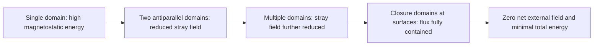
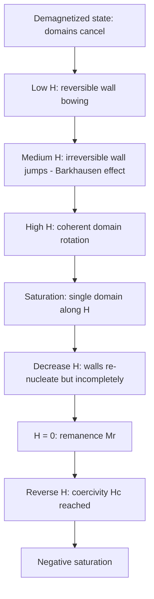

## Magnetic Domains and Hysteresis

### Overview

A ferromagnetic or ferrimagnetic material below its Curie temperature $T_C$ possesses a spontaneous magnetization $M_s$ within small regions, yet a bulk specimen can show zero net magnetization. The reconciliation is the **magnetic domain**: a region in which atomic moments are aligned uniformly, separated from neighboring domains by walls. The way domains nucleate, grow, shrink, and rotate under an applied field determines the hysteresis loop, and hence the classification and application of a magnetic material.

**Key Points**

- Domains form to minimize total free energy, principally by reducing magnetostatic (stray-field) energy.
- The equilibrium domain pattern is a compromise among exchange, anisotropy, magnetostatic, magnetoelastic, and Zeeman energies.
- Hysteresis is a consequence of irreversible domain wall motion and rotation, retarded by pinning at defects, grain boundaries, precipitates, and inclusions.
- Coercivity, remanence, saturation, permeability, and loop area are microstructure-sensitive properties, unlike saturation magnetization $M_s$ and Curie temperature $T_C$, which are largely intrinsic.
- Soft and hard magnetic materials differ chiefly in how easily domain walls move and how strongly magnetization resists reversal.

### Fundamentals of Domain Formation

#### Why Domains Exist

Exchange interaction alone favors a single, uniformly magnetized crystal. However, a uniformly magnetized body produces a large external field, storing magnetostatic energy:

$$E_{ms} = \frac{1}{2}\mu_0 N_d M_s^2 V$$

where $N_d$ is the demagnetizing factor (shape dependent) and $V$ is the volume. Subdividing into antiparallel domains reduces the stray field and lowers $E_{ms}$, at the cost of introducing domain walls, which have positive energy. The system settles at the number and arrangement of domains that minimizes the total.

#### Energy Terms

The total free energy density can be written as:

$$E_{total} = E_{ex} + E_{K} + E_{ms} + E_{\sigma} + E_{Z} + E_{wall}$$

| Energy term | Origin | Effect on domain structure |
| --- | --- | --- |
| Exchange $E_{ex}$ | Quantum exchange between neighboring spins | Favors uniform alignment; penalizes rapid spin rotation (broadens walls) |
| Magnetocrystalline anisotropy $E_K$ | Spin-orbit coupling to the crystal lattice | Aligns magnetization to easy axes; narrows walls |
| Magnetostatic $E_{ms}$ | Interaction of magnetization with its own stray field | Drives subdivision into domains and closure domains |
| Magnetoelastic $E_\sigma$ | Magnetostriction coupled to stress | Stress-induced anisotropy; affects domain shape |
| Zeeman $E_Z = -\mu_0 \mathbf{M}\cdot\mathbf{H}$ | Interaction with external field | Enlarges domains aligned with $\mathbf{H}$ |
| Wall energy $E_{wall}$ | Sum of exchange and anisotropy inside walls | Limits how finely domains subdivide |

#### Progressive Domain Subdivision

Closure domains (typically triangular in cross-section for uniaxial or cubic crystals) route flux back into the material so no free poles exist at the surface. They can introduce magnetostrictive strain energy, which sets the ultimate balance.

### Magnetocrystalline Anisotropy

#### Definition

Magnetization prefers certain crystallographic directions (easy axes). Energy required to rotate it to a hard axis is the anisotropy energy.

**Cubic crystals:**

$$E_K = K_0 + K_1(\alpha_1^2\alpha_2^2 + \alpha_2^2\alpha_3^2 + \alpha_3^2\alpha_1^2) + K_2\,\alpha_1^2\alpha_2^2\alpha_3^2$$

**Uniaxial (hexagonal) crystals:**

$$E_K = K_{u1}\sin^2\theta + K_{u2}\sin^4\theta$$

where $\theta$ is the angle between magnetization and the $c$-axis.

#### Easy and Hard Directions

| Material | Structure | Easy axis | Hard axis | Approx. $K_1$ (J/m³) |
| --- | --- | --- | --- | --- |
| Fe | BCC | $\langle 100 \rangle$ | $\langle 111 \rangle$ | $+4.8 \times 10^4$ |
| Ni | FCC | $\langle 111 \rangle$ | $\langle 100 \rangle$ | $-4.5 \times 10^3$ |
| Co | HCP | $c$-axis | basal plane | $+4.1 \times 10^5$ |

Values are approximate and vary with temperature and source. Anisotropy strength dictates both domain wall width and coercivity potential.

### Domain Walls

#### Wall Types

- **180° wall:** separates domains with antiparallel magnetization; common in uniaxial and cubic systems.
- **90° wall:** separates domains whose magnetization directions are perpendicular; common in cubic materials (Fe) and at closure domains.
- **Bloch wall:** magnetization rotates about the axis normal to the wall plane; dominant in bulk materials, avoids free poles inside the wall.
- **Néel wall:** magnetization rotates within the plane containing the wall normal; favored in thin films (thickness comparable to or smaller than wall width) to reduce stray field.
- **Cross-tie and vortex walls:** complex structures in intermediate-thickness films and patterned elements.

#### Wall Width and Energy

Balancing exchange (favoring gradual rotation) against anisotropy (favoring abrupt change), the wall width and energy per unit area are:

$$\delta \approx \pi\sqrt{\frac{A}{K}}, \qquad \gamma \approx 4\sqrt{AK}$$

where $A$ is the exchange stiffness constant (J/m) and $K$ is the effective anisotropy constant (J/m³). The exact numerical prefactors depend on the wall model (uniaxial vs cubic, 180° vs 90°).

| Trend | Consequence |
| --- | --- |
| High $K$ | Narrow, high-energy walls; strong pinning tendency (hard magnets) |
| Low $K$ | Wide, low-energy walls; easy motion (soft magnets) |
| Typical Fe wall width | Tens of nm (source dependent) |
| Typical Nd$_2$Fe$_{14}$B wall width | A few nm (very high $K$) |

#### Domain Size

For a simple parallel-slab model of period $D$ in a plate of thickness $L$, minimizing wall plus magnetostatic energy yields the Kittel result:

$$D \propto \sqrt{\frac{\gamma L}{\mu_0 M_s^2}}$$

so domain width grows with the square root of specimen thickness and wall energy, and shrinks as $M_s$ increases. This is a model estimate; real patterns are affected by grain structure and closure domains.

### Single-Domain Particles

Below a critical size, the energy cost of forming a wall exceeds the magnetostatic savings, and a particle is a single domain. The critical diameter is approximately:

$$D_c \approx \frac{9\gamma}{\mu_0 M_s^2}$$

| Material | Approximate $D_c$ (spherical) |
| --- | --- |
| Fe | ~15 nm |
| Co | ~70 nm |
| Ni | ~55 nm |
| Nd$_2$Fe$_{14}$B | ~200-300 nm |
| Fe$_3$O$_4$ | ~60-100 nm |

Values are approximate and depend on shape and definition. In single-domain particles, magnetization reversal occurs by coherent rotation rather than wall motion.

#### Stoner-Wohlfarth Model

For an ellipsoidal single-domain particle with uniaxial anisotropy energy $E = K_u V\sin^2(\theta) - \mu_0 M_s H V\cos(\phi - \theta)$, the coercive field for a field applied along the easy axis is:

$$H_K = \frac{2K_u}{\mu_0 M_s}$$

This is the anisotropy field, the upper theoretical limit to coercivity for coherent rotation. Real materials fall well below it (Brown's paradox) because of defects and nucleation of reversed domains.

#### Superparamagnetism

Below a further critical size, thermal energy $k_B T$ can overcome the anisotropy barrier $K_u V$, and the moment fluctuates freely. The relaxation time follows Néel-Arrhenius:

$$\tau = \tau_0\exp\left(\frac{K_u V}{k_B T}\right)$$

with $\tau_0 \sim 10^{-9}$ to $10^{-10}$ s. The blocking temperature $T_B$ is defined relative to the measurement time (about 100 s for DC magnetometry), giving $K_u V \approx 25\,k_B T_B$. Above $T_B$ the particle behaves as a superparamagnet (no hysteresis, high susceptibility); below it, hysteresis appears.

### Domain Observation Techniques

| Technique | Principle | Resolution / Notes |
| --- | --- | --- |
| Bitter pattern | Colloidal magnetic particles collect at stray-field regions (walls) | ~$\mu$m; historical, simple |
| Magneto-optical Kerr effect (MOKE) microscopy | Rotation of polarized light from magnetized surface | ~0.3 $\mu$m; dynamic imaging possible |
| Faraday effect microscopy | Transmission rotation in transparent magnets (garnets) | Bubble and stripe domains |
| Magnetic force microscopy (MFM) | Tip senses stray-field gradient | 10-50 nm |
| Lorentz transmission electron microscopy | Beam deflection by in-plane induction | Nanometer scale; thin films |
| Spin-polarized SEM (SEMPA) | Secondary electron spin polarization | Surface, ~20 nm |
| X-ray magnetic circular dichroism PEEM (XMCD-PEEM) | Element-specific magnetic contrast | ~30 nm; time-resolved |
| Electron holography | Phase shift from magnetic flux | High resolution flux mapping |

### Magnetization Process and Hysteresis

#### The Magnetization Curve

Beginning from a demagnetized state, increasing $H$ traces the initial (virgin) magnetization curve through distinct stages:

1. **Reversible wall displacement (low field):** Walls bow or shift elastically within pinning wells. Removing the field returns the walls. Response is linear (Rayleigh region begins here).
2. **Irreversible wall motion (intermediate field):** Walls break free from pinning sites and jump (Barkhausen jumps), sweeping through large volumes. This region has the steepest slope (maximum permeability).
3. **Domain rotation (high field):** Once walls are consumed, remaining domains rotate coherently from easy axes toward the field direction, overcoming anisotropy.
4. **Approach to saturation:** Residual misalignment (from anisotropy, stress, and defects) vanishes, described empirically by the law of approach to saturation:

$$M = M_s\left(1 - \frac{a}{H} - \frac{b}{H^2} - \cdots\right) + \chi_{hf} H$$

where $a$ and $b$ relate to inclusions, stress, and anisotropy, and $\chi_{hf}$ is the high-field (paraprocess) susceptibility.

#### Hysteresis Loop

The M-H loop, obtained by cycling $H$ between $+H_{max}$ and $-H_{max}$, is characterized by these parameters:

| Parameter | Symbol | Definition |
| --- | --- | --- |
| Saturation magnetization | $M_s$ | Maximum $M$ with all moments aligned |
| Remanent magnetization | $M_r$ | $M$ at $H = 0$ after saturation |
| Squareness | $S = M_r/M_s$ | Loop rectangularity (1 = perfectly square) |
| Coercivity (of magnetization) | $H_c$ or $_MH_c$ | Reverse field at which $M = 0$ |
| Intrinsic coercivity | $H_{ci}$ | Same as $_MH_c$; field where $M=0$ |
| Coercivity of induction | $_BH_c$ | Reverse field at which $B = 0$ (less than or equal to $H_{ci}$) |
| Maximum permeability | $\mu_{max}$ | Maximum of $B/H$ on the curve |
| Initial permeability | $\mu_i$ | Limit of $B/H$ as $H \to 0$ on virgin curve |
| Loop area | $W$ | Energy lost per cycle per unit volume |

#### Relation Between M-H and B-H Loops

$$B = \mu_0(H + M)$$

The B-H loop is the M-H loop sheared by the linear $\mu_0 H$ term. Beyond saturation, the B-H curve continues to rise with slope $\mu_0$, while the M-H curve is flat.

#### Hysteresis Loss

The energy dissipated per cycle per unit volume equals the enclosed loop area:

$$W_h = \oint H\,dB \quad (\text{J/m}^3\text{ per cycle})$$

The hysteresis power loss at frequency $f$ is $P_h = W_h f$. Steinmetz proposed an empirical relation for the loss per cycle in the technical range:

$$W_h = \eta B_{max}^{n}$$

where $\eta$ is a material constant and the exponent $n$ is typically in the range 1.6 to 2 (this empirical relation is approximate and depends on material and induction range).

### Microstructural Control of Coercivity

#### Pinning of Domain Walls

Walls interact with defects that locally change wall energy $\gamma$. Motion requires a field sufficient to overcome the maximum restoring force. Principal pinning mechanisms:

| Defect | Pinning mechanism |
| --- | --- |
| Non-magnetic inclusions, voids | Wall area reduction lowers wall energy when wall passes through inclusion (Kersten model) |
| Dislocations, residual stress | Local variation of magnetoelastic energy |
| Grain boundaries | Change of easy-axis direction, discontinuity in $K$ |
| Precipitates, second phases | Variations in $M_s$, $K$, and $A$ |
| Surface roughness and thickness variations (thin films) | Wall energy varies with geometry |

Kersten's stress model predicts:

$$H_c \propto \frac{\lambda_s \sigma}{\mu_0 M_s}$$

where $\lambda_s$ is the saturation magnetostriction and $\sigma$ is the internal stress amplitude. Inclusion models yield $H_c$ proportional to inclusion volume fraction or size relations. These are approximate models; real coercivity mixes several mechanisms.

#### Nucleation vs Pinning-Controlled Reversal

- **Nucleation-controlled magnets** (e.g., sintered Nd-Fe-B, ferrites): Once a reverse domain nucleates, wall motion is easy. Coercivity depends on suppressing nucleation at grain edges and surface defects. Initial magnetization curve is steep (easily magnetized).
- **Pinning-controlled magnets** (e.g., SmCo$_5$-type with pinning, Sm$_2$Co$_{17}$, some Alnico): Walls move readily inside grains until strongly pinned at cell boundaries. Initial magnetization curve is shallow, requiring high fields to depin walls.

#### Empirical Coercivity Relation

For permanent magnets, coercivity is often described by:

$$H_c = \alpha H_K - N_{eff} M_s$$

where $H_K = 2K/(\mu_0 M_s)$ is the anisotropy field, $\alpha$ (<1) accounts for microstructural imperfections and misalignment, and $N_{eff}$ accounts for local demagnetizing fields at defects (the Kronmüller relation). This reproduces the observation that measured $H_c$ is only about 20-30% of $H_K$ (Brown's paradox).

### Soft Magnetic Materials

#### Design Goals

Low coercivity, high permeability, low hysteresis and eddy-current loss, and often high saturation induction.

| Strategy | Purpose |
| --- | --- |
| Minimize impurities (C, N, O, S) and inclusions | Reduce pinning |
| Large grain size, or nanocrystalline with grain size below exchange length | Large grains: low grain-boundary pinning; nanocrystalline: random anisotropy averaging (Herzer model) |
| Low magnetocrystalline anisotropy $K_1 \to 0$ (Ni-Fe near 78.5% Ni, Fe-Si-Al Sendust) | Reduce wall pinning and rotation resistance |
| Low magnetostriction $\lambda_s \to 0$ | Reduce stress sensitivity |
| Strong crystallographic texture (grain-oriented Fe-3%Si) | Align easy axes to the induction direction |
| Lamination, high resistivity (Si, Al additions, insulated coatings, ferrites) | Reduce eddy-current loss |

#### Herzer Random Anisotropy Model

For nanocrystalline soft magnets (e.g., Fe-Si-B-Nb-Cu "Finemet"), when grain size $D$ is smaller than the ferromagnetic exchange length $L_{ex} = \sqrt{A/K_1}$, the effective anisotropy is averaged:

$$\langle K \rangle \approx \frac{K_1^4 D^6}{A^3}$$

Since $H_c \propto \langle K \rangle/M_s$ and depends strongly on $D^6$, coercivity falls rapidly as grain size decreases below $L_{ex}$, explaining coercivities as low as a few A/m in nanocrystalline alloys.

#### Representative Soft Magnetic Materials

| Material | $B_s$ (T, approx.) | $H_c$ (A/m, approx.) | Notes |
| --- | --- | --- | --- |
| Pure iron (annealed) | 2.15 | 4-80 | Purity and anneal dependent |
| Fe-3%Si non-oriented | 2.0 | 30-80 | Motors, rotating machines |
| Fe-3%Si grain-oriented (GO) | 2.0 | 4-10 (rolling direction) | Power transformers |
| Permalloy (78 Ni-Fe) | 0.8 | 0.4-2 | Very high $\mu_r$; sensitive to stress |
| Supermalloy | 0.8 | ~0.2 | Extremely high initial permeability |
| Amorphous Fe-based ribbon (Metglas 2605SA1) | 1.56 | ~2-5 | Very low core loss |
| Nanocrystalline (Finemet-type) | 1.2 | ~1-2 | High permeability, low loss at kHz |
| MnZn ferrite | 0.4-0.5 | 10-30 | High resistivity, MHz applications |

Values are typical approximate ranges and vary with processing and reference.

### Hard Magnetic Materials

#### Design Goals

High coercivity $H_{ci}$, high remanence $B_r$, and thus high maximum energy product $(BH)_{max}$, the area of the largest rectangle inscribed in the second-quadrant B-H curve:

$$(BH)_{max} \le \frac{B_r^2}{4\mu_0}$$

The upper bound applies to an ideal square loop with $H_{ci} \ge B_r/\mu_0$.

#### Strategies

| Strategy | Mechanism |
| --- | --- |
| High magnetocrystalline anisotropy (rare-earth intermetallics) | Large $H_K$, resists rotation |
| Fine, single-domain grains | Suppresses wall formation |
| Texture (magnetic alignment during pressing) | Raises $M_r/M_s$ toward 1 |
| Grain-boundary engineering (Nd-rich phase, Dy/Tb diffusion) | Decouples grains, suppresses nucleation at grain edges |
| Precipitation strengthening | Pins domain walls (Sm-Co 2:17, Alnico spinodal) |

#### Representative Hard Magnetic Materials

| Material | $B_r$ (T, approx.) | $H_{ci}$ (kA/m, approx.) | $(BH)_{max}$ (kJ/m³, approx.) | $T_C$ (K, approx.) |
| --- | --- | --- | --- | --- |
| Alnico 5 | 1.2-1.3 | 50-60 | 40-50 | ~1200 |
| Hard ferrite (SrFe$_{12}$O$_{19}$) | 0.4 | 250-400 | 25-35 | ~720 |
| SmCo$_5$ | 0.9-1.0 | 1500-2500 | 160-200 | ~990 |
| Sm$_2$Co$_{17}$ | 1.0-1.1 | 1000-2000 | 200-260 | ~1100 |
| Sintered Nd-Fe-B | 1.2-1.5 | 900-2500 (grade dependent) | 200-440 | ~585 |
| Bonded Nd-Fe-B | 0.6-0.8 | 600-1000 | 40-100 | ~585 |

Ranges are representative and vary widely with grade, temperature, and manufacturer.

### Dynamic Effects and Losses

#### Total Core Loss

In AC applications, total loss per unit volume is commonly separated (Bertotti statistical loss theory):

$$P_{tot} = P_h + P_{cl} + P_{exc}$$

| Component | Origin | Frequency scaling |
| --- | --- | --- |
| Hysteresis $P_h$ | Irreversible wall motion and rotation | $\propto f$ |
| Classical eddy-current $P_{cl}$ | Macroscopic induced currents | $\propto f^2$ |
| Excess (anomalous) $P_{exc}$ | Localized eddy currents around moving walls | $\propto f^{1.5}$ |

Classical eddy-current loss in a lamination of thickness $d$ and resistivity $\rho$, for sinusoidal induction of peak $B_m$:

$$P_{cl} = \frac{\pi^2 d^2 B_m^2 f^2}{6\rho}$$

This shows why thin laminations, high resistivity (Si alloying), and insulating ferrites reduce eddy-current loss.

#### Barkhausen Effect

Discrete, abrupt jumps of domain walls produce sudden flux changes when magnetization changes smoothly. They generate voltage pulses in a pick-up coil, known as Barkhausen noise. The technique (magnetic Barkhausen emission, MBE) is used non-destructively to evaluate residual stress, grain size, and hardness in ferromagnetic steels.

#### Magnetic Aftereffect and Viscosity

Magnetization slowly relaxes toward equilibrium after a field change due to thermally activated wall depinning. In hard magnets and recording media this appears as magnetic viscosity, with $M$ changing approximately linearly with $\ln t$:

$$M(t) = M_0 - S\ln\left(1 + \frac{t}{t_0}\right)$$

where $S$ is the magnetic viscosity coefficient.

### Rayleigh Region

At low fields in the pre-saturation regime, magnetization follows the Rayleigh relations for a virgin material:

$$B = \mu_i H + \eta H^2$$

with a hysteresis loop of area:

$$W_h = \frac{4}{3}\eta H_m^3$$

where $\mu_i$ is the initial permeability and $\eta$ the Rayleigh constant. This holds only for fields well below the coercive field and is a phenomenological model; deviations occur near saturation.

### Demagnetization and Related Processes

**Methods of Achieving a Demagnetized State**

- **Thermal demagnetization:** Heating above $T_C$ and cooling in zero field.
- **AC demagnetization:** Applying a slowly decreasing alternating field from above saturation to zero, tracing shrinking loops toward the origin. The material ends near $M = 0$ (ideal demagnetized state).
- **DC demagnetization:** Applying a reverse field to reach $M = 0$; leaves a metastable state that differs from the ideal state.

**Demagnetizing Field**

For a finite body, the internal field is reduced by its own poles:

$$H_{int} = H_{app} - N_d M$$

with $N_d$ (0 to 1, with $N_x + N_y + N_z = 1$ in SI) depending on shape. For a sphere $N_d = 1/3$; for a long needle magnetized along its axis, $N_d \to 0$; for a thin plate magnetized perpendicular to its plane, $N_d \to 1$. Measured loops must be sheared (corrected) to give intrinsic material response.

### Thin Films and Patterned Structures

- **Perpendicular magnetic anisotropy (PMA):** interface anisotropy in Co/Pt or CoFeB/MgO multilayers competes with the shape anisotropy $K_{shape} = \frac{1}{2}\mu_0 M_s^2$, producing perpendicular domains (stripe or bubble) used in recording media and spintronics.
- **Domain wall motion in nanowires:** current-driven (spin-transfer torque or spin-orbit torque) wall motion is the basis of racetrack memory concepts.
- **Exchange bias:** coupling to an antiferromagnet shifts the hysteresis loop along the field axis by $H_{eb}$ and typically enhances coercivity, used in spin valves.
- **Exchange-spring magnets:** nanocomposites of hard and soft phases where the soft phase is exchange-coupled to the hard phase, potentially raising $(BH)_{max}$ (theoretical predictions exceed experimental realizations).

### Worked Examples

#### Example 1: Domain Wall Width and Energy in Iron

**Given:** $A = 2.0 \times 10^{-11}$ J/m and $K_1 = 4.8 \times 10^4$ J/m³.

**Solution:**

$$\delta \approx \pi\sqrt{\frac{A}{K_1}} = \pi\sqrt{\frac{2.0\times10^{-11}}{4.8\times10^{4}}} = \pi\sqrt{4.17\times10^{-16}} = \pi(2.04\times10^{-8}) \approx 6.4\times10^{-8}\ \text{m}$$

$$\gamma \approx 4\sqrt{AK_1} = 4\sqrt{(2.0\times10^{-11})(4.8\times10^{4})} = 4\sqrt{9.6\times10^{-7}} \approx 3.9\times10^{-3}\ \text{J/m}^2$$

**Result:** The wall is roughly 60 nm wide (about 220 lattice spacings) with energy near $4 \times 10^{-3}$ J/m². These simple estimates use uniaxial-style formulas; cubic iron values from detailed calculations are of the same order but differ in detail.

#### Example 2: Hysteresis Loss from Loop Area

**Given:** A transformer core operates at 50 Hz with a measured hysteresis loop area of $W_h = 100\ \text{J/m}^3$ per cycle. Core volume is $2 \times 10^{-3}\ \text{m}^3$.

**Solution:**

$$P_h = W_h f V = (100)(50)(2\times10^{-3}) = 10\ \text{W}$$

**Result:** Hysteresis dissipates about 10 W in this core. Reducing $H_c$ (for example by switching to grain-oriented steel with $W_h \approx 20\ \text{J/m}^3$) would reduce this to about 2 W under otherwise identical conditions.

#### Example 3: Maximum Energy Product Upper Limit

**Given:** A magnet with $B_r = 1.4$ T.

**Solution:**

$$(BH)_{max} \le \frac{B_r^2}{4\mu_0} = \frac{(1.4)^2}{4(4\pi\times10^{-7})} = \frac{1.96}{5.03\times10^{-6}} \approx 3.9\times10^{5}\ \text{J/m}^3 = 390\ \text{kJ/m}^3$$

**Result:** The theoretical ceiling is about 390 kJ/m³ (about 49 MGOe). Real magnets approach this only when $H_{ci} \ge B_r/\mu_0$ and the loop is very square.

#### Example 4: Single-Domain Particle Coercivity

**Given:** A Stoner-Wohlfarth Fe$_{}$ nanoparticle with $K_u = 1.0 \times 10^5$ J/m³ and $M_s = 1.7 \times 10^6$ A/m, field along the easy axis.

**Solution:**

$$H_K = \frac{2K_u}{\mu_0 M_s} = \frac{2(1.0\times10^5)}{(1.257\times10^{-6})(1.7\times10^6)} = \frac{2.0\times10^5}{2.14} \approx 9.4\times10^4\ \text{A/m}$$

**Result:** The ideal coercive field is about 94 kA/m (~1.2 kOe). At other field angles, the Stoner-Wohlfarth coercivity varies with $\psi$; at 45° it drops to $H_K/2$. The angular dependence is a signature of coherent rotation.

#### Example 5: Blocking Temperature of Nanoparticles

**Given:** Spherical Co nanoparticles with diameter $d = 8$ nm and $K_u = 4.5 \times 10^5$ J/m³ (assumed effective).

**Solution:**

$$V = \frac{\pi d^3}{6} = \frac{\pi(8\times10^{-9})^3}{6} = 2.68\times10^{-25}\ \text{m}^3$$

$$T_B \approx \frac{K_u V}{25 k_B} = \frac{(4.5\times10^{5})(2.68\times10^{-25})}{25(1.381\times10^{-23})} = \frac{1.21\times10^{-19}}{3.45\times10^{-22}} \approx 350\ \text{K}$$

**Result:** Above about 350 K these particles behave superparamagnetically on the 100 s timescale; below it they show hysteresis. The result depends on the assumed $K_u$ (surface and shape contributions can change it) and on the measurement time.

### Measurement of Hysteresis

| Instrument | Typical use |
| --- | --- |
| Vibrating Sample Magnetometer (VSM) | Small samples, $M(H)$ loops at controlled temperature |
| SQUID magnetometer | Very high sensitivity, thin films, weak signals |
| Hysteresigraph (permeameter, closed-circuit) | Bulk permanent magnets, $B(H)$ demagnetization curves |
| Epstein frame / single-sheet tester | Electrical steel core loss at power frequencies (IEC 60404) |
| Toroidal (ring) sample with primary and secondary windings | Soft magnetic cores, B-H loops and complex permeability |
| Alternating gradient magnetometer (AGM) | Small films and particles |
| Torque magnetometer | Anisotropy constants |

**Practical Considerations**

- Use closed magnetic circuits (toroids) or apply demagnetizing-factor correction for open samples.
- Ensure the field reaches sufficient amplitude to saturate the sample (especially for high-$H_c$ magnets, which may need fields above 3 T).
- Allow for temperature control; both $M_s$ and $H_c$ are strongly temperature dependent.
- Report whether $H_c$ is $_BH_c$ or $_MH_c$ (intrinsic), since they can differ substantially in hard magnets.

### Summary of Structure-Property Relationships

| Microstructural feature | Effect on domains | Effect on hysteresis |
| --- | --- | --- |
| Grain size decrease (micro to single-domain scale) | Fewer walls, eventually none | $H_c$ rises to a maximum near $D_c$, then falls in superparamagnetic regime |
| Nanograins below $L_{ex}$ (exchange-coupled) | Random anisotropy averaging | $H_c$ drops sharply ($\propto D^6$) |
| Inclusions and precipitates | Wall pinning sites | $H_c$ increases |
| Residual stress | Magnetoelastic pinning, domain refinement | $H_c$ increases; $\mu$ decreases |
| Crystallographic texture (easy axis along field) | Fewer 90° walls, wider domains | Higher $\mu$, lower loss, higher squareness |
| Lamination or high resistivity | Little effect on static domains | Reduced eddy-current loss |
| Surface roughness (thin films) | Wall pinning at thickness modulations | Increases $H_c$ |

### Conclusion

Magnetic domains are the mesoscale link between atomic exchange physics and the macroscopic magnetic behavior of engineering materials. Their formation is governed by the balance of exchange, anisotropy, magnetostatic, magnetoelastic, and Zeeman energies. Hysteresis arises when applied fields drive irreversible wall motion and rotation against pinning and anisotropy barriers, and the resulting loop parameters ($M_s$, $M_r$, $H_c$, $\mu$, $W_h$) encode the material's microstructure. Tailoring defect density, grain size, texture, and composition permits engineers to produce soft magnets with minimal loss or hard magnets with maximal energy product from the same fundamental physics.

**Related Topics**

- Magnetostriction and magnetoelastic effects
- Soft magnetic alloys: electrical steels, Permalloy, amorphous and nanocrystalline
- Permanent magnet materials: Alnico, ferrites, SmCo, Nd-Fe-B
- Core loss modeling: Bertotti separation, Jiles-Atherton and Preisach hysteresis models
- Micromagnetics and the Landau-Lifshitz-Gilbert equation
- Superparamagnetism and magnetic nanoparticles
- Exchange bias and exchange-spring magnets
- Spintronics and domain wall devices
- Magnetic recording media
- Magnetic characterization (VSM, SQUID, MOKE, MFM)