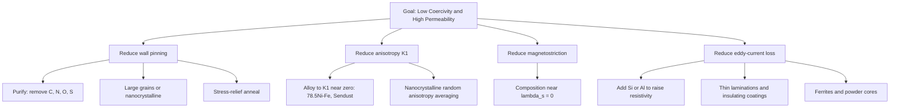
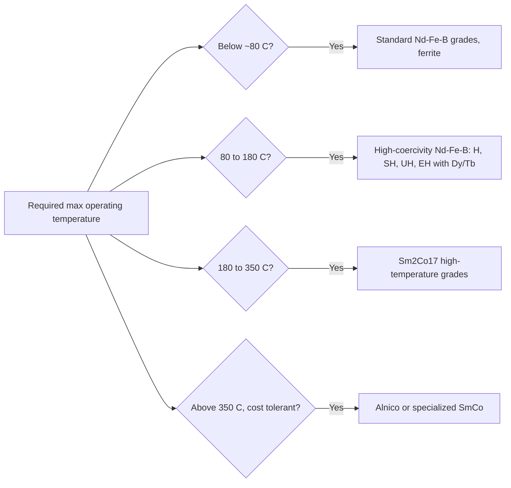

## Soft and Hard Magnetic Materials

### Overview

Ferromagnetic and ferrimagnetic materials are divided into two engineering classes according to how readily their magnetization follows an applied field. **Soft magnetic materials** magnetize and demagnetize easily (low coercivity, high permeability, narrow hysteresis loop) and are used to guide, concentrate, and switch magnetic flux. **Hard magnetic materials** resist demagnetization (high coercivity, high remanence, wide loop) and are used as sources of magnetic flux, i.e., permanent magnets. Both classes are governed by the same intrinsic physics (exchange, $M_s$, $T_C$) but are separated by extrinsic, microstructure-controlled properties: anisotropy, domain wall pinning, grain size, texture, and defect populations.

**Key Points**

- Saturation magnetization $M_s$ and Curie temperature $T_C$ are largely intrinsic (composition and crystal structure); coercivity $H_c$, remanence $M_r$, and permeability $\mu$ are structure-sensitive.
- Soft magnets are engineered to minimize obstacles to domain wall motion and to minimize anisotropy and magnetostriction.
- Hard magnets are engineered to maximize obstacles to reversal: high magnetocrystalline anisotropy, single-domain-scale grains, and grain-boundary control.
- Selection is driven by figures of merit: core loss, permeability, and $B_s$ for soft magnets; $(BH)_{max}$, $H_{ci}$, $B_r$, temperature coefficients, and corrosion resistance for hard magnets.
- The conventional boundary between "soft" and "hard" (roughly $H_c \approx 1$ to $10$ kA/m) is a convention, and intermediate "semi-hard" materials exist (e.g., magnetic recording media, hysteresis-motor alloys).

### Comparison of Soft and Hard Magnetic Materials

| Property | Soft magnetic | Hard magnetic |
| --- | --- | --- |
| Coercivity $H_c$ | $< \sim 10^3$ A/m (down to $\sim 0.1$ A/m) | $> \sim 10^4$ A/m (up to $> 2\times10^3$ kA/m for ferrites at high grades) |
| Remanence | Low to moderate (in open circuits); high in square-loop alloys | High |
| Permeability $\mu_r$ | $10^2$ to $10^6$ | Low (near 1 to 10 in the recoil region) |
| Hysteresis loop | Narrow | Wide |
| Hysteresis loss per cycle | Small | Large (not relevant to static use) |
| Anisotropy | Low (or averaged) | High |
| Domain wall motion | Easy | Impeded |
| Magnetostriction | Low desired | Not critical |
| Primary function | Guide and amplify flux; alternating-field cores | Provide static flux |
| Figure of merit | $\mu$, $B_s$, core loss $P$ | $(BH)_{max}$, $H_{ci}$, $B_r$ |
| Typical processing | Annealing, texture rolling, lamination, rapid solidification | Sintering, magnetic alignment, precipitation heat treatment, melt spinning |

Boundaries are conventional and values vary by source.

### Characterizing Parameters

#### Loop-Derived Parameters

| Parameter | Symbol | Meaning |
| --- | --- | --- |
| Saturation induction | $B_s$ | $B$ at saturation, $B_s = \mu_0(H+M_s)$ |
| Remanent induction | $B_r$ | $B$ at $H=0$ after saturation |
| Coercivity of induction | $_BH_c$ | Reverse field at which $B = 0$ |
| Intrinsic coercivity | $_MH_c$ or $H_{ci}$ | Reverse field at which $M = 0$ |
| Maximum energy product | $(BH)_{max}$ | Largest rectangle inscribed under the second-quadrant $B$-$H$ curve |
| Recoil permeability | $\mu_{rec}$ | Slope of minor recoil loops |
| Squareness | $M_r/M_s$ | Rectangularity of the loop |
| Initial and maximum permeability | $\mu_i$, $\mu_{max}$ | Slopes of the virgin magnetization curve |
| Core loss | $P_{tot}$ | Power dissipated per unit mass or volume under cyclic induction |

#### Basic Relations

$$B = \mu_0(H + M)$$

$$\mu_r = \frac{B}{\mu_0 H}$$

For a hard magnet with ideal square demagnetization behavior, the upper bound on the energy product is:

$$(BH)_{max} \le \frac{B_r^2}{4\mu_0}$$

Total AC core loss is commonly separated into three components (Bertotti):

$$P_{tot} = P_h + P_{cl} + P_{exc}$$

with hysteresis loss $P_h \propto f$, classical eddy-current loss $P_{cl} \propto f^2$, and excess loss $P_{exc} \propto f^{1.5}$. For a lamination of thickness $d$ and resistivity $\rho$ under sinusoidal induction of peak $B_m$:

$$P_{cl} = \frac{\pi^2 d^2 B_m^2 f^2}{6\rho}$$

### Soft Magnetic Materials

#### Design Principles

**Key Points**

- Minimize coercivity by reducing pinning sites: low interstitial impurities (C, N, O, S), few inclusions, low residual stress, large grains (or nanograins below the exchange length).
- Minimize anisotropy $K_1$ and magnetostriction $\lambda_s$. Alloy compositions near zero crossings (e.g., 78.5 wt% Ni in Ni-Fe, where both $K_1$ and $\lambda_s$ nearly vanish) give extremely high permeability.
- Maximize $B_s$ where flux density matters (Fe-Co, Fe-Si).
- Maximize electrical resistivity $\rho$ and minimize thickness for AC use (Si and Al additions, lamination, insulating coatings, ferrites, powder cores).
- Use texture (grain orientation) so the easy axis aligns with the flux path.

#### Herzer Random Anisotropy Model

In nanocrystalline soft magnets, when grain size $D$ is smaller than the ferromagnetic exchange length $L_{ex} = \sqrt{A/K_1}$, the effective anisotropy is averaged over many grains:

$$\langle K \rangle \approx \frac{K_1^4 D^6}{A^3}$$

Because coercivity scales as $H_c \propto \langle K \rangle / M_s$, it falls very steeply (approximately as $D^6$) as $D$ decreases below $L_{ex}$. This model explains coercivities of a few A/m in nanocrystalline Fe-Si-B-Nb-Cu alloys. It is an idealized scaling; measured exponents can deviate.

#### Families of Soft Magnetic Materials

##### Iron and Low-Carbon Steels

- **Pure iron (Armco, electrolytic, carbonyl):** $B_s \approx 2.15$ T; $H_c$ of roughly 4 to 80 A/m depending on purity and anneal. Used for relay cores, pole pieces, magnetic shielding (DC), and solenoid components. Low resistivity limits AC use.
- **Low-carbon steel:** Lower cost; used in DC electromagnets and non-critical motor parts. Carbon must be minimized (magnetic aging: carbon and nitrogen precipitation over time raises loss).

##### Silicon Steels (Electrical Steels)

Adding silicon to iron increases resistivity, decreases magnetocrystalline anisotropy and magnetostriction, and stabilizes the BCC phase, at the cost of reduced $B_s$ and increased brittleness above about 3.5 to 4 wt% Si.

| Grade | Si content | Structure | Application |
| --- | --- | --- | --- |
| Non-oriented (NO) | 0.5-3.5 wt% | Random texture | Rotating machines (motors, generators) |
| Grain-oriented (GO) | ~3.0-3.2 wt% | Goss texture $\{110\}\langle 001 \rangle$ | Power and distribution transformers |
| High-silicon (6.5 wt% Si) | 6.5 wt% | Near-zero $\lambda_s$ | High-frequency reactors; produced via CVD or special rolling |

- Goss texture arises from secondary recrystallization, controlled by inhibitors (MnS, AlN) that pin normal grain growth. The easy axis $\langle 001 \rangle$ lies along the rolling direction, giving low loss and high permeability along that direction.
- Typical losses: GO steel roughly 0.7 to 1.2 W/kg at 1.7 T, 50 Hz (grade and thickness dependent); NO steel roughly 2 to 6 W/kg at similar conditions. These ranges are approximate.
- Domain refinement (laser scribing, mechanical scribing) reduces excess loss in GO steels by narrowing domain width.
- Insulating coatings improve interlaminar resistance and impart tensile stress that further refines domains.

##### Nickel-Iron Alloys (Permalloys)

| Alloy | Composition (wt%) | Notes |
| --- | --- | --- |
| 78 Permalloy | ~78 Ni-Fe | $K_1$ and $\lambda_s$ near zero after slow cooling; $\mu_{max}$ up to $\sim 10^5$-$10^6$; sensitive to stress |
| Supermalloy | ~79 Ni, 5 Mo, balance Fe | Very high initial permeability, very low $H_c$ (~0.2 A/m) |
| Mumetal | ~77 Ni, 5 Cu, 2 Cr, Fe | Magnetic shielding; ductile |
| 50 Ni-Fe (Permenorm, Hipernik) | ~50 Ni-Fe | Higher $B_s$ (~1.5 T), moderate permeability; can be textured |
| 36 Ni-Fe (Invar-type) | 36 Ni | Low thermal expansion; used for shadow masks, not primarily magnetic |

Ordering reactions in Ni-Fe (formation of Ni$_3$Fe) alter anisotropy and permeability; cooling rate through the ordering temperature is controlled. Magnetic annealing (cooling in a field) can induce uniaxial anisotropy for square-loop behavior.

##### Iron-Cobalt Alloys

- **Permendur (49 Co-49 Fe-2 V), Hiperco:** Highest $B_s$ of any bulk soft magnet (about 2.35 T), high $T_C$ (~1200 K), used in aerospace generators, high-torque-density motors, and pole tips. Vanadium improves ductility (suppresses ordering-induced brittleness) and raises resistivity. Higher cost and higher core loss than Si-steel limit use to weight- or volume-critical designs.

##### Iron-Silicon-Aluminum (Sendust)

- ~9.5 Si-5.5 Al-Fe: $K_1$ and $\lambda_s$ both near zero, high hardness and wear resistance (used in recording heads), high resistivity, but brittle and typically supplied as powder cores.

##### Amorphous Alloys (Metallic Glasses)

Produced by rapid solidification (melt spinning at roughly $10^5$-$10^6$ K/s) into ribbons about 20 to 30 $\mu$m thick. The absence of crystalline anisotropy, grain boundaries, and dislocations gives low coercivity; high resistivity and thin gauge reduce eddy-current loss.

| Type | Representative composition | $B_s$ (T, approx.) | Features |
| --- | --- | --- | --- |
| Fe-based | Fe$_{78}$Si$_9$B$_{13}$ (Metglas 2605SA1) | 1.56 | Distribution transformers, very low core loss (about one-fifth of GO steel at power frequency, depending on grade) |
| Co-based | Co-Fe-Ni-Si-B | 0.5-1.0 | Near-zero magnetostriction; high-frequency transformers, sensors |
| Fe-Ni-based | Fe-Ni-Mo-B | 0.8 | Magnetic sensors, pulse transformers |

Limitations: thermal instability (crystallization above roughly 400-500 °C), embrittlement after annealing, and thin gauge complicating core manufacturing.

##### Nanocrystalline Alloys

Produced by partial crystallization of amorphous precursors.

- **Finemet-type:** Fe$_{73.5}$Si$_{13.5}$B$_9$Nb$_3$Cu$_1$. Cu forms nucleation clusters; Nb inhibits grain growth. After annealing at about 500-580 °C, ~10-15 nm $\alpha$-Fe(Si) grains sit in a residual amorphous matrix. Properties: $B_s \approx 1.2$ T, $\mu_i \sim 10^5$, very low core loss at kHz to tens of kHz.
- **Nanoperm and Hitperm:** Fe-Zr-B (Nanoperm) and Fe-Co-Zr-B-Cu (Hitperm) variants; Hitperm targets higher $B_s$ and higher operating temperature.

Applications: common-mode chokes, high-frequency power transformers, current transformers, EMI suppression.

##### Soft Ferrites

Ceramic ferrimagnets with the spinel structure $\mathrm{MFe_2O_4}$ (M = Mn, Zn, Ni, Mg, etc.), with very high electrical resistivity (roughly $10^{-1}$ to $10^{6}\ \Omega,$m depending on composition), so eddy-current loss is negligible at high frequency.

| Type | Composition | Frequency range | Notes |
| --- | --- | --- | --- |
| MnZn ferrite | $\mathrm{Mn_{1-x}Zn_xFe_2O_4}$ | up to ~1-2 MHz | High permeability ($\mu_i \sim 10^3$-$10^4$); power supplies, transformers, inductors |
| NiZn ferrite | $\mathrm{Ni_{1-x}Zn_xFe_2O_4}$ | up to hundreds of MHz to GHz | Lower permeability, higher resistivity; RF, EMI suppression |

Low $B_s$ (typically 0.2 to 0.5 T) and low $T_C$ (about 100-300 °C for many grades) limit power density.

The Snoek limit relates initial permeability and the ferromagnetic resonance (cutoff) frequency:

$$\mu_i f_r \approx \text{constant} \;\; (\text{for spinel ferrites, order } 10^{9}\ \text{Hz})$$

so higher permeability means lower usable frequency. This is an empirical approximation.

##### Powder Cores

Fine magnetic particles insulated by a binder yield a distributed air gap, providing lower permeability but excellent DC bias performance and high-frequency behavior.

| Type | Material | $\mu_r$ | Features |
| --- | --- | --- | --- |
| Iron powder | Carbonyl or atomized Fe | 10-100 | Low cost, high $B_s$, moderate loss |
| MPP (molypermalloy) | 81 Ni-2 Mo-Fe | 14-550 | Low loss, temperature-stable inductance |
| High Flux | 50 Ni-Fe | 14-160 | Higher $B_s$ than MPP |
| Sendust (Kool Mu) | Fe-Si-Al | 26-125 | Low loss, low cost relative to Ni-based |
| Fe-Si (XFlux) | Fe-6.5 Si | 26-90 | Higher $B_s$ (about 1.6 T) |
| Soft magnetic composites (SMC) | Coated Fe powder, pressed | 300-800 | 3-D flux paths for machines |

#### Soft Magnetic Material Property Summary

| Material | $B_s$ (T) | $H_c$ (A/m) | $\mu_{max}$ | $\rho$ ($\mu\Omega\,$cm) | $T_C$ (°C) |
| --- | --- | --- | --- | --- | --- |
| Pure iron (annealed) | 2.15 | 4-80 | $10^4$-$2\times10^5$ | ~10 | 770 |
| Fe-3%Si NO | 2.0 | 30-80 | $\sim 10^4$ | 40-50 | 740 |
| Fe-3%Si GO | 2.0 | 4-10 | $\sim 5\times10^4$ | 45-50 | 740 |
| 78 Permalloy | 0.8 | 0.4-2 | $\sim 10^5$-$10^6$ | ~16-20 | 400-500 |
| Supermalloy | 0.8 | ~0.2 | $\sim 10^6$ | ~60 | ~400 |
| Permendur | 2.35 | 40-200 | $\sim 5\times10^3$-$10^4$ | 26-40 | 940-980 |
| Amorphous Fe-based | 1.56 | 2-5 | $\sim 10^5$ | ~130 | ~400 |
| Nanocrystalline (Finemet) | 1.2 | 1-2 | $\sim 10^5$-$10^6$ | ~120 | ~570 |
| MnZn ferrite | 0.4-0.5 | 10-30 | $\sim 10^3$-$10^4$ (initial) | $10^{5}$-$10^{9}$ | 100-300 |

Values are approximate ranges; they depend on grade, thickness, anneal, and reference.

#### Soft Magnetic Applications

| Application | Requirements | Typical materials |
| --- | --- | --- |
| Power and distribution transformers | Low loss at 50/60 Hz, high $B_s$ | GO Fe-Si, amorphous Fe-based |
| Motors and generators | Low loss, high $B_s$, formability, punchability | NO Fe-Si, Fe-Co (aerospace) |
| High-frequency (kHz) transformers and inductors | Low loss, moderate $B_s$ | Nanocrystalline, MnZn ferrite, amorphous |
| RF and microwave devices | High resistivity, low loss | NiZn ferrite, garnets |
| Magnetic shielding | Very high permeability | Mumetal, Permalloy, amorphous ribbon |
| Recording heads, sensors, fluxgates | High permeability, low noise, hardness | Permalloy, Sendust, CoZrNb thin films |
| Relays, solenoids, actuators | High $B_s$, low remanence | Pure iron, low-C steel, Fe-Co, Fe-Ni |
| EMI suppression, chokes | Broadband impedance | NiZn ferrite, nanocrystalline |

### Hard Magnetic Materials (Permanent Magnets)

#### Design Principles

**Key Points**

- A permanent magnet must have high $B_r$ (large $M_s$ and good alignment), high $H_{ci}$ (resistance to demagnetization), and a square second-quadrant loop.
- High coercivity requires high magnetocrystalline anisotropy $K_1$ (the anisotropy field is $H_K = 2K_1/\mu_0 M_s$), typically from rare-earth (4f) or heavy transition-metal (5d, e.g., Pt) sublattices or from shape anisotropy in elongated particles.
- Real coercivity is only a fraction of $H_K$ (Brown's paradox), reflecting nucleation of reversed domains at defects. The Kronmüller relation captures this:

$$H_c = \alpha H_K - N_{eff} M_s$$

where $\alpha < 1$ accounts for microstructural imperfections and misalignment and $N_{eff}$ for local demagnetizing fields.

- Microstructural strategies: fine (near single-domain) grains, texture, and grain-boundary phases that magnetically decouple grains.

**Reversal Mechanisms**

- **Nucleation-controlled:** Coercivity depends on the field needed to nucleate reversed domains; once nucleated, walls sweep rapidly (sintered Nd-Fe-B, ferrites). The virgin curve is steep.
- **Pinning-controlled:** Walls move easily within grains but are pinned at cell boundaries or precipitates; a high field is needed to depin them (Sm$_2$Co$_{17}$, Alnico). The virgin curve is shallow ("difficult to magnetize").

#### Working Point and Load Line

A magnet in a circuit operates where the demagnetization curve intersects the load line defined by its geometry (permeance coefficient $P_c = B_d/(\mu_0 H_d)$, in magnitude). Maximum energy transfer occurs near the point of $(BH)_{max}$.

$$(BH)_{max} = B_d H_d \Big|_{max}$$

Design criteria include keeping the operating point above the "knee" of the demagnetization curve at the highest service temperature and against the largest opposing field, to avoid irreversible loss.

#### Families of Hard Magnetic Materials

##### Carbon Steels and Tungsten, Chromium, Cobalt Steels (Historical)

Martensitic steels hardened by carbon and alloying carbide precipitates; low $(BH)_{max}$ (about 1-8 kJ/m³). Largely obsolete for magnets but historically important.

##### Alnico (Al-Ni-Co-Fe, with Cu, Ti)

Developed in the 1930s-40s. Alnico owes its coercivity to shape anisotropy: spinodal decomposition of a high-temperature bcc phase into elongated Fe-Co-rich ferromagnetic rods (~10 nm diameter, ~100 nm length) embedded in a weakly magnetic Ni-Al-rich matrix. Heat treatment in a magnetic field during cooling through the spinodal range aligns the rods along the field (and the directional solidification of Alnico 5-7 improves texture further).

| Feature | Alnico |
| --- | --- |
| $B_r$ | 0.7-1.35 T |
| $H_{ci}$ | 40-160 kA/m (low relative to rare-earth types) |
| $(BH)_{max}$ | 10-85 kJ/m³ |
| $T_C$ | ~800-860 °C |
| Temperature coefficient of $B_r$ | Very low (~ -0.02 %/K) |
| Max service temperature | ~500-550 °C |
| Weaknesses | Low coercivity (susceptible to demagnetization by stray fields and shape/geometry) |
| Applications | Sensors, instruments, high-temperature, guitar pickups, microphones, motors where geometry keeps permeance coefficient high |

##### Hard Ferrites (Ceramic Magnets)

Hexagonal M-type ferrites: $\mathrm{BaFe_{12}O_{19}}$ and $\mathrm{SrFe_{12}O_{19}}$ (magnetoplumbite structure), with high uniaxial anisotropy along the $c$-axis ($K_1 \approx 3.3 \times 10^5$ J/m³) and $T_C \approx 450$ °C (about 720 K).

| Feature | Hard ferrite |
| --- | --- |
| $B_r$ | 0.2-0.44 T |
| $H_{ci}$ | 200-400 kA/m |
| $(BH)_{max}$ | 8-40 kJ/m³ |
| Cost | Lowest cost per unit energy product |
| Advantages | Corrosion-resistant, electrically insulating, no critical raw materials |
| Weakness | Coercivity decreases with falling temperature (positive temperature coefficient of $H_{ci}$), so cold-temperature demagnetization risk; low $B_r$ |
| Processing | Calcination, milling to single-domain size (~1 $\mu$m), pressing in a magnetic field (anisotropic grades) or without (isotropic), then sintering; La-Co substitution improves properties |
| Applications | Small motors, loudspeakers, refrigerator magnets (bonded), automotive motors, magnetic separators |

##### Samarium-Cobalt (SmCo)

| Type | Composition | $B_r$ (T) | $H_{ci}$ (kA/m) | $(BH)_{max}$ (kJ/m³) | $T_C$ (°C) |
| --- | --- | --- | --- | --- | --- |
| SmCo$_5$ (1:5) | $\mathrm{SmCo_5}$ | 0.85-1.0 | 1500-2500 | 140-200 | ~720 |
| Sm$_2$Co$_{17}$ (2:17) | $\mathrm{Sm_2(Co,Fe,Cu,Zr)_{17}}$ | 0.95-1.15 | 800-2000 | 190-260 | ~820-850 |

- SmCo$_5$ has extremely high uniaxial anisotropy ($K_1 \sim 1.7\times 10^7$ J/m³), nucleation-controlled coercivity, and easy magnetization.
- Sm$_2$Co$_{17}$ achieves coercivity via a cellular precipitation microstructure: 2:17 cells (Fe-rich, high $M_s$) surrounded by a 1:5 cell-boundary phase (Cu-rich) that pins domain walls. Zr promotes a lamellar phase (Z-phase) that facilitates diffusion of Cu.
- Advantages: excellent thermal stability (service to 300-350 °C, some grades higher), low temperature coefficients, good corrosion resistance.
- Drawbacks: expensive (Co and Sm), brittle.
- Applications: aerospace and military actuators, high-temperature motors, traveling-wave tubes, sensors.

##### Neodymium-Iron-Boron (Nd-Fe-B)

Discovered independently in 1983 (Sumitomo, powder metallurgy; General Motors, melt spinning). The hard phase is tetragonal Nd$_2$Fe$_{14}$B ($P4_2/mnm$), with $M_s \approx 1.6$ T ($\mu_0 M_s$), $K_1 \approx 4.5\times10^6$ J/m³, $H_K \approx 6$-$7$ T, and $T_C \approx 585$ K (~312 °C).

| Feature | Sintered Nd-Fe-B |
| --- | --- |
| $B_r$ | 1.0-1.55 T |
| $H_{ci}$ | 900-3000 kA/m (grade-dependent, increased by Dy/Tb additions) |
| $(BH)_{max}$ | 200-450 kJ/m³ (up to 55-56 MGOe in top grades) |
| $T_C$ | ~310-350 °C (with Co addition) |
| Temperature coefficient of $B_r$ | ~ -0.11 %/K |
| Temperature coefficient of $H_{ci}$ | ~ -0.5 to -0.6 %/K (much larger than SmCo) |
| Max operating temperature | ~80-230 °C depending on grade |
| Corrosion | Poor (Nd-rich intergranular phase oxidizes); requires Ni-Cu-Ni plating, epoxy, or Al coating |

**Microstructure and processing (sintered route)**

1. Strip-cast alloy → hydrogen decrepitation (HD) → jet milling to about 3-5 $\mu$m powder.
2. Alignment in a magnetic field (1-2 T) and pressing (die or isostatic).
3. Vacuum sintering at about 1050-1100 °C with a liquid Nd-rich phase, followed by post-sinter anneal near 500-900 °C to optimize the grain-boundary phase.
4. Machining, coating, and magnetization.

- Coercivity is nucleation-controlled and depends on a thin, non-ferromagnetic Nd-rich grain-boundary layer that decouples grains.
- **Grain boundary diffusion process (GBDP):** Diffusing Dy or Tb (as fluoride, oxide, or metal) along grain boundaries forms a high-anisotropy (Dy,Nd)$_2$Fe$_{14}$B shell at grain surfaces, increasing $H_{ci}$ with much less heavy rare earth than bulk alloying (this reduces reliance on supply-constrained elements).
- Coercivity is reduced by Dy-free designs, so recent efforts target Ce-, La-, and Y-substituted variants and grain refinement to about 1-2 $\mu$m.

**Other Nd-Fe-B forms**

| Form | Process | Properties |
| --- | --- | --- |
| Bonded (isotropic) | Melt-spun ribbon (MQP) + polymer binder | $B_r \approx 0.5$-0.8 T, $(BH)_{max} \approx 40$-90 kJ/m³; complex shapes |
| Hot-pressed and die-upset (anisotropic) | Melt-spun powder hot pressed and plastically deformed | Radially oriented ring magnets, $(BH)_{max}$ up to ~300 kJ/m³ |
| Anisotropic bonded (HDDR) | Hydrogenation-Disproportionation-Desorption-Recombination | High-performance bonded magnets |

**Applications:** EV traction motors, wind turbine direct-drive generators, hard disk voice-coil motors, MRI (some designs), loudspeakers, consumer electronics, robotics.

##### Samarium-Iron-Nitrogen (Sm$_2$Fe$_{17}$N$_3$)

Interstitial nitrogenation of Sm$_2$Fe$_{17}$ raises $T_C$ from ~390 K to ~750 K and produces strong uniaxial anisotropy ($\mu_0 H_K \approx 14$ T). The compound decomposes above ~600 °C, so it cannot be sintered by conventional means; it is used in bonded magnets and low-temperature-consolidated forms.

##### Manganese-Based and Other Hard Magnets

| Material | Notes |
| --- | --- |
| MnAl ($\tau$-phase) | Metastable ferromagnetic phase; potential rare-earth-free magnet; $(BH)_{max}$ ~ 50-100 kJ/m³ (experimental) |
| MnBi (low temperature phase) | Positive temperature coefficient of coercivity; potential for high-temperature operation |
| FePt, CoPt ($L1_0$) | Very high $K_u$ (~$7\times10^6$ J/m³ for FePt); used in high-density recording media and thin-film magnets; costly |
| Fe-Cr-Co | Deformation-aged spinodal alloys; ductile, machinable; used in some sensors and instruments |
| Cunife, Vicalloy, Remalloy | Ductile precipitation-hardening alloys; niche uses in wire, tape, and sensors |
| Tetrataenite ($L1_0$ FeNi) | Naturally forming in meteorites; artificial synthesis challenging; investigated as a rare-earth-free candidate (status: research) |

Rare-earth-free and reduced-rare-earth magnets remain active research areas due to supply-chain concerns; performance claims for emerging materials should be verified against current literature ([Unverified] regarding long-term commercial viability).

#### Hard Magnet Property Comparison

| Material | $B_r$ (T) | $H_{ci}$ (kA/m) | $(BH)_{max}$ (kJ/m³) | $T_C$ (°C) | Max. service $T$ (°C) | Relative cost |
| --- | --- | --- | --- | --- | --- | --- |
| Alnico 5 | 1.2-1.3 | 50-60 | 40-50 | ~890 | ~520 | Medium |
| Hard ferrite (Sr) | 0.38-0.44 | 250-400 | 25-35 | ~450 | ~250 | Very low |
| SmCo$_5$ | 0.85-1.0 | 1500-2500 | 140-200 | ~720 | ~250 | High |
| Sm$_2$Co$_{17}$ | 1.0-1.15 | 800-2000 | 190-260 | ~820 | ~300-350 | High |
| Sintered Nd-Fe-B | 1.2-1.5 | 900-3000 | 200-450 | ~310-350 | ~80-230 | Medium-high |
| Bonded Nd-Fe-B | 0.6-0.8 | 600-1000 | 40-100 | ~310 | ~120-150 | Medium |
| Bonded ferrite | 0.14-0.3 | 200-300 | 4-12 | ~450 | ~100-150 | Very low |

All values are typical ranges; consult manufacturer datasheets for specific grades.

#### Temperature Behavior

- **Reversible losses:** $B_r$ decreases approximately linearly with temperature, characterized by $\alpha_{B_r}$ (%/K); recovers on cooling.
- **Irreversible losses:** If the operating point drops below the knee of the demagnetization curve at elevated temperature, partial demagnetization occurs; it is only recovered by remagnetization.
- **Structural losses:** Metallurgical changes (oxidation, phase decomposition) cause permanent damage.
- **Curie temperature limit:** Above $T_C$, ferromagnetic order is lost entirely.
- Nd-Fe-B suffers from a large negative $\alpha_{H_{ci}}$; hence demagnetization risk rises quickly with temperature. Heavy rare-earth (Dy, Tb) additions raise $H_{ci}$ for high-temperature grades.
- Hard ferrites show the opposite trend in $H_{ci}$ (increasing with temperature), so low-temperature demagnetization is the concern.
- Grade designations for Nd-Fe-B (e.g., N42, N42SH, N38UH) encode $(BH)_{max}$ (MGOe) and maximum operating temperature class (letters).

#### Thermal Stability Summary

#### Magnetization and Handling

- **Magnetizing field:** Approximately 2 to 3 times $H_{ci}$ is needed for full saturation of the magnet in its final assembly; SmCo and Nd-Fe-B require capacitor-discharge magnetizers (several tesla).
- **Stabilization and aging:** Partial demagnetization and thermal cycling before use improve stability (particularly Alnico).
- **Safety and handling:** Strong magnets can cause crush injuries, interfere with pacemakers, and shatter (brittle sintered materials). Nd-Fe-B powder is pyrophoric when fine.

### Semi-Hard Magnetic Materials

Materials with intermediate coercivity (about 1 to 100 kA/m or, in some conventions, roughly 10 to 100 kA/m), used where the magnetic state must be set and retained but reprogrammed:

| Application | Material |
| --- | --- |
| Magnetic recording media (hard disks) | CoCrPt-oxide granular thin films (perpendicular recording), FePt $L1_0$ (heat-assisted recording, HAMR) |
| Magnetic tape | $\gamma$-Fe$_2$O$_3$, CrO$_2$, metal particles (Fe), barium ferrite |
| Hysteresis motors and latching relays | Fe-Co-V (Vicalloy), Fe-Cr-Co |
| Magnetic strips and cards, anti-theft tags (EAS) | Cobalt-modified $\gamma$-Fe$_2$O$_3$, Fe-Ni semi-hard strips |

Recording media illustrate the **superparamagnetic limit** trade-off: grains must be small (for signal-to-noise) yet thermally stable, $K_u V / k_B T \gtrsim 60$ for ~10-year retention. This drives materials with higher $K_u$ (FePt) that require heat-assisted writing because their coercivity exceeds the head field.

### Structure-Property Relationships

| Microstructural feature | Soft magnets | Hard magnets |
| --- | --- | --- |
| Grain size | Very large (low pinning) or nanocrystalline ($D < L_{ex}$) | Near single-domain (~1 to few $\mu$m for sintered Nd-Fe-B; ~ 100 nm for exchange-spring ideas) |
| Texture | Aligned easy axis along flux path (GO steel) | Aligned $c$-axes in anisotropic magnets (raises $B_r$) |
| Grain boundaries | Minimize pinning | Engineered Nd-rich or Cu-rich phases for exchange decoupling |
| Inclusions and precipitates | Avoid (pinning) | Beneficial (pinning) in precipitation-hardened magnets (Sm$_2$Co$_{17}$, Alnico) |
| Residual stress | Remove by annealing | Not a primary control |
| Anisotropy $K_1$ | Low or averaged | High |
| Resistivity | High (for AC) | Not critical; matters for eddy-current loss in rotors |

### Processing Routes Summary

| Route | Material examples | Key steps |
| --- | --- | --- |
| Ingot metallurgy, hot and cold rolling, annealing | Fe-Si, Fe-Co, Ni-Fe | Melting (vacuum), rolling, decarburization, high-temperature anneal (GO: secondary recrystallization) |
| Rapid solidification | Amorphous and nanocrystalline ribbons, melt-spun Nd-Fe-B | Melt spinning, optional crystallization anneal |
| Powder metallurgy and sintering | Ferrites, SmCo, sintered Nd-Fe-B | Milling, aligning field, pressing, sintering, post-anneal |
| Casting and precipitation aging | Alnico | Casting, solution treatment, field cooling, drawing anneal |
| Powder bonding | Bonded magnets, powder cores | Powder blending with polymer, compression or injection molding |
| Thin-film deposition | Recording media, MEMS magnets, sensors | Sputtering, epitaxy, annealing |
| Additive manufacturing | Emerging: Fe-Si, Nd-Fe-B, Ni-Fe | Laser powder bed fusion; challenges in microstructure and coercivity control ([Speculation] on mass adoption) |

### Worked Examples

#### Example 1: Core Loss Estimate for a Transformer Lamination

**Given:** Non-oriented steel lamination, thickness $d = 0.35$ mm, resistivity $\rho = 45\ \mu\Omega\,$cm $= 4.5\times10^{-7}\ \Omega\,$m, operating at $B_m = 1.5$ T, $f = 400$ Hz. Estimate the classical eddy-current loss density.

**Solution:**

$$P_{cl} = \frac{\pi^2 d^2 B_m^2 f^2}{6\rho} = \frac{(9.87)(0.35\times10^{-3})^2(1.5)^2(400)^2}{6(4.5\times10^{-7})}$$

Numerator: $9.87 \times 1.225\times10^{-7} \times 2.25 \times 1.6\times10^{5} = 9.87 \times 1.225\times10^{-7} = 1.209\times10^{-6}$; $\times 2.25 = 2.72\times10^{-6}$; $\times 1.6\times10^5 = 0.435$.

Denominator: $2.7\times10^{-6}$.

$$P_{cl} \approx \frac{0.435}{2.7\times10^{-6}} \approx 1.6\times10^{5}\ \text{W/m}^3$$

**Result:** With density about $7650$ kg/m³, this equals roughly $21$ W/kg of classical eddy-current loss alone at 400 Hz. Halving the lamination thickness would reduce this by a factor of four, illustrating why thin gauges are used at higher frequency.

#### Example 2: Upper Limit of Energy Product

**Given:** A sintered Nd-Fe-B magnet with $B_r = 1.40$ T.

**Solution:**

$$(BH)_{max} \le \frac{B_r^2}{4\mu_0} = \frac{1.96}{4(4\pi\times10^{-7})} = \frac{1.96}{5.03\times10^{-6}} \approx 3.9\times10^{5}\ \text{J/m}^3$$

**Result:** The theoretical ceiling is about 390 kJ/m³ (49 MGOe). Practical grades with $B_r \approx 1.4$ T reach roughly 380 kJ/m³ (48 MGOe), close to the limit, because of high squareness and $H_{ci}$.

#### Example 3: Anisotropy Field and Coercivity Fraction of Nd$_2$Fe$_{14}$B

**Given:** $K_1 = 4.5\times10^{6}$ J/m³ and $\mu_0 M_s = 1.61$ T (i.e., $M_s = 1.28\times10^{6}$ A/m).

**Solution:**

$$\mu_0 H_K = \frac{2K_1}{M_s} = \frac{2(4.5\times10^{6})}{1.28\times10^{6}} = 7.0\ \text{T}$$

Typical sintered magnets show $\mu_0 H_{ci} \approx 1.2$-$2.5$ T (higher with Dy).

**Result:** Achieved coercivity is about 20-35% of the anisotropy field ($\alpha \approx 0.2$-$0.35$), consistent with Brown's paradox and the Kronmüller relation. Improvement toward the theoretical limit is limited by grain-edge defects and misalignment.

#### Example 4: Operating Point of a Magnet in an Open Circuit

**Given:** A cylindrical ferrite magnet has permeance coefficient $P_c = B_d/(\mu_0 H_d) = 1.5$ (magnitude). Its demagnetization curve is approximately linear with $B_r = 0.40$ T and recoil permeability $\mu_{rec} = 1.05$, so

$$B = B_r + \mu_0 \mu_{rec} H$$

Find the operating point (assuming $H$ negative in the second quadrant, so $B = -P_c \mu_0 H$).

**Solution:** Set $-P_c\mu_0 H = B_r + \mu_0\mu_{rec}H$:

$$H = -\frac{B_r}{\mu_0(P_c + \mu_{rec})} = -\frac{0.40}{(1.257\times10^{-6})(2.55)} = -1.25\times10^{5}\ \text{A/m}$$

$$B_d = -P_c\mu_0 H = 1.5(1.257\times10^{-6})(1.25\times10^{5}) \approx 0.235\ \text{T}$$

**Result:** The operating point is about $B_d \approx 0.24$ T at $H_d \approx -125$ kA/m. Because ferrite $H_{ci}$ is around 250-400 kA/m, this point lies well within the safe region at room temperature, though $H_{ci}$ falls at low temperatures, reducing the margin.

#### Example 5: Herzer Scaling of Coercivity

**Given:** A nanocrystalline alloy with $D = 12$ nm has $H_c = 2$ A/m. Estimate $H_c$ if the grain size grows to $D = 20$ nm (still below $L_{ex}$), assuming the $D^6$ dependence of $\langle K \rangle$ and $H_c \propto \langle K \rangle/M_s$ with constant $M_s$.

**Solution:**

$$\frac{H_c(20)}{H_c(12)} = \left(\frac{20}{12}\right)^{6} = (1.667)^6 \approx 21.4$$

$$H_c(20) \approx 2 \times 21.4 \approx 43\ \text{A/m}$$

**Result:** A modest increase in grain size produces a large loss of softness, which is why annealing temperature and time must be tightly controlled. Real materials deviate from an exact $D^6$ law and once $D$ approaches $L_{ex}$ the dependence changes toward $1/D$ (large-grain regime).

### Selection Guidelines

#### Soft Magnetic Material Selection

| Requirement | Recommended options |
| --- | --- |
| Power-frequency transformer, lowest loss | Amorphous Fe-based, GO Fe-Si |
| Large rotating machines, cost-sensitive | NO Fe-Si (0.35-0.5 mm) |
| Aerospace, maximum torque density | Fe-Co-V (Hiperco/Permendur) |
| kHz to 100 kHz switching converters | Nanocrystalline, MnZn ferrite, amorphous |
| MHz power and RF | MnZn (to ~1 MHz), NiZn (above) |
| DC bias inductors and PFC chokes | Powder cores (Sendust, High Flux, MPP) |
| Weak-field shielding | Mumetal, Permalloy, amorphous ribbon (after final anneal) |
| Complex 3-D flux paths | Soft magnetic composites (SMC) |

#### Hard Magnetic Material Selection

| Requirement | Recommended options |
| --- | --- |
| Maximum energy density, moderate temperature | Sintered Nd-Fe-B |
| High temperature (>200 °C), stable | Sm$_2$Co$_{17}$, Alnico (if geometry permits) |
| Lowest cost, high volume, moderate performance | Hard ferrite |
| Complex shapes, net-shape manufacturing | Bonded Nd-Fe-B, bonded ferrite |
| Precision instruments, low temperature coefficient | Alnico, SmCo |
| Corrosion-critical without coating | SmCo, ferrite |
| High-density recording | CoCrPt, FePt |

### Failure Modes and Practical Considerations

**Soft magnets**

- Stress from punching, cutting, or shrink-fitting degrades permeability and raises loss; stress-relief annealing recovers properties.
- Magnetic aging from C and N precipitation raises loss over time in low-grade steels.
- Saturation limits flux capacity; local saturation at corners and joints increases losses and harmonics.
- Amorphous ribbon becomes brittle after anneal, requiring careful handling.
- Nanocrystalline cores are sensitive to mechanical stress (often supplied in cases or impregnated).

**Hard magnets**

- Nd-Fe-B corrodes via the Nd-rich grain-boundary phase in humid environments and hydrogen absorption; coatings and pressure-cooker tests are used for qualification.
- Irreversible demagnetization from high temperature, opposing fields (short-circuit faults in motors), or shock/mechanical impact; design must maintain the operating point above the knee under worst-case conditions.
- Brittleness: sintered Nd-Fe-B and SmCo chip and crack; machining requires diamond or EDM tooling.
- Eddy-current heating in rotor magnets at high switching frequencies; segmentation of magnets reduces losses.
- Supply chain: Nd, Pr, Dy, Tb, Sm, and Co availability and price volatility influence material selection; recycling and grain-boundary diffusion reduce heavy rare-earth content.

### Emerging Directions

- Heavy-rare-earth-free high-coercivity Nd-Fe-B through grain refinement and grain-boundary engineering.
- Ce- and La-substituted rare-earth magnets to exploit abundant elements at reduced performance.
- High-$B_s$ nanocrystalline and amorphous alloys (Fe-Co-based) for high-power-density electrification.
- Additive manufacturing of soft and hard magnetic components with tailored anisotropy ([Speculation] regarding scaled industrial adoption).
- Rare-earth-free candidates (MnAl-C, MnBi, tetrataenite, Fe-N martensite $\alpha''$-Fe$_{16}$N$_2$); $\alpha''$-Fe$_{16}$N$_2$ claims of very large $M_s$ remain contested in the literature ([Unverified]).
- Wide-bandgap semiconductor switching (SiC, GaN) pushes converter frequencies upward, increasing demand for low-loss high-frequency soft magnets.
- Magnetic recycling of end-of-life Nd-Fe-B via hydrogen processing and re-sintering.

### Conclusion

Soft and hard magnetic materials share the same underlying ferromagnetism but occupy opposite ends of the coercivity spectrum through deliberate microstructural engineering. Soft magnets rely on low anisotropy, low magnetostriction, minimal pinning, and high resistivity to guide flux with little loss, exemplified by grain-oriented Si-steel, Ni-Fe alloys, amorphous and nanocrystalline ribbons, and ferrites. Hard magnets rely on high magnetocrystalline anisotropy, fine grain and boundary control, and texture to lock magnetization in place, exemplified by Alnico, ferrites, SmCo, and Nd-Fe-B. Successful material selection balances intrinsic properties ($B_s$, $T_C$, $K_1$) against extrinsic ones ($H_c$, $\mu$, loss, temperature behavior), manufacturability, corrosion resistance, and cost.

**Related Topics**

- Magnetic domains, hysteresis, and Barkhausen noise
- Magnetocrystalline anisotropy and magnetostriction
- Micromagnetics and the Landau-Lifshitz-Gilbert equation
- Soft magnetic composites and additive manufacturing
- Rare-earth supply, recycling, and grain-boundary diffusion
- Exchange-spring and nanocomposite magnets
- Magnetic recording media and HAMR
- Magnetic shielding design
- Motor and transformer core design (loss modeling, Bertotti and Steinmetz)
- Spintronics and thin-film magnetic materials