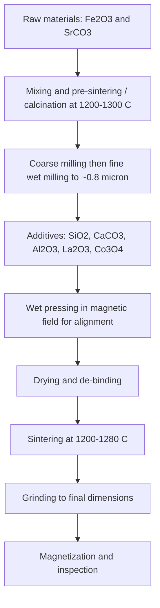

## Ferrites and Their Applications

### Overview

Ferrites are ceramic ferrimagnetic oxides whose principal constituent is iron oxide (Fe$_2$O$_3$) combined with one or more divalent (or, in some families, trivalent or rare-earth) metal oxides. They combine useful magnetization with very high electrical resistivity (typically $10^{-1}$ to $10^{10}\ \Omega,$m depending on composition, several orders of magnitude above metallic magnets). This combination makes them indispensable wherever magnetic flux must be guided or generated at high frequency without prohibitive eddy-current losses, or where a low-cost, corrosion-resistant permanent magnet is needed.

**Key Points**

- Ferrites are **ferrimagnetic**, not ferromagnetic: unequal, antiparallel sublattice moments produce a net spontaneous magnetization below the Néel (ferrimagnetic Curie) temperature $T_C$.
- Their magnetic behavior is governed by superexchange through oxygen anions, with cation site occupancy (tetrahedral vs octahedral) controlling net moment.
- Three principal crystal families dominate: **spinel** (soft ferrites), **hexagonal (magnetoplumbite)** (hard ferrites and microwave ferrites), and **garnet** (microwave and magneto-optical devices). A fourth family, **orthoferrites/perovskites**, is of specialized interest.
- Soft ferrites (MnZn, NiZn) cover power electronics from kHz to GHz; hard ferrites (Sr, Ba) are the highest-volume permanent magnet material by mass.
- The Snoek limit couples permeability and operating frequency, forcing trade-offs in material selection.
- Processing (powder preparation, sintering atmosphere, grain size, density) controls properties as strongly as composition.

### Ferrimagnetism and Magnetic Structure

#### Superexchange and Sublattices

Direct exchange between metal ions in oxides is weak because they are separated by large oxygen anions. Instead, the dominant coupling is **superexchange**, mediated by the oxygen $2p$ orbitals (Kramers-Anderson mechanism). Its sign and strength depend on the M-O-M bond angle and cation electron configuration; the interaction between a tetrahedral (A-site) and an octahedral (B-site) ion is typically the strongest and is antiferromagnetic (antiparallel alignment).

The net moment arises when the two sublattices are unequal:

$$M_s = |M_B - M_A|$$

with each sublattice magnetization having its own temperature dependence, which can produce unusual $M_s(T)$ curves, including a **compensation temperature** $T_{comp}$ at which the sublattice magnetizations cancel (observed in some garnets and Li-Cr ferrites).

#### Néel Two-Sublattice Model

Néel's molecular-field treatment gives, for the paramagnetic regime above $T_C$, a hyperbolic (not linear) inverse-susceptibility relation:

$$\frac{1}{\chi} = \frac{T}{C} + \frac{1}{\chi_0} - \frac{\sigma}{T - \theta}$$

where $C$ is the Curie constant, $\chi_0$, $\sigma$, and $\theta$ are constants derived from the intra- and inter-sublattice molecular-field coefficients. The curvature at low $T$ approaching $T_C$ distinguishes ferrimagnets from ferromagnets, which follow a straight Curie-Weiss line. This is a model description; measured curves deviate because of site disorder and spin canting.

### Crystal Structures

#### Spinel Ferrites

General formula: $\mathrm{MFe_2O_4}$ (M = Mn, Fe, Co, Ni, Cu, Zn, Mg, Li$_{0.5}$Fe$_{0.5}$, etc.), space group $Fd\bar{3}m$. The oxygen anions form a close-packed cubic lattice; the cations occupy two interstitial site types:

| Site | Coordination | Sites per formula unit | Symbol |
| --- | --- | --- | --- |
| Tetrahedral | 4 O | 1 (of 2 available in 8 per unit cell... in general 8 of 64 per cell) | A |
| Octahedral | 6 O | 2 (16 of 32 per cell) | B |

Per cubic unit cell: 32 O$^{2-}$, 64 tetrahedral interstices (8 occupied), 32 octahedral interstices (16 occupied).

**Cation distribution** is written as:

$$(\mathrm{M}_{1-\delta}\mathrm{Fe}_{\delta})_A[\mathrm{M}_{\delta}\mathrm{Fe}_{2-\delta}]_B\mathrm{O}_4$$

with the inversion parameter $\delta$:

| Type | $\delta$ | Description | Examples |
| --- | --- | --- | --- |
| Normal spinel | 0 | Divalent M on A sites | ZnFe$_2$O$_4$, CdFe$_2$O$_4$ |
| Inverse spinel | 1 | Divalent M on B sites; Fe$^{3+}$ splits equally A and B | Fe$_3$O$_4$, NiFe$_2$O$_4$, CoFe$_2$O$_4$, CuFe$_2$O$_4$ |
| Mixed (partially inverse) | 0 < $\delta$ < 1 | Intermediate | MnFe$_2$O$_4$ ($\delta \approx 0.2$), MgFe$_2$O$_4$ ($\delta \approx 0.9$) |

Site preference depends on ionic radius, crystal-field stabilization energy, and electrostatic (Madelung) energy. Zn$^{2+}$ and Cd$^{2+}$ strongly prefer tetrahedral sites (sp$^3$ bonding); Ni$^{2+}$ has strong octahedral preference due to crystal-field stabilization.

**Net moment of inverse spinels:** In an inverse spinel the Fe$^{3+}$ moments (5 $\mu_B$) on A and B sites cancel, so the net moment per formula unit comes solely from the divalent ion on B sites:

| Ferrite | Divalent ion | Spin-only moment ($\mu_B$) | Observed ($\mu_B$/f.u.) |
| --- | --- | --- | --- |
| NiFe$_2$O$_4$ | Ni$^{2+}$ ($3d^8$) | 2 | ~2.0-2.3 |
| CoFe$_2$O$_4$ | Co$^{2+}$ ($3d^7$) | 3 | ~3.0-3.7 (orbital contribution) |
| CuFe$_2$O$_4$ | Cu$^{2+}$ ($3d^9$) | 1 | ~1.0-1.3 |
| Fe$_3$O$_4$ (magnetite) | Fe$^{2+}$ ($3d^6$) | 4 | ~4.1 |
| MnFe$_2$O$_4$ (mostly normal) | Mn$^{2+}$ ($3d^5$) | 5 | ~4.6-5 |

**Effect of Zn substitution in MnZn and NiZn ferrites:** Zn$^{2+}$ (nonmagnetic) enters A sites and displaces Fe$^{3+}$ to B sites, so the antiparallel A-sublattice moment decreases while the B-sublattice moment increases. At low Zn content $M_s$ rises; at high content the weakened A-B coupling causes $T_C$ to fall and eventually $M_s$ declines, giving a maximum in $M_s$ at about $x \approx 0.3$-$0.4$ for many series (Gilleo). The ideal moment per formula unit for $\mathrm{M_{1-x}Zn_xFe_2O_4}$ is:

$$n_B(x) = (10 - 5(1-x)) + \ldots \approx (1+x)\,n_{M}' + 10x$$

where the exact expression depends on the divalent M ion moment; the following simplified form for Ni-Zn ferrite illustrates the trend:

$$n_B(x) \approx 2(1-x) + 10x = 2 + 8x$$

This idealized (Néel collinear) result predicts a rise up to $x \approx 0.5$ before spin-canting (Yafet-Kittel) and weakening of A-B exchange cause deviation. Real values are lower.

#### Hexagonal Ferrites (Hexaferrites)

The hexaferrites are built from stacking blocks of spinel (S), R (hexagonal), and T blocks with barium or strontium in the close-packed oxygen framework. Standard notations:

| Type | Formula | Stacking | Example |
| --- | --- | --- | --- |
| M | $\mathrm{AFe_{12}O_{19}}$ (A = Ba, Sr, Pb) | RSR*S* | BaFe$_{12}$O$_{19}$, SrFe$_{12}$O$_{19}$ |
| W | $\mathrm{AMe_2Fe_{16}O_{27}}$ |  | BaCo$_2$Fe$_{16}$O$_{27}$ |
| Y | $\mathrm{A_2Me_2Fe_{12}O_{22}}$ |  | Ba$_2$Zn$_2$Fe$_{12}$O$_{22}$ |
| Z | $\mathrm{A_3Me_2Fe_{24}O_{41}}$ |  | Ba$_3$Co$_2$Fe$_{24}$O$_{41}$ |
| X | $\mathrm{A_2Me_2Fe_{28}O_{46}}$ |  |  |
| U | $\mathrm{A_4Me_2Fe_{36}O_{60}}$ |  |  |

(Me = a divalent transition metal.) The **M-type** (magnetoplumbite, space group $P6_3/mmc$) has the highest technological importance: strong uniaxial anisotropy along the $c$-axis ($K_1 \approx 3.3 \times 10^5$ J/m³ for BaM at room temperature), a moderate $M_s$ (about 0.48 T for $\mu_0 M_s$ at RT), and $T_C \approx 450$ °C (about 720 K). The anisotropy field:

$$H_K = \frac{2K_1}{\mu_0 M_s}$$

works out to about 1.3-1.7 MA/m (roughly 17-22 kOe) for SrM, explaining the high intrinsic coercivity achievable in fine single-domain particles.

Planar hexaferrites (Y, Z types, with easy-plane anisotropy) exhibit ferromagnetic resonance at GHz frequencies and extend permeability into the UHF/microwave range, beyond the reach of spinel ferrites.

#### Garnets

General formula: $\mathrm{R_3Fe_5O_{12}}$ (R = Y or rare-earth), space group $Ia\bar{3}d$, with three cation sites:

| Site | Coordination | Sites per f.u. | Occupant |
| --- | --- | --- | --- |
| Dodecahedral (c) | 8 O | 3 | R$^{3+}$ |
| Octahedral (a) | 6 O | 2 | Fe$^{3+}$ |
| Tetrahedral (d) | 4 O | 3 | Fe$^{3+}$ |

The Fe$^{3+}$ ions on a and d sites are antiparallel (net $5 \mu_B$ per formula unit from $3 - 2 = 1$ Fe net, with 5 $\mu_B$ each); the rare-earth sublattice (c site) couples antiparallel to the net Fe moment. For yttrium iron garnet (YIG, Y$_3$Fe$_5$O$_{12}$), Y$^{3+}$ is nonmagnetic, giving $\mu_0 M_s \approx 0.175$ T at RT and $T_C \approx 560$ K. YIG has the narrowest known ferromagnetic resonance linewidth (about 0.5 Oe in single crystals, or a few Oe in polycrystals), making it the reference microwave ferrite. Substituting Gd, Tb, Dy, or Ho for Y produces a compensation temperature where the net moment vanishes, useful for temperature-stable devices.

#### Other Structures

- **Orthoferrites** ($\mathrm{RFeO_3}$, perovskite-derived, weak ferromagnetism from spin canting via the Dzyaloshinskii-Moriya interaction): fast domain-wall dynamics, of interest in ultrafast spintronics.
- **Hexagonal manganites and multiferroic ferrites** (e.g., BiFeO$_3$, a perovskite that is antiferromagnetic and ferroelectric): studied for magnetoelectric coupling; commercial device status remains limited.

### Magnetic Properties

#### Anisotropy and Magnetostriction

| Ferrite | $K_1$ (J/m³, RT, approx.) | Sign implication |
| --- | --- | --- |
| Fe$_3$O$_4$ | $-1.1 \times 10^4$ | Easy axis $\langle 111 \rangle$ |
| MnFe$_2$O$_4$ | $-2.8 \times 10^3$ | Easy $\langle 111 \rangle$ |
| NiFe$_2$O$_4$ | $-6.2 \times 10^3$ | Easy $\langle 111 \rangle$ |
| CoFe$_2$O$_4$ | $+2 \times 10^5$ | Easy $\langle 100 \rangle$, very large (Co$^{2+}$ single-ion anisotropy) |
| MgFe$_2$O$_4$ | $-3.7 \times 10^3$ | Easy $\langle 111 \rangle$ |
| BaFe$_{12}$O$_{19}$ | $+3.3 \times 10^5$ | Uniaxial, easy $c$-axis |
| YIG | $-6 \times 10^2$ | Very small, giving narrow resonance |

Values are approximate and vary by reference and temperature. Soft ferrites are formulated so that $K_1 \approx 0$ near operating temperature by mixing ions of opposite anisotropy sign (for example, Fe$^{2+}$ contributes positive $K_1$ and compensates the negative $K_1$ of Fe$^{3+}$ in MnZn ferrite). This produces a **secondary permeability maximum** near the temperature where $K_1$ crosses zero (isotropic point).

#### Permeability and Loss

Complex initial permeability is written:

$$\mu = \mu' - j\mu''$$

with loss tangent $\tan\delta_m = \mu''/\mu'$. Two mechanisms contribute:

- **Domain-wall motion (relaxation):** significant at kHz to low MHz.
- **Spin rotation (natural resonance):** dominant at MHz to GHz.

**Snoek's law** relates static initial permeability to natural resonance frequency for polycrystalline spinels:

$$(\mu_i - 1)\,f_r \approx \frac{2}{3}\gamma M_s \quad\Longrightarrow\quad \mu_i f_r \approx \text{constant}$$

where $\gamma$ is the gyromagnetic ratio (28 GHz/T for free electrons). The product is of the order of a few GHz for typical ferrites, so a permeability of 1000 limits usable frequency to about a few MHz, whereas $\mu_i \approx 10$ can reach several hundred MHz to GHz. Planar hexaferrites exceed Snoek's limit by taking advantage of easy-plane anisotropy (Acher limit), reaching higher $\mu f_r$ products. This is an empirical/analytical approximation; exact numbers vary by composition and microstructure.

#### Resistivity and Eddy Currents

MnZn ferrites have moderate resistivity ($\rho \approx 0.1$-$10\ \Omega,$m) due to Fe$^{2+}$/Fe$^{3+}$ electron hopping; grain boundaries (insulating, doped with CaO, SiO$_2$, Nb$_2$O$_5$, Ta$_2$O$_5$ or ZrO$_2$) provide the bulk of the resistance. NiZn ferrites have far higher resistivity ($10^{3}$-$10^{7}\ \Omega,$m) because Fe$^{2+}$ is suppressed, permitting operation to hundreds of MHz. The skin depth in a ferrite is:

$$\delta_s = \sqrt{\frac{2\rho}{\omega\mu}}$$

and eddy-current and dimensional-resonance effects appear when $\delta_s$ approaches the core dimension.

#### Temperature Dependence

- $T_C$ of common ferrites: MnZn ~100-300 °C (composition dependent; higher Fe content raises it), NiZn ~100-450 °C, NiFe$_2$O$_4$ ~585 °C, Fe$_3$O$_4$ ~585 °C, YIG ~280 °C.
- Permeability typically peaks at a temperature set by the anisotropy compensation and drops sharply to $\mu_r \approx 1$ at $T_C$ (the "Hopkinson peak" just below $T_C$).
- Power ferrites are designed so that the minimum of core loss falls near the operating temperature (about 80-100 °C), balancing the temperature dependences of hysteresis, eddy-current, and residual loss.

### Soft Ferrites

#### Comparison of MnZn and NiZn Ferrites

| Property | MnZn ferrite | NiZn ferrite |
| --- | --- | --- |
| Composition | $\mathrm{Mn_{1-x-y}Zn_xFe_{2+y}O_4}$, ~52-54 mol% Fe$_2$O$_3$ | $\mathrm{Ni_{1-x}Zn_xFe_2O_4}$, ~48-50 mol% Fe$_2$O$_3$ |
| $\mu_i$ | $10^3$-$2\times10^4$ | 10-1500 |
| $B_s$ (T, 25 °C) | 0.45-0.55 | 0.2-0.4 |
| $T_C$ (°C) | 100-300 | 100-450 |
| Resistivity | 0.1-10 $\Omega\,$m | $10^3$-$10^7\ \Omega,$m |
| Useful frequency | up to ~1-3 MHz (high $\mu$); low-$\mu$ power grades to several MHz | ~1 MHz to several hundred MHz (up to GHz for low $\mu$) |
| Sintering atmosphere | Controlled low-$p_{O_2}$ (N$_2$-O$_2$ mix) to hold Fe$^{2+}$ | Air |
| Applications | Power transformers, inductors, EMI chokes, LF filters | RF inductors, EMI suppression beads, antennas, RFID |

#### Composition Control in MnZn Ferrites

The processing atmosphere must be tuned so that the correct Fe$^{2+}$ level (about 0.5-1.5 mol%) is retained. The equilibrium oxygen partial pressure during sintering and cooling follows:

$$\log p_{O_2} = a - \frac{b}{T} + c\log\ldots$$

More usefully, the empirical **Morineau and Paulus relation** for the equilibrium oxygen partial pressure during cooling is:

$$\log p_{O_2} = c - \frac{b}{T}$$

(constants $b$, $c$ depend on composition), with the practical outcome that the partial pressure is reduced progressively during cooling to avoid oxidation (which creates $\alpha$-Fe$_2$O$_3$ and cation vacancies) or reduction (which creates FeO/wüstite). Exact constants are proprietary or composition specific.

#### Microstructure Design

| Feature | Objective |
| --- | --- |
| High density (>95% theoretical) | High $\mu$, high $B_s$ |
| Uniform, large grains (10-30 $\mu$m) | High $\mu_i$, low hysteresis loss |
| Fine grains (2-5 $\mu$m), uniform | High-frequency, low eddy-current loss |
| Insulating grain-boundary layers (Ca, Si, Ta, Nb) | High resistivity, low eddy-current loss |
| Controlled porosity | Modifies permeability, temperature dependence and can be used for tailoring |
| Abnormal grain growth avoided | Prevents pinning inclusions and inhomogeneous $\mu$ |

#### Power Ferrite Loss

Core loss is described by the Steinmetz equation:

$$P_v = k f^{\alpha} B_m^{\beta}$$

with $\alpha \approx 1.1$-$2.0$ and $\beta \approx 2.0$-$3.0$ for power ferrites. The **improved generalized Steinmetz equation (iGSE)** and composite waveform hypothesis are used for non-sinusoidal excitation in switch-mode converters. Loss components (hysteresis, eddy-current, residual/relaxation) can be separated by frequency dependence. Modern high-frequency power ferrites (e.g., 3F4, 3C95, PC95, N97, N87) are optimized to give minimum $P_v$ near 100 °C at defined $f$ and $B$.

Typical values (order of magnitude, manufacturer and grade dependent): power ferrites at 100 kHz, 200 mT, 100 °C show losses in the range 50-500 kW/m³.

### Hard Ferrites

#### Materials and Properties

| Material | $B_r$ (T) | $H_{ci}$ (kA/m) | $(BH)_{max}$ (kJ/m³) | Notes |
| --- | --- | --- | --- | --- |
| Isotropic sintered Ba/Sr ferrite | 0.20-0.23 | 250-300 | 7-9 | Random orientation |
| Anisotropic sintered Sr ferrite (Y30-Y35 class) | 0.38-0.42 | 250-340 | 26-32 | Aligned in a magnetic field |
| La-Co substituted Sr ferrite (high grade) | 0.42-0.46 | 300-400 | 32-40 | $\mathrm{Sr_{1-x}La_xFe_{12-x}Co_xO_{19}}$ |
| Bonded ferrite (rubber, plastic) | 0.14-0.30 | 200-300 | 4-12 | Flexible or injection molded |

Grades are commonly named with Chinese GB/T (Y30, Y35), IEC/ISO (e.g., HF 24/16), or MMPA conventions, in which the numbers refer to $(BH)_{max}$ or approximate $B_r$/$H_{ci}$ values.

#### Coercivity and Microstructure

- Hard ferrite coercivity is nucleation-controlled and is enhanced when particles are single-domain. The critical single-domain size of BaM is about 0.5-1 $\mu$m (calculated from $D_c \approx 9\gamma/\mu_0 M_s^2$; estimates vary by source).
- The **positive temperature coefficient** of $H_{ci}$ (increases with temperature, about +0.3 to +0.5 %/K) contrasts with rare-earth magnets. Consequently, demagnetization risk is highest at low temperature.
- The temperature coefficient of $B_r$ is about -0.18 to -0.2 %/K.
- **La-Co substitution** raises $K_1$ and $M_s$ simultaneously through Co$^{2+}$ on the 2a/4f$_2$ sites (charge-compensating the La$^{3+}$ substitution for Sr$^{2+}$), giving $(BH)_{max}$ close to 40 kJ/m³ and allowing thinner, lighter motor magnets. The reduced-Co variants are used to control cost.

#### Production Route (Sintered Anisotropic Sr Ferrite)

The calcination produces the M-phase via the solid-state reaction:

$$\mathrm{SrCO_3 + 6\,Fe_2O_3 \rightarrow SrFe_{12}O_{19} + CO_2}$$

### Other Ferrite Classes

#### Microwave Ferrites

Operate on gyromagnetic effects: the permeability of a magnetized ferrite is a tensor, producing non-reciprocal wave propagation.

- **Faraday rotation:** rotation of the plane of polarization of a linearly polarized wave traveling along $\mathbf{H}$, non-reciprocal (rotation sense fixed relative to $\mathbf{H}$, not to propagation direction).
- **Ferromagnetic resonance (FMR):** absorption when the microwave frequency equals the Larmor frequency; for a sphere:

$$f_r = \frac{\gamma}{2\pi}\mu_0 H_{int} \approx 28\ \text{GHz/T} \times \mu_0 H_{int}$$

with corrections for demagnetizing fields (Kittel formula) and anisotropy.

- **Linewidth $\Delta H$:** measure of loss; smaller is better (YIG: sub-Oe single crystal; polycrystalline microwave ferrites: tens to hundreds of Oe).

**Devices:**

| Device | Principle | Material |
| --- | --- | --- |
| Circulator (3-port Y-junction) | Non-reciprocal phase shift, signal flows port 1 → 2 → 3 | Spinel (MgMn, NiZn), garnet (YIG, Gd-doped) |
| Isolator | Circulator with resistive termination on one port | Same |
| Phase shifters | Latching (remanent) or continuous | Garnets, spinels, hexaferrites |
| YIG tuned filters and oscillators | FMR frequency tuned by bias field | Single-crystal YIG spheres |
| Self-biased circulators (millimeter-wave) | Hexaferrite with high $H_K$ | M-type hexaferrites (Ba/Sr), Sc-doped |

Doping with Al, Ga, In, Gd, Ca-V is used to tune $M_s$, $T_C$, and linewidth for the band of interest (e.g., garnet for 1-10 GHz, hexaferrite above 20 GHz).

#### Magnetic Recording Ferrites

$\gamma$-Fe$_2$O$_3$ (maghemite, defective spinel), Co-modified $\gamma$-Fe$_2$O$_3$, and barium ferrite (BaFe$_{12}$O$_{19}$, notably in perpendicular tape formats) are used in magnetic tape and cards. Barium ferrite tape offers high storage density and archival stability due to fine, chemically stable particles with perpendicular anisotropy.

#### Magnetic Fluids and Nanoparticle Ferrites

Superparamagnetic Fe$_3$O$_4$, $\gamma$-Fe$_2$O$_3$, CoFe$_2$O$_4$, and MnFe$_2$O$_4$ nanoparticles (typically 5-20 nm) form ferrofluids when coated with surfactants and dispersed in carrier liquids. Above the blocking temperature:

$$T_B \approx \frac{K_u V}{25\,k_B}$$

particles behave superparamagnetically. Biomedical uses (MRI contrast, magnetic hyperthermia, drug targeting, magnetic particle imaging) rely on biocompatible coatings and controlled size distributions. Clinical adoption of individual formulations is variable and subject to regulatory status.

#### Magnetostrictive and Sensor Ferrites

CoFe$_2$O$_4$ shows large magnetostriction (about -200 ppm) and is used in strain and torque sensors and in magnetoelectric composites (paired with piezoelectric PZT or BaTiO$_3$) that convert magnetic fields to electric polarization.

#### Ferrites for Electromagnetic Interference and Absorption

- **EMI suppressor cores and beads:** NiZn and MnZn ferrites present impedance $Z = j\omega L' + \omega L''$ which is lossy (resistive) at high frequency, dissipating noise as heat rather than reflecting it.
- **Radar-absorbing materials (RAM) and anechoic chamber tiles:** Sintered NiZn ferrite tiles and ferrite-polymer composites absorb broadband RF (30 MHz to 1 GHz for tiles), sometimes combined with dielectric pyramids for extended range.
- **Hexaferrite absorbers** (Ba$_{1-x}$Sr$_x$Co$_{2-y}$Zn$_y$Fe$_{12}$O$_{22}$-type) provide GHz-range absorption using natural resonance.

### Processing Methods

| Method | Description | Typical use |
| --- | --- | --- |
| Solid-state ceramic route | Mixing, calcining, milling, pressing, sintering | Bulk MnZn, NiZn, Sr/Ba ferrites (dominant industrial method) |
| Co-precipitation | Precipitate hydroxides from mixed salt solution, calcine | Fine powders, nanoparticles, better homogeneity |
| Sol-gel | Metal alkoxide or nitrate-citrate gel, auto-combustion | Nanocrystalline, thin films |
| Hydrothermal / solvothermal | Reaction in sealed autoclave at 150-250 °C | Nanoparticles with narrow size distribution |
| Spray roasting / spray pyrolysis | Salt solutions atomized into hot furnace | Industrial MnZn powder production (low impurity, spherical granules) |
| Glass crystallization | Crystallize from B$_2$O$_3$-containing melt | Hexaferrite platelet powders |
| Flux growth, floating zone, Czochralski, LPE | Single crystals and epitaxial films | YIG spheres and films, microwave and magneto-optics |
| Tape casting and co-firing (LTCC) | Multilayer laminated ferrite/dielectric | Multilayer chip inductors and beads |
| Thin-film deposition (PLD, sputtering) | Epitaxial ferrite films | Spintronics, integrated microwave devices |

**Key process variables:** starting-powder purity (SiO$_2$, CaO, Cl$^-$, S impurities change grain growth), heating/cooling rates, sintering temperature (1100-1400 °C depending on grade), atmosphere (particularly $p_{O_2}$ in MnZn), and additive doping. Sintering shrinkage is typically 15-20% linear, requiring dimensional tolerances and post-sinter grinding.

### Applications

#### Power Electronics

- **Switched-mode power supply (SMPS) transformers and inductors:** MnZn ferrites in E, EE, ETD, PQ, RM, and toroidal shapes dominate from ~20 kHz to ~1-3 MHz. Design uses area product and core-loss constraints; flux density is limited by $B_s$ at operating temperature (saturation of ferrites falls with temperature; MnZn $B_s \approx 0.4$ T at 100 °C).
- **Resonant converters and wireless charging (Qi, automotive WPT):** Ferrite plates concentrate flux and improve coupling and shielding; typically 85 kHz (EV charging, SAE J2954) and 100-205 kHz (Qi).
- **Common-mode chokes:** high-permeability MnZn toroids (up to $\mu_i \approx 10{,}000$-$15{,}000$) for line filters.
- **Gate drive and pulse transformers:** high $\mu$, low leakage.

#### Communications and RF

- **RF transformers and baluns, broadband:** NiZn.
- **Antennas:** Ferrite-loaded rod (loopstick) antennas for AM radio, NFC antennas with ferrite shielding sheets to reduce metal detuning.
- **EMI suppression:** Snap-on cores, chip ferrite beads (multilayer NiZn), and ferrite tiles.

#### Microwave Systems

Circulators and isolators in radar, cellular base stations (active antenna systems), satellite transponders, and MRI RF chains; YIG tuned filters and oscillators in test equipment and electronic warfare receivers.

#### Permanent Magnet Applications

- **Automotive:** Hundreds of small ferrite magnet motors per vehicle (window lifts, seat adjusters, wipers, fuel pumps, HVAC blowers).
- **Household appliances:** Motors in fans, washing machines, compressors.
- **Loudspeakers:** Ring-shaped ferrite magnets (though neodymium is displacing them where size and weight matter).
- **Separators and lifting devices:** Magnetic separation of ferrous material, holding magnets, magnetic couplings.
- **Refrigerator magnets and flexible sheet:** Bonded ferrite in rubber or plastic.
- **Motors for EVs (emerging):** Ferrite-assisted or ferrite-based synchronous reluctance motors to reduce rare-earth dependence, using topologies with flux concentration to compensate for low $B_r$.

#### Data and Sensing

- **Tape and card media:** $\gamma$-Fe$_2$O$_3$, barium ferrite tape.
- **Magnetic sensing and RFID shielding:** Ferrite sheet shielding for NFC.
- **Current sensors and transformers:** Ferrite cores in current transformers and Hall-effect flux concentrators.
- **Magnetoelectric sensors:** Ferrite/piezoelectric composites.

#### Biomedical

- **MRI:** Superparamagnetic iron oxide nanoparticles (SPIONs) as $T_2$ contrast agents.
- **Hyperthermia:** AC-field heating with Fe$_3$O$_4$ particles (SAR depends on size, anisotropy, and field frequency and amplitude).
- **Magnetic separation and drug delivery:** Functionalized particles guided by external field (largely research or trial stage).

### Worked Examples

#### Example 1: Net Moment of Inverse Spinel

**Given:** NiFe$_2$O$_4$ is an inverse spinel with formula $(\mathrm{Fe}^{3+})_A[\mathrm{Ni}^{2+}\mathrm{Fe}^{3+}]_B\mathrm{O}_4$. Estimate the net magnetic moment per formula unit.

**Solution:** Fe$^{3+}$ ($3d^5$) has a spin-only moment of 5 $\mu_B$. The A-site Fe$^{3+}$ (5 $\mu_B$) is antiparallel to the B-site Fe$^{3+}$ (5 $\mu_B$) and cancels it. The B-site Ni$^{2+}$ ($3d^8$, two unpaired electrons) contributes $2\ \mu_B$:

$$n_B = (5 + 2) - 5 = 2\ \mu_B\ \text{per formula unit}$$

**Result:** The predicted moment is $2\ \mu_B$, in good agreement with measured values near 2.0-2.3 $\mu_B$.

#### Example 2: Saturation Magnetization of NiFe$_2$O$_4$ from Structure

**Given:** Lattice parameter $a = 0.8339$ nm; 8 formula units per unit cell; moment $2\ \mu_B$ per formula unit.

**Solution:** Formula-unit density:

$$N = \frac{8}{a^3} = \frac{8}{(8.339\times10^{-10})^3} = \frac{8}{5.80\times10^{-28}} \approx 1.38\times10^{28}\ \text{m}^{-3}$$

$$M_s = N\cdot 2\mu_B = (1.38\times10^{28})(2)(9.274\times10^{-24}) \approx 2.56\times10^{5}\ \text{A/m}$$

$$\mu_0 M_s = (1.257\times10^{-6})(2.56\times10^{5}) \approx 0.32\ \text{T}$$

**Result:** Approximately 0.32 T at 0 K (reduced to about 0.30 T at room temperature; measured RT values are roughly 0.3 T for bulk NiFe$_2$O$_4$), consistent with published values.

#### Example 3: Snoek Limit and Usable Frequency

**Given:** A MnZn ferrite with $\mu_i = 2000$. Estimate its natural resonance frequency using $\mu_i f_r \approx 5\ \text{GHz}$ (a typical Snoek product).

**Solution:**

$$f_r \approx \frac{5\times10^{9}}{2000} = 2.5\ \text{MHz}$$

**Result:** Permeability begins to roll off well below 2.5 MHz and losses rise sharply; for operation at 10 MHz, a NiZn ferrite with $\mu_i \approx 100$-$200$ ($f_r \approx 25$-$50$ MHz) is more appropriate. The exact product depends on composition (values roughly 2-8 GHz for spinels).

#### Example 4: Core Selection Check in a Flyback/Forward Converter

**Given:** A 100 kHz transformer requires a maximum flux swing of $\Delta B = 0.2$ T with N87-type MnZn ferrite, core cross-section $A_e = 100\ \text{mm}^2$, core volume $V_e = 3000\ \text{mm}^3$, at 100 °C. Estimate core loss using the Steinmetz form with parameters $k = 1$ (units adjusted so $P_v$ in kW/m³ at $B_m$ in T, $f$ in kHz), $\alpha = 1.4$, $\beta = 2.6$ and $B_m = \Delta B/2 = 0.1$ T.

**Solution (illustrative, parameters are order-of-magnitude assumptions):**

Choose $k$ such that the loss at 100 kHz, 100 mT equals 50 kW/m³ (typical of manufacturer data for a power ferrite at this point):

$$P_v(100\text{ kHz}, 0.1\text{ T}) \approx 50\ \text{kW/m}^3$$

Core power loss:

$$P_{core} = P_v V_e = (50\times10^{3}\ \text{W/m}^3)(3.0\times10^{-6}\ \text{m}^3) = 0.15\ \text{W}$$

**Result:** About 0.15 W of core loss, which is acceptable for a small transformer; the design should still check the actual manufacturer curves at the operating temperature, verify $B_m < B_s(100\,°\text{C})$ with margin (about 0.3 T is a common upper design limit for MnZn at 100 °C), and account for copper loss and thermal resistance.

#### Example 5: FMR Frequency of a YIG Sphere

**Given:** A YIG sphere biased with $\mu_0 H_0 = 0.30$ T. A sphere has no shape anisotropy contribution to the resonance condition (demagnetizing factors are equal, $N_x = N_y = N_z = 1/3$), and crystalline anisotropy is negligible.

**Solution:** For a sphere, the resonance condition reduces to:

$$f_r = \frac{\gamma}{2\pi}\mu_0 H_0 = (28\ \text{GHz/T})(0.30\ \text{T}) = 8.4\ \text{GHz}$$

**Result:** The YIG sphere resonates near 8.4 GHz; varying the bias field tunes the frequency linearly, which is the basis of YIG tuned oscillators and filters (typical coverage 2-20 GHz or more).

### Characterization Techniques

| Technique | Measures |
| --- | --- |
| X-ray diffraction (XRD), Rietveld refinement | Phase purity, lattice parameter, cation distribution (with care) |
| Neutron diffraction | Magnetic structure, A/B sublattice moments, cation site occupancy |
| Mössbauer spectroscopy ($^{57}$Fe) | Fe$^{2+}$/Fe$^{3+}$ ratio, A/B site occupancy, hyperfine fields |
| VSM / SQUID / hysteresigraph | $M_s$, $H_c$, $M_r$, $(BH)_{max}$, blocking temperature |
| Impedance analyzer, toroid method | Complex permeability spectrum $\mu'(f)$, $\mu''(f)$ |
| B-H analyzer | Core loss $P_v(f, B, T)$ |
| Vector network analyzer (coaxial, waveguide) | Complex $\mu$ and $\epsilon$ at microwave frequencies |
| FMR / ESR spectroscopy | Resonance field, linewidth, anisotropy fields |
| SEM/TEM | Grain size, porosity, grain-boundary phases |
| Thermogravimetry, oxygen analysis | Stoichiometry, Fe$^{2+}$ content |
| Four-probe or impedance methods | DC and AC resistivity, grain vs grain-boundary contributions |

### Selection Guidelines

| Requirement | Recommended ferrite type |
| --- | --- |
| Power transformer or inductor, 20 kHz to 1 MHz | MnZn power ferrite (low-loss, high $B_s$ at 100 °C) |
| Broadband transformer, EMC filter, 1 kHz to 1 MHz | High-$\mu$ MnZn ($\mu_i$ 5000-15000) |
| RF and EMI suppression, 1 MHz to 1 GHz | NiZn ferrite |
| Microwave non-reciprocal devices (1-40 GHz) | Garnet (YIG, substituted), spinel (MgMn, NiZn), hexaferrites |
| Low-cost permanent magnet | Sintered or bonded Sr ferrite |
| Higher-performance ferrite magnet for compact motors | La-Co Sr ferrite |
| Tunable microwave filter or oscillator | Single-crystal YIG sphere |
| Magnetic tape, high stability | Barium ferrite, Co-$\gamma$-Fe$_2$O$_3$ |
| Biomedical contrast/hyperthermia | Superparamagnetic Fe$_3$O$_4$ or $\gamma$-Fe$_2$O$_3$ nanoparticles |
| Magnetoelectric composite | CoFe$_2$O$_4$ with piezoelectric ceramic |

### Failure Modes and Limitations

- **Saturation at low flux density:** $B_s$ of 0.3-0.5 T restricts power density compared to Si-steel or nanocrystalline alloys; ferrite transformers must be sized larger at equal power for low frequency.
- **Temperature sensitivity:** $B_s$ and $\mu$ change markedly with temperature; thermal runaway can occur when loss rises with temperature above the loss minimum (negative-to-positive loss temperature coefficient must be checked).
- **Mechanical fragility:** Ceramic brittleness makes cores prone to chipping and cracking, especially under thermal shock or clamping stress, which also degrades permeability (stress sensitivity from magnetostriction).
- **Gap and air-gap effects:** Gapped ferrite cores show fringing losses in nearby windings; distributed gaps or powder cores may be preferred.
- **Dimensional resonance:** In large cores at high frequency, standing electromagnetic waves reduce effective permeability and increase loss.
- **Hard ferrite low-temperature demagnetization:** Because $H_{ci}$ falls with temperature, magnets can partially demagnetize in cold environments (roughly below -20 °C for some grades) under strong opposing fields.
- **Limited $(BH)_{max}$:** Ferrite magnets are bulkier than rare-earth alternatives for the same flux.
- **Disturbance from DC bias:** Ferrite inductors with gaps saturate abruptly under excess DC bias compared to powder cores, which saturate softly.

### Recent and Emerging Directions

- **Higher-frequency power ferrites** targeting wide-bandgap (SiC, GaN) converters at 1-10 MHz, with low loss at high frequency through fine grains and tuned dopants.
- **Rare-earth-reduced motors:** Ferrite-magnet machine topologies (spoke-type, flux-concentrating IPM, synchronous reluctance with ferrite assistance) for EV traction and industrial drives.
- **Near-net-shape processing:** Injection-molded and additively manufactured ferrite structures ([Speculation] regarding scaling to broad commercial use).
- **Integrated magnetics:** LTCC and thin-film ferrites for on-chip and in-package inductors and transformers.
- **Self-biased microwave devices:** Hexaferrite thin films and single crystals for planar, integrable circulators and isolators at mm-wave frequencies (5G/6G front ends).
- **Spintronics and magnonics with garnets:** Ultra-low-damping YIG films (Gilbert damping $\alpha \sim 10^{-4}$-$10^{-5}$) for spin-wave logic and spin pumping; Bi:YIG and other garnets for magneto-optical isolators.
- **Multiferroic ferrites:** Hexaferrites with magnetoelectric coupling near room temperature are under study for electric-field control of magnetization ([Unverified] regarding device readiness).
- **Sustainable and recycled ferrite production:** Use of mill scale and steel-pickling-derived iron oxide (spent pickle liquor, spray-roasted oxides) as low-cost, low-carbon iron sources.

### Conclusion

Ferrites occupy a unique position in magnetic materials: they provide moderate magnetization with exceptionally high resistivity, chemical stability, and low cost, in structures whose properties can be tailored across a very wide range by cation substitution, microstructure, and processing atmosphere. Spinel soft ferrites (MnZn, NiZn) enable efficient magnetics from kilohertz through gigahertz frequencies; hexagonal ferrites supply the highest-volume permanent magnets and extend into millimeter-wave devices; garnets provide the benchmark for low-loss microwave and magnonic applications. Understanding the link between crystal chemistry, superexchange, microstructure, and frequency response, including the Snoek limit and loss mechanisms, is essential for selecting and designing ferrite components.

**Related Topics**

- Ferrimagnetism, Néel theory, and superexchange interactions
- Antiferromagnetism and spin canting (Dzyaloshinskii-Moriya interaction)
- Ferromagnetic resonance and spin-wave physics
- Core loss modeling (Steinmetz, iGSE, Bertotti separation)
- Ceramic processing and sintering kinetics
- Microwave engineering: circulators, isolators, phase shifters
- Magnetic nanoparticles and superparamagnetism
- Multiferroics and magnetoelectric coupling
- Electromagnetic compatibility (EMC) and absorber design
- Rare-earth-free permanent magnets and motor topologies