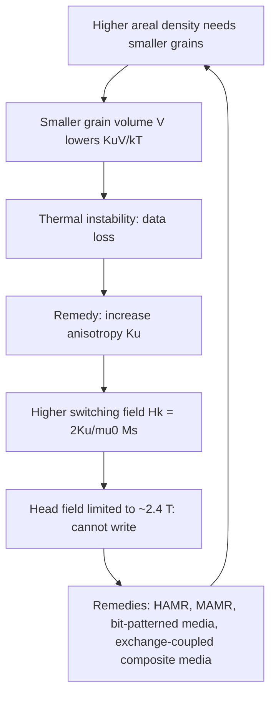

## Magnetic Recording Materials

### Overview

Magnetic recording stores information as patterns of remanent magnetization in a medium, written by a transducer (head) that generates a localized field and read back by sensing the stray flux from magnetized regions (or, in modern drives, by measuring resistance changes in a magnetoresistive sensor). The materials involved span the full spectrum of magnetic behavior: **semi-hard** media that hold a stable magnetization yet remain writable, **soft** materials in write poles and shields that concentrate flux, **magnetoresistive multilayers** in read sensors, and **thin-film underlayers and overcoats** that control microstructure and protect the surface.

**Key Points**

- A recording medium must satisfy three competing requirements, the **magnetic recording trilemma**: high signal-to-noise ratio (SNR, favoring small, weakly coupled grains), thermal stability (favoring large $K_u V$), and writability (limited by the maximum head field, favoring low coercivity).
- Thermal stability requires $K_u V / k_B T \gtrsim 60$ for roughly 10-year data retention, which sets the lower limit on grain volume for a given anisotropy.
- Progress in areal density has come from successive material and architecture changes: particulate media, thin-film longitudinal media, perpendicular magnetic recording (PMR) with granular CoCrPt-oxide, and now heat-assisted (HAMR) and microwave-assisted (MAMR) recording with higher-anisotropy alloys such as $L1_0$ FePt.
- Read heads evolved from inductive to anisotropic magnetoresistance (AMR), giant magnetoresistance (GMR), and tunneling magnetoresistance (TMR) sensors, each defined by specific ferromagnetic and barrier materials.
- Magnetic tape remains the leading archival medium, with barium ferrite and metal particle formulations, while hard disk drives (HDD) dominate bulk online storage.

### Fundamentals of Magnetic Recording

#### Write and Read Process

```mermaid
flowchart LR
    A[Digital data] --> B[Write current in head coil]
    B --> C[Write pole generates localized field]
    C --> D[Medium grains switch magnetization]
    D --> E[Remanent bit pattern stored]
    E --> F[Stray flux at bit transitions]
    F --> G[Read sensor: GMR or TMR resistance change]
    G --> H[Signal processing and decoding]
    H --> I[Recovered data]
```

Information is encoded in **transitions** between oppositely magnetized regions. Each transition produces a peak in the readback signal. The bit length is set by the linear density (bits per inch, BPI), and the track width by the track density (tracks per inch, TPI); the **areal density** is their product:

$$\text{AD} = \text{BPI} \times \text{TPI}$$

#### Medium Requirements

| Property | Requirement | Reason |
| --- | --- | --- |
| Coercivity $H_c$ | High enough for stability, low enough to be written by the head | Thermal stability vs writability |
| Remanence-thickness product $M_r t$ | Sets signal amplitude; tuned with head/sensor | Readback signal |
| Squareness $S = M_r/M_s$ | Close to 1 | Sharp transitions |
| Switching field distribution (SFD) | Narrow | Sharp transitions, low jitter |
| Grain size and distribution | Small, uniform (median ~6-8 nm in modern PMR) | SNR, transition noise |
| Intergranular exchange coupling | Low (physically isolated grains) | Avoids correlated (cluster) noise |
| Anisotropy $K_u$ | High for small grains | Thermal stability |
| Orientation (c-axis) | Tightly aligned (perpendicular in PMR) | Uniform switching, high remanence |
| Surface | Smooth (Ra < 0.3 nm), corrosion resistant, low friction | Low head-medium spacing (about 1-2 nm flying height in HDDs) |

#### Signal-to-Noise Ratio Scaling

For a medium with independent grains, the SNR scales approximately with the number of grains per bit $N$:

$$\text{SNR} \propto N = \frac{\text{bit area}}{\text{grain area}}$$

A commonly used rule of thumb is that about 50-100 grains per bit are required for acceptable SNR (with modern systems using advanced signal processing to operate at lower effective grain counts, [Inference] via two-dimensional magnetic recording (TDMR) and iterative decoding). Reducing grain diameter $D$ increases $N$ but reduces the energy barrier.

#### Thermal Stability and the Superparamagnetic Limit

The energy barrier for reversal of a single-domain grain with uniaxial anisotropy is $\Delta E = K_u V$ (in zero field, the Stoner-Wohlfarth case). The relaxation (Néel-Arrhenius) time:

$$\tau = \tau_0\exp\left(\frac{K_u V}{k_B T}\right), \qquad \tau_0 \sim 10^{-9}\text{ to }10^{-11}\text{ s}$$

The **stability ratio** must satisfy:

$$\frac{K_u V}{k_B T} \gtrsim 40\text{ to }70$$

for lifetime of about 10 years with acceptable error rates (the chosen threshold depends on grain-size distribution and system tolerance; 60 is commonly cited). With a demagnetizing-field or exchange-coupling correction, the energy barrier under an effective field $H$ is often written:

$$\Delta E = K_u V\left(1 - \frac{H}{H_K}\right)^{n}, \qquad n \approx 2\ (\text{Stoner-Wohlfarth, field along easy axis: } n=2)$$

**Coercivity time dependence** (Sharrock relation), important because write times are nanoseconds:

$$H_c(t) = H_0\left\{1 - \left[\frac{k_B T}{K_u V}\ln\left(\frac{f_0 t}{\ln 2}\right)\right]^{1/n}\right\}$$

where $f_0 \sim 10^{9}$-$10^{10}$ Hz is the attempt frequency and $t$ the field application time; coercivity measured at ns timescales is significantly larger than static coercivity.

#### The Recording Trilemma

The maximum write-pole saturation magnetization of practical soft materials (FeCo alloys, $\mu_0 M_s \approx 2.4$ T) limits the deep-gap write field to roughly 1.5-2 T for perpendicular heads, restricting the usable medium coercivity to about 0.5-0.6 T (5-6 kOe) at ns timescales with conventional CoCrPt alloys.

### Historical Evolution of Recording Media

| Era | Medium | Materials | Recording mode | Approx. areal density |
| --- | --- | --- | --- | --- |
| 1950s | Early drums/disks | $\gamma$-Fe$_2$O$_3$ particles in binder | Longitudinal | ~2 kb/in² (IBM RAMAC) |
| 1970s-1980s | Particulate disks | $\gamma$-Fe$_2$O$_3$, Co-$\gamma$-Fe$_2$O$_3$ | Longitudinal | up to ~10-100 Mb/in² |
| 1980s-2000s | Thin-film longitudinal media | CoCrTa, CoCrPt, CoCrPtB on Cr or CrMo underlayers | Longitudinal | Up to ~100 Gb/in² |
| 2005-present | Granular perpendicular media (PMR) | CoCrPt-SiO$_2$/TiO$_2$ on Ru intermediate layer, soft underlayer (SUL) | Perpendicular | ~0.5-1.5 Tb/in² (product) |
| 2020s | Energy-assisted (HAMR) | FePt-C granular ($L1_0$) with heat sink | Perpendicular, thermally assisted | Products ~1.5-2+ Tb/in² and roadmaps to 4-10 Tb/in² |
| Research | Bit-patterned media (BPM), TDMR, MAMR | Patterned CoPt or FePt, spin-torque oscillators | Various | Demonstrated at lab scale |

Numbers are approximate and vary by generation and source.

### Particulate Media

#### Structure

Fine magnetic particles are dispersed in an organic polymer binder (polyurethane, PVC copolymer) with lubricant, dispersants, abrasives (Al$_2$O$_3$ or Cr$_2$O$_3$), and carbon black for conductivity, coated onto a polymer substrate (PET, PEN, aramid) for tape or floppy disks. Particles are oriented by a magnetic field during drying (longitudinal orientation for tape, longitudinal or random for older disks, perpendicular orientation for barium ferrite).

#### Particle Types

| Particle | Composition | Shape | Properties | Use |
| --- | --- | --- | --- | --- |
| Gamma iron oxide | $\gamma$-Fe$_2$O$_3$ (maghemite) | Acicular (needle-like), ~0.5 $\mu$m x 0.08 $\mu$m | $H_c \approx 25$-$30$ kA/m, $M_s \approx 75$ Am²/kg | Audio and video tape, early disks |
| Cobalt-modified $\gamma$-Fe$_2$O$_3$ | Co-$\gamma$-Fe$_2$O$_3$ (Co-doped or Co surface-treated) | Acicular | $H_c \approx 50$-$80$ kA/m | Video, data tape |
| Chromium dioxide | CrO$_2$ | Acicular | $H_c \approx 40$-$50$ kA/m, low Curie temperature (~390 K) enabling thermomagnetic duplication | Audio (Type II), early data |
| Metal particle (MP) | Fe (with Co, Ni, Al, Y) with oxide passivation shell | Acicular, ~100 nm long | $H_c \approx 130$-$200$ kA/m, $M_s \approx 130$-$150$ Am²/kg | LTO, DLT/SDLT, Hi8 |
| Barium ferrite (BaFe) | BaFe$_{12-2x}$(Co,Ti)$_x$O$_{19}$ | Hexagonal platelets, 20-50 nm | Perpendicular orientation, $H_c \approx 200$-$300$ kA/m, chemically stable | High-density tape (LTO-8 and later, IBM/Fujifilm) |
| Strontium ferrite (SrFe) | SrFe$_{12}$O$_{19}$ | Platelets | Similar to BaFe | Research and Fujifilm tape |

#### Shape Anisotropy in Acicular Particles

For a single-domain, prolate ellipsoid, the shape anisotropy constant is:

$$K_{shape} = \frac{1}{2}\mu_0 M_s^2 (N_\perp - N_\parallel)$$

where $N_\parallel$ and $N_\perp$ are the demagnetizing factors along and perpendicular to the long axis. For a needle of high aspect ratio $N_\parallel \to 0$, $N_\perp \to 1/2$, giving $K_{shape} \to \frac{1}{4}\mu_0 M_s^2$. For Fe with $M_s = 1.7\times10^6$ A/m, this is about $9\times10^5$ J/m³, so very high coercivity is achieved without relying on crystalline anisotropy. The coercivity is:

$$H_c \approx \frac{2 K_{shape}}{\mu_0 M_s} \cdot f = \frac{(N_\perp - N_\parallel) M_s}{1}\cdot f$$

with $f < 1$ reflecting non-coherent reversal modes (fanning, curling) and imperfections (Brown's paradox).

#### Tape Design Metrics

- **Areal density potential:** For tape, the small particle volume (barium ferrite ~1,500-2,000 nm³) and thin coating enable up to about 200 Gb/in² demonstrated (IBM/Fujifilm sputtered tape demonstration above 300 Gb/in²; lab records vary).
- **Signal and noise:** SNR determined by particle number, dispersion quality, and orientation.
- **Durability and archival life:** Barium ferrite is fully oxidized, so archival stability is superior to metal particle; binders must resist hydrolysis (a cause of "sticky-shed syndrome" in older polyester-urethane tapes).

### Thin-Film Longitudinal Media

#### Layer Structure

A typical longitudinal HDD disk cross-section (from substrate up):

| Layer | Material | Thickness | Function |
| --- | --- | --- | --- |
| Substrate | Al-Mg alloy with electroless NiP plating, or glass/glass-ceramic | ~0.635-1.27 mm | Rigid support, polished surface |
| Seed layer | NiAl or CrTi | ~10-30 nm | Controls Cr texture |
| Underlayer | Cr or CrMo, CrTi (bcc) | ~10-30 nm | Induces (11$\bar{2}$0) texture of hcp CoCrPt with in-plane $c$-axis |
| Intermediate layer | CoCr or CoCrTa | ~1-5 nm | Lattice match, improves epitaxy |
| Magnetic layer | CoCrPtB or CoCrPtTa (hcp) | ~10-20 nm | Recording layer |
| Overcoat | Amorphous hydrogenated or nitrogenated carbon (a-C:H, a-C:N) | ~2-5 nm | Wear and corrosion protection |
| Lubricant | Perfluoropolyether (PFPE, e.g., Zdol, Ztetraol) | ~1-2 nm | Reduces friction, protects overcoat |

#### Microstructure Engineering

- **Cr segregation:** Cr diffuses to grain boundaries during deposition at elevated substrate temperatures (~200-250 °C), forming nonmagnetic Cr-rich boundaries that reduce intergranular exchange coupling. This is the key mechanism enabling low-noise longitudinal media.
- **Pt** raises $K_u$; **B** and **Ta** refine grain size and enhance segregation.
- **Antiferromagnetically coupled (AFC) media:** A pair of magnetic layers separated by an ultrathin Ru spacer (~0.6-0.8 nm, first antiferromagnetic coupling peak of the oscillatory RKKY interaction) reduces the effective $M_r t$ while maintaining large grain volume, improving thermal stability. Introduced around 2001 (IBM "Pixie Dust").

The RKKY exchange coupling energy oscillates with spacer thickness $t_s$:

$$J(t_s) \propto \frac{\cos(2k_F t_s + \phi)}{t_s^{2}} \quad (\text{for a 3D-like spacer; approximate})$$

so Ru thickness must be controlled to sub-angstrom precision.

The longitudinal recording limit was reached near ~100-200 Gb/in² because the demagnetizing fields at high density become strong in longitudinal mode, and $H_c$ could not be raised further with the head-field limits of that era. This led to the industry transition to PMR.

### Perpendicular Magnetic Recording (PMR) Media

#### Concept and Advantages

In PMR the magnetization is normal to the disk plane. Adjacent bits along the track are oriented head-to-tail such that the magnetization directions are stabilized by neighboring bits (rather than opposed), and the medium can be much thicker relative to bit length (allowing larger grain volume at the same bit size). A **soft underlayer (SUL)** beneath the recording layer provides a return path for flux from the single-pole write head, effectively doubling the write field (through image effects) and improving write field gradient.

#### PMR Disk Layer Stack

| Layer | Material | Thickness (approx.) | Function |
| --- | --- | --- | --- |
| Substrate | Glass or Al-Mg with NiP | ~0.635 mm | Support |
| Adhesion layer | Ti or CrTi | ~5-10 nm | Adhesion |
| **Soft underlayer (SUL)** | Amorphous CoTaZr, CoFeTaZr, or FeCoB; often antiferromagnetically coupled via Ru (AFC-SUL) | ~20-100 nm | Flux return path, stabilizes domain-wall structures and suppresses noise |
| Seed layer | NiW, NiFeCr, or Ta | ~2-10 nm | Crystallographic (fcc (111)) texture |
| **Interlayer (intermediate layer)** | Ru (hcp) or Ru-based alloys (RuCr, Ru-oxide); often a two-step deposition (low-pressure, then high-pressure Ar) | ~10-20 nm | Epitaxial template for hcp Co-alloy $c$-axis perpendicular; provides physical grain separation through columnar, oxide-segregated structure |
| **Recording layer** | Granular CoCrPt-oxide (e.g., CoCrPt-SiO$_2$, CoCrPt-TiO$_2$, CoCrPt-Cr$_2$O$_3$), often with 2-3 sublayers (graded anisotropy: hard/soft) | ~10-15 nm total | Data storage; oxide grain boundaries isolate CoCrPt grains |
| **Capping layer** | CoCrPtB (continuous, low anisotropy) | ~5-8 nm | Provides controlled lateral exchange coupling, improves overwrite, reduces SFD, improves thermal stability |
| Overcoat | Diamond-like carbon (DLC) | ~2-3 nm | Wear, corrosion |
| Lubricant | PFPE | ~1 nm | Tribology |

#### Granular CoCrPt-Oxide Recording Layers

**Materials:**

- Hexagonal close-packed (hcp) Co-based alloy, $c$-axis (0001) perpendicular to the film plane, with typical composition Co$_{60-70}$Cr$_{5-15}$Pt$_{15-25}$ (at.%).
- Pt increases $K_u$: $K_u$ of CoCrPt at ~20 at.% Pt is roughly $(2$-$4)\times10^5$ J/m³ (values vary widely with Cr content and structure).
- Oxide (SiO$_2$, TiO$_2$, Ta$_2$O$_5$, CoO, Cr$_2$O$_3$, B$_2$O$_3$) at ~8-15 mol% segregates to grain boundaries during sputtering, producing magnetically isolated columnar grains of about 6-9 nm diameter with 1-2 nm nonmagnetic oxide walls.
- Reactive sputtering in Ar + O$_2$ or use of oxide-containing composite targets are common deposition approaches.

**Key parameters:**

| Parameter | Typical value | Impact |
| --- | --- | --- |
| Grain diameter $D$ | 6-9 nm (median), $\sigma_D/D \approx 15$-$20\%$ | SNR, thermal stability |
| Anisotropy field $H_K$ | 1.0-1.5 T (10-15 kOe) | Determines maximum coercivity; must be writable by head |
| $\mu_0 M_s$ | 0.3-0.5 T (effective, reduced by oxide dilution) | Read signal, demagnetizing |
| Coercivity $H_c$ | 0.3-0.5 T | Write margin |
| $K_u V / k_B T$ | 60-80 | Data retention |
| Intergranular exchange | Low but nonzero, tuned via oxide fraction and capping layer | Balance of SFD vs noise |
| SFD | Narrower with tighter $K_u$ distribution | Transition jitter |

**Microstructural control:** Oxide-segregated columnar growth relies on Volmer-Weber island nucleation and phase separation during sputtering. The **Ru interlayer** at high Ar pressure develops a rough dome-shaped morphology, where Co-alloy nucleates on each Ru column and oxides fill the valleys. This transfers the column structure into the magnetic layer.

#### Soft Underlayer (SUL) Design

- Amorphous FeCoB, CoTaZr, or CoFeTaZr with $\mu_0 M_s \approx 1.0$-$1.6$ T and low coercivity.
- Antiferromagnetic coupling (AFC) via Ru spacer between two SUL sublayers suppresses stray-field-induced spike noise from domain walls in the SUL.
- Thickness sets flux-carrying capacity; limited by saturation under the write pole.
- Can cause "wide area track erasure" (WATE) by amplifying stray fields from the head, requiring optimized SUL design and head shields.

### Energy-Assisted Recording

To write high-anisotropy media that exceed the field capability of the write head, energy-assisted schemes temporarily lower the switching field.

#### Heat-Assisted Magnetic Recording (HAMR)

A near-field transducer (NFT, typically Au or Au alloy, sometimes with Rh or Pt for durability, integrated in the slider) focuses laser light (diode at ~800-900 nm) to a spot of ~30-50 nm, heating a small area of the medium to near or above the Curie temperature ($T_C \approx 400$-$450$ °C for FePt-based media) for less than about 1 ns, when the writing field defines the bit direction as the medium cools.

**Working principle:**

$$H_K(T) = H_K(0)\left(1 - \frac{T}{T_C}\right)^{\beta}, \qquad \beta \approx 0.5\text{-}1$$

At elevated temperature the anisotropy field drops below the head field, so writing is possible, while at storage temperature the high $K_u$ ensures thermal stability even for grains of ~3-5 nm.

**Medium requirements for HAMR:**

| Requirement | Target | Rationale |
| --- | --- | --- |
| High $K_u$ at RT | $\sim 5\times10^6$ J/m³ ($L1_0$ FePt: $K_u \approx 6.6\times10^6$ J/m³) | Permits stable grains ~3-5 nm |
| Curie temperature $T_C$ | ~ 430-500 K ... practical range near 700 K (FePt bulk $T_C \approx 750$ K); tuned via Cu or Ni doping to ~ 600-700 K | Lower $T_C$ reduces the required heating power and NFT thermal load |
| Narrow $T_C$ distribution | $\sigma_{T_C}/T_C \lesssim 2$-$3\%$ | Determines transition jitter (thermal gradient sensitivity) |
| Thermal conductivity design | Heat-sink layers (Cu, Ag, Ru, MgO/TiN) under the magnetic layer | Confine heat laterally, achieve fast cooling (thermal gradient $>$ 8-10 K/nm) |
| Granular structure | FePt grains in a carbon (C) matrix (also BN, SiO$_2$, Cr$_2$O$_3$-based) | Isolate grains, control size |
| Chemical order | $L1_0$ (fct, ordered) with $c$-axis perpendicular | High $K_u$ requires ordered phase; disordered fcc FePt is soft |
| Overcoat and lubricant | Thin, thermally stable DLC and PFPE variants | Survive repeated heating; reduce lubricant depletion and smearing on the NFT |

**$L1_0$ FePt structure:** Alternating (001) planes of Fe and Pt in a tetragonally distorted fcc lattice ($c/a \approx 0.96$). Deposition at ~ 400-700 °C (on MgO or on templated seed layers such as MgO(001), TiN, or CrRu), or post-annealing of as-deposited disordered films, drives chemical ordering. The order parameter $S$ (0 to 1) controls anisotropy:

$$K_u \propto S^{2}\ \text{(approximate scaling)}$$

**Key challenges:**

- Achieving high $L1_0$ order and perpendicular $c$-axis texture on glass substrates in a manufacturable process, compatible with the substrate glass transition (glass-ceramic substrates rated for ~ 700 °C are used).
- Grain size and distribution control (target $\sigma_D/D < 10$-$15\%$ or better), requiring segregants (C ~ 30-40 vol%) that promote isolated columnar grains.
- Reliability of the NFT (Au diffusion, optical absorption, thermal cycling) and of the head-disk interface at elevated temperatures.
- Laser heating causing lubricant degradation and carbon overcoat wear.
- Thermal gradient and $T_C$ distribution control to achieve low transition jitter. Approximate jitter behavior follows:

$$\sigma_{jitter} \approx \frac{\sigma_{T_C}}{(dT/dx)}\ \text{(dominant term; simplified)}$$

HAMR drives with capacities of about 30+ TB have been shipped by manufacturers (including Seagate's Mozaic 3+ platform announced with FePt-based media); consult current manufacturer specifications for present-day figures ([Unverified] regarding the exact production numbers and future roadmap capacities).

#### Microwave-Assisted Magnetic Recording (MAMR)

A spin-torque oscillator (STO) or field-generating layer in the write gap produces a high-frequency (typically 20-40 GHz) AC field circularly polarized near the medium's ferromagnetic resonance frequency, lowering the effective switching field through resonant excitation (precessional switching). Alternative naming: spin-torque-assisted or "flux-control" MAMR (FC-MAMR) in commercial drives, in which the STO reverses the effective field in the write gap.

**Materials:** The STO comprises a spin injection layer (e.g., CoFe or CoIr) and a field-generation layer (FGL, e.g., FeCo or FeCoNi alloys with high $M_s$), separated by a nonmagnetic spacer (Cu or Ag), with polarizing layers and precise current control. The medium remains CoCrPt-oxide-type or graded-anisotropy composites with higher $K_u$ than conventional PMR.

Both MAMR and HAMR aim to extend areal density beyond conventional PMR limits (~1-1.5 Tb/in²). Commercial implementations of MAMR have yielded more modest gains than HAMR ([Unverified] regarding long-term prospects).

### Exchange-Coupled Composite (ECC) Media and Graded Anisotropy

To reduce the required write field without sacrificing thermal stability, ECC media combine a **hard** layer (high $K_u$, thermal stability) with a **soft** layer (lower $K_u$, lowers the switching field) that are exchange-coupled.

For a hard/soft bilayer with coupling, the reversal is initiated in the soft layer by a modest field, and the exchange field drags the hard layer over a domain-wall-like path. The switching field is approximately:

$$H_{sw} \approx \frac{2 K_h t_h + 2 K_s t_s}{\mu_0 (M_h t_h + M_s t_s)}\cdot g(J_{ex})$$

where $g(J_{ex}) < 1$ decreases with coupling strength (this is a schematic form; exact formulas depend on the model, e.g., Victora-Shen ECC theory). Implementation includes **graded media** with continuously varying $K_u$ through the thickness, producing lower $H_{sw}$ with similar thermal stability. In commercial PMR, the granular layer commonly incorporates two or three sublayers of different oxide content and Pt concentration to realize graded anisotropy.

### Bit-Patterned Media (BPM)

Instead of a continuous granular film, the disk is lithographically patterned into isolated magnetic islands, each storing one bit in a single (or a few strongly coupled) grain volume. Because the island volume is much greater than a grain, thermal stability is retained at higher density. SNR is limited by island uniformity instead of grain count.

**Fabrication approaches:**

| Method | Description |
| --- | --- |
| Nanoimprint lithography (NIL) | Master template (from e-beam lithography plus block copolymer directed self-assembly) is used to stamp patterns in resist; pattern is transferred by ion milling or reactive-ion etching |
| Directed self-assembly (DSA) of block copolymers | Density multiplication of guiding patterns, pitches down to ~ 10-20 nm (bit densities of ~ 1-4 Tb/in² and beyond in demonstrations) |
| Ion irradiation (He$^+$, Ar$^+$, Kr$^+$) | Destroys magnetic order in unmasked regions, producing planar (flat) patterned media without etching |

**Key challenges:**

- Write synchronization (the write field must be timed to island positions).
- Pattern defects (missing or merged islands) and cost of manufacturing masters and imprint processes.
- Island switching-field distribution from size variations and edge damage.
- Combination with HAMR (HAMR-BPM) is a proposed route to ~ 10 Tb/in² ([Speculation] as a commercial route).

Estimated density of a BPM at pitch $p$ (square lattice): $\text{AD} = 1/p^2$; e.g., $p = 12.7$ nm gives about 4 Tb/in².

### Read Sensor Materials

#### Evolution of Read Sensors

| Generation | Effect | Key materials | Typical MR ratio | Period |
| --- | --- | --- | --- | --- |
| Inductive | Faraday induction | Ni-Fe (Permalloy) poles and coil | N/A | Until ~1990 |
| AMR | Anisotropic magnetoresistance | Ni$_{81}$Fe$_{19}$ (Permalloy) stripe | 2-3% | 1990-1997 |
| GMR (spin valve) | Giant magnetoresistance | Co/Cu/Co, NiFe/Cu, with IrMn or PtMn pinning | 8-15% | 1997-2004 |
| TMR (MTJ) | Tunneling magnetoresistance | CoFeB/MgO/CoFeB | 50-200% at RT (practical: ~ 100%) | 2004-present |
| TDMR / multi-sensor | Multiple sensors and 2D signal processing | Same as TMR |  | ~2015-present |

The magnetoresistance ratio is defined as:

$$\text{MR} = \frac{R_{AP} - R_P}{R_P}$$

where $R_{AP}$ and $R_P$ are the resistances in antiparallel and parallel magnetization configurations.

#### GMR Spin-Valve Structure

Typical stack (bottom-up): Ta or NiFeCr seed / free layer (CoFe/NiFe, ~ 3-6 nm) / Cu spacer (~ 2-3 nm) / pinned layer (CoFe) / antiferromagnetic pinning layer (PtMn, IrMn, or NiO) / cap (Ta). The pinned layer magnetization is fixed by **exchange bias** with the antiferromagnet, with exchange field $H_{ex}$ and blocking temperature $T_B$ as key parameters. The free layer rotates freely in response to the medium's stray field.

The GMR effect arises from spin-dependent scattering of conduction electrons (Mott two-current model): electrons with spin antiparallel to the magnetization scatter more strongly, so parallel alignment gives low resistance and antiparallel high resistance.

**Synthetic antiferromagnet (SAF) pinned layer:** Two ferromagnetic layers (CoFe) separated by a ~ 0.8 nm Ru spacer (antiferromagnetically coupled via RKKY) give near-zero net moment, reducing stray-field interaction with the free layer and improving thermal stability.

#### TMR Magnetic Tunnel Junction (MTJ)

Stack: seed/AFM (IrMn or PtMn)/SAF pinned layer (CoFe/Ru/CoFeB)/**MgO barrier** (~ 0.8-1.2 nm)/CoFeB free layer/cap.

- Crystalline (001)-textured MgO tunnel barriers with bcc (001) CoFeB electrodes give coherent tunneling, with strong preference for $\Delta_1$ Bloch states (predicted by Butler and Mathon/Zhang in 2001) and large TMR values.
- Julliere's model gives the TMR from spin polarizations $P_1$, $P_2$ of the electrodes:

$$\text{TMR} = \frac{R_{AP} - R_P}{R_P} = \frac{2P_1P_2}{1 - P_1P_2}$$

Coherent-tunneling effects in MgO junctions substantially exceed Julliere's simple prediction; the model is a qualitative guide only.

- The **resistance-area product (RA)** must be low (about 0.5-1 $\Omega\,\mu\text{m}^2$ for high-density recording) to maintain a suitable impedance for a sensor width of tens of nanometers; this requires MgO barriers of only ~ 3-4 atomic layers, challenging uniformity and breakdown reliability.
- Trade-off: as RA falls, MR ratio typically decreases; typical HDD TMR sensors operate at MR ratios ~ 100% or above with RA of a few $\Omega\,\mu\text{m}^2$.

#### Sensor Performance Requirements

| Parameter | Target | Note |
| --- | --- | --- |
| Shield-to-shield spacing (read gap) | ~ 20-30 nm (approaching 10-15 nm) | Determines linear resolution |
| Track width (read width) | ~ 30-50 nm (sub-30 nm for TDMR/HAMR products) | Determines TPI |
| Noise | Low magnetic white noise, low 1/f and telegraph noise | SNR budget |
| Free layer design | Low magnetostriction, controlled thickness (2-5 nm), hard-bias or side-shield stabilization | Stability and linear response |
| Hard-bias magnets | CoCrPt or CoPt alloys (or antiferromagnetic side-pinning schemes) | Domain stabilization of the free layer |
| Thermal budget | Sensor must survive anneal (~ 250-300 °C, 5 kOe field anneal for PtMn ordering) | Sets pinning stability |

**Scissor and spin-torque sensors:** Alternatives such as **scissor-type** sensors (two free layers coupled antiparallel, bias by hard magnets behind) allow reduced shield-to-shield spacing because there is no pinned layer/AFM stack. Spin-torque oscillator read heads (STO sensors) are research concepts that detect field via frequency shifts.

### Write Head Materials

| Component | Material | Purpose |
| --- | --- | --- |
| Main pole (write pole) | CoFe or FeCo alloys, $\mu_0 M_s = 2.2$-$2.4$ T (Fe-Co-based, e.g., Co$_{35}$Fe$_{65}$), often laminated with thin nonmagnetic (Ru, NiCr) or Ni-Fe interlayers to control domain structure | Concentrate flux; highest possible $B_s$ |
| Return pole and shields | NiFe (Permalloy), CoNiFe, or CoFeB-based soft films | Complete magnetic circuit; shield the sensor from adjacent tracks and transitions |
| Trailing shield and side shields | NiFe (typically $\mu_0 M_s \approx 1$ T) with tuned magnetostriction | Field gradient sharpening, reduction of adjacent-track erasure |
| Coils | Cu (electroplated) | Generate write field |
| Insulation and gap | Alumina (Al$_2$O$_3$), SiO$_2$, Ru gaps | Electrical isolation, define gap |
| Pole tip overcoat | DLC and Si-based adhesion layers | Protection at head-disk interface |
| Heater and thermal flying-height control | NiCr or W resistive elements | Thermal protrusion to control spacing (dynamic flying height, DFH) |

Electroplated CoNiFe and CoFe alloys are used for pole layers, adapting compositions to balance $M_s$, low coercivity, low magnetostriction ($|\lambda_s| < 10^{-6}$), corrosion resistance, and process compatibility.

**Head-medium interface:** Flying height (spacing between the head pole/sensor and the magnetic layer surface) is now around 1 nm or below (with overcoat and lubricant included in "magnetic spacing" of ~ 5-8 nm). The Wallace spacing loss relates signal amplitude to spacing $d$:

$$\text{Loss (dB)} = 54.6\,\frac{d}{\lambda}$$

where $\lambda$ is the recorded wavelength. To resolve a wavelength of ~ 30 nm (about 15 nm bit length), a spacing of a few nm is required to limit the loss to a manageable amount.

### Tape Recording Materials in Detail

#### Modern Data Tape

| Format | Medium | Track/bit features | Native capacity (approx.) | Notes |
| --- | --- | --- | --- | --- |
| LTO-7 | Barium ferrite (BaFe) |  | 6 TB | 2015 |
| LTO-8 | BaFe |  | 12 TB | 2017 |
| LTO-9 | BaFe |  | 18 TB | 2021 |
| IBM TS1160 (Jaguar 6) | BaFe |  | 20 TB |  |
| Sony sputtered tape demonstration | Sputtered Co-Pt-Cr-based (CoPtCr-SiO$_2$) with Ru and $\text{NiFeCr}$-type underlayers on PEN/PA substrate |  | > 185 TB uncompressed demonstrated (lab) | 2014-2020 lab demos |
| IBM/Fujifilm demonstrations | Strontium ferrite (SrFe), > 580 TB (lab demonstration) |  |  | 2020 |

Capacities are approximate and subject to updates by consortium roadmaps.

**Tape structure:** Magnetic layer (~ 40-80 nm for particulate BaFe), nonmagnetic underlayer (~ 500-1000 nm of iron oxide powder in binder), polymer substrate (PEN or aramid, ~ 4-5 $\mu$m), and backcoat (carbon black in binder).

**Materials challenges for tape:**

- Uniform dispersion of nanoparticles (~ 15-25 nm) in a thin magnetic layer while maintaining perpendicular orientation.
- Servo track writing (timing-based servo patterns) and lateral dimensional stability of the substrate (thermal, humidity, and tension expansion coefficients).
- Low friction, minimum head wear, and debris control.
- Long archival life (> 30 years) requiring chemical stability of the magnetic particles and binder.

### Other Recording Materials and Modes

#### Magneto-Optical (MO) Recording

Rare-earth transition-metal (RE-TM) amorphous ferrimagnetic alloys such as **TbFeCo** and GdTbFe: perpendicular anisotropy, a **compensation temperature** $T_{comp}$ near room temperature (giving high coercivity at RT and very low net magnetization), and a Curie temperature ($T_C \approx 150$-$250$ °C) accessible by a focused laser spot. Write: laser heating to near $T_C$ plus a bias field (Curie-point writing). Read: polar Kerr effect. MO discs (MiniDisc, 5.25-inch MO cartridges) are largely obsolete in the consumer market, though the principle is the ancestor of HAMR.

#### Magnetic Random Access Memory (MRAM)

Uses MTJ stacks (CoFeB/MgO/CoFeB) as storage elements, with switching by spin-transfer torque (STT) or spin-orbit torque (SOT). It is technically a solid-state memory but shares materials science with recording sensors (perpendicular magnetic anisotropy at CoFeB/MgO interfaces, interface anisotropy $K_i$, thermal stability factor $\Delta = E_b/k_B T \gtrsim 60$ for retention).

#### Racetrack and Domain-Wall Memory (research)

Concept of storing bits as domain walls in nanowires and moving them by current-driven spin-transfer or spin-orbit torque; relevant materials include Pt/Co/AlO$_x$ and synthetic antiferromagnets. Commercial status: research stage.

#### Magnetic Cards, Stripes, and Security Media

Ferrite-based ($\gamma$-Fe$_2$O$_3$, BaFe) and metal particle stripes, with coercivity classes LoCo (~ 300 Oe, 24 kA/m) and HiCo (~ 2750-4000 Oe, 220-320 kA/m) for credit cards and identification cards.

### Overcoats, Lubricants, and Tribology

| Layer | Material | Key issues |
| --- | --- | --- |
| Overcoat (HDD) | Diamond-like carbon (DLC), sputtered or CVD/FCVA (filtered cathodic vacuum arc), ~ 1-3 nm | High $sp^3$ fraction (~ 40-70%) for hardness; pinhole-free at thickness < 2 nm; hydrogenated/nitrogenated variants for corrosion resistance; thickness contributes directly to magnetic spacing |
| Lubricant (HDD) | PFPE (Zdol, Ztetraol, A20H), ~ 1 nm, with bonded and mobile fractions | Low vapor pressure, thermal stability (crucial for HAMR), mobility, pick-up prevention |
| Overcoat (HAMR) | Thermally stable carbon variants; alternative approaches with thin SiN$_x$ or graphene-like layers under study | Thermal degradation under laser heating |
| Tape lubricants and binders | Fatty acid esters, polyurethane binders, abrasives (alumina, ~ 0.2 $\mu$m) | Head cleaning, wear control, hydrolytic stability |

Corrosion resistance is critical because Co-based alloys and grain-boundary oxides can corrode via pinholes in the overcoat, generating Co ions and surface debris; Cr and Pt additions and overcoat quality mitigate this.

### Worked Examples

#### Example 1: Thermal Stability of a PMR Grain

**Given:** A CoCrPt-oxide grain with diameter $D = 7$ nm and magnetic layer thickness $t = 12$ nm (cylindrical), uniaxial anisotropy $K_u = 3.5\times10^5$ J/m³ at 300 K.

**Solution:** Volume:

$$V = \pi\left(\frac{D}{2}\right)^2 t = \pi(3.5\times10^{-9})^2(12\times10^{-9}) = \pi(1.225\times10^{-17})(1.2\times10^{-8}) \approx 4.62\times10^{-25}\ \text{m}^3$$

Energy barrier and stability ratio:

$$K_u V = (3.5\times10^{5})(4.62\times10^{-25}) = 1.62\times10^{-19}\ \text{J}$$

$$\frac{K_u V}{k_B T} = \frac{1.62\times10^{-19}}{(1.381\times10^{-23})(300)} = \frac{1.62\times10^{-19}}{4.14\times10^{-21}} \approx 39$$

**Result:** The stability ratio of about 39 is below the target of about 60, indicating that this grain would be unacceptably unstable for long-term storage (relaxation time $\tau = 10^{-10}\exp(39) \approx 10^{7}$ s, roughly 4 months, using $\tau_0 = 10^{-10}$ s). To reach $K_u V/k_BT = 60$ at the same grain size, $K_u$ would need to rise to about $5.4\times10^5$ J/m³ (a ~ 54% increase), or the layer thickness to about 18.5 nm, which then adds demagnetizing and writing challenges. This illustrates the pressure toward higher-anisotropy materials.

#### Example 2: Anisotropy Field and Writability

**Given:** $L1_0$ FePt with $K_u = 6.6\times10^6$ J/m³ and $\mu_0 M_s = 1.43$ T ($M_s = 1.14\times10^6$ A/m).

**Solution:**

$$\mu_0 H_K = \frac{2K_u}{M_s} = \frac{2(6.6\times10^6)}{1.14\times10^6} \approx 11.6\ \text{T}$$

**Result:** The anisotropy field is ~ 11.6 T, vastly larger than the ~ 1.5-2 T available from a write pole. Conventional writing is therefore impossible at room temperature; heating close to the Curie temperature (where $H_K \to 0$) is required. The very high $K_u$ nevertheless allows stable grains as small as:

$$V_{min} = \frac{60\,k_B T}{K_u} = \frac{60(4.14\times10^{-21})}{6.6\times10^{6}} = 3.8\times10^{-26}\ \text{m}^3$$

Assuming a cylinder height 10 nm: $D = 2\sqrt{V/(\pi h)} = 2\sqrt{3.8\times10^{-26}/(\pi\times10^{-8})} \approx 2.2$ nm, showing that grains of ~ 2-4 nm can in principle be thermally stable.

#### Example 3: Areal Density of a Patterned Medium

**Given:** Bit-patterned medium with island pitch $p = 15$ nm along the track and 15 nm across tracks (square lattice).

**Solution:** Bits per unit area:

$$\text{AD} = \frac{1}{p^2} = \frac{1}{(15\times10^{-9})^2} = 4.44\times10^{15}\ \text{bits/m}^2$$

Convert to bits per square inch (1 in² = $6.452\times10^{-4}$ m²):

$$\text{AD} = 4.44\times10^{15}\times6.452\times10^{-4} \approx 2.87\times10^{12}\ \text{bits/in}^2 \approx 2.9\ \text{Tb/in}^2$$

**Result:** About 2.9 Tb/in², roughly two to three times the density of conventional PMR products. The island volume for a 10-nm diameter, 10-nm tall island ($V \approx 7.9\times10^{-25}$ m³) permits a much lower $K_u$ than granular media of equivalent density, easing the write-field limitation.

#### Example 4: Wallace Spacing Loss

**Given:** A recorded bit length of 20 nm, so wavelength $\lambda = 40$ nm (two bit lengths per cycle for a maximum-density pattern). Magnetic spacing (head pole/sensor to the top of the recording layer's center) increases from $d = 6$ nm to $d = 8$ nm.

**Solution:**

$$\text{Loss}(d) = 54.6\,\frac{d}{\lambda}\ \text{dB}$$

$$\text{Loss}(6\,\text{nm}) = 54.6\times\frac{6}{40} = 8.19\ \text{dB}, \qquad \text{Loss}(8\,\text{nm}) = 54.6\times\frac{8}{40} = 10.92\ \text{dB}$$

**Result:** The additional 2 nm of spacing costs about 2.7 dB of signal at this density, a sizable fraction of the SNR budget. This is why overcoat and lubricant thicknesses are reduced to ~ 1-2 nm each, and why the head-disk interface is engineered to sub-nanometer clearance (using thermal flying height control).

#### Example 5: TMR Ratio from Electrode Spin Polarization (Julliere)

**Given:** CoFe electrodes with spin polarization $P = 0.5$ on both sides of an amorphous Al$_2$O$_3$ barrier.

**Solution:**

$$\text{TMR} = \frac{2P_1P_2}{1 - P_1P_2} = \frac{2(0.5)(0.5)}{1 - 0.25} = \frac{0.5}{0.75} \approx 0.67 = 67\%$$

**Result:** Julliere predicts about 67%, approximately in line with the ~ 50-70% observed in optimized Al-O MTJs. Crystalline MgO barriers with CoFeB electrodes yield room-temperature TMR ratios of several hundred percent in research junctions (e.g., > 600% reported in CoFeB/MgO/CoFeB at RT), well above Julliere's estimate, because coherent, symmetry-selective tunneling adds filtering beyond simple polarization.

### Characterization Techniques

| Technique | Property measured |
| --- | --- |
| VSM, SQUID, alternating-gradient magnetometer | $M_s$, $H_c$, $M_r$, loop squareness, remanence curves ($\delta M$ plots for exchange coupling) |
| Torque magnetometry, ferromagnetic resonance (FMR) | $K_u$, anisotropy field, damping |
| Polar Kerr effect | Perpendicular magnetization loops of thin films |
| Anomalous Hall effect (AHE) | Perpendicular switching behavior in nanostructures |
| X-ray diffraction ($\theta$-$2\theta$, rocking curve $\Delta\theta_{50}$) | Crystal structure, texture, $c$-axis dispersion, $L1_0$ order parameter |
| TEM (plan-view and cross-section), HRTEM | Grain size and distribution, oxide segregation, intergranular gap |
| Magnetic force microscopy (MFM) | Bit patterns, transitions, domain structure |
| Spin-stand testing and read/write testers | Recording performance: SNR, bit error rate, overwrite, track-edge profile, adjacent-track interference |
| Microwave-assisted switching studies, pump-probe MOKE | Switching dynamics (ns to ps) |
| Time-dependent coercivity (Sharrock) | Thermal activation volume and energy barrier |
| X-ray magnetic circular dichroism (XMCD) | Element-specific moments, interface magnetism |
| Atomic force microscopy (AFM), X-ray reflectivity (XRR) | Roughness, thickness of overcoat and lubricant |
| Tribology testers (touch-down, glide) | Head-disk interface reliability, wear |

### Failure Modes and Reliability

- **Thermal decay (loss of signal amplitude with time):** monitored via time-dependent remanence; mitigated by high $K_u$, AFC, and ECC design.
- **Adjacent-track interference (ATI) and far-track interference (FTI):** repeated writing degrades neighboring tracks; addressed by shielded write heads and shingled magnetic recording (SMR) architecture trade-offs.
- **Corrosion and oxidation:** especially of Co-alloy grain boundaries at overcoat pinholes; controlled by overcoat, Cr and Pt content, and environmental control (sealed, helium-filled drives).
- **Head-disk interface failures:** particle contamination, lubricant transfer to the head, wear of the carbon overcoat, and thermal asperity in MR sensors.
- **Data retention in tape:** binder hydrolysis, particle oxidation (for metal particle), print-through (layer-to-layer magnetic coupling), and dimensional creep of the substrate.
- **HAMR-specific issues:** NFT degradation and Au diffusion, laser diode reliability, carbon overcoat and lubricant thermal degradation (mitigated by materials and process improvements; long-term reliability data are still accumulating).
- **Sensor degradation:** electromigration in narrow GMR/TMR sensors, TMR barrier breakdown, corrosion at the air-bearing surface (ABS), magnetic instability (popcorn or Barkhausen noise) of the free layer.

### Recording Modes and System-Level Techniques (Materials-Relevant)

- **Shingled magnetic recording (SMR):** Tracks are written overlapping like roof shingles, exploiting the wide write pole and narrow read sensor; requires media with good write-field gradient and sequential-write management.
- **Two-dimensional magnetic recording (TDMR):** Multiple read sensors and joint equalization allow decoding at lower SNR, permitting smaller grains ([Inference] gains in the range of a few tens of percent in areal density).
- **Dual-stage actuators and servo patterns:** Not materials, but define track pitch accuracy. Servo patterns written into the medium require tight control of transition quality and SFD.
- **Helium-filled drives:** Reduce turbulence and windage, enabling more platters; materials must be compatible with helium sealing and long-term stability.

### Emerging Directions

- **Higher-density HAMR** with FePt-based media approaching 4-10 Tb/in², lower-$T_C$ alloys (FePtCu, FePtAg-C), multilayer (dual-layer) HAMR media with tuned $T_C$ gradients, and alternative heat-sink materials.
- **Exchange-coupled and graded HAMR media** to relax the writing temperature and improve thermal gradient use.
- **Alternative high-$K_u$ materials:** CoPt $L1_0$, Co/Pt and Co/Pd multilayers, MnAl, FePd, and Co$_3$Pt, generally with lower $K_u$ or processing difficulties compared with FePt.
- **Heat-assisted BPM (HAMR-BPM)** and **microwave-assisted BPM**.
- **Two-photon and all-optical switching** in ferrimagnetic GdFeCo alloys (ultrafast ~ 100 fs to ps switching), a research direction toward ultrafast recording ([Speculation] regarding practical data storage use).
- **Spintronics-based read technologies:** spin-orbit torque and spin-Hall sensors, spin-torque-assisted read, and multi-sensor arrays for TDMR.
- **Tape roadmaps:** Sputtered perpendicular tape (CoPtCr-SiO$_2$) with $> 300$ Gb/in² demonstrations, and further SrFe and BaFe particle refinement to ~ 10-15 nm; roadmaps project native cartridge capacities exceeding 100 TB.
- **DNA, optical, and ceramic storage** are alternatives being investigated for archival use but do not use magnetic recording materials.
- **Sustainable materials and supply chain:** Reduced Pt and Ru usage, recycling of HDD magnets (Nd-Fe-B voice-coil motor magnets) and platinum-group metals from platters.

### Conclusion

Magnetic recording materials exist at the intersection of magnetism, thin-film physics, tribology, and information theory. The medium must reconcile thermal stability, SNR, and writability, a constraint that has driven the industry from acicular oxide particles to granular CoCrPt-oxide perpendicular films and now to high-anisotropy $L1_0$ FePt with thermal assistance. Read sensors have progressed via anisotropic to giant to tunneling magnetoresistance, exploiting spin-dependent transport in engineered multilayers, while write heads rely on the highest-$B_s$ soft magnetic alloys available (FeCo). Overcoats, lubricants, and head-disk interface engineering supply the final nanometer of reliability that makes flying heights of about 1 nm possible. Future gains hinge on continuing co-optimization of grain structure, anisotropy, heat and microwave assistance, patterned architectures, and signal processing.

**Related Topics**

- Superparamagnetism, thermal relaxation, and the Sharrock coercivity model
- Giant magnetoresistance (GMR) and tunneling magnetoresistance (TMR) physics
- Exchange bias, synthetic antiferromagnets, and RKKY coupling
- $L1_0$ ordered alloys and chemical ordering kinetics
- Spin-transfer torque, spin-orbit torque, and MRAM
- Magnetic nanoparticle synthesis (barium ferrite, metal particles)
- Tribology of the head-disk interface and DLC overcoats
- Magnetic domain and hysteresis fundamentals for thin films
- Soft magnetic alloys for write poles and shields
- Signal processing for TDMR and shingled recording