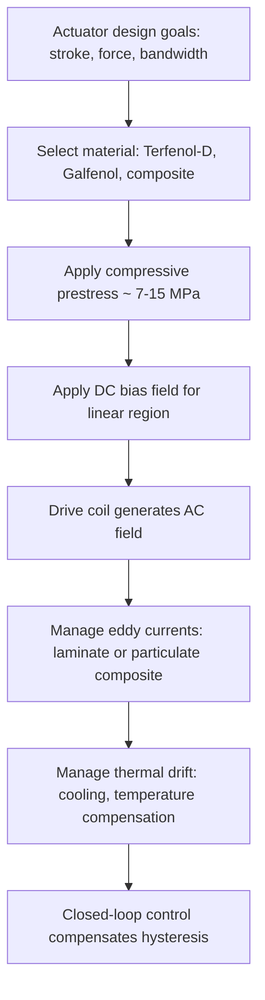
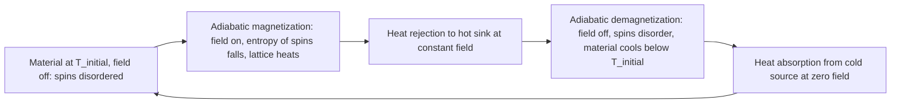

## Magnetostriction and Magnetocaloric Materials

### Overview

Magnetostriction and the magnetocaloric effect are two of the most technologically significant **magnetoelastic and magnetothermodynamic couplings** in magnetic materials. Both arise from the same underlying physics: the dependence of the magnetic free energy on lattice parameters (strain) and on temperature and entropy, respectively.

- **Magnetostriction** is the change in a material's dimensions when its magnetization changes. It converts magnetic energy into mechanical energy (actuators, sonar transducers) and, through the inverse (Villari) effect, mechanical energy into magnetic response (stress and torque sensors, energy harvesters).
- **The magnetocaloric effect (MCE)** is the reversible temperature change (adiabatic) or entropy change (isothermal) of a magnetic material when an applied magnetic field is changed. It is the basis of magnetic refrigeration and of sub-kelvin cooling by adiabatic demagnetization.

**Key Points**

- Magnetostriction is characterized by the saturation magnetostriction $\lambda_s = \Delta l / l$ at saturation, expressed in ppm ($10^{-6}$); values range from about $10^{-6}$ in soft magnets to $\sim 2 \times 10^{-3}$ in giant magnetostrictive Terfenol-D.
- Giant magnetostriction is obtained by combining large single-ion magnetoelastic coupling of rare-earth ions (Tb, Dy) with strong exchange from 3d transition metals (Fe), often engineered so that magnetocrystalline anisotropy nearly cancels.
- The MCE is quantified by the isothermal magnetic entropy change $\Delta S_M$, the adiabatic temperature change $\Delta T_{ad}$, and the refrigerant capacity (RC) or relative cooling power (RCP).
- Materials with a **first-order magnetic transition coupled to a structural or volumetric change** (Gd$_5$Si$_2$Ge$_2$, La(Fe,Si)$_{13}$-based, MnFeP(As,Si), Heusler alloys) show "giant" MCE near room temperature, but with hysteresis and cyclic-stability constraints.
- Gadolinium remains the benchmark second-order room-temperature magnetocaloric material; its $T_C$ is near 294 K.
- The two topics are linked thermodynamically through Maxwell relations, and in first-order materials, magnetoelastic (magnetostrictive) coupling and MCE are often manifestations of the same lattice-spin coupling.

### Part I: Magnetostriction

#### Physical Origin

Magnetostriction arises from the dependence of the magnetic energy on interatomic distances and crystal symmetry. Two categories are distinguished.

| Type | Description | Character |
| --- | --- | --- |
| **Spontaneous (exchange) magnetostriction** | Volume change accompanying the onset of magnetic order below $T_C$ (due to exchange energy depending on interatomic spacing). Isotropic. | Volume effect; large in Invar alloys (anomalous); appears as thermal-expansion anomaly at $T_C$ |
| **Anisotropic (Joule) magnetostriction** | Change of shape at constant volume when the magnetization direction rotates, due to spin-orbit coupling and crystal-field effects | Shape effect; dominant in technological materials |
| **Forced (volume) magnetostriction** | Volume change in high field, beyond technical saturation, from field-induced increase in spontaneous magnetization | Small; relevant near $T_C$ |

Additional effects:

- **Joule effect:** length change of a rod in an axial field, $\lambda = \Delta l/l$.
- **Villari (inverse) effect:** stress-induced change in magnetization or permeability.
- **Wiedemann effect:** twist of a rod carrying a current in an axial magnetic field (helical anisotropy); its inverse is the **Matteucci effect**.
- **$\Delta E$ effect:** field-dependent Young's modulus, the elastic modulus varies as domains rotate and walls move under stress.
- **Magnetovolume effect:** anomalous (sometimes negative) thermal expansion near $T_C$, exemplified by Invar (Fe$_{65}$Ni$_{35}$).

#### Phenomenological Description

##### Cubic Crystals

For a cubic crystal with direction cosines of magnetization $\alpha_i$ and of the length measurement direction $\beta_i$, the magnetostrictive strain is:

$$\lambda = \frac{3}{2}\lambda_{100}\left(\alpha_1^2\beta_1^2 + \alpha_2^2\beta_2^2 + \alpha_3^2\beta_3^2 - \frac{1}{3}\right) + 3\lambda_{111}\left(\alpha_1\alpha_2\beta_1\beta_2 + \alpha_2\alpha_3\beta_2\beta_3 + \alpha_3\alpha_1\beta_3\beta_1\right)$$

where $\lambda_{100}$ and $\lambda_{111}$ are the saturation magnetostriction constants along the $\langle 100 \rangle$ and $\langle 111 \rangle$ directions.

For a **polycrystal** with random texture, the average saturation magnetostriction (measured parallel to the field, relative to the demagnetized state) is:

$$\lambda_s = \frac{2}{5}\lambda_{100} + \frac{3}{5}\lambda_{111}$$

(This is the Akulov/Becker-Döring isostrain result, appropriate under uniform-strain assumptions; the isostress alternative gives slightly different weights.)

For an isotropic material where the magnetization makes angle $\theta$ with the measuring direction:

$$\lambda(\theta) = \frac{3}{2}\lambda_s\left(\cos^2\theta - \frac{1}{3}\right)$$

Sign convention: $\lambda > 0$ means elongation along the field direction (e.g., iron at low field, Terfenol-D); $\lambda < 0$ means contraction (e.g., nickel).

#### Magnetoelastic Energy and Coupling

The magnetoelastic energy density for a cubic crystal under strain components $e_{ij}$:

$$E_{me} = B_1\left(e_{xx}\alpha_1^2 + e_{yy}\alpha_2^2 + e_{zz}\alpha_3^2\right) + B_2\left(e_{xy}\alpha_1\alpha_2 + e_{yz}\alpha_2\alpha_3 + e_{zx}\alpha_3\alpha_1\right)$$

where $B_1$ and $B_2$ are the magnetoelastic coupling constants. Minimizing $E_{me} + E_{el}$ with respect to strain gives:

$$\lambda_{100} = -\frac{2}{3}\frac{B_1}{c_{11} - c_{12}}, \qquad \lambda_{111} = -\frac{1}{3}\frac{B_2}{c_{44}}$$

with $c_{ij}$ the elastic stiffness constants.

**Stress-induced anisotropy:** Under applied uniaxial stress $\sigma$, the magnetoelastic energy density for an isotropic material is:

$$E_\sigma = -\frac{3}{2}\lambda_s\sigma\cos^2\theta$$

where $\theta$ is the angle between magnetization and stress axis. For $\lambda_s\sigma > 0$, the easy axis lies along the stress axis. This effective anisotropy competes with magnetocrystalline anisotropy and underlies stress sensors, and it explains why stress and magnetostriction degrade the permeability of soft magnetic materials (e.g., $H_c \propto \lambda_s \sigma$ in Kersten's model).

#### Single-Ion Model for Rare-Earth Magnetostriction

The very large magnetostriction of rare-earth (4f) compounds is due to the aspherical 4f charge distribution and strong spin-orbit coupling. The single-ion magnetoelastic coupling is proportional to the Stevens factor $\alpha_J$ for the ion:

$$\lambda \propto \alpha_J\, \langle r_{4f}^2\rangle\, \langle O_2^0\rangle \, \frac{\partial A_2^0}{\partial e}$$

where $\langle r_{4f}^2 \rangle$ is the mean-square 4f radius, $O_2^0$ is a Stevens operator, and $A_2^0$ is the crystal-field parameter. Consequently:

| Rare-earth ion | Stevens $\alpha_J$ sign | Notes |
| --- | --- | --- |
| Tb$^{3+}$, Dy$^{3+}$, Ho$^{3+}$, Er$^{3+}$ | Sign varies ($\alpha_J$: Tb $-1.0\times10^{-2}$, Dy $-6.3\times10^{-3}$, Ho $-2.2\times10^{-3}$, Er $+2.5\times10^{-3}$, Sm $+4.1\times10^{-2}$) | Tb and Dy give large negative $\alpha_J$, hence large $\lambda_{111} > 0$ in RFe$_2$ (Laves phase) |
| Gd$^{3+}$ | 0 ($L=0$) | No orbital moment, negligible single-ion magnetostriction |
| Sm$^{3+}$ | Large positive | Gives negative $\lambda$ in SmFe$_2$ |

The 3d-4f exchange transmits rare-earth alignment to the Fe sublattice and provides a high $T_C$. Tb and Dy are heavy rare earths with opposite signs of the anisotropy constants $K_1$ in RFe$_2$, so mixed compositions (Tb$_{0.3}$Dy$_{0.7}$Fe$_2$) minimize $K_1$ near room temperature, lowering the field required to reach saturation strain (the key to Terfenol-D's design).

#### Material Classes

##### Conventional Magnetostrictive Metals and Alloys

| Material | $\lambda_s$ (ppm, approx.) | Notes |
| --- | --- | --- |
| Iron (polycrystal) | $-4$ to $-9$ at saturation (sign changes with field; $\lambda_{100} \approx +21$, $\lambda_{111} \approx -21$) | Complex field-dependent behavior |
| Nickel | $-35$ to $-40$ (contracts along field) | Classic magnetostrictive transducer material (sonar, ultrasonic cleaners), $T_C = 358$ °C |
| Cobalt (polycrystal) | $-60$ to $-50$ | Anisotropy makes behavior complex (hcp) |
| Permalloy 78.5 Ni-Fe | $\sim 0$ (by design) | Zero magnetostriction composition for soft magnetics |
| Fe-Si (3% Si) | $\sim +1$ to $+10$ | Low magnetostriction in GO steel reduces transformer noise |
| Fe-Co (Permendur, 50Co-50Fe) | $\sim +60$ to $+70$ | Moderate magnetostriction with high $B_s$ |
| Alfenol (Fe-Al, ~13-16% Al) | $\sim +40$ to $+90$ | Ductile, low cost, sensors |
| Galfenol (Fe$_{1-x}$Ga$_x$, $x \approx 0.17$-$0.19$) | $\sim +200$ to $+400$ (single crystal, $\lambda_{100}$; polycrystals lower) | Structural, machinable, low saturation field; discovered ~ 2000 (Clark et al.) |
| Ni-Zn, Co ferrites | $-25$ (NiFe$_2$O$_4$), $-200$ (CoFe$_2$O$_4$) | Ceramic; CoFe$_2$O$_4$ used in magnetoelectric composites |

##### Giant Magnetostrictive Materials

**Terfenol-D** (Tb$_{0.3}$Dy$_{0.7}$Fe$_{1.9-2.0}$; the name derives from Terbium, Iron, NOL (Naval Ordnance Laboratory), Dysprosium):

| Property | Approximate value |
| --- | --- |
| Crystal structure | Cubic Laves phase (C15, MgCu$_2$-type) |
| Saturation magnetostriction | $\sim 1500$-$2000\ \text{ppm}$ (room temperature, under compressive prestress ~ 7-10 MPa) |
| Curie temperature | ~ 380 °C (653 K) |
| Energy density | ~ 14-25 kJ/m³ |
| Elastic modulus | ~ 25-35 GPa (varies with field and stress: $\Delta E$ effect) |
| Density | ~ 9.2 g/cm³ |
| Coupling coefficient $k_{33}$ | 0.7-0.8 |
| Speed of sound | ~ 1700-2000 m/s |
| Easy axis | $\langle 111 \rangle$ (with $\langle 112 \rangle$ growth axis, twinned-dendritic crystals used commercially) |
| Limitations | Brittle, expensive (rare earths), low tensile strength, eddy-current losses (requires lamination or composites), temperature-dependent output |

Optimized by **compressive prestress** (aligns magnetic moments perpendicular to the rod axis in the zero-field state so that field-induced rotation of all domains toward the axis yields the maximum strain) and **bias field** (places the operating point in the linear region of the strain-vs-field curve).

**Other giant magnetostrictive compounds:**

| Material | Notes |
| --- | --- |
| TbFe$_2$ | $\lambda_{111} \approx 2.4\times10^{-3}$ at RT; very high anisotropy |
| SmFe$_2$ | Large negative magnetostriction ($\sim -2100$ ppm) |
| Tb-Dy-Zn alloys, Tb$_x$Dy$_{1-x}$Zn | Giant magnetostriction at low temperature |
| Fe-Ga-Tb, Fe-Ga-Al composites | Enhanced polycrystalline performance |
| Fe-Ga with $\langle 100 \rangle$ texture (through Goss-like textured rolling or directional solidification) | Attain $\sim 200$-$300$ ppm in polycrystals |
| Amorphous Fe-based (Metglas 2605SC) | $\lambda_s \approx +30$ ppm; used in magnetoelastic sensors (EAS tags) |
| Co-based amorphous | $\lambda_s \approx 0$; used where low magnetostriction is required |

##### Magnetic Shape-Memory Alloys (MSMAs)

Ferromagnetic martensitic alloys (Ni-Mn-Ga, Ni-Mn-Al, Ni-Fe-Ga, Co-Ni-Ga) exhibit **magnetic-field-induced strain (MFIS)** of up to about 6-12% by the motion of twin boundaries in the martensite (magnetically driven twin-variant reorientation), far exceeding conventional magnetostriction, but at lower frequencies (up to about kHz) and lower blocking stress (about 2-5 MPa). The mechanism is distinct from ordinary magnetostriction: it relies on high magnetocrystalline anisotropy $K_u$ exceeding the twinning stress:

$$K_u > \sigma_{tw}\,\varepsilon_0$$

where $\varepsilon_0 = 1 - c/a$ is the twinning shear strain and $\sigma_{tw}$ the twinning stress. The energy comparison ensures that the Zeeman energy difference between twin variants can drive twin-boundary motion.

##### Magnetostrictive Thin Films and Composites

- **Magnetostrictive/piezoelectric laminates and particulate composites** (Terfenol-D/PZT, Ni/PZT, CoFe$_2$O$_4$/BaTiO$_3$, Metglas/PVDF or Metglas/PZT) produce the **magnetoelectric (ME) effect** by strain transfer, with ME voltage coefficients $\alpha_{ME} = dE/dH$ of several V/(cm·Oe), and up to hundreds V/(cm·Oe) at electromechanical resonance. Applications: magnetic field sensors (pT sensitivity), energy harvesters, tunable microwave devices.
- **Terfenol-D/polymer composites** (particulate in epoxy) reduce eddy-current loss and brittleness; used at higher frequencies.
- **Thin-film magnetostrictive materials** (TbFe, TbDyFe, FeGaB, FeCoSiB, Fe-Ga) for MEMS actuators, surface acoustic wave (SAW) and bulk acoustic wave (BAW) devices, and spin-wave/acoustic wave coupling (magnetoelastic waves).

#### Measurement Methods

| Method | Description |
| --- | --- |
| Strain gauge | Bonded resistive foil gauges measure length change; simple and common, sensitive to ~ 1 ppm; corrections for gauge-factor changes and thermal drift required |
| Capacitance dilatometry | Sub-Å sensitivity; used at low temperature |
| Optical (laser Doppler, interferometry, optical fiber sensors) | Non-contact, high sensitivity |
| Small-angle magnetization rotation (SAMR) | Measures anisotropy field and magnetostriction constants in thin films |
| Cantilever (bending-beam) method | Thin-film magnetostriction from beam deflection under applied field; commonly used for films on silicon or glass |
| X-ray diffraction under field, neutron diffraction | Lattice-parameter change in field, separating constants $\lambda_{100}$, $\lambda_{111}$ in single crystals |
| Stress-induced anisotropy (Villari) tests | Reversed measurement, susceptibility versus applied stress |

Corrections are needed for (a) demagnetizing effects, (b) substrate clamping in thin films, (c) high-field paraprocess contributions.

#### Devices and Applications of Magnetostrictive Materials

| Category | Examples | Materials |
| --- | --- | --- |
| Sonar and underwater acoustic transducers | Tonpilz, flextensional projectors | Terfenol-D, nickel (historical) |
| Ultrasonic cleaning and machining (transducers, sonotrodes) | Nickel laminations, ferrites | Ni, Ni-Fe, Terfenol-D |
| Precision actuators | Micropositioning, active vibration control, fuel-injection valves, adaptive optics | Terfenol-D, Galfenol |
| Magnetostrictive linear position sensors (waveguide-based) | Industrial, tank level gauges: an interrogating current pulse and a permanent magnet's field generate a torsional (Wiedemann) wave in a Ni-Fe waveguide, and the time of flight measures position | Ni-based or Fe-Ni waveguide wire, Villari-effect pickup |
| Torque and force sensors | Non-contact automotive drive-shaft and steering torque sensing, based on Villari effect in shaft materials or a bonded magnetoelastic layer | Fe-Ni, Fe-Co, Ni-Fe-Cr alloys, amorphous ribbons |
| Energy harvesting | Vibration harvesters (Galfenol cantilevers with coil) | Galfenol, Terfenol-D, Metglas |
| Magnetoelastic sensors (chemical, biological) | Wireless resonant amorphous ribbons (Metglas) coated with a biochemical layer; resonant-frequency shifts with mass loading | Fe-Co-Si-B amorphous ribbons |
| EAS (electronic article surveillance) tags | Amorphous ribbon resonators at 58 kHz, activated and deactivated by bias magnet | Metglas 2826MB |
| Delay lines | Magnetostrictive acoustic delay lines (historical, memory) | Nickel, Ni-Fe |
| Magnetostrictive motors (inchworm) | Precision linear/rotary drives | Terfenol-D |
| Noise and vibration sources | **Transformer core hum** and motor magnetic noise result from magnetostriction of electrical steel at twice line frequency ($2f$, 100/120 Hz) and harmonics | Silicon steels; reduced by low-$\lambda_s$ steels, tensile coatings, domain refinement |

**Transformer noise mechanism:** Because $\lambda \propto \cos^2\theta$ (even in $B$), strain oscillates at $2f$ when the induction alternates at $f$. The overall acoustic power depends on $\lambda_s$ and its dependence on induction, with 3% Si steel showing minimum magnetostriction near $B \approx 1.5$-$1.7$ T in the rolling direction.

#### Design Considerations for Terfenol-D Actuators

Key design equations:

- **Free strain** (no load): $\varepsilon = \lambda(H, \sigma_0)$.
- **Blocked force**: $F_b = E^H A\,\varepsilon$, where $E^H$ is the Young's modulus at constant field and $A$ the cross-sectional area.
- **Coupling coefficient**: $k_{33}^2 = \dfrac{d_{33}^2 E^H}{\mu^\sigma}$, in the linear constitutive framework:

$$\varepsilon = s^H\sigma + d\,H, \qquad B = d^{*}\sigma + \mu^\sigma H$$

where $s^H$ is the compliance at constant field, $d$ is the magnetostrictive strain coefficient ($\partial\varepsilon/\partial H$ at constant stress), and $\mu^\sigma$ is the permeability at constant stress. These linear relations hold only in the small-signal regime; real materials are nonlinear and hysteretic.

- **Eddy-current skin depth** in Terfenol-D limits rod diameters at frequency $f$:

$$\delta = \sqrt{\frac{\rho}{\pi f \mu}}$$

with resistivity $\rho \approx 6 \times 10^{-7}\ \Omega\,$m, so rods are typically laminated or slotted for use above about 1-2 kHz.

### Part II: Magnetocaloric Effect and Materials

#### Thermodynamic Foundations

The magnetocaloric effect is the thermal response of a magnetic material to a change in applied field $H$, reflecting coupling between magnetic and lattice/electronic degrees of freedom. The total entropy is:

$$S(T, H) = S_{lat}(T) + S_{el}(T) + S_M(T, H)$$

- **Isothermal process:** Applying a field to a paramagnet orders spins, decreasing magnetic entropy ($\Delta S_M < 0$), and heat is released to the surroundings.
- **Adiabatic process:** Total entropy is conserved, so magnetic entropy reduction is compensated by an increase in lattice (and electronic) entropy, i.e., the material heats up ($\Delta T_{ad} > 0$ on magnetization). On adiabatic demagnetization, the material cools.

#### Maxwell Relation and Entropy Change

Starting from the Gibbs free energy $G(T, H)$ with $dG = -S\,dT - \mu_0 M\,dH$ (using $\mu_0 H$ as the field variable, per unit volume), the Maxwell relation is:

$$\left(\frac{\partial S}{\partial H}\right)_T = \mu_0\left(\frac{\partial M}{\partial T}\right)_H$$

Integrating gives the isothermal entropy change on changing the field from $H_1$ to $H_2$:

$$\Delta S_M(T, \Delta H) = \mu_0\int_{H_1}^{H_2}\left(\frac{\partial M}{\partial T}\right)_H dH$$

For a ferromagnet, $\partial M/\partial T < 0$ near and above $T_C$, so $\Delta S_M < 0$ for field increase, with the maximum magnitude near $T_C$. In practice $\Delta S_M$ is computed numerically from a set of isothermal $M(H)$ curves at temperature intervals $\delta T$:

$$\Delta S_M\left(\frac{T_i + T_{i+1}}{2}\right) \approx \frac{\mu_0}{T_{i+1} - T_i}\left[\int_0^{H}M(T_{i+1}, H')dH' - \int_0^{H}M(T_i, H')dH'\right]$$

**Caution on first-order materials:** Applying the Maxwell relation to isothermal $M(H)$ data across a first-order transition can produce spurious spikes in $\Delta S_M$ due to phase coexistence and inhomogeneity ("colossal MCE" artifacts). Proper measurement protocols (loop process, cycling to remove metastability, or direct calorimetry) are recommended. The Clausius-Clapeyron-based estimate for a first-order transition is:

$$\Delta S_M^{max} \approx \Delta M\,\frac{dH}{dT_{tr}}\,\mu_0 = \frac{\mu_0 \Delta M}{dT_{tr}/dH}$$

where $\Delta M$ is the magnetization jump and $dT_{tr}/dH$ the field-shift of the transition temperature.

#### Adiabatic Temperature Change

$$\Delta T_{ad}(T, \Delta H) = -\int_{H_1}^{H_2}\frac{T}{C_H(T, H)}\left(\frac{\partial M}{\partial T}\right)_H \mu_0\,dH$$

Here $C_H$ is the heat capacity at constant field. A large MCE therefore requires a large $|\partial M/\partial T|$ (sharp transition, high magnetic moment density) and a small heat capacity $C_H$ (high $T_C$ is favorable in principle but the lattice heat capacity grows with $T$). The relation implies that $\Delta T_{ad}$ and $\Delta S_M$ are tied through:

$$\Delta T_{ad} \approx -\frac{T}{C_H}\Delta S_M$$

for small changes (an approximation assuming $C_H$ is roughly constant over the interval).

The heat capacity in a field is measured directly and combined with entropy:

$$S(T, H) = \int_0^T\frac{C_H(T', H)}{T'}dT' + S_0(H)$$

allowing $\Delta T_{ad}$ to be derived from $S$-$T$ diagrams (the indirect route), while direct measurements use a thermocouple or thermometer on a thermally isolated sample in a pulsed or moving magnet.

#### Figures of Merit

| Quantity | Definition | Meaning |
| --- | --- | --- |
| $\Delta S_M$ (or $\lvert\Delta S_M^{peak}\rvert$) | Isothermal entropy change for field change $\Delta H$ | Cooling energy per cycle per unit mass or volume at a given $T$ |
| $\Delta T_{ad}$ | Adiabatic temperature change for $\Delta H$ | Temperature span capability per stage |
| **Refrigerant capacity (RC)** | $RC = \int_{T_{cold}}^{T_{hot}}\lvert\Delta S_M\rvert\,dT$ (over full width at half maximum, FWHM) or $RC = \lvert\Delta S_M^{peak}\rvert\,\delta T_{FWHM}$ | Heat transferable in an ideal cycle between hot and cold reservoirs |
| **Relative cooling power (RCP)** | $RCP = \lvert\Delta S_M^{peak}\rvert\times\delta T_{FWHM}$ | Common estimate of RC; ignores the actual reservoir temperature choice |
| Hysteresis loss | Area between heating and cooling isothermal $M$-$H$ or $\Delta T$ curves | Reduces the net cooling in first-order materials (subtracted from RC) |
| Effective heat capacity, thermal conductivity | Determines working frequency and heat-transfer performance | Power density |

Typical reference field changes: $\mu_0\Delta H = 1$, 1.5, 2, or 5 T. 1-2 T is relevant for permanent-magnet (Nd-Fe-B Halbach array) devices, while 5 T is used for comparing materials and for superconducting-magnet systems.

#### Classes of Magnetocaloric Materials

##### Rare Earths and Heavy Rare-Earth Metals

**Gadolinium (Gd):** the benchmark near room temperature.

| Property | Value (approx.) |
| --- | --- |
| $T_C$ | 294 K (21 °C) |
| Order | Second order (ferromagnetic-paramagnetic) |
| $\lvert\Delta S_M\rvert$ (0-2 T) | ~ 5 J/(kg K) |
| $\lvert\Delta S_M\rvert$ (0-5 T) | ~ 10 J/(kg K) |
| $\Delta T_{ad}$ (0-2 T) | ~ 5.5-6 K |
| $\Delta T_{ad}$ (0-5 T) | ~ 11-12 K |
| Advantages | Very low hysteresis, good thermal conductivity (~ 10 W/(m K)), reproducible |
| Drawbacks | Cost, oxidation and corrosion (in water-based heat-transfer fluids), limited to a narrow $T_C$ |

$T_C$ can be tuned by alloying: Gd-Tb, Gd-Er, Gd-Dy alloys shift $T_C$ down; Gd-Y and other combinations broaden the transition.

Second-order transitions follow a universal scaling relation for the field dependence of the peak entropy change:

$$\lvert\Delta S_M^{peak}\rvert \propto H^{n}, \qquad n = 1 + \frac{\beta - 1}{\beta + \gamma}$$

with critical exponents $\beta$ and $\gamma$; in mean-field theory $n = 2/3$. For first-order transitions, $n$ can exceed 1 (or exceed 2 near $T_C$ for some behaviors), diagnostic of the transition order (Franco's universal curve construction and exponent analysis).

##### First-Order Giant MCE Compounds

| Material | $T_C$ / transition (K) | $\lvert\Delta S_M\rvert$ (0-2 T, J/kg K) | $\Delta T_{ad}$ (0-2 T, K) | Coupling | Notes |
| --- | --- | --- | --- | --- | --- |
| Gd$_5$Si$_2$Ge$_2$ (Pecharsky and Gschneidner, 1997) | ~ 275-280 | ~ 14 (0-2 T) up to ~ 18 (0-5 T) | ~ 6-7 | Coupled magnetic-crystallographic transformation (monoclinic to orthorhombic) | "Giant MCE"; hysteresis; sensitive to impurities and stoichiometry |
| La(Fe,Si)$_{13}$ ($x \approx 1.5$-$2$) and hydrides (La(Fe,Si)$_{13}$H$_y$) | 190-340 (tuned by H content, Co or Mn substitution) | ~ 19-25 | ~ 5-7 | Itinerant-electron metamagnetic (IEM) transition with large volume change | Low-cost elements; hydrogenation raises $T_C$; brittle, requires composite shaping or binder |
| MnFeP$_{1-x}$As$_x$ / MnFeP$_{1-x}$Si$_x$ (Fe$_2$P-type) | ~ 250-350 | ~ 15-20 | ~ 3-5 | First-order magnetoelastic transition | As is toxic; Ge/Si/B variants replace As; low hysteresis achievable |
| MnAs and Mn$_{1-x}$Fe$_x$As | ~ 280-320 | ~ 30 (0-5 T, giant); lower at low field | ~ 5-10 | First-order magnetostructural | Large pressure tunability |
| Heusler Ni-Mn-X (X = Sn, In, Sb, Ga), Ni-Mn-In-Co | 250-400 | Inverse MCE possible (cooling on magnetization), ~ 10-30 | up to ~ 6 (inverse) | Martensitic transformation with metamagnetic shape memory behavior | Complex; inverse MCE (positive $\Delta S_M$) |
| Gd$_5$Ge$_4$-type, Gd-Si-Ge with tunable Ge content | ~ 20-300 |  |  | Layered structure with tunable interlayer bonding | Tunable $T_C$ over a large range |
| FeRh (equiatomic) | ~ 320 (AFM-FM transition) | Giant, ~ 12-20 (0-2 T) with $\Delta T_{ad}$ up to ~ 13 K (reported, with hysteresis) | Up to ~ 13 (reversible in some cases) | First-order AFM-FM transition with volume change | Rh cost prohibitive; used as a reference material for large effects |

Values are approximate and vary widely with composition and field; consult the literature for specific samples.

##### Transition-Metal Oxides: Manganites

Perovskite manganites La$_{1-x}$Ca$_x$MnO$_3$, La$_{1-x}$Sr$_x$MnO$_3$, and La$_{1-x}$Ag$_x$MnO$_3$ exhibit tunable $T_C$ (about 200-370 K) with moderate $\Delta S_M$ (~ 1.5-5 J/kg K at 1-2 T), high chemical stability, low cost, high electrical resistivity, but lower entropy density and lower $\Delta T_{ad}$ than metals.

##### Low-Temperature Magnetocaloric Materials

For cryogenic applications (hydrogen liquefaction at 20 K, helium temperatures, gas liquefaction, sub-kelvin cooling):

| Material | Operating range | Notes |
| --- | --- | --- |
| Gd$_3$Ga$_5$O$_{12}$ (GGG), Gd$_3$Ga$_{5-x}$Fe$_x$O$_{12}$ (GGIG), Dy$_3$Al$_5$O$_{12}$ (DAG) | ~ 1-30 K | Paramagnetic garnets, no hysteresis; used in adiabatic demagnetization refrigerators (ADR) and for space cooling |
| Paramagnetic salts: cerium magnesium nitrate (CMN), ferric ammonium alum (FAA), chromium potassium alum (CPA) | ~ mK to 1 K | Classic ADR salts; low thermal conductivity and dehydration problems |
| GdF$_3$, GdLiF$_4$, HoN, ErCo$_2$, ErAl$_2$, DyNi$_2$, HoAl$_2$, (Er,Dy)Al$_2$ | 10-80 K | Laves-phase RE compounds for hydrogen and nitrogen liquefaction; Er$_{1-x}$Dy$_x$Al$_2$ have flat $\Delta S_M$ plateaus suitable for Ericsson cycles |
| Gd$_2$Ti$_2$O$_7$ and geometrically frustrated magnets | Sub-kelvin to few kelvin | Spin-frustrated systems with large low-field MCE |
| Nuclear adiabatic demagnetization (Cu, PrNi$_5$) | µK to mK | Uses nuclear spin entropy; reaches the lowest temperatures in solids |

Adiabatic demagnetization of a paramagnetic system follows approximately (Curie law regime, ideal paramagnet):

$$\frac{T_f}{T_i} \approx \frac{\sqrt{B_{int}^2 + B_f^2}}{\sqrt{B_{int}^2 + B_i^2}}$$

where $B_i$ and $B_f$ are the initial and final applied fields and $B_{int}$ is an effective internal field characterizing spin-spin interactions, which sets the lowest attainable temperature (the ordering temperature) when $B_f \to 0$.

##### Rare-Earth-Free and Emerging Candidates

- **Mn-based:** MnFeP(Si,B), MnCoGe(B), Mn-Co-Ge-based magnetostructural transitions, MnNiSi-based.
- **Fe-based:** FeMnP$_{0.5}$Si$_{0.5}$, Fe$_2$P-based intermetallics, Fe-Rh-based.
- **La-Fe-Si-based composites and hot-pressed/reactive sintering forms** with polymer or metal binders (Sn, Cu) for mechanical integrity and controlled porosity.
- **Amorphous and nanocrystalline metallic glasses** (Gd-Co-Al, Fe-Zr-B, Fe-Cr-Mo-Zr-B): broad, table-like $\Delta S_M(T)$ with high RC but modest peak values.
- **Magnetic nanoparticles and thin films** where size and interface modify the transition.
- **Barocaloric and elastocaloric analogs** (not magnetic) are complementary caloric materials sharing hysteresis and reversibility issues; multicaloric materials combine effects.

##### Comparison of Selected Materials

| Property | Gd | Gd$_5$Si$_2$Ge$_2$ | La(Fe,Si)$_{13}$H | MnFePSi | Ni-Mn-In-Co |
| --- | --- | --- | --- | --- | --- |
| Transition order | Second | First | First (IEM) | First | First (inverse) |
| $\lvert\Delta S_M\rvert$ 2 T (J/kg K) | 5 | 14 | 19-25 | 15-20 | 10-30 |
| $\Delta T_{ad}$ 2 T (K) | ~ 5.5 | ~ 6-7 | ~ 5-7 | ~ 3-5 | ~ 2-6 |
| Hysteresis | Negligible | Moderate to large | Small to moderate | Tunable, small to moderate | Large |
| Cost / abundance | High (RE) | High (RE, Ge) | Low (mostly Fe, La) | Low (Mn, Fe, P, Si) | Medium |
| Corrosion | Poor in water | Moderate | Poor in water; requires coating | Moderate | Moderate |
| Thermal conductivity | Good | Moderate | Low-moderate | Low-moderate | Moderate |
| Machinability | Excellent (ductile) | Brittle | Brittle | Brittle | Brittle to moderate |

Ranges are approximate and drawn from typical literature values; exact numbers depend on sample and field.

#### Magnetic Refrigeration Cycles and Devices

##### Thermodynamic Cycles

| Cycle | Description | Suited for |
| --- | --- | --- |
| Carnot | Two isothermal and two adiabatic steps | Ideal, single-material, small $\Delta T$ |
| Brayton | Two isofield and two adiabatic steps | Broad temperature span with a single material and regeneration |
| Ericsson | Two isothermal and two isofield steps (with regeneration) | Wide $T$ span with composite (layered) materials that provide constant $\Delta S_M$ |
| Active Magnetic Regenerator (AMR) | Regenerator bed of magnetocaloric material with reciprocating fluid flow; the bed itself is both refrigerant and regenerator, establishing a temperature gradient | Most common for room-temperature devices; spans of 30-50 K achieved with layered beds |

**AMR cycle steps:** (1) adiabatic magnetization (bed heats), (2) fluid flows from cold to hot end, removing heat to a hot heat exchanger (fluid picks up heat), (3) adiabatic demagnetization (bed cools), (4) fluid flows from hot to cold end, absorbing heat from the cold source. Regeneration produces a temperature span larger than $\Delta T_{ad}$ of the material.

##### Coefficient of Performance

The **COP** of a refrigerator is $COP = Q_c/W$, with the Carnot limit:

$$COP_{Carnot} = \frac{T_c}{T_h - T_c}$$

Magnetic refrigeration prototypes have reached 20-60% of the Carnot COP under conditions of low frequency; **the efficiency advantage over vapor compression** is sensitive to system design, especially magnet efficiency, pumping power for the heat-transfer fluid, and thermal losses ([Unverified] regarding whether a general commercial efficiency advantage has been demonstrated). Vapor-compression refrigerators typically reach 30-60% of Carnot.

##### Magnet Systems

| Magnet | Field | Comments |
| --- | --- | --- |
| Permanent-magnet Halbach array (Nd-Fe-B) | 1-1.5 T (up to ~ 2 T in special designs) | Common in room-temperature prototypes; mass and cost of Nd-Fe-B is a major system cost |
| Superconducting solenoid | 5-7 T | Laboratory and gas-liquefaction demonstrators, cryogenic systems |
| Electromagnet | Limited | Typically for laboratories |

Magnet design must minimize the required volume for a given field and maximize the field-change utilization (reciprocating or rotary designs); magnet mass often dominates cost.

##### Device Architectures

- Reciprocating (moving bed or moving magnet)
- Rotary (rotating magnet array with stationary regenerator beds, or rotating beds with stationary magnet)
- Linear/reciprocating with plunger-type designs
- Thermomagnetic (Curie-point) motors and generators using MCE materials (e.g., Gd, Ni-Mn-Ga) for low-grade heat recovery

Prototype and demonstration devices include wine coolers and display refrigerators (Haier/Astronautics/BASF collaboration, Camfridge, Cooltech Applications), and various academic devices. Commercial penetration remains limited ([Unverified] as of the latest information; verify against current product announcements).

##### Regenerator Bed Geometry

| Geometry | Features |
| --- | --- |
| Packed spherical particles (~ 0.2-0.6 mm) | Simple, high heat-transfer area, high pressure drop |
| Parallel plates | Low pressure drop, precise flow, more complex fabrication |
| Microchannel or porous monolith | Optimized surface area to pressure drop |
| Additively manufactured structures, sintered or bonded pieces | Tailored porosity; active research area ([Speculation] regarding scaling) |
| Layered (graded $T_C$) beds | Match the local temperature to the material's $T_C$ across the span, enabling spans larger than a single material's $\delta T_{FWHM}$ |

The AMR performance depends on the **NTU (number of transfer units)**, the utilization factor $\Phi = \dfrac{\dot m_f c_f t_{blow}}{m_s c_s}$ (fluid thermal capacity per blow over solid capacity), the cycle frequency (typically 0.5-10 Hz), and bed thermal properties.

**Heat-transfer fluids:** Water with corrosion inhibitors and glycol antifreeze (most common), helium gas (cryogenic), silicone or mineral oils (special cases). Corrosion of Gd, La-Fe-Si, and other materials in water is a key materials concern.

### Relationships Between Magnetostriction and MCE

- **Common origin:** Both are governed by the strain and temperature dependence of exchange and anisotropy, so in first-order magnetostructural materials, large magnetovolume or magnetostrictive coupling drives a large $\Delta S_M$ (the lattice entropy contribution adds to the magnetic entropy change) and large field-induced strain simultaneously.
- **Multicaloric coupling:** Applying stress (elastocaloric) or pressure (barocaloric) shifts $T_C$ or the transition temperature, giving multicaloric enhancement; the tuning coefficient $dT_{tr}/dp$ relates to the volume change $\Delta V$ via the Clausius-Clapeyron equation:

$$\frac{dT_{tr}}{dp} = \frac{T_{tr}\Delta V}{\Delta H_{lat}} = \frac{\Delta V}{\Delta S}$$

- **Fatigue and cyclic stability:** Repeated volume changes at first-order transitions (La-Fe-Si, Gd-Si-Ge, Heuslers) cause microcracking, so materials engineering often uses composites, small-particle beds, and compositional tuning to reduce the transformation strain.
- **Magnetoelastic contribution to heat capacity:** The magnetoelastic term shifts the Debye temperature and the total entropy near $T_C$.
- **Thermal-expansion anomalies:** The same coupling produces the Invar effect (near-zero thermal expansion in Fe-Ni), exploited in precision instruments; Invar is chemically related to systems that also show MCE in Fe-rich alloys.

### Characterization Methods for MCE

| Method | Measured quantity | Notes |
| --- | --- | --- |
| VSM / SQUID magnetometry ($M(H,T)$ isotherms) | Indirect $\Delta S_M$ via Maxwell relation | Needs a fine $T$ grid; protocol matters for first-order materials |
| Heat-capacity calorimetry in field (relaxation, adiabatic, or DSC in field) | $C_H(T)$, total entropy, $\Delta T_{ad}$ (indirect) | Robust for $\Delta T_{ad}$ derivation |
| Direct $\Delta T_{ad}$ measurement (thermocouple/thermistor, fast field pulses or moving magnet) | Direct $\Delta T_{ad}$ | Needs quasi-adiabatic conditions and small samples; may be affected by eddy current heating |
| Differential scanning calorimetry with field (DSC) | Latent heat and transition temperature shifts | Distinguishes first-order transitions |
| X-ray/neutron diffraction with field and temperature | Lattice parameters, volume change, structural transition | Magnetostructural coupling |
| Magnetostriction/dilatometry and thermal expansion | Volume and shape changes at transitions | Links to Clausius-Clapeyron |
| Transport (resistivity) and AC susceptibility | Transition order and dynamics | Complementary |
| Calorimetric cycling and fatigue tests | Long-term stability under repeated field cycling | Required for application |

### Worked Examples

#### Example 1: Polycrystalline Saturation Magnetostriction from Single-Crystal Constants

**Given:** Nickel with $\lambda_{100} = -46 \times 10^{-6}$ and $\lambda_{111} = -24 \times 10^{-6}$.

**Solution:**

$$\lambda_s = \frac{2}{5}\lambda_{100} + \frac{3}{5}\lambda_{111} = \frac{2}{5}(-46) + \frac{3}{5}(-24) = -18.4 - 14.4 = -32.8\ \text{ppm}$$

**Result:** The polycrystalline saturation magnetostriction is about $-33$ ppm, close to the measured polycrystal value (about $-34$ to $-37$ ppm), confirming that the isostrain average is a reasonable estimate for nickel. The negative sign indicates contraction along the field.

#### Example 2: Displacement and Blocked Force of a Terfenol-D Rod Actuator

**Given:** A Terfenol-D rod of length $L = 50$ mm and diameter $d = 10$ mm, free strain $\varepsilon = 1200$ ppm at the operating bias and drive, and Young's modulus at constant field $E^H = 30$ GPa.

**Solution:** Free stroke:

$$\Delta L = \varepsilon L = (1200\times10^{-6})(50\ \text{mm}) = 0.06\ \text{mm} = 60\ \mu\text{m}$$

Cross-sectional area:

$$A = \frac{\pi d^2}{4} = \frac{\pi(10\times10^{-3})^2}{4} = 7.85\times10^{-5}\ \text{m}^2$$

Blocked force:

$$F_b = E^H A\varepsilon = (30\times10^9)(7.85\times10^{-5})(1.2\times10^{-3}) = 2.83\times10^{3}\ \text{N}$$

**Result:** The rod provides about 60 $\mu$m of free stroke and up to about 2.8 kN of blocked force. Because the material must be operated under compressive prestress and in a loaded condition, the practical work output is bounded by roughly half the product of free stroke and blocked force, $W_{max} \approx \tfrac{1}{4}F_b\Delta L = \tfrac{1}{4}(2830)(6\times10^{-5}) \approx 0.042$ J per cycle for a linear load line (the maximum mechanical work at half blocked force and half free stroke). This estimate assumes linear behavior and ignores hysteresis.

#### Example 3: Stress-Induced Anisotropy Field in Nickel

**Given:** A nickel film with $\lambda_s = -33$ ppm, saturation magnetization $M_s = 4.9\times10^{5}$ A/m, and an in-plane tensile stress $\sigma = 200$ MPa.

**Solution:** The uniaxial stress-induced anisotropy constant:

$$K_\sigma = -\frac{3}{2}\lambda_s\sigma = -\frac{3}{2}(-33\times10^{-6})(200\times10^{6}) = 9.9\times10^{3}\ \text{J/m}^3$$

Because $K_\sigma > 0$ in the convention $E_\sigma = K_\sigma\sin^2\theta$ with $\theta$ measured from the stress axis, the magnetization is pushed **perpendicular** to the tensile axis (for negative $\lambda_s$, tension makes the perpendicular direction easy). The corresponding anisotropy field:

$$H_K = \frac{2K_\sigma}{\mu_0 M_s} = \frac{2(9.9\times10^{3})}{(1.257\times10^{-6})(4.9\times10^{5})} \approx 3.2\times10^{4}\ \text{A/m} \approx 400\ \text{Oe}$$

**Result:** Stress alone induces an anisotropy field on the order of 400 Oe, several times larger than the magnetocrystalline anisotropy field of nickel ($|K_1| \sim 4.5\times10^{3}$ J/m³), showing why residual stress dominates the magnetic behavior of Ni films and why zero-magnetostriction compositions such as 78 Permalloy are used for stress-insensitive soft magnets.

#### Example 4: Entropy Change from Magnetization Data

**Given:** For a ferromagnet near $T_C$ at an applied field of $\mu_0H = 2$ T, the measured magnetization per unit mass drops from $\sigma = 90$ A·m²/kg at $T_1 = 290$ K to $\sigma = 60$ A·m²/kg at $T_2 = 300$ K. Assume, for a rough estimate, that $\partial\sigma/\partial T$ is constant with field and the ratio of the field-integrated response is about half of the 2 T value averaged over the field range (magnetization curves rising roughly linearly from zero field at these temperatures).

**Solution (order-of-magnitude estimate using an average over the field range):**

$$\left(\frac{\partial\sigma}{\partial T}\right)_{avg} \approx \frac{60 - 90}{300 - 290} = -3\ \text{A m}^2\text{kg}^{-1}\text{K}^{-1}$$

$$\Delta S_M \approx \mu_0 \int_0^{H}\left(\frac{\partial\sigma}{\partial T}\right)dH = \left(\frac{\partial\sigma}{\partial T}\right)_{eff}(\mu_0 H)$$

Using an effective value equal to one-half of the derivative at the maximum field, $(\partial\sigma/\partial T)_{eff} \approx -1.5$ A m²kg$^{-1}$K$^{-1}$:

$$\Delta S_M \approx (-1.5)(2\ \text{T}) = -3.0\ \text{J kg}^{-1}\text{K}^{-1}$$

**Result:** The estimate gives $|\Delta S_M| \approx 3$ J/(kg K), the same order as second-order materials such as Gd (about 5 J/(kg K) at 2 T). This calculation is illustrative; real analyses should integrate the full $M(H,T)$ dataset numerically, and the assumption of a linear field dependence is only approximate.

#### Example 5: Adiabatic Temperature Change from Entropy Change and Heat Capacity

**Given:** Gd near room temperature: $|\Delta S_M| = 5$ J/(kg K) for $\mu_0\Delta H = 2$ T at $T = 294$ K, and heat capacity $C_H \approx 300$ J/(kg K).

**Solution:**

$$\Delta T_{ad} \approx -\frac{T}{C_H}\Delta S_M = \frac{294}{300}(5) \approx 4.9\ \text{K}$$

**Result:** The estimate of about 4.9 K compares well with the directly measured $\Delta T_{ad} \approx 5$-$6$ K for Gd at 2 T, considering the assumption of constant $C_H$ (the heat capacity in field is slightly different from zero-field, and $C_H$ varies with temperature near $T_C$).

#### Example 6: AMR Temperature Span with Layered Material

**Given:** A magnetic refrigerator uses Gd-based alloys with FWHM of the $\Delta S_M(T)$ peak of $\delta T_{FWHM} \approx 15$ K per composition. A target temperature span is 40 K (from 275 K to 315 K). Estimate the minimum number of layers assuming each layer operates over its FWHM and that adjacent layers overlap by 25%.

**Solution:** The effective span per layer with 25% overlap is $0.75\times15 = 11.25$ K, so the number of layers:

$$N \approx \frac{40}{11.25} \approx 3.6 \Rightarrow 4\ \text{layers}$$

**Result:** At least about four layers, with $T_C$ values spaced about 11 K apart, would cover the target span. Real optimization requires numerical AMR modeling, since the fluid and regenerator dynamics, not just the entropy peaks, determine performance.

### Materials Selection Guidelines

#### Magnetostrictive Material Selection

| Requirement | Recommended material |
| --- | --- |
| Maximum strain and force density, controlled environment | Terfenol-D |
| Machinable, tough, low-field, moderate strain (structures, harvesters) | Galfenol (Fe-Ga) |
| Low cost, moderate strain, sensors | Alfenol, nickel, Fe-Co |
| High-frequency (MHz), high resistivity | Ferrites, magnetostrictive thin films, composites |
| Low magnetostriction (soft cores, noise reduction) | Permalloy 78, Co-based amorphous, grain-oriented Si-steel |
| Wireless resonant sensing | Fe-Co-Si-B amorphous ribbons |
| Very large strain at low frequency and low force | Ni-Mn-Ga MSMA |
| Sensitive magnetoelectric detection | Metglas/piezoelectric laminates |

#### Magnetocaloric Material Selection

| Requirement | Recommended material |
| --- | --- |
| Room-temperature reference, low hysteresis | Gd and Gd alloys |
| Highest $\Delta S_M$ near room temperature, low cost | La(Fe,Si)$_{13}$(H), Mn-Fe-P-Si |
| Broad temperature span from a single composite | Layered or graded $T_C$ beds |
| Cryogenic (10-80 K), H$_2$ liquefaction | ErAl$_2$, HoAl$_2$, DyNi$_2$, GdLiF$_4$, Er-Dy-Al alloys |
| Milli-kelvin cooling | Paramagnetic salts (CMN, CPA), GGG, nuclear demagnetization |
| Inverse MCE for special cycles | Ni-Mn-In-Co Heuslers, FeRh |
| Oxidation and corrosion resistance required | Manganites, coated La-Fe-Si, encapsulated Gd |

### Failure Modes and Practical Limitations

**Magnetostrictive materials**

- Brittleness and fracture of Terfenol-D under tension or shock; require prestress mechanisms and protective housings.
- Temperature dependence of strain (thermal drift and $T_C$ limits), requiring compensation or cooling.
- Eddy-current heating at higher frequencies (laminations, composites).
- Hysteresis and nonlinearity requiring model-based control (Jiles-Atherton, Preisach, or ATILA/finite-element models).
- Rare-earth cost and supply risk (Tb and Dy in particular).
- Fatigue and property degradation with prolonged cycling, and creep under prestress.

**Magnetocaloric materials**

- **Hysteresis and irreversibility** in first-order materials reduce the effective RC and can lead to cycle-to-cycle degradation.
- **Mechanical degradation:** cracking or pulverization caused by repeated volume change at the transition (La-Fe-Si, Gd-Si-Ge, MnFePAs).
- **Corrosion** in aqueous heat-transfer fluids (Gd, La-Fe-Si-H); requires coatings, inhibitors, or non-aqueous fluids.
- **Hydrogen loss or thermal instability** of La-Fe-Si hydrides at elevated temperatures.
- **Toxicity/safety constraints** (As-containing compounds).
- **Limited $\Delta T_{ad}$** at practical field strengths (about 1-2 T with permanent magnets), so a regenerator is essential.
- **Magnet cost and mass**; the field volume and heat exchange rate set the power density.
- **Low thermal conductivity** in some compounds slows heat transfer at the operating frequency.
- **Reproducibility:** first-order transitions are highly sensitive to composition and heat treatment.

### Emerging Directions

- **Rare-earth-reduced and Fe-based magnetostrictive alloys** (Fe-Ga-X, Fe-Ga-B, Fe-Al-based) with enhanced polycrystalline performance through texture engineering and additive manufacturing ([Speculation] regarding scaled industrial adoption).
- **Magnetostrictive thin films and nanostructures** for MEMS, SAW/BAW devices, magnetoelastic spin-wave coupling, and voltage-controlled magnetism through strain-mediated multiferroic heterostructures (e.g., Ni or FeGaB on PMN-PT).
- **Magnetoelectric sensors** reaching sub-pT detection for biomagnetic sensing (magnetocardiography, magnetoencephalography) using Metglas/AlN laminates and resonant cantilevers.
- **Ultra-low-hysteresis first-order magnetocaloric compounds** through compositional tuning, elemental substitution, and control of the magnetoelastic transition width (e.g., La(Fe,Si)$_{13}$ with Ce/Pr substitutions, Mn-Fe-P-Si-B compositions).
- **Additive manufacturing and engineered microstructures** for regenerators (porous or microchannel structures, graded composition printing).
- **Multicaloric and hybrid devices** combining magnetic, mechanical (elastocaloric), pressure (barocaloric), and electric-field (electrocaloric) drives to reduce required fields and hysteresis losses.
- **Hydrogen liquefaction** using magnetic refrigeration at 20-80 K with rare-earth intermetallics, a potentially large-scale application for energy carriers.
- **Micro/nano-scale magnetocaloric cooling** for chip-level thermal management ([Speculation] on feasibility).
- **Machine-learning and high-throughput screening** of Heusler, Laves, and Fe$_2$P-type compounds to discover new giant magnetocaloric or magnetostrictive compositions.
- **Curie-point energy conversion** (thermomagnetic generators) harvesting low-grade waste heat with MCE materials of tuned $T_C$.

### Conclusion

Magnetostriction and the magnetocaloric effect exemplify how magnetic order couples to the lattice and to thermal degrees of freedom, enabling actuators, sensors, and solid-state refrigeration. In magnetostrictive materials, giant strains arise from the interplay of rare-earth single-ion magnetoelastic coupling, strong 3d-4f exchange, and compensation of anisotropy (Terfenol-D), or from alloy design that couples strain to Ga-induced anisotropy changes (Galfenol), while magnetic shape-memory alloys achieve very large but slow strains through twin-boundary motion. In magnetocaloric materials, the Maxwell relation ties entropy change to the temperature dependence of magnetization, so sharp magnetic transitions, especially first-order magnetostructural ones with strong lattice coupling, deliver giant effects, at the price of hysteresis, mechanical fragility, and processing sensitivity. The practical realization of either technology depends on balancing intrinsic coupling strength against cost, durability, hysteresis, thermal management, and the availability of critical elements.

**Related Topics**

- Magnetoelasticity, Villari effect, and stress-induced anisotropy in soft magnets
- Magnetic shape-memory alloys and martensitic transformations
- Magnetoelectric and multiferroic composites
- Invar and Elinvar alloys and magnetovolume effects
- Critical phenomena and universal scaling of the MCE
- Active magnetic regenerator modeling and heat-transfer optimization
- Barocaloric, elastocaloric, and electrocaloric materials
- Rare-earth intermetallics: Laves phases and crystal-field physics
- Adiabatic demagnetization refrigeration and cryogenic applications
- Piezomagnetism and transducer design (Jiles-Atherton and Preisach hysteresis models)