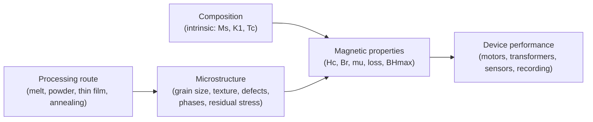
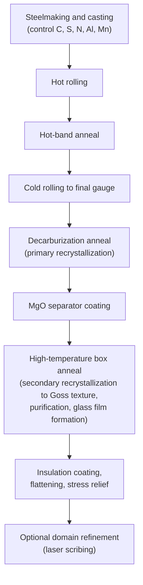
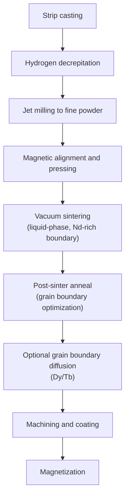

## Processing of Magnetic Materials


### Overview

Processing determines the **extrinsic** magnetic properties of a material: coercivity ($H_c$), remanence ($B_r$), permeability ($\mu$), core loss, and squareness of the hysteresis loop. Intrinsic properties (saturation magnetization $M_s$, Curie temperature $T_C$, magnetocrystalline anisotropy constant $K_1$) are set by composition and crystal structure, but the microstructure created by processing (grain size, texture, defect density, phase distribution, residual stress, and porosity) controls how domains nucleate, move, and pin.

The central design logic splits magnetic materials into two opposing processing philosophies:

| Material class | Goal | Microstructural strategy |
| --- | --- | --- |
| **Soft magnetic** (transformer steels, permalloy, ferrites, amorphous/nanocrystalline) | Low $H_c$, high $\mu$, low loss | Remove pinning sites: large or ultrafine grains, low impurities, low stress, controlled texture |
| **Hard (permanent) magnetic** (Nd-Fe-B, Sm-Co, Alnico, hard ferrites) | High $H_c$, high $(BH)_{max}$ | Create strong pinning or nucleation barriers: fine grains near single-domain size, aligned texture, engineered grain boundaries |
| **Semi-hard** (some steels, Fe-Cr-Co) | Intermediate $H_c$ for memory and hysteresis devices | Controlled precipitation and spinodal decomposition |
| **Magnetic recording / thin-film** | Tailored anisotropy, low noise | Deposition parameters, seed layers, annealing |

**Key Points**

- **Soft materials** are processed to *minimize* obstacles to domain-wall motion; **hard materials** are processed to *maximize* them.
- Processing steps are coupled: a step that improves one property (e.g., grain refinement raising $H_c$) may harm another (e.g., raising core loss in a soft material).
- Contamination (C, O, N, S) is a dominant enemy of soft magnetic performance and a controlled variable in hard magnets.

---

### Processing–Structure–Property Framework



#### Relationship Between Grain Size and Coercivity

Coercivity varies non-monotonically with particle or grain size $D$:

- **Multidomain regime** ($D \gg D_c$): coercivity falls roughly as $H_c \propto 1/D$ (approximate empirical trend).
- **Single-domain regime** ($D \lesssim D_c$): coercivity peaks, since reversal requires coherent rotation.
- **Superparamagnetic regime** ($D < D_{sp}$): thermal energy overwhelms anisotropy, and $H_c \to 0$.

For soft nanocrystalline alloys, the **Herzer random anisotropy model** predicts a strong grain-size dependence of coercivity and permeability once grains are smaller than the ferromagnetic exchange length $L_{ex}$:

$$H_c \propto D^{6} \quad (D < L_{ex}), \qquad H_c \propto \frac{1}{D} \quad (D > L_{ex})$$


$$\langle K \rangle \approx \frac{K_1 \sqrt{N}}{\ }\ \text{with } N = \left(\frac{L_{ex}}{D}\right)^3, \quad \langle K \rangle = K_1 \left(\frac{D}{L_{ex}}\right)^{3/2}$$

The averaged effective anisotropy $\langle K \rangle$ is drastically reduced when many randomly oriented grains couple through exchange within one exchange volume. **[Confirmed as the standard Herzer model; the $D^6$ scaling is an idealized result and experimental exponents vary with composition and residual stress.]**

The exchange length is

$$L_{ex} = \sqrt{\frac{A}{K_1}}$$

where $A$ is the exchange stiffness.

---

### Part I: Soft Magnetic Materials

#### Electrical and Silicon Steels

**Fe–Si (typically ~3 wt.% Si)** is the dominant material for power transformers and large rotating machines. Silicon raises electrical resistivity (reducing eddy-current loss) and lowers magnetostriction and magnetocrystalline anisotropy, but reduces ductility (above ~4–4.5 wt.% Si, rolling becomes difficult because of ordering and embrittlement).

##### Grain-Oriented Electrical Steel (GOES)

GOES exploits **Goss texture** $\{110\}\langle 001 \rangle$, aligning the easy magnetization axis $\langle 001 \rangle$ along the rolling direction.

Typical process route:

1. **Steelmaking and continuous casting** with tight control of C, S, N, Mn, Al (inhibitor-forming elements).
2. **Hot rolling** and **hot-band annealing**.
3. **Cold rolling** (single-stage or two-stage with intermediate anneal) to final thickness (commonly in the 0.18–0.35 mm range).
4. **Decarburization anneal** (~800–850 °C in wet H$_2$/N$_2$) to remove carbon, promote primary recrystallization, and form a thin oxide layer.
5. **Application of MgO annealing separator.**
6. **High-temperature (final) box anneal** (~1100–1200 °C in H$_2$) driving **secondary recrystallization** (abnormal grain growth) to the Goss orientation, forming a forsterite ($\text{Mg}_2\text{SiO}_4$) glass film, and purifying the steel.
7. **Insulating coating** and thermal flattening/stress-relief; optional **laser or mechanical domain refinement** to reduce core loss.

The role of **inhibitors** (fine dispersed particles such as MnS, AlN) is to pin normal grain growth so that only Goss-oriented grains grow abnormally during secondary recrystallization. **[Confirmed as the standard mechanism; specific inhibitor systems and process windows are proprietary and vary between producers.]**



##### Non-Oriented Electrical Steel (NOES)

- Designed for isotropic in-plane properties (rotating machines, motors).
- Processing emphasizes **grain growth** during final annealing (semi-processed or fully processed products), **low carbon**, control of **inclusions** (sulfides, nitrides, oxides), and texture that avoids the unfavorable $\{111\}$ fiber and favors $\{100\}$ and $\{110\}$ components.
- Increased Si and Al content raises resistivity for lower high-frequency loss at the cost of rolling difficulty and lower saturation induction.

##### High-Silicon Steel (6.5 wt.% Si)

- Near-zero magnetostriction and very low high-frequency loss.
- Too brittle to cold roll conventionally, so alternative routes are used:
  - **Chemical vapor deposition (CVD) siliconizing** (Si infusion into 3% Si sheet from SiCl$_4$ followed by diffusion anneal).
  - **Rapid solidification** (melt spinning) followed by annealing.
  - **Warm/hot rolling** with tailored deformation.

#### Total Core Loss Decomposition

Core loss in soft materials is commonly separated into three parts:

$$P_{total} = P_{h} + P_{e} + P_{a}$$

with the **Bertotti statistical loss theory** treating each contribution:

- **Hysteresis loss** $P_h = k_h f B_m^{n}$ (with the Steinmetz exponent $n$ typically 1.6–2.0 depending on material and range)
- **Classical eddy-current loss** for a lamination of thickness $d$ and resistivity $\rho$:

$$P_{e} = \frac{\pi^2 d^2 B_m^2 f^2}{6 \rho}$$

- **Excess (anomalous) loss** $P_a = k_a (f B_m)^{3/2}$ from domain-wall dynamics.

Processing implications:

| Loss component | Processing lever |
| --- | --- |
| Hysteresis | Reduce impurities and inclusions, relieve stress, optimize grain size, sharpen texture |
| Eddy current | Reduce thickness $d$, raise resistivity $\rho$ (Si, Al), apply insulating coatings, use laminations or powder cores |
| Excess | Domain refinement (laser scribing), tension coatings, grain-size tailoring |

**[Confirmed as the Bertotti/Steinmetz-type decomposition; coefficients and exponents are material- and frequency-range dependent.]**

#### Nickel–Iron (Permalloy and Mu-Metal)

- **Permalloy** (~78–80 wt.% Ni–Fe) achieves near-zero magnetostriction $\lambda_s$ and near-zero $K_1$ at specific compositions, giving extremely high permeability.
- Processing: vacuum melting, hot/cold rolling to thin gauge, then a **high-temperature hydrogen anneal** (typically ~1100–1200 °C) to remove impurities and grow grains, often followed by a **controlled cooling rate** (or a lower-temperature anneal) to manage short-range order.
- **Magnetic field annealing** below the Curie temperature induces uniaxial anisotropy, useful for square-loop applications.
- Sensitive to plastic deformation: after final shaping (e.g., shield forming), a **final anneal** is required to restore permeability.

**[Unverified in exact temperatures:** cooling-rate and temperature schedules vary with composition and product specification, so use supplier data.]

#### Soft Ferrites

**Spinel ferrites** ($\text{MFe}_2\text{O}_4$, with M = Mn, Zn, Ni) are ceramics with high resistivity, suited to high-frequency applications where metallic cores incur large eddy-current loss.

Processing route (ceramic process):

1. **Raw oxide/carbonate weighing and mixing** (Fe$_2$O$_3$, MnCO$_3$ or Mn$_3$O$_4$, ZnO, NiO, etc.).
2. **Calcination** (pre-sintering) to form partially reacted spinel phase.
3. **Milling** to control particle size and reactivity.
4. **Granulation with binder** and **pressing** (uniaxial or isostatic) into green bodies (e.g., toroids, E-cores).
5. **Sintering** at high temperature (often in the ~1100–1400 °C range, composition-dependent) under a **controlled oxygen partial pressure** during cooling, since Mn–Zn ferrites are extremely sensitive to Fe$^{2+}$/Fe$^{3+}$ balance.
6. **Grinding / finishing** and gap-setting if needed.

Key control variables:

- **Oxygen partial pressure** during cooling: governs Fe$^{2+}$ content and thereby anisotropy and loss. The equilibrium relation is often expressed as

$$\log p_{O_2} = a - \frac{b}{T}$$

(with composition-dependent constants $a$, $b$) so that the cooling profile follows a defined $p_{O_2}(T)$ path (the "equilibrium atmosphere" schedule). **[Confirmed as standard practice for Mn–Zn ferrites; constants are empirical and composition-specific.]**

- **Additives** (CaO, SiO$_2$, Nb$_2$O$_5$, etc.) segregate to grain boundaries, forming high-resistivity layers that reduce eddy-current loss at high frequency.
- **Grain size and density**: large uniform grains raise permeability but lower the frequency limit (Snoek-type limit); small grains and high-resistivity boundaries favor high-frequency use.

The **Snoek limit** for spinel ferrites relates initial permeability and the resonance frequency:

$$(\mu_i - 1) f_r \approx \text{const} \propto M_s$$

so higher permeability comes at the cost of a lower usable frequency. **[Confirmed as the standard Snoek relation; the constant depends on the material and the relaxation mechanism assumed.]**

#### Amorphous and Nanocrystalline Alloys

##### Amorphous (Metallic Glass) Ribbons

- Produced by **planar-flow casting / melt spinning**: molten alloy is ejected onto a rapidly rotating (often copper-alloy) wheel, with cooling rates on the order of $10^5$–$10^6$ K/s, producing ribbons ~15–30 µm thick. **[Inference: typical ranges; actual values depend on wheel speed, alloy, and ribbon thickness.]**
- Typical compositions: Fe–Si–B (Metglas 2605-type), Co-based (near-zero magnetostriction), Fe–Ni-based.
- Absence of grain boundaries and crystalline anisotropy gives very low hysteresis loss; high resistivity and thinness lower eddy-current loss.
- **Stress-relief and field annealing** (below crystallization temperature) tune anisotropy and loop shape.
- Limitations: thin ribbon geometry, mechanical brittleness after annealing, and magnetostriction-related acoustic noise in Fe-based grades.

##### Nanocrystalline Alloys (FINEMET-type)

**FINEMET** ($\text{Fe}_{73.5}\text{Si}_{13.5}\text{B}_9\text{Nb}_3\text{Cu}_1$) is the archetype:

- Produced as amorphous ribbon, then **crystallization-annealed** (~500–600 °C) to nucleate α-Fe(Si) nanocrystals (~10–15 nm) in a residual amorphous matrix.
- **Cu** promotes nucleation (Cu-rich clusters act as heterogeneous nucleation sites); **Nb** (and related elements like Mo, Ta) **retards grain growth** by segregating to the amorphous matrix and limiting Fe diffusion.
- Result: grain size below the exchange length, so Herzer averaging gives very low effective anisotropy and outstanding permeability and low loss.

Other families: **NANOPERM** (Fe–M–B, M = Zr, Hf, Nb) and **HITPERM** (Fe–Co–M–B–Cu) targeting higher saturation or higher operating temperature.

**Key Points**

- Nanocrystallization is a **controlled devitrification** process; over-annealing coarsens grains and precipitates boride phases, which sharply increases $H_c$.
- Annealing in a **transverse magnetic field** produces induced anisotropy for linear B–H loops; annealing under **longitudinal field** gives square loops.

#### Soft Magnetic Composites (SMCs) and Powder Cores

- **Iron powder cores, Fe–Si–Al (Sendust), Fe–Ni (MPP, High Flux), and amorphous/nanocrystalline powder cores** consist of insulated particles compacted into shape.
- Processing: powder production (gas or water atomization, or milling), **surface insulation** (phosphate, oxide, or resin coating), **compaction** (often high pressure, e.g., hundreds of MPa to ~1 GPa), and **stress-relief annealing** at a temperature that relieves compaction stress without degrading the insulation layer.
- The **distributed air gap** effect of insulating layers lowers effective permeability, linearizes the B–H curve, and reduces eddy currents, enabling 3-D flux paths and high-frequency use.
- Trade-off: higher compaction density improves permeability and saturation but risks insulation breakdown; higher anneal temperature reduces hysteresis loss but can degrade insulation and increase eddy loss.

#### Magnetic Field Annealing and Stress Annealing

Both methods **induce uniaxial anisotropy** by directional ordering of atom pairs or by anisotropic stress during anneal:

$$K_u^{induced} \propto \left(\frac{\text{annealing-driven pair ordering}}{}\right)$$

- **Field annealing:** anneal below $T_C$ but high enough for diffusion, under an applied field $H$; the field biases the local direction of atomic-pair ordering (Néel–Taniguchi model).
- **Stress annealing:** applied tensile or compressive stress during annealing induces anisotropy through creep-like structural relaxation, used in amorphous and nanocrystalline ribbons to linearize loops.

---

### Part II: Hard Magnetic Materials

#### Nd–Fe–B Magnets

The hard phase $\text{Nd}_2\text{Fe}_{14}\text{B}$ (tetragonal) has high uniaxial anisotropy and high saturation magnetization, giving the highest room-temperature energy products among commercial permanent magnets.

##### Sintered Nd–Fe–B

Standard process route:

1. **Alloy preparation** by vacuum induction melting and **strip casting** (thin flakes with fine, columnar Nd$_2$Fe$_{14}$B grains separated by Nd-rich phase).
2. **Hydrogen decrepitation (HD):** hydrogen absorbed in the Nd-rich intergranular phase causes embrittlement and fracture into coarse powder.
3. **Jet milling** to fine powder (typically a few µm particle size, close to single-crystal-particle scale).
4. **Alignment and pressing:** powder is aligned in an applied magnetic field and pressed (transverse or axial field, or isostatic pressing) to establish crystallographic texture and high $B_r$.
5. **Vacuum sintering** (~1050–1100 °C) to near full density via **liquid-phase sintering** through the Nd-rich phase.
6. **Post-sinter annealing** (commonly two-step, ~900 °C and ~500–600 °C) to optimize grain-boundary phase distribution and thereby $H_c$.
7. **Machining, surface coating** (Ni–Cu–Ni plating, epoxy, or Al-based coatings) to prevent corrosion, and **magnetization**.

**Grain boundary engineering** is central: a thin, continuous, non-ferromagnetic Nd-rich layer **magnetically decouples** neighboring grains, preventing reversal from propagating.

**Grain boundary diffusion (GBD) processing:** Dy or Tb (as metal, fluoride, hydride, or alloy) is deposited on the magnet surface and diffused along grain boundaries at elevated temperature, forming a Dy/Tb-rich shell around Nd$_2$Fe$_{14}$B grains. This raises $H_c$ with far less heavy rare earth than bulk alloying, and reduces the $B_r$ penalty. **[Confirmed as widely adopted industrial practice; diffusion depth is limited, so it is most effective for thinner magnets.]**



##### Bonded and Hot-Deformed Nd–Fe–B

- **Melt-spun (rapidly quenched) ribbons** (e.g., MQP powder) with nanoscale isotropic grains: used for **bonded magnets** (polymer matrix via compression or injection molding), which are isotropic with lower $(BH)_{max}$ but good shape flexibility.
- **Hot pressing and die-upset (hot deformation):** melt-spun powder is hot pressed to full density, then plastically deformed at elevated temperature; grain rotation and preferential growth/dissolution produce **crystallographic texture** (anisotropic magnets, fine-grained). The fine grain size (~100–500 nm platelets) gives high $H_c$ with less heavy rare earth.
- **HDDR (hydrogenation–disproportionation–desorption–recombination):** produces fine, anisotropic powder for bonded magnets.

#### Sm–Co Magnets

Two main types:

| Type | Phase | Characteristic |
| --- | --- | --- |
| **SmCo$_5$** (1:5) | Hexagonal $\text{CaCu}_5$-type | High anisotropy, nucleation- or pinning-controlled; simpler processing |
| **Sm$_2$Co$_{17}$** (2:17) | Rhombohedral/hexagonal | Higher $M_s$ and higher operating temperature; **precipitation hardened** cellular microstructure |

- Sintered route similar to Nd–Fe–B: melting, milling, aligned pressing, sintering, then **solution treatment and multi-step aging**.
- For 2:17 magnets, the characteristic **cellular microstructure** consists of Sm$_2$Co$_{17}$ cells surrounded by a Sm(Co,Cu)$_5$ cell boundary phase and Zr-rich platelets; long, slow **step-aging** (with slow cooling to lower temperatures) develops the Cu-rich boundary phase that **pins domain walls**, giving high coercivity.
- Advantages: excellent temperature stability and corrosion resistance; drawbacks: cost of Sm and Co (Co is supply-sensitive), and brittleness.

#### Alnico

- **Al–Ni–Co–Fe** alloys (with Cu, Ti) derive coercivity from **spinodal decomposition** producing elongated, aligned Fe–Co-rich (ferromagnetic) rods in a Ni–Al-rich (weakly magnetic) matrix, giving strong **shape anisotropy**.
- Processing: casting or sintering; **solution treatment**, then **controlled cooling in a magnetic field** through the spinodal range to align the precipitates, followed by **tempering (aging)**.
- Casting and columnar grain growth (directional solidification) further enhance texture and $(BH)_{max}$ (e.g., Alnico 5-7 type).
- Advantages: high $T_C$, excellent temperature stability, low cost of raw materials; disadvantages: low coercivity (easy to demagnetize) and brittle, difficult to machine.

#### Hard Ferrites

- **Ba- and Sr-hexaferrites** ($\text{BaFe}_{12}\text{O}_{19}$, $\text{SrFe}_{12}\text{O}_{19}$; M-type, hexagonal magnetoplumbite).
- Processing: mixing of Fe$_2$O$_3$ and BaCO$_3$/SrCO$_3$, **calcination**, **wet milling** (to submicron single-domain-scale particles), **pressing in a magnetic field** (wet pressing for anisotropic grades), then **sintering**.
- Very low cost and good corrosion resistance; the highest volume of production among permanent magnets by mass. Energy product is much lower than Nd–Fe–B or Sm–Co.
- **La–Co substitution** improves $H_c$ and $B_r$ in modern grades.

#### Coercivity Mechanisms in Hard Magnets

Two idealized limits:

- **Nucleation-controlled** (e.g., sintered Nd–Fe–B, SmCo$_5$): coercivity is governed by nucleation of reversed domains, sensitive to surface and grain-boundary defects.
- **Pinning-controlled** (e.g., Sm$_2$Co$_{17}$, Alnico-like): coercivity is governed by the strength of domain-wall pinning at precipitates and boundaries.

The **Kronmüller equation** is the standard phenomenological expression for nucleation-type coercivity:

$$H_c = \alpha_K \alpha_\psi \frac{2K_1}{\mu_0 M_s} - N_{eff} M_s$$

where $\alpha_K$ describes microstructural defects reducing anisotropy near grain boundaries, $\alpha_\psi$ accounts for grain misorientation, and $N_{eff}$ is the effective demagnetizing factor from local stray fields. Note that the term $2K_1/(\mu_0 M_s)$ equals the anisotropy field $H_A$. Real magnets typically reach only a small fraction of $H_A$ (**Brown's paradox**). **[Confirmed as the standard Kronmüller analysis; parameter values are obtained by fitting and are microstructure dependent.]**

The **maximum energy product** for an ideal magnet is bounded by

$$(BH)_{max} \le \frac{\mu_0 M_s^2}{4}$$

achieved only for a perfectly square loop and $H_c \ge M_s/2$.

#### Comparison of Permanent Magnet Families

| Magnet | Typical $(BH)_{max}$ (indicative) | $T_C$ (approx.) | Key strengths | Key limitations |
| --- | --- | --- | --- | --- |
| Sintered Nd–Fe–B | Highest (~200–430 kJ/m$^3$) | ~310–320 °C (base alloy) | Highest energy product | Corrosion, thermal derating, heavy REE dependence |
| Sm–Co | ~150–260 kJ/m$^3$ | ~700–830 °C | High-temperature stability, corrosion resistance | Cost, brittleness |
| Alnico | ~40–70 kJ/m$^3$ | ~800–860 °C | Temperature stability | Low $H_c$ |
| Hard ferrite | ~10–40 kJ/m$^3$ | ~450 °C | Low cost, corrosion resistant | Low energy product |
| Bonded Nd–Fe–B | ~40–100 kJ/m$^3$ | Same as base | Complex shapes, net-shape | Reduced $B_r$ |

*Values are indicative ranges drawn from commonly cited data and vary by grade, orientation, and manufacturer.*

---

### Part III: Thin Films and Advanced Processing Routes

#### Thin-Film Deposition

- **Sputtering (DC, RF, magnetron):** dominant for magnetic recording media, spintronic stacks (Co/Pt, CoFeB/MgO), and permalloy sensors. Working gas pressure, substrate temperature, bias, and seed/buffer layers control texture and anisotropy.
- **Molecular beam epitaxy (MBE) and pulsed laser deposition (PLD):** for epitaxial films and oxide magnets.
- **Electrodeposition:** for Ni–Fe, CoNiFe write-head poles and MEMS magnetics; bath chemistry, current waveform, and applied field determine composition and anisotropy.
- **Post-deposition annealing:** crystallization of CoFeB to bcc (001) texture against MgO for high tunneling magnetoresistance (TMR); chemical ordering of FePt to the L1$_0$ phase (high anisotropy) typically requires high-temperature annealing (~500–700 °C range).

**[Unverified:** exact annealing temperatures vary with film thickness, stack design, and desired ordering.]

**Key control variables:**

| Variable | Effect |
| --- | --- |
| Substrate temperature | Adatom mobility, grain size, ordering |
| Working gas pressure | Film density, stress, columnar structure |
| Deposition rate | Composition uniformity, defect density |
| Seed / underlayer | Texture transfer (e.g., MgO or Ru for perpendicular anisotropy) |
| Post-anneal atmosphere | Interface oxidation, crystallization, ordering |

#### Additive Manufacturing of Magnetic Materials

- **Laser powder bed fusion (LPBF)** and **directed energy deposition (DED)** of Fe–Si, Fe–Ni, Fe–Co (Permendur), and Nd–Fe–B.
- Challenges: rapid solidification produces residual stress, texture, and **cracking** (especially in high-Si steels), oxidation, and loss of volatile elements. Post-process **heat treatment** and **HIP (hot isostatic pressing)** are often needed. **[Unverified for broad industrial qualification:** magnetic property reproducibility in AM parts remains an active development area.]
- For hard magnets, **binder jetting and bonded-magnet printing** with Nd–Fe–B powder in polymer are relatively mature; fully dense AM sintered-quality Nd–Fe–B is still largely research-scale.

#### Severe Plastic Deformation and Mechanical Alloying

- **High-energy ball milling and mechanical alloying** create nanocrystalline or amorphous powders; subsequent consolidation (spark plasma sintering, hot pressing) produces bulk nanostructured magnets.
- **Spark plasma sintering (SPS)** achieves densification at lower temperature and shorter time than conventional sintering, limiting grain growth, which is valuable for nanocomposite (**exchange-spring**) magnets that couple a hard phase to a high-$M_s$ soft phase.

The **exchange-spring** concept aims for enhanced remanence and $(BH)_{max}$ when the soft phase dimension is below about twice the domain-wall width of the hard phase:

$$t_{soft} \lesssim 2\,\delta_{w,hard}, \qquad \delta_w = \pi\sqrt{\frac{A}{K_1}}$$

**[Inference: practical bulk exchange-spring magnets have not routinely reached theoretical limits because of difficulty in achieving fine, well-aligned, well-coupled nanostructures.]**

#### Recycling and Sustainability Routes

- **HD (hydrogen decrepitation) recycling** of end-of-life Nd–Fe–B magnets to re-usable powder, blended with virgin powder or re-sintered.
- **Hydrometallurgical and pyrometallurgical** rare-earth extraction routes.
- **Grain boundary diffusion** and **Ce/La substitution** as strategies to reduce heavy-rare-earth demand. **[Confirmed as active industrial and research directions; economic viability depends on market conditions.]**

---

### Cross-Cutting Processing Concepts

#### Heat Treatment Summary

| Treatment | Purpose | Applies to |
| --- | --- | --- |
| Stress-relief anneal | Remove residual stress, restore permeability | Steels, permalloy, SMCs, nanocrystalline cores |
| Hydrogen anneal | Purify (remove C, S, O, N), promote grain growth | Permalloy, Fe–Si, Fe–Co |
| Secondary recrystallization anneal | Develop Goss texture | GOES |
| Field anneal | Induce uniaxial anisotropy | Permalloy, amorphous, nanocrystalline |
| Crystallization anneal | Form nanocrystals | FINEMET-type |
| Sintering | Densify ceramics/powders | Ferrites, Nd–Fe–B, Sm–Co |
| Post-sinter / step aging | Optimize grain boundary phase or precipitates | Nd–Fe–B, Sm$_2$Co$_{17}$ |
| Ordering anneal | Develop L1$_0$ or B2 order | FePt, FeCo |
| Spinodal decomposition in field | Align precipitates | Alnico |

#### Contamination and Atmosphere Control

- **Soft magnets:** interstitial C and N distort the lattice and pin domain walls; **magnetic aging** (precipitation of carbides/nitrides at room or moderate temperature) increases core loss over time in low-carbon steels.
- **Nd–Fe–B:** oxygen content consumes Nd (forming Nd oxides), reducing the volume of Nd-rich grain-boundary phase and hence $H_c$; processing under inert gas or with low-oxygen jet mills is standard.
- **Ferrites:** oxygen partial pressure during cooling governs cation valence and losses.

#### Mechanical Processing Effects

- **Cold work** increases dislocation density, raising $H_c$ and lowering $\mu$ in soft materials; stress-relief annealing is generally needed after punching, cutting, or forming.
- **Punching and laser cutting** of laminations locally degrade magnetic properties near cut edges (an "edge effect"), an important consideration for motor stators.
- **Magnetostrictive stress sensitivity** means that mounting and encapsulation stress can shift the magnetic response, particularly in high-permeability alloys.

---

### Worked Example: Eddy-Current Loss Scaling in Laminations

**Example**

Compare classical eddy-current loss in Fe–Si laminations of thickness $d_1 = 0.35\ \text{mm}$ and $d_2 = 0.20\ \text{mm}$ operating under identical $B_m$, $f$, and resistivity.

**Solution**

From $P_e \propto d^2$:

$$\frac{P_{e}(d_2)}{P_{e}(d_1)} = \left(\frac{d_2}{d_1}\right)^2 = \left(\frac{0.20}{0.35}\right)^2 \approx 0.327$$

**Output**

The thinner lamination reduces classical eddy-current loss to roughly **33%** of the thicker lamination's value.

**Conclusion**

Halving thickness cuts classical eddy loss by roughly a factor of four, which is why thin-gauge grades dominate high-frequency applications. **[Inference: real losses also include excess-loss contributions that do not scale exactly with $d^2$, so actual reductions are typically somewhat smaller than this ideal estimate.]**

---

### Worked Example: Estimating Ideal Energy Product

**Example**

Estimate the theoretical upper bound on $(BH)_{max}$ for a magnet with $\mu_0 M_s = 1.6\ \text{T}$ (representative for Nd$_2$Fe$_{14}$B, approximated for illustration).

**Solution**

Using $(BH)_{max} \le \mu_0 M_s^2 / 4$, and writing $\mu_0 M_s^2 = (\mu_0 M_s)^2/\mu_0$:

$$(BH)_{max} \le \frac{(\mu_0 M_s)^2}{4\mu_0} = \frac{(1.6)^2}{4 \times 4\pi\times10^{-7}} \approx \frac{2.56}{5.027\times10^{-6}} \approx 5.09\times10^{5}\ \text{J/m}^3$$

**Output**

$$(BH)_{max}^{ideal} \approx 509\ \text{kJ/m}^3$$

**Conclusion**

Commercial sintered Nd–Fe–B magnets achieve a substantial fraction of this ideal bound (research-grade values are commonly reported above 400 kJ/m$^3$). The gap arises from imperfect alignment, non-magnetic phases, and incomplete squareness. **[Inference: the numeric bound depends on the $M_s$ value used, and the figure quoted here is indicative.]**

---

### Illustrative Code: Bertotti Loss Separation Fit

```python
import numpy as np
from scipy.optimize import curve_fit

def bertotti_loss(fB, kh, ke, ka, n=1.8):
    """
    Loss separation model (per cycle-dependent form).
    fB: array of (frequency f [Hz], peak flux density Bm [T]) pairs.
    P = kh*f*Bm^n + ke*f^2*Bm^2 + ka*(f*Bm)^1.5
    """
    f, Bm = fB
    Ph = kh * f * Bm**n
    Pe = ke * f**2 * Bm**2
    Pa = ka * (f * Bm)**1.5
    return Ph + Pe + Pa

# Synthetic illustrative data (assumed, not measured)
rng = np.random.default_rng(0)
f  = np.array([50, 100, 200, 400, 800, 1000, 50, 100, 200, 400], dtype=float)
Bm = np.array([1.0, 1.0, 1.0, 1.0, 1.0, 1.0, 1.5, 1.5, 1.5, 1.5], dtype=float)
P_true = bertotti_loss((f, Bm), kh=0.02, ke=1.0e-4, ka=5.0e-3)
P_meas = P_true * (1 + 0.02 * rng.standard_normal(f.size))

popt, _ = curve_fit(
    lambda fB, kh, ke, ka: bertotti_loss(fB, kh, ke, ka),
    (f, Bm), P_meas, p0=[0.01, 1e-4, 1e-3], bounds=(0, np.inf)
)
print("Fitted [kh, ke, ka]:", popt)
```

**Notes:** The fit above operates on synthetic data to illustrate the separation workflow. Real fitting requires a clean measured dataset (controlled waveform, temperature, and stress), attention to the frequency range over which each term dominates, and often a variable exponent $n$ for hysteresis loss. **[Inference: parameter identifiability is limited if frequency and induction ranges are narrow.]**

---

### Characterization Methods for Processed Magnetic Materials

| Technique | Measures |
| --- | --- |
| **Vibrating sample magnetometer (VSM) / SQUID** | Hysteresis loops, $M_s$, $H_c$, $M_r$, temperature dependence |
| **Hysteresigraph / permeameter (closed circuit)** | $B$–$H$ loops of bulk hard magnets; $(BH)_{max}$ |
| **Epstein frame / single-sheet tester (SST)** | Core loss and permeability of electrical steel per standardized methods |
| **Impedance analyzer / LCR meter** | Complex permeability spectra of ferrites and cores |
| **Kerr microscopy, magnetic force microscopy (MFM)** | Domain structure and wall motion |
| **XRD, EBSD** | Phase identification, crystallographic texture (e.g., Goss fraction, alignment degree) |
| **TEM / atom probe tomography (APT)** | Grain-boundary phases, precipitate chemistry, nanoscale structure |
| **DSC / TGA** | Crystallization temperature, oxidation, Curie transition |
| **Torque magnetometry** | Anisotropy constants |
| **Pulsed-field magnetometry** | Hysteresis of high-coercivity hard magnets |

Relevant standards families exist (e.g., IEC 60404 series for magnetic materials; ASTM A343, A804, and A977 for electrical steel and related measurements). **[Unverified:** confirm current standard numbers and revisions directly with the issuing body before compliance use.]

---

### Common Defects and Failure Modes

| Defect / issue | Cause | Consequence |
| --- | --- | --- |
| Oxygen or carbon pickup | Poor atmosphere control | Increased $H_c$ (soft) or loss of Nd-rich phase (Nd–Fe–B) |
| Abnormal grain growth (unwanted) | Inhibitor failure, wrong anneal | Loss of texture or non-uniform properties |
| Cracking in AM or rolling | Residual stress, brittle phase | Scrap, magnetic inhomogeneity |
| Over-annealing of nanocrystalline alloys | Grain coarsening, boride precipitation | High $H_c$, embrittlement |
| Corrosion of Nd–Fe–B | Nd-rich intergranular phase attacked | Degraded magnetic and mechanical integrity |
| Thermal demagnetization | Operating above allowable temperature for the grade | Irreversible flux loss |
| Insulation breakdown in SMCs or laminations | Excessive anneal, punching burrs | Interlaminar short circuits, higher eddy loss |
| Hydrogen embrittlement | Improper hydrogen handling | Fracture, dimensional change |

---

### Summary of Key Concepts

| Concept | Statement |
| --- | --- |
| Intrinsic vs. extrinsic | $M_s$, $T_C$, $K_1$ are compositional; $H_c$, $\mu$, loss are microstructural |
| Herzer model | $H_c \propto D^6$ for $D < L_{ex}$; $L_{ex} = \sqrt{A/K_1}$ |
| Goss texture | $\{110\}\langle 001 \rangle$, produced by secondary recrystallization |
| Loss separation | $P = P_h + P_e + P_a$; $P_e \propto d^2 f^2 B_m^2/\rho$ |
| Nanocrystalline soft alloys | Amorphous precursor + Cu nucleation + Nb growth inhibition |
| Sintered Nd–Fe–B | HD + jet mill + aligned press + liquid-phase sinter + grain boundary engineering |
| GBD | Dy/Tb enrich grain boundaries to raise $H_c$ efficiently |
| Sm$_2$Co$_{17}$ | Cellular precipitation microstructure with pinned walls |
| Alnico | Spinodal decomposition and field-aligned elongated precipitates |
| Ideal energy product | $(BH)_{max} \le \mu_0 M_s^2/4$ |
| Coercivity limit | Brown's paradox: real $H_c \ll H_A$ |

---

### Related Topics

- Domain theory and domain-wall dynamics in processed microstructures
- Magnetic anisotropy and its engineering (magnetocrystalline, shape, stress-induced)
- Amorphous metals and rapid-solidification science
- Texture analysis and crystallographic orientation distribution
- Grain boundary engineering in rare-earth permanent magnets
- Exchange-spring and nanocomposite permanent magnets
- Magnetic thin films, spintronics, and perpendicular recording media
- Soft magnetic composites for high-frequency motor design
- Additive manufacturing of magnetic alloys
- Recycling and supply-chain strategies for rare-earth magnets
- Magnetostriction, magnetoelastic coupling, and stress effects on processing
- Standards and test methods for magnetic material qualification