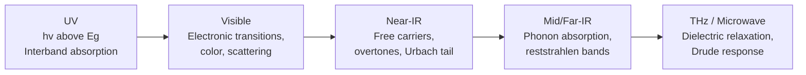
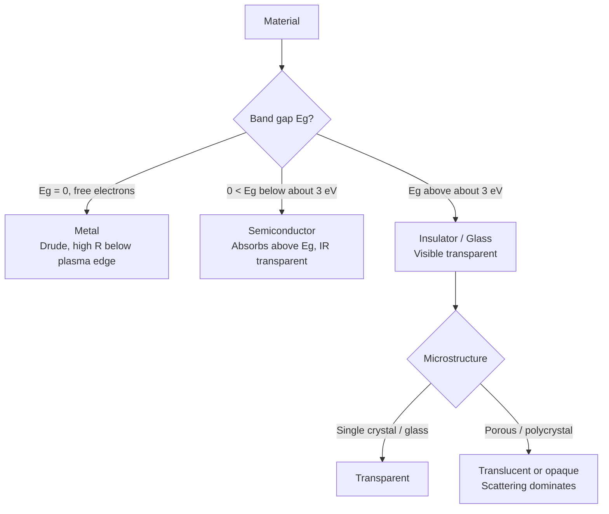

## Optical Properties of Materials


### Overview

The optical properties of a material describe how it responds to electromagnetic radiation from the ultraviolet through the visible to the infrared. When light strikes a solid, it can be **reflected**, **absorbed**, **transmitted**, or **scattered**. The relative fractions are governed by the material's electronic structure, lattice vibrations, defects, microstructure, and surface condition.

Energy conservation at an interface or through a slab requires:

$$T + R + A = 1$$

where $T$ is transmittance, $R$ is reflectance, and $A$ is absorptance (scattering losses are included in $R$ or $A$ depending on convention).

**Key Points**

- Optical response is controlled by the interaction of photons with electrons (dominant in UV/visible) and with lattice vibrations, free carriers, and molecular vibrations (dominant in IR).
- Photon energy and wavelength are related by $E = h\nu = \dfrac{hc}{\lambda}$, or practically $E\,[\mathrm{eV}] \approx \dfrac{1.2398}{\lambda\,[\mu\mathrm{m}]}$.
- The visible range spans roughly $380$–$750\ \mathrm{nm}$, corresponding to about $3.3$–$1.65\ \mathrm{eV}$.
- Metals, semiconductors, and insulators differ mainly through the presence and size of a band gap $E_g$ and the density of free carriers.

### Fundamental Framework

#### Complex Refractive Index and Dielectric Function

The response of a homogeneous, isotropic, non-magnetic medium is captured by the complex refractive index:

$$\tilde{n} = n + i\kappa$$

where $n$ is the (real) refractive index and $\kappa$ is the extinction coefficient. It is linked to the complex dielectric function $\tilde{\varepsilon} = \varepsilon_1 + i\varepsilon_2$ by:

$$\tilde{n}^2 = \tilde{\varepsilon}$$


$$\varepsilon_1 = n^2 - \kappa^2, \qquad \varepsilon_2 = 2n\kappa$$


$$n = \sqrt{\dfrac{\sqrt{\varepsilon_1^2 + \varepsilon_2^2} + \varepsilon_1}{2}}, \qquad \kappa = \sqrt{\dfrac{\sqrt{\varepsilon_1^2 + \varepsilon_2^2} - \varepsilon_1}{2}}$$

Physical meaning:

- $n$ sets the phase velocity: $v = c/n$.
- $\kappa$ sets attenuation of the wave amplitude.
- $\varepsilon_2$ is proportional to absorption; $\varepsilon_1$ relates to polarization (energy storage).

#### Absorption Coefficient and Beer–Lambert Law

The absorption coefficient is:

$$\alpha = \dfrac{4\pi\kappa}{\lambda_0}$$

Intensity decays with depth $x$ as:

$$I(x) = I_0\, e^{-\alpha x}$$

The penetration (skin) depth is $\delta = 1/\alpha$. For a slab of thickness $d$ with single-surface reflectance $R$ (neglecting multiple reflections):

$$T = (1 - R)^2\, e^{-\alpha d}$$

Including incoherent multiple reflections:

$$T = \dfrac{(1-R)^2 e^{-\alpha d}}{1 - R^2 e^{-2\alpha d}}$$

Optical density (absorbance) is often reported as $A_{10} = \alpha d / \ln 10$.

#### Kramers–Kronig Relations

Causality links the real and imaginary parts of the response function. For the dielectric function:

$$\varepsilon_1(\omega) - 1 = \dfrac{2}{\pi}\, \mathcal{P}\!\int_0^\infty \dfrac{\omega'\,\varepsilon_2(\omega')}{\omega'^2 - \omega^2}\, d\omega'$$


$$\varepsilon_2(\omega) = -\dfrac{2\omega}{\pi}\, \mathcal{P}\!\int_0^\infty \dfrac{\varepsilon_1(\omega') - 1}{\omega'^2 - \omega^2}\, d\omega'$$

where $\mathcal{P}$ denotes the Cauchy principal value. Practical consequence: measuring reflectance over a wide spectral range allows extraction of $n$ and $\kappa$ via a Kramers–Kronig transform of the reflection phase.

### Reflection, Refraction, and Transmission

#### Fresnel Equations

At normal incidence from a medium of index $n_1$ into a medium of complex index $\tilde{n}_2 = n_2 + i\kappa_2$:

$$R = \dfrac{(n_2 - n_1)^2 + \kappa_2^2}{(n_2 + n_1)^2 + \kappa_2^2}$$

For a transparent dielectric in air ($n_1 = 1$, $\kappa_2 = 0$):

$$R = \left(\dfrac{n - 1}{n + 1}\right)^2$$

At oblique incidence, the amplitude reflection coefficients for $s$- (TE) and $p$- (TM) polarization are:

$$r_s = \dfrac{n_1\cos\theta_i - n_2\cos\theta_t}{n_1\cos\theta_i + n_2\cos\theta_t}, \qquad r_p = \dfrac{n_2\cos\theta_i - n_1\cos\theta_t}{n_2\cos\theta_i + n_1\cos\theta_t}$$

with $R_{s,p} = |r_{s,p}|^2$ and Snell's law:

$$n_1 \sin\theta_i = n_2 \sin\theta_t$$

#### Brewster's Angle and Total Internal Reflection

$$\theta_B = \arctan\!\left(\dfrac{n_2}{n_1}\right)$$

At $\theta_B$, $R_p = 0$ for a non-absorbing dielectric, which is exploited in polarizers and Brewster windows for lasers.

When light goes from a denser to a rarer medium ($n_1 > n_2$), total internal reflection occurs above the critical angle:

$$\theta_c = \arcsin\!\left(\dfrac{n_2}{n_1}\right)$$

This underpins optical fibers and prisms.

#### Dispersion

The index varies with wavelength. Away from absorption bands, the normal dispersion of transparent materials is described empirically by the **Sellmeier equation**:

$$n^2(\lambda) = 1 + \sum_{j} \dfrac{B_j\,\lambda^2}{\lambda^2 - C_j}$$

or the simpler **Cauchy equation**:

$$n(\lambda) = A + \dfrac{B}{\lambda^2} + \dfrac{C}{\lambda^4}$$

The **Abbe number** quantifies dispersion for glass selection:

$$V_d = \dfrac{n_d - 1}{n_F - n_C}$$

using the helium d-line ($587.6\ \mathrm{nm}$) and hydrogen F ($486.1\ \mathrm{nm}$) and C ($656.3\ \mathrm{nm}$) lines. High $V_d$ (crown glasses, typically $> 50$) means low dispersion; low $V_d$ (flint glasses) means high dispersion.

**Example: Reflection Loss of Common Materials in Air (normal incidence, visible)**

| Material | Approx. $n$ | Single-surface $R$ |
| --- | --- | --- |
| Fused silica | 1.46 | 3.5 % |
| Soda-lime glass | 1.52 | 4.3 % |
| Sapphire ($\mathrm{Al_2O_3}$) | 1.77 | 7.7 % |
| Silicon (near-IR) | 3.5 | 30.9 % |
| Germanium (IR) | 4.0 | 36 % |

Values are representative and vary with wavelength and grade.

### Absorption Mechanisms

#### Interband (Fundamental) Absorption

Photons with $h\nu \ge E_g$ promote electrons from the valence band to the conduction band. Near the band edge, absorption follows a power law:

$$\alpha(h\nu) \propto \dfrac{(h\nu - E_g)^{m}}{h\nu}$$

with $m = 1/2$ for direct allowed transitions and $m = 2$ for indirect allowed transitions (phonon-assisted, with $\pm E_p$ correction). Direct-gap materials (GaAs, GaN, InP, CdTe) absorb strongly with $\alpha \sim 10^4$–$10^5\ \mathrm{cm^{-1}}$ just above $E_g$, while indirect-gap materials (Si, Ge) rise gradually.

#### Tauc Analysis

To extract $E_g$ from a measured absorption spectrum, plot $(\alpha h\nu)^{1/m}$ versus $h\nu$ and extrapolate the linear region to zero:

$$(\alpha h\nu)^{1/m} = A\,(h\nu - E_g)$$

- $m = 1/2$: direct allowed ($(\alpha h\nu)^2$ plot)
- $m = 2$: indirect allowed ($(\alpha h\nu)^{1/2}$ plot)

For diffuse-reflectance samples (powders), the Kubelka–Munk function $F(R_\infty) = \dfrac{(1-R_\infty)^2}{2R_\infty}$ replaces $\alpha$.

#### Excitons and Urbach Tail

Below $E_g$, Coulomb-bound electron–hole pairs (**excitons**) give sharp absorption peaks with binding energy $E_b = \dfrac{\mu e^4}{2\hbar^2 (4\pi\varepsilon_0\varepsilon_r)^2}$, where $\mu$ is the reduced effective mass. Disorder and thermal broadening produce an exponential **Urbach tail**:

$$\alpha(h\nu) = \alpha_0 \exp\!\left(\dfrac{h\nu - E_0}{E_U}\right)$$

The Urbach energy $E_U$ is a practical measure of structural and thermal disorder.

#### Free-Carrier Absorption

In metals, doped semiconductors, and transparent conducting oxides, free electrons absorb in the IR with a wavelength dependence that scales approximately as:

$$\alpha_{fc} \propto \lambda^{p}, \qquad p \approx 1.5\text{–}3.5$$

The exponent depends on the dominant scattering mechanism (acoustic phonons, optical phonons, ionized impurities). [Inference] Exact exponents vary with doping level and temperature.

#### Lattice (Phonon) Absorption

Infrared-active optical phonons absorb in the far-to-mid IR (reststrahlen band). This sets the long-wavelength transparency limit of materials such as fused silica (about $3.5\ \mu\mathrm{m}$), sapphire (about $5.5\ \mu\mathrm{m}$), ZnSe (about $16\ \mu\mathrm{m}$), and KBr (about $25\ \mu\mathrm{m}$). Heavier ions and weaker bonds shift the IR edge to longer wavelength.

#### Impurity and Defect Absorption

- **Color centers**: F-centers (an electron trapped at an anion vacancy) in alkali halides produce visible absorption bands.
- **Transition-metal ions** ($\mathrm{Cr^{3+}}$, $\mathrm{Fe^{2+}}$, $\mathrm{Ti^{3+}}$, $\mathrm{Co^{2+}}$) produce crystal-field ($d$–$d$) absorption; $\mathrm{Cr^{3+}}$ gives red in ruby and green in emerald because of different crystal-field strengths.
- **Rare-earth ions** ($\mathrm{Nd^{3+}}$, $\mathrm{Er^{3+}}$, $\mathrm{Yb^{3+}}$) exhibit sharp $4f$–$4f$ transitions, shielded by outer shells.
- **Hydroxyl ($\mathrm{OH^-}$)** contamination causes a strong overtone absorption near $1.38\ \mu\mathrm{m}$ (and $2.7\ \mu\mathrm{m}$ fundamental) in silica.

### Optical Behavior by Material Class

#### Metals: Drude Model

Free electrons oscillate in the field of the wave. With plasma frequency $\omega_p$ and damping rate $\gamma$:

$$\tilde{\varepsilon}(\omega) = \varepsilon_\infty - \dfrac{\omega_p^2}{\omega^2 + i\gamma\omega}, \qquad \omega_p = \sqrt{\dfrac{N e^2}{\varepsilon_0 m^*}}$$

Consequences:

- For $\omega < \omega_p$, $\varepsilon_1 < 0$ and the metal is highly reflective (typically $R > 90\%$ across the visible for Ag, Al).
- For $\omega > \omega_p$, the metal becomes transparent (ultraviolet transparency of alkali metals).
- Colored metals (Au, Cu) reflect poorly at short wavelengths because interband transitions ($d \to sp$) begin absorbing: about $2.4\ \mathrm{eV}$ for Au and $2.1\ \mathrm{eV}$ for Cu.

The skin depth for a good conductor is:

$$\delta = \sqrt{\dfrac{2}{\mu_0 \sigma \omega}}$$

The Hagen–Rubens relation gives the low-frequency IR reflectance:

$$R \approx 1 - 2\sqrt{\dfrac{2\varepsilon_0\omega}{\sigma_{dc}}}$$

#### Dielectrics and the Lorentz Oscillator Model

Bound charges are modeled as damped harmonic oscillators:

$$\tilde{\varepsilon}(\omega) = \varepsilon_\infty + \sum_j \dfrac{S_j\,\omega_{0j}^2}{\omega_{0j}^2 - \omega^2 - i\gamma_j\omega}$$

Each resonance yields a peak in $\varepsilon_2$ (absorption) and an S-shaped dispersion in $\varepsilon_1$. Static and high-frequency dielectric constants are related to the lattice through the **Lyddane–Sachs–Teller** relation:

$$\dfrac{\varepsilon_0}{\varepsilon_\infty} = \left(\dfrac{\omega_{LO}}{\omega_{TO}}\right)^2$$

The **Clausius–Mossotti** relation connects microscopic polarizability $\alpha_p$ to the dielectric constant:

$$\dfrac{\varepsilon_r - 1}{\varepsilon_r + 2} = \dfrac{N\alpha_p}{3\varepsilon_0}$$

For nonmagnetic, low-loss dielectrics at optical frequencies, $\varepsilon_r \approx n^2$.

#### Semiconductors

Semiconductors combine a Lorentz-like interband response with a Drude contribution from free carriers. Key aspects:

- Transparent below $E_g$ (but not to phonon bands in the IR), opaque above.
- Band-gap tunability through alloying: e.g., $\mathrm{Al_xGa_{1-x}As}$, $\mathrm{In_xGa_{1-x}N}$, $\mathrm{Hg_{1-x}Cd_xTe}$.
- **Burstein–Moss shift**: heavy $n$-type doping fills the conduction-band minimum, shifting the apparent optical gap upward: $\Delta E_{BM} = \dfrac{\hbar^2}{2 m_r^*}(3\pi^2 n_e)^{2/3}$.
- Band-gap renormalization partly offsets the Burstein–Moss shift at high carrier density.

**Representative band gaps at 300 K**

| Material | $E_g$ (eV) | Gap type | Cutoff $\lambda$ |
| --- | --- | --- | --- |
| Ge | 0.66 | Indirect | about 1.88 $\mu$m |
| Si | 1.12 | Indirect | about 1.11 $\mu$m |
| GaAs | 1.42 | Direct | about 873 nm |
| CdTe | 1.5 | Direct | about 827 nm |
| $\mathrm{TiO_2}$ (anatase) | about 3.2 | Indirect | about 387 nm |
| ZnO | 3.37 | Direct | about 368 nm |
| GaN | 3.4 | Direct | about 365 nm |
| Diamond | 5.5 | Indirect | about 225 nm |

#### Insulators and Glasses

Wide-gap insulators ($E_g > 3\ \mathrm{eV}$) are transparent in the visible. Their window of transparency is bounded on the short-wavelength side by the electronic (Urbach) edge and on the long-wavelength side by multiphonon absorption. Glasses additionally suffer from:

- **Rayleigh scattering** from density and composition fluctuations, $\alpha_R \propto \lambda^{-4}$.
- Impurity absorption ($\mathrm{Fe^{2+}}$ gives green tint in ordinary glass).
- Bubbles, inclusions, and striae that cause extrinsic scattering.

#### Polymers and Organic Materials

Optical properties arise from $\pi$-conjugation. Absorption is due to $\pi \to \pi^*$ and $n \to \pi^*$ transitions, and vibrational overtones (C–H, O–H) dominate near-IR loss in polymer optical fibers. Refractive indices lie in the range $1.3$ (fluoropolymers) to $1.7$ (sulfur-rich or aromatic polymers).

### Scattering

#### Rayleigh, Mie, and Geometric Regimes

The scattering regime depends on the size parameter $x = 2\pi r/\lambda$:

| Regime | Condition | Wavelength dependence | Example |
| --- | --- | --- | --- |
| Rayleigh | $x \ll 1$ | $\propto \lambda^{-4}$ | Blue sky, silica fiber loss |
| Mie | $x \sim 1$ | Oscillatory, forward-peaked | Paint pigments, fog |
| Geometric | $x \gg 1$ | Weak dependence | Large pores, grains |

Rayleigh scattering cross-section for a small sphere:

$$\sigma_s = \dfrac{8\pi}{3}\, k^4 r^6 \left(\dfrac{m^2 - 1}{m^2 + 2}\right)^2$$

with $m$ the relative refractive index and $k = 2\pi/\lambda$.

#### Microstructural Effects on Transparency

Polycrystalline ceramics are usually opaque or translucent because of scattering at:

- Pores (large index contrast with the matrix, $\Delta n \approx 0.5$–$2$)
- Grain boundaries in birefringent phases
- Second-phase inclusions and secondary phases at grain boundaries

Achieving transparency (e.g., in translucent alumina for sodium lamps, $\mathrm{Y_2O_3}$, $\mathrm{MgAl_2O_4}$ spinel, YAG, AlON) requires:

- Cubic (optically isotropic) crystal structure or grain size $\ll \lambda$
- Residual porosity below about $0.01\%$
- Removal of second phases (e.g., MgO doping in Al$_2$O$_3$ to suppress abnormal grain growth)
- Densification via hot pressing, hot isostatic pressing, or spark plasma sintering

**Haze and Total Integrated Scatter**

Roughness-induced surface scattering from a smooth surface is estimated by:

$$\mathrm{TIS} \approx \left(\dfrac{4\pi\,\sigma_{rms}\,\cos\theta_i}{\lambda}\right)^2$$

Here $\sigma_{rms}$ is the root-mean-square surface roughness, valid when $\sigma_{rms} \ll \lambda$.

### Birefringence and Anisotropy

Uniaxial crystals have two principal indices, $n_o$ (ordinary) and $n_e$ (extraordinary). The birefringence is:

$$\Delta n = n_e - n_o$$

A wave plate of thickness $d$ introduces a phase retardation:

$$\Gamma = \dfrac{2\pi\,\Delta n\, d}{\lambda}$$

- Quarter-wave plate: $\Gamma = \pi/2$, so $d = \dfrac{\lambda}{4|\Delta n|}$ (for zero-order).
- Half-wave plate: $\Gamma = \pi$.

Examples: calcite ($\Delta n \approx -0.17$), quartz ($\Delta n \approx +0.009$), $\mathrm{LiNbO_3}$ ($\Delta n \approx -0.08$), rutile $\mathrm{TiO_2}$ ($\Delta n \approx +0.29$).

**Stress birefringence** follows the photoelastic law $\Delta n = C\,(\sigma_1 - \sigma_2)$ where $C$ is the stress-optic coefficient, used for residual-stress inspection in glass and molded polymer optics.

**Optical activity** (rotation of the polarization plane) occurs in chiral media such as quartz and sugar solutions. The rotation per unit length is $\rho = \dfrac{\pi}{\lambda}(n_L - n_R)$.

### Nonlinear Optical Properties

At high intensity, polarization has higher-order terms:

$$P = \varepsilon_0\left(\chi^{(1)} E + \chi^{(2)} E^2 + \chi^{(3)} E^3 + \cdots\right)$$

- **$\chi^{(2)}$ effects** (require non-centrosymmetric structure): second-harmonic generation (SHG), sum/difference-frequency generation, optical parametric oscillation, and the linear electro-optic (Pockels) effect. Materials: $\mathrm{LiNbO_3}$, KTP, BBO, LBO, KDP.
- **$\chi^{(3)}$ effects** (all materials): third-harmonic generation, Kerr effect, self-focusing, self-phase modulation, two-photon absorption, stimulated Raman and Brillouin scattering.

The intensity-dependent refractive index is:

$$n = n_0 + n_2 I, \qquad n_2 = \dfrac{3\chi^{(3)}}{4 n_0^2 \varepsilon_0 c}$$

Efficient SHG requires **phase matching**:

$$\Delta k = k_{2\omega} - 2k_\omega = \dfrac{4\pi}{\lambda}\left(n_{2\omega} - n_{\omega}\right) = 0$$

achieved by angle tuning in birefringent crystals, temperature tuning, or quasi-phase-matching in periodically poled crystals (e.g., PPLN with poling period $\Lambda = 2\pi/\Delta k$).

The **Pockels effect** modifies the index by:

$$\Delta n = -\tfrac{1}{2} n^3 r E$$

with $r$ the electro-optic coefficient, used in modulators and Q-switches. The half-wave voltage $V_\pi$ characterizes modulation efficiency.

### Luminescence

Luminescence is the re-emission of light following excitation. Key classifications:

- **Photoluminescence (PL)**: excitation by photons. Divided into fluorescence (fast, spin-allowed, ns) and phosphorescence (slow, spin-forbidden, $\mu$s to hours).
- **Electroluminescence (EL)**: excitation by electric current or field (LEDs, OLEDs).
- **Cathodoluminescence (CL)**: excitation by electron beam (phosphors in CRTs, SEM-CL analysis).
- **Chemiluminescence, thermoluminescence, mechanoluminescence** among others.

Efficiency is described by the photoluminescence quantum yield:

$$\Phi = \dfrac{k_r}{k_r + k_{nr}} = \dfrac{\tau}{\tau_r}$$

where $k_r$ and $k_{nr}$ are radiative and non-radiative decay rates, $\tau$ is the measured lifetime, and $\tau_r$ is the radiative lifetime.

The **Stokes shift** is the energy difference between absorption and emission maxima, arising from vibrational relaxation. In phosphors, the configuration-coordinate model explains this shift and thermal quenching. Anti-Stokes (upconversion) processes occur in rare-earth systems such as $\mathrm{Yb^{3+}/Er^{3+}}$ co-doped fluorides (e.g., NaYF$_4$).

Typical luminescent materials:

| Material | Activator | Emission | Application |
| --- | --- | --- | --- |
| YAG ($\mathrm{Y_3Al_5O_{12}}$) | $\mathrm{Ce^{3+}}$ | Yellow (about 550 nm) | White LEDs |
| $\mathrm{Y_2O_3}$ | $\mathrm{Eu^{3+}}$ | Red (about 611 nm) | Displays, lighting |
| $\mathrm{ZnS}$ | $\mathrm{Cu}$, $\mathrm{Mn}$ | Green / orange | EL panels |
| CdSe/ZnS quantum dots | Size-tuned | 450–650 nm | Displays, bio-imaging |
| $\mathrm{SrAl_2O_4}$ | $\mathrm{Eu^{2+}}$, $\mathrm{Dy^{3+}}$ | Green (about 520 nm), long persistence | Glow-in-the-dark |

### Nanoscale and Plasmonic Effects

#### Quantum Confinement

When the size of a semiconductor crystal falls below the exciton Bohr radius, the band gap widens. For a spherical quantum dot of radius $R$ (Brus equation):

$$E_g(R) \approx E_g^{bulk} + \dfrac{\hbar^2\pi^2}{2R^2}\left(\dfrac{1}{m_e^*} + \dfrac{1}{m_h^*}\right) - \dfrac{1.8\,e^2}{4\pi\varepsilon_0\varepsilon_r R}$$

Smaller dots emit at shorter wavelengths, enabling size-tuned color (e.g., CdSe: about 2 nm dots emit blue-green, about 6 nm dots emit red).

#### Localized Surface Plasmon Resonance (LSPR)

Metal nanoparticles much smaller than $\lambda$ exhibit collective oscillations. In the quasi-static limit, a sphere resonates when:

$$\mathrm{Re}\left[\varepsilon_m(\omega)\right] = -2\varepsilon_d$$

with $\varepsilon_d$ the dielectric constant of the surroundings. Consequences:

- Ag nanospheres resonate near $400$ nm; Au nanospheres near $520$ nm; resonance red-shifts with increasing particle size, higher $\varepsilon_d$, and anisotropic shapes (nanorods, nanoshells).
- Historic use: Lycurgus cup and ruby-red stained glass (Au colloids).
- Modern uses: SERS substrates, refractive-index biosensing, photothermal therapy, plasmonic photocatalysis.

#### Photonic Crystals and Metamaterials

- **Photonic crystals**: periodic dielectric structures with period comparable to $\lambda$ that open photonic band gaps. Bragg condition: $m\lambda = 2 n_{eff}\Lambda \sin\theta$. Structural color in opals, butterfly wings, and dielectric mirrors arises from this mechanism.
- **Metamaterials**: engineered sub-wavelength structures with effective $\varepsilon$ and $\mu$ not found in nature, including negative-index materials, hyperbolic media, and epsilon-near-zero media.

### Thin Films and Coatings

#### Interference in Thin Films

For a film of index $n_f$ and thickness $d$ on a substrate, the optical path difference between the two reflected beams yields constructive or destructive interference:

- Destructive (anti-reflection, at normal incidence): $2 n_f d = (m + \tfrac{1}{2})\lambda$ for $n_0 < n_f < n_s$.
- The single-layer quarter-wave AR condition is $n_f d = \lambda/4$ with the ideal index $n_f = \sqrt{n_0 n_s}$. Example: MgF$_2$ ($n \approx 1.38$) on glass ($n \approx 1.52$) gives a minimum reflectance of about $1.3\%$ at the design wavelength.
- Multilayer stacks (alternating high/low index quarter-wave layers) yield high-reflectance mirrors with peak reflectance:

$$R = \left(\dfrac{n_0 n_L^{2N} - n_s n_H^{2N}}{n_0 n_L^{2N} + n_s n_H^{2N}}\right)^2$$

for $N$ bilayers of $H$ (high) and $L$ (low) index with $n_H > n_L$ (for a stack that starts and ends with high-index layers, adjust exponents accordingly).

Common thin-film materials: $\mathrm{SiO_2}$ (1.46), $\mathrm{MgF_2}$ (1.38), $\mathrm{Al_2O_3}$ (1.63), $\mathrm{Ta_2O_5}$ (2.1), $\mathrm{TiO_2}$ (2.3–2.5), $\mathrm{HfO_2}$ (1.9–2.0), $\mathrm{Si_3N_4}$ (2.0).

#### Transparent Conducting Oxides (TCOs)

TCOs must simultaneously have high visible transmittance ($> 80\%$) and low sheet resistance. The trade-off arises from:

- Wide band gap ($> 3\ \mathrm{eV}$) for visible transparency
- High carrier density $N$ for conductivity, but plasma edge $\omega_p \propto \sqrt{N}$ must remain in the near-IR

Representative materials: ITO ($\mathrm{In_2O_3{:}Sn}$), AZO ($\mathrm{ZnO{:}Al}$), FTO ($\mathrm{SnO_2{:}F}$), and $\mathrm{Cd_2SnO_4}$. A common figure of merit is the Haacke figure of merit:

$$\Phi_{TC} = \dfrac{T^{10}}{R_{sh}}$$

where $T$ is the average visible transmittance and $R_{sh}$ is the sheet resistance.

### Structural Color and Appearance

Color perception depends on the spectral power distribution of the source, spectral reflectance/transmittance of the object, and the observer's response. In colorimetry, tristimulus values are:

$$X = k\int S(\lambda)\,R(\lambda)\,\bar{x}(\lambda)\,d\lambda$$

(and similarly for $Y$, $Z$), where $S(\lambda)$ is the illuminant spectrum, $R(\lambda)$ the reflectance, and $\bar{x},\bar{y},\bar{z}$ the CIE color-matching functions. Perceptually uniform representation uses CIELAB $(L^*, a^*, b^*)$, and the color difference is $\Delta E^*_{ab} = \sqrt{(\Delta L^*)^2 + (\Delta a^*)^2 + (\Delta b^*)^2}$.

Origins of color in materials:

| Mechanism | Example |
| --- | --- |
| Free-electron reflection edge | Gold, copper |
| Band-gap absorption | CdS (yellow), HgS (red), $\mathrm{Fe_2O_3}$ |
| Crystal-field transitions | Ruby, emerald, turquoise |
| Charge transfer | Sapphire (blue: $\mathrm{Fe^{2+}\!\to Ti^{4+}}$), Prussian blue |
| Color centers | Amethyst, smoky quartz, irradiated topaz |
| Plasmon resonance | Gold ruby glass, stained glass |
| Structural interference | Opal, morpho butterfly, thin-film iridescence |
| Scattering | Blue sky, white pigments ($\mathrm{TiO_2}$) |

### Measurement Techniques

| Technique | Measures | Typical output |
| --- | --- | --- |
| UV-Vis-NIR spectrophotometry | $T(\lambda)$, $R(\lambda)$, $A(\lambda)$ | Band gap via Tauc plot, thin-film thickness |
| Integrating sphere | Diffuse and total reflectance/transmittance | Haze, scattering, powder absorbance |
| Spectroscopic ellipsometry | $\Psi(\lambda)$, $\Delta(\lambda)$ | $n$, $\kappa$, film thickness, roughness |
| FTIR spectroscopy | Vibrational/phonon absorption | Impurities, bonding, IR cutoff |
| Raman spectroscopy | Inelastic scattering shifts | Phonons, stress, phase identification |
| Photoluminescence (steady/TRPL) | Emission spectrum, lifetime | Defects, quantum yield, carrier lifetime |
| Prism coupling / Abbe refractometer | Refractive index at discrete lines | $n$ to about $10^{-4}$–$10^{-5}$ |
| Modulation spectroscopy | Derivative of $\varepsilon$ | Critical points of band structure |
| Z-scan | $n_2$, nonlinear absorption $\beta$ | Nonlinear coefficients |
| Interferometry | Homogeneity, wavefront error | Optical quality of components |

Ellipsometry measures the complex reflectance ratio:

$$\rho = \dfrac{r_p}{r_s} = \tan\Psi\, e^{i\Delta}$$

which is inverted through an optical model (e.g., Cauchy, Tauc–Lorentz, or Drude–Lorentz layers) to obtain $\tilde{n}(\lambda)$ and film thickness.

**Example: Band-Gap Extraction Workflow with Python**

```python
import numpy as np
import matplotlib.pyplot as plt

# Inputs: wavelength (nm) and absorbance A for a thin film of thickness d (cm)
wavelength_nm = np.loadtxt("uvvis.txt", usecols=0)
absorbance    = np.loadtxt("uvvis.txt", usecols=1)
d_cm = 200e-7  # 200 nm film

# Absorption coefficient from absorbance (base-10 absorbance)
alpha = 2.303 * absorbance / d_cm             # cm^-1

# Photon energy in eV
E = 1239.84 / wavelength_nm

# Direct allowed transition: (alpha*E)^2 vs E
y = (alpha * E) ** 2

# Fit linear region (choose window around the steep rise)
mask = (E > 3.1) & (E < 3.4)
slope, intercept = np.polyfit(E[mask], y[mask], 1)
Eg = -intercept / slope                       # x-intercept

print(f"Estimated direct band gap: {Eg:.3f} eV")

plt.plot(E, y, label="data")
plt.plot(E[mask], slope * E[mask] + intercept, "r--", label="linear fit")
plt.axvline(Eg, color="k", ls=":")
plt.xlabel("Photon energy (eV)")
plt.ylabel(r"$(\alpha h\nu)^2$ (cm$^{-2}$ eV$^2$)")
plt.legend()
plt.show()
```

**Output**

The script prints an estimated direct band gap (for a ZnO film, typically about $3.3$ eV). The result depends on the selected fitting window, film thickness accuracy, and whether substrate absorption and interference fringes have been corrected. [Inference] Uncertainty of $\pm 0.02$–$0.05$ eV is common for careful analyses.

### Diagrams

#### Interaction of Light with a Slab

<svg xmlns="http://www.w3.org/2000/svg" viewBox="0 0 760 360" width="760" height="360" font-family="Arial, Helvetica, sans-serif">
<title>Light interaction with a slab (svg_diagram)</title>
<text x="380" y="26" text-anchor="middle" font-size="18" font-weight="bold" fill="#222">Light Interaction with a Slab (svg_diagram)</text>
<rect x="270" y="130" width="220" height="150" fill="#cfe8ff" stroke="#2a5d9f" stroke-width="2" />
<text x="380" y="215" text-anchor="middle" font-size="15" fill="#1b3f6b">Material (n, κ, d)</text>
<line x1="60" y1="60" x2="270" y2="130" stroke="#d9480f" stroke-width="3" marker-end="url(#arr)" />
<text x="70" y="52" font-size="14" fill="#d9480f">Incident I₀</text>
<line x1="270" y1="130" x2="110" y2="70" stroke="#2b8a3e" stroke-width="3" stroke-dasharray="6,4" marker-end="url(#arr)" />
<text x="120" y="112" font-size="14" fill="#2b8a3e">Reflected R</text>
<line x1="270" y1="130" x2="380" y2="205" stroke="#d9480f" stroke-width="2" stroke-dasharray="3,3" />
<line x1="380" y1="205" x2="490" y2="280" stroke="#d9480f" stroke-width="1.5" stroke-dasharray="3,3" opacity="0.5" />
<text x="415" y="168" font-size="13" fill="#7a2e00" transform="rotate(34 415 168)">I(x) = I₀e^(−αx)</text>
<line x1="490" y1="280" x2="700" y2="330" stroke="#5f3dc4" stroke-width="3" marker-end="url(#arr)" />
<text x="600" y="335" font-size="14" fill="#5f3dc4">Transmitted T</text>
<path d="M340,160 q10,-12 20,0 q10,12 20,0" fill="none" stroke="#e8590c" stroke-width="2" />
<text x="322" y="252" font-size="13" fill="#495057">Absorbed A → heat / e-h pairs</text>
<text x="380" y="304" text-anchor="middle" font-size="13" fill="#495057">Scattering: defects, pores, grain boundaries</text>
<text x="380" y="345" text-anchor="middle" font-size="14" fill="#222">T + R + A = 1</text>
</svg>

#### Spectral Regions Governing Optical Response



#### Classification of Optical Response by Material



### Practical Design Considerations

- **Window materials**: select by transmission range, refractive index, thermal shock resistance, and hardness. Examples: fused silica (UV to 3.5 $\mu$m), sapphire (UV to 5.5 $\mu$m, very hard), ZnSe (0.6–16 $\mu$m, CO$_2$ laser optics), Ge (2–14 $\mu$m, thermal imaging), diamond (UV to far-IR, extreme thermal conductivity).
- **Optical fibers**: silica fiber attenuation reaches a minimum of about $0.15$–$0.2\ \mathrm{dB/km}$ near $1550\ \mathrm{nm}$, limited by Rayleigh scattering at short wavelength and multiphonon absorption at long wavelength. Fluoride glasses (ZBLAN) and chalcogenides extend to mid-IR.
- **Laser gain media**: host lattice must offer low phonon energy (to reduce non-radiative decay), high thermal conductivity, and good optical quality. Examples: Nd:YAG, Yb:YAG, Ti:sapphire, Er-doped fiber.
- **Photovoltaics**: absorber selection balances $E_g$ (optimum near $1.1$–$1.4\ \mathrm{eV}$ under the Shockley–Queisser limit), absorption coefficient (thin-film absorbers such as CdTe, CIGS, perovskites need $\alpha > 10^4\ \mathrm{cm^{-1}}$), and carrier diffusion length.
- **Laser damage threshold** ($\mathrm{J/cm^2}$ for pulsed, $\mathrm{W/cm^2}$ for CW) is set by absorption at inclusions, impurities, and surface defects. Polishing quality, cleanliness, and coating design govern real-world performance.
- **Environmental durability**: hygroscopic materials (KBr, NaCl, some fluorides) require protective coatings or dry storage; laser-induced contamination and solarization (UV-induced color-center formation) degrade performance over time.

**Common Pitfalls**

- Confusing absorbance (base-10, $A_{10}$) with the absorption coefficient (natural-log basis, $\alpha$).
- Ignoring substrate and multiple-reflection contributions in thin-film spectra, which distorts Tauc analysis.
- Applying the direct-gap formula to indirect-gap materials, causing overestimated band gaps.
- Using bulk optical constants for nanostructured or thin films whose optical constants depend on deposition method, density, and stress.
- Overlooking anisotropy: measurements on polycrystalline samples average over directions.

**Conclusion**

Optical properties emerge from the interplay of electronic structure, lattice dynamics, defects, and microstructure. The complex dielectric function $\tilde{\varepsilon}(\omega)$ provides a unifying description, from which reflectance, absorption, dispersion, and nonlinear response follow. Engineering these properties, through composition, doping, nanostructuring, and thin-film design, underlies technologies ranging from lenses and fibers to solar cells, LEDs, lasers, and sensors.

**Related Topics**

- Band structure and density of states in semiconductors
- Photonic crystals and photonic band-gap engineering
- Plasmonics and metamaterials
- Nonlinear optical crystals and quasi-phase matching
- Rare-earth-doped laser and amplifier materials
- Optical fibers and waveguide materials
- Thin-film optical coating design (AR, HR, filters)
- Luminescent materials and phosphors for solid-state lighting
- Quantum dots and perovskite optoelectronics
- Spectroscopic ellipsometry and optical modeling
- Electro-optic and acousto-optic materials
- Transparent ceramics and infrared window materials