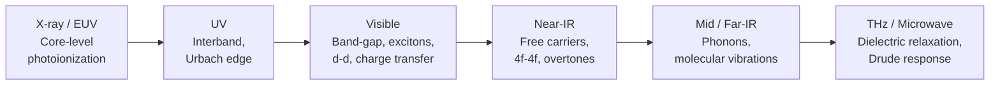
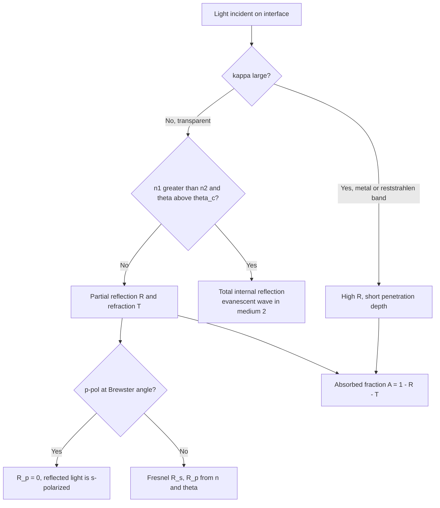

## Refraction, Reflection, and Absorption


### Overview

When an electromagnetic wave meets a material, three primary linear processes determine its fate: **refraction** (bending and slowing of the transmitted wave), **reflection** (return of energy at an interface), and **absorption** (conversion of wave energy into other forms, such as heat, electron-hole pairs, or luminescence). A fourth process, scattering, is treated here as a departure from ideal homogeneous behavior.

For a slab or interface, energy conservation gives:

$$R + A + T = 1$$

with reflectance $R$, absorptance $A$, and transmittance $T$ (scattered light is folded into $R$ or $A$ depending on how it is collected).

**Key Points**

- All three processes are encoded in one quantity, the complex refractive index $\tilde{n} = n + i\kappa$, or equivalently the complex dielectric function $\tilde{\varepsilon} = \varepsilon_1 + i\varepsilon_2$.
- Refraction is set mainly by $n$ (real part, phase velocity); absorption is set by $\kappa$ (imaginary part, attenuation); reflection depends on both, and on polarization and angle.
- Causality links the real and imaginary parts through the Kramers–Kronig relations, so strong absorption bands always produce dispersion in $n$ nearby.
- The photon energy $E = h\nu = hc/\lambda$ (practically $E\,[\mathrm{eV}] \approx 1.2398/\lambda\,[\mu\mathrm{m}]$) determines which microscopic mechanism dominates.

### Wave Propagation in Matter

#### Complex Index and Dielectric Function

A plane wave propagating along $z$ in a medium is:

$$E(z,t) = E_0\, \exp\!\left[i\left(\tilde{k}z - \omega t\right)\right], \qquad \tilde{k} = \dfrac{\omega}{c}\,\tilde{n} = \dfrac{\omega}{c}(n + i\kappa)$$

Substituting gives a propagating wave with an exponentially decaying envelope:

$$E(z,t) = E_0\, e^{-\omega\kappa z/c}\, \exp\!\left[i\omega\left(\dfrac{nz}{c} - t\right)\right]$$

The relations between the index and the dielectric function (non-magnetic medium, $\mu_r = 1$) are:

$$\tilde{n}^2 = \tilde{\varepsilon}, \qquad \varepsilon_1 = n^2 - \kappa^2, \qquad \varepsilon_2 = 2n\kappa$$


$$n = \sqrt{\dfrac{\sqrt{\varepsilon_1^2 + \varepsilon_2^2} + \varepsilon_1}{2}}, \qquad \kappa = \sqrt{\dfrac{\sqrt{\varepsilon_1^2 + \varepsilon_2^2} - \varepsilon_1}{2}}$$

#### Phase Velocity, Group Velocity, and Group Index

$$v_p = \dfrac{c}{n}, \qquad v_g = \dfrac{c}{n_g}, \qquad n_g = n - \lambda\dfrac{dn}{d\lambda}$$

The group index $n_g$ governs pulse propagation and time delay in optical fibers and waveguides; it exceeds $n$ in regions of normal dispersion ($dn/d\lambda < 0$).

#### Polarization and the Origin of $n$

The refractive index arises from the induced polarization of the medium. For a dilute medium of $N$ polarizable units per unit volume:

$$n^2 \approx 1 + \dfrac{N\alpha_p}{\varepsilon_0}$$

and for dense media the Clausius–Mossotti relation applies:

$$\dfrac{n^2 - 1}{n^2 + 2} = \dfrac{N\alpha_p}{3\varepsilon_0}$$

This links index to density and atomic/ionic polarizability, which explains why heavy, highly polarizable ions ($\mathrm{Pb^{2+}}$, $\mathrm{Bi^{3+}}$, $\mathrm{Tl^+}$, $\mathrm{Ti^{4+}}$) raise $n$ in glasses, while small, weakly polarizable ions such as $\mathrm{F^-}$ and $\mathrm{Li^+}$ lower it.

The **Lorentz–Lorenz molar refraction** is a practical form:

$$R_m = \dfrac{n^2 - 1}{n^2 + 2}\,\dfrac{M}{\rho}$$

where $M$ is molar mass and $\rho$ is density. Molar refraction is approximately additive over constituent ions or bonds, enabling composition-based index prediction for glasses.

### Refraction

#### Snell's Law and Ray Geometry

At an interface between media of index $n_1$ and $n_2$:

$$n_1\sin\theta_1 = n_2\sin\theta_2$$

This follows from continuity of the tangential wavevector component across the boundary.

- If $n_2 > n_1$, the ray bends toward the normal.
- If $n_2 < n_1$, the ray bends away, and above the critical angle $\theta_c = \arcsin(n_2/n_1)$ total internal reflection (TIR) occurs.

During TIR, an **evanescent wave** decays in the lower-index medium with penetration depth:

$$d_p = \dfrac{\lambda}{2\pi\sqrt{n_1^2\sin^2\theta_1 - n_2^2}}$$

Evanescent fields are used in attenuated total reflection (ATR) spectroscopy, fiber sensors, and frustrated-TIR couplers.

#### Refractive Index Ranges of Common Materials

| Material | $n$ (approx., $\lambda \approx 589\ \mathrm{nm}$) | Notes |
| --- | --- | --- |
| Air (STP) | 1.0003 | Reference |
| $\mathrm{MgF_2}$ | 1.38 | Low-index AR coating |
| Fused silica | 1.458 | Low dispersion, UV to near-IR |
| PMMA | 1.49 | Polymer optics |
| Crown glass (BK7) | 1.517 | $V_d \approx 64$ |
| Polycarbonate | 1.585 | High-impact lenses |
| Dense flint glass (SF11) | 1.785 | $V_d \approx 26$ |
| Sapphire ($\mathrm{Al_2O_3}$) | 1.77 | Birefringent, hard |
| Cubic zirconia | 2.15 | Gem simulant |
| Diamond | 2.417 | High dispersion, high brilliance |
| $\mathrm{TiO_2}$ (rutile) | 2.6–2.9 | Birefringent, pigment |
| Silicon (at $1.55\ \mu\mathrm{m}$) | 3.48 | IR optics, photonics |
| Germanium (at $10\ \mu\mathrm{m}$) | 4.0 | Thermal imaging |

Values are representative; the exact index varies with wavelength, temperature, composition, and grade.

#### Dispersion

**Normal dispersion** (index decreasing with wavelength in transparent regions) is captured by the Sellmeier equation:

$$n^2(\lambda) = 1 + \sum_{j=1}^{3}\dfrac{B_j\,\lambda^2}{\lambda^2 - C_j}$$

where $C_j$ are squared resonance wavelengths. Near an absorption line, **anomalous dispersion** occurs ($dn/d\lambda > 0$).

Glass classification uses the Abbe number:

$$V_d = \dfrac{n_d - 1}{n_F - n_C}$$

Chromatic aberration of a thin lens scales inversely with $V_d$; achromatic doublets pair a crown (high $V_d$) with a flint (low $V_d$) element.

The temperature dependence of index is described by the thermo-optic coefficient:

$$\dfrac{dn}{dT} = \dfrac{(n^2-1)(n^2+2)}{6n}\left(\dfrac{1}{\alpha_{pol}}\dfrac{d\alpha_{pol}}{dT} - 3\alpha_L\right) + \text{(band-gap contribution)}$$

Here $\alpha_L$ is the linear thermal expansion coefficient. [Inference] The sign of $dn/dT$ in a given glass reflects the competition between thermal expansion (lowers density, lowers $n$) and the temperature shift of electronic polarizability (raises $n$); athermal glasses are engineered to balance these terms.

#### Birefringence

In anisotropic crystals, $n$ depends on polarization and propagation direction. For uniaxial crystals:

$$\Delta n = n_e - n_o$$

Double refraction splits an unpolarized beam into ordinary and extraordinary rays. The retardation of a plate of thickness $d$ is:

$$\Gamma = \dfrac{2\pi\,\Delta n\,d}{\lambda}$$

Examples: calcite ($\Delta n \approx -0.17$), quartz ($\approx +0.009$), rutile ($\approx +0.29$).

### Reflection

#### Fresnel Equations

For light incident from a medium of index $n_1$ onto a medium of index $n_2$, with incidence angle $\theta_i$ and transmission angle $\theta_t$, the amplitude coefficients are:

$$r_s = \dfrac{n_1\cos\theta_i - n_2\cos\theta_t}{n_1\cos\theta_i + n_2\cos\theta_t}, \qquad t_s = \dfrac{2n_1\cos\theta_i}{n_1\cos\theta_i + n_2\cos\theta_t}$$


$$r_p = \dfrac{n_2\cos\theta_i - n_1\cos\theta_t}{n_2\cos\theta_i + n_1\cos\theta_t}, \qquad t_p = \dfrac{2n_1\cos\theta_i}{n_2\cos\theta_i + n_1\cos\theta_t}$$

Intensity reflectance and transmittance:

$$R_{s,p} = |r_{s,p}|^2, \qquad T_{s,p} = \dfrac{n_2\cos\theta_t}{n_1\cos\theta_i}\,|t_{s,p}|^2, \qquad R_{s,p} + T_{s,p} = 1$$

For absorbing media, replace $n_2 \to \tilde{n}_2$ and use complex arithmetic with generalized Snell's law.

#### Normal Incidence

$$R = \left|\dfrac{\tilde{n}_2 - n_1}{\tilde{n}_2 + n_1}\right|^2 = \dfrac{(n_2 - n_1)^2 + \kappa_2^2}{(n_2 + n_1)^2 + \kappa_2^2}$$

For a non-absorbing dielectric in air:

$$R = \left(\dfrac{n-1}{n+1}\right)^2$$

Two consequences follow. First, high-index materials lose substantial light to Fresnel reflection (silicon: about $31\%$ per surface; germanium: about $36\%$), which is why antireflection coatings are essential in IR optics and solar cells. Second, near a strong absorption band, $\kappa$ becomes large and $R$ approaches unity, producing the **reststrahlen** high-reflectance band of ionic crystals and the metallic reflectance of conductors.

#### Angular Dependence and Brewster's Angle

At the Brewster angle,

$$\theta_B = \arctan\!\left(\dfrac{n_2}{n_1}\right)$$

$r_p = 0$ for a lossless dielectric, so reflected light is purely $s$-polarized. Applications include Brewster windows in gas lasers, polarizing beam splitters, and glare-reduction filters.

At grazing incidence ($\theta_i \to 90^\circ$), $R_s, R_p \to 1$ for all materials, exploited in X-ray and EUV grazing-incidence optics.

#### Phase Changes on Reflection

- External reflection ($n_2 > n_1$): $r_s < 0$, phase shift of $\pi$ (for $\theta_i < \theta_B$ in $p$ polarization, sign conventions vary).
- Internal reflection ($n_2 < n_1$): no phase shift below $\theta_c$; above $\theta_c$ (TIR), a polarization-dependent phase shift arises, the basis of Fresnel rhombs.

#### Specular vs. Diffuse Reflection

- **Specular reflection** occurs from smooth surfaces ($\sigma_{rms} \ll \lambda$). The Rayleigh roughness criterion states a surface is optically smooth when:

$$\sigma_{rms} < \dfrac{\lambda}{8\cos\theta_i}$$

- **Diffuse (Lambertian) reflection** results from rough or multiple-scattering surfaces, with radiance independent of viewing angle. Total integrated scatter is approximated by:

$$\mathrm{TIS} \approx \left(\dfrac{4\pi\,\sigma_{rms}\cos\theta_i}{\lambda}\right)^2$$

valid for $\sigma_{rms} \ll \lambda$.

#### Reflection from Metals

Using the Drude model,

$$\tilde{\varepsilon}(\omega) = \varepsilon_\infty - \dfrac{\omega_p^2}{\omega^2 + i\gamma\omega}, \qquad \omega_p = \sqrt{\dfrac{N e^2}{\varepsilon_0 m^*}}$$

- For $\omega < \omega_p$ (and $\omega \gg \gamma$), $\varepsilon_1 < 0$: the wave is evanescent inside the metal and reflectance is high.
- For $\omega > \omega_p$, the metal becomes transparent (alkali metals in the UV).
- Interband transitions shape color: gold absorbs above about $2.4\ \mathrm{eV}$ (yellow), copper above about $2.1\ \mathrm{eV}$ (reddish), while silver (interband onset near $3.9\ \mathrm{eV}$) and aluminum reflect nearly uniformly across the visible.

The skin depth is:

$$\delta = \dfrac{c}{\omega\kappa} = \sqrt{\dfrac{2}{\mu_0\sigma\omega}}\quad(\text{good conductor, low frequency})$$

Typically $\delta \sim 10$–$30\ \mathrm{nm}$ for noble metals in the visible.

#### Antireflection and High-Reflectance Coatings

Quarter-wave single-layer AR coating on a substrate of index $n_s$ in air requires:

$$n_f d = \dfrac{\lambda_0}{4}, \qquad n_f = \sqrt{n_0 n_s}$$

For $\mathrm{MgF_2}$ ($n_f \approx 1.38$) on glass ($n_s \approx 1.52$), the residual reflectance at the design wavelength is:

$$R_{min} = \left(\dfrac{n_f^2 - n_0 n_s}{n_f^2 + n_0 n_s}\right)^2 \approx 1.3\%$$

Multilayer quarter-wave stacks of alternating high/low index materials give broadband or narrowband high reflectors. For $N$ periods of ($H$,$L$) on a substrate (air-incident, starting and ending with $H$):

$$R = \left(\dfrac{1 - \dfrac{n_H^2}{n_s}\left(\dfrac{n_H}{n_L}\right)^{2N}\!\!\cdot\dfrac{1}{n_H^2}\,n_s\cdot n_s^{\,0}}{1 + \cdots}\right)^2$$

[Unverified] Closed-form expressions for stack reflectance vary in notation with layer ordering; the transfer-matrix method is the reliable general approach. The stop-band width for a quarter-wave stack is:

$$\Delta\lambda_0 = \dfrac{4\lambda_0}{\pi}\arcsin\!\left(\dfrac{n_H - n_L}{n_H + n_L}\right)$$

The **transfer matrix method** for layer $j$ with phase thickness $\delta_j = 2\pi\,n_j d_j\cos\theta_j/\lambda$:

$$M_j = \begin{pmatrix}\cos\delta_j & \dfrac{i}{\eta_j}\sin\delta_j \\ i\,\eta_j\sin\delta_j & \cos\delta_j\end{pmatrix}, \qquad \begin{pmatrix}B\\C\end{pmatrix} = \left(\prod_j M_j\right)\begin{pmatrix}1\\ \eta_s\end{pmatrix}$$

with optical admittances $\eta_j = n_j\cos\theta_j$ ($s$) or $n_j/\cos\theta_j$ ($p$), and reflectance:

$$R = \left|\dfrac{\eta_0 B - C}{\eta_0 B + C}\right|^2$$

### Absorption

#### Beer–Lambert Law

The absorption coefficient is related to the extinction coefficient by:

$$\alpha = \dfrac{4\pi\kappa}{\lambda_0} = \dfrac{2\omega\kappa}{c}$$

Intensity attenuates as:

$$I(x) = I_0\,e^{-\alpha x}$$

The penetration depth is $\delta_p = 1/\alpha$. In spectrophotometry, decadic absorbance is $A_{10} = -\log_{10}T = \alpha d/\ln 10 \approx 0.434\,\alpha d$. For dilute solutions or doped solids:

$$A_{10} = \varepsilon_{mol}\,c_{mol}\,d$$

with molar absorptivity $\varepsilon_{mol}$ (not to be confused with the dielectric function).

For a slab with two surfaces and incoherent multiple reflections:

$$T = \dfrac{(1-R)^2\,e^{-\alpha d}}{1 - R^2\,e^{-2\alpha d}}$$

If the slab is thin and weakly absorbing so that coherent interference occurs, Fabry–Pérot fringes appear with free spectral range $\Delta\lambda \approx \lambda^2/(2nd)$.

**Example: Transmittance of a Silicon Wafer**

Consider a $500\ \mu\mathrm{m}$ silicon wafer at $\lambda = 1550\ \mathrm{nm}$ (below the band gap), with $n = 3.48$ and negligible absorption. Then:

$$R = \left(\dfrac{3.48-1}{3.48+1}\right)^2 = 0.306$$


$$T = \dfrac{(1-R)^2}{1-R^2} = \dfrac{1-R}{1+R} = \dfrac{0.694}{1.306} = 0.531$$

So only about $53\%$ is transmitted (about $47\%$ reflected in total) despite zero absorption. Adding a single-layer AR coating on each face can raise $T$ above $95\%$ near the design wavelength.

#### Microscopic Absorption Mechanisms

The spectral location of absorption depends on the excitation involved:

| Spectral region | Mechanism | Typical materials |
| --- | --- | --- |
| X-ray / EUV | Core-level ionization (photoelectric) | All materials |
| UV | Interband transitions, Urbach edge | Wide-gap insulators, semiconductors |
| Visible | Band-gap, excitons, crystal-field ($d$–$d$), charge transfer, color centers | Semiconductors, gemstones, glasses |
| Near-IR | Free carriers, overtones, rare-earth $4f$ transitions | Doped semiconductors, glasses |
| Mid/Far-IR | Optical phonons, molecular vibrations | Ionic crystals, polymers, glasses |
| THz / microwave | Dielectric relaxation, free-carrier (Drude) | Polar dielectrics, metals |

#### Interband Absorption and Band-Gap Determination

Photons with $h\nu \ge E_g$ excite electrons across the gap. Near the edge,

$$\alpha(h\nu) = \dfrac{A\,(h\nu - E_g)^{m}}{h\nu}$$

with $m = 1/2$ (direct allowed), $3/2$ (direct forbidden), $2$ (indirect allowed, with phonon energy $\pm E_p$ terms), and $3$ (indirect forbidden).

The **Tauc** procedure plots $(\alpha h\nu)^{1/m}$ against $h\nu$ and extrapolates the linear region to the energy axis to obtain $E_g$. For scattering powders, the Kubelka–Munk function replaces $\alpha$:

$$F(R_\infty) = \dfrac{(1-R_\infty)^2}{2R_\infty} \propto \dfrac{\alpha}{S}$$

with $S$ the scattering coefficient.

Direct-gap materials (GaAs, GaN, CdTe, InP) reach $\alpha \sim 10^4$–$10^5\ \mathrm{cm^{-1}}$ within about $0.1\ \mathrm{eV}$ of the edge; indirect-gap materials (Si, Ge, GaP) rise slowly and require much thicker absorbers (silicon needs tens to hundreds of micrometers).

**Example: Absorption Depth in Silicon (approximate)**

| Wavelength | $\alpha\ (\mathrm{cm^{-1}})$ | $1/\alpha$ |
| --- | --- | --- |
| 400 nm | about $10^5$ | about 0.1 µm |
| 600 nm | about $4\times10^3$ | about 2.5 µm |
| 800 nm | about $10^3$ | about 10 µm |
| 1000 nm | about $60$ | about 170 µm |
| 1100 nm | about $3$ | about 3 mm |

Values are approximate room-temperature figures and depend on temperature and doping.

#### Excitonic and Urbach Absorption

Excitons give discrete absorption lines below the gap, with hydrogenic energies:

$$E_n = E_g - \dfrac{E_b}{n^2}, \qquad E_b = \dfrac{\mu}{m_0\varepsilon_r^2}\,(13.6\ \mathrm{eV})$$

Here $\mu$ is the reduced effective mass. In GaAs, $E_b \approx 4\ \mathrm{meV}$ (visible only at cryogenic temperature); in ZnO, $E_b \approx 60\ \mathrm{meV}$ (stable at room temperature); in perovskites (e.g., $\mathrm{MAPbI_3}$), $E_b$ is a few to tens of meV, with values in the literature depending on measurement method.

The empirical Urbach rule describes the exponential band tail caused by thermal and structural disorder:

$$\alpha(h\nu) = \alpha_0\exp\!\left[\dfrac{\sigma_U\,(h\nu - E_0)}{k_BT}\right]$$

with steepness parameter $\sigma_U$. The width $E_U = k_BT/\sigma_U$ (Urbach energy) is a sensitive indicator of disorder in amorphous semiconductors and glasses.

#### Free-Carrier Absorption

In the Drude picture:

$$\alpha_{fc}(\omega) = \dfrac{\omega_p^2\,\gamma}{n\,c\,(\omega^2+\gamma^2)} \xrightarrow{\ \omega\gg\gamma\ } \dfrac{N e^2}{\varepsilon_0\,m^*\,n\,c\,\tau\,\omega^2}$$

where $\tau = 1/\gamma$ is the scattering time. Empirically $\alpha_{fc}\propto\lambda^{p}$ with $p \approx 1.5$–$3.5$ depending on the scattering mechanism. This is why heavily doped semiconductors and TCOs become opaque in the IR beyond a plasma edge while remaining transparent in the visible.

#### Phonon and Molecular Vibration Absorption

Infrared-active phonons absorb strongly in ionic and covalent-polar solids. The dielectric response near a transverse optical (TO) resonance:

$$\tilde{\varepsilon}(\omega) = \varepsilon_\infty + \dfrac{(\varepsilon_0 - \varepsilon_\infty)\,\omega_{TO}^2}{\omega_{TO}^2 - \omega^2 - i\Gamma\omega}$$

The reststrahlen band spans $\omega_{TO} < \omega < \omega_{LO}$, where $\varepsilon_1 < 0$ and reflectance is high. The Lyddane–Sachs–Teller relation connects the frequencies to static and high-frequency dielectric constants:

$$\dfrac{\varepsilon_0}{\varepsilon_\infty} = \dfrac{\omega_{LO}^2}{\omega_{TO}^2}$$

Multiphonon absorption sets the long-wavelength transmission cutoff, which depends on bond strength and ion mass: fused silica (about $3.5\ \mu\mathrm{m}$), sapphire (about $5.5\ \mu\mathrm{m}$), ZnSe (about $16\ \mu\mathrm{m}$), KBr (about $25\ \mu\mathrm{m}$), CsI (about $50\ \mu\mathrm{m}$), diamond (windows with some two-phonon absorption near $2.5$–$7\ \mu\mathrm{m}$ but otherwise broad).

#### Impurity, Defect, and Ion-Related Absorption

- **Transition-metal ions**: crystal-field splitting of $3d$ levels yields color. $\mathrm{Cr^{3+}}$ in $\mathrm{Al_2O_3}$ (ruby, red) vs. in $\mathrm{Be_3Al_2Si_6O_{18}}$ (emerald, green) differ because of the crystal-field strength $10Dq$.
- **Rare-earth ions**: sharp $4f$–$4f$ lines (shielded by $5s$, $5p$ shells), used in laser glasses and amplifiers: $\mathrm{Nd^{3+}}$ (1064 nm), $\mathrm{Er^{3+}}$ (1550 nm), $\mathrm{Yb^{3+}}$ (about 1030 nm), $\mathrm{Tm^{3+}}$ (about 1.9 µm).
- **Charge-transfer absorption**: e.g., $\mathrm{Fe^{2+}\!\to Ti^{4+}}$ intervalence charge transfer gives blue sapphire; $\mathrm{O^{2-}\!\to Fe^{3+}}$ gives iron-oxide pigments.
- **Color centers**: F-centers (electron at anion vacancy) in alkali halides; radiation-induced solarization in glasses.
- **Hydroxyl**: $\mathrm{OH^-}$ overtone near $1.38\ \mu\mathrm{m}$ and combination bands near $2.2\ \mu\mathrm{m}$, fundamental near $2.7\ \mu\mathrm{m}$, a major loss source in silica fibers, mitigated by dry processing.

#### Two-Photon and Saturable Absorption

At high intensity, absorption becomes nonlinear:

$$\dfrac{dI}{dz} = -\alpha I - \beta I^2$$

with two-photon absorption coefficient $\beta$, relevant when $E_g/2 < h\nu < E_g$. Saturable absorption reduces $\alpha$ at high intensity:

$$\alpha(I) = \dfrac{\alpha_0}{1 + I/I_{sat}}$$

Applications include passive mode-locking (semiconductor saturable absorber mirrors, SESAMs, graphene absorbers) and optical limiting.

### Kramers–Kronig and the Unity of $n$ and $\kappa$

Because the material response is causal, $n(\omega)$ and $\kappa(\omega)$ are not independent:

$$n(\omega) - 1 = \dfrac{2}{\pi}\,\mathcal{P}\!\int_0^\infty\dfrac{\omega'\,\kappa(\omega')}{\omega'^2 - \omega^2}\,d\omega'$$


$$\kappa(\omega) = -\dfrac{2\omega}{\pi}\,\mathcal{P}\!\int_0^\infty\dfrac{n(\omega') - 1}{\omega'^2 - \omega^2}\,d\omega'$$

Practical implications:

- A measured reflectance spectrum over a broad range yields $n$ and $\kappa$ via the Kramers–Kronig phase retrieval $\theta(\omega) = -\dfrac{\omega}{\pi}\,\mathcal{P}\!\int_0^\infty \dfrac{\ln R(\omega')}{\omega'^2 - \omega^2}\,d\omega'$.
- Any absorption band implies dispersion of $n$ around it (anomalous dispersion inside the band, normal on the flanks).
- A sum rule holds: $\displaystyle\int_0^\infty\omega\,\varepsilon_2(\omega)\,d\omega = \dfrac{\pi}{2}\,\omega_{p}^2$ where $\omega_p$ is computed from the total valence electron density.

### Combined Effects: Absorbing Films and Interfaces

For a thin absorbing film on a substrate, all three processes interact through interference. The reflectance at normal incidence from a single film (index $\tilde{n}_1$, thickness $d$) on a substrate $\tilde{n}_2$ in ambient $n_0$ is:

$$r = \dfrac{r_{01} + r_{12}\,e^{-2i\beta}}{1 + r_{01}\,r_{12}\,e^{-2i\beta}}, \qquad \beta = \dfrac{2\pi\,\tilde{n}_1\,d}{\lambda}, \quad r_{ij} = \dfrac{\tilde{n}_i - \tilde{n}_j}{\tilde{n}_i + \tilde{n}_j}$$


$$R = |r|^2$$

Because $\beta$ is complex for absorbing films, the interference term is damped by $e^{-2\,\mathrm{Im}(\beta)} = e^{-\alpha d}$, and $A = 1 - R - T$ can be spectrally engineered to create **perfect absorbers** (Salisbury screens, metal-insulator-metal metasurfaces, and ultrathin lossy films on metal that reach near-unity absorption when critical-coupling conditions are met).

**Example: Python Calculation of $R$, $T$, $A$ for an Absorbing Slab**

```python
import numpy as np

def slab_RTA(n, kappa, d_nm, wavelength_nm, n0=1.0, ns=1.0):
    """Coherent normal-incidence R, T, A for a single absorbing slab
    (index n + i*kappa) between ambient n0 and substrate ns."""
    ntilde = n + 1j * kappa
    lam = wavelength_nm
    d = d_nm
    beta = 2 * np.pi * ntilde * d / lam                  # complex phase thickness

    r01 = (n0 - ntilde) / (n0 + ntilde)
    r12 = (ntilde - ns) / (ntilde + ns)
    t01 = 2 * n0 / (n0 + ntilde)
    t12 = 2 * ntilde / (ntilde + ns)

    denom = 1 + r01 * r12 * np.exp(-2j * beta)
    r = (r01 + r12 * np.exp(-2j * beta)) / denom
    t = t01 * t12 * np.exp(-1j * beta) / denom

    R = np.abs(r) ** 2
    T = (ns / n0) * np.abs(t) ** 2                       # real ns and n0 assumed
    A = 1 - R - T
    return R, T, A

# Example: 100 nm film, n = 2.5, kappa = 0.4 at 600 nm, in air on a glass-like substrate
R, T, A = slab_RTA(2.5, 0.4, 100, 600, n0=1.0, ns=1.5)
print(f"R = {R:.3f}, T = {T:.3f}, A = {A:.3f}")
```

**Output**

The function returns the three fractions summing to one. The specific numbers depend on the chosen film parameters; sweeping `wavelength_nm` or `d_nm` reveals interference fringes whose contrast diminishes as $\kappa$ grows. [Inference] For weakly absorbing films, the fringe positions can be used to estimate thickness, while fringe damping reveals $\alpha$.

### Scattering as a Departure from Ideal Behavior

In real materials, refraction, reflection, and absorption are supplemented by scattering from inhomogeneities:

| Regime | Size parameter $x = 2\pi r/\lambda$ | Dependence | Example |
| --- | --- | --- | --- |
| Rayleigh | $x \ll 1$ | $\sigma_s \propto \lambda^{-4}$ | Fiber loss, blue sky |
| Mie | $x \sim 1$ | Oscillatory, forward-peaked | White paint, opal glass |
| Geometric | $x \gg 1$ | Weakly wavelength-dependent | Large pores, bubbles |

Rayleigh scattering by small spheres of relative index $m$:

$$\sigma_s = \dfrac{8\pi}{3}\,k^4 r^6\left(\dfrac{m^2-1}{m^2+2}\right)^2$$

The effective attenuation coefficient combines absorption and scattering:

$$\alpha_{ext} = \alpha_{abs} + \alpha_{sca}$$

Transparent polycrystalline ceramics need residual porosity below about $0.01\%$, grain-boundary phases removed, and either cubic symmetry ($\mathrm{Y_2O_3}$, $\mathrm{MgAl_2O_4}$, YAG, AlON) or grain sizes well below $\lambda$ for birefringent materials such as $\mathrm{Al_2O_3}$.

### Diagrams

#### Reflection and Refraction at an Interface

<svg xmlns="http://www.w3.org/2000/svg" viewBox="0 0 760 420" width="760" height="420" font-family="Arial, Helvetica, sans-serif">
<title>Reflection and refraction at an interface (svg_diagram)</title>
<text x="380" y="26" text-anchor="middle" font-size="18" font-weight="bold" fill="#222">Reflection and Refraction at an Interface (svg_diagram)</text>
<rect x="60" y="60" width="640" height="150" fill="#f8f9fa" stroke="none" />
<rect x="60" y="210" width="640" height="150" fill="#d0ebff" stroke="none" />
<line x1="60" y1="210" x2="700" y2="210" stroke="#1c7ed6" stroke-width="2" />
<line x1="380" y1="70" x2="380" y2="350" stroke="#868e96" stroke-width="1.5" stroke-dasharray="6,4" />
<text x="392" y="82" font-size="13" fill="#495057">Normal</text>
<text x="75" y="85" font-size="14" fill="#495057">Medium 1: n₁</text>
<text x="75" y="345" font-size="14" fill="#1864ab">Medium 2: n₂ &gt; n₁ (complex ñ₂ = n₂ + iκ₂)</text>
<line x1="200" y1="90" x2="380" y2="210" stroke="#d9480f" stroke-width="3" marker-end="url(#a1)" />
<text x="150" y="80" font-size="14" fill="#d9480f">Incident (θ₁)</text>
<line x1="380" y1="210" x2="560" y2="90" stroke="#2b8a3e" stroke-width="3" stroke-dasharray="7,4" marker-end="url(#a1)" />
<text x="520" y="80" font-size="14" fill="#2b8a3e">Reflected (θᵣ = θ₁)</text>
<line x1="380" y1="210" x2="480" y2="340" stroke="#5f3dc4" stroke-width="3" marker-end="url(#a1)" />
<text x="490" y="330" font-size="14" fill="#5f3dc4">Refracted (θ₂)</text>
<path d="M380,170 A40,40 0 0 0 350,178" fill="none" stroke="#d9480f" stroke-width="1.5" />
<text x="335" y="165" font-size="13" fill="#d9480f">θ₁</text>
<path d="M380,250 A40,40 0 0 0 402,246" fill="none" stroke="#5f3dc4" stroke-width="1.5" />
<text x="392" y="272" font-size="13" fill="#5f3dc4">θ₂</text>
<text x="380" y="392" text-anchor="middle" font-size="14" fill="#222">Snell: n₁ sin θ₁ = n₂ sin θ₂ | Amplitude decays as e^(−αx) inside the absorbing medium</text>
</svg>

#### Absorption Mechanisms Across the Spectrum



#### Decision Flow for Interface Behavior



### Measurement Techniques

| Property | Technique | Notes |
| --- | --- | --- |
| Refractive index | Abbe refractometer, prism coupler, minimum-deviation goniometry | Index to about $10^{-5}$ with goniometry |
| $n$, $\kappa$, thickness | Spectroscopic ellipsometry | Measures $\rho = r_p/r_s = \tan\Psi\,e^{i\Delta}$; requires optical model |
| $R(\lambda)$, $T(\lambda)$ | UV-Vis-NIR spectrophotometer with integrating sphere | Distinguishes specular from diffuse components |
| Absorption coefficient | Transmission + reflection correction; photothermal deflection spectroscopy; photoacoustic; PDS for weak absorption below $10^{-1}\ \mathrm{cm^{-1}}$ | Calorimetry (laser calorimetry) for ppm-level absorption |
| Band gap | Tauc/Kubelka–Munk, photoluminescence, modulation spectroscopy | Distinguish direct vs. indirect via power-law exponent |
| Vibrational absorption | FTIR (transmission, ATR, diffuse reflectance) | ATR uses evanescent wave at TIR |
| Birefringence | Polarimetry, Sénarmont compensation, crossed polarizers | Stress mapping in glass |
| Surface scatter | Total integrated scatter, BRDF | Roughness, contamination |

### Practical Design Guidelines

- **Minimize reflection losses**: apply AR coatings (single-layer $\mathrm{MgF_2}$, multilayer $\mathrm{SiO_2/TiO_2}$, or graded-index/moth-eye nanostructures for broadband, wide-angle performance).
- **Maximize reflection**: use protected silver or aluminum for broadband metal mirrors ($R \approx 95$–$99\%$ across visible/IR), enhanced with dielectric overlayers; use dielectric Bragg stacks for $R > 99.9\%$ at a laser wavelength.
- **Select windows by transparency range**: match the electronic edge (UV limit) and multiphonon edge (IR limit) to the application, balancing hardness, thermal shock, and cost.
- **Control absorption by doping and purity**: minimize transition-metal ($\mathrm{Fe}$, $\mathrm{Cr}$, $\mathrm{Cu}$) and $\mathrm{OH^-}$ contamination in fiber and laser glasses; conversely, introduce absorbers deliberately for filters, sunglasses (neutral or photochromic $\mathrm{AgCl}$ glass), and laser safety eyewear.
- **Manage heating**: absorbed power density $\dot{q} = \alpha I$ drives thermal lensing ($\Delta n = (dn/dT)\Delta T$) and stress; high-power optics require $\alpha < 10^{-4}\ \mathrm{cm^{-1}}$ (ppm-level absorption).
- **Account for temperature and wavelength**: $n$, $\kappa$, and band edges shift with temperature (band gaps generally narrow with heating, and the Varshni relation $E_g(T) = E_g(0) - \dfrac{aT^2}{T+b}$ describes the trend).

**Common Pitfalls**

- Treating $R = ((n-1)/(n+1))^2$ as valid for absorbing materials or metals; the $\kappa$ term must be included.
- Confusing decadic absorbance with the natural-log absorption coefficient $\alpha$ (factor of $\ln 10 \approx 2.303$).
- Ignoring multiple reflections and substrate contributions when extracting $\alpha$ from transmission of thin films.
- Applying Tauc analysis with the wrong transition exponent (direct vs. indirect), which shifts the estimated $E_g$ substantially.
- Using catalog index values at a wavelength or temperature different from the operating point.
- Neglecting polarization and angle in high-NA or oblique-incidence systems, where $R_s \ne R_p$.
- Overlooking birefringence and stress-induced index variations in molded polymer or heavily processed glass optics.

**Conclusion**

Refraction, reflection, and absorption are three facets of a single physical response captured by the complex refractive index $\tilde{n}(\omega)$. Refraction reflects how the medium's polarization slows and redirects light; reflection arises from the impedance mismatch $\Delta\tilde{n}$ at interfaces; and absorption converts field energy into electronic, vibrational, or thermal excitations. Kramers–Kronig causality couples them, so engineering one (e.g., through doping, alloying, nanostructuring, or coating) inevitably reshapes the others. Mastery of these relationships underpins the design of lenses, windows, fibers, solar absorbers, mirrors, filters, and sensors.

**Related Topics**

- Transmission and scattering in glasses and ceramics
- Dispersion engineering and glass selection (Abbe diagrams)
- Thin-film optics and transfer-matrix design
- Ellipsometry and optical-constant extraction
- Band structure, excitons, and interband transitions
- Plasmonics and free-electron optics
- Infrared and THz optical materials
- Nonlinear absorption and optical limiting
- Photovoltaic absorber design and light trapping
- Anti-reflective and structured surfaces
- Birefringent materials and polarization optics
- Laser-induced damage and absorption-driven thermal effects