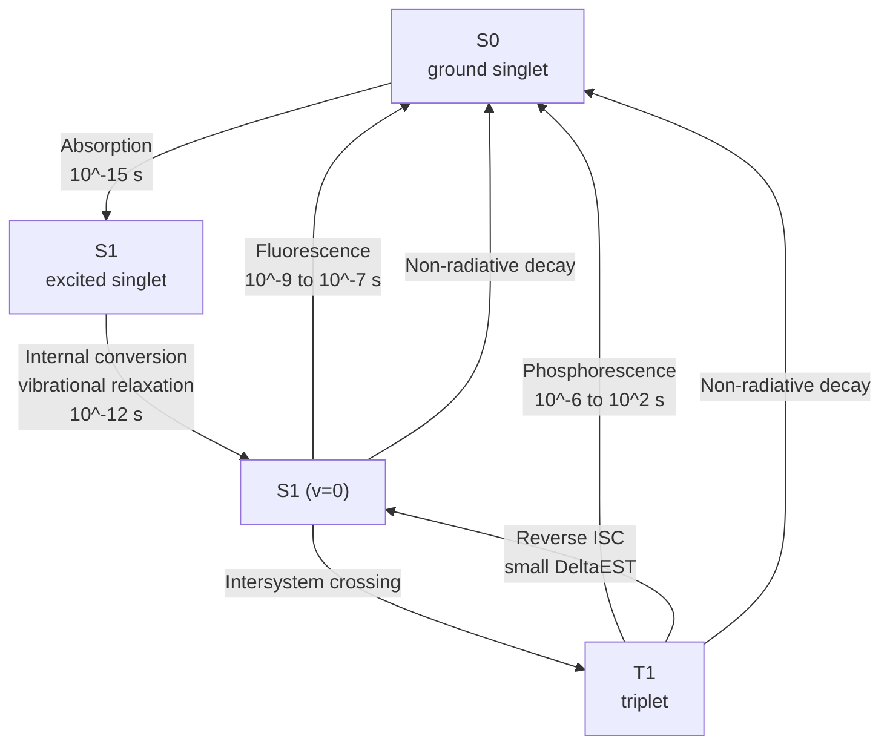
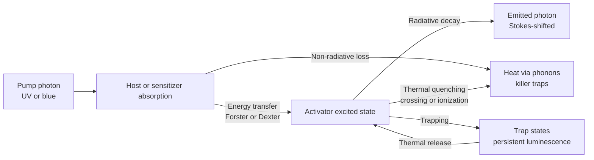
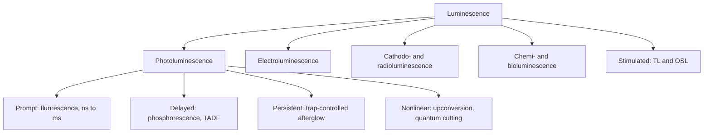

## Luminescence and Photoluminescence


### Overview

**Luminescence** is the emission of light from a material that is not caused by heating alone (i.e., it is "cold light" in excess of thermal blackbody radiation). It occurs when a material absorbs energy, promoting it to an excited state, and then relaxes with the emission of photons. **Photoluminescence (PL)** is the subset in which the excitation source is light (photons).

The type of luminescence is named for the excitation mechanism:

| Type | Excitation source | Example |
| --- | --- | --- |
| Photoluminescence (PL) | Photons | Phosphors, quantum dots, fluorescent dyes |
| Electroluminescence (EL) | Electric field or current | LEDs, OLEDs, ZnS:Cu AC panels |
| Cathodoluminescence (CL) | Electron beam | CRT phosphors, SEM-CL mapping |
| Radioluminescence | Ionizing radiation ($\gamma$, X-ray, $\alpha$, $\beta$) | Scintillators (NaI:Tl, LYSO:Ce) |
| Thermoluminescence (TL) | Heating after prior irradiation | Dosimetry (LiF:Mg,Ti), dating |
| Optically stimulated luminescence (OSL) | Light stimulation after irradiation | Retrospective dosimetry, sediment dating |
| Chemiluminescence / bioluminescence | Chemical reaction | Luminol, luciferase |
| Mechanoluminescence / triboluminescence | Mechanical stress | $\mathrm{SrAl_2O_4{:}Eu}$ stress sensors |
| Sonoluminescence | Acoustic cavitation | Bubble collapse in liquids |

**Key Points**

- PL is a three-stage process: absorption, relaxation (thermalization and possible energy transfer), and emission.
- Emission is generally red-shifted from absorption (Stokes shift) because of vibrational and lattice relaxation.
- Radiative competes with non-radiative decay; the quantum yield $\Phi = k_r/(k_r + k_{nr})$ quantifies this competition.
- Luminescence is distinguished from incandescence by its non-thermal spectral shape and its finite, characteristic decay time.
- Materials science controls PL through composition, host lattice, dopants, defects, size (quantum confinement), surface chemistry, and temperature.

### Fundamental Photophysics

#### Absorption, Emission, and Detailed Processes

Consider an emitter with ground state $|g\rangle$ and excited state $|e\rangle$. The radiative rate is set by the transition dipole moment $\mu_{eg}$ (Fermi's golden rule). The spontaneous emission rate follows from the Einstein $A$ coefficient:

$$A_{eg} = \dfrac{\omega^3\,n\,|\mu_{eg}|^2}{3\pi\varepsilon_0\hbar c^3}$$

and the Strickler–Berg relation links the radiative rate to the integrated absorption band:

$$\dfrac{1}{\tau_r} \approx 2.88\times10^{-9}\,n^2\,\langle\tilde{\nu}_f^{-3}\rangle^{-1}\int\dfrac{\varepsilon(\tilde\nu)}{\tilde\nu}\,d\tilde\nu$$

[Inference] The Strickler–Berg relation holds best for strongly allowed, mirror-symmetric absorption/emission bands and deviates for forbidden transitions or large excited-state geometry changes.

#### Radiative and Non-Radiative Decay

After excitation, the population $N_e(t)$ decays as:

$$\dfrac{dN_e}{dt} = -(k_r + k_{nr})\,N_e \;\Rightarrow\; N_e(t) = N_e(0)\,e^{-t/\tau}, \qquad \tau = \dfrac{1}{k_r + k_{nr}}$$

The **internal quantum efficiency** (quantum yield) is:

$$\Phi = \dfrac{k_r}{k_r + k_{nr}} = \dfrac{\tau}{\tau_r}$$

Non-radiative pathways include:

- **Multiphonon relaxation**: energy gap $\Delta E$ bridged by $p = \Delta E/\hbar\omega_{ph}$ phonons; rate follows the energy-gap law $k_{nr} \approx \beta\,e^{-\alpha_g\Delta E}$ (approximate, with $\alpha_g$ depending on the maximum phonon energy of the host).
- **Thermal quenching** via crossing of parabolas in the configuration-coordinate diagram.
- **Auger recombination**: energy of recombination given to a third carrier ($k_{Auger}\propto n^2$ or $n^3$ dependence on carrier density), dominant at high excitation and in small quantum dots.
- **Trap-assisted (Shockley–Read–Hall) recombination** at defects and interfaces.
- **Concentration quenching**: energy migration among activators to killer sites.
- **Cross-relaxation** among neighboring rare-earth ions (e.g., $\mathrm{Tb^{3+}}$, $\mathrm{Pr^{3+}}$ blue-emission quenching at high doping).
- **Surface and interface quenching**: dangling bonds, adsorbates.

**External quantum efficiency** (EQE) further includes light extraction:

$$\eta_{ext} = \Phi \times \eta_{abs} \times \eta_{extraction}$$

For high-index planar emitters, total internal reflection traps most light; for $n \approx 2.5$, only about $1/(4n^2)$ escapes through one face (about $4\%$ for a simple planar slab).

#### Fluorescence vs. Phosphorescence

Based on the spin multiplicity of the emitting state relative to the ground state:

| Property | Fluorescence | Phosphorescence |
| --- | --- | --- |
| Transition | Spin-allowed ($\Delta S = 0$), e.g., $S_1\to S_0$ | Spin-forbidden ($\Delta S \ne 0$), e.g., $T_1\to S_0$ |
| Lifetime | ps–ns (organic), ns–$\mu$s (many inorganics) | $\mu$s to hours |
| Mechanism | Direct radiative decay | Requires intersystem crossing (ISC), spin–orbit coupling |
| Heavy atoms | Modest effect | Strongly enhanced (Ir, Pt, Pb, Br, I) |

In inorganic solids, the same nomenclature is often replaced by **prompt luminescence** (fast, ns–ms) and **afterglow/persistent luminescence** (slow, seconds to hours, due to trapped carriers released thermally).

### Jablonski Diagram and Related Processes

Organic and molecular emitters are described by the Jablonski diagram, with singlet states $S_0, S_1, S_2$, triplet states $T_1, T_2$, vibrational sublevels, and the transitions:

- Absorption ($\sim10^{-15}$ s)
- Vibrational relaxation and internal conversion ($\sim10^{-12}$ s)
- Fluorescence ($\sim10^{-9}$–$10^{-7}$ s)
- Intersystem crossing ($\sim10^{-10}$–$10^{-8}$ s)
- Phosphorescence ($\sim10^{-6}$–$10^{2}$ s)
- **Thermally activated delayed fluorescence** (TADF): reverse ISC from $T_1$ to $S_1$ when $\Delta E_{ST}$ is small (a few tens of meV to about 0.1 eV), enabling harvesting of triplets in OLEDs.

**Kasha's rule**: emission generally occurs from the lowest excited state of a given multiplicity, regardless of the excitation wavelength, so the emission spectrum is independent of the excitation wavelength (with notable exceptions such as azulene).

### Stokes Shift and the Configuration-Coordinate Model

#### Configuration-Coordinate (CC) Diagram

The energy of an optical center is plotted against a generalized lattice coordinate $Q$ (the breathing mode of the local coordination polyhedron). Ground and excited states are represented as parabolas:

$$E_g(Q) = \tfrac{1}{2}M\omega^2 Q^2, \qquad E_e(Q) = E_0 + \tfrac{1}{2}M\omega^2 (Q - \Delta Q)^2$$

Following the Franck–Condon principle (electronic transitions are vertical since nuclei are much slower than electrons), absorption starts at $Q=0$ and terminates on the excited parabola at a higher vibrational level. Vibrational relaxation brings the system to the excited minimum at $Q = \Delta Q$, after which emission drops vertically to the ground parabola.

The **Stokes shift** is:

$$\Delta E_{Stokes} = 2S\hbar\omega$$

with **Huang–Rhys factor**:

$$S = \dfrac{M\omega\,\Delta Q^2}{2\hbar}$$

- $S \approx 0$–$1$: weak coupling, narrow (line-like) emission with a strong zero-phonon line (e.g., $4f$–$4f$ rare-earth transitions).
- $S \approx 2$–$10$: strong coupling, broad bands with large Stokes shift (e.g., $\mathrm{Ce^{3+}}$ $5d\to4f$, $\mathrm{Eu^{2+}}$ $4f^65d\to4f^7$, $\mathrm{Mn^{2+}}$, $\mathrm{Cr^{3+}}$ in weak fields).

Spectral band shape at low temperature approximates a Poisson distribution of phonon sidebands:

$$I(n) \propto \dfrac{S^n e^{-S}}{n!}$$

The width at temperature $T$ (single-mode approximation):

$$\Gamma(T) = \Gamma(0)\sqrt{\coth\!\left(\dfrac{\hbar\omega}{2k_BT}\right)}$$

#### Thermal Quenching

The crossing point of the excited and ground parabolas provides a non-radiative path with barrier $\Delta E_a$. The temperature-dependent quantum efficiency is commonly described by the Mott–Seitz expression:

$$\dfrac{I(T)}{I(0)} = \dfrac{1}{1 + A\exp\!\left(-\dfrac{\Delta E_a}{k_BT}\right)}$$

$T_{50}$ (temperature at which the intensity falls to $50\%$) is used to compare phosphors; for white-LED phosphors, one needs stable emission up to about $150$–$200\,^\circ\mathrm{C}$. Thermal ionization of the $5d$ electron into the conduction band is another important mechanism in $\mathrm{Ce^{3+}}$ and $\mathrm{Eu^{2+}}$ systems.

### Luminescent Centers in Solids

#### Rare-Earth Ions

Lanthanide ions ($\mathrm{Ln^{3+}}$) emit through **intra-$4f$ transitions** shielded by filled $5s^2 5p^6$ shells. Consequences:

- Narrow lines, nearly host-independent wavelengths.
- Parity-forbidden (Laporte) transitions, mixed weakly by odd-parity crystal-field terms (Judd–Ofelt theory), producing long lifetimes ($\mu$s–ms).
- Low absorption cross-section ($\sim10^{-20}\ \mathrm{cm^2}$), so sensitization via host, charge-transfer band, or a co-dopant is often used.

The Judd–Ofelt oscillator strength for an electric-dipole transition $J\to J'$:

$$f_{ED} = \dfrac{8\pi^2 m_e c\,\bar\nu}{3h(2J+1)}\,\dfrac{(n^2+2)^2}{9n}\sum_{t=2,4,6}\Omega_t\,|\langle\Psi J\|U^{(t)}\|\Psi' J'\rangle|^2$$

with phenomenological parameters $\Omega_2$, $\Omega_4$, $\Omega_6$ that encode the host's influence ($\Omega_2$ is notably sensitive to local asymmetry and covalency).

| Ion | Typical emission | Transition | Applications |
| --- | --- | --- | --- |
| $\mathrm{Eu^{3+}}$ | 590 nm, 611 nm (red) | $^5D_0\to{}^7F_1, {}^7F_2$ | Red phosphors, structural probe |
| $\mathrm{Tb^{3+}}$ | 545 nm (green) | $^5D_4\to{}^7F_5$ | Green phosphors, lamps |
| $\mathrm{Dy^{3+}}$ | 480 nm, 575 nm | $^4F_{9/2}\to{}^6H_{15/2},{}^6H_{13/2}$ | Near-white emitters |
| $\mathrm{Sm^{3+}}$ | 600 nm (orange-red) | $^4G_{5/2}\to{}^6H_{7/2}$ | Orange-red phosphors |
| $\mathrm{Nd^{3+}}$ | 1064 nm | $^4F_{3/2}\to{}^4I_{11/2}$ | Solid-state lasers |
| $\mathrm{Yb^{3+}}$ | 980–1030 nm | $^2F_{5/2}\to{}^2F_{7/2}$ | Lasers, upconversion sensitizer |
| $\mathrm{Er^{3+}}$ | 1530 nm, 550 nm, 660 nm | $^4I_{13/2}\to{}^4I_{15/2}$ etc. | Fiber amplifiers, upconversion |
| $\mathrm{Tm^{3+}}$ | 450 nm, 800 nm, 1.9 µm | $^1D_2\to{}^3F_4$ etc. | Blue phosphors, mid-IR lasers |

Divalent and $5d$-$4f$ emitters ($\mathrm{Ce^{3+}}$, $\mathrm{Eu^{2+}}$) are parity-allowed with lifetimes of tens of ns ($\mathrm{Ce^{3+}}$) to about $1\ \mu\mathrm{s}$ ($\mathrm{Eu^{2+}}$), and their emission color is strongly host-dependent through the **crystal-field splitting** and **nephelauxetic (covalency) effect**. The emission energy of the lowest $5d$ level:

$$E_{5d}(\mathrm{host}) = E_{free\text{-}ion} - D(A) + \text{(Stokes shift)}$$

with the redshift $D(A)$ (Dorenbos' framework) that depends on the coordination environment and can be predicted from the polarizability and covalency of ligands.

**Example: $\mathrm{YAG{:}Ce^{3+}}$ (yellow phosphor for white LEDs)**

- Host: $\mathrm{Y_3Al_5O_{12}}$ (garnet, cubic, $Ia\bar{3}d$).
- Activator: $\mathrm{Ce^{3+}}$ substituting $\mathrm{Y^{3+}}$ in an eight-coordinate dodecahedral site with strong crystal field.
- Absorption around 450 nm (blue $4f\to5d$), emission broad, centered near 530–560 nm, with a lifetime of about $60$–$70$ ns.
- Combining blue InGaN LED emission with YAG:Ce yellow emission yields "white" light with color rendering typically improved by adding red nitride phosphors (e.g., $\mathrm{CaAlSiN_3{:}Eu^{2+}}$).

#### Transition-Metal Ions

$3d$ ions have strongly host-dependent spectra because $3d$ electrons are exposed to the crystal field. Tanabe–Sugano diagrams relate the ratio $Dq/B$ to level positions:

| Ion | Host / site | Emission | Note |
| --- | --- | --- | --- |
| $\mathrm{Cr^{3+}}$ | Strong field (ruby, $\mathrm{Al_2O_3}$) | 694 nm, sharp $^2E\to{}^4A_2$ (R lines) | Ruby laser |
| $\mathrm{Cr^{3+}}$ | Weak field (alexandrite, garnets) | Broad $^4T_2\to{}^4A_2$, 700–850 nm | Tunable NIR |
| $\mathrm{Mn^{2+}}$ | Tetrahedral (ZnS, $\mathrm{Zn_2SiO_4}$) | Green, about 525 nm | Green phosphor |
| $\mathrm{Mn^{2+}}$ | Octahedral | Orange–red | Site-dependent |
| $\mathrm{Mn^{4+}}$ | Octahedral (e.g., $\mathrm{K_2SiF_6{:}Mn^{4+}}$) | Narrow red, about 630 nm | Wide-gamut displays |
| $\mathrm{Ti^{3+}}$ | Sapphire | Broad NIR (650–1100 nm) | Ti:sapphire laser |

#### Ns² Ions (Post-Transition Metals)

$\mathrm{Bi^{3+}}$, $\mathrm{Pb^{2+}}$, $\mathrm{Sn^{2+}}$, $\mathrm{Tl^+}$, $\mathrm{Sb^{3+}}$ exhibit $s^2\to sp$ absorption (A, B, C bands). Emission spans from UV to visible and is widely used in Ca-halophosphate and $\mathrm{Bi^{3+}}$-doped sensitizers. Additionally, $\mathrm{Bi}$ centers in glasses produce broadband near-IR emission (1000–1600 nm), of interest for fiber amplifiers.

#### Color Centers and Defect Luminescence

- **F-centers** in alkali halides (electron at anion vacancy).
- **NV$^-$ centers** in diamond (zero-phonon line 637 nm, spin-dependent PL used in quantum sensing).
- **SiV$^-$** in diamond (737 nm, narrow ZPL).
- **Oxygen vacancies** in $\mathrm{ZnO}$ (broad green band near 500–550 nm) and $\mathrm{TiO_2}$.
- **Self-trapped excitons (STE)** in wide-gap halides and low-dimensional hybrid perovskites, yielding broadband, large Stokes-shifted emission (often white-light emission).
- **Donor–acceptor pair (DAP) recombination** in semiconductors:

$$h\nu_{DAP}(r) = E_g - (E_D + E_A) + \dfrac{e^2}{4\pi\varepsilon_0\varepsilon_r r}$$

where $r$ is the pair separation; closer pairs emit at higher energy and decay faster, producing time-dependent spectral shifts.

### Luminescence in Semiconductors

#### Band-Edge Recombination

Radiative recombination of electron–hole pairs in a direct-gap semiconductor yields a rate:

$$R_{rad} = B\,n\,p, \qquad \text{with } B \sim 10^{-10}\text{–}10^{-9}\ \mathrm{cm^3\,s^{-1}}\ (\text{direct gap})$$

The total recombination rate under steady excitation:

$$\dfrac{dn}{dt} = G - A_{SRH}\,n - B\,n^2 - C\,n^3$$

where $A_{SRH}$ is trap-assisted recombination, $B$ is radiative, and $C$ is Auger. The internal quantum efficiency is:

$$\mathrm{IQE} = \dfrac{Bn^2}{A_{SRH}n + Bn^2 + Cn^3}$$

This **ABC model** explains "efficiency droop" in InGaN LEDs at high current density, where the $Cn^3$ term dominates.

The **Van Roosbroeck–Shockley relation** links emission to absorption at thermal equilibrium:

$$R_{sp}(h\nu) = \dfrac{8\pi\,n^2\,(h\nu)^2}{h^3c^2}\,\alpha(h\nu)\,\exp\!\left(-\dfrac{h\nu}{k_BT}\right)$$

which is used to infer absorption edges from PL spectra and to determine quasi-Fermi level splitting (implied open-circuit voltage) using the generalized Planck law:

$$I_{PL}(h\nu) \propto A(h\nu)\,(h\nu)^2\exp\!\left(-\dfrac{h\nu - \Delta\mu}{k_BT}\right)$$

with $\Delta\mu$ the quasi-Fermi-level splitting (an important metric for photovoltaic absorbers).

#### Excitonic Emission

Free excitons emit at $E_g - E_b$. Bound excitons (to neutral donors $D^0X$ or acceptors $A^0X$) produce sharp lines at slightly lower energy, fingerprints of impurities. Exciton binding energies: GaAs (about 4 meV), GaN (about 25 meV), ZnO (about 60 meV), $\mathrm{MoS_2}$ monolayer (hundreds of meV), and CsPbBr$_3$ (tens of meV).

#### Low-Dimensional Semiconductors

**Quantum confinement** increases the band gap and concentrates oscillator strength:

- 2D quantum wells: $E_n = \dfrac{\hbar^2\pi^2 n^2}{2m^*L^2}$
- Quantum dots (Brus equation for a sphere of radius $R$):

$$E_g(R) \approx E_g^{bulk} + \dfrac{\hbar^2\pi^2}{2R^2}\left(\dfrac{1}{m_e^*}+\dfrac{1}{m_h^*}\right) - \dfrac{1.786\,e^2}{4\pi\varepsilon_0\varepsilon_r R}$$

Size-tunable emission (CdSe: about 2 nm dots emit blue-green, about 6 nm emit red), narrow linewidth (FWHM about $20$–$40$ nm), and high quantum yield (up to near unity with core/shell passivation such as CdSe/ZnS or InP/ZnSe/ZnS).

**Blinking** (intermittent on/off emission) of single QDs stems from charging/Auger processes; suppressed in thick-shell "giant" QDs. **Fluorescence intermittency** follows power-law on/off statistics in many systems.

#### Halide Perovskites

Lead halide perovskites ($\mathrm{CsPbX_3}$, $\mathrm{MAPbX_3}$; $X=\mathrm{Cl,Br,I}$) show high PL quantum yield, narrow emission (FWHM about $12$–$25$ nm in nanocrystals), and composition-tunable band gaps (about $1.5$–$3.1$ eV from I to Cl through mixed halides). Challenges include halide segregation under illumination (Hoke effect) and moisture/thermal instability. Low-dimensional (2D, 0D) perovskites can exhibit self-trapped-exciton-based broad emission.

### Phosphors and Persistent Luminescence

#### Phosphor Requirements for Solid-State Lighting

- Strong absorption at the pump wavelength (near-UV 380–410 nm or blue 450–460 nm)
- High quantum efficiency ($> 90\%$)
- Small Stokes loss (energy conversion efficiency) and narrow emission bands where appropriate (e.g., red phosphors with emission not extending beyond 650 nm to preserve luminous efficacy)
- Thermal stability (low $\Delta E_a$ quenching up to $150$ °C)
- Chemical stability against moisture, oxygen, and high flux

The **Stokes efficiency** is $\eta_{Stokes} = \lambda_{pump}/\lambda_{emit}$; for blue (450 nm) to green (550 nm), $\eta \approx 82\%$, setting an upper bound on energy conversion.

**Representative phosphor families**

| Family | Example | Emission | Notes |
| --- | --- | --- | --- |
| Garnets | $\mathrm{Y_3Al_5O_{12}{:}Ce}$, $\mathrm{Lu_3Al_5O_{12}{:}Ce}$ | Yellow / green | Workhorse for white LEDs |
| Nitrides | $\mathrm{CaAlSiN_3{:}Eu^{2+}}$, $\mathrm{Sr_2Si_5N_8{:}Eu^{2+}}$ | Red | High covalency, high stability |
| Oxynitrides ($\beta$-SiAlON) | $\mathrm{Si_{6-z}Al_zO_zN_{8-z}{:}Eu^{2+}}$ | Narrow green | Backlights |
| Fluorides | $\mathrm{K_2SiF_6{:}Mn^{4+}}$ | Narrow red | Wide color gamut displays |
| Silicates | $\mathrm{(Ba,Sr)_2SiO_4{:}Eu^{2+}}$ | Green–yellow | Older LED phosphors |
| Halophosphates | $\mathrm{Ca_5(PO_4)_3(F,Cl){:}Sb^{3+},Mn^{2+}}$ | White | Fluorescent lamps |
| Aluminates | $\mathrm{BaMgAl_{10}O_{17}{:}Eu^{2+}}$ | Blue | Plasma displays, lamps |
| Sulfides | ZnS:Cu, CaS:Eu | Green / red | EL, legacy |

#### Persistent Luminescence

Persistent phosphors store excitation in traps and release it thermally at room temperature. Classic system: $\mathrm{SrAl_2O_4{:}Eu^{2+},Dy^{3+}}$ (green afterglow persisting for hours). The trap-depth $E_t$ controls glow duration; the first-order (Randall–Wilkins) isothermal decay is:

$$I(t) = I_0\exp\!\left(-\dfrac{t}{\tau_{tr}}\right), \qquad \tau_{tr}^{-1} = s\exp\!\left(-\dfrac{E_t}{k_BT}\right)$$

with frequency factor $s$ ($\sim10^{10}$–$10^{13}\ \mathrm{s^{-1}}$). Ideal $E_t$ for room-temperature afterglow is about $0.5$–$0.7$ eV. Second-order (Garlick–Gibson) kinetics gives hyperbolic decay $I \propto (1+ t/t_0)^{-2}$.

Thermoluminescence glow curves obey (first-order):

$$I(T) = n_0\,s\,\exp\!\left(-\dfrac{E_t}{k_BT}\right)\exp\!\left[-\dfrac{s}{\beta}\int_{T_0}^{T}\exp\!\left(-\dfrac{E_t}{k_BT'}\right)dT'\right]$$

where $\beta$ is the heating rate. Peak position moves with $E_t$ and $\beta$; the Kissinger-type analysis allows $E_t$ to be estimated from multiple heating rates.

### Energy Transfer and Sensitization

#### Resonant (Förster) and Exchange (Dexter) Transfer

**Förster resonance energy transfer (FRET)**, via dipole–dipole coupling, has a rate:

$$k_{ET}(r) = \dfrac{1}{\tau_D}\left(\dfrac{R_0}{r}\right)^6$$

with the Förster radius:

$$R_0^6 = \dfrac{9\ln10\,\kappa^2\,\Phi_D}{128\pi^5 N_A n^4}\int F_D(\lambda)\,\varepsilon_A(\lambda)\,\lambda^4\,d\lambda$$

Here $\kappa^2$ is the orientation factor (2/3 for random orientation), $\Phi_D$ is the donor quantum yield, $F_D$ is the normalized donor emission, and $\varepsilon_A$ is the acceptor molar absorptivity. Typical $R_0$ is $2$–$8$ nm. In FRET, the transfer efficiency is:

$$E_{FRET} = \dfrac{1}{1 + (r/R_0)^6}$$

**Dexter transfer** requires wavefunction overlap and decays exponentially with separation $r$:

$$k_{Dexter}\propto\exp\!\left(-\dfrac{2r}{L}\right)$$

with $L$ the effective Bohr radius; it operates over $< 1$ nm and also transfers triplet excitations.

In inorganic phosphors, the **Dexter multipolar** formulation gives the transfer rate $\propto r^{-s}$ with $s=6, 8, 10$ for dipole–dipole, dipole–quadrupole, and quadrupole–quadrupole interactions. The critical distance $R_c$ for concentration quenching is estimated by Blasse's expression:

$$R_c \approx 2\left(\dfrac{3V}{4\pi x_c N}\right)^{1/3}$$

with $V$ the unit-cell volume, $x_c$ the critical dopant concentration, and $N$ the number of cation sites per cell.

#### Sensitized Luminescence

A sensitizer S absorbs strongly and transfers energy to an activator A. Examples:

- $\mathrm{Ce^{3+}\to Tb^{3+}}$ in phosphate/borate hosts (green lamp phosphors)
- $\mathrm{Eu^{2+}\to Mn^{2+}}$ in silicates (color tuning)
- Antenna effect in lanthanide chelates: organic ligand (large $\varepsilon$) transfers energy to $\mathrm{Eu^{3+}}$ or $\mathrm{Tb^{3+}}$, producing narrow emission with lifetimes of ms, ideal for time-gated bioassays.

Efficiency of a sensitized system:

$$\Phi_{total} = \eta_{abs}\,\eta_{ISC}\,\eta_{ET}\,\Phi_{Ln}$$

### Upconversion and Downconversion

#### Upconversion (Anti-Stokes)

Multiple low-energy photons yield one higher-energy photon.

- **Energy-transfer upconversion (ETU)** in $\mathrm{Yb^{3+}/Er^{3+}}$, $\mathrm{Yb^{3+}/Tm^{3+}}$ systems (e.g., $\mathrm{NaYF_4}$): $\mathrm{Yb^{3+}}$ absorbs at 980 nm, sequentially transfers energy to $\mathrm{Er^{3+}}$, promoting it to higher states that emit green (about 540 nm) and red (about 660 nm).
- **Excited-state absorption (ESA)**, **photon avalanche**, **cooperative sensitization**.
- **Triplet–triplet annihilation upconversion (TTA-UC)** in organic sensitizer/annihilator pairs, effective at low intensity ($\sim\mathrm{mW\,cm^{-2}}$).

The emission intensity for an $n$-photon process scales as:

$$I_{up}\propto P^{\,n}$$

with $P$ the pump power; the log–log slope at low power equals the number of photons $n$, and saturates toward 1 at high power due to competition between linear decay and upconversion of the intermediate state.

Applications: bio-imaging (deep tissue, low autofluorescence), anti-counterfeiting, solar-cell spectral shaping, volumetric displays.

#### Downconversion / Quantum Cutting

One high-energy photon produces two lower-energy photons, with theoretical quantum efficiency up to $200\%$. Example: $\mathrm{Pr^{3+}}$ in fluorides (VUV to two visible photons via $^1S_0$ cascade); $\mathrm{Yb^{3+}}$-based cooperative quantum cutting ($\mathrm{Tb^{3+}\to 2Yb^{3+}}$; near-UV/blue to two NIR photons at about 980 nm) to match silicon's band gap.

### Time-Resolved Luminescence

Real systems often deviate from single-exponential decays because of distributions of environments, energy migration, and multiple sites.

- **Stretched exponential (Kohlrausch)**: $I(t)=I_0\exp[-(t/\tau_K)^\beta]$ with $0<\beta\le1$; average lifetime $\langle\tau\rangle = \dfrac{\tau_K}{\beta}\Gamma(1/\beta)$.
- **Multi-exponential**: $I(t)=\sum_i a_i\exp(-t/\tau_i)$; amplitude-weighted average lifetime $\tau_{avg}=\sum a_i\tau_i/\sum a_i$, or intensity-weighted $\sum a_i\tau_i^2/\sum a_i\tau_i$.
- **Inokuti–Hirayama** model for donor decay in the presence of acceptors with dipole–dipole coupling: $I_D(t)=I_0\exp\!\left[-\dfrac{t}{\tau_0}-\Gamma\!\left(1-\dfrac{3}{s}\right)\dfrac{c}{c_0}\left(\dfrac{t}{\tau_0}\right)^{3/s}\right]$.
- **Rise times** on the decay curve indicate energy transfer or cascade feeding from an upper level.

Lifetimes of representative emitters:

| Emitter | Typical lifetime |
| --- | --- |
| Organic fluorophores (fluorescein, rhodamine) | 1–5 ns |
| $\mathrm{Ce^{3+}}$ in YAG | about 60–70 ns |
| CdSe QDs | 10–30 ns (room temperature) |
| CsPbBr$_3$ nanocrystals | 1–10 ns |
| Bulk direct-gap semiconductors | ns–$\mu$s |
| Silicon (indirect gap) | $\mu$s–ms |
| $\mathrm{Eu^{3+}}$ in oxides | 0.5–5 ms |
| $\mathrm{Er^{3+}}$ ($^4I_{13/2}$) | 1–10 ms |
| Persistent phosphors | seconds–hours |

### Experimental Characterization

#### Steady-State PL and PLE

- **PL (emission) spectrum**: intensity vs. emission wavelength at fixed excitation $\lambda_{ex}$.
- **PLE (photoluminescence excitation) spectrum**: emission intensity at fixed $\lambda_{em}$ as a function of $\lambda_{ex}$; resembles the absorption spectrum of the emitting species and reveals sensitization pathways (host absorption, CT bands).
- **Temperature-dependent PL** ($4$–$800$ K): extracts activation energy for quenching, exciton binding energy (via Arrhenius fit of integrated intensity), and Varshni parameters for band-gap shift.

Spectra should be corrected for detector responsivity, grating efficiency, and excitation lamp profile; reporting spectra in energy units requires the Jacobian transformation $I(E) = I(\lambda)\,\lambda^2/(hc)$.

#### Quantum Yield Measurement

**Absolute method** (integrating sphere): three measurements (empty sphere, sample in sphere but out of beam, sample in beam):

$$\Phi = \dfrac{E_c - (1-A)E_b}{L_a\,A}, \qquad A = 1 - \dfrac{L_c}{L_b}$$

where $L$ and $E$ are integrated scattered excitation and emission signals, and subscripts $a,b,c$ denote the empty sphere, sample out of beam, and sample in beam, respectively (de Mello method).

**Relative method** (comparison with a standard of known $\Phi_{ref}$):

$$\Phi = \Phi_{ref}\,\dfrac{I}{I_{ref}}\,\dfrac{A_{ref}}{A}\,\dfrac{n^2}{n_{ref}^2}$$

with $I$ the integrated emission, $A$ the absorbance at the excitation wavelength (keep $A < 0.1$ to avoid inner-filter effects), and $n$ the refractive index of the solvent.

#### Time-Resolved Techniques

| Technique | Time range | Principle |
| --- | --- | --- |
| Time-correlated single-photon counting (TCSPC) | ps–$\mu$s | Histograms photon arrival time relative to pulsed excitation |
| Streak camera | ps–ns | Converts time to spatial deflection |
| Frequency-domain (phase-modulation) | ns | Phase shift and demodulation of modulated emission |
| Time-gated / multichannel scaling | $\mu$s–s | For long-lived emission |
| Fluorescence up-conversion | fs–ps | Nonlinear gating with a delay line |
| Transient absorption / TRPL correlation | fs–ms | Complements PL with dark-state dynamics |

#### Imaging and Microscopy

- **Confocal PL mapping** and **hyperspectral imaging** locate defects and compositional variation.
- **Cathodoluminescence (SEM-CL)** offers nanometer spatial resolution to map dislocations, strain, and dopant distributions.
- **Fluorescence lifetime imaging (FLIM)** maps environmental parameters (pH, oxygen, temperature) via lifetime contrast.
- **Electroluminescence imaging** of solar cells and LEDs identifies shunts and cracks.

#### Common Artifacts

- **Inner-filter effects** (primary and secondary) distorting spectra at high concentration.
- **Reabsorption** (self-absorption) that redshifts and reshapes emission in samples with small Stokes shift.
- **Second-order diffraction** of the excitation light appearing at $2\lambda_{ex}$ in the emission spectrum.
- **Photobleaching** and **photodarkening** during measurement.
- **Detector nonlinearity** and **pile-up** in TCSPC (keep count rate below about $1$–$5\%$ of excitation rate).
- **Laser heating** shifting band-edge emission and quenching.

### Applications

| Application | Material system | Key property |
| --- | --- | --- |
| White LEDs | InGaN + YAG:Ce, nitrides | Quantum efficiency, thermal stability |
| Displays (QD-LCD, OLED, micro-LED) | InP/ZnSe QDs, $\mathrm{K_2SiF_6{:}Mn^{4+}}$, TADF/phosphorescent emitters | Narrow emission, color gamut |
| Solid-state lasers | Nd:YAG, Yb:YAG, Ti:sapphire, Er:glass | Lifetime, cross-section, thermal properties |
| Scintillators | NaI:Tl, LYSO:Ce, $\mathrm{Gd_2O_2S{:}Tb}$, $\mathrm{CsI{:}Tl}$ | Light yield, decay time, density |
| Bio-imaging and assays | Organic dyes, QDs, lanthanide chelates, UCNPs | Brightness, photostability, low background |
| Sensors | Oxygen (Ru complexes, Pt porphyrins), temperature (ratiometric $\mathrm{Er^{3+}/Yb^{3+}}$), pH | Lifetime/intensity response |
| Photovoltaics diagnostics | PL, EL imaging, TRPL | Quasi-Fermi splitting, carrier lifetime |
| Security and anti-counterfeiting | Upconversion, persistent, and lanthanide inks | Hard-to-copy spectral/temporal signatures |
| Safety signage and dial markings | $\mathrm{SrAl_2O_4{:}Eu,Dy}$ | Long afterglow |
| Quantum technology | NV, SiV, rare-earth ions in crystals, single-photon QDs | Spin-photon interface, indistinguishability |
| Dosimetry and dating | LiF:Mg,Ti (TL), $\mathrm{Al_2O_3{:}C}$ (OSL), quartz/feldspar | Trap stability, dose response |

### Diagrams

#### Configuration-Coordinate Diagram (Stokes Shift)

<svg xmlns="http://www.w3.org/2000/svg" viewBox="0 0 780 480" width="780" height="480" font-family="Arial, Helvetica, sans-serif">
<title>Configuration-coordinate diagram (svg_diagram)</title>
<text x="390" y="28" text-anchor="middle" font-size="18" font-weight="bold" fill="#222">Configuration-Coordinate Diagram and Stokes Shift (svg_diagram)</text>
<line x1="70" y1="430" x2="730" y2="430" stroke="#333" stroke-width="2" marker-end="url(#ac)" />
<line x1="70" y1="430" x2="70" y2="55" stroke="#333" stroke-width="2" marker-end="url(#ac)" />
<text x="400" y="462" text-anchor="middle" font-size="14" fill="#333">Configuration coordinate Q</text>
<text x="26" y="245" font-size="14" fill="#333" transform="rotate(-90 26 245)">Energy</text>
<path d="M170,110 Q290,470 410,110" fill="none" stroke="#1c7ed6" stroke-width="3" />
<text x="112" y="100" font-size="14" fill="#1c7ed6">Ground state</text>
<path d="M320,70 Q460,400 600,70" fill="none" stroke="#d9480f" stroke-width="3" />
<text x="565" y="62" font-size="14" fill="#d9480f">Excited state</text>
<line x1="290" y1="300" x2="290" y2="140" stroke="#2b8a3e" stroke-width="3" marker-end="url(#ac)" />
<text x="180" y="200" font-size="14" fill="#2b8a3e">Absorption</text>
<text x="180" y="218" font-size="12" fill="#2b8a3e">(vertical, Franck–Condon)</text>
<path d="M292,138 Q340,175 385,238" fill="none" stroke="#868e96" stroke-width="2" stroke-dasharray="5,4" marker-end="url(#ac)" />
<text x="298" y="168" font-size="12" fill="#495057">relaxation</text>
<line x1="460" y1="255" x2="460" y2="385" stroke="#5f3dc4" stroke-width="3" marker-end="url(#ac)" />
<text x="472" y="330" font-size="14" fill="#5f3dc4">Emission</text>
<line x1="290" y1="420" x2="290" y2="440" stroke="#333" stroke-width="1.5" />
<line x1="460" y1="420" x2="460" y2="440" stroke="#333" stroke-width="1.5" />
<text x="290" y="425" text-anchor="middle" font-size="12" fill="#333">Q₀</text>
<text x="470" y="425" text-anchor="middle" font-size="12" fill="#333">Q₀+ΔQ</text>
<text x="560" y="250" font-size="13" fill="#222">ΔE(Stokes) = 2Sħω</text>
<text x="560" y="270" font-size="13" fill="#222">S = MωΔQ² / 2ħ</text>
<text x="560" y="290" font-size="13" fill="#222">Non-radiative crossing:</text>
<text x="560" y="308" font-size="13" fill="#222">barrier ΔEₐ → thermal quenching</text>
</svg>

#### Jablonski Diagram (Molecular and Organic Emitters)



#### Luminescence Pathways in an Inorganic Phosphor



#### Classification of Luminescence Phenomena



### Practical Workflow: Analyzing a PL Decay Curve

**Example: Fitting a bi-exponential decay in Python**

```python
import numpy as np
from scipy.optimize import curve_fit
from scipy.signal import fftconvolve

# Load TCSPC data: time (ns), counts; and instrument response function (IRF)
t, counts = np.loadtxt("decay.txt", unpack=True)
irf = np.loadtxt("irf.txt", usecols=1)
irf = irf / irf.sum()                      # normalize IRF area

def biexp(t, a1, tau1, tau2, bg):
    """Bi-exponential intensity model (a2 = 1 - a1) with constant background."""
    return a1 * np.exp(-t / tau1) + (1 - a1) * np.exp(-t / tau2) + bg

def model(t, A, a1, tau1, tau2, bg):
    """Iterative-reconvolution model: (IRF * decay) scaled to counts."""
    decay = biexp(t, a1, tau1, tau2, 0.0)
    conv = fftconvolve(irf, decay)[: len(t)]
    return A * conv + bg

p0 = [counts.max(), 0.6, 5.0, 30.0, counts[:10].mean()]
bounds = ([0, 0, 0.1, 0.1, 0], [np.inf, 1, 500, 5000, np.inf])
popt, pcov = curve_fit(model, t, counts, p0=p0, bounds=bounds,
                       sigma=np.sqrt(np.maximum(counts, 1)))

A, a1, tau1, tau2, bg = popt
tau_amp = a1 * tau1 + (1 - a1) * tau2                       # amplitude-weighted
tau_int = (a1 * tau1**2 + (1 - a1) * tau2**2) / tau_amp     # intensity-weighted

resid = (counts - model(t, *popt)) / np.sqrt(np.maximum(counts, 1))
chi2_red = np.sum(resid**2) / (len(t) - len(popt))

print(f"tau1 = {tau1:.2f} ns, tau2 = {tau2:.2f} ns, a1 = {a1:.2f}")
print(f"<tau>_amp = {tau_amp:.2f} ns, <tau>_int = {tau_int:.2f} ns")
print(f"reduced chi^2 = {chi2_red:.2f}")
```

**Output**

The script prints two lifetime components with their amplitude fraction, both averaged lifetimes, and a reduced $\chi^2$. A reduced $\chi^2$ near 1 with randomly distributed residuals indicates an adequate model; systematic residuals suggest additional components or a stretched-exponential form. [Inference] Lifetime components in a multi-exponential fit are often phenomenological and do not necessarily map one-to-one onto distinct physical species; attribution requires supporting evidence (temperature dependence, spectral resolution of the decay, or correlated structural data).

**Example: Quenching Analysis (Arrhenius)**

For integrated PL intensity $I(T)$, fit:

$$I(T) = \dfrac{I_0}{1 + A\exp(-\Delta E_a/k_BT)}$$

A plot of $\ln\!\left(I_0/I - 1\right)$ against $1/k_BT$ gives a line with slope $-\Delta E_a$; typical values range from tens of meV (shallow quenching by exciton dissociation) to several hundred meV (deep crossing barriers in phosphors). Deviations from linearity suggest multiple quenching channels.

### Design Strategies for Improved Luminescence

- **Host selection**: rigid lattices (high Debye temperature) and low-phonon-energy hosts reduce non-radiative losses (fluorides, chlorides for rare-earth NIR emitters; garnets and nitrides for $5d$ emitters).
- **Crystal-field engineering**: tuning bond covalency and site symmetry shifts $5d$ or $3d$ emission colors; substituting $\mathrm{Y^{3+}\to Gd^{3+}}$ or $\mathrm{Al^{3+}\to Ga^{3+}}$ in garnets shifts the Ce emission.
- **Dopant concentration optimization**: balance absorption gain and concentration quenching (critical distance from the Blasse relation).
- **Co-doping and charge compensation**: $\mathrm{Li^+}$, $\mathrm{Na^+}$, or $\mathrm{Mg^{2+}/Si^{4+}}$ co-dopants suppress defects and improve uniform activator incorporation.
- **Core/shell architectures** in nanocrystals to passivate surface traps and suppress blinking and Auger losses; ligand engineering to remove dangling bonds.
- **Photonic engineering**: Purcell enhancement in cavities, plasmonic coupling, photonic-crystal extraction structures, and index-matched encapsulants to enhance $\eta_{extraction}$. The Purcell factor:

$$F_P = \dfrac{3}{4\pi^2}\left(\dfrac{\lambda}{n}\right)^3\dfrac{Q}{V}$$

where $Q$ is the cavity quality factor and $V$ the mode volume.

- **Particle morphology and scattering management** in phosphor layers (remote phosphors, ceramic converters, phosphor-in-glass) to control heat and color uniformity.
- **Suppressing reabsorption** with large Stokes shift or engineered giant-shell QDs in luminescent solar concentrators.

**Common Pitfalls**

- Quoting a lifetime from a single-exponential fit to clearly non-exponential data.
- Comparing PL intensities across samples without correcting for absorption, thickness, geometry, and excitation density.
- Interpreting broad emission as intrinsic when it originates from defects, surface states, or impurities; verify with excitation-power, temperature, and time-resolved dependencies.
- Neglecting excitation-power effects: saturation, Auger loss, photodegradation, laser heating, and screening of built-in fields (blue-shifts in InGaN quantum wells due to the quantum-confined Stark effect).
- Reporting a "quantum yield" from a relative method with mismatched refractive index or absorbance regimes.
- Mixing spectral units (nm vs. eV) when comparing peak positions and widths, or omitting Jacobian conversion.
- Assuming PL peak equals band gap; PL is Stokes-shifted, affected by band-tail states, excitons, and reabsorption.

**Conclusion**

Luminescence arises from the competition between radiative and non-radiative relaxation of excited states created by an external energy source; in photoluminescence, that source is light. The spectral position, width, lifetime, and efficiency of emission are controlled by electronic structure, electron–phonon coupling (Huang–Rhys factor, Stokes shift), host lattice, dopants, defects, dimensionality, and temperature. The tools of the field, including configuration-coordinate models, rate equations, energy transfer theory, the ABC recombination model, and time- and spectrally resolved measurements, enable quantitative design of phosphors, quantum dots, perovskites, lasers, scintillators, and sensors.

**Related Topics**

- Rare-earth spectroscopy and Judd–Ofelt analysis
- Quantum dots, perovskite nanocrystals, and surface passivation
- Phosphor design for solid-state lighting and display backlights
- Organic emitters: fluorescence, phosphorescence, TADF, and OLED photophysics
- Scintillator materials and radiation detection
- Persistent phosphors and thermoluminescence dosimetry
- Upconversion nanoparticles and biomedical imaging
- Color centers in diamond and quantum emitters
- Purcell enhancement, plasmonic and photonic-crystal emission control
- Carrier dynamics and recombination in semiconductors (SRH, radiative, Auger)
- Time-resolved spectroscopy and lifetime imaging (TCSPC, FLIM)
- Luminescent solar concentrators and spectral converters