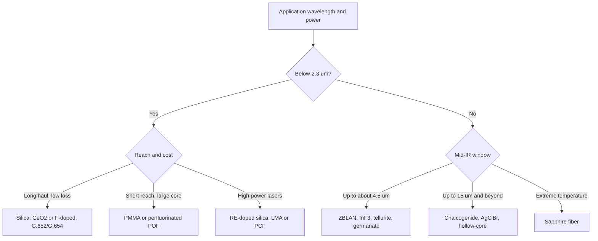

## Optical Fibers and Waveguide Materials


### Overview

An **optical waveguide** confines and guides light by exploiting a spatial variation of refractive index, or by photonic band-gap and metallic-boundary effects, so that electromagnetic energy propagates along a defined path with low loss. An **optical fiber** is a cylindrical dielectric waveguide, typically a high-index core surrounded by a lower-index cladding, drawn from a preform into a flexible strand of diameter about $125\ \mu\mathrm{m}$ (standard telecom) with a polymer coating.

Waveguides come in two broad geometries:

| Geometry | Typical form | Typical materials | Typical use |
| --- | --- | --- | --- |
| Fiber (cylindrical) | Drawn glass or polymer strand | $\mathrm{SiO_2}$, fluoride, chalcogenide, PMMA | Telecommunication, sensing, lasers, power delivery |
| Planar / integrated (rectangular, rib, ridge, slot) | Thin-film stack patterned by lithography | Si, $\mathrm{Si_3N_4}$, $\mathrm{LiNbO_3}$, InP, $\mathrm{SiO_2}$, polymers | Photonic integrated circuits, modulators, sensors |

**Key Points**

- Guiding relies on total internal reflection (TIR) in conventional fibers, or on a photonic band gap / anti-resonance in microstructured and hollow-core fibers.
- Material selection is driven by the intrinsic transparency window, scattering, purity (OH$^-$, transition metals), refractive-index controllability, thermal and mechanical properties, and drawability.
- Silica fiber attenuation reaches about $0.15$–$0.17\ \mathrm{dB/km}$ near $1550\ \mathrm{nm}$, set by the Rayleigh scattering floor at short wavelengths and multiphonon (infrared) absorption at long wavelengths.
- Beyond silica, fluoride, chalcogenide, tellurite, and polymer materials extend guidance into the mid-IR or provide large-core, low-cost short-reach links.
- Integrated waveguide platforms trade propagation loss against index contrast, footprint, nonlinearity, and active functionality.

### Optical Guidance Fundamentals

#### Step-Index Fiber and Numerical Aperture

For a core of index $n_1$ and cladding of index $n_2$ ($n_1 > n_2$), TIR occurs for rays incident on the core–cladding boundary at angles above the critical angle:

$$\theta_c = \arcsin\!\left(\dfrac{n_2}{n_1}\right)$$

The acceptance cone is characterized by the **numerical aperture**:

$$\mathrm{NA} = n_0\sin\theta_{max} = \sqrt{n_1^2 - n_2^2}$$

with $n_0 \approx 1$ for air. The **relative index difference** is:

$$\Delta = \dfrac{n_1^2 - n_2^2}{2n_1^2} \approx \dfrac{n_1 - n_2}{n_1}$$

so that $\mathrm{NA} \approx n_1\sqrt{2\Delta}$. Telecom single-mode fibers have $\Delta \approx 0.3$–$0.4\%$ ($\mathrm{NA} \approx 0.12$–$0.14$); multimode fibers use $\mathrm{NA} \approx 0.20$–$0.275$; polymer optical fibers use $\mathrm{NA} \approx 0.5$.

#### Normalized Frequency and Mode Counting

The **V-number** (normalized frequency) for a fiber of core radius $a$ at wavelength $\lambda$ is:

$$V = \dfrac{2\pi a}{\lambda}\,\mathrm{NA} = \dfrac{2\pi a}{\lambda}\sqrt{n_1^2 - n_2^2}$$

A step-index fiber supports only the fundamental $\mathrm{LP_{01}}$ (HE$_{11}$) mode when:

$$V < 2.405$$

which is the first zero of the Bessel function $J_0$. The **cutoff wavelength** of the second mode is:

$$\lambda_c = \dfrac{2\pi a\,\mathrm{NA}}{2.405}$$

The approximate number of guided modes in a large-$V$ step-index fiber and a graded-index (parabolic) fiber:

$$M_{step} \approx \dfrac{V^2}{2}, \qquad M_{graded} \approx \dfrac{V^2}{4}$$

#### Mode Solution and Effective Index

In the weakly guiding approximation ($\Delta \ll 1$), the scalar wave equation gives linearly polarized $\mathrm{LP}_{lm}$ modes. The field in the core is a Bessel function, and in the cladding a modified Bessel function $K_l$. The eigenvalue equation for $\mathrm{LP}_{lm}$ is:

$$\dfrac{u\,J_{l\pm1}(u)}{J_l(u)} = \pm\dfrac{w\,K_{l\pm1}(w)}{K_l(w)}$$

with $u = a\sqrt{k^2n_1^2 - \beta^2}$, $w = a\sqrt{\beta^2 - k^2n_2^2}$, $u^2 + w^2 = V^2$, propagation constant $\beta$, and $k = 2\pi/\lambda$. The **effective index** is $n_{eff} = \beta/k$, bounded by $n_2 < n_{eff} < n_1$.

The fundamental-mode field is well approximated by a Gaussian with **mode-field diameter** (MFD):

$$\dfrac{w_0}{a} \approx 0.65 + \dfrac{1.619}{V^{3/2}} + \dfrac{2.879}{V^6}$$

valid for $0.8 < V < 2.5$ (Marcuse approximation), giving $\mathrm{MFD} = 2w_0 \approx 8.2$–$9.6\ \mu\mathrm{m}$ at $1310\ \mathrm{nm}$ for standard SMF-28-class fiber (values vary by product).

#### Graded-Index Profile

The power-law profile:

$$n(r) = n_1\sqrt{1 - 2\Delta\left(\dfrac{r}{a}\right)^g}, \qquad r \le a$$

with $g = 2$ (parabolic) minimizing intermodal dispersion in multimode fibers. The optimum exponent depends on wavelength through the profile dispersion parameter, $g_{opt} \approx 2 - \dfrac{12\Delta}{5}$ (first-order estimate) [Inference]; real fibers require wavelength-specific optimization.

#### Waveguide Types Beyond Total Internal Reflection

- **Photonic-crystal (holey) fibers**: solid core with an air-hole cladding whose effective index $n_{fsm}$ (fundamental space-filling mode) is lower than the core index, enabling "endlessly single-mode" behavior when $d/\Lambda < 0.42$ (hole diameter $d$ over pitch $\Lambda$).
- **Photonic band-gap (PBG) hollow-core fibers**: light confined in air by a two-dimensional periodic cladding.
- **Anti-resonant hollow-core fibers (ARF)**: nodeless or nested tubes whose thin glass membranes act as anti-resonant reflectors; thickness $t$ sets the resonance wavelengths:

$$\lambda_m = \dfrac{4t}{2m+1}\sqrt{n_g^2 - 1}, \qquad m = 0, 1, 2, \ldots \quad(\text{approximate anti-resonance edges})$$

- **Bragg and Kagome fibers**, **plasmonic waveguides**, **slot waveguides**, and **metal-clad (hollow) waveguides** for far-IR and THz.

### Propagation Impairments

#### Attenuation

Power attenuation in decibels per kilometer:

$$\alpha_{dB} = \dfrac{10}{L}\log_{10}\!\left(\dfrac{P_{in}}{P_{out}}\right) \approx 4.343\,\alpha_{np}$$

where $\alpha_{np}$ is the attenuation in $\mathrm{km^{-1}}$ (natural units). The total loss is the sum of intrinsic and extrinsic contributions:

$$\alpha(\lambda) = \alpha_{Rayleigh} + \alpha_{UV} + \alpha_{IR} + \alpha_{OH} + \alpha_{imp} + \alpha_{wg} + \alpha_{bend}$$

**Intrinsic mechanisms**

- **Rayleigh scattering** from frozen-in density and concentration fluctuations:

$$\alpha_R = \dfrac{A_R}{\lambda^4}, \qquad \alpha_R = \dfrac{8\pi^3}{3\lambda^4}\,n^8\,p^2\,k_B T_f\,\beta_T$$

where $p$ is the photoelastic coefficient, $T_f$ the fictive (glass-transition) temperature, and $\beta_T$ the isothermal compressibility. For silica, $A_R \approx 0.7$–$0.9\ \mathrm{dB\,km^{-1}\,\mu m^4}$, and adding GeO$_2$ or F alters it via composition fluctuations. Lowering $T_f$ (e.g., by slower cooling during drawing) lowers Rayleigh loss.

- **UV (Urbach) absorption tail**: $\alpha_{UV} = C\exp(E/E_0)$, with $E$ the photon energy.
- **IR multiphonon absorption**: $\alpha_{IR} = A_{IR}\exp(-a/\lambda)$, dominating beyond about $1.6\ \mu\mathrm{m}$ in silica (Si–O stretching at about $9\ \mu\mathrm{m}$ with overtones).

**Extrinsic mechanisms**

- **Hydroxyl ($\mathrm{OH^-}$) absorption**: fundamental at $2.73\ \mu\mathrm{m}$, overtones at $1.38\ \mu\mathrm{m}$, $0.95\ \mu\mathrm{m}$, $0.72\ \mu\mathrm{m}$; "low-water-peak" fibers (ITU-T G.652.D) reduce the $1383\ \mathrm{nm}$ peak to below about $0.4\ \mathrm{dB/km}$, enabling full-spectrum coarse WDM. Sub-ppb OH content is achieved with chlorine drying.
- **Transition-metal ions** ($\mathrm{Fe^{2+}}$, $\mathrm{Cu^{2+}}$, $\mathrm{Cr^{3+}}$, $\mathrm{Ni^{2+}}$, $\mathrm{V^{4+}}$): must be held below about $1$ ppb.
- **Imperfections**: core–cladding interface roughness, bubbles, diameter fluctuations, and microcrystallites.

**Bending loss** consists of macrobending (radiation once the caustic radius exceeds the cladding boundary) and microbending (mode coupling from random coating-induced perturbations). For a step-index single-mode fiber, the macrobend loss coefficient scales approximately as:

$$\alpha_{bend} \propto \exp\!\left[-\dfrac{2}{3}\,\dfrac{(n_{eff}^2 - n_2^2)^{3/2}}{n_{eff}^2}\,k\,R\right]$$

(with bend radius $R$), showing exponential sensitivity to $R$. Bend-insensitive fibers (G.657) use trench-assisted or low-index-ring profiles to reduce loss at radii of a few mm.

**Attenuation windows** in silica:

| Band | Wavelength | Typical loss | Comment |
| --- | --- | --- | --- |
| First window | about 850 nm | 2–3 dB/km | Short-reach multimode, VCSEL |
| Second window (O-band) | 1260–1360 nm | about 0.32–0.35 dB/km | Zero dispersion region |
| E-band | 1360–1460 nm | 0.3–0.4 dB/km (low-water-peak) | OH peak at 1383 nm |
| S-band | 1460–1530 nm | about 0.22–0.25 dB/km | Amplified by TDFA |
| C-band | 1530–1565 nm | about 0.17–0.20 dB/km | Erbium-doped fiber amplifier (EDFA) |
| L-band | 1565–1625 nm | about 0.20–0.23 dB/km | Extended EDFA |
| U-band | 1625–1675 nm | 0.25–0.35 dB/km | Monitoring |

Numbers are representative of commercial single-mode fibers; specific products vary.

#### Dispersion

Total chromatic dispersion parameter $D$ (ps/(nm·km)) combines material and waveguide dispersion (and, in multimode fibers, profile dispersion):

$$D(\lambda) = D_M(\lambda) + D_W(\lambda), \qquad D_M = -\dfrac{\lambda}{c}\dfrac{d^2n}{d\lambda^2}$$

The propagation constant expanded about the carrier frequency $\omega_0$:

$$\beta(\omega) = \beta_0 + \beta_1(\omega-\omega_0) + \dfrac{\beta_2}{2}(\omega-\omega_0)^2 + \dfrac{\beta_3}{6}(\omega-\omega_0)^3 + \cdots$$

with group-velocity dispersion $\beta_2 = -\dfrac{\lambda^2}{2\pi c}D$. Pulse broadening for an input Gaussian pulse of rms width $\sigma_0$ over length $L$:

$$\sigma(L) = \sqrt{\sigma_0^2 + (D L\,\sigma_\lambda)^2}$$

with source spectral width $\sigma_\lambda$. Standard G.652 fiber has zero dispersion near $1310\ \mathrm{nm}$ and $D \approx +17\ \mathrm{ps/(nm\cdot km)}$ at $1550\ \mathrm{nm}$. Dispersion-shifted fiber (G.653) moves the zero to $1550\ \mathrm{nm}$ (which encourages four-wave mixing in WDM), while non-zero dispersion-shifted fibers (G.655) keep small but nonzero $D$ ($2$–$6\ \mathrm{ps/(nm\cdot km)}$). Dispersion-compensating fibers exhibit large negative $D$ ($-100$ to $-250\ \mathrm{ps/(nm\cdot km)}$).

**Intermodal dispersion** in multimode fibers limits the bandwidth–length product:

$$\Delta\tau_{step} = \dfrac{L\,n_1\Delta}{c}, \qquad \Delta\tau_{graded} \approx \dfrac{L\,n_1\Delta^2}{8c}$$

so graded-index designs reduce intermodal spread by a factor $\sim 8/\Delta$ relative to step-index (about $100\times$ or more for typical $\Delta \sim 1\%$). The **effective modal bandwidth** (EMB) of OM3/OM4/OM5 laser-optimized fibers is measured with DMD.

**Polarization-mode dispersion (PMD)** arises from residual core asymmetry and stress; the mean differential group delay scales as $\langle\Delta\tau\rangle = D_{PMD}\sqrt{L}$, with $D_{PMD} < 0.1\ \mathrm{ps/\sqrt{km}}$ for modern fibers.

#### Nonlinear Effects

Intensity-dependent phenomena in silica arise from $\chi^{(3)}$ and scattering processes:

n = n_0 + n_2 I, \qquad n_2(\mathrm{SiO_2}) \approx 2.2$$–$2.7\times10^{-20}\ \mathrm{m^2/W}

The nonlinear coefficient of a fiber with effective area $A_{eff}$:

$$\gamma = \dfrac{2\pi n_2}{\lambda A_{eff}}$$

(values of about $1\ \mathrm{W^{-1}km^{-1}}$ for SMF-28-class, $10$–$30$ for highly nonlinear fiber), and the effective length that accounts for attenuation:

$$L_{eff} = \dfrac{1 - e^{-\alpha L}}{\alpha}$$

Principal effects:

- **Self-phase modulation (SPM)** and **cross-phase modulation (XPM)**: nonlinear phase $\phi_{NL} = \gamma P L_{eff}$.
- **Four-wave mixing (FWM)**: phase-matching depends on dispersion; exploited for wavelength conversion and parametric amplification.
- **Stimulated Brillouin scattering (SBS)**: threshold approximately $P_{th}^{SBS} \approx \dfrac{21\,A_{eff}}{g_B L_{eff}}$ with $g_B \approx 5\times10^{-11}\ \mathrm{m/W}$ in silica and Brillouin shift about $11\ \mathrm{GHz}$ at $1550\ \mathrm{nm}$; limits narrow-linewidth power delivery.
- **Stimulated Raman scattering (SRS)**: threshold $P_{th}^{SRS}\approx\dfrac{16A_{eff}}{g_R L_{eff}}$ with $g_R \approx 1\times10^{-13}\ \mathrm{m/W}$ at $1\ \mu\mathrm{m}$; Raman gain peak at about $13\ \mathrm{THz}$ offset. Used for distributed Raman amplification and Raman fiber lasers.
- **Solitons**: balanced SPM and anomalous GVD; supercontinuum generation in PCF and soft-glass fibers.
- **Photodarkening** in Yb-doped fibers and **hydrogen darkening** are material-specific degradation phenomena.

**Example: Critical-Power Estimate**

For SMF with $A_{eff} = 80\ \mu\mathrm{m}^2$, $\alpha = 0.2\ \mathrm{dB/km}$, $L = 50\ \mathrm{km}$: $L_{eff} = \dfrac{1-e^{-\alpha L}}{\alpha}\approx 21.7\ \mathrm{km}$ (using $\alpha_{np}=0.046\ \mathrm{km^{-1}}$). The SBS threshold estimate gives:

$$P_{th}^{SBS} \approx \dfrac{21\times 80\times10^{-12}}{5\times10^{-11}\times 21.7\times10^{3}} \approx 1.5\ \mathrm{mW}$$

for a narrow-linewidth continuous-wave signal, which is why line broadening, phase modulation, or dithering is used to raise the threshold in practice. [Inference] Real thresholds vary with source linewidth, polarization state, and Brillouin gain bandwidth.

### Fiber Materials

#### Silica and Doped Silica

**Fused silica** ($\mathrm{SiO_2}$) is the dominant fiber material because of its low intrinsic loss, high strength, chemical durability, thermal stability (softening near $1600$–$1700\,^\circ\mathrm{C}$; glass transition near $1100\,^\circ\mathrm{C}$), and well-developed vapor-phase manufacturing.

Index-modifying dopants:

| Dopant | Effect on $n$ | Effect on other properties |
| --- | --- | --- |
| $\mathrm{GeO_2}$ | Raises $n$ (about +0.001 per mol% roughly, ~$0.0014$ per mol%) | Enhances photosensitivity (FBG writing), Raman gain; increases Rayleigh scattering |
| $\mathrm{P_2O_5}$ | Raises $n$ | Lowers processing temperature; supports high Er/Yb solubility; can increase IR loss |
| $\mathrm{Al_2O_3}$ | Raises $n$ | Improves rare-earth solubility, reduces clustering; used in laser fibers |
| $\mathrm{TiO_2}$ | Raises $n$ | Rarely used in single-mode fibers (Ti$^{3+}$ absorption) |
| $\mathrm{B_2O_3}$ | Lowers $n$ | Increases thermal expansion mismatch; IR absorption from B–O; used in stress-applying parts (PANDA, bow-tie) |
| F | Lowers $n$ (about $-0.003$ per wt% approx.) | Reduces Rayleigh loss, enables pure-silica-core fibers with F-doped cladding; low $T_f$ |

Rare-earth dopants for active fibers: $\mathrm{Er^{3+}}$ (1550 nm amplification), $\mathrm{Yb^{3+}}$ (1030–1100 nm high-power lasers), $\mathrm{Tm^{3+}}$ (about 1.9–2.0 $\mu\mathrm{m}$), $\mathrm{Ho^{3+}}$ (about 2.1 $\mu\mathrm{m}$), $\mathrm{Nd^{3+}}$ (1064 nm), $\mathrm{Pr^{3+}}$ (1310 nm, in fluoride glass).

The index of doped silica is well approximated using Sellmeier coefficients that depend on dopant concentration:

$$n^2(\lambda) - 1 = \sum_{i=1}^{3}\dfrac{A_i\lambda^2}{\lambda^2 - \lambda_i^2}$$

with composition-dependent $A_i$ and $\lambda_i$ (Fleming's parameters for $\mathrm{GeO_2{-}SiO_2}$, $\mathrm{P_2O_5{-}SiO_2}$, $\mathrm{B_2O_3{-}SiO_2}$, and F-SiO$_2$).

#### Fluoride Glasses

**ZBLAN** ($\mathrm{ZrF_4{-}BaF_2{-}LaF_3{-}AlF_3{-}NaF}$, approximately 53/20/4/3/20 mol%) and other heavy-metal fluorides (**InF$_3$**, **AlF$_3$-based**) transmit from the UV to about $4$–$5\ \mu\mathrm{m}$ (ZBLAN) or beyond $5\ \mu\mathrm{m}$ (InF$_3$), because heavier and weaker M–F bonds shift the multiphonon edge to longer wavelength (phonon energy about $580\ \mathrm{cm^{-1}}$ vs. about $1100\ \mathrm{cm^{-1}}$ in silica).

- Theoretical minimum loss is predicted to be about $10^{-2}$–$10^{-3}\ \mathrm{dB/km}$ near $2.5\ \mu\mathrm{m}$, but practical fibers have reached only about $0.1$–$0.7\ \mathrm{dB/km}$ due to crystallization, scattering centers, and impurities. [Unverified] Whether the theoretical minimum can ever be approached in production is still debated.
- Low phonon energy provides long metastable lifetimes and efficient mid-IR and upconversion emission in rare-earth-doped fluoride fibers (e.g., $\mathrm{Er^{3+}}$ at $2.8\ \mu\mathrm{m}$, $\mathrm{Ho^{3+}}$ at $2.9\ \mu\mathrm{m}$, $\mathrm{Tm^{3+}}$ upconversion, $\mathrm{Pr^{3+}}$ at 1310 nm).
- Drawbacks: a narrow working range between $T_g$ (about $260$–$320\,^\circ\mathrm{C}$) and crystallization onset $T_x$, moisture sensitivity, weak mechanical strength, and difficulty in splicing.
- Microgravity processing has been investigated to reduce crystallization; [Unverified] reproducible benefits at scale remain to be established.

#### Chalcogenide Glasses

Composed of S, Se, and Te with As, Ge, Sb, Ga (e.g., $\mathrm{As_2S_3}$, $\mathrm{As_2Se_3}$, $\mathrm{Ge_{33}As_{12}Se_{55}}$, and Ge-Sb-Se, Ge-Sb-Te systems).

| Glass | Transparency window | Refractive index (approx.) | $n_2$ relative to silica |
| --- | --- | --- | --- |
| $\mathrm{As_2S_3}$ | 0.6–11 $\mu$m | 2.4–2.45 | about 100–300× |
| $\mathrm{As_2Se_3}$ | 1–15 $\mu$m | 2.8 | about 500–1000× |
| GeAsSe / GeSbSe | 1–14–16 $\mu$m | 2.4–2.8 | about 100–500× |
| Te-based (e.g., Ge-As-Se-Te) | 2–20 $\mu$m | 2.9–3.1 | very high |

Features: broadband mid-IR transparency (CO$_2$ laser delivery at $10.6\ \mu\mathrm{m}$, IR spectroscopy fiber probes such as fiber-evanescent-wave spectroscopy, thermal imaging bundles), very high Kerr nonlinearity and Brillouin gain, photosensitivity (photo-darkening and photoinduced refractive-index changes for direct writing of gratings), and Raman-gain use in mid-IR. Limitations: lower mechanical strength, moderate thermal stability, $\mathrm{As}$ toxicity in some compositions, extrinsic absorption from Se–H ($4.5\ \mu\mathrm{m}$), S–H ($4.0\ \mu\mathrm{m}$), and $\mathrm{H_2O}$/$\mathrm{OH}$ (about $2.9\ \mu\mathrm{m}$, $6.3\ \mu\mathrm{m}$), and oxide-related bands (about $7.9\ \mu\mathrm{m}$, $12.8\ \mu\mathrm{m}$). Losses of $0.1$–$1\ \mathrm{dB/m}$ are achievable in purified glasses; [Inference] such values are still orders of magnitude above silica in the NIR.

#### Tellurite and Heavy-Metal Oxide Glasses

$\mathrm{TeO_2}$-based glasses (e.g., $\mathrm{TeO_2{-}ZnO{-}Na_2O}$, TeO$_2$-WO$_3$) transmit to about $5$–$6\ \mu\mathrm{m}$, have high linear index ($n \approx 2.0$–$2.1$), large nonlinearity ($n_2 \sim 20$–$50\times$ silica), broad Raman gain, and excellent rare-earth solubility with broad emission (e.g., $\mathrm{Er^{3+}}$ bandwidth of up to about 80 nm for wideband amplifiers). They are more durable than fluorides but have lower thermal conductivity. Germanate glasses ($\mathrm{GeO_2}$-based) transmit to about $4\ \mu\mathrm{m}$ with lower attenuation than tellurite and higher damage threshold, used in $2\ \mu\mathrm{m}$ lasers.

#### Polymer Optical Fibers (POF)

- **PMMA** (poly(methyl methacrylate)): $n \approx 1.49$; large-core (about $1\ \mathrm{mm}$) step-index fibers with fluorinated-polymer cladding ($n \approx 1.40$); attenuation about $0.15\ \mathrm{dB/m}$ at $650\ \mathrm{nm}$ (red) and about $0.08\ \mathrm{dB/m}$ minimum near $570$ nm; C–H vibrational overtones set the loss floor.
- **Perfluorinated graded-index POF (CYTOP, PFP)**: replaces C–H by C–F bonds, gives losses of about $10$–$50\ \mathrm{dB/km}$ across $850$–$1300\ \mathrm{nm}$, and enables multi-Gb/s links over $100$ m (automotive, home, and data-center short reach).
- **Polycarbonate, polystyrene, cyclic olefin copolymer** for higher temperature resistance and special dispersion behaviors.
- **Doped POFs** ($\mathrm{Rhodamine}$, $\mathrm{fluorescein}$, conjugated polymers, perylene dyes) for luminescent, scintillating, and amplifying fibers; also microstructured POFs (mPOF) with low-cost hole structures.

Trade-offs: bend tolerance, ease of termination, and low cost versus higher attenuation, restricted temperature range (typically up to $85$–$105\,^\circ\mathrm{C}$), and water uptake affecting attenuation.

#### Crystalline and Specialty Infrared Fibers

- **Silver halide** ($\mathrm{AgCl_xBr_{1-x}}$) polycrystalline fibers: about $3$–$18\ \mu\mathrm{m}$; flexible, non-toxic, used in medical CO$_2$/Er:YAG laser delivery and FTIR fiber probes; photosensitive, ductile.
- **KRS-5 ($\mathrm{TlBr_xI_{1-x}}$)**: broad IR window (about 0.6–40 $\mu\mathrm{m}$) but toxic and hygroscopic-ish issues limit use.
- **Sapphire fibers** (single-crystal $\mathrm{Al_2O_3}$): transparent to about $3$–$4\ \mu\mathrm{m}$, extremely high melting point ($2050\,^\circ\mathrm{C}$) for sensing in extreme environments (high-temperature thermometry above $1500\,^\circ\mathrm{C}$); grown by laser-heated pedestal growth (LHPG) or edge-defined film-fed growth (EFG); multimode with high propagation loss (dB/m level).
- **Hollow-core metal/dielectric-coated capillaries** (e.g., Ag/AgI-coated glass or polymer tubes) for CO$_2$ and Er:YAG laser delivery.
- **Hollow-core anti-resonant fibers** of silica now achieve attenuation below $1\ \mathrm{dB/km}$ [Unverified: laboratory-record values, near about $0.1$–$0.2\ \mathrm{dB/km}$ reported at about 1550 nm in nested designs, continue to be updated], with very low nonlinearity and latency (light propagates nearly at $c$), promising for low-latency data links and high-power delivery.
- **Single-crystal cores in glass cladding (crystalline-core fibers)**: Si, Ge, ZnSe, and $\mathrm{Yb{:}YAG}$ produced by the molten-core method or high-pressure chemical vapor deposition into capillaries, enabling in-fiber nonlinear optics and lasing in the mid-IR.

#### Comparative Summary

| Material | Transparency | Typical minimum loss | Strengths | Limitations |
| --- | --- | --- | --- | --- |
| Silica | 0.2–2.3 $\mu$m | about 0.15 dB/km @ 1550 nm | Lowest loss, strength, mature | IR cutoff about 2.3 $\mu$m |
| ZBLAN | 0.3–4.5 $\mu$m | about 0.1–0.7 dB/km (practical) | Mid-IR, RE hosts | Fragile, hygroscopic |
| Tellurite | 0.4–5.5 $\mu$m | about 0.1–1 dB/m | Nonlinear, broad gain | Thermal conductivity, loss |
| Chalcogenide | 1–15+ $\mu$m | about 0.1–1 dB/m | Mid-IR, high nonlinearity | Toxic constituents, strength |
| PMMA POF | 0.4–0.75 $\mu$m | about 0.08–0.15 dB/m | Flexible, cheap | High loss, low temperature |
| Perfluorinated POF | 0.6–1.3 $\mu$m | about 10–50 dB/km | Broad bandwidth, short reach | Cost |
| AgClBr | 3–18 $\mu$m | about 0.2–0.5 dB/m | Non-toxic mid-IR | Photosensitive, soft |
| Sapphire | 0.3–3.5 $\mu$m | about 0.2 dB/m (approx.) | Extreme temperature | Multimode, brittle |

### Fabrication

#### Preform Fabrication for Silica Fibers

All major processes are **chemical vapor deposition** (CVD) variants using $\mathrm{SiCl_4}$ (and $\mathrm{GeCl_4}$, $\mathrm{POCl_3}$, $\mathrm{BCl_3}$, $\mathrm{SiF_4}$, $\mathrm{C_2F_6}$) oxidized to form $\mathrm{SiO_2}$-based soot or glass:

$$\mathrm{SiCl_4 + O_2 \to SiO_2 + 2Cl_2}$$


$$\mathrm{GeCl_4 + O_2 \to GeO_2 + 2Cl_2}$$

| Process | Location of deposition | Typical use |
| --- | --- | --- |
| **MCVD** (modified CVD) | Inside a rotating silica tube with a traversing torch; internal | Telecom fibers, specialty and doped fibers |
| **PCVD** (plasma CVD) | Inside a tube using microwave plasma; very fine layer control | Graded-index multimode fibers (high precision) |
| **OVD** (outside vapor deposition) | Soot layers deposited on an outer rotating mandrel; then dried and sintered | Large-volume telecom |
| **VAD** (vapor-axial deposition) | Soot grown axially from a seed; continuous | Large-volume telecom |
| **Sol-gel, stack-and-draw, rod-in-tube, extrusion** | Various | PCF, microstructured, soft-glass and polymer fibers |
| **Direct nanoparticle deposition (DND), solution doping, chelate delivery** | Rare-earth incorporation | Active (RE-doped) fibers |

After deposition, the tube is **collapsed** at about $2000\,^\circ\mathrm{C}$ into a solid rod (preform). The **collapse** stage can cause the central "dip" in the index profile from dopant evaporation, controlled by adding $\mathrm{GeCl_4}$ or $\mathrm{C_2F_6}$ etching gas.

**Drying**: chlorine (Cl$_2$ or $\mathrm{SOCl_2}$) treatment at high temperature removes OH by reaction $\mathrm{Si{-}OH + Cl_2 \to Si{-}Cl + HCl + \tfrac{1}{2}O_2}$ (approximate).

**Rare-earth doping** by **solution doping** (soak porous soot in an $\mathrm{ErCl_3}$/$\mathrm{AlCl_3}$ solution), by **vapor-phase chelate delivery**, or by **DND** and **REPUSIL/sintering of nanoparticle-doped preforms**, enabling high concentrations and uniform doping in large-mode-area (LMA) fibers.

#### Fiber Drawing

The preform is fed into a furnace at about $2000$–$2100\,^\circ\mathrm{C}$ (silica), drawn under tension into a fiber by a capstan at speeds of $10$–$50\ \mathrm{m/s}$ (telecom fibers up to about $\sim 60\ \mathrm{m/s}$). Mass conservation gives the relation between preform feed velocity $v_f$ and draw speed $v_d$:

$$v_f\,D_{pre}^2 = v_d\,D_{fib}^2$$

Key controls: diameter monitoring by laser gauge (tolerance $\pm 0.5\ \mu\mathrm{m}$ on $125\ \mu\mathrm{m}$), draw tension (typically $30$–$100$ g), furnace temperature and flow of inert gas, coating application (dual-acrylate: soft primary, hard secondary; or polyimide/carbon/metal for harsh environments) and UV curing. Drawing sets the **fictive temperature** and residual stress. **Spinning** of the preform during drawing reduces PMD by averaging birefringence.

Fluoride and chalcogenide glasses are drawn at much lower temperatures ($300$–$450\,^\circ\mathrm{C}$) in controlled atmospheres (dry N$_2$ or vacuum), often using **rod-in-tube**, **extrusion**, or **double-crucible** methods. Polymer fibers use **preform drawing** or **continuous extrusion** with interfacial-gel polymerization for graded-index POF. PCFs use **stack-and-draw** with pressure control on the holes.

#### Mechanical Properties

Silica has a theoretical strength of about $20$ GPa; freshly drawn, pristine fiber shows about $5$–$6$ GPa, but surface flaws reduce practical strength. Proof-testing at $0.7$–$1.4$ GPa ($100$–$200$ kpsi) is standard. **Static fatigue** (stress corrosion) follows a power-law crack-growth model:

$$\dfrac{da}{dt} = A\,K_I^{\,n}, \qquad n \approx 20\text{–}30\ \text{(silica in humid air)}$$

The lifetime under constant stress $\sigma$: $t_f \propto \sigma^{-n}$. Minimum bend radius for long-term reliability is typically constrained to keep strain below $0.2$–$0.3\%$ (about $15$–$30$ mm for standard fiber, or as small as a few mm for bend-insensitive types with lower-strain-rated design). The hermetic (carbon or metal) coating reduces water/hydrogen ingress in harsh environments.

### Waveguide Platforms and Materials for Integrated Photonics

| Platform | Index (near 1550 nm) | Typical propagation loss | Notes |
| --- | --- | --- | --- |
| Silicon-on-insulator (SOI) | $n_{Si}\approx3.48$, $n_{SiO_2}\approx1.44$ | about 1–3 dB/cm (strip), <0.1 dB/cm (optimized rib) | High contrast, CMOS-compatible, two-photon absorption at telecom wavelengths, no $\chi^{(2)}$ (centrosymmetric) |
| Silicon nitride ($\mathrm{Si_3N_4}$) | about 2.0 | about 0.1–1 dB/m (low-loss LPCVD) | Broadband transparency (0.4–6 $\mu$m), no TPA at 1550 nm, Kerr combs |
| Silica-on-silicon (planar lightwave circuits, PLC) | about 1.45–1.47 | about 0.01–0.1 dB/cm | AWGs, splitters, low index contrast |
| Lithium niobate on insulator (LNOI, TFLN) | $n_o\approx2.21$, $n_e\approx2.14$ | about 0.01–0.3 dB/cm | Strong $\chi^{(2)}$, Pockels effect, high-speed modulators |
| Indium phosphide (InP) / III-V (GaAs, AlGaAs) | about 3.17–3.4 | about 1–3 dB/cm | Monolithic lasers, amplifiers, detectors |
| Polymers (SU-8, PMMA, BCB, fluorinated polyimides) | 1.3–1.7 | about 0.1–1 dB/cm | Low-cost, electro-optic polymers, flexible substrates |
| Chalcogenide thin films | 2.0–3.0 | about 0.1–1 dB/cm | Mid-IR, highly nonlinear |
| Aluminium nitride (AlN) | about 2.1 | about 0.1–1 dB/cm | UV to mid-IR, $\chi^{(2)}$, piezoelectric |
| Germanium and SiGe | about 4.0 | 1–3 dB/cm | Mid-IR (2–15 $\mu$m) |
| Diamond, $\mathrm{Ta_2O_5}$, $\mathrm{TiO_2}$, $\mathrm{Al_2O_3}$ | various | various | Nonlinear/quantum photonics, on-chip lasers |

Index contrast $\Delta n$ dictates the minimum bend radius (silica PLC: mm to cm; SOI: about $1$–$5\ \mu\mathrm{m}$), the mode size (silicon strip: about $0.5\times0.22\ \mu\mathrm{m}^2$), and fiber-to-chip coupling requirements (edge couplers with spot-size converters or grating couplers with about $1$–$3$ dB loss).

**Effective-index method and mode-solving**: for rectangular guides, mode profiles and effective indices are typically solved with finite-difference eigenmode solvers, the beam-propagation method (BPM), finite-difference time-domain (FDTD), or finite-element method (FEM). For a symmetric planar slab waveguide of thickness $d$ and indices $n_f$, $n_c$, the TE dispersion relation is:

$$\tan\!\left(\dfrac{\kappa d}{2} - \dfrac{m\pi}{2}\right) = \dfrac{\gamma}{\kappa}, \qquad \kappa = k\sqrt{n_f^2 - n_{eff}^2}, \quad \gamma = k\sqrt{n_{eff}^2 - n_c^2}$$

with number of TE modes approximately $M \approx \lceil 2d\sqrt{n_f^2-n_c^2}/\lambda\rceil$.

**Propagation-loss contributions** in integrated waveguides: sidewall roughness scattering (scales approximately with $\sigma_{rms}^2$ and with the field intensity at the interface, hence smaller for large-mode and low-contrast waveguides), material absorption (Si–H, N–H bonds in PECVD nitride around $1520$ nm, mitigated by annealing), substrate leakage, and bend radiation.

**Fabrication**: thin-film deposition (LPCVD, PECVD, ALD, sputtering, spin-coating), wafer bonding and smart-cut for LNOI, lithography (DUV, e-beam), reactive-ion etching, and cladding deposition; or ultrafast-laser writing in glass (femtosecond direct write producing $\Delta n\approx10^{-3}$–$10^{-2}$ tracks), and ion exchange in glass (Ag$^+$–Na$^+$, K$^+$–Na$^+$) for low-cost planar guides, and proton exchange/Ti in-diffusion in $\mathrm{LiNbO_3}$.

### Active and Functional Fibers and Waveguides

#### Rare-Earth-Doped Amplifiers and Lasers

**EDFA**: a pump at $980$ nm or $1480$ nm inverts the Er$^{3+}$ $^4I_{13/2}$ population; gain at $1530$–$1565$ nm. The small-signal gain of a two-level-like system with absorption $\alpha_a$ and emission $\sigma_e$ cross-sections:

$$g(\lambda) = \Gamma\left[\sigma_e(\lambda)N_2 - \sigma_a(\lambda)N_1\right]$$

with overlap factor $\Gamma$ and populations $N_1$, $N_2$ ($N_1 + N_2 = N_{Er}$). Noise figure limit of about $3$ dB (quantum limit) in high-inversion operation.

**Double-clad Yb-doped fiber lasers** achieve kilowatt-class single-mode output using cladding pumping with multimode diodes; limitations include SRS, SBS, transverse-mode instability (TMI), and photodarkening. **Large-mode-area (LMA) designs** (effective area $> 500\ \mu\mathrm{m}^2$) use low NA ($<0.06$), leakage-channel fibers, chirally coupled cores, or rod-type photonic-crystal fibers.

#### Fiber Bragg Gratings and Long-Period Gratings

A periodic index modulation $\Lambda$ reflects the Bragg wavelength:

$$\lambda_B = 2\,n_{eff}\,\Lambda$$

With peak reflectivity $R = \tanh^2(\kappa L)$ for coupling coefficient $\kappa \approx \dfrac{\pi\,\Delta n_{mod}\,\eta}{\lambda}$ and overlap $\eta$. Sensitivity for sensing: $\dfrac{\Delta\lambda_B}{\lambda_B} = (1 - p_e)\,\varepsilon + (\alpha_L + \xi)\,\Delta T$ with photoelastic constant $p_e \approx 0.22$, so about $1.2\ \mathrm{pm/\mu\varepsilon}$ and about $10\ \mathrm{pm/K}$ near $1550$ nm. Gratings are written in Ge-doped or hydrogen-loaded fibers by UV (phase mask, interferometric) or femtosecond radiation (enabling writing in pure silica, sapphire, and non-photosensitive materials). Type II and Type II-A gratings, regenerated gratings, and femtosecond-written gratings survive $> 1000\,^\circ\mathrm{C}$.

#### Specialty Fibers

- **Polarization-maintaining (PM)**: PANDA, bow-tie, elliptical-core; birefringence $B = n_x - n_y \approx 3$–$5\times10^{-4}$, beat length $L_B = \lambda/B\approx 2$–$5$ mm.
- **Photosensitive, radiation-hard, hermetic, high-temperature, and bend-insensitive fibers**; **radiation-resistant fibers** use pure-silica or F-doped cores and low-OH/high-OH selections depending on the wavelength band (radiation-induced attenuation, RIA, from color centers such as NBOHC and STH).
- **Multicore fibers (MCF)** and **few-mode fibers (FMF)** for space-division multiplexing (SDM), with inter-core crosstalk (XT) engineered by trench-assisted designs.
- **Coreless, tapered, and side-polished fibers** for evanescent-field devices; **nanofibers/microfibers** with diameters of $0.3$–$2\ \mu\mathrm{m}$ show strong evanescent field, used in sensing and cold-atom coupling.
- **Fiber sensors**: distributed sensing based on Rayleigh (OTDR, OFDR, DAS), Brillouin (BOTDA/BOTDR), and Raman (DTS) scattering, and point sensors based on FBGs, Fabry–Pérot cavities, interferometers.

#### Nonlinear and Supercontinuum Materials

Supercontinuum generation spans from UV to mid-IR using pumped photonic crystal fibers (silica: $0.35$–$2.4\ \mu\mathrm{m}$), ZBLAN ($0.3$–$4.5\ \mu\mathrm{m}$), tellurite ($0.8$–$5+\ \mu\mathrm{m}$), and chalcogenide ($2$–$15\ \mu\mathrm{m}$). Design targets: a zero-dispersion wavelength close to the pump, small $A_{eff}$, and low loss at the long-wavelength edge.

### Diagrams

#### Step-Index Fiber Geometry and Ray Guidance

<svg xmlns="http://www.w3.org/2000/svg" viewBox="0 0 780 420" width="780" height="420" font-family="Arial, Helvetica, sans-serif">
<title>Step-index optical fiber ray guidance (svg_diagram)</title>
<text x="390" y="28" text-anchor="middle" font-size="18" font-weight="bold" fill="#222">Step-Index Fiber: Total Internal Reflection (svg_diagram)</text>
<rect x="80" y="110" width="620" height="170" fill="#d0ebff" stroke="#1c7ed6" stroke-width="2" />
<rect x="80" y="160" width="620" height="70" fill="#fff3bf" stroke="#f08c00" stroke-width="2" />
<text x="90" y="135" font-size="14" fill="#1864ab">Cladding (n₂)</text>
<text x="90" y="200" font-size="14" fill="#e67700">Core (n₁ &gt; n₂)</text>
<text x="90" y="268" font-size="14" fill="#1864ab">Cladding (n₂)</text>
<line x1="20" y1="230" x2="80" y2="195" stroke="#d9480f" stroke-width="3" marker-end="url(#af)" />
<text x="18" y="252" font-size="13" fill="#d9480f">Ray within</text>
<text x="18" y="268" font-size="13" fill="#d9480f">acceptance cone</text>
<polyline points="80,195 220,160 360,230 500,160 640,230 700,200" fill="none" stroke="#d9480f" stroke-width="3" />
<line x1="700" y1="200" x2="750" y2="200" stroke="#d9480f" stroke-width="3" marker-end="url(#af)" />
<text x="222" y="150" font-size="12" fill="#495057">TIR at θ &gt; θc</text>
<text x="362" y="248" font-size="12" fill="#495057">θc = asin(n₂/n₁)</text>
<path d="M60,205 L20,150" stroke="#868e96" stroke-width="1.5" stroke-dasharray="5,4" fill="none" />
<text x="14" y="140" font-size="12" fill="#868e96">θmax</text>
<text x="390" y="320" text-anchor="middle" font-size="14" fill="#222">NA = √(n₁² − n₂²) = n₀ sin θmax | V = (2πa/λ)·NA</text>
<text x="390" y="345" text-anchor="middle" font-size="14" fill="#222">Single-mode condition: V &lt; 2.405</text>
<text x="390" y="375" text-anchor="middle" font-size="13" fill="#495057">Typical SMF: a ≈ 4.1 µm, cladding 125 µm, Δ ≈ 0.35 %, MFD ≈ 9 µm @ 1310 nm</text>
</svg>

#### Silica Fiber Attenuation Spectrum (Schematic)

<svg xmlns="http://www.w3.org/2000/svg" viewBox="0 0 780 440" width="780" height="440" font-family="Arial, Helvetica, sans-serif">
<title>Silica fiber attenuation spectrum, schematic (svg_diagram)</title>
<text x="390" y="28" text-anchor="middle" font-size="18" font-weight="bold" fill="#222">Silica Fiber Attenuation, Schematic (svg_diagram)</text>
<line x1="80" y1="380" x2="730" y2="380" stroke="#333" stroke-width="2" marker-end="url(#as)" />
<line x1="80" y1="380" x2="80" y2="55" stroke="#333" stroke-width="2" marker-end="url(#as)" />
<text x="405" y="415" text-anchor="middle" font-size="14" fill="#333">Wavelength (µm)</text>
<text x="28" y="220" font-size="14" fill="#333" transform="rotate(-90 28 220)">Attenuation (dB/km, log scale)</text>
<path d="M100,90 C170,200 260,280 350,318 C420,335 470,338 520,330" fill="none" stroke="#1c7ed6" stroke-width="3" />
<text x="112" y="82" font-size="13" fill="#1c7ed6">Rayleigh ∝ λ⁻⁴</text>
<path d="M480,335 C540,300 590,200 640,90" fill="none" stroke="#d9480f" stroke-width="3" />
<text x="580" y="82" font-size="13" fill="#d9480f">Multiphonon IR</text>
<path d="M100,300 L730,300" stroke="#adb5bd" stroke-width="1" stroke-dasharray="4,4" />
<path d="M285,318 L285,262 L297,318" fill="none" stroke="#2b8a3e" stroke-width="2" />
<text x="240" y="252" font-size="12" fill="#2b8a3e">OH 0.95 µm</text>
<path d="M395,338 L395,240 L410,338" fill="none" stroke="#2b8a3e" stroke-width="2" />
<text x="355" y="232" font-size="12" fill="#2b8a3e">OH 1.38 µm</text>
<line x1="350" y1="380" x2="350" y2="345" stroke="#5f3dc4" stroke-width="2" />
<line x1="450" y1="380" x2="450" y2="345" stroke="#5f3dc4" stroke-width="2" />
<text x="285" y="400" font-size="12" fill="#5f3dc4">O-band 1.31</text>
<text x="440" y="400" font-size="12" fill="#5f3dc4">C-band 1.55</text>
<text x="470" y="350" font-size="12" fill="#495057">Minimum ≈ 0.15–0.17 dB/km</text>
<text x="90" y="367" font-size="11" fill="#868e96">0.8</text>
<text x="285" y="367" font-size="11" fill="#868e96">1.0</text>
<text x="510" y="367" font-size="11" fill="#868e96">1.6</text>
<text x="690" y="367" font-size="11" fill="#868e96">2.0</text>
</svg>

#### Fiber Manufacturing Flow

```mermaid
flowchart LR
    A["High-purity precursors<br/>SiCl4, GeCl4, POCl3, SiF4"] --> B["Vapor deposition<br/>MCVD / PCVD / OVD / VAD"]
    B --> C["Drying and sintering<br/>Cl2 treatment, OH removal"]
    C --> D["Collapse to solid preform<br/>index profile control"]
    D --> E["Draw tower<br/>furnace about 2000 C"]
    E --> F["Diameter gauge<br/>closed-loop control"]
    F --> G["Coating and UV cure<br/>dual acrylate"]
    G --> H["Proof test and spooling"]
    H --> I["Cabling and qualification<br/>attenuation, dispersion, PMD"]
```



#### Material Selection by Target Wavelength Region



### Measurement and Characterization

| Parameter | Method | Notes |
| --- | --- | --- |
| Attenuation | Cutback method, OTDR, spectral attenuation (white light + monochromator) | Cutback is the reference; OTDR gives the distributed profile |
| Chromatic dispersion | Phase-shift, differential group delay, interferometry | Standard: ITU-T G.650.1 |
| Cutoff wavelength | Transmitted power (bend-reference) technique | Cable cutoff is lower than fiber cutoff |
| Mode-field diameter | Far-field scan, variable aperture, transverse offset | Petermann II definition common |
| Refractive-index profile | Refracted-near-field (RNF), quantitative phase microscopy, preform analyzers | Preform profile checked before drawing |
| PMD | Jones matrix eigenanalysis, fixed-analyzer, interferometric | Statistical quantity ($\sqrt{L}$ dependence) |
| Bandwidth (MMF) | DMD, OFL bandwidth, EMB | OM3/OM4/OM5 classification |
| Geometry | Near-field grey scale, laser gauge | Cladding diameter, core concentricity, non-circularity |
| Strength | Proof test, 2-point bend, tension | Weibull statistics for failure |
| Nonlinear coefficient | SPM spectral broadening, XPM, FWM | Effective area from near-field |
| Radiation resistance | Attenuation under $\gamma$/X-ray irradiation | RIA saturates with dose |
| Integrated waveguide loss | Cutback, Fabry–Pérot contrast, ring-resonator linewidth, scattering imaging | Ring $Q$ gives $\alpha = \dfrac{2\pi n_g}{Q_i\lambda}$ |

**Example: Cutback Attenuation Calculation in Python**

```python
import numpy as np

# Measured transmitted powers (mW) at one wavelength:
# P_long: full length L_long (m); P_short: after cutting back to L_short (m)
L_long = 1000.0     # m
L_short = 2.0       # m
P_long = 0.512      # mW
P_short = 0.998     # mW

# Attenuation coefficient in dB/km
alpha_dB_per_km = (10.0 / ((L_long - L_short) / 1000.0)) * np.log10(P_short / P_long)
print(f"Attenuation: {alpha_dB_per_km:.3f} dB/km")

# Effective V-number and single-mode cutoff for a step-index fiber
def v_number(a_um, wavelength_um, n_core, n_clad):
    na = np.sqrt(n_core**2 - n_clad**2)
    return 2 * np.pi * a_um / wavelength_um * na, na

V, NA = v_number(a_um=4.1, wavelength_um=1.31, n_core=1.4504, n_clad=1.4447)
lambda_c = 2 * np.pi * 4.1 * NA / 2.405   # um
print(f"NA = {NA:.3f}, V = {V:.2f}, cutoff wavelength = {lambda_c:.3f} um")

# Marcuse mode-field radius (valid 0.8 < V < 2.5)
w0 = 4.1 * (0.65 + 1.619 / V**1.5 + 2.879 / V**6)
print(f"Mode-field diameter = {2*w0:.2f} um")
```

**Output**

The script reports a cutback attenuation near $2.8$ dB/km for the example values (the number depends on the power readings), together with NA, $V$, cutoff wavelength, and MFD for a representative step-index single-mode fiber. [Inference] Since the fiber parameters are rounded and the Marcuse fit is approximate, results should agree with manufacturer specifications only to within a few percent; coating, splice loss, and launch conditions must be controlled in a real cutback measurement.

### Applications

| Application | Fiber/waveguide type | Key material drivers |
| --- | --- | --- |
| Long-haul and submarine telecom | Pure-silica-core, large $A_{eff}$, ultra-low-loss G.654 | Low Rayleigh loss (F-doped cladding), low nonlinearity |
| Access, FTTH, data centers | G.652/G.657 SMF, OM3–OM5 MMF, VCSEL links | Bend insensitivity, cost, bandwidth |
| Datacom / automotive short-reach | POF, PCS (plastic-clad silica) | Large core, connector simplicity |
| High-power fiber lasers/amplifiers | Yb/Er/Tm-doped double-clad, LMA, PCF | Rare-earth solubility, low photodarkening, thermal management |
| Fiber sensing | FBG, distributed (OFDR, BOTDA, DAS) | Photosensitivity, scattering coefficients, temperature range |
| Medical | CO$_2$/Er:YAG delivery (hollow, AgClBr), endoscope bundles, imaging fibers | Mid-IR transparency, biocompatibility, flexibility |
| Supercontinuum, frequency combs | PCF, tellurite, ZBLAN, chalcogenide, Si$_3$N$_4$ chips | Nonlinearity, dispersion engineering |
| Spectroscopy and process monitoring | Chalcogenide, AgClBr, sapphire probes | IR fingerprint region coverage |
| Space and nuclear | Radiation-hardened silica | Low RIA, hermetic coatings |
| Photonic integrated circuits | SOI, SiN, TFLN, InP | Loss, modulators, on-chip gain, foundry access |
| Illumination and light-guiding | PMMA rods, side-glow POF, scintillating fibers | Cost, flexibility, luminescent dopants |
| Quantum photonics | Ultra-low-loss silica, SiN, hollow-core, diamond, TFLN | Loss, single-photon compatibility |

### Design Considerations and Common Pitfalls

- **Match material to wavelength first**: intrinsic multiphonon and electronic edges set hard limits; extrinsic impurities then dominate real attenuation.
- **Balance single-mode operation and power handling**: high peak/CW power requires large $A_{eff}$, but large mode area risks multimode operation, bending sensitivity, and transverse-mode instability.
- **Manage dispersion and nonlinearity together**: low dispersion enhances phase-matched nonlinear effects (FWM), so long-haul systems favor a small but nonzero $D$ and large $A_{eff}$.
- **Consider thermal and mechanical robustness**: soft-glass fibers (fluoride, chalcogenide) demand careful handling; spliceable transitions to silica through tapers or mode-field adapters, and endcaps with anti-reflection coatings, are needed.
- **Control hydrogen and water ingress**: hydrogen diffusion into silica creates OH and molecular-H$_2$ absorption peaks; hermetic carbon coatings and hydrogen-scavenging gels or claddings mitigate this. Fluoride and chalcogenide fibers need dry storage or sealed coatings.
- **Account for photodarkening, radiation darkening, and photosensitivity**: these affect long-term stability of active and passive fibers; mitigation via Al/Ce co-doping, hydrogen/deuterium loading, and appropriate glass selection.
- **Optimize coupling**: fiber-to-chip loss arises from mode mismatch (e.g., $\mathrm{MFD}=9\ \mu\mathrm{m}$ vs. Si strip $\approx 0.5\ \mu\mathrm{m}$), Fresnel reflection (index-matching gels or APC), and misalignment; overlap loss between Gaussian modes of radii $w_1$, $w_2$ with lateral offset $d$:

$$\eta = \left(\dfrac{2w_1w_2}{w_1^2 + w_2^2}\right)^2\exp\!\left(-\dfrac{2d^2}{w_1^2 + w_2^2}\right)$$

- **Common measurement errors**: neglecting mode stripping of cladding light, unstable launch conditions in multimode measurements, ignoring coating-induced microbending during cutback, and using power meters uncalibrated at the measurement wavelength.
- **Standards awareness**: ITU-T G.652 (standard SMF), G.653, G.654 (cutoff-shifted, low-loss, large $A_{eff}$), G.655, G.656, G.657 (bend-insensitive), IEC 60793 series, and ISO/IEC 11801 for MMF classes (OM1–OM5).

**Conclusion**

Optical fibers and waveguides rely on precise control of refractive-index contrast, material purity, and structural design to guide light with low loss over distances from micrometers to thousands of kilometers. Silica dominates telecommunications because its intrinsic loss floor, mechanical properties, and vapor-phase processing form an unmatched combination, while fluoride, tellurite, chalcogenide, polymer, crystalline, and hollow-core structures extend guidance into the mid-IR, provide high nonlinearity, or serve short-reach and specialty niches. On chip, silicon, silicon nitride, lithium niobate, III-V semiconductors, and polymers each offer distinct trade-offs among index contrast, loss, nonlinearity, and active functionality. The performance of any waveguide system is governed by the interplay of guidance conditions ($V$, NA, $n_{eff}$), loss mechanisms (Rayleigh, absorption, bending), dispersion, and nonlinearity, all of which trace back to materials chemistry and fabrication control.

**Related Topics**

- Planar lightwave circuits, silicon photonics, and photonic integrated circuits
- Hollow-core and anti-resonant fibers
- Rare-earth-doped fiber amplifiers and high-power fiber lasers
- Fiber Bragg gratings and distributed fiber-optic sensing
- Supercontinuum generation and frequency-comb materials
- Mid-infrared glasses: fluoride, chalcogenide, tellurite
- Polymer optical fibers and photonic polymers
- Space-division multiplexing: multicore and few-mode fibers
- Nonlinear optical waveguides: LNOI, AlN, and chalcogenide chips
- Radiation effects and hydrogen darkening in optical fibers
- Fiber and integrated-waveguide fabrication: MCVD, PCVD, lithography, wafer bonding
- Optical coupling, tapers, and mode-field adapters