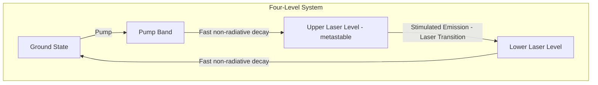

## Laser Materials

### Overview

Laser materials are the gain media (active media) that provide optical amplification through stimulated emission, forming the core component of any laser system. These materials contain active ions, atoms, or molecules capable of achieving population inversion when supplied with external energy (optical, electrical, or chemical pumping).

### Fundamental Physics

**Population Inversion**

A laser material must support population inversion — a nonequilibrium state where more atoms/ions occupy an excited energy level than a lower one. Under normal thermal equilibrium (Boltzmann distribution), lower energy states are always more populated, so achieving inversion requires external pumping.

$$\frac{N_2}{N_1} = \frac{g_2}{g_1} e^{-(E_2-E_1)/k_BT}$$

where $N_1$, $N_2$ are populations of lower/upper levels, $g_1$, $g_2$ are degeneracies, and $k_B T$ is thermal energy. For inversion, this equilibrium relation must be violated via pumping.

**Three- and Four-Level Systems**

Laser materials are classified by their energy level scheme:

- **Three-level system** (e.g., ruby): ground state, metastable upper laser level, and a short-lived pump level. The lower laser level is the ground state itself, so more than half the ground-state population must be pumped to achieve inversion, requiring high pump power.
- **Four-level system** (e.g., Nd:YAG): the lower laser level lies above the ground state and depopulates rapidly via fast non-radiative decay, making inversion far easier to achieve at low pump thresholds.

**Key radiative parameters:**

- **Stimulated emission cross-section** ($\sigma_{se}$): governs gain per unit population inversion
- **Upper-state lifetime** ($\tau$): determines energy storage capacity before spontaneous decay
- **Linewidth and lineshape** (homogeneous vs. inhomogeneous broadening): affects gain bandwidth and tunability
- **Quantum efficiency**: ratio of radiative to total decay rate

### Classification of Laser Materials

#### 1. Solid-State Crystalline and Glass Hosts (Doped Insulators)

The active ions are typically transition metals or rare earths doped into a transparent host lattice.

| Host Type | Examples | Properties |
| --- | --- | --- |
| Oxide crystals | YAG (Y₃Al₅O₁₂), Sapphire (Al₂O₃), YLF (LiYF₄) | High thermal conductivity, good mechanical strength |
| Fluoride crystals | CaF₂, YLF | Lower phonon energy, useful for mid-IR |
| Glasses | Phosphate glass, silicate glass | Broad gain bandwidth, easy to fabricate in large sizes, poor thermal conductivity |

**Common active ions:**

- **Nd³⁺ (Neodymium)**: 4-level system, lasing at 1064 nm (Nd:YAG), also 1053 nm (Nd:glass, used in high-power laser fusion systems), 1047 nm (Nd:YLF)
- **Cr³⁺ (Chromium)**: ruby laser (694.3 nm, 3-level system), Cr:LiSAF, Alexandrite (tunable 700–820 nm)
- **Ti³⁺ (Titanium)**: Ti:Sapphire — extremely broad gain bandwidth (660–1180 nm), enabling ultrafast femtosecond pulse generation
- **Er³⁺ (Erbium)**: 1550 nm emission, critical for telecom (EDFA — erbium-doped fiber amplifiers) and eye-safe lasers
- **Yb³⁺ (Ytterbium)**: quasi-3-level, ~1030 nm, high quantum efficiency, low quantum defect, widely used in high-power fiber and disk lasers
- **Ho³⁺, Tm³⁺**: mid-IR emission (2 µm region), medical and LIDAR applications

#### 2. Semiconductor Laser Materials

Direct-bandgap III-V and II-VI compound semiconductors, where gain arises from electron-hole recombination across the bandgap rather than discrete atomic transitions.

| Material System | Wavelength Range | Application |
| --- | --- | --- |
| GaAs/AlGaAs | 750–900 nm | CD players, pump diodes |
| InGaAsP/InP | 1300–1600 nm | Telecom fiber optics |
| InGaN/GaN | 400–530 nm | Blue-violet laser diodes (Blu-ray) |
| GaN | UV-visible | High-power LEDs/lasers |
| GaSb-based | Mid-IR (2–5 µm) | Gas sensing |

**Key considerations:**

- Bandgap engineering via alloy composition (e.g., $Al_xGa_{1-x}As$) tunes emission wavelength
- Heterostructures (quantum wells, quantum dots) confine carriers and photons, drastically lowering threshold current density
- Direct bandgap is mandatory for efficient radiative recombination (unlike Si or Ge)

$$E_g(x) = E_g(0) + bx + cx^2 \quad \text{(Vegard-type bandgap bowing relation)}$$

#### 3. Gas Laser Materials

- **He-Ne**: 632.8 nm, low power, high coherence, used in metrology/alignment
- **CO₂**: 10.6 µm, high efficiency (~10-20%), industrial cutting/welding
- **Excimer lasers** (ArF, KrF, XeCl): UV, formed from transiently bound noble-gas halide dimers that exist only in the excited state — inherently four-level
- **Argon-ion, Krypton-ion**: visible multiline output, scientific/medical use

#### 4. Liquid (Dye) Laser Materials

Organic dye molecules (e.g., Rhodamine 6G, Coumarin) dissolved in solvents, offering very broad, continuously tunable gain curves due to vibrational-rotational band broadening. Historically important for tunable spectroscopy; largely supplanted by tunable solid-state (Ti:Sapphire) and OPO systems.

#### 5. Fiber Laser Materials

Rare-earth-doped silica or fluoride optical fibers (Yb, Er, Tm-doped) function as both gain medium and waveguide. Large surface-area-to-volume ratio provides excellent thermal management, enabling high average power (multi-kW) with good beam quality due to waveguiding.

### Key Material Selection Criteria

- **Spectroscopic properties**: emission wavelength, cross-section, linewidth
- **Thermal properties**: thermal conductivity, thermal expansion coefficient, thermo-optic coefficient ($dn/dT$) — critical for high-power operation to avoid thermal lensing and fracture
- **Mechanical properties**: hardness, fracture toughness for polishing and durability
- **Optical quality**: low scattering/absorption losses, refractive index homogeneity
- **Chemical stability**: resistance to degradation under pump radiation (photodarkening in fiber lasers)
- **Growth/fabrication feasibility**: Czochralski growth for crystals, MOCVD/MBE for semiconductor epitaxy

### Thermal Management Considerations

High-power laser operation generates heat via the **quantum defect** (energy difference between pump and laser photon):

$$\eta_{qd} = \frac{\lambda_{pump}}{\lambda_{laser}}$$

A smaller quantum defect (e.g., Yb:YAG pumped at 940 nm, lasing at 1030 nm) minimizes waste heat, reducing thermal lensing, stress-induced birefringence, and fracture risk — a major reason Yb-based systems dominate modern high-power solid-state and fiber lasers over Nd-based systems.

**Key Points**

- Laser materials must satisfy population inversion via three- or four-level schemes; four-level systems are strongly preferred for low-threshold operation.
- Rare-earth-doped crystals/glasses (Nd, Yb, Er) dominate solid-state lasers; direct-bandgap semiconductors dominate diode lasers; each material class trades off gain bandwidth, thermal conductivity, and power scalability differently.
- Quantum defect and thermal conductivity of the host are decisive factors in high-power laser material selection.

**Example**

A Nd:YAG laser rod pumped at 808 nm (diode-pumped solid-state, DPSS) lases at 1064 nm. The quantum defect is:

$$\eta_{qd} = \frac{808}{1064} \approx 0.76$$

meaning ~24% of absorbed pump energy is converted to heat within the gain medium — this heat load must be managed via cooling (e.g., conductively-cooled or liquid-cooled rod mounts) to prevent thermal lensing and stress fracture at high average powers.

### Illustration: Four-Level Energy Diagram (svg_diagram)

<svg xmlns="http://www.w3.org/2000/svg" viewBox="0 0 600 380">
<text x="300" y="25" font-size="16" text-anchor="middle" font-weight="bold">Four-Level Laser System Energy Diagram (svg_diagram)</text>
<line x1="80" y1="330" x2="520" y2="330" stroke="black" stroke-width="2" />
<line x1="80" y1="330" x2="80" y2="60" stroke="black" stroke-width="2" />
<text x="40" y="200" font-size="12" transform="rotate(-90 40,200)">Energy</text>

<line x1="100" y1="310" x2="250" y2="310" stroke="black" stroke-width="3" />
<text x="255" y="314" font-size="13">E0 (Ground State)</text>

<line x1="100" y1="230" x2="250" y2="230" stroke="black" stroke-width="3" />
<text x="255" y="234" font-size="13">E1 (Lower Laser Level)</text>

<line x1="100" y1="130" x2="250" y2="130" stroke="black" stroke-width="3" />
<text x="255" y="134" font-size="13">E2 (Upper Laser Level, metastable)</text>

<line x1="100" y1="80" x2="250" y2="80" stroke="black" stroke-width="3" />
<text x="255" y="84" font-size="13">E3 (Pump Band)</text>

<line x1="130" y1="310" x2="130" y2="80" stroke="blue" stroke-width="2" marker-end="url(#arrow)" />
<text x="90" y="200" font-size="12" fill="blue">Pump</text>

<line x1="180" y1="80" x2="180" y2="130" stroke="green" stroke-width="2" stroke-dasharray="4,2" marker-end="url(#arrow)" />
<text x="185" y="105" font-size="11" fill="green">fast decay</text>

<line x1="220" y1="130" x2="220" y2="230" stroke="red" stroke-width="2" marker-end="url(#arrow)" />
<text x="228" y="180" font-size="12" fill="red">Laser Emission</text>

<line x1="200" y1="230" x2="200" y2="310" stroke="green" stroke-width="2" stroke-dasharray="4,2" marker-end="url(#arrow)" />
<text x="150" y="275" font-size="11" fill="green">fast decay</text>
</svg>

### Comparative Cross-Section and Lifetime Data

| Laser Material | Wavelength | Cross-Section (σ, cm²) | Upper-State Lifetime (τ) | Level Scheme |
| --- | --- | --- | --- | --- |
| Nd:YAG | 1064 nm | ~2.8 × 10⁻¹⁹ | ~230 µs | 4-level |
| Yb:YAG | 1030 nm | ~2.1 × 10⁻²⁰ | ~950 µs | Quasi-3-level |
| Ruby (Cr³⁺:Al₂O₃) | 694.3 nm | ~2.5 × 10⁻²⁰ | ~3 ms | 3-level |
| Ti:Sapphire | 660–1180 nm (tunable) | ~3.4 × 10⁻¹⁹ (peak) | ~3.2 µs | 4-level (vibronic) |
| Er:glass | 1535–1560 nm | ~0.6–0.8 × 10⁻²⁰ | ~7–10 ms | Quasi-3-level |

[Unverified] Exact cross-section and lifetime values vary meaningfully with host composition, dopant concentration, and temperature; the figures above are representative ranges drawn from commonly cited literature and should be confirmed against the specific host/dopant combination used.

**Next Steps / Related Topics**

- Laser Cavity Design and Resonator Modes
- Nonlinear Optical Materials (frequency doubling, OPOs)
- Optical Fiber Amplifiers (EDFA, YDFA)
- Semiconductor Heterostructures and Quantum Well Lasers
- Thermal Lensing and Thermo-Mechanical Effects in Solid-State Lasers
- Q-Switching and Mode-Locking Techniques
- Rare-Earth Doped Glass Fabrication (Sol-Gel, Melt-Quench)
- Ultrafast Laser Materials and Kerr-Lens Mode-Locking