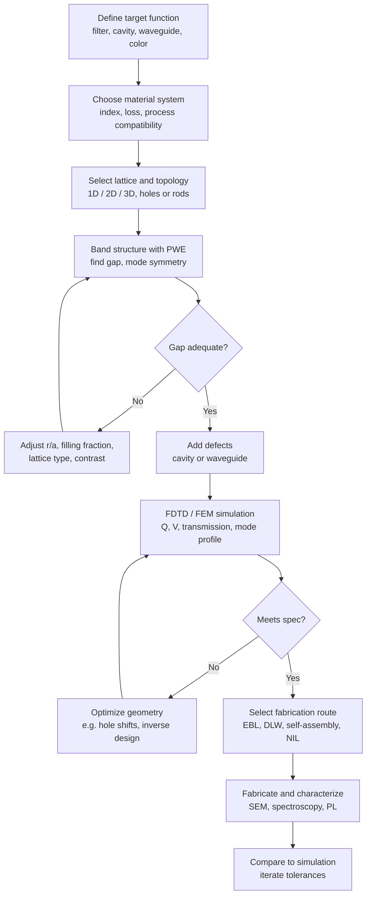

## Photonic Crystals


### Overview

A photonic crystal (PhC) is a material whose refractive index (dielectric function $\varepsilon(\mathbf{r})$) varies periodically on a length scale comparable to the wavelength of light. The periodic modulation of $\varepsilon$ affects photon propagation in the same way the periodic atomic potential of a semiconductor affects electron propagation. The optical analogue of the electronic band gap is the **photonic band gap (PBG)**: a range of frequencies for which no propagating electromagnetic modes exist in the crystal, regardless of propagation direction (complete gap) or along particular directions (pseudo-gap or stop gap).

The concept was introduced independently by Eli Yablonovitch (inhibited spontaneous emission, 1987) and Sajeev John (localization of light, 1987). Natural examples include opal gemstones, butterfly wing scales (e.g., *Morpho* species), and beetle exoskeletons, which generate structural color without pigment.

**Key Points**

- Periodicity of $\varepsilon(\mathbf{r})$ at the scale $a \sim \lambda/2n$ opens photonic band gaps.
- Photonic crystals are classified by dimensionality: 1D (multilayer/Bragg stack), 2D (rod arrays, hole arrays, slabs), and 3D (opals, inverse opals, woodpile, diamond lattices).
- Gap formation requires sufficient **dielectric contrast** $\varepsilon_{high}/\varepsilon_{low}$ and appropriate lattice topology.
- Materials science governs achievable quality: refractive index, absorption, defect density, and fabrication precision determine device performance.
- Applications include structural color, optical filters, low-threshold lasers, photonic-crystal fibers, waveguides, cavities, sensors, and solar cell light management.

### Electromagnetic Theory

#### Maxwell's Equations in Periodic Media

For a source-free, non-magnetic ($\mu = \mu_0$), lossless dielectric with real $\varepsilon(\mathbf{r})$ and harmonic time dependence $e^{-i\omega t}$, Maxwell's equations reduce to the master equation for the magnetic field:

$$\nabla \times \left( \frac{1}{\varepsilon(\mathbf{r})} \nabla \times \mathbf{H}(\mathbf{r}) \right) = \left(\frac{\omega}{c}\right)^2 \mathbf{H}(\mathbf{r})$$

This is a Hermitian eigenvalue problem, written as $\hat{\Theta}\mathbf{H} = (\omega/c)^2 \mathbf{H}$, with the operator:

$$\hat{\Theta} = \nabla \times \frac{1}{\varepsilon(\mathbf{r})} \nabla \times$$

Because the operator is Hermitian, eigenvalues $\omega^2$ are real and eigenmodes are orthogonal. The transversality condition $\nabla \cdot \mathbf{H} = 0$ must also be satisfied.

#### Scale Invariance

Unlike the electronic Schrödinger equation, Maxwell's equations have no fundamental length scale. If the structure is scaled by a factor $s$ ($\varepsilon'(\mathbf{r}) = \varepsilon(\mathbf{r}/s)$), the frequencies scale as $\omega' = \omega/s$. Consequently, results are expressed in normalized frequency $\omega a / 2\pi c = a/\lambda$, where $a$ is the lattice constant. A design proven at microwave frequencies can be scaled to the optical range.

#### Bloch's Theorem for Photons

For a periodic lattice with $\varepsilon(\mathbf{r}) = \varepsilon(\mathbf{r} + \mathbf{R})$, the eigenmodes take the Bloch form:

$$\mathbf{H}_{n\mathbf{k}}(\mathbf{r}) = e^{i\mathbf{k}\cdot\mathbf{r}} \mathbf{u}_{n\mathbf{k}}(\mathbf{r}), \qquad \mathbf{u}_{n\mathbf{k}}(\mathbf{r}) = \mathbf{u}_{n\mathbf{k}}(\mathbf{r}+\mathbf{R})$$

where $n$ is the band index and $\mathbf{k}$ is the Bloch wave vector restricted to the first Brillouin zone. The dispersion relation $\omega_n(\mathbf{k})$ gives the **photonic band structure**.

#### Physical Origin of the Gap (1D Argument)

In a 1D periodic medium of period $a$, a standing wave with $k = \pi/a$ can concentrate its energy either in the high-$\varepsilon$ layers (lower frequency, the *dielectric band*) or in the low-$\varepsilon$ layers (higher frequency, the *air band*). Variational reasoning shows that modes concentrating displacement-field energy in high-$\varepsilon$ regions have lower frequency. The frequency difference between these two standing waves is the gap.

For a quarter-wave stack with indices $n_1$, $n_2$ and layer thicknesses $d_1 n_1 = d_2 n_2 = \lambda_0/4$, the fractional gap width at normal incidence is:

$$\frac{\Delta\omega}{\omega_m} = \frac{4}{\pi}\arcsin\left(\frac{n_2 - n_1}{n_2 + n_1}\right)$$

where $\omega_m$ is the mid-gap frequency. The gap grows monotonically with index contrast.

#### Bragg Condition and Effective Index

The first-order Bragg reflection condition for a 1D stack at incidence angle $\theta$ is:

$$m\lambda_B = 2 \bar{n}_{eff} a \cos\theta_{eff}, \qquad \bar{n}_{eff}^2 = f\, n_1^2 + (1-f)\, n_2^2$$

where $f$ is the filling fraction of material 1 (this is a common approximate estimate of the effective index; exact position requires band-structure calculation). For opals, the widely used form is:

$$\lambda_{max} = 2 d_{111} \sqrt{n_{eff}^2 - \sin^2\theta}, \qquad d_{111} = \sqrt{\tfrac{2}{3}}\,D$$

where $D$ is the sphere diameter and $d_{111}$ is the spacing between (111) planes of an fcc packing.

### Dimensionality and Structures

#### 1D Photonic Crystals

Multilayer dielectric stacks (distributed Bragg reflectors, DBRs) alternate high- and low-index layers. They provide omnidirectional reflection only if the index contrast is large enough and the incidence range is limited (the Brewster-angle condition limits omnidirectionality for p-polarization).

Typical material pairs: SiO$_2$/TiO$_2$, SiO$_2$/Ta$_2$O$_5$, Si/SiO$_2$, GaAs/AlAs, porous Si with alternating porosity.

#### 2D Photonic Crystals

Periodic in two directions, homogeneous in the third. Two canonical lattices:

- **Square lattice of dielectric rods in air**: opens a TM gap (E-field parallel to rods).
- **Triangular lattice of air holes in dielectric**: opens a TE gap (H-field parallel to holes) and can produce a common TE/TM gap at high contrast.

The polarization dependence follows from the continuity conditions: TM modes prefer isolated high-$\varepsilon$ regions (rods), while TE modes prefer connected high-$\varepsilon$ networks (veins between holes). Combined connected-and-isolated topologies (e.g., honeycomb lattices) promote complete 2D gaps.

**Photonic crystal slabs** confine light in the vertical direction by total internal reflection and in-plane by the PBG. They operate below the **light line** $\omega = c|\mathbf{k}_\parallel|$ to avoid radiation into the cladding. Above the light line, modes are leaky resonances (used for guided-mode resonance filters and surface-emitting devices).

#### 3D Photonic Crystals

A complete 3D gap requires a topology that satisfies both connectivity criteria in all directions. Notable structures:

| Structure | Description | Approx. Complete Gap Threshold | Typical Gap-to-Midgap Ratio |
| --- | --- | --- | --- |
| Diamond lattice (dielectric spheres/networks) | Highest gap for given contrast | $n \gtrsim 1.9$ (dielectric-network diamond) | up to ~30% at high contrast |
| Yablonovite | Drilled holes at three angles in fcc arrangement | $n \gtrsim 3.0$ or higher | ~10-20% for Si-like index |
| Woodpile (log-pile) | Orthogonal stacked rods, layers rotated 90° | $n \gtrsim 1.9$-$2.0$ (theoretical) | up to ~20% for Si |
| Inverse opal (fcc air spheres in high-$n$ matrix) | Self-assembled template infiltrated then removed | $n \gtrsim 2.8$ (typically cited ~2.8) | ~5-10% for Si |
| Direct opal (fcc dielectric spheres) | Self-assembled colloidal crystal | No complete gap (only stop gaps) at achievable contrast | n/a |
| Gyroid | Triply periodic minimal surface network | $n \gtrsim 2$ (dependent on structure) | moderate |

Threshold values are approximate and vary with filling fraction and the source publication [Inference: cited numbers differ by author and by structural parameters]. The direct fcc opal has a pseudo-gap only because of band degeneracy at the W point of the Brillouin zone; the inverse opal opens a complete gap between the 8th and 9th bands when the index contrast exceeds roughly 2.8.

### Band Structure Concepts

#### Brillouin Zone and Irreducible Path

Band diagrams are computed along high-symmetry lines of the irreducible Brillouin zone (IBZ). For a 2D square lattice: $\Gamma \to X \to M \to \Gamma$. For a 2D triangular lattice: $\Gamma \to M \to K \to \Gamma$. For 3D fcc: $\Gamma \to X \to W \to K \to \Gamma \to L \to U \to W \to L \to K$.

#### Key Features

- **Band gap**: frequency window without modes. Quantified by the gap-to-midgap ratio $\Delta\omega/\omega_m$.
- **Group velocity**: $\mathbf{v}_g = \nabla_{\mathbf{k}}\omega_n(\mathbf{k})$. It approaches zero at band edges, giving **slow light**.
- **Density of photon states (DOS)**: vanishes inside a complete gap; shows van Hove-type peaks at band edges.
- **Superprism effect**: strong angular dispersion of the refracted beam near band edges, due to highly curved equifrequency contours.
- **Negative refraction**: possible in certain bands where the group velocity direction is opposite to the phase velocity projection, without needing negative $\varepsilon$ and $\mu$.
- **Self-collimation**: flat equifrequency contours cause beams to propagate without diffraction.

#### Light-Matter Interaction

Because the local DOS is modified, spontaneous emission rates change (Purcell effect). For an emitter in a cavity:

$$F_P = \frac{3}{4\pi^2}\left(\frac{\lambda}{n}\right)^3 \frac{Q}{V}$$

where $Q$ is the quality factor and $V$ is the mode volume. High $Q/V$ from photonic crystal cavities enables strong Purcell enhancement and, at sufficient coupling, strong coupling (vacuum Rabi splitting) with quantum dots or color centers.

### Defects: Cavities and Waveguides

Introducing controlled defects into the lattice creates localized modes inside the band gap.

- **Point defects** (a missing rod/hole, altered radius, or extra dielectric): act as microcavities. Modes are confined by the PBG in-plane and by index guiding out of plane (for slabs). Examples: L3 cavity (three missing holes), H1 cavity, heterostructure (Noda) cavities, nanobeam cavities. Quality factors exceeding $10^6$ have been reported experimentally in silicon slab cavities [Unverified: the specific record values depend on the reference and cavity design].
- **Line defects**: a removed row (W1 waveguide) supports guided modes within the gap, allowing sharp bends (~90°) with low loss because light cannot escape into the crystal.
- **Coupled-resonator optical waveguides (CROW)**: chains of cavities transporting light by evanescent hopping between neighbors.
- **Surface defects and topological edge states**: recent work (e.g., valley photonic crystals, quantum-spin-Hall analogues) uses lattice symmetry engineering to produce backscattering-immune edge modes.

The cavity quality factor is $Q = \omega / \Delta\omega = \omega\tau$, and it is limited by:

$$\frac{1}{Q} = \frac{1}{Q_{rad}} + \frac{1}{Q_{abs}} + \frac{1}{Q_{scat}}$$

where $Q_{rad}$ is radiation (leakage) loss, $Q_{abs}$ is material absorption, and $Q_{scat}$ is scattering from fabrication roughness.

### Materials Considerations

Material selection sets the achievable index contrast, operating wavelength range, loss, and processing route.

| Material | Refractive Index (approx.) | Transparency Window | Typical Use |
| --- | --- | --- | --- |
| Si | ~3.48 at 1550 nm | ~1.1-8 µm | Telecom PhC slabs, cavities, waveguides |
| GaAs / AlGaAs | ~3.4-3.5 near 900-1000 nm | ~0.9-17 µm | Quantum-dot lasers, cavity QED |
| InP / InGaAsP | ~3.17-3.5 | ~0.9-1.6 µm (device dependent) | Telecom lasers |
| GaN / AlGaN | ~2.3-2.5 | UV-visible | LEDs, blue/UV devices |
| Si$_3$N$_4$ | ~2.0 | ~0.4-4 µm | Low-loss visible/NIR platforms |
| TiO$_2$ (anatase/rutile) | ~2.5 / ~2.6-2.9 | >~0.4 µm | Inverse opals, visible-range PhCs, DBRs |
| SiO$_2$ | ~1.45 | UV to NIR | Low-index component, opal spheres |
| Polymers (PS, PMMA) | ~1.49-1.59 | Visible-NIR | Opal templates, flexible/tunable PhCs |
| Chalcogenide glasses (As$_2$S$_3$) | ~2.4-2.8 | NIR-MIR | Nonlinear PhCs, mid-IR |
| Ge | ~4.0 | 2-14 µm | Mid-IR PhCs |
| Diamond | ~2.4 | UV-IR | NV-center cavities |
| Metals (Ag, Au, Al) | Complex $\varepsilon$ | Absorption dominates | Metallic/plasmonic PhCs, microwave PhCs |

Approximate values are wavelength dependent and vary by deposition method and crystallinity.

**Critical materials issues**

- **Absorption**: even small extinction coefficients degrade $Q$ and gap depth. Si absorbs below ~1.1 µm, limiting visible-range Si PhCs.
- **Index contrast**: 3D complete gaps need high $n$; achieving that in the visible requires materials such as TiO$_2$, GaP ($n \approx 3.3$ at 600 nm, absorptive near the edge), or a-Si:H, all with trade-offs.
- **Defect density**: stacking faults, vacancies, and polydispersity in self-assembled crystals broaden and shallow the gap.
- **Surface roughness**: sidewall roughness in etched slabs scatters light and limits $Q_{scat}$.
- **Thermal and chemical stability**: important for template-removal steps and device operation.
- **Nonlinearity and tunability**: liquid crystals, electro-optic polymers, phase-change materials (GST, VO$_2$), and free-carrier injection in Si allow tuning of the gap.

### Fabrication Methods

#### Top-Down Nanofabrication

- **Electron-beam lithography (EBL) + reactive ion etching (RIE) / ICP**: standard for 2D slabs. Achieves feature sizes below 20 nm with high precision; serial writing limits throughput.
- **Deep-UV / immersion photolithography (CMOS-compatible)**: enables wafer-scale silicon photonics PhCs.
- **Focused ion beam (FIB) milling**: prototyping and repair; causes ion implantation damage.
- **Nanoimprint lithography (NIL)**: replicates patterns from a master; low cost, high throughput.
- **Layer-by-layer stacking (woodpile)**: sequential deposition, patterning, planarization, and wafer fusion or polysilicon infilling.
- **Two-photon polymerization (direct laser writing, DLW)**: focused femtosecond pulses solidify photoresist in 3D; enables woodpile and arbitrary 3D geometries at ~100 nm resolution. Polymer structures are often converted to high-index by silicon double-inversion or atomic layer deposition (ALD) infiltration.
- **Holographic (interference) lithography**: multi-beam interference exposes photoresist to create periodic 2D/3D patterns over large areas.
- **Glancing angle deposition (GLAD)**: produces helical/zigzag columnar films through substrate rotation and oblique deposition.
- **Angled etching / slanted-hole etching**: used for yablonovite-type structures.

#### Bottom-Up Self-Assembly

- **Colloidal crystallization**: monodisperse silica or polystyrene spheres (diameter 100-1000 nm, polydispersity typically below 5%) assemble into fcc opals by:
  - Gravity sedimentation
  - Vertical convective (evaporative) deposition (Colvin/Jiang method)
  - Spin coating and Langmuir-Blodgett transfer
  - Electrophoretic or electric-field-assisted assembly
- **Inverse opal fabrication**: infiltrate the opal interstices with a high-index precursor by sol-gel, chemical vapor deposition (CVD), ALD, electrodeposition, or atomic-layer epitaxy; then remove the template by calcination or chemical etching (HF for silica, solvent or heat for polymer).
- **Block copolymer self-assembly**: microphase-separated domains form lamellae, gyroid, and cylinders at ~10-100 nm scales; gyroid network structures are promising for optical PhCs.
- **Templating from biological structures**: replicating butterfly wing scales or diatom frustules by infiltration.
- **Porous silicon by electrochemical etching**: periodic modulation of current density yields 1D multilayers (Bragg mirrors, microcavities, rugate filters).
- **Anodic aluminum oxide (AAO)**: self-ordered hole arrays for 2D PhCs.

#### Comparison of Approaches

| Method | Dimensionality | Strengths | Limitations |
| --- | --- | --- | --- |
| EBL + etch | 1D/2D slabs | Precision, arbitrary defects | Cost, throughput |
| DLW | 3D | Arbitrary 3D geometry | Low index polymer, slow, shrinkage |
| Self-assembly | 3D (fcc) | Low cost, large area | Intrinsic defects, limited defect engineering |
| Interference litho | 2D/3D | Large-area periodicity | Limited defect control |
| Layer-by-layer | 3D woodpile | High gap, accurate | Complex, low yield |

### Characterization Techniques

- **Spectroscopy (UV-Vis-NIR transmission/reflection)**: reveals stop-band position and depth. Angle-resolved measurements map the band dispersion and verify the Bragg relation.
- **Fourier-space imaging and angle-resolved reflectivity**: measures band structure of slabs above the light line.
- **Scanning electron microscopy (SEM)** and **focused-ion-beam cross-sectioning**: verify lattice, filling fraction, and defects.
- **Near-field scanning optical microscopy (NSOM/SNOM)**: maps localized modes and waveguide fields.
- **Photoluminescence and time-resolved spectroscopy**: assess emitter lifetime changes (Purcell effect) and cavity $Q$.
- **Confocal laser scanning microscopy**: 3D structure and defect mapping in colloidal crystals.
- **Small-angle X-ray scattering (SAXS)**: for periodicity and order in colloidal and block copolymer PhCs.
- **Microwave transmission measurements**: used for cm-scale scaled analogues.

### Computational Methods

#### Plane Wave Expansion (PWE)

Expand $\varepsilon^{-1}(\mathbf{r})$ and $\mathbf{H}(\mathbf{r})$ in reciprocal lattice vectors $\mathbf{G}$:

$$\mathbf{H}(\mathbf{r}) = \sum_{\mathbf{G}} \mathbf{h}(\mathbf{G})\, e^{i(\mathbf{k}+\mathbf{G})\cdot\mathbf{r}}$$

Substituting into the master equation gives a matrix eigenproblem:

$$\sum_{\mathbf{G}'} \kappa(\mathbf{G}-\mathbf{G}')\, (\mathbf{k}+\mathbf{G})\times\left[(\mathbf{k}+\mathbf{G}')\times \mathbf{h}(\mathbf{G}')\right] = -\left(\frac{\omega}{c}\right)^2 \mathbf{h}(\mathbf{G})$$

where $\kappa(\mathbf{G}) $ are Fourier coefficients of $1/\varepsilon(\mathbf{r})$. PWE converges slowly for high-contrast or discontinuous $\varepsilon$ (Gibbs phenomenon); the inverse-rule formulation (Ho, Chan, Soukoulis) improves it. MIT Photonic Bands (MPB) is the standard open-source PWE code.

#### Finite-Difference Time-Domain (FDTD)

Solves Maxwell's curl equations on a Yee grid by leapfrog time stepping. Handles finite structures, defects, dispersive materials, and transmission spectra. Open-source: MEEP; commercial: Lumerical, COMSOL (FEM), CST.

#### Other Methods

- **Transfer matrix method (TMM)**: exact for 1D multilayers; extended for layered 2D/3D.
- **Rigorous coupled-wave analysis (RCWA)**: for periodic gratings and slabs.
- **Finite element method (FEM)**: complex geometries and eigenmode solves.
- **Korringa-Kohn-Rostoker (KKR) / multiple scattering**: for spherical scatterers such as opals.

**Example**

A minimal band-structure calculation for a 2D square lattice of dielectric rods using MPB's Python interface (Meep/MPB installed via conda):

```python
import meep as mp
from meep import mpb
import numpy as np

# Geometry: alumina-like rods (eps=8.9) radius 0.2a in air, square lattice
geometry_lattice = mp.Lattice(size=mp.Vector3(1, 1))
geometry = [mp.Cylinder(radius=0.2, material=mp.Medium(epsilon=8.9))]

# k-points along Gamma -> X -> M -> Gamma
k_points = [
    mp.Vector3(0, 0),        # Gamma
    mp.Vector3(0.5, 0),      # X
    mp.Vector3(0.5, 0.5),    # M
    mp.Vector3(0, 0),        # Gamma
]
k_points = mp.interpolate(4, k_points)

ms = mpb.ModeSolver(
    geometry_lattice=geometry_lattice,
    geometry=geometry,
    k_points=k_points,
    resolution=32,
    num_bands=8,
)

ms.run_tm()   # TM polarization
tm_freqs = ms.all_freqs
ms.run_te()   # TE polarization
te_freqs = ms.all_freqs

# Gap map: identifies gaps between band n and n+1
ms.run_tm()
print("TM gaps [gap%, freq_min, freq_max]:")
for g in ms.gap_list:
    print(g)
```

**Output**

The TM run for this classic geometry is expected to report a gap between band 1 and band 2 near normalized frequency $\omega a/2\pi c \approx 0.28$-$0.42$ with a gap-to-midgap ratio on the order of tens of percent. Exact numbers depend on resolution and the specific $\varepsilon$ and radius; treat the values as approximate.

### Structural Color and Optical Properties

Structural color arises from coherent scattering rather than absorption. Depending on the structure:

- **Iridescent** (angle-dependent) colors from ordered opals and multilayers (the Bragg shift with angle follows $\lambda(\theta) = \lambda_0\sqrt{1 - \sin^2\theta/n_{eff}^2}$).
- **Angle-independent (non-iridescent)** colors from amorphous photonic structures (short-range order), such as those in bird feathers (e.g., blue jay, eastern bluebird), where the correlation length yields a preferred scattering wavelength without long-range order.
- **Photonic glasses**: disordered arrays of monodisperse spheres yield saturated, viewing-angle-independent color.
- **Suppressed spontaneous emission**: emission inside the gap is inhibited; band-edge emission is enhanced due to the high DOS and slow light.
- **Nonlinear enhancement**: slow-light near band edges increases interaction time, boosting second- and third-harmonic generation, four-wave mixing, and Kerr-type effects. A commonly cited scaling for enhancement in the slow-light regime is $\propto (n_g)^2$ for third-order effects [Inference: exact scaling depends on the process and structure].

### Photonic Crystal Fibers (PCF)

PCFs use a 2D PhC cross-section that extends along the fiber axis.

- **Index-guiding (solid-core) PCF**: a solid core surrounded by an air-hole cladding provides a modified total internal reflection. Features: endlessly single-mode operation, large mode area, high nonlinearity (small core), and engineered dispersion (used for supercontinuum generation).
- **Photonic bandgap (hollow-core) PCF**: light is guided in an air core by the PBG of the cladding. Features: low nonlinearity, low latency, gas-filled applications, high-power handling; attenuation historically above conventional fiber but reduced substantially in anti-resonant hollow-core designs (which rely on anti-resonance rather than a true PBG).

Fabrication proceeds by the stack-and-draw method: glass capillaries and rods are stacked into a preform, then drawn at high temperature while controlling internal pressure to preserve the hole structure.

### Applications

#### Photonic Integrated Circuits and Optical Computing

- Compact waveguides with sharp bends, add-drop filters, splitters, and wavelength-selective devices.
- Slow-light delay lines and optical buffers.
- Nanocavity-based all-optical switches and memories with very low energy per bit.

#### Light Sources

- **Photonic crystal lasers**: defect-cavity lasers with ultralow thresholds, band-edge (distributed-feedback-like) lasers, and photonic crystal surface-emitting lasers (PCSELs) offering high-power, single-mode, narrow-divergence output.
- **LEDs**: PhC patterning of the GaN surface enhances light extraction efficiency by redirecting guided modes.
- **Single-photon sources**: quantum dots in PhC cavities offer Purcell-enhanced emission and efficient collection.

#### Sensing

- Refractive-index sensors: infiltration of analytes shifts the resonance or stop band.
- Photonic-crystal cavity biosensors and label-free detection.
- Colorimetric sensors from inverse opal hydrogels and porous Si for humidity, solvents, glucose, and strain.
- Mechanochromic and thermochromic materials.

#### Energy

- **Solar cells**: PhC back reflectors and textured layers enhance light trapping in thin absorbers; inverse opal electrodes in dye-sensitized cells exploit slow light to increase absorption near the band edge.
- **Thermophotovoltaics and selective thermal emitters**: 2D/3D PhC (often metallic or refractory materials such as W, Ta, or Al$_2$O$_3$) tailor thermal emission spectra.
- **Photocatalysis**: slow-light enhancement of TiO$_2$ inverse opal photocatalytic activity.
- **Radiative cooling**: multilayer or PhC structures with high solar reflectivity and strong thermal-infrared emissivity.

#### Coatings and Filters

- Dielectric mirrors, notch filters, edge filters, dichroic filters, and anti-reflection coatings based on graded-index or moth-eye structures.
- Anti-counterfeiting inks and security features using structural color.
- Displays: reflective color displays based on tunable photonic crystals (e.g., electrically or magnetically tuned Fe$_3$O$_4$ colloidal assemblies).

#### Quantum Photonics

- Cavity quantum electrodynamics with quantum dots, NV centers, and SiV centers in diamond.
- Spin-photon interfaces and quantum memories using nanobeam cavities.

#### Topological Photonics

- Photonic analogues of topological insulators produce protected, unidirectional edge states using magneto-optical effects, engineered coupling (Floquet), or crystalline symmetry (valley Hall).

### Tunable and Dynamic Photonic Crystals

| Mechanism | Tuning Principle | Typical Material | Comment |
| --- | --- | --- | --- |
| Thermo-optic | $dn/dT$ change | Si, polymers, liquid crystals | Slow but simple |
| Electro-optic | Pockels/Kerr effect, field alignment | LiNbO$_3$, EO polymers, liquid crystals | Fast, moderate shift |
| Free-carrier / plasma dispersion | Carrier injection changes $n$ | Si | Ultrafast (ps-ns), high absorption side effect |
| Mechanical (MEMS/NEMS) | Lattice constant or gap change | Elastomers, PDMS, suspended slabs | Large tuning ranges |
| Chemical / swelling | Lattice spacing changes with solvent, pH | Hydrogels, inverse opal polymers | Sensor functionality |
| Magnetic | Field-driven assembly of magnetic colloids | Fe$_3$O$_4@$SiO$_2$ | Rapid, reversible color changes |
| Phase-change | Crystalline-amorphous switching | GST, VO$_2$ | Non-volatile or hysteretic |
| All-optical | Kerr nonlinearity, carrier generation | Si, chalcogenides | Ultrafast switching |

### Design Workflow



### Illustrations

<svg xmlns="http://www.w3.org/2000/svg" viewBox="0 0 640 300" width="640" height="300" font-family="sans-serif" font-size="12">
<text x="320" y="20" text-anchor="middle" font-weight="bold">Photonic Band Structure Schematic (svg_diagram)</text>

<line x1="70" y1="250" x2="600" y2="250" stroke="black" stroke-width="1.5" />
<line x1="70" y1="250" x2="70" y2="40" stroke="black" stroke-width="1.5" />
<text x="335" y="285" text-anchor="middle">Wave vector k (Γ → X)</text>
<text x="25" y="145" text-anchor="middle" transform="rotate(-90 25 145)">Frequency ωa/2πc</text>

<rect x="70" y="120" width="530" height="45" fill="#f9d976" opacity="0.6" />
<text x="335" y="147" text-anchor="middle" font-weight="bold">Photonic band gap</text>

<path d="M70 250 Q 200 200 330 125 Q 400 120 470 122 L 600 122" fill="none" stroke="#1f5fbf" stroke-width="2.5" />
<text x="130" y="205" fill="#1f5fbf">Dielectric band</text>

<path d="M70 160 Q 200 162 330 162 Q 400 100 470 75 L 600 55" fill="none" stroke="#c0392b" stroke-width="2.5" />
<text x="440" y="60" fill="#c0392b">Air band</text>

<line x1="70" y1="250" x2="440" y2="40" stroke="gray" stroke-dasharray="5,4" stroke-width="1.2" />
<text x="330" y="95" fill="gray" transform="rotate(-29 330 95)">light line ω = ck</text>

<text x="70" y="268" text-anchor="middle">Γ</text>
<text x="600" y="268" text-anchor="middle">X</text>
</svg>
<svg xmlns="http://www.w3.org/2000/svg" viewBox="0 0 640 260" width="640" height="260" font-family="sans-serif" font-size="12">
<text x="320" y="20" text-anchor="middle" font-weight="bold">1D, 2D and 3D Photonic Crystal Periodicity (svg_diagram)</text>

<g transform="translate(20,50)">
<rect x="0" y="0" width="16" height="120" fill="#1f5fbf" />
<rect x="16" y="0" width="16" height="120" fill="#e8eef9" stroke="#999" />
<rect x="32" y="0" width="16" height="120" fill="#1f5fbf" />
<rect x="48" y="0" width="16" height="120" fill="#e8eef9" stroke="#999" />
<rect x="64" y="0" width="16" height="120" fill="#1f5fbf" />
<rect x="80" y="0" width="16" height="120" fill="#e8eef9" stroke="#999" />
<rect x="96" y="0" width="16" height="120" fill="#1f5fbf" />
<rect x="112" y="0" width="16" height="120" fill="#e8eef9" stroke="#999" />
<text x="64" y="145" text-anchor="middle">1D: Bragg stack</text>
<text x="64" y="162" text-anchor="middle">periodic in x</text>
</g>

<g transform="translate(230,50)">
<rect x="0" y="0" width="150" height="120" fill="#e8eef9" stroke="#999" />
<g fill="#1f5fbf">
<circle cx="25" cy="20" r="10" /><circle cx="75" cy="20" r="10" /><circle cx="125" cy="20" r="10" />
<circle cx="25" cy="60" r="10" /><circle cx="75" cy="60" r="10" /><circle cx="125" cy="60" r="10" />
<circle cx="25" cy="100" r="10" /><circle cx="75" cy="100" r="10" /><circle cx="125" cy="100" r="10" />
</g>
<text x="75" y="145" text-anchor="middle">2D: rod/hole lattice</text>
<text x="75" y="162" text-anchor="middle">periodic in x, y</text>
</g>

<g transform="translate(450,50)">
<g fill="#1f5fbf" stroke="#0d2f66">
<circle cx="30" cy="30" r="14" /><circle cx="70" cy="30" r="14" /><circle cx="110" cy="30" r="14" />
<circle cx="50" cy="60" r="14" /><circle cx="90" cy="60" r="14" />
<circle cx="30" cy="90" r="14" /><circle cx="70" cy="90" r="14" /><circle cx="110" cy="90" r="14" />
</g>
<text x="70" y="145" text-anchor="middle">3D: opal (fcc spheres)</text>
<text x="70" y="162" text-anchor="middle">periodic in x, y, z</text>
</g>
</svg>

### Common Pitfalls and Design Trade-offs

- **Confusing stop gap with complete gap**: a reflection dip along one crystal direction does not imply a full 3D gap; verify with the DOS or angle-resolved measurements.
- **Ignoring the light line in slabs**: modes above it are lossy; cavity designs must place modes below or engineer them as bound states in the continuum.
- **Underestimating disorder**: fabrication disorder of a few nanometers can reduce $Q$ by orders of magnitude in high-$Q$ cavities and cause Anderson-localization effects in slow-light waveguides.
- **Scaling assumption limits**: while Maxwell's equations are scale invariant, material dispersion and absorption are not; a design working at microwave frequencies does not automatically work at optical frequencies.
- **Plane-wave convergence errors**: too few $\mathbf{G}$ vectors or poor treatment of discontinuous $\varepsilon$ can shift computed gap edges.
- **Polarization dependence**: TE and TM gaps often do not overlap; complete 2D gaps require specific topologies and contrast.
- **Direct opal misconception**: direct fcc opals cannot show a complete gap at achievable index contrasts; inverse opals with $n \gtrsim 2.8$ can.
- **Behavior may vary**: reported gap sizes, Q-factors, and thresholds depend on structural parameters, materials quality, and measurement conditions, and should be validated for each specific system.

### Conclusion

Photonic crystals provide a materials-based route to controlling photons through periodic dielectric structure. Their behavior follows directly from Maxwell's equations in periodic media, with band gaps, slow light, and localized defect states as the central phenomena. Realizing this potential depends on materials science: selecting high-index, low-loss materials, controlling structural order and defects during fabrication, and characterizing structures precisely. Advances in nanofabrication, self-assembly, inverse design, and topological concepts continue to expand applications in integrated photonics, quantum optics, sensing, energy, and structural color.

### Related Topics

**Next Steps**

- Metamaterials and metasurfaces (negative index, plasmonic resonators, Huygens metasurfaces)
- Plasmonic materials and surface plasmon polaritons
- Photonic band-gap fibers and anti-resonant hollow-core fibers
- Inverse design and topology optimization of nanophotonic structures
- Topological photonics (valley Hall, quantum spin Hall analogues, Floquet)
- Quantum dots and color centers for cavity QED
- Opals, inverse opals, and colloidal self-assembly
- Liquid-crystal and stimuli-responsive tunable photonic materials
- Bound states in the continuum and guided-mode resonances
- Thermal photonics: selective emitters and radiative cooling materials
- Silicon photonics platform and CMOS-compatible integration
- Nonlinear optical materials and slow-light enhanced nonlinearity