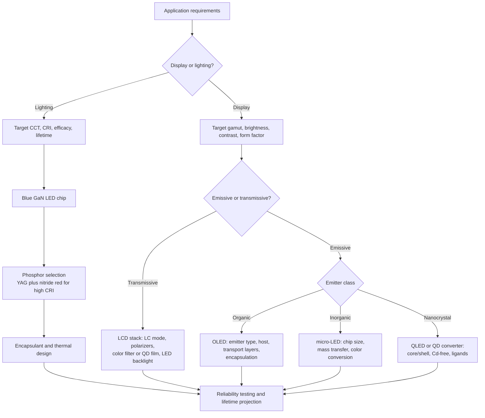

## Materials for Displays and Lighting


### Overview

Display and lighting technologies convert electrical energy into visible light (emissive) or modulate ambient or backlight illumination (non-emissive). Their performance is controlled almost entirely by materials: the semiconductor or organic emitter determines efficiency and color; phosphors and quantum dots convert wavelengths; liquid crystals, polarizers, and color filters shape the image; transparent conductors carry current without blocking light; and barrier films and encapsulants protect sensitive layers from oxygen and moisture.

The field spans several technology families:

- **Inorganic LEDs** (GaN-based, AlGaInP-based) for solid-state lighting and micro-LED displays.
- **Phosphor-converted LEDs (pc-LEDs)** for white light.
- **Organic LEDs (OLEDs)** including fluorescent, phosphorescent, and thermally activated delayed fluorescence (TADF) emitters.
- **Quantum dots (QDs)** as color converters (QD-enhanced LCDs, QD color filters) and direct emitters (QLED/ELQD).
- **Liquid crystal displays (LCDs)** and their optical films.
- **Perovskite emitters** (emerging).
- **Legacy technologies** such as CRT phosphors, fluorescent lamps, and plasma display panels (PDP), relevant for context and materials lineage.

**Key Points**

- Luminous efficacy (lm/W), color rendering index (CRI), correlated color temperature (CCT), color gamut, external quantum efficiency (EQE), and lifetime are the principal figures of merit.
- Efficiency is a product of several factors: charge injection, radiative recombination, spin statistics (for organics), and light extraction.
- Wide-bandgap semiconductors (GaN, InGaN) dominate solid-state lighting; organic and quantum-dot materials dominate high-color-purity applications.
- Transparent conductors (ITO and alternatives), encapsulation barriers, and thermal management materials are enabling technologies as important as the emitters.
- Materials challenges include the "green gap," blue OLED stability, efficiency droop, cadmium and rare-earth supply/toxicity concerns, and perovskite stability.

### Fundamentals of Light Emission and Color

#### Radiative Processes

Light generation in solids arises from radiative recombination of electron-hole pairs (electroluminescence, EL) or from optical excitation followed by emission (photoluminescence, PL). Emission energy relates to wavelength by:

$$E\,[\text{eV}] = \frac{1239.84}{\lambda\,[\text{nm}]}$$

The internal quantum efficiency (IQE) and the light extraction efficiency ($\eta_{ext}$) define the external quantum efficiency. For an LED:

$$\text{EQE} = \eta_{inj} \cdot \eta_{rad} \cdot \eta_{ext}$$

where $\eta_{inj}$ is the carrier injection efficiency, $\eta_{rad}$ is the radiative recombination efficiency, and $\eta_{ext}$ is the extraction efficiency. For an OLED, spin statistics and outcoupling are added explicitly:

$$\text{EQE} = \gamma \cdot \eta_{S/T} \cdot \Phi_{PL} \cdot \eta_{out}$$

where $\gamma$ is the charge balance factor, $\eta_{S/T}$ is the fraction of excitons that can radiate (25% for fluorescent, up to 100% for phosphorescent and TADF), $\Phi_{PL}$ is the photoluminescence quantum yield, and $\eta_{out}$ is the outcoupling efficiency (typically ~20-30% for conventional planar OLEDs without outcoupling enhancement).

#### Photometric and Colorimetric Quantities

Luminous flux $\Phi_v$ weights radiant power by the eye's photopic sensitivity $V(\lambda)$:

$$\Phi_v = 683\,\frac{\text{lm}}{\text{W}} \int_{380}^{780} V(\lambda)\,\Phi_e(\lambda)\,d\lambda$$

Luminous efficacy of a source (lm per electrical watt):

$$\eta_v = \frac{\Phi_v}{P_{elec}}$$

The theoretical maximum efficacy of a monochromatic 555 nm source is 683 lm/W. A white source is limited by the trade-off between spectral width (color quality) and efficacy; broad-spectrum white light with high CRI has a theoretical upper limit of roughly 300-350 lm/W [Inference: quoted limits vary with the CRI and CCT targets of the analysis].

**Color metrics**

| Metric | Definition | Typical Targets |
| --- | --- | --- |
| CIE 1931 (x, y) chromaticity | Coordinates on the CIE diagram | Display primaries defined by standards |
| CCT | Temperature of the blackbody with nearest chromaticity | 2700-6500 K for lighting |
| CRI ($R_a$) | Fidelity of eight test colors vs. reference | ≥80 general; ≥90 high quality |
| $R_9$ | Saturated red rendering | Often required >50 for premium lighting |
| Color gamut | Fraction of a reference space covered (sRGB, DCI-P3, Rec. 2020) | Rec. 2020 coverage is a common goal for QD and laser displays |
| Full width at half maximum (FWHM) | Emission spectral width | ~20-30 nm (QDs, some OLED/perovskite), ~100 nm (phosphors) |

Narrow emission (small FWHM) produces saturated primaries and wide gamut, while broad emission gives better color rendering in lighting. This tension explains why displays and lighting favor different materials.

### Inorganic Semiconductor LEDs

#### III-Nitride Materials (Blue, UV, Green)

The GaN/InGaN/AlGaN alloy system covers the UV to green range. Bandgap engineering follows Vegard-type interpolation with bowing:

$$E_g^{In_xGa_{1-x}N}(x) = x\,E_g^{InN} + (1-x)\,E_g^{GaN} - b\,x(1-x)$$

with $E_g^{GaN} \approx 3.4$ eV, $E_g^{InN} \approx 0.7$ eV, and a bowing parameter $b \approx 1.4$ eV (values vary across literature).

Key structural elements of a GaN LED:

- **Substrate**: sapphire (most common), SiC, Si (cost-driven), or bulk GaN (low defect density, high cost).
- **Buffer and n-GaN**: Si-doped layer providing electrons; a low-temperature nucleation layer helps accommodate the large lattice mismatch with sapphire (~16%).
- **Active region**: InGaN/GaN multiple quantum wells (MQWs), typically 3-10 periods with ~2-3 nm wells.
- **Electron-blocking layer (EBL)**: p-AlGaN to suppress electron overflow.
- **p-GaN**: Mg-doped; activation of Mg acceptors requires annealing to break Mg-H complexes; hole concentration is low due to the deep acceptor level (~170-200 meV).
- **Contacts and current spreading**: ITO or thin metal for p-side spreading; reflective Ag or Al contacts in flip-chip and vertical thin-film architectures.

**Materials challenges**

- **Quantum-confined Stark effect (QCSE)**: polarization fields in c-plane wurtzite InGaN wells separate electron and hole wavefunctions, reducing radiative recombination rate and red-shifting emission with injection. Non-polar and semi-polar orientations reduce this field.
- **Efficiency droop**: EQE decreases at high current density. Proposed mechanisms include Auger recombination, carrier leakage, and defect-assisted processes; the relative contribution is still debated [Unverified: the dominant mechanism is system dependent].
- **Green gap**: efficiency of InGaN at longer wavelengths drops due to higher In content (phase separation, strain, greater QCSE) and AlGaInP efficiency drops toward shorter wavelengths as the direct-indirect crossover approaches.
- **Threading dislocations**: densities of ~$10^8$-$10^9$ cm$^{-2}$ in GaN-on-sapphire; InGaN LEDs tolerate relatively high densities compared to other III-V devices, likely due to carrier localization on In-rich clusters.

#### AlGaInP (Red, Orange, Yellow)

(AlGaInP with lattice-matched GaAs substrates) covers roughly 570-650 nm. Highest efficiency is in the red; efficiency drops toward yellow-green because of the direct-indirect bandgap transition and reduced carrier confinement. Devices typically use a distributed Bragg reflector (DBR) or wafer-bonded transparent substrate to prevent absorption by the GaAs substrate.

#### Other Inorganic Emitters

- **AlGaN**: deep-UV LEDs (~230-350 nm) for disinfection and sensing; challenges include low p-type conductivity, low light extraction, and high defect density.
- **GaP:N, ZnSe** (historical or niche).
- **Laser diodes (GaN blue/green, GaAs-based red)**: used in laser projection and laser-excited phosphor lighting.

#### Micro-LED Displays

Micro-LEDs (µLEDs, ≲50 µm and often <10 µm) offer self-emissive pixels with high brightness, long lifetime, and inorganic stability. Materials and process challenges:

- **Size-dependent efficiency loss** from sidewall nonradiative recombination (surface states); mitigated by sidewall passivation (e.g., ALD Al$_2$O$_3$, SiO$_2$), damage-recovery treatments, and structure optimization.
- **Mass transfer**: pick-and-place (elastomer stamp), laser lift-off and transfer, fluidic self-assembly, and monolithic integration.
- **Full-color strategies**: separate RGB chips, blue µLED plus QD color conversion, or stacked RGB.
- **Red efficiency**: AlGaInP red µLEDs degrade strongly at small size; InGaN-based red is under development.

### Phosphor-Converted White LEDs and Phosphor Materials

The dominant white LED architecture is a blue InGaN chip coated with a yellow phosphor. Alternative designs use near-UV chips with RGB phosphors for higher CRI.

#### Phosphor Fundamentals

A phosphor consists of a host lattice and a luminescent activator (and sometimes a sensitizer). The energy-level scheme (e.g., configuration coordinate diagram) governs absorption, Stokes shift, and thermal quenching:

$$\text{Stokes shift} = E_{abs} - E_{em}$$

Efficiency loss with temperature (thermal quenching) is often described by:

$$I(T) = \frac{I_0}{1 + A \exp\left(-\dfrac{E_a}{k_B T}\right)}$$

where $E_a$ is an activation energy for nonradiative crossing and $A$ is a rate constant ratio. Phosphors in LEDs experience junction temperatures of ~100-150 °C, so high thermal quenching temperatures are critical.

#### Common Phosphors

| Phosphor | Formula (typical) | Emission | Comment |
| --- | --- | --- | --- |
| YAG:Ce | Y$_3$Al$_5$O$_{12}$:Ce$^{3+}$ | Yellow-green (~530-560 nm, broad) | Standard for cool-white LEDs; garnet host, high stability; lacks red, so CRI ~70-80 |
| LuAG:Ce | Lu$_3$Al$_5$O$_{12}$:Ce$^{3+}$ | Green (~510-540 nm) | Good thermal stability; used with red nitrides |
| (Ba,Sr)$_2$SiO$_4$:Eu$^{2+}$ | Silicate | Green-yellow-orange | Sensitive to moisture in some compositions |
| CaAlSiN$_3$:Eu$^{2+}$ (CASN) | Nitride | Red (~620-660 nm) | Excellent thermal stability; used for warm-white and high-CRI |
| (Sr,Ca)AlSiN$_3$:Eu$^{2+}$ (SCASN) | Nitride | Red | Tunable emission via Ca/Sr ratio |
| $\beta$-SiAlON:Eu$^{2+}$ | Oxynitride | Narrow green (~540 nm, FWHM ~50 nm) | Popular in wide-gamut LCD backlights |
| K$_2$SiF$_6$:Mn$^{4+}$ (KSF) | Fluoride | Narrow red (~630 nm lines) | Narrow-band red for backlights; moisture sensitivity requires surface treatment |
| SrGa$_2$S$_4$:Eu$^{2+}$ | Thiogallate | Narrow green | Chemical stability concerns |
| Sr[LiAl$_3$N$_4$]:Eu$^{2+}$ (SLA) | Nitride | Narrow red (~650 nm, FWHM ~50 nm) | Reported as a narrow-band red for high-efficacy lighting; [Unverified: performance numbers vary among reports] |
| Y$_2$O$_3$:Eu$^{3+}$ | Oxide | Line-emission red | Fluorescent lamp and legacy display use |
| BaMgAl$_{10}$O$_{17}$:Eu$^{2+}$ (BAM) | Aluminate | Blue | Fluorescent lamps, plasma displays |

**Design considerations for phosphors**

- **Rigid host lattices** (nitrides, garnets) limit nonradiative relaxation and improve thermal stability.
- **Crystal field splitting** of the Ce$^{3+}$ or Eu$^{2+}$ 5d level shifts emission color: stronger crystal fields and higher covalency red-shift emission (nephelauxetic effect).
- **Particle size, morphology, and scattering** influence light extraction and color uniformity; optimized encapsulant-phosphor dispersions (silicone, epoxy) and remote-phosphor layouts reduce heating.
- **Alternative form factors**: ceramic phosphor plates and phosphor-in-glass (PiG) offer high thermal conductivity for high-power and laser-driven lighting.
- **Rare-earth dependence**: Eu, Ce, Lu, Y are supply-sensitive; research targets Mn$^{4+}$, Mn$^{2+}$, Cr$^{3+}$, and other activators.

#### Down-Conversion Losses

Stokes loss (energy lost when converting a blue photon to a longer-wavelength photon) is fundamental:

$$\eta_{Stokes} = \frac{\lambda_{exc}}{\lambda_{em}}$$

For 450 nm excitation and 550 nm emission, $\eta_{Stokes} \approx 0.82$, so 18% of the pump photon energy is lost as heat even at unity quantum yield.

### Organic Light-Emitting Diodes (OLEDs)

#### Device Architecture

A multilayer thin-film stack (total thickness ~100-300 nm) sandwiched between an anode and a cathode:

```plaintext
Cathode (Al, Ag, Mg:Ag, LiF/Al)
Electron injection layer (EIL)      e.g., LiF, Liq, Cs-doped
Electron transport layer (ETL)      e.g., TPBi, Alq3, TmPyPB
Hole blocking layer (HBL)           (optional)
Emissive layer (EML)                host + dopant (emitter)
Electron blocking layer (EBL)       (optional)
Hole transport layer (HTL)          e.g., NPB, TAPC, TCTA
Hole injection layer (HIL)          e.g., PEDOT:PSS, HAT-CN, MoO3
Anode (ITO)
Substrate (glass, plastic, metal foil)
```

Charge injection, transport, and recombination are managed through energy-level alignment (HOMO/LUMO offsets) between layers.

#### Emitter Generations

Exciton spin statistics dictate that electrical excitation produces 25% singlets and 75% triplets:

- **First generation: fluorescent emitters.** Only singlet excitons radiate; theoretical maximum IQE 25% (with triplet-triplet annihilation adding some extra singlets in specific devices). Materials: Alq$_3$, anthracene derivatives, aromatic amine dopants. Blue OLEDs in commercial panels still frequently use fluorescent emitters because of the stability limitations of blue phosphorescent and TADF emitters.
- **Second generation: phosphorescent emitters.** Heavy-metal (Ir, Pt) complexes exhibit strong spin-orbit coupling that enables intersystem crossing and triplet radiative decay; IQE approaches 100%. Examples: Ir(ppy)$_3$ (green), FIrpic (sky blue), Ir(piq)$_3$ (red), PtOEP (red). Blue phosphorescent devices suffer from short lifetimes because high-energy triplet excitons and polarons cause molecular degradation.
- **Third generation: TADF emitters.** Donor-acceptor molecules with a small singlet-triplet gap $\Delta E_{ST}$ allow thermally assisted reverse intersystem crossing (RISC) from triplet to singlet states:

$$k_{RISC} \propto \exp\left(-\frac{\Delta E_{ST}}{k_B T}\right)$$

Metal-free with potential IQE ~100%. Examples: 4CzIPN (green), carbazole-benzonitrile derivatives. Broad emission and long delayed-fluorescence lifetimes (µs) contribute to efficiency roll-off.

- **Hyperfluorescence and sensitized schemes**: a TADF or phosphorescent sensitizer transfers energy (Förster/Dexter) to a narrow-band fluorescent terminal emitter, combining high efficiency with narrow spectral width; targeted at stable, high-color-purity blue.
- **Polymer OLEDs (PLEDs)** use conjugated polymers (PPV derivatives, polyfluorenes) processed by solution methods (spin coating, inkjet printing).

**Comparison**

| Emitter Type | Max IQE | Typical Materials | Main Limitation |
| --- | --- | --- | --- |
| Fluorescent | ~25% (up to ~62.5% with TTA) | Anthracenes, arylamines | Triplet loss |
| Phosphorescent | ~100% | Ir(III), Pt(II) complexes | Blue stability, rare/expensive metals |
| TADF | ~100% | Donor-acceptor organics | Broad emission, roll-off, blue lifetime |
| Hyperfluorescent | ~100% | TADF sensitizer + fluorescent dopant | Complex device design |

#### Host Materials

Hosts must have triplet energies higher than the guest ($E_T^{host} > E_T^{guest}$) to confine excitons; they also need balanced charge transport. Common hosts include CBP, mCP, CzSi, and bipolar hosts incorporating both carbazole (hole-transporting) and phosphine-oxide, triazine, or pyridine (electron-transporting) units.

#### OLED Stack Challenges and Materials Solutions

- **Outcoupling**: only ~20-30% of light escapes a planar bottom-emitting OLED due to waveguided modes in the organic/ITO layers, substrate modes, and surface plasmon losses at the metal cathode. Strategies: microlens arrays, scattering layers, high-index substrates, corrugated/photonic-crystal structures, and horizontally oriented emitting dipoles (orientation increases outcoupling).
- **Oxygen and moisture sensitivity**: reactive cathodes (Ca, Mg, Ba, low work function metals) and organic layers degrade in the presence of H$_2$O and O$_2$. Requirements: water vapor transmission rate (WVTR) of about $10^{-6}$ g/m$^2$/day (commonly cited). Encapsulation uses glass lids with getters, thin-film encapsulation (TFE) with alternating inorganic (Al$_2$O$_3$, SiN$_x$ by ALD/PECVD) and organic layers, and Barix-type multilayers.
- **Lifetime**: usually specified as LT$_{50}$ or LT$_{95}$ at a reference luminance. Blue is the limiting color; different emitter materials lead to different aging rates across colors, causing differential aging and burn-in.
- **Roll-off**: EQE decreases at high current density due to triplet-triplet annihilation (TTA), triplet-polaron quenching (TPQ), and field-induced quenching.
- **White OLED (WOLED) for lighting**: stacked tandem architectures with charge generation layers (CGL) allow high luminance with lower current density; strategies also include multi-emitter single-layer and RGB color-filter-on-white configurations (used in large OLED TVs).

#### Display Architectures

- **RGB side-by-side (fine metal mask, FMM)**: standard for small mobile panels; evaporation through shadow masks.
- **White OLED + color filters (WOLED)**: used in large-area TV panels; avoids high-resolution masks but color filters absorb light.
- **Blue OLED + QD color conversion (QD-OLED)**: blue emission excites red and green QD layers for pure primaries.
- **Inkjet-printed OLED**: solution-processable materials for large-area, mask-free patterning.
- **Flexible and foldable panels**: plastic (polyimide) substrates and thin-film encapsulation, with thin ultra-strong cover films.

#### Transparent Electrodes for OLEDs

Indium tin oxide (ITO) provides high transparency (>85% at 550 nm) and low sheet resistance (~10-20 Ω/sq for typical films). Concerns: indium scarcity, brittleness under flexing, and index mismatch with organics contributing to waveguiding. Alternatives: PEDOT:PSS, silver nanowire meshes, metal mesh, graphene, carbon nanotubes, and oxide/metal/oxide (OMO) multilayers.

### Quantum Dots and Nanocrystal Emitters

#### Quantum Confinement

In semiconductor nanocrystals, spatial confinement widens the effective bandgap and discretizes energy levels. In the effective-mass (Brus) approximation for a spherical dot of radius $R$:

$$E_{gap}(R) \approx E_g^{bulk} + \frac{\hbar^2 \pi^2}{2 R^2}\left(\frac{1}{m_e^*} + \frac{1}{m_h^*}\right) - \frac{1.8\, e^2}{4\pi \varepsilon \varepsilon_0 R}$$

The size-tunable emission (smaller dot, bluer emission) and narrow spectral width (FWHM ~20-40 nm) allow wide color gamuts.

#### Materials

| QD Material | Structure | Emission Range | Comment |
| --- | --- | --- | --- |
| CdSe/ZnS, CdSe/CdS/ZnS | Core/shell | 460-650 nm | Best-developed; contains Cd (restricted under RoHS with exemption for certain display uses; regulatory status varies by jurisdiction and time) |
| InP/ZnSe/ZnS | Core/shell | 500-650 nm | Cd-free; broader emission (FWHM ~35-45 nm) and greater synthesis sensitivity |
| CuInS$_2$/ZnS | Core/shell | 550-850 nm | Cd-free, broad emission from defect/donor-acceptor recombination |
| ZnSe, ZnTeSe | Core or alloy | Blue | Cd-free blue QLED candidates |
| Carbon dots, Si QDs | Various | Visible | Low toxicity; generally lower color purity |
| PbS, PbSe | Core | Near-IR | For IR LEDs/detectors, not visible display |

Core/shell architecture (wide-bandgap shell over core) passivates surface traps, improves PLQY (>90% achievable), and increases photostability. Thick-shell "giant" QDs reduce blinking and Auger recombination.

#### Applications in Displays

- **QD-enhanced LCD backlight**: blue LEDs excite a QD film (red + green QDs) to produce narrow-band R/G plus leaked blue, leading to gamut coverage exceeding 90% of Rec. 2020 in some implementations [Unverified: coverage depends on filters and QD spectra].
- **QD color conversion layers** (QD-OLED, QD µLED): blue emitter, red/green QD layers; requires thick, high-absorption QD films and blue-light recycling.
- **Electroluminescent QLED**: QD emissive layer between organic or inorganic charge transport layers (ZnO nanoparticle ETL is common). Efficient red and green devices have been reported; blue stability and lifetime remain the limiting factors [Unverified: figures change quickly].

#### Materials Challenges

- **Heavy metals**: Cd and Pb regulatory restrictions drive Cd-free (InP) and Pb-free alternatives.
- **Photo-oxidation and stability** in films under high flux.
- **Reabsorption and FRET** in dense QD films broadening and red-shifting emission.
- **Surface ligand chemistry**: ligand exchange for charge transport vs. maintaining passivation and colloidal stability.
- **Patterning and inkjet-printable inks**: solvent and polymer matrix compatibility, particle size control.

### Perovskite Emitters

Halide perovskites (ABX$_3$, with A = Cs$^+$, MA$^+$, FA$^+$; B = Pb$^{2+}$ (or Sn$^{2+}$); X = Cl$^-$, Br$^-$, I$^-$) offer high PLQY, narrow emission (FWHM ~15-25 nm), and tunable bandgap via halide composition. Emission tuning: I → red/NIR, Br → green, Cl-Br mixes → blue.

- **Forms**: 3D thin films, nanocrystals (CsPbX$_3$ quantum dots), and quasi-2D Ruddlesden-Popper layered perovskites (reduced dimensionality promotes exciton binding and efficient radiative recombination through energy funneling).
- **Progress**: green and red perovskite LEDs (PeLEDs) with EQE above 20% have been reported in the literature [Unverified: record values change rapidly].
- **Challenges**: operational stability (ion migration, phase segregation in mixed halide blue/mixed compositions), lead toxicity, sensitivity to moisture, heat, and light, and blue device performance.

### Liquid Crystal Displays (LCD) Materials

An LCD modulates light from a backlight by electrically controlling the orientation of liquid crystal molecules, which changes polarization through birefringence.

#### Liquid Crystal Materials

Liquid crystals (LCs) are anisotropic organic molecules (rod-like calamitic mesogens) that exhibit intermediate phases between crystalline solid and isotropic liquid. Key parameters:

- **Birefringence** $\Delta n = n_e - n_o$ (typically 0.08-0.25 for display mixtures).
- **Dielectric anisotropy** $\Delta\varepsilon = \varepsilon_\parallel - \varepsilon_\perp$ (positive for TN and IPS mixtures; negative for VA).
- **Rotational viscosity** $\gamma_1$ (influences response time).
- **Elastic constants** ($K_{11}$, $K_{22}$, $K_{33}$) and clearing point.
- **Voltage holding ratio (VHR)** (requires high purity; fluorinated LCs preferred over cyano compounds for TFT drive).

A transmissive LC cell's optical retardation is:

$$\Gamma = \frac{2\pi\, \Delta n\, d}{\lambda}$$

where $d$ is the cell gap; the Mauguin/first-minimum conditions guide cell design. Response time for a nematic cell scales as:

$$\tau_{on/off} \propto \frac{\gamma_1 d^2}{K \pi^2}$$

(with an additional voltage dependence for turn-on), motivating low-viscosity mixtures and thin cell gaps.

Typical LC mixture components: fluorinated biphenyls, cyclohexylbenzenes, terphenyls, tolane derivatives (high $\Delta n$), and difluorophenyl compounds.

#### LCD Modes

| Mode | LC Type | Features |
| --- | --- | --- |
| Twisted nematic (TN) | Positive $\Delta\varepsilon$ | Low cost, narrow viewing angle |
| In-plane switching (IPS, FFS) | Positive or negative $\Delta\varepsilon$ | Wide viewing angle, color stability; mobile/monitor use |
| Vertical alignment (VA, MVA, PVA) | Negative $\Delta\varepsilon$ | High contrast (native ~3000-5000:1 typical), used in TVs |
| Blue-phase LC | Chiral LC | Fast (sub-ms), polarizer-free potential; high voltage and stability challenges |
| Polymer-dispersed / PSLC | LC + polymer | Scattering-mode privacy windows, smart glass |

#### Other LCD Optical Materials

- **Polarizers**: iodine-doped stretched polyvinyl alcohol (PVA) sandwiched between triacetyl cellulose (TAC) or cyclic olefin polymer protective layers; high extinction ratios (>10,000:1) with transmission ~42-44%.
- **Compensation and retardation films**: discotic or biaxial films to widen viewing angle and correct off-axis light leakage.
- **Color filters**: dye or pigment-based (R, G, B) with typical LCD transmission ~30%; QD color filters are under development for higher efficiency and gamut.
- **Alignment layers**: rubbed polyimide or photoalignment materials (azo dyes, cinnamates) define LC orientation.
- **Backlights**: white LED edge-lit or direct-lit (including mini-LED with local dimming); light-guide plates (PMMA, polycarbonate), diffusers, prism sheets (BEF), and reflective polarizers (DBEF) for recycling.
- **Thin-film transistor (TFT) backplanes**: amorphous silicon (a-Si:H), low-temperature polysilicon (LTPS), and oxide semiconductors (IGZO) for large area, high mobility, and low leakage.

### Backplane and Driving Materials

| Backplane | Mobility (cm$^2$/Vs, approximate) | Typical Use |
| --- | --- | --- |
| a-Si:H | ~0.5-1 | Large LCD TVs, cost-driven |
| Oxide (a-IGZO) | ~10-40 | High-resolution LCD, OLED TV, large panels; low off-current |
| LTPS | ~50-100+ | Mobile OLED and LCD, high PPI |
| LTPO (LTPS + oxide hybrid) | LTPS drive TFTs + oxide switch TFTs | Variable refresh rate OLED for mobile/wearables |
| Organic TFT | ~0.1-10 | Flexible/emerging |
| Si CMOS | >100 | Micro-displays (OLEDoS, µLED on Si) |

Mobility values vary with deposition and process conditions.

### Transparent Conductors and Optical Films

**Transparent conducting oxides (TCOs)**: ITO, IZO, AZO (Al-doped ZnO), FTO. The figure of merit trades conductivity against transparency:

$$\Phi_{TC} = \frac{T^{10}}{R_s}$$

(Haacke's figure of merit, with $T$ as transmittance and $R_s$ as sheet resistance). ITO remains dominant for displays but faces indium supply concerns.

**Alternatives**: silver nanowires, copper mesh, graphene, conductive polymer PEDOT:PSS, CNT films, and OMO stacks—particularly relevant to flexible/foldable and touch applications.

**Optical functional films**:

- Anti-reflection and anti-glare coatings (multilayer thin films or nanostructured moth-eye).
- Barrier films (SiN$_x$, Al$_2$O$_3$, hybrid organic-inorganic multilayers).
- Cover windows: chemically strengthened aluminosilicate glass (ion-exchanged with K$^+$ for compressive surface stress), ultra-thin glass (UTG) for foldables, transparent polyimide.
- Optical clear adhesives (OCA) with matched index and low haze.

### Solid-State Lighting Systems and Thermal Materials

Thermal management is essential because LED efficiency and lifetime degrade with junction temperature $T_j$. Simplified thermal chain:

$$T_j = T_a + P_{th} \cdot (R_{th,jc} + R_{th,cb} + R_{th,ba})$$

where $P_{th}$ is dissipated thermal power and $R_{th}$ terms are thermal resistances (junction-case, case-board, board-ambient).

Materials involved:

- **Substrates and submounts**: AlN, Al$_2$O$_3$, Si, and Cu-based metal-core PCBs for heat spreading.
- **Die attach**: Au-Sn eutectic, sintered silver, high-conductivity thermal interface materials.
- **Encapsulants**: high-refractive-index silicones (~1.5) with good thermal and photo-stability; epoxy yellowing under blue/UV flux is a failure mode. High-index encapsulation improves extraction from GaN dies.
- **Reflectors and packages**: ceramic, EMC (epoxy molding compound), PCT/PPA polymers with white fillers (TiO$_2$); discoloration is a reliability risk.
- **Heat sinks**: extruded aluminum, copper, or graphite/graphene-based spreaders.

**Lifetime metrics**: L70/L80 (time to 70% or 80% of initial lumen output) and TM-21 extrapolation methodology (with the caveat that extrapolation validity varies with test duration and device design).

### Legacy and Complementary Technologies

- **Incandescent and halogen**: blackbody radiators with ~2-5% luminous efficiency; tungsten filaments.
- **Fluorescent lamps**: Hg vapor discharge (254 nm UV) exciting tri-phosphor coatings (Y$_2$O$_3$:Eu$^{3+}$ red, LaPO$_4$:Ce,Tb or (Ce,Tb)MgAl$_{11}$O$_{19}$ green, BaMgAl$_{10}$O$_{17}$:Eu$^{2+}$ blue). Environmental concerns over mercury have accelerated their replacement by LEDs.
- **CRT phosphors**: ZnS:Ag (blue), ZnS:Cu,Al (green), Y$_2$O$_2$S:Eu (red).
- **Plasma displays**: Xe/Ne gas discharge with UV-excited phosphors; largely discontinued.
- **Electroluminescent (EL) thin-film panels**: ZnS:Mn and related, with niche use.
- **Electrophoretic (E-ink) displays**: reflective, bistable, using charged TiO$_2$ and carbon black particles in microcapsules or microcups; extremely low power for static images.
- **Laser and laser-phosphor lighting**: blue lasers exciting remote phosphor wheels/plates for projection and automotive headlights.

### Comparison of Display and Emitter Technologies

| Attribute | LCD (LED backlight) | LCD + QD | OLED | QD-OLED | QLED (EL) | Micro-LED |
| --- | --- | --- | --- | --- | --- | --- |
| Emission type | Transmissive | Transmissive | Emissive | Emissive with QD conversion | Emissive | Emissive |
| Color purity | Moderate | High | High | Very high | Very high (potential) | High to very high |
| Black level | Backlight-dependent (improved by local dimming) | Same | True black | True black | True black | True black |
| Peak brightness | High | High | Moderate to high | High | Under development | Very high |
| Lifetime concerns | Backlight, LC stable | QD photostability | Blue emitter aging; burn-in | Blue OLED + QD | Blue QLED lifetime | Mass transfer yield, cost |
| Major materials issues | Polarizer, color filter loss | Cd/InP, barrier films | Encapsulation, blue emitter | Blue stack, QD ink | Blue QD stability | Efficiency at small size, red |

Values are qualitative and product-dependent.

### Selection and Design Considerations



### Illustrations

<svg xmlns="http://www.w3.org/2000/svg" viewBox="0 0 640 340" width="640" height="340" font-family="sans-serif" font-size="12">
<text x="320" y="20" text-anchor="middle" font-weight="bold">OLED Multilayer Device Stack (svg_diagram)</text>
<g stroke="#333" stroke-width="1">
<rect x="120" y="40" width="300" height="24" fill="#c9c9c9" />
<rect x="120" y="64" width="300" height="24" fill="#f4b183" />
<rect x="120" y="88" width="300" height="24" fill="#f8cbad" />
<rect x="120" y="112" width="300" height="34" fill="#a9d18e" />
<rect x="120" y="146" width="300" height="24" fill="#bdd7ee" />
<rect x="120" y="170" width="300" height="24" fill="#9dc3e6" />
<rect x="120" y="194" width="300" height="24" fill="#deebf7" />
<rect x="120" y="218" width="300" height="24" fill="#e2f0d9" />
<rect x="120" y="242" width="300" height="34" fill="#f2f2f2" />
</g>
<g>
<text x="270" y="57" text-anchor="middle">Cathode (Al, Mg:Ag)</text>
<text x="270" y="81" text-anchor="middle">Electron injection layer (LiF, Liq)</text>
<text x="270" y="105" text-anchor="middle">Electron transport layer (TPBi)</text>
<text x="270" y="133" text-anchor="middle">Emissive layer (host : dopant)</text>
<text x="270" y="163" text-anchor="middle">Hole/exciton blocking layer</text>
<text x="270" y="187" text-anchor="middle">Hole transport layer (NPB, TAPC)</text>
<text x="270" y="211" text-anchor="middle">Hole injection layer (HAT-CN, PEDOT:PSS)</text>
<text x="270" y="235" text-anchor="middle">Anode (ITO)</text>
<text x="270" y="263" text-anchor="middle">Glass or plastic substrate</text>
</g>

<line x1="470" y1="70" x2="470" y2="130" stroke="#c0392b" stroke-width="2" marker-end="url(#a)" />
<line x1="510" y1="230" x2="510" y2="160" stroke="#1f5fbf" stroke-width="2" marker-end="url(#b)" />
<text x="470" y="60" text-anchor="middle" fill="#c0392b">e⁻</text>
<text x="510" y="250" text-anchor="middle" fill="#1f5fbf">h⁺</text>
<text x="590" y="140" text-anchor="middle" fill="#2e7d32">light out ↓</text>
</svg>
<svg xmlns="http://www.w3.org/2000/svg" viewBox="0 0 640 260" width="640" height="260" font-family="sans-serif" font-size="12">
<text x="320" y="20" text-anchor="middle" font-weight="bold">Emission Spectral Widths of Common Emitters (svg_diagram)</text>
<line x1="60" y1="210" x2="600" y2="210" stroke="black" stroke-width="1.5" />
<text x="330" y="245" text-anchor="middle">Wavelength (nm): 400 ......... 500 ......... 600 ......... 700</text>

<path d="M120 210 Q 130 80 140 210" fill="#1f5fbf" opacity="0.7" />
<path d="M260 210 Q 275 60 290 210" fill="#2e7d32" opacity="0.7" />
<path d="M430 210 Q 445 70 460 210" fill="#c0392b" opacity="0.7" />
<text x="130" y="60" text-anchor="middle" fill="#1f5fbf">QD / perovskite</text>
<text x="275" y="45" text-anchor="middle" fill="#2e7d32">FWHM ~20-40 nm</text>

<path d="M200 210 Q 320 60 470 210" fill="#f1c40f" opacity="0.45" />
<text x="340" y="130" text-anchor="middle" fill="#8a6d00">YAG:Ce phosphor</text>
<text x="340" y="146" text-anchor="middle" fill="#8a6d00">FWHM ~100+ nm</text>
</svg>

### Reliability, Environmental, and Sustainability Aspects

- **Blue-light hazard and photobiological safety**: IEC 62471 classifies lamp risk groups; high-CCT LEDs have a larger blue component.
- **Flicker and temporal light artifacts**: driven by PWM dimming; relevant to OLED panels at low brightness.
- **RoHS/REACH**: restrict Pb, Hg, Cd; QD and perovskite compositions face scrutiny.
- **Critical materials**: In (ITO), Ga, rare earths (Eu, Y, Tb, Lu, Ce), Ir (phosphorescent OLEDs), and Cd/Pb (QDs, perovskites) motivate substitution and recycling.
- **Recycling**: display panel recycling recovers glass and indium; LED recycling recovers Ga, As, and rare earths at low economic incentive.
- **Behavior may vary**: efficiency, lifetime, and color figures reported here are representative and depend on device architecture, drive conditions, and manufacturing.

### Emerging Directions

- **Blue phosphorescent and stable blue TADF/hyperfluorescent OLEDs** for lower power and longer lifetime.
- **Electroluminescent QLED** with Cd-free (InP, ZnSe) emitters and improved blue.
- **Perovskite LEDs** with stabilized compositions and Pb-free options.
- **Micro-LED** with monolithic RGB integration, red InGaN, and improved mass transfer.
- **Narrow-band phosphors** for backlights and lighting (Mn$^{4+}$ fluorides, Eu$^{2+}$ nitrides).
- **Stretchable, flexible, and transparent displays** based on intrinsically stretchable conductors, elastomeric substrates, and ultra-thin encapsulation.
- **AR/VR micro-displays**: OLEDoS and micro-LED on silicon, high pixel density and brightness, pancake optics and waveguides.
- **Laser lighting and laser projection** with phosphor wheels and RGB laser diodes.
- **Human-centric and tunable lighting** using multi-channel LEDs and tunable CCT.
- **Photonic and nanostructure light management** including outcoupling gratings and metasurface color filters.

### Conclusion

Displays and lighting are materials-limited technologies: each family of emitters (III-nitride and III-phosphide semiconductors, phosphors, organic molecules, quantum dots, perovskites) is defined by a distinctive trade-off among efficiency, spectral purity, stability, cost, and manufacturability. Enabling layers such as liquid crystals, polarizers, transparent conductors, barrier films, TFT semiconductors, and thermal materials determine whether device-level performance can be achieved in practice. Progress increasingly depends on co-design of emitter chemistry, device architecture, and optical extraction, with sustainability and critical-material constraints shaping material selection.

### Related Topics

**Next Steps**

- Solid-state lighting device physics: carrier dynamics, Auger recombination, and droop
- OLED photophysics: Förster and Dexter energy transfer, exciplex and TADF mechanisms
- Quantum dot synthesis and surface chemistry (hot-injection, ligand engineering, shelling)
- Perovskite materials and optoelectronic devices
- Liquid crystal physics and electro-optic modes (Frederiks transition, IPS/FFS/VA design)
- Transparent conductive materials and flexible electrodes
- Thin-film encapsulation and barrier materials (ALD, hybrid multilayers)
- Optical outcoupling: photonic crystals, metasurfaces, and microlens arrays
- Color science: CIE spaces, CRI vs. TM-30 metrics, gamut mapping
- Micro-LED epitaxy, transfer, and integration
- Thermal management materials for high-power LEDs and laser lighting
- Phosphor discovery: crystal-field analysis, high-throughput computation, and machine-learning screening
- AR/VR display optics and waveguide materials