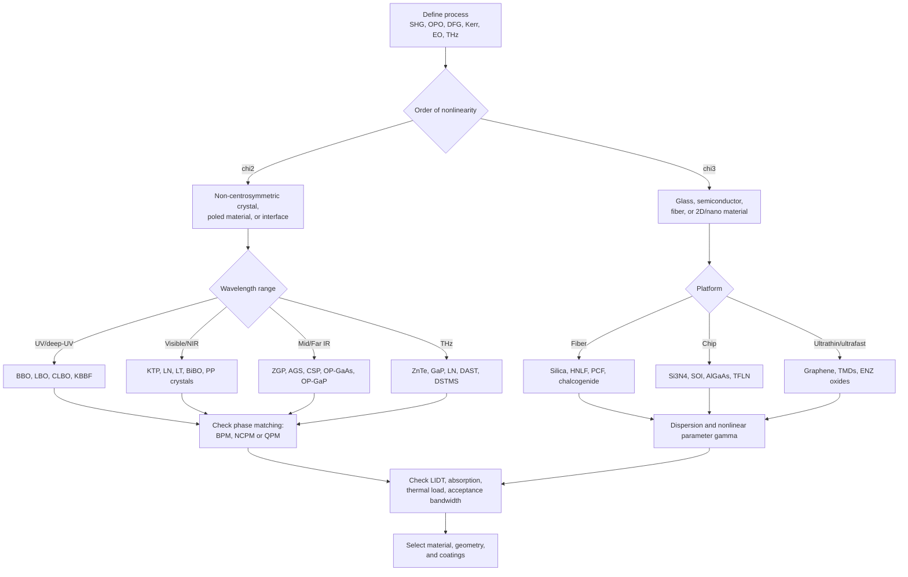

## Nonlinear Optical Materials


### Overview

Nonlinear optical (NLO) materials respond to intense electromagnetic fields in a manner that is not proportional to the field amplitude. At low intensities, the polarization of a dielectric is linear in the electric field, and light passes through without changing frequency or interacting with other beams. At the intensities available from lasers (typically $10^6$-$10^{15}$ W/cm$^2$, depending on the process), higher-order terms in the polarization become significant. This enables frequency conversion, all-optical switching, optical parametric amplification, self-focusing, ultrafast pulse generation and measurement, and many other effects.

From a materials perspective, nonlinear performance is governed by crystal symmetry, electronic structure, bandgap, transparency range, phase-matching behavior, damage threshold, thermal properties, and manufacturability (crystal growth, poling, thin-film deposition, or device fabrication).

**Key Points**

- The nonlinear polarization is a power series in the field: $\chi^{(2)}$ effects (second-harmonic generation, sum/difference frequency, Pockels effect, optical parametric processes) require a non-centrosymmetric medium; $\chi^{(3)}$ effects (Kerr effect, third-harmonic generation, four-wave mixing, two-photon absorption, Raman and Brillouin scattering) occur in all materials.
- Efficient conversion requires **phase matching** (momentum conservation), achieved by birefringence, quasi-phase-matching (periodic poling), or modal/waveguide engineering.
- Selection of a material involves tradeoffs among nonlinear coefficient, transparency window, damage threshold, birefringence and acceptance bandwidth, absorption, photorefractive susceptibility, hygroscopicity, and growth availability.
- Material classes include inorganic crystals (borates, niobates, phosphates), semiconductors (III-V, II-VI, chalcopyrites), glasses (silica, chalcogenide, tellurite), organic and polymer systems, 2D materials, nanostructures, and metamaterials/metasurfaces.
- Bandgap and nonlinearity are coupled: wide-gap materials have high damage thresholds and UV transparency but weaker nonlinearities, while narrow-gap materials show large nonlinearities but suffer from multi-photon absorption.

### Fundamentals of Nonlinear Optics

#### Nonlinear Polarization

The polarization of a medium is expanded in powers of the applied field:

$$\mathbf{P}(t) = \varepsilon_0\left[\chi^{(1)}\mathbf{E}(t) + \chi^{(2)}\mathbf{E}^2(t) + \chi^{(3)}\mathbf{E}^3(t) + \cdots\right]$$

In tensor form, for frequency components:

$$P_i(\omega_3) = \varepsilon_0 \sum_{jk} \chi^{(2)}_{ijk}(\omega_3;\omega_1,\omega_2)\,E_j(\omega_1)E_k(\omega_2)$$

The tensors $\chi^{(2)}$ (rank 3) and $\chi^{(3)}$ (rank 4) obey the symmetry of the crystal point group. Kleinman symmetry (valid when all frequencies are far below the resonances) reduces the number of independent elements of $\chi^{(2)}$. In practice, the contracted notation $d_{il}$ is used, with $d_{ijk} = \tfrac{1}{2}\chi^{(2)}_{ijk}$, and the effective nonlinear coefficient $d_{eff}$ depends on propagation direction and polarization.

#### Symmetry Requirements

Under inversion, $\mathbf{P}\to-\mathbf{P}$ and $\mathbf{E}\to-\mathbf{E}$. For even-order terms this forces the coefficient to satisfy $\chi^{(2)} = -\chi^{(2)} = 0$ in centrosymmetric media. Consequently:

- Only the 20 non-centrosymmetric piezoelectric point groups (all except the 432 cubic class) can display bulk $\chi^{(2)}$ effects.
- Surface and interface SHG (where inversion symmetry is broken) and electric-field-induced SHG (EFISH) provide $\chi^{(2)}$-like responses in centrosymmetric materials such as silicon and glasses.
- Poling of glass or polymer (thermal/UV poling) creates a frozen-in DC field and effective $\chi^{(2)}$.

#### Coupled-Wave Equations

Under the slowly varying envelope approximation, for sum-frequency generation $\omega_3 = \omega_1 + \omega_2$:

$$\frac{dA_3}{dz} = \frac{i\omega_3 d_{eff}}{n_3 c}A_1A_2\,e^{i\Delta k z}, \qquad \Delta k = k_3 - k_1 - k_2$$

with analogous equations for $A_1$ and $A_2$. For second-harmonic generation (SHG) in the undepleted-pump approximation with input intensity $I_\omega$, crystal length $L$:

$$\eta_{SHG} = \frac{I_{2\omega}}{I_\omega} = \frac{2\omega^2 d_{eff}^2 L^2 I_\omega}{n_\omega^2 n_{2\omega}\varepsilon_0 c^3}\,\text{sinc}^2\!\left(\frac{\Delta k L}{2}\right)$$

The $\text{sinc}^2$ factor shows that conversion efficiency collapses unless $\Delta k \approx 0$. The coherence length is $L_c = \pi/\Delta k$.

#### Third-Order Effects

The intensity-dependent refractive index and absorption are described by:

$$n(I) = n_0 + n_2 I, \qquad \alpha(I) = \alpha_0 + \beta I$$

where $n_2$ is the nonlinear (Kerr) index and $\beta$ is the two-photon absorption (TPA) coefficient. Their relation to $\chi^{(3)}$ (SI-based, for a linearly polarized field and an isotropic medium):

$$n_2 = \frac{3}{4 n_0^2 \varepsilon_0 c}\,\text{Re}\,\chi^{(3)}, \qquad \beta = \frac{3\omega}{2 n_0^2 \varepsilon_0 c^2}\,\text{Im}\,\chi^{(3)}$$

A key figure of merit for all-optical switching is:

$$\text{FOM} = \frac{n_2}{\beta\lambda}$$

with FOM > 1 commonly taken as a requirement for practical switching without excessive nonlinear loss.

### Phase Matching

Since dispersion makes $n(\omega)$ frequency dependent, $\Delta k = 0$ is not naturally satisfied. Solutions:

#### Birefringent Phase Matching (BPM)

Use the difference between ordinary and extraordinary indices to offset dispersion.

- **Type I**: the two inputs have the same polarization, and the output is orthogonal (e.g., o + o → e in negative uniaxial crystals).
- **Type II**: the two inputs have orthogonal polarizations.
- **Critical phase matching (CPM)**: angle tuning; sensitive to angular deviation and subject to walk-off between ordinary and extraordinary beams, limiting effective interaction length and beam quality.
- **Non-critical phase matching (NCPM)**: temperature tuning at 90° propagation; eliminates walk-off and improves acceptance angle (e.g., LBO, KTP for certain wavelengths).

Parameters that define practical acceptance: angular, spectral, and temperature bandwidths, given by $\Delta\theta\cdot L$, $\Delta\lambda\cdot L$, $\Delta T\cdot L$ products.

#### Quasi-Phase Matching (QPM)

Instead of matching by birefringence, the sign of $d_{eff}$ is periodically inverted with period $\Lambda = 2L_c$ (first-order QPM), compensating for accumulated phase mismatch:

$$\Delta k_{QPM} = k_3 - k_1 - k_2 - \frac{2\pi m}{\Lambda} = 0$$

The effective nonlinearity for a first-order square-wave grating is $d_{QPM} = (2/\pi)d_{eff}$ (reduced relative to perfect phase matching). Advantages: access to the highest tensor element ($d_{33}$ in LiNbO$_3$-family crystals, all polarizations parallel), arbitrary wavelengths within the transparency window, noncritical geometry, chirped or aperiodic gratings for broadband and multi-wavelength operation, and integration into waveguides.

QPM is realized through:

- Electric-field poling of ferroelectrics (LiNbO$_3$, LiTaO$_3$, KTP).
- Orientation-patterned semiconductor growth (OP-GaAs, OP-GaP) using epitaxial regrowth on patterned template substrates.
- Domain engineering in stoichiometric or MgO-doped crystals for reduced photorefractive damage.

#### Waveguide and Modal Phase Matching

In integrated waveguides, phase matching can be obtained by mode dispersion engineering, Čerenkov-type radiation, or between modes of different orders (modal phase matching); also via cavity resonances (enhanced SHG in microrings, photonic crystal cavities).

**Comparison**

| Method | Advantages | Limitations |
| --- | --- | --- |
| Critical BPM | Simple, established for many crystals | Walk-off, narrow acceptance angle |
| NCPM | No walk-off, wide angular acceptance | Limited to particular wavelengths/temperatures |
| QPM | Uses $d_{33}$, flexible wavelength, long interaction | Poling complexity, ~63% of ideal coefficient (first order) |
| Modal (waveguide) | Compact, high intensity over long length | Fabrication tolerance, small modal overlap |

### Second-Order Nonlinear Materials

#### Figures of Merit

A rough figure of merit for frequency conversion crystals scales as:

$$\text{FOM}_{SHG} \propto \frac{d_{eff}^2}{n^3}$$

with extra requirements: adequate transparency at pump and generated wavelengths, low absorption (including two-photon absorption of the pump), laser-induced damage threshold (LIDT), thermal conductivity and low dn/dT, large acceptance bandwidths, optical homogeneity, and sizeable crystal growth.

#### Inorganic Oxide and Borate Crystals

| Material | Formula | Transparency (approx.) | $d_{eff}$ (pm/V, representative) | Notes |
| --- | --- | --- | --- | --- |
| KDP | KH$_2$PO$_4$ | ~0.18-1.5 µm | ~0.4 | Large-aperture growth (fusion-class lasers); low damage-limiting absorption; hygroscopic |
| DKDP | KD$_2$PO$_4$ | ~0.2-2.0 µm | ~0.4 | Used for large Pockels cells and third-harmonic generation in inertial fusion |
| BBO | $\beta$-BaB$_2$O$_4$ | ~0.19-3.5 µm | ~2 | UV SHG, OPA/OPO, deep-UV limit; high damage threshold; walk-off significant |
| LBO | LiB$_3$O$_5$ | ~0.16-2.6 µm | ~0.8 | Low walk-off, NCPM possible, high damage threshold, wide acceptance |
| CLBO | CsLiB$_6$O$_{10}$ | ~0.18-2.75 µm | ~1 | Deep-UV (e.g., 4th/5th harmonic of Nd lasers); hygroscopic |
| KTP | KTiOPO$_4$ | ~0.35-4.5 µm | ~3-4 | Green light from Nd:YAG; QPM (PPKTP); grey-tracking susceptibility |
| KTA, RTP | KTiOAsO$_4$, RbTiOPO$_4$ | ~0.35-5.3 µm (KTA) | ~3 | Mid-IR OPO; extended range relative to KTP |
| LiNbO$_3$ (LN) | LiNbO$_3$ | ~0.35-5 µm | ~25-30 ($d_{33}$) | Large $d_{33}$, QPM with periodic poling (PPLN), electro-optic; photorefractive, MgO doping mitigates |
| LiTaO$_3$ | LiTaO$_3$ | ~0.28-5.5 µm | ~13-15 ($d_{33}$) | Higher photorefractive damage threshold than LN; PP-LT |
| KNbO$_3$ | KNbO$_3$ | ~0.4-5 µm | ~15-20 | Very high nonlinearity; blue generation; growth difficulties |
| BiBO | BiB$_3$O$_6$ | ~0.28-2.5 µm | ~3 | High nonlinearity for borates; low-loss |
| YCOB, GdCOB | Ca-oxoborates | ~0.2-2.6 µm | ~1 | Self-frequency doubling when doped with Nd/Yb |
| Periodic poled materials (PPLN, PPKTP, PPLT) | — | as base crystal | up to ~17 (effective QPM) | Workhorses for OPOs, SHG, and wavelength conversion for telecom |

Values are representative and vary with wavelength, measurement method, and reference; use as order-of-magnitude comparisons. [Unverified: individual values differ between publications.]

The hygroscopic behavior of KDP-family crystals, BBO (slightly), and CLBO requires controlled environments or sealed housings.

#### Semiconductor Nonlinear Crystals (Mid- and Far-IR)

Semiconductors generally have very large nonlinearities but limited transparency and require phase matching by QPM or specific birefringent chalcopyrite structures.

| Material | Transparency (approx.) | $d_{eff}$ (pm/V, approx.) | Notes |
| --- | --- | --- | --- |
| AgGaS$_2$ (AGS) | ~0.5-13 µm | ~12 | Mid-IR OPOs; low thermal conductivity; relatively low damage threshold |
| AgGaSe$_2$ (AGSe) | ~0.7-18 µm | ~33 | Long-wave IR; pumped at ~2 µm |
| ZnGeP$_2$ (ZGP) | ~1.9-8.5 µm (with absorption below 2 µm) | ~75 | High-power mid-IR OPO pumped by Ho:YAG/Tm lasers; strong absorption in some bands due to defects |
| CdSiP$_2$ (CSP) | ~1.0-6.5 µm | ~85 | Can be pumped at 1 µm; NCPM demonstrations |
| GaSe | ~0.65-18 µm | ~54 | Layered crystal, soft and difficult to cut, used for THz and mid-IR |
| LiInS$_2$, LiGaS$_2$, LiGaSe$_2$ | Wide transparency to ~10+ µm | ~5-10 | Wide gaps, higher damage thresholds; growth issues |
| OP-GaAs | ~0.9-17 µm | ~94 ($d_{14}$) | QPM by orientation patterning; high-power mid-IR OPO |
| OP-GaP | ~0.55-12 µm | ~70 | Advantage: pumping near 1 µm without two-photon absorption |
| Te, CdTe, ZnTe | IR / THz | Large | THz generation by optical rectification |

#### Organic Crystals and Polymers

- **Molecular crystals** (DAST, DSTMS, OH1, and related stilbazolium salts) have extremely large $\chi^{(2)}$ (electro-optic coefficient ~$r_{11} \approx 47$ pm/V for DAST at 1.3 µm; nonlinear coefficient orders of magnitude larger than LiNbO$_3$ for some directions) and are used for broadband THz generation via optical rectification. Limitations: mechanical softness, growth difficulty, limited thermal stability, and absorption bands.
- **Poled polymers (guest-host or side-chain chromophore polymers)**: donor-π-acceptor chromophores (e.g., DR1, FTC, CLD, and successors) aligned by electric-field poling near the glass transition temperature $T_g$, then cooled under field to lock in noncentrosymmetric order. Electro-optic coefficients above 100 pm/V have been reported in optimized systems, and higher in silicon-organic hybrid (SOH) and plasmonic-organic hybrid (POH) devices [Unverified: values vary by chromophore and device]. Challenges: long-term orientational relaxation (thermal stability), photochemical stability, and loss.
- **Molecular hyperpolarizability** $\beta$ scaling with donor/acceptor strength and π-conjugation length, with a tradeoff between $\beta$ and transparency (nonlinearity-transparency tradeoff). The bulk susceptibility is:

$$\chi^{(2)} = N f\, \langle\beta\rangle_{\text{poled}}$$

where $N$ is the chromophore number density and $f$ collects local-field factors; the order parameter $\langle\cos^3\theta\rangle$ describes the degree of alignment after poling.

#### Electro-Optic Materials (Linear Pockels Effect)

The Pockels effect (a $\chi^{(2)}$ process with one DC/low-frequency field) modulates the refractive index linearly with applied field:

$$\Delta n = -\tfrac{1}{2}\,n^3 r\, E$$

The half-wave voltage of a transverse modulator:

$$V_\pi = \frac{\lambda\, d}{n^3 r\, L}$$

Key materials: LiNbO$_3$ (Ti-diffused waveguides, thin-film lithium niobate on insulator, TFLN, for compact high-bandwidth modulators), LiTaO$_3$, KTP, BBO, KDP/DKDP (Pockels cells), BaTiO$_3$ (large $r_{42}$ at the cost of strong temperature dependence, integrated on silicon), electro-optic polymers, and PLZT ceramics.

### Third-Order Nonlinear Materials

#### Effects

- **Optical Kerr effect and self-phase modulation (SPM)**: nonlinear phase shift $\phi_{NL} = \dfrac{2\pi}{\lambda}n_2 I L$ (used for mode-locking, spectral broadening, and supercontinuum generation).
- **Cross-phase modulation (XPM)** and **four-wave mixing (FWM)**: wavelength conversion, parametric amplification, and frequency comb generation.
- **Third-harmonic generation (THG)**.
- **Two-photon absorption (TPA)** and multi-photon absorption: limiting effects in narrow-gap materials; also exploited for 3D microfabrication, bioimaging, and optical limiting.
- **Stimulated Raman scattering (SRS)** and **stimulated Brillouin scattering (SBS)**: inelastic processes involving optical phonons and acoustic phonons, respectively.
- **Saturable absorption and reverse saturable absorption**: mode-locking (SESAMs, graphene), optical limiting.
- **Self-focusing**: critical power $P_{cr} \approx \dfrac{3.77\,\lambda^2}{8\pi n_0 n_2}$ (for Gaussian beams); beyond this, catastrophic collapse and filamentation lead to damage.

#### Representative Nonlinear Indices

| Material | $n_2$ (cm$^2$/W, approximate) | Notes |
| --- | --- | --- |
| Fused silica | ~$2.5\times10^{-16}$ | Benchmark; low loss; basis of fiber nonlinear optics |
| Water, CS$_2$ | ~$2\times10^{-16}$ / ~$3\times10^{-14}$ | CS$_2$ historically used for reference Kerr measurements (large, slow molecular-orientation component) |
| Tellurite, bismuth-oxide glasses | ~$10^{-15}$ to $10^{-14}$ | Higher than silica; soft glasses for supercontinuum |
| Chalcogenide (As$_2$S$_3$, As$_2$Se$_3$, GeAsSe) | ~$10^{-14}$ to $10^{-13}$ | Very high; mid-IR transparency; TPA at shorter wavelengths |
| Silicon (1550 nm) | ~$4\times10^{-14}$ | Strong TPA and free-carrier absorption; mid-IR (>2.2 µm) avoids TPA |
| Silicon nitride (Si$_3$N$_4$) | ~$2.4\times10^{-15}$ | No TPA at telecom wavelengths; CMOS-compatible; frequency combs |
| AlGaAs (below half-gap) | ~$10^{-13}$ | High $n_2$ and broad transparency; strong for on-chip combs |
| Graphene | Very large effective values | Ultrathin; broadband saturable absorption; measured values vary widely |
| Semiconductor-doped glasses, quantum dots | Large but resonant, slow | Response-time tradeoff |

Approximate values; wavelength and pulse-duration dependent (electronic vs. thermal/molecular contributions differ).

#### Glasses and Fibers

- **Silica fiber**: low $n_2$ but very long interaction length and small mode area result in efficient SPM, FWM, SRS, and supercontinuum generation; Raman gain coefficient ~$10^{-13}$ m/W near 13 THz shift.
- **Highly nonlinear fiber (HNLF)** uses Ge-doping and small core to increase the nonlinear parameter:

$$\gamma = \frac{2\pi n_2}{\lambda A_{eff}}$$

(typically 10-30 W$^{-1}$km$^{-1}$ for HNLF vs. ~1 W$^{-1}$km$^{-1}$ for standard fiber).

- **Chalcogenide and tellurite fibers** support mid-IR supercontinuum sources.
- **Photonic crystal fiber (PCF)**: dispersion engineering (zero-dispersion wavelength shifted to pump wavelengths) for octave-spanning supercontinuum.
- **Hollow-core fibers filled with gases** (Xe, Ar, H$_2$) for Raman comb generation and pulse compression with negligible material damage.

#### Semiconductor and Integrated Photonic Platforms

- **Silicon-on-insulator**: large $n_2$ but TPA and free-carrier absorption (FCA) limit nonlinear FOM at 1550 nm; mid-IR operation or reverse-biased p-i-n junctions to sweep out carriers.
- **Silicon nitride**: low-loss (below 1 dB/m in optimized designs) high-Q microresonators for Kerr frequency combs and soliton microcombs.
- **AlGaAs-on-insulator**: high nonlinearity and $\chi^{(2)}$, both SHG and Kerr; compact combs.
- **Thin-film lithium niobate**: combined $\chi^{(2)}$ and Kerr effects, low-loss sub-µm waveguides, electro-optic tuning.
- **Silicon carbide, diamond, GaP-on-insulator**: emerging platforms with strong nonlinearity and/or quantum emitters.
- **Chalcogenide on chip**: broadband mid-IR nonlinear waveguides.

### Nonlinear Optical Nanomaterials and Low-Dimensional Systems

- **2D materials**: graphene (saturable absorption, THG, four-wave mixing), transition-metal dichalcogenides (MoS$_2$, WS$_2$, WSe$_2$; monolayers lack inversion symmetry so display strong SHG that vanishes in even-layer stacks, providing a layer-number probe), hexagonal boron nitride, black phosphorus, MXenes. Strong nonlinear coefficients per unit thickness; limited by small interaction lengths, though integration with waveguides and cavities helps.
- **Semiconductor quantum dots and nanocrystals**: size-tunable resonant nonlinearity, multi-photon excitation, saturable absorbers.
- **Plasmonic nanostructures** (Au, Ag): local-field enhancement boosts SHG, THG, and surface-enhanced Raman scattering (SERS), with high losses and thermal effects; hot-electron nonlinearities lead to ultrafast responses.
- **Epsilon-near-zero (ENZ) materials** (e.g., ITO, AZO near their ENZ wavelengths): giant, ultrafast intensity-dependent index change (large $\Delta n$ at moderate intensity), with recovery times of hundreds of fs to ps.
- **Dielectric metasurfaces**: resonant Mie modes and bound states in the continuum for enhanced SHG/THG, and nonlinear wavefront control.
- **Perovskite nanocrystals and thin films**: strong multiphoton absorption and efficient two-photon-pumped lasing.
- **Ferroelectric thin films** (BaTiO$_3$, PZT, HfO$_2$-based): integrated electro-optics and SHG.

### Photorefractive and Thermal Nonlinearities

The **photorefractive effect** arises when photo-generated charges migrate, producing internal space-charge fields that modulate the refractive index via the electro-optic effect. It is a sensitive but slow nonlinearity (ms to s), used in holographic storage, phase conjugation, and dynamic holography; it is generally an unwanted "optical damage" mechanism in frequency converters (mitigated by MgO doping of LiNbO$_3$, operating at elevated temperature, or using stoichiometric compositions).

**Thermal nonlinearity** (thermo-optic effect) produces intensity-dependent index changes via absorption-induced heating: $\Delta n = (dn/dT)\Delta T$. It causes thermal lensing in high-average-power systems and slow bistability in resonators, and complicates interpretation of nonlinear measurements with long pulses or high repetition rates.

### Laser-Induced Damage

Nonlinear crystals operate near the limits of material robustness. Damage mechanisms:

- **Avalanche and multiphoton ionization** (intrinsic, dominant for ns-ps pulses in clean bulk).
- **Inclusion, defect, or surface-absorber-initiated damage** (extrinsic); polishing and coating quality often set the practical threshold.
- **Thermal damage** through linear absorption at high average power.
- **Photorefractive damage, gray tracking (KTP), and color-center formation (BBO, KDP under UV)**.
- **Self-focusing induced filamentation**.

The LIDT scales roughly with pulse duration as $F_{th} \propto \tau^{0.5}$ for pulses longer than ~10 ps in dielectrics (empirical scaling, deviating at ultrashort durations) [Inference: exponent varies with material and conditions]. Typical bulk crystal LIDT values are in the range of ~1-20 J/cm$^2$ (ns pulses, 1064 nm) for borates and phosphates, and much lower for semiconductors and organics. Surface coatings (anti-reflection) commonly limit system performance.

### Crystal Growth and Fabrication

- **Czochralski (CZ)**: LiNbO$_3$, LiTaO$_3$, YCOB, BiBO; requires control of stoichiometry (congruent vs. stoichiometric melt).
- **Top-seeded solution growth (TSSG)** and flux methods: BBO ($\beta$-phase forms below ~925 °C; the high-temperature $\alpha$-phase is centrosymmetric), LBO, CLBO, KTP (hydrothermal or flux).
- **Rapid growth from aqueous solution**: KDP/DKDP (large boules; growth from solution at moderate temperature; large-aperture plates for high-energy lasers).
- **Bridgman / vertical gradient freeze**: ZGP, AGS, GaSe, CdSiP$_2$, and III-V materials; challenges with stoichiometry, volatile components, anisotropic thermal expansion, and cracking.
- **Hydride vapor phase epitaxy (HVPE)** with template-based patterning: OP-GaAs, OP-GaP.
- **Thin-film deposition**: sputtering, pulsed-laser deposition, sol-gel, MOCVD, or ion slicing (smart-cut) for TFLN on insulator.
- **Periodic poling**: electric-field poling with lithographically defined electrodes; control of duty cycle and domain-wall quality determine QPM conversion efficiency. Typical periods: ~4-35 µm for 1 µm pumping in PPLN; sub-µm periods for backward-wave processes.
- **Chromophore and polymer synthesis** and **electric-field poling** for organic materials.
- **Fiber drawing and glass melting** (chalcogenides need purification and inert-atmosphere processing to minimize oxide and hydrogen impurity absorption).

### Characterization Techniques

- **Maker fringe technique**: measures SHG intensity vs. incidence angle for bulk or thin-film samples; extracts $d_{ij}$ relative to a reference (quartz, KDP).
- **Z-scan**: single-beam technique to determine the sign and magnitude of $n_2$ (closed aperture) and $\beta$ (open aperture). A normalized closed-aperture transmittance peak-to-valley difference $\Delta T_{p-v} \approx 0.406\,(1-S)^{0.25}|\Delta\Phi_0|$ (for small phase shifts; $S$ is the aperture linear transmittance, and $\Delta\Phi_0$ the on-axis nonlinear phase shift).
- **Third-harmonic Maker fringes** and **degenerate four-wave mixing (DFWM)**: for $\chi^{(3)}$.
- **Hyper-Rayleigh scattering (HRS)** and **EFISH**: molecular first hyperpolarizability $\beta$ in solution.
- **Pump-probe and time-resolved spectroscopy**: response times, carrier and thermal relaxation.
- **THz time-domain spectroscopy**: for THz nonlinear crystals.
- **Phase-matching curve measurements**: temperature/angle tuning, Sellmeier equation fitting; Sellmeier coefficients enable prediction of phase matching.
- **LIDT testing**: ISO 21254 standards (1-on-1, S-on-1, R-on-1 procedures).
- **Polarimetry and second-harmonic imaging microscopy**: domain structure, grain orientation, and layer number of 2D materials.

### Design Example: Phase-Matched SHG Efficiency Estimate

**Example**

A short Python routine estimating the normalized SHG conversion efficiency in the undepleted-pump regime for a periodically poled lithium niobate (PPLN) crystal pumped at 1064 nm. This uses the standard plane-wave expression and simplified constants; it ignores focusing, absorption, and depletion.

```python
import numpy as np

# Physical constants
c = 2.99792458e8          # m/s
eps0 = 8.8541878128e-12   # F/m

def shg_efficiency(d_eff_pm_per_V, L_m, I_W_per_m2, wavelength_m,
                   n_w=2.16, n_2w=2.23, delta_k=0.0):
    """
    Plane-wave, undepleted-pump SHG conversion efficiency.
    d_eff in pm/V, L in m, I in W/m^2. n_w, n_2w are approximate
    extraordinary indices of LiNbO3 near 1064 / 532 nm.
    """
    d_eff = d_eff_pm_per_V * 1e-12
    omega = 2 * np.pi * c / wavelength_m
    prefactor = (2 * omega**2 * d_eff**2 * L_m**2 * I_W_per_m2) / (
        n_w**2 * n_2w * eps0 * c**3
    )
    x = delta_k * L_m / 2.0
    sinc2 = np.sinc(x / np.pi) ** 2   # numpy sinc(x) = sin(pi x)/(pi x)
    return prefactor * sinc2

# QPM effective coefficient: (2/pi) * d33
d33 = 27.0                   # pm/V (representative)
d_qpm = (2 / np.pi) * d33

L = 10e-3                    # 10 mm crystal
I = 1e9                      # 1e9 W/m^2 = 100 kW/cm^2
lam = 1.064e-6

eta = shg_efficiency(d_qpm, L, I, lam)
print(f"d_QPM = {d_qpm:.2f} pm/V")
print(f"Normalized SHG efficiency (undepleted): {eta:.3e}")

# Phase-mismatch sensitivity
for dk in [0, 100, 300, 1000]:   # rad/m
    print(dk, shg_efficiency(d_qpm, L, I, lam, delta_k=dk))
```

**Output**

For the parameters above, the routine returns a QPM effective coefficient of ~17 pm/V and an undepleted-pump efficiency on the order of a few percent for the 100 kW/cm$^2$ input intensity (the number scales as $L^2 I$). As $\Delta k$ rises, the $\text{sinc}^2$ factor drops, demonstrating why temperature control of the crystal is required to keep the QPM condition satisfied. Actual results depend on Sellmeier-derived indices, beam focusing, pump depletion, and absorption, so this estimate is for orders of magnitude only.

### Applications

#### Frequency Conversion and Laser Sources

- **Harmonic generation**: green (532 nm) from Nd:YAG via KTP, LBO; UV (355 nm, 266 nm) via LBO, BBO; deep-UV (213 nm, 193 nm) via CLBO, KBBF (limited availability and toxicity concerns).
- **Optical parametric oscillators (OPOs) and amplifiers (OPAs)**: tunable coherent sources from the visible to the mid-IR, using PPLN, KTP, ZGP, OP-GaAs, LGS, AGS; broadband OPCPA (optical parametric chirped pulse amplification) for few-cycle, terawatt-to-petawatt systems using BBO, LBO, DKDP.
- **Difference-frequency generation** for mid-IR/THz; **intra-cavity** doubling; **self-frequency-doubling crystals**.
- **Entangled photon sources**: spontaneous parametric down-conversion (SPDC) in BBO, PPKTP, PPLN waveguides; quantum key distribution, heralded photons, and quantum imaging.
- **Frequency combs**: $f$-$2f$ self-referencing using supercontinuum generation in PCF or Si$_3$N$_4$ waveguides; Kerr microcombs in microresonators.

#### Telecommunications and Signal Processing

- **Electro-optic modulators**: LiNbO$_3$ Mach-Zehnder modulators (tens of GHz bandwidth, TFLN >100 GHz), organic EO polymers, and BaTiO$_3$ hybrids.
- **Wavelength conversion and all-optical signal processing**: FWM in HNLF, silicon, and AlGaAs; PPLN waveguide wavelength converters.
- **Optical parametric amplification** with low noise figure (phase-sensitive amplification).
- **All-optical switching**: Kerr-based, ENZ, and TPA-based devices; limited by FOM and energy per operation.

#### Ultrafast Optics

- **Mode-locking**: Kerr-lens mode-locking (Ti:sapphire), saturable absorbers (SESAM, graphene, carbon nanotubes, TMDs) in fiber and solid-state lasers.
- **Pulse characterization**: autocorrelation, FROG, SPIDER (based on SHG or FWM in thin nonlinear crystals).
- **Pulse compression** in gas-filled hollow-core fibers or multipass cells (nonlinear SPM followed by dispersion compensation).
- **High-harmonic generation (HHG)** in gases and solids for attosecond pulses and XUV sources.

#### Sensing, Spectroscopy, and Imaging

- **Nonlinear microscopy**: two-photon excited fluorescence, SHG, and THG microscopy for biological tissue (collagen, microtubules) and materials, coherent anti-Stokes Raman scattering (CARS), and stimulated Raman scattering (SRS) microscopy for label-free chemical contrast.
- **Mid-IR spectroscopy** with OPO/DFG sources for trace gas sensing.
- **THz generation and detection** using optical rectification in ZnTe, GaP, DAST, LiNbO$_3$ (tilted-pulse-front geometry), and organic crystals.
- **LIDAR and remote sensing** with frequency-converted lasers.

#### Photonic Quantum Technologies

- **SPDC and spontaneous FWM** entangled photon pair sources; quantum frequency conversion to connect emitters (visible/NIR) with telecom fiber bands; squeezed light via parametric processes for gravitational-wave detectors and continuous-variable quantum computing.

#### Optical Limiting and Protection

- Materials with strong reverse saturable absorption, TPA, nonlinear scattering, or self-defocusing (fullerenes, phthalocyanines, carbon nanotube suspensions, graphene oxide) limit transmitted energy at high intensities to protect sensors and eyes.

#### 3D Micro/Nanofabrication and Data Storage

- **Two-photon polymerization** (direct laser writing) of photoresists for 3D photonic structures, scaffolds, and micro-optics.
- **Photorefractive holographic storage** in Fe:LiNbO$_3$ and photopolymers.

### Selection Workflow



### Illustrations

<svg xmlns="http://www.w3.org/2000/svg" viewBox="0 0 640 300" width="640" height="300" font-family="sans-serif" font-size="12">
<text x="320" y="20" text-anchor="middle" font-weight="bold">Phase-Matched vs. Quasi-Phase-Matched SHG Growth (svg_diagram)</text>

<line x1="70" y1="250" x2="600" y2="250" stroke="black" stroke-width="1.5" />
<line x1="70" y1="250" x2="70" y2="40" stroke="black" stroke-width="1.5" />
<text x="335" y="285" text-anchor="middle">Propagation distance z</text>
<text x="25" y="145" text-anchor="middle" transform="rotate(-90 25 145)">SH intensity (a.u.)</text>

<path d="M70 250 Q 300 230 600 45" fill="none" stroke="#2e7d32" stroke-width="2.5" />
<text x="470" y="65" fill="#2e7d32">Perfect phase matching (∝ z²)</text>

<path d="M70 250 L 130 232 L 190 244 L 250 200 L 310 216 L 370 168 L 430 184 L 490 136 L 550 152 L 600 118" fill="none" stroke="#1f5fbf" stroke-width="2.5" />
<text x="330" y="105" fill="#1f5fbf">Quasi-phase matching (periodic sign reversal of d)</text>

<path d="M70 250 Q 130 205 190 250 Q 250 205 310 250 Q 370 205 430 250 Q 490 205 550 250" fill="none" stroke="#c0392b" stroke-width="2.5" />
<text x="250" y="200" fill="#c0392b">Phase mismatched (oscillates with period 2Lc)</text>
</svg>
<svg xmlns="http://www.w3.org/2000/svg" viewBox="0 0 640 280" width="640" height="280" font-family="sans-serif" font-size="12">
<text x="320" y="20" text-anchor="middle" font-weight="bold">Second-Order Three-Wave Mixing Processes (svg_diagram)</text>

<g transform="translate(20,50)">
<text x="90" y="0" text-anchor="middle" font-weight="bold">SHG</text>
<line x1="10" y1="90" x2="170" y2="90" stroke="#555" stroke-dasharray="4,3" />
<line x1="10" y1="45" x2="170" y2="45" stroke="#555" stroke-dasharray="4,3" />
<line x1="10" y1="140" x2="170" y2="140" stroke="black" stroke-width="2" />
<line x1="10" y1="10" x2="170" y2="10" stroke="black" stroke-width="2" />
<line x1="45" y1="140" x2="45" y2="92" stroke="#c0392b" stroke-width="2" />
<line x1="45" y1="90" x2="45" y2="47" stroke="#c0392b" stroke-width="2" />
<line x1="135" y1="45" x2="135" y2="12" stroke="#2e7d32" stroke-width="3" />
<text x="90" y="170" text-anchor="middle">ω + ω → 2ω</text>
<text x="90" y="190" text-anchor="middle">(virtual levels dashed)</text>
</g>

<g transform="translate(230,50)">
<text x="90" y="0" text-anchor="middle" font-weight="bold">SFG / DFG</text>
<line x1="10" y1="140" x2="170" y2="140" stroke="black" stroke-width="2" />
<line x1="10" y1="10" x2="170" y2="10" stroke="black" stroke-width="2" />
<line x1="10" y1="80" x2="170" y2="80" stroke="#555" stroke-dasharray="4,3" />
<line x1="45" y1="140" x2="45" y2="82" stroke="#c0392b" stroke-width="2" />
<line x1="115" y1="80" x2="115" y2="12" stroke="#1f5fbf" stroke-width="2" />
<line x1="150" y1="140" x2="150" y2="12" stroke="#2e7d32" stroke-width="3" />
<text x="90" y="170" text-anchor="middle">ω₁ + ω₂ → ω₃</text>
<text x="90" y="190" text-anchor="middle">ω₃ − ω₂ → ω₁ (DFG)</text>
</g>

<g transform="translate(440,50)">
<text x="90" y="0" text-anchor="middle" font-weight="bold">OPA / OPO</text>
<line x1="10" y1="140" x2="170" y2="140" stroke="black" stroke-width="2" />
<line x1="10" y1="10" x2="170" y2="10" stroke="black" stroke-width="2" />
<line x1="10" y1="80" x2="170" y2="80" stroke="#555" stroke-dasharray="4,3" />
<line x1="40" y1="12" x2="40" y2="138" stroke="#2e7d32" stroke-width="3" />
<line x1="100" y1="12" x2="100" y2="78" stroke="#c0392b" stroke-width="2" />
<line x1="140" y1="82" x2="140" y2="138" stroke="#1f5fbf" stroke-width="2" />
<text x="90" y="170" text-anchor="middle">ω_p → ω_s + ω_i</text>
<text x="90" y="190" text-anchor="middle">(pump → signal + idler)</text>
</g>
</svg>

### Common Pitfalls and Design Trade-offs

- **Assuming high $d_{eff}$ guarantees performance**: absorption, phase-matching acceptance, walk-off, LIDT, and optical quality often limit real-world conversion efficiency.
- **Ignoring two-photon absorption**: semiconductors with bandgap less than twice the photon energy (e.g., Si at 1550 nm, GaAs at 1 µm) suffer TPA and free-carrier loss, limiting nonlinear FOM. Pump at wavelengths beyond the TPA edge (e.g., ~2 µm for GaAs, >2.2 µm for Si) or choose wider-gap materials.
- **Overlooking photorefractive damage**: LiNbO$_3$ used at high intensity in visible/UV requires MgO doping, temperature control, or stoichiometric crystal.
- **Thermal effects at high average power**: absorption at pump or generated wavelength gives thermal lensing and dephasing; low-absorption grades and cooling are required.
- **Hygroscopic crystals**: KDP, CLBO, LBO (weakly), and BBO (slightly) need environmental control; degraded surfaces raise scattering and lower LIDT.
- **Sellmeier uncertainty**: phase-matching predictions depend on accurate dispersion data; small errors shift the phase-matching angle or temperature. Measure or calibrate for each crystal batch.
- **Confusing electronic and slow nonlinearities**: reported $n_2$ values from long pulses or high repetition rates often include thermal and molecular reorientation contributions, which are not usable for femtosecond switching.
- **Peak vs. average power**: nonlinear processes depend on intensity but damage depends on fluence, average power, and pulse duration; both must be evaluated.
- **QPM period tolerance**: duty-cycle errors and domain-wall imperfections reduce the effective coefficient below the ideal $2d/\pi$.
- **Toxicity and regulation**: some deep-UV materials (e.g., KBBF contains beryllium) pose handling and availability challenges; chalcogenide glasses involve As, Se, Te compounds; verify safety practices.
- **Behavior may vary**: nonlinear coefficients, damage thresholds, and figures of merit vary with wavelength, pulse duration, material grade, temperature, and measurement method. Treat quoted values as representative.

### Conclusion

Nonlinear optical materials transform light into new frequencies, phases, and pulse shapes by exploiting the anharmonic response of bound charges to intense fields. The performance of a nonlinear device is set by a combination of symmetry (which selects $\chi^{(2)}$ or $\chi^{(3)}$ operation), electronic structure (which trades nonlinearity against transparency and damage resistance), and engineering of phase matching (birefringence, quasi-phase matching, or waveguide dispersion). Progress continues along complementary directions: larger and higher-quality crystals for high-power systems, integrated thin-film platforms (TFLN, Si$_3$N$_4$, AlGaAs) with tight confinement, mid-IR and THz semiconductors, organic and hybrid electro-optic materials, 2D and ENZ materials with ultrafast responses, and nonlinear metasurfaces. Successful material selection begins with the target process and wavelength, then balances nonlinearity, phase-matching flexibility, absorption, damage threshold, thermal behavior, and manufacturability.

### Related Topics

**Next Steps**

- Electro-optic and acousto-optic materials (Pockels, Kerr, and photoelastic effects)
- Quasi-phase-matching design and domain engineering (chirped, aperiodic, and 2D nonlinear photonic crystals)
- Kerr frequency combs and dissipative solitons in microresonators
- Supercontinuum generation in fibers and waveguides
- Optical parametric oscillators and chirped-pulse amplification systems
- Thin-film lithium niobate photonics and heterogeneous integration
- Organic and hybrid electro-optic materials for silicon-organic and plasmonic-organic modulators
- 2D materials and van der Waals heterostructures for nonlinear optics
- Epsilon-near-zero materials and time-varying photonics
- Nonlinear metasurfaces and bound states in the continuum
- Quantum optics with $\chi^{(2)}$/$\chi^{(3)}$ media: SPDC, squeezing, and quantum frequency conversion
- Laser-induced damage physics and optical coating technology
- Terahertz photonics and optical rectification crystals
- Multiphoton microscopy and nonlinear Raman imaging
- Sellmeier equation fitting and phase-matching simulation tools