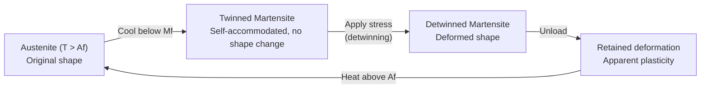
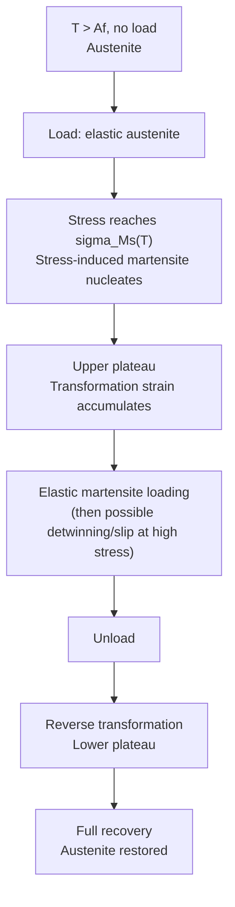
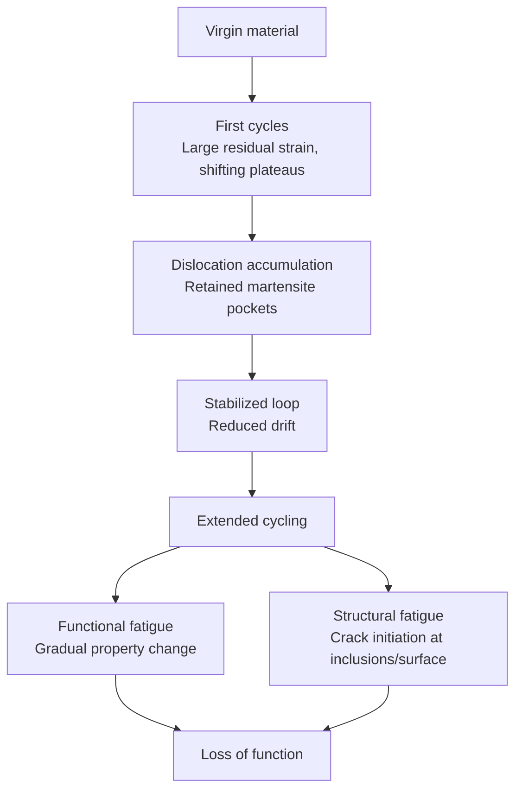

## Shape Memory Alloys


### Overview

Shape memory alloys (SMAs) are metallic materials that can recover a predefined shape after apparent plastic deformation when subjected to a suitable thermal or mechanical stimulus. The behavior originates from a reversible, diffusionless, solid-state **martensitic transformation** between a high-temperature parent phase (**austenite**) and a low-temperature product phase (**martensite**).

Two headline behaviors define the class:

- **Shape memory effect (SME):** deformation applied in the martensitic state is recovered upon heating above the reverse-transformation temperature.
- **Superelasticity (pseudoelasticity, PE):** large, fully recoverable strains (up to roughly 6–8% in polycrystalline NiTi) are obtained isothermally by loading and unloading in the austenitic state.

**Key Points**

- The transformation is **diffusionless**: atoms move cooperatively by less than one interatomic distance, so no compositional change occurs.
- The transformation is **crystallographically reversible**, which is why the original shape can be recovered.
- Transformation temperatures are extremely sensitive to composition, thermomechanical history, and stress state.

---

### Fundamental Physics of the Martensitic Transformation

#### Phases and Crystal Structures

| Phase | Typical structure (NiTi) | Symmetry | Notes |
| --- | --- | --- | --- |
| Austenite (B2) | Ordered cubic (CsCl-type) | High | Stable at high temperature / low stress |
| Martensite (B19′) | Monoclinic | Low | Stable at low temperature / high stress |
| R-phase | Rhombohedral distortion of B2 | Intermediate | Appears as a precursor in some NiTi conditions; small hysteresis (~1–2 °C in commonly cited data) |
| Martensite (B19) | Orthorhombic | Low | Seen in NiTiCu and NiTiPd/NiTiPt-type alloys |
| Martensite (L1₀ / 14M etc.) | Tetragonal / modulated | Low | Common in Ni-Mn-Ga and Fe-Pd type systems |

The lower symmetry of martensite means that a single austenite crystal can transform into several crystallographically equivalent **variants**. For B2 → B19′ in NiTi, 12 correlated variants are possible.

#### Transformation Temperatures

Four characteristic temperatures describe the thermally induced transformation on cooling and heating:

- $M_s$: martensite start
- $M_f$: martensite finish
- $A_s$: austenite start
- $A_f$: austenite finish

The **thermal hysteresis** is commonly quantified as

$$\Delta T_{hyst} \approx A_f - M_s$$

(other definitions using peak temperatures from calorimetry are also common; the definition should always be stated when reporting values).

Typical hysteresis widths vary strongly with system: on the order of 20–40 °C for binary NiTi, roughly 5–20 °C for some Cu-based alloys, and can be tuned below ~5 °C in specially engineered compositions.

#### Thermodynamic Description

The driving force for transformation is the difference in Gibbs free energy between phases. At the equilibrium temperature $T_0$, the chemical free energies of austenite and martensite are equal:

$$\Delta G^{A \to M}(T_0) = 0$$

Near $T_0$, a linearized form is

$$\Delta G^{A \to M}(T) \approx \Delta S \,(T - T_0), \qquad \Delta S = S^M - S^A < 0$$

Transformation requires supercooling or superheating to overcome the **non-chemical energy terms**: elastic strain energy from the lattice mismatch, interfacial energy, and frictional dissipation from interface motion. These terms are the origin of hysteresis.

#### Stress Dependence: The Clausius–Clapeyron Relation

Because the transformation produces a shape change, applied stress shifts the transformation temperature. For uniaxial loading:

$$\frac{d\sigma}{dT} = -\frac{\Delta H}{T_0 \,\varepsilon_{tr}} = -\frac{\rho \,\Delta H_{m}}{T_0 \,\varepsilon_{tr}}$$

where $\Delta H$ is the transformation enthalpy per unit volume, $\Delta H_m$ per unit mass, $\rho$ the density, and $\varepsilon_{tr}$ the transformation strain along the loading axis. For polycrystalline NiTi, values on the order of several MPa/K (commonly cited range roughly 5–8 MPa/K) are reported. **[Confirmed as the standard formalism; exact numerical values depend on alloy composition, texture, and heat treatment.]**

This relation explains why superelastic plateau stress rises with test temperature, and why $M_d$ (the temperature above which stress-induced martensite cannot form before conventional slip occurs) sets the upper limit for superelastic behavior.

---

### Macroscopic Behaviors

#### Thermally Induced Transformation and the Shape Memory Effect

The SME cycle proceeds in four stages:

1. **Cooling** from austenite to martensite under no load. Variants form in a **self-accommodating** arrangement, so no macroscopic shape change occurs.
2. **Deformation** in the martensitic state. Applied stress causes **detwinning** (reorientation of variants), producing macroscopic strain at a nearly constant "plateau" stress.
3. **Unloading.** Most of the detwinning-derived strain is retained, appearing as apparent plastic deformation.
4. **Heating** above $A_f$. The material reverts to austenite and the retained strain is recovered.



#### Superelasticity

If the alloy is deformed at $T > A_f$ (but below $M_d$), the applied stress induces austenite → martensite directly. On unloading, martensite becomes unstable and reverts, yielding a flag-shaped stress–strain curve with:

- An **upper plateau** (forward transformation)
- A **lower plateau** (reverse transformation)
- A mechanical hysteresis loop whose area equals dissipated energy per cycle



#### Comparative Summary

| Feature | Shape memory effect | Superelasticity |
| --- | --- | --- |
| Test temperature | $T < M_f$ (martensite) for deformation | $T > A_f$ (austenite) |
| Stimulus for recovery | Heating | Unloading |
| Mechanism during loading | Variant reorientation (detwinning) | Stress-induced transformation |
| Recoverable strain | Up to ~6–8% (NiTi, typical) | Up to ~6–8% (NiTi, typical) |
| Energy dissipation | Moderate | Hysteresis loop; damping capacity |

#### Two-Way Shape Memory Effect (TWSME)

Conventional SME is **one-way**: the shape is remembered only for the high-temperature phase. **Two-way** behavior, where the material spontaneously switches between two shapes on cooling and heating, requires "training" to introduce internal stress fields (oriented dislocation arrays, retained martensite, or precipitates) that bias variant selection. Typical training methods include:

- Repeated thermomechanical cycling
- Constrained aging
- Superelastic cycling with shape-memory training

TWSME strains are generally smaller and less stable than one-way strains. **[Confirmed as widely reported; recoverable strain magnitude and stability vary by training route.]**

---

### Alloy Systems

#### NiTi (Nitinol)

- Near-equiatomic Ni–Ti (approximately 50–51 at.% Ni) is the dominant commercial SMA.
- **Composition sensitivity:** $M_s$ can change by on the order of 100 K per 1 at.% Ni, so precise control is critical. **[Confirmed as a widely cited sensitivity; exact magnitude depends on the composition regime.]**
- Ni-rich compositions permit **precipitation strengthening** via $\text{Ni}_4\text{Ti}_3$ precipitates, which raise the critical stress for slip and can induce R-phase formation.
- Excellent corrosion resistance and biocompatibility (a passive $\text{TiO}_2$-based surface layer), which underpins medical use. Nickel release is a recognized concern that surface treatments aim to mitigate.
- Ternary additions: Cu (narrower hysteresis, less composition sensitivity), Nb (wide hysteresis for pipe couplings), Hf/Zr/Pd/Pt/Au (higher transformation temperatures for high-temperature SMAs).

#### Copper-Based SMAs

- **Cu–Zn–Al** and **Cu–Al–Ni** are the main commercial families.
- Lower cost and higher thermal/electrical conductivity than NiTi.
- Drawbacks: lower recoverable strain (typically a few percent), poorer fatigue and cyclic stability, susceptibility to intergranular fracture in polycrystals, and **stabilization/aging** of martensite.
- Cu–Al–Ni offers higher operating temperatures than Cu–Zn–Al.
- Single crystals and grain-refined materials can show much better ductility than coarse polycrystals.

#### Iron-Based SMAs

- **Fe–Mn–Si** based alloys: low cost, good workability, useful for civil engineering applications such as prestressing/pipe couplings.
- Transformation is typically $\gamma$(fcc) $\leftrightarrow$ $\varepsilon$(hcp), associated with stacking-fault mechanisms.
- Recovery strain is generally smaller, and recovery depends strongly on training and prestrain.
- Fe–Ni–Co–Al–Ta–B and related compositions have reported superelasticity with large recoverable strains in specific microstructures. **[Unverified for broad industrial deployment; largely reported in research-scale studies.]**

#### High-Temperature SMAs (HTSMAs)

Defined loosely as SMAs with $A_f$ above about 100 °C.

- NiTiHf, NiTiZr, NiTiPd, NiTiPt, NiTiAu
- Ru-based (e.g., RuNb, TaRu) for very high temperatures
- Challenges: dimensional and functional instability, oxidation, creep, and cost.

#### Magnetic Shape Memory Alloys (MSMAs)

- **Ni–Mn–Ga** Heusler-type alloys exhibit field-induced strain via **twin-boundary motion** in martensite under magnetic fields, offering actuation frequencies far above thermally driven SMAs.
- Reported magnetic-field-induced strains in single crystals reach on the order of several to ~10% depending on martensite structure (5M, 7M, NM). **[Confirmed in literature; values depend strongly on crystal quality and variant structure.]**
- Metamagnetic SMAs (e.g., Ni–Mn–In, Ni–Mn–Sn based) show field-induced phase transformation rather than twin reorientation.

#### Comparison of Major Systems

| Property (typical/qualitative) | NiTi | Cu–Zn–Al | Cu–Al–Ni | Fe–Mn–Si |
| --- | --- | --- | --- | --- |
| Max recoverable strain | Highest (~6–8%) | Lower (~3–5%) | Lower (~4–5%) | Lower (~2–4%) |
| Fatigue resistance | Best | Poorer | Poorer | Moderate |
| Cost | High | Low | Low | Lowest |
| Corrosion resistance | Excellent | Moderate | Moderate | Limited without alloying |
| Hysteresis | ~20–40 °C | ~10–20 °C | ~15–25 °C | Wide |
| Biocompatibility | Good (with surface control) | Poor | Poor | Limited |

*Values are indicative ranges from commonly reported data and vary with processing.*

---

### Microstructural Mechanisms

#### Twinning and Variant Accommodation

Martensite forms as plates or lath variants arranged in twin-related groups. Compatibility across **habit planes** (the invariant interface between austenite and martensite) is described by the **phenomenological theory of martensite crystallography (PTMC)**, also formulated as the **Wechsler–Lieberman–Read (WLR)** and **Bowles–Mackenzie** theories, and the modern **geometrically nonlinear theory** of Ball and James.

A key compatibility condition is that the middle eigenvalue of the transformation stretch tensor satisfies

$$\lambda_2 = 1$$

for the existence of an undistorted (stress-free) habit plane in the geometrically nonlinear theory. Alloys satisfying this condition more closely tend to show lower hysteresis. **[Confirmed as the basis of the "cofactor conditions" design strategy (James and coworkers); experimental confirmation is strongest for tuned Ti–Ni–X and Zn–Au–Cu-type systems.]**

#### Deformation Mechanisms in Martensite

- **Detwinning:** growth of favorably oriented variants at the expense of others (gives SME strain).
- **Twin boundary motion:** the fundamental mobile defect in martensite.
- **Slip:** irreversible dislocation motion; degrades functional performance and sets the practical strain limit.

#### Role of Precipitates and Dislocations

- $\text{Ni}_4\text{Ti}_3$ precipitates in Ni-rich NiTi: coherent, lenticular; produce local stress fields that favor R-phase and can enable two-way behavior.
- Dislocation networks from cold work + annealing raise the yield stress of austenite, which widens the superelastic window and improves cyclic stability.

---

### Thermomechanical Processing

Processing dictates functional properties as strongly as composition.

| Step | Purpose | Typical effect |
| --- | --- | --- |
| Vacuum induction melting (VIM) / vacuum arc remelting (VAR) | Control Ni:Ti ratio, minimize O/C contamination | Composition and inclusion control |
| Hot working | Break down cast structure | Refined grain structure |
| Cold working + intermediate anneals | Shape into wire/tube/sheet | Dislocation density; drawing limits |
| **Shape setting** (typically ~450–550 °C, minutes) | Define the "memorized" austenite shape | Fixes parent-phase geometry |
| Solution treatment + **aging** (~300–500 °C) | Form $\text{Ni}_4\text{Ti}_3$ | Raises $A_f$ lowering effect depends on Ni content; tunes plateau stress |
| Surface finishing (electropolishing) | Remove oxide, improve fatigue and corrosion | Better biocompatibility/fatigue |

**[Unverified in exact numbers:]** Specific time/temperature windows are highly supplier- and geometry-dependent and should be taken from the manufacturer or from validated internal process specifications.

Powder-based and additive routes (laser powder bed fusion, directed energy deposition of NiTi) are active areas. Because Ni evaporates preferentially during melting, transformation temperatures can drift, so post-build heat treatment and composition control are essential.

---

### Characterization Methods

| Technique | Information obtained |
| --- | --- |
| **Differential scanning calorimetry (DSC)** | $M_s, M_f, A_s, A_f$; transformation enthalpy; R-phase detection |
| **Electrical resistivity vs. temperature** | Transformation temperatures; sensitive to R-phase |
| **Dynamic mechanical analysis (DMA)** | Storage modulus and damping vs. temperature |
| **Tensile / compression (isothermal)** | Plateau stresses, recoverable strain, residual strain, cyclic response |
| **Constant-load thermal cycling (strain–temperature)** | Actuation strain, work output, transformation temperatures under stress |
| **X-ray / neutron diffraction** | Phase fractions, texture, lattice parameters, in-situ transformation |
| **TEM / EBSD** | Variant morphology, twins, precipitates, orientation relationships |
| **Digital image correlation (DIC)** | Localization and transformation-front propagation |
| **Thermography** | Latent-heat effects (exothermic forward, endothermic reverse transformation) |

The **bend-and-free-recovery** and **tangent method** (ASTM F2004 for NiTi $A_f$ by DSC; ASTM F2082 for bend and free recovery) are common standardized approaches. Users should confirm the current standard revision before applying it.

---

### Constitutive Modeling

#### Approaches

1. **Phenomenological / macroscopic models:** internal variable formulations with martensite volume fraction $\xi$ as the state variable (Tanaka, Liang–Rogers, Brinson, Boyd–Lagoudas).
2. **Micromechanics-based models:** account for variant selection and crystallography (Patoor, Sittner, Gao).
3. **Thermodynamic frameworks with dissipation potentials:** ensure consistency with the second law (Lagoudas and others).
4. **Atomistic and phase-field models:** molecular dynamics, Landau-type free energy, and phase-field simulation of twin/domain patterns.

#### Example: Simple 1-D Model Structure

A generic form for the 1-D constitutive relation is

$$\sigma = E(\xi)\,\bigl(\varepsilon - \varepsilon_{tr}\,\xi\bigr) + \Theta\,(T - T_0)$$

with a linear-mixture modulus

$$E(\xi) = E_A + \xi\,(E_M - E_A)$$

and evolution of $\xi$ determined by transformation criteria (functions of $\sigma$ and $T$) and hardening functions. Here $\Theta$ is a thermoelastic coefficient. The model specifics (kinetics, hardening, reorientation) vary between formulations.

#### Example: Finite-Difference Sketch of a 1-D Transformation Kinetics Update (Python)

The following illustrates the structure of a simple rate-independent kinetic update (a simplified, illustrative implementation, not a validated engineering model):

```python
import numpy as np

def martensite_fraction_update(sigma, T, xi_prev, params, direction):
    """
    Illustrative 1-D kinetic update for a cosine-hardening style model.
    direction: +1 for forward (A->M), -1 for reverse (M->A).
    """
    Ms, Mf, As, Af = params["Ms"], params["Mf"], params["As"], params["Af"]
    CM, CA = params["CM"], params["CA"]      # stress influence coefficients (MPa/K)

    if direction > 0:
        # Forward transformation criterion (stress-shifted Ms/Mf)
        Ms_eff = Ms + sigma / CM
        Mf_eff = Mf + sigma / CM
        if Ms_eff >= T >= Mf_eff:
            xi_new = 0.5 * (1.0 - np.cos(np.pi * (T - Ms_eff) / (Mf_eff - Ms_eff)))
        else:
            xi_new = xi_prev
    else:
        # Reverse transformation criterion (stress-shifted As/Af)
        As_eff = As + sigma / CA
        Af_eff = Af + sigma / CA
        if As_eff <= T <= Af_eff:
            xi_new = 0.5 * (1.0 + np.cos(np.pi * (T - As_eff) / (Af_eff - As_eff)))
        else:
            xi_new = xi_prev

    # Enforce physical bounds and irreversibility within the active branch
    return float(np.clip(xi_new, 0.0, 1.0))
```

**Notes:** This form is a simplified pedagogical analogue of published cosine-type kinetics (e.g., Liang–Rogers/Brinson lineage). A production model would add branch logic, reorientation, stress-dependent hardening, and consistency conditions. **[Inference: behavior of this sketch outside its intended range is not validated.]**

---

### Actuation Fundamentals and Design

#### Work Output and Actuation Metrics

For thermally driven actuators under constant load:

$$W = \sigma \cdot \varepsilon_{act} \quad \text{(work per unit volume)}$$

SMA wires and springs offer some of the **highest work density** among actuator materials, but low **efficiency** (thermodynamic efficiency typically a few percent) and slow **cooling-limited bandwidth**.

Key design variables:

- **Actuation strain** vs. **applied load** (stress-dependent, from strain–temperature curves)
- **Cycle life** vs. **strain amplitude** (functional fatigue)
- **Heating method:** Joule heating (direct current through the wire) is common; the response time is set by cooling.
- **Bias mechanism:** for one-way SMA, a bias spring, dead weight, or antagonistic SMA element provides the reset force.

#### Joule Heating Estimate

A lumped estimate of the temperature rise of a wire under current $I$:

$$m c_p \frac{dT}{dt} = I^2 R - h A_s (T - T_\infty)$$

where $m$ is mass, $c_p$ specific heat (with an effective latent heat contribution during transformation), $R$ resistance, $h$ convective coefficient, $A_s$ surface area, and $T_\infty$ ambient temperature. This yields a first-order thermal time constant

$$\tau = \frac{m c_p}{h A_s}$$

that governs actuation bandwidth. Thin wires cool faster because the surface-area-to-volume ratio scales inversely with diameter. **[Confirmed as standard lumped-capacitance reasoning; assumes uniform temperature and ignores latent heat and resistance change during transformation.]**

#### Design Considerations

- Limit **working strain** (commonly to a few percent) to achieve long fatigue life.
- Account for **training/shakedown**: the first cycles produce residual strain and transformation temperature drift before stabilization.
- Avoid **overheating** and **overstress** that cause functional degradation.
- Consider **rate effects**: superelastic response is temperature-sensitive due to latent heat and self-heating at high strain rates.

---

### Fatigue and Functional Degradation

SMAs face two distinct fatigue concerns:

1. **Structural fatigue:** crack initiation and growth to fracture, analogous to conventional metals but complicated by transformation and inclusions.
2. **Functional fatigue:** progressive change in transformation temperatures, plateau stresses, hysteresis, and accumulated **residual (irrecoverable) strain** over cycles.

**Key Points**

- Functional fatigue is driven by dislocation generation during repeated transformation, and by retained martensite.
- Higher transformation strain amplitude typically lowers cycle life. **[Confirmed as a general trend; quantitative life depends on surface, inclusions, mean strain, and temperature.]**
- Non-metallic inclusions (TiC, $\text{Ti}_4\text{Ni}_2\text{O}_x$) and surface defects are common crack initiation sites in NiTi.
- **Training** (cyclic pre-conditioning) stabilizes the response by settling residual strain and shifting transformation stresses.

#### Cyclic Stabilization Overview



---

### Applications

#### Biomedical

- **Self-expanding stents and stent-grafts:** compressed at low temperature/into a delivery sheath, expand by superelasticity at body temperature.
- **Endodontic files and orthodontic archwires:** exploit low stiffness, large elastic range, and constant-force unloading plateau.
- **Guidewires, vena cava filters, septal occluders, vertebral spacers, bone staples:** exploit superelastic compliance and shape recovery.
- Regulatory and biocompatibility evaluation focuses on corrosion, nickel release, and fatigue durability.

#### Aerospace and Automotive

- Morphing structures (e.g., variable geometry chevrons for noise reduction, morphing flaps). **[Confirmed as demonstrated in research and flight-test programs; broad commercial adoption remains limited.]**
- Actuators for vibration isolation, valves, latches, and thermally triggered release devices.
- Fluid couplings and hydraulic line connectors (NiTiNb) exploit wide-hysteresis shape recovery.

#### Civil and Structural Engineering

- Seismic dampers and self-centering braces using superelastic hysteretic damping.
- Fe-based SMAs for post-tensioning and crack closure concepts.

#### Consumer and Robotics

- Eyeglass frames (superelastic flexibility), antenna wires, thermal actuators, soft robotics, artificial muscles, and haptic devices.

#### Emerging Uses

- **Elastocaloric cooling:** cyclic loading/unloading of superelastic SMAs releases and absorbs latent heat, offering a solid-state refrigeration route without conventional refrigerants. Active research on fatigue life, heat-exchange design, and system efficiency. **[Confirmed as active research with laboratory demonstrators; commercial-scale viability is not established.]**
- **4D printing** of NiTi and polymer–SMA composites.
- **Energy harvesting** and thermal engines using SMA cycles.

---

### Limitations and Challenges

- **Low energy efficiency** of thermal actuation and slow cooling bandwidth.
- **Composition sensitivity** and processing cost, particularly for NiTi.
- **Functional fatigue and drift** limiting precision applications.
- **Narrow superelastic temperature window** bounded by $A_f$ and $M_d$.
- **Large hysteresis** complicates precise control; requires model-based or feedback control.
- **Difficult machining and joining** (welding NiTi can degrade properties or form brittle intermetallics).
- **High-temperature limits:** transformation temperatures of conventional NiTi are typically below ~100 °C.

---

### Worked Example: Estimating Transformation Stress Shift

**Example**

Suppose a NiTi wire has $A_f = 10\,^\circ\text{C}$ and a Clausius–Clapeyron slope

$$\frac{d\sigma}{dT} \approx 6\ \text{MPa/K}$$

Estimate the upper plateau stress at $T = 37\,^\circ\text{C}$ (body temperature), assuming stress-induced martensite begins at essentially zero stress at $T = M_s \approx A_f - 20\,^\circ\text{C}$ = $-10\,^\circ\text{C}$ (an assumption for illustration).

**Solution**

$$\sigma_{Ms}(T) \approx \frac{d\sigma}{dT}\,(T - M_s) = 6 \times \bigl(37 - (-10)\bigr) = 6 \times 47 = 282\ \text{MPa}$$

**Output**

$$\sigma_{Ms}(37\,^\circ\text{C}) \approx 282\ \text{MPa}$$

**Conclusion**

This is a plausible order of magnitude for the upper plateau of superelastic NiTi, consistent with commonly reported values of a few hundred MPa. **[Inference: the assumed $M_s$ and constant slope are illustrative; real curves show nonlinearity, rate effects, and self-heating.]**

---

### Worked Example: Simple Actuator Sizing

**Example**

An SMA wire actuator must lift a load producing a stress of $\sigma = 150\ \text{MPa}$ with actuation strain $\varepsilon_{act} = 4\%$.

**Solution**

Work per unit volume:

$$W = \sigma \,\varepsilon_{act} = 150 \times 10^{6}\ \text{Pa} \times 0.04 = 6 \times 10^{6}\ \text{J/m}^3$$

For a wire of diameter $d = 0.5\ \text{mm}$ and length $L = 100\ \text{mm}$:

$$V = \frac{\pi d^2}{4} L = \frac{\pi (0.5\times10^{-3})^2}{4} (0.1) \approx 1.96 \times 10^{-8}\ \text{m}^3$$


$$W_{wire} = 6\times10^{6} \times 1.96\times10^{-8} \approx 0.118\ \text{J}$$

**Output**

Stroke: $\Delta L = \varepsilon_{act} L = 0.04 \times 100\ \text{mm} = 4\ \text{mm}$. Force: $F = \sigma A = 150\times10^{6} \times \frac{\pi (0.5\times10^{-3})^2}{4} \approx 29.5\ \text{N}$.

**Conclusion**

A 0.5 mm wire delivers roughly 30 N over about 4 mm stroke, illustrating the high force-to-size ratio of SMA wires. Safety factors and fatigue-limited strain (often lower than 4% for long life) should be applied in practice.

---

### Control of SMA Actuators

- **Open-loop** current pulses: simple but sensitive to ambient conditions and load.
- **Closed-loop position control** using strain, resistance-feedback (self-sensing), or external sensors.
- **Hysteresis compensation:** Preisach and Prandtl–Ishlinskii operators, inverse-model feedforward, sliding-mode control.
- **Self-sensing:** electrical resistance changes with phase fraction and strain, enabling sensorless feedback, though the resistance–strain relation is hysteretic and drifts with cycling.

---

### Testing and Standards Overview

- **ASTM F2004:** transformation temperature of NiTi by thermal analysis.
- **ASTM F2082:** transformation temperature by bend and free recovery.
- **ASTM F2516:** tension testing of NiTi materials.
- **ASTM F2063:** wrought NiTi for medical devices and surgical implants.

**[Unverified:]** Confirm the current revision and scope of each standard directly from ASTM before relying on it for compliance work.

---

### Summary Table of Key Concepts

| Concept | Definition / relation |
| --- | --- |
| Martensitic transformation | Diffusionless, displacive, first-order solid–solid phase transition |
| $M_s, M_f, A_s, A_f$ | Transformation start/finish temperatures on cooling/heating |
| Hysteresis | Energy dissipation from interface friction and elastic mismatch |
| Clausius–Clapeyron | $d\sigma/dT = -\Delta H / (T_0 \varepsilon_{tr})$ |
| SME | Deform as martensite, recover on heating |
| Superelasticity | Isothermal load–unload in austenite with recoverable strain |
| Functional fatigue | Cyclic drift of transformation behavior and residual strain |
| $M_d$ | Upper temperature limit for stress-induced martensite |

---

### Related Topics

- Martensitic transformation crystallography (PTMC, geometrically nonlinear theory)
- Cofactor conditions and low-hysteresis alloy design
- Magnetic shape memory alloys and Heusler compounds
- High-temperature shape memory alloys
- Elastocaloric materials and solid-state cooling
- Additive manufacturing of NiTi
- Shape memory polymers and composites
- Phase-field modeling of martensitic transformations
- Functional fatigue and fracture in SMAs
- SMA actuator control and hysteresis modeling
- Piezoelectric and magnetostrictive smart materials
- Biomedical device design with superelastic NiTi