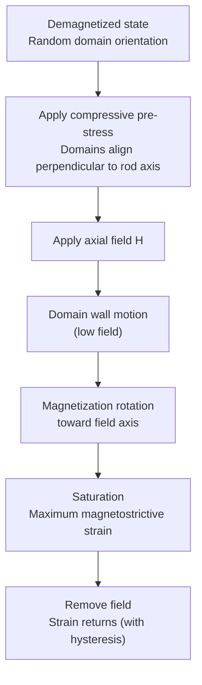
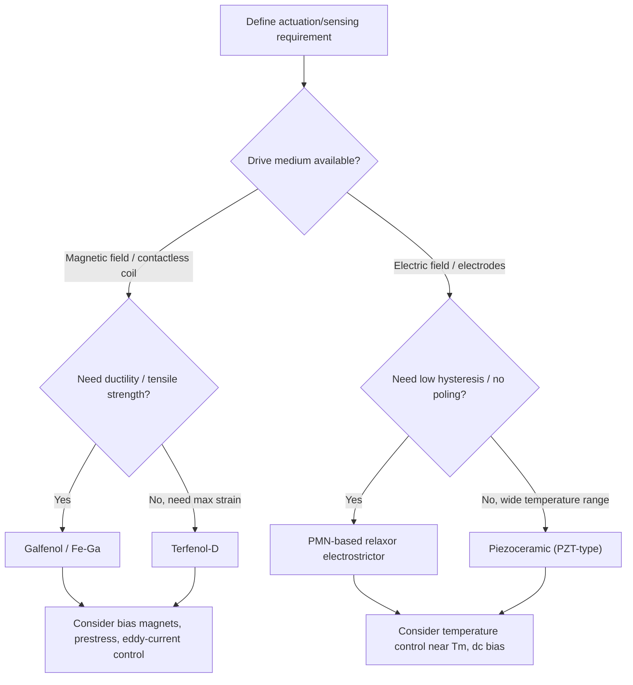

## Magnetostrictive and Electrostrictive Materials


### Overview

Magnetostrictive and electrostrictive materials are **field-coupled functional materials** whose dimensions change in response to an applied magnetic or electric field, respectively. Both effects convert electromagnetic energy into mechanical energy (and, through the inverse effect, mechanical energy into changes in magnetization or polarization), which underpins their use in actuators, sensors, sonar transducers, and precision positioning.

| Property | Magnetostriction | Electrostriction |
| --- | --- | --- |
| Driving field | Magnetic field $H$ (or magnetization $M$) | Electric field $E$ (or polarization $P$) |
| Strain dependence | $\lambda \propto M^2$ (to lowest order) | $x \propto P^2$ or $x = Q P^2$; $x = M E^2$ |
| Symmetry requirement | Exists in all magnetic materials | Exists in **all** dielectrics (including centrosymmetric) |
| Sign of response under field reversal | Even (strain does not reverse) | Even (strain does not reverse) |
| Related linear effect | Piezomagnetism (rare, requires specific magnetic symmetry) | Piezoelectricity (requires non-centrosymmetric structure) |
| Inverse effect | Villari effect (stress changes magnetization) | Change in permittivity/polarization under stress |

**Key Points**

- Both effects are **even-order** (quadratic) to lowest order, so the strain sign is independent of field polarity unless a bias is applied.
- Practical devices apply a **bias field** (or pre-stress) to linearize the response about an operating point.
- Distinguish **electrostriction** (quadratic, present in all dielectrics) from **converse piezoelectricity** (linear in field, only in non-centrosymmetric crystals). In poled ferroelectrics, apparent linear behavior arises from a bias polarization: effective $d = 2 Q \varepsilon_0 \varepsilon_r P_s$.

---

### Part I: Magnetostrictive Materials

#### Physical Origins

Magnetostriction arises from the coupling between magnetic ordering and the crystal lattice. Two major contributions are commonly distinguished:

1. **Exchange magnetostriction:** volume change arising from the dependence of exchange interaction energy on interatomic distance. It is isotropic and typically produces a volume magnetostriction $\omega = \Delta V / V$.
2. **Anisotropic (Joule) magnetostriction:** a shape change at constant volume arising from spin–orbit coupling and crystal-field interactions. When magnetization rotates, the electron orbitals (coupled to spins via spin–orbit interaction) reorient, distorting the lattice.

For a cubic crystal, the fractional length change along a direction defined by direction cosines $\beta_i$ (measurement direction) with magnetization direction cosines $\alpha_i$ is

$$\frac{\Delta l}{l} = \frac{3}{2}\lambda_{100}\left(\alpha_1^2\beta_1^2 + \alpha_2^2\beta_2^2 + \alpha_3^2\beta_3^2 - \frac{1}{3}\right) + 3\lambda_{111}\left(\alpha_1\alpha_2\beta_1\beta_2 + \alpha_2\alpha_3\beta_2\beta_3 + \alpha_3\alpha_1\beta_3\beta_1\right)$$

where $\lambda_{100}$ and $\lambda_{111}$ are the saturation magnetostriction constants along the $\langle 100 \rangle$ and $\langle 111 \rangle$ axes.

For an isotropic polycrystal, the saturation magnetostriction is the average

$$\lambda_s = \frac{2}{5}\lambda_{100} + \frac{3}{5}\lambda_{111}$$

**[Confirmed as the standard Akulov/Becker-Döring formalism for cubic crystals with an isotropic Reuss/Voigt-type averaging assumption.]**

#### Energy Description

The relevant free-energy terms include:

$$F = F_{ex} + F_{K} + F_{me} + F_{el} + F_{Z}$$

- $F_{ex}$: exchange energy
- $F_K$: magnetocrystalline anisotropy energy
- $F_{me}$: magnetoelastic coupling energy
- $F_{el}$: elastic energy
- $F_Z$: Zeeman energy (interaction with applied field)

The magnetoelastic contribution for an isotropic material under stress $\sigma$ at angle $\theta$ to the magnetization is

$$F_{\sigma} = -\frac{3}{2}\lambda_s \sigma \cos^2\theta$$

A material with $\lambda_s > 0$ under tension prefers magnetization parallel to the tensile axis; under compression, it prefers a perpendicular orientation. This is the basis for **stress-annealing** and **pre-stress** strategies in magnetostrictive actuators.

#### Domain Mechanism of Strain Generation

Magnetostrictive strain in a demagnetized ferromagnet arises mainly from two processes:

1. **Domain wall motion** (low fields): domains favorably oriented relative to the field grow.
2. **Domain (magnetization) rotation** (higher fields): magnetization rotates away from easy axes toward the field direction.

For giant magnetostrictive materials, engineered pre-stress aligns domains perpendicular to the drive axis, so that field-driven rotation produces the maximum strain.



#### Material Families

##### Conventional Magnetostrictive Metals and Alloys

| Material | Typical saturation magnetostriction | Notes |
| --- | --- | --- |
| Nickel | Negative, tens of ppm (about $-35$ ppm often cited) | Historical sonar and ultrasonic transducer material; corrosion resistant |
| Iron | Small; sign depends on crystal direction | $\lambda_{100} > 0$, $\lambda_{111} < 0$ |
| Permendur (Fe–Co, ~49% Co) | Roughly 60–70 ppm | High saturation magnetization |
| Alfenol (Fe–Al) | Tens of ppm | Ductile, machinable, low-cost |
| Galfenol (Fe–Ga) | Roughly 200–400 ppm (single crystal, composition dependent) | Ductile, weldable, good tensile strength, low hysteresis |

*Values are indicative of commonly cited ranges and vary strongly with composition, texture, and heat treatment.*

##### Giant Magnetostrictive Materials: Terfenol-D

**Terfenol-D** ($\text{Tb}_{x}\text{Dy}_{1-x}\text{Fe}_2$, nominally $x \approx 0.3$) is a rare-earth–iron Laves-phase compound developed at the Naval Ordnance Laboratory (hence "NOL").

- Cubic Laves phase (C15) structure.
- Very large magnetostriction (on the order of 1000–2000 ppm at room temperature in the $\langle 111 \rangle$ direction under suitable prestress and field).
- The composition is tuned so that Tb and Dy anisotropy contributions **compensate**, reducing magnetocrystalline anisotropy while retaining large magnetostriction.
- Growth by directional solidification (e.g., Bridgman or free-stand zone melt) produces $\langle 112 \rangle$-oriented, twinned dendritic rods.
- Drawbacks: brittle (low tensile strength), rare-earth cost, eddy-current losses at high frequency (mitigated by laminated or particulate composite construction), and strong dependence on stress and temperature.

**[Confirmed as the standard characterization of Terfenol-D; exact magnetostriction values depend on prestress, drive level, and temperature.]**

##### Fe–Ga (Galfenol) Alloys

- Bcc-based Fe–Ga with roughly 17–19 at.% Ga (first peak) and ~27 at.% Ga (second peak) shows enhanced $\lambda_{100}$.
- The origin of the enhancement is attributed to Ga-induced short-range ordering and nanoscale precipitates (such as $D0_3$-like clusters); the precise mechanism remains an active research topic. **[Unverified: mechanistic explanations vary between studies.]**
- Advantages over Terfenol-D: much higher tensile strength and ductility, machinable and weldable, lower hysteresis, and lower cost (no rare-earth elements).

##### Other Classes

- **Amorphous metallic glasses (Metglas-type Fe-based):** very high permeability, soft magnetic behavior, small magnetostriction; used in magnetoelastic sensors and field-annealed for tailored response.
- **Rare-earth magnetostrictive thin films (e.g., TbFe$_2$):** for MEMS actuators; amorphous or nanocomposite films can reach large strains at low fields.
- **Magnetostrictive polymer composites:** particulate Terfenol-D in polymer matrices to suppress eddy currents and improve toughness at the cost of reduced effective strain.

#### Key Coupling Parameters

Magnetostrictive materials are commonly characterized by **piezomagnetic (magnetoelastic) constants** and the **electromechanical (magnetomechanical) coupling coefficient**.

The strain-magnetization-field relations for small signals about a bias point are

$$S = s^{H}T + d\,H$$


$$B = d\,T + \mu^{T} H$$

where $S$ is strain, $T$ stress, $H$ magnetic field, $B$ flux density, $s^H$ the compliance at constant field, $d$ the piezomagnetic (strain) coefficient, and $\mu^T$ the permeability at constant stress.

The magnetomechanical coupling coefficient is

$$k^2 = \frac{d^2}{s^{H}\mu^{T}}$$

and satisfies $0 \le k \le 1$. Practical values for Terfenol-D are often reported in the range of roughly 0.7–0.8, and for Galfenol in the range of roughly 0.5–0.7. **[Inference: exact values depend on bias conditions, geometry, and measurement method.]**

The $\Delta E$ effect (change in Young's modulus with magnetization) is closely related:

$$\frac{\Delta E}{E} = \frac{E_S - E_0}{E_0}$$

where $E_0$ is the modulus in the demagnetized state and $E_S$ the modulus at magnetic saturation. Large $\Delta E$ effects are exploited in tunable resonators and vibration absorbers.

#### Joule, Villari, Wiedemann, and Matteucci Effects

| Effect | Description |
| --- | --- |
| **Joule** | Length change of a ferromagnet under an applied magnetic field |
| **Villari (inverse magnetostriction)** | Change in magnetic susceptibility/magnetization under applied stress |
| **Wiedemann** | Twisting of a magnetized rod when a magnetic field of a different orientation is applied (helical anisotropy) |
| **Matteucci** | Inverse of Wiedemann: torsion generates a change in magnetization or induced voltage |
| **Magnetovolume ($\Delta V$)** | Isotropic volume change, enhanced near the Curie temperature (Invar-type anomalies) |

#### Device Concepts

- **Sonar transducers:** Tonpilz-type stacks with Terfenol-D rods; high power density and low-frequency capability.
- **Linear actuators and micro-positioners:** direct rod-based actuation with bias magnets and drive coils; typical strokes of tens of micrometers.
- **Magnetostrictive delay lines and position sensors:** a current pulse launches a torsional wave in a waveguide; interaction with a permanent magnet position marker produces a detectable time-of-flight signal.
- **Energy harvesters:** Villari effect converts vibration-induced stress to magnetic-flux change and thus coil voltage; Galfenol is favored for its mechanical robustness.
- **Torque and force sensors:** exploit stress-dependent permeability.
- **Magnetoelastic wireless sensors:** ribbon resonators whose resonant frequency shifts with mass loading or temperature.

#### Design Considerations

- **Bias field:** typically supplied by permanent magnets to place the device on the linear portion of the strain–field curve.
- **Prestress:** compressive prestress (order of a few to tens of MPa for Terfenol-D) improves domain alignment and increases achievable strain.
- **Eddy currents:** cause frequency-dependent loss; mitigated by lamination, slitting, or composite construction.
- **Thermal management:** Joule heating in coils and magnetic hysteresis loss raise temperature; magnetostriction and permeability change with temperature.
- **Magnetic circuit closure:** minimizing air gaps increases field efficiency.

#### Example: Estimating Free Strain and Stroke

**Example**

A Terfenol-D rod of length $L = 50\ \text{mm}$ operates at a saturation-level magnetostriction $\lambda = 1200\ \text{ppm}$ (assumed for illustration).

**Solution**

$$\Delta L = \lambda L = 1200 \times 10^{-6} \times 50\ \text{mm} = 0.06\ \text{mm} = 60\ \mu\text{m}$$

**Output**

The free stroke is approximately $60\ \mu\text{m}$.

**Conclusion**

This value is an upper-bound estimate assuming no external load and full saturation. Actual devices achieve less due to prestress, load, non-saturating drive, and hysteresis. **[Inference: real device performance varies with bias, drive amplitude, and load.]**

#### Example: Simple Linearized Model in Python

The following sketch evaluates the linearized two-equation model near a bias point (illustrative, not a validated device model):

```python
import numpy as np

def magnetostrictive_response(T, H, s_H, mu_T, d):
    """
    Linear piezomagnetic constitutive relations about a bias point.
    T: stress (Pa), H: magnetic field (A/m)
    s_H: compliance at constant H (1/Pa)
    mu_T: permeability at constant stress (H/m)
    d: piezomagnetic coefficient (m/A)
    Returns strain S and flux density B.
    """
    S = s_H * T + d * H
    B = d * T + mu_T * H
    return S, B

def coupling_coefficient(s_H, mu_T, d):
    """Magnetomechanical coupling coefficient k (dimensionless)."""
    return abs(d) / np.sqrt(s_H * mu_T)

# Illustrative order-of-magnitude parameters (assumed)
s_H  = 1.0 / 30e9          # ~30 GPa modulus at constant field
mu_T = 5.0 * 4e-7 * np.pi  # relative permeability ~5
d    = 1.0e-8              # illustrative piezomagnetic coefficient (m/A)

S, B = magnetostrictive_response(T=0.0, H=5e4, s_H=s_H, mu_T=mu_T, d=d)
k = coupling_coefficient(s_H, mu_T, d)
print(f"Strain: {S:.3e}, B: {B:.3e} T, k: {k:.2f}")
```

**Notes:** The linear model neglects hysteresis, saturation, and stress-dependent coefficients; real designs use nonlinear models (e.g., Jiles–Atherton, energy-weighted, or Armstrong-type models).

#### Hysteresis and Nonlinear Modeling

- **Jiles–Atherton model:** physically motivated differential model for magnetization hysteresis, extended with magnetoelastic terms.
- **Armstrong energy-weighted model:** uses a Boltzmann-type weighting of energy minima over discrete magnetization orientations to predict magnetostriction and hysteresis from crystallographic anisotropy and applied stress.
- **Preisach-type models:** phenomenological operators for rate-independent hysteresis, often used in control.
- **Finite-element coupled magnetostatic–mechanical models:** for device-level design.

---

### Part II: Electrostrictive Materials

#### Physical Origins

Electrostriction is the **quadratic coupling** between strain and electric polarization (or field). It exists in all dielectrics because an applied field polarizes the material and induces stress via:

- Field-dependent ionic displacement in an anharmonic lattice potential.
- Coulomb (Maxwell-type) forces on polarized charge distributions.
- Field-induced rearrangement of polar nanoregions (PNRs) in relaxor ferroelectrics.

In the polarization formulation for an isotropic or cubic material, the electrostrictive strain is

$$x_{ij} = Q_{ijkl}\,P_k P_l$$

with $Q_{ijkl}$ the **electrostrictive coefficient** tensor (units $\text{m}^4/\text{C}^2$). In the field formulation:

$$x_{ij} = M_{ijkl}\,E_k E_l$$

where $M_{ijkl}$ is the field-related electrostrictive coefficient (units $\text{m}^2/\text{V}^2$). The two are related through the dielectric response:

$$M \approx Q\,(\varepsilon_0\varepsilon_r)^2$$

(for the linear-dielectric regime where $P \approx \varepsilon_0(\varepsilon_r - 1)E$ and $\varepsilon_r \gg 1$).

#### Distinguishing Electrostriction from Piezoelectricity

The general electromechanical expansion of strain in field is

$$x = d\,E + M\,E^2 + \dots$$

- $d\,E$: **converse piezoelectric** term (linear; exists only in non-centrosymmetric point groups).
- $M\,E^2$: **electrostrictive** term (quadratic; exists in all point groups).

In a ferroelectric with spontaneous polarization $P_s$, or a material biased by a dc field, the polarization is $P = P_s + \delta P$, and

$$x = Q(P_s + \delta P)^2 \approx Q P_s^2 + 2 Q P_s\,\delta P$$

so the **effective piezoelectric coefficient** is

$$d_{eff} = 2\,Q\,\varepsilon_0\,\varepsilon_r\,P_s$$

**Key Points**

- Piezoelectricity in perovskite ferroelectrics is often described as **electrostriction biased by spontaneous polarization**.
- Electrostrictors operated under a dc bias behave like "induced-piezoelectric" devices with tunable $d$.
- Measurement of a pure electrostrictor's response as a function of field shows a parabolic (not linear) dependence.

#### Relaxor Ferroelectrics

The leading electrostrictive ceramics are **relaxor ferroelectrics**, characterized by:

- Compositional disorder on the perovskite B-site (or A-site), producing nanoscale polar regions (**PNRs**).
- A broad, frequency-dispersive maximum in permittivity vs. temperature (the "diffuse phase transition").
- Slim polarization–field loops with low remanent polarization and low hysteresis above the freezing temperature.

##### Lead-Based Relaxors

| Material | Notes |
| --- | --- |
| **PMN** ($\text{Pb}(\text{Mg}_{1/3}\text{Nb}_{2/3})\text{O}_3$) | Archetypal relaxor; large permittivity; near room temperature $T_m$ is about $-10\,^\circ\text{C}$ (composition and frequency dependent) |
| **PMN–PT** (with $\text{PbTiO}_3$) | Increased $T_m$; morphotropic phase boundary compositions give exceptional piezoelectric response in poled single crystals |
| **PLZT** (lanthanum-modified $\text{Pb}(\text{Zr,Ti})\text{O}_3$) | Electro-optic and electrostrictive ceramics; transparent variants |
| **PFN, PZN** and related | Additional lead-based relaxor families |

PMN-based electrostrictive ceramics offer strains on the order of $10^{-4}$ to $10^{-3}$ at a few kV/mm with **very low hysteresis** and low aging compared with conventional PZT piezoceramics. **[Confirmed as widely reported; values depend on composition, temperature, and drive amplitude.]**

##### Lead-Free Alternatives

- **BNT-based** (bismuth sodium titanate) and **BNT–BT** systems, with large field-induced strains associated with relaxor-to-ferroelectric transitions.
- **KNN-based** (potassium sodium niobate) systems.
- **BaTiO$_3$-derived** relaxors (e.g., with Zr, Sn, Hf substitution).
- Environmental and regulatory drivers (lead restrictions) motivate ongoing research; performance parity with lead-based relaxors across a broad temperature range remains a challenge. **[Unverified: comparative performance is compositionally and application dependent.]**

#### Electrostrictive Polymers and Elastomers

- **P(VDF-TrFE-CFE / CTFE) terpolymers:** relaxor-ferroelectric polymers exhibiting large electrostrictive strains (several percent) at fields of order tens of $\text{V}/\mu\text{m}$; low modulus limits blocking force.
- **Dielectric elastomers (e.g., silicones, acrylics, polyurethanes):** strain arises mostly from the **Maxwell stress** rather than intrinsic electrostriction; large strains (tens of percent) with high fields. The Maxwell effective pressure is

$$p = \varepsilon_0\varepsilon_r E^2 = \varepsilon_0 \varepsilon_r \frac{V^2}{t^2}$$

where $t$ is the film thickness. This is often misattributed to "electrostriction" in the broad sense but is physically a distinct electrostatic-force mechanism.

**[Confirmed:** the distinction between intrinsic electrostriction and Maxwell-stress-driven actuation is standard in the EAP literature.]

#### Comparison of Electrostrictive vs. Piezoelectric Ceramics

| Property | PMN-based electrostrictor | PZT-type piezoelectric |
| --- | --- | --- |
| Strain–field relation | Quadratic | Linear (plus hysteresis) |
| Hysteresis | Very low (above freezing) | Higher |
| Poling required | No | Yes |
| Aging / depoling | Minimal | Present |
| Temperature sensitivity | High (near $T_m$) | Lower over a wide range |
| Large-signal strain | Comparable order of magnitude | Comparable order of magnitude |
| Typical use | Precision positioning, adaptive optics, deformable mirrors | Broad actuator/sensor/transducer applications |

**Key Points**

- Electrostrictors excel where **low hysteresis and low creep** matter (e.g., adaptive optics, precision positioning).
- Electrostrictive behavior is strongly **temperature dependent** because permittivity peaks near $T_m$.

#### Thermodynamic Formulation

The Gibbs free energy density for a dielectric with polarization $P$ and stress $T$:

$$G = \frac{1}{2}\alpha P^2 + \frac{1}{4}\beta P^4 + \frac{1}{6}\gamma P^6 - \frac{1}{2}s_{ijkl}T_{ij}T_{kl} - Q_{ijkl}T_{ij}P_kP_l - E_iP_i$$

Differentiating with respect to stress yields the strain, giving

$$x_{ij} = -\frac{\partial G}{\partial T_{ij}} = s_{ijkl}T_{kl} + Q_{ijkl}P_kP_l$$

(sign conventions vary between texts). The coupling term $Q_{ijkl}T_{ij}P_kP_l$ is the **electrostrictive energy**, and in Landau–Ginzburg–Devonshire theory it shifts the phase-transition temperature under stress and produces the observed stress dependence of $\varepsilon_r$.

#### Universality of Electrostriction Coefficients

An empirical observation, often called the **Newnham scaling relation**, relates the electrostriction coefficient to the elastic compliance:

$$Q_h \approx \frac{Q_{11} + 2Q_{12}}{1} \propto \text{(compressibility-related)}$$

Specifically, Newnham proposed that the hydrostatic electrostrictive coefficient $Q_h$ scales approximately with the ratio of ionic bond quantities, and that **$M \propto \varepsilon_r^2$ dominates** the large-strain behavior of high-permittivity materials. **[Inference: the exact scaling relation is an empirical trend across material classes rather than a strict physical law; treat numeric fits with caution.]**

Key practical consequence: since $M \approx Q\,(\varepsilon_0\varepsilon_r)^2$ and $Q$ is roughly constant within a structural family, **high permittivity is the primary lever** for increasing field-based electrostriction.

#### Example: Electrostrictive Strain from Polarization

**Example**

A PMN-type relaxor ceramic operates with induced polarization $P = 0.15\ \text{C/m}^2$ and electrostriction coefficient $Q_{33} = 0.02\ \text{m}^4/\text{C}^2$ (representative order of magnitude; assumed).

**Solution**

$$x_{3} = Q_{33}P^2 = 0.02 \times (0.15)^2 = 0.02 \times 0.0225 = 4.5 \times 10^{-4}$$

**Output**

$$x_3 = 4.5 \times 10^{-4}\ (\text{i.e., }0.045\%)$$

**Conclusion**

For a 10 mm thick stack element, this corresponds to a free displacement of

$$\Delta L = x_3 \cdot L = 4.5\times10^{-4} \times 10\ \text{mm} = 4.5\ \mu\text{m}$$

**[Inference: the numbers are illustrative; actual $P(E)$ and $Q$ values vary with composition, temperature, and drive field.]**

#### Example: Evaluating $d_{eff}$ Under DC Bias (Python)

```python
import numpy as np

EPS0 = 8.854e-12  # F/m

def effective_d33(Q33, eps_r, P_bias):
    """
    Effective piezoelectric-like coefficient from electrostriction under bias.
    d_eff = 2 * Q * eps0 * eps_r * P_bias  (units: m/V)
    """
    return 2.0 * Q33 * EPS0 * eps_r * P_bias

def strain_from_field(M33, E_dc, E_ac):
    """
    Small-signal electrostrictive strain around a dc bias:
    x = M (E_dc + E_ac)^2 ~ M E_dc^2 + 2 M E_dc E_ac  (linearized term shown)
    Returns dc strain and linearized ac strain amplitude.
    """
    x_dc = M33 * E_dc**2
    x_ac = 2.0 * M33 * E_dc * E_ac
    return x_dc, x_ac

# Illustrative parameters (assumed)
Q33   = 0.02       # m^4/C^2
eps_r = 20000.0    # high-permittivity relaxor near T_m
P_b   = 0.10       # C/m^2 under dc bias

d_eff = effective_d33(Q33, eps_r, P_b)
print(f"d_eff ~ {d_eff*1e12:.0f} pC/N (equivalent scale, illustrative)")

M33 = Q33 * (EPS0 * eps_r)**2
x_dc, x_ac = strain_from_field(M33, E_dc=1.0e6, E_ac=1.0e5)
print(f"M33 = {M33:.3e} m^2/V^2; x_dc = {x_dc:.3e}; x_ac = {x_ac:.3e}")
```

**Notes:** This illustrates the biased-electrostrictor linearization only. Real relaxors show frequency-dependent permittivity, field-dependent $\varepsilon_r$, and temperature dependence not captured by constant coefficients.

---

### Comparative Framework: Magnetostrictive vs. Electrostrictive vs. Piezoelectric vs. SMA

| Feature | Magnetostrictive (Terfenol-D) | Electrostrictive (PMN-PT type) | Piezoelectric (PZT) | Shape memory (NiTi) |
| --- | --- | --- | --- | --- |
| Drive | Magnetic field (coil) | Electric field (electrodes) | Electric field | Heat / stress |
| Strain (order) | Up to ~0.1–0.2% | ~0.05–0.15% | ~0.1–0.15% | Up to several % |
| Bandwidth | High (kHz range, eddy-current limited) | High | High | Low (thermal) |
| Hysteresis | Moderate | Low | Moderate | Large |
| Energy density | High | Moderate | Moderate | Very high (work) |
| Material cost/constraints | Rare earths, brittle | Lead-based (typical), temperature sensitive | Lead-based (typical) | Ni–Ti processing |
| Key weakness | Brittle, eddy losses, coils | Temperature dependence | Depoling, aging | Slow, low efficiency |

*Values are indicative order-of-magnitude comparisons drawn from commonly cited literature and vary with specific material and operating conditions.*

---

### Materials Selection Logic



---

### Processing and Fabrication

#### Magnetostrictive Materials

- **Terfenol-D:** directional solidification (modified Bridgman, free-stand zone melting) to produce textured $\langle 112 \rangle$ rods; subsequent machining and pre-stress/bias assembly. Powder-composite routes use particulate in polymer.
- **Galfenol:** conventional melting/casting, Bridgman single-crystal growth, and rolling or extrusion for textured polycrystals. Heat treatment (annealing and quenching) controls ordering and magnetostriction.
- **Thin films:** sputtering or evaporation of rare-earth–transition-metal alloys with post-deposition annealing.
- **Additive manufacturing:** emerging routes for Galfenol and Fe-based alloys; processing–property relationships are under active investigation. **[Unverified: reproducibility of magnetostriction in additively manufactured parts is still being established.]**

#### Electrostrictive Ceramics

- Solid-state reaction / columbite precursor route (for PMN to avoid pyrochlore secondary phase).
- Hot pressing or sintering with controlled PbO atmosphere to prevent Pb loss.
- Tape casting and co-firing for **multilayer actuators (MLAs)**, enabling low-voltage, high-force devices.
- Single-crystal growth (flux or modified Bridgman) for PMN-PT.

#### Electrostrictive Polymers

- Solution casting, spin coating, or film stretching; electrodes by sputtering or compliant conductive layers (carbon grease, carbon nanotube, or conducting polymer).
- Terpolymer films require careful control of crystallinity and defect content to achieve relaxor behavior.

---

### Characterization Techniques

| Technique | Magnetostrictive | Electrostrictive |
| --- | --- | --- |
| Strain measurement | Strain gauges, capacitive or laser displacement sensors, LVDT | Laser interferometry, LVDT, capacitive gauges |
| Field-response curves | $\lambda$–$H$ loops, $B$–$H$ loops | $x$–$E$ loops, $P$–$E$ loops |
| Dynamic response | Impedance analysis, resonance/antiresonance | Impedance analysis (IEEE-type resonance methods) |
| Microstructure | XRD (phase/texture), EBSD, MFM for domains | XRD, TEM (PNRs), piezoresponse force microscopy (PFM) |
| Thermal analysis | Temperature-dependent $\lambda$ and $\mu$; Curie temperature | $\varepsilon_r(T, f)$ to locate $T_m$ and diffusiveness |
| Stress dependence | Load frames with prestress and magnetic circuits | Load frames with electrical fixtures |

---

### Applications

#### Magnetostrictive

- **Underwater acoustics and sonar** (Tonpilz stacks, flextensional transducers).
- **Active vibration control and precision positioning** (machine tools, adaptive structures).
- **Magnetostrictive position sensors** in hydraulic cylinders and industrial automation.
- **Fuel injectors and high-force micro-actuators** (Terfenol-D based).
- **Energy harvesting** from vibration using Galfenol cantilevers.
- **Non-destructive testing:** magnetostrictive guided-wave transducers for pipe and cable inspection.

#### Electrostrictive

- **Deformable mirrors and adaptive optics** (low hysteresis is critical).
- **Precision micropositioning and nano-positioning stages.**
- **Ultrasonic transducers and hydrophones** (with dc bias).
- **Inkjet and micro-fluidic actuators.**
- **Optical modulators and switches** (PLZT electro-optic elements).
- **Soft actuators and artificial muscles** using electrostrictive polymers.

---

### Limitations and Challenges

**Magnetostrictive**

- Brittleness and cost of Terfenol-D; rare-earth supply concerns.
- Eddy-current losses limiting efficiency at higher frequencies.
- Temperature sensitivity of magnetostriction and permeability.
- Bulky coils and magnetic circuits relative to solid-state electrical actuators.

**Electrostrictive**

- Strong **temperature dependence** near the permittivity maximum.
- Lead content in the best-performing relaxors and the difficulty of lead-free replacement.
- **Breakdown fields** and reliability for polymers and thin-film devices.
- Nonlinear response requires biasing or feedback linearization for precision control.
- Fatigue and electrode degradation in multilayer devices under high-field cycling.

---

### Modeling and Control Notes

- **Bias linearization:** select operating point on the $\lambda$–$H$ or $x$–$E$ curve to maximize slope $d\lambda/dH$ or $dx/dE$ while maintaining linearity.
- **Hysteresis compensation:** Preisach or Prandtl–Ishlinskii inverse models with feedforward and feedback correction.
- **Thermal drift compensation:** monitoring temperature or using self-sensing (impedance or inductance) for compensation.
- **Coupled multiphysics FEM:** magnetostatics + elastodynamics for magnetostrictive devices; electrostatics + elasticity (with electrostrictive constitutive laws) for electrostrictive devices.
- **Dynamic behavior:** near resonance, both device classes behave as electro-mechanical (or magneto-mechanical) two-port networks, well described by Mason or KLM-type equivalent circuits. **[Confirmed as standard practice for piezo-type transducers and commonly extended to magnetostrictive devices.]**

---

### Summary of Key Concepts

| Concept | Definition / relation |
| --- | --- |
| Magnetostriction | Field- (or magnetization-) induced strain in ferromagnets, $\lambda \propto M^2$ |
| Saturation magnetostriction (isotropic) | $\lambda_s = \tfrac{2}{5}\lambda_{100} + \tfrac{3}{5}\lambda_{111}$ |
| Villari effect | Stress-induced change of magnetization |
| $\Delta E$ effect | Modulus change with magnetization |
| Magnetomechanical coupling | $k^2 = d^2 / (s^H \mu^T)$ |
| Electrostriction | Quadratic strain–polarization coupling: $x = Q P^2$ |
| Field form | $x = M E^2$, $M \approx Q(\varepsilon_0\varepsilon_r)^2$ |
| Effective piezo coefficient under bias | $d_{eff} = 2Q\varepsilon_0\varepsilon_r P_s$ |
| Relaxor ferroelectric | Disordered perovskite with polar nanoregions and diffuse phase transition |
| Maxwell stress (dielectric elastomer) | $p = \varepsilon_0\varepsilon_r E^2$; distinct from intrinsic electrostriction |

---

### Related Topics

- Piezoelectric materials and morphotropic phase boundary physics
- Magnetoelectric composites (coupling magnetostrictive and piezoelectric phases)
- Magnetic shape memory alloys (Ni–Mn–Ga) and field-induced twin reorientation
- Relaxor ferroelectric physics and polar nanoregion dynamics
- Electroactive polymers and dielectric elastomer actuators
- Flextensional and Tonpilz transducer design
- Preisach and Jiles–Atherton hysteresis modeling
- Multiferroic materials and magnetoelectric coupling
- Vibration energy harvesting with functional materials
- Adaptive optics and deformable mirror actuation
- Lead-free piezoelectric and electrostrictive ceramics
- Additive manufacturing of magnetostrictive alloys