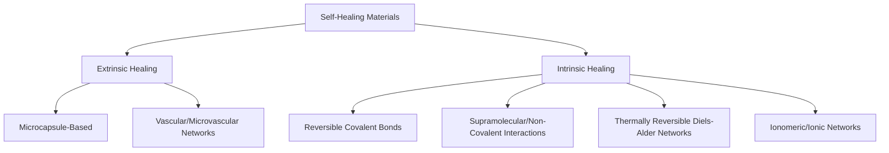

## Self Healing Materials

### Overview

Self-healing materials possess the intrinsic or engineered ability to autonomously or triggerably repair damage (cracks, cuts, delamination) without external intervention, restoring some or all of their original mechanical, electrical, or functional properties. This capability extends service life, improves reliability, and reduces maintenance costs in structural, electronic, and biomedical applications.

### Fundamental Classification

Self-healing mechanisms are broadly divided into two categories based on the source of healing agent and reversibility of the underlying chemistry:

### 1. Extrinsic Self-Healing Systems

Healing relies on a pre-embedded healing agent physically separate from the bulk matrix, released only upon damage. This is a **one-time** or limited-cycle healing mechanism, since the agent reservoir is finite.

#### Microcapsule-Based Healing (White et al. approach)

- Microcapsules (typically 10-500 µm) containing a liquid healing agent (e.g., dicyclopentadiene, DCPD) are dispersed throughout a polymer matrix along with a dormant catalyst (e.g., Grubbs' catalyst)
- Crack propagation ruptures nearby capsules, releasing the healing agent into the crack plane via capillary action
- The agent contacts the catalyst and undergoes **ring-opening metathesis polymerization (ROMP)**, polymerizing in situ to bond the crack faces

**Key design parameters:**

- Capsule shell must be strong enough to survive processing but brittle enough to rupture preferentially at the crack
- Healing agent viscosity must be low enough for capillary wicking into the crack
- Catalyst must remain stable/dormant during processing but reactive upon exposure

#### Vascular (Microvascular) Networks

- Inspired by biological circulatory systems; hollow channels (fibers, 3D-printed microchannels) run through the material, connected to a healing-agent reservoir
- Two variants: **1D** (isolated capillary channels), **2D** (interconnected network in-plane), **3D** (fully interconnected network allowing multiple healing events and larger damage volumes)
- Advantage over microcapsules: can deliver larger volumes of healing agent repeatedly to the same damage site, enabling multiple healing cycles
- Often uses two-part epoxy systems (resin + hardener in separate channels) that mix and cure upon release at the damage site

### 2. Intrinsic Self-Healing Systems

The polymer network itself contains reversible chemical bonds or physical interactions capable of re-forming after being broken, enabling **repeated** healing cycles at the same location, typically triggered by heat, light, pH, or simply time/pressure (autonomic).

#### Reversible Covalent Chemistry

- **Diels-Alder / retro-Diels-Alder (DA/rDA) networks**: furan-maleimide-based polymers form crosslinks via DA cycloaddition; heating above a threshold temperature drives the retro-DA reaction, breaking bonds and allowing chain mobility/crack closure, followed by re-formation of DA bonds upon cooling

$$\text{Furan} + \text{Maleimide} \underset{\Delta T}{\overset{room\,T}{\rightleftharpoons}} \text{DA Adduct}$$

- **Disulfide bond exchange**: S-S bonds undergo dynamic exchange (metathesis) under mild heat or catalysis, enabling network reconfiguration and stress relaxation while maintaining crosslink density (basis of many **vitrimers**)
- **Boronic ester / boroxine exchange**: dynamic covalent bonds used in vitrimeric epoxy systems

#### Supramolecular (Non-Covalent) Interactions

- **Hydrogen bonding networks**: e.g., ureidopyrimidinone (UPy)-functionalized polymers form strong, reversible quadruple hydrogen bonds that can break and reform at room temperature, giving rapid autonomic healing
- **Ionic interactions (ionomers)**: e.g., Surlyn® (ethylene-methacrylic acid ionomer) — ionic clusters act as reversible crosslinks; puncture healing occurs via localized melting from impact-generated heat, immediately followed by re-solidification
- **π-π stacking, metal-ligand coordination**: used in specialized supramolecular polymer designs for tunable healing kinetics

#### Vitrimers

A distinct sub-class of covalent adaptable networks (CANs) where bond exchange occurs via an associative mechanism — network connectivity (and thus crosslink density) is maintained throughout exchange, giving glass-like viscosity behavior with topology freezing temperature ($T_v$):

$$\eta(T) = \eta_0 \exp\left(\frac{E_a}{R}\left(\frac{1}{T}-\frac{1}{T_v}\right)\right)$$

Above $T_v$, the network flows like a viscous liquid (enabling reprocessing/healing); below $T_v$, it behaves as a fixed thermoset.

### Self-Healing in Non-Polymeric Systems

- **Self-healing concrete**: bacterial spores (e.g., *Bacillus* species) embedded with calcium lactate precipitate calcium carbonate upon water ingress through cracks, sealing them; alternatively, microencapsulated sodium silicate healing agents
- **Self-healing metals/alloys**: [Inference] research-stage approaches include precipitation-based crack-filling (e.g., copper or boron precipitates diffusing to fill microcracks at elevated temperature) and shape-memory-alloy-reinforced composites that mechanically close cracks upon heating; these remain largely at laboratory/demonstration scale rather than widespread commercial deployment
- **Self-healing coatings**: corrosion-inhibiting microcapsules embedded in paint/coating layers release inhibitors upon mechanical damage, preventing substrate corrosion at the exposed site
- **Self-healing electronic/conductive materials**: liquid metal droplets (e.g., eutectic gallium-indium, EGaIn) embedded in elastomers rupture and reconnect conductive pathways after damage; conductive polymer composites with dynamic bonds restore both mechanical and electrical continuity

### Quantifying Healing Performance

**Healing efficiency** is the standard metric, comparing a recovered property to its virgin (undamaged) value:

$$\eta_{healing} = \frac{P_{healed}}{P_{virgin}} \times 100\%$$

where $P$ may be fracture toughness, tensile strength, or another relevant mechanical property. Healing efficiency depends strongly on:

- Healing temperature and time
- Number of healing cycles (intrinsic systems often show gradual efficiency decay over repeated cycles)
- Damage severity and crack closure geometry (healing agent must physically bridge the gap)

### Key Points

- Extrinsic systems (microcapsules, vascular networks) rely on a finite embedded healing agent and are generally limited to one or a few healing events at a given location.
- Intrinsic systems use reversible chemistry (dynamic covalent bonds or supramolecular interactions) built into the polymer backbone, enabling repeated healing cycles, often at the cost of reduced baseline mechanical strength compared to conventional thermosets.
- Healing efficiency is the primary performance metric and is sensitive to trigger conditions (heat, light, time) and damage geometry.

### Comparison Table

| Mechanism | Trigger | Healing Cycles | Typical Efficiency | Example System |
| --- | --- | --- | --- | --- |
| Microcapsule | Crack rupture (autonomic) | 1 (single-use) | 60-90% | DCPD/Grubbs' catalyst |
| Vascular network | Crack rupture + flow | Multiple (if resupplied) | 70-100% | Two-part epoxy in microchannels |
| Diels-Alder | Heat (~90-150°C) | Multiple | 80-100% | Furan-maleimide networks |
| Disulfide exchange (vitrimer) | Heat + catalyst | Multiple | 70-95% | Epoxy vitrimers |
| Hydrogen bonding (UPy) | Room temp (autonomic) | Multiple | Variable, often lower strength | UPy-functionalized polymers |
| Ionomer | Impact heat | Multiple | High for puncture-type damage | Surlyn |
| Bacterial concrete | Water ingress | Effectively single crack-sealing event | Crack width reduction, not strength recovery per se | Bacillus + calcium lactate |

### Example

A DA/rDA-based epoxy network with furan-maleimide crosslinks is cut, then the two halves are placed in contact and heated to 120°C for 2 hours. The retro-DA reaction breaks a fraction of the crosslinks near the cut surface, allowing chain interdiffusion across the interface; upon cooling to room temperature, DA bonds reform across the healed interface. Reported healing efficiencies in such systems are commonly in the 80-100% range for fracture toughness recovery over multiple cycles, though [Unverified] the exact efficiency depends strongly on the specific furan/maleimide functionality density, stoichiometry, and healing protocol used in a given study, so figures should be verified against the specific formulation referenced.

### Illustration: Extrinsic vs. Intrinsic Healing Mechanism (svg_diagram)

<svg viewBox="0 0 620 300" xmlns="http://www.w3.org/2000/svg">
<text x="310" y="22" font-size="15" text-anchor="middle" font-weight="bold">Extrinsic vs Intrinsic Self-Healing (svg_diagram)</text>
<!-- Extrinsic panel -->

<text x="150" y="50" font-size="13" text-anchor="middle">Extrinsic (Microcapsule)</text>

<rect x="60" y="65" width="180" height="80" fill="none" stroke="black" stroke-width="1.5"/>

<circle cx="100" cy="105" r="10" fill="lightblue" stroke="blue"/>

<circle cx="150" cy="90" r="8" fill="lightblue" stroke="blue"/>

<circle cx="190" cy="115" r="9" fill="lightblue" stroke="blue"/>

<line x1="60" y1="145" x2="240" y2="65" stroke="red" stroke-width="1.5" stroke-dasharray="3,2"/>

<text x="150" y="165" font-size="11" text-anchor="middle">Crack ruptures capsule</text>

<text x="150" y="180" font-size="11" text-anchor="middle">→ agent flows & cures</text>

<text x="150" y="195" font-size="10" text-anchor="middle" fill="gray">(single-use)</text>

<!-- Intrinsic panel -->

<text x="470" y="50" font-size="13" text-anchor="middle">Intrinsic (Reversible Bonds)</text>

<rect x="380" y="65" width="180" height="80" fill="none" stroke="black" stroke-width="1.5"/>

<path d="M380,105 L460,80 M460,80 L560,110" stroke="black" stroke-width="1.5" fill="none"/>

<line x1="460" y1="80" x2="460" y2="130" stroke="red" stroke-width="1.5" stroke-dasharray="3,2"/>

<circle cx="460" cy="80" r="4" fill="darkorange"/>

<text x="470" y="165" font-size="11" text-anchor="middle">Heat breaks/reforms</text>

<text x="470" y="180" font-size="11" text-anchor="middle">dynamic bonds at crack</text>

<text x="470" y="195" font-size="10" text-anchor="middle" fill="gray">(repeatable)</text>

</svg>

### Related Topics

- Vitrimers and Covalent Adaptable Networks
- Shape Memory Polymers
- Bio-Inspired Materials Design
- Dynamic Covalent Chemistry
- Self-Healing Coatings for Corrosion Protection
- Microencapsulation Techniques
- Stimuli-Responsive Smart Materials
- Damage-Tolerant Composite Design