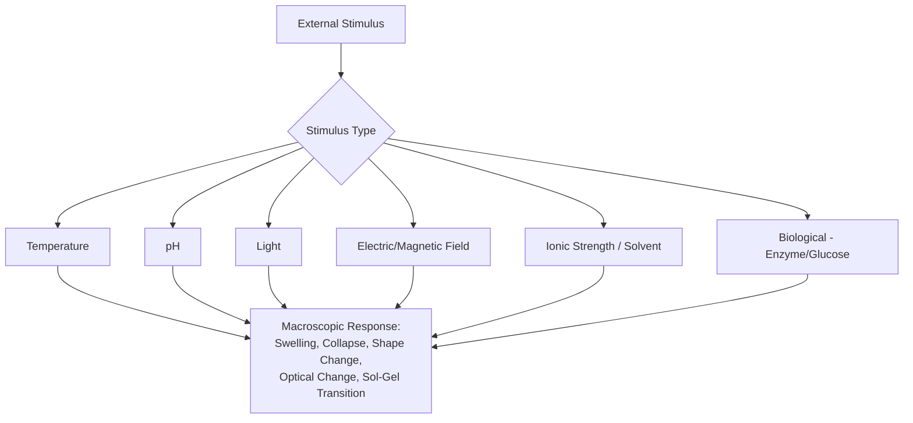

## Stimuli Responsive Polymers

### Overview

Stimuli-responsive polymers (also called "smart" or "intelligent" polymers) undergo significant, often reversible, physical or chemical changes — in conformation, solubility, shape, optical properties, or mechanical stiffness — in response to small changes in their external environment. These materials convert an external stimulus into a functional macroscopic response, forming the basis for drug delivery systems, sensors, actuators, and adaptive coatings.

### Fundamental Response Mechanisms

The responsive behavior generally originates from stimulus-induced changes at the molecular level that propagate to macroscopic effects:

- **Conformational transitions**: coil-to-globule transitions in polymer chains (e.g., thermoresponsive polymers)
- **Ionization/protonation changes**: pH-responsive polymers with ionizable groups (carboxylic acids, amines)
- **Bond breaking/forming**: photoresponsive polymers with reversible photochemical groups
- **Phase transitions**: crystalline-amorphous transitions, sol-gel transitions
- **Supramolecular association/dissociation**: host-guest complexation, hydrogen bonding networks

### Classification by Stimulus Type

#### 1. Thermoresponsive Polymers

Exhibit a critical solution temperature at which a sharp, reversible phase transition occurs.

- **Lower Critical Solution Temperature (LCST) polymers**: soluble (hydrated, extended coil) below LCST; become insoluble (dehydrated, collapsed globule) above LCST as entropy-driven dehydration dominates
  - **Poly(N-isopropylacrylamide) (PNIPAM)**: the archetypal thermoresponsive polymer, LCST ≈ 32°C in water — close to physiological temperature, making it valuable for biomedical applications
  - Mechanism: below LCST, hydrogen bonding between polymer amide groups and water dominates (enthalpically favorable); above LCST, entropy gain from releasing ordered water molecules drives chain collapse and phase separation

$$\Delta G_{mixing} = \Delta H_{mixing} - T\Delta S_{mixing}$$

At the LCST, the entropic term begins to dominate, flipping the sign of $\Delta G$ from negative (soluble) to positive (phase-separated).

- **Upper Critical Solution Temperature (UCST) polymers**: insoluble below UCST, soluble above — less common in aqueous systems, more typical in polymer blends and some polyampholyte/ionic systems

#### 2. pH-Responsive Polymers

Contain ionizable pendant groups (weak acids or bases) whose degree of ionization depends on ambient pH, altering hydrophilicity, chain conformation, and swelling behavior.

- **Anionic (acidic) polymers**: poly(acrylic acid) (PAA), poly(methacrylic acid) (PMAA) — protonated (neutral, collapsed/hydrophobic) at low pH; deprotonated (charged, swollen/hydrophilic) at high pH due to electrostatic chain repulsion
- **Cationic (basic) polymers**: poly(dimethylaminoethyl methacrylate) (PDMAEMA), chitosan — protonated (charged, swollen) at low pH; deprotonated (neutral, collapsed) at high pH

The transition occurs near the polymer's pKa, described by the Henderson-Hasselbalch relation:

$$pH = pKa + \log\frac{[A^-]}{[HA]}$$

#### 3. Photoresponsive Polymers

Incorporate photochromic moieties that undergo reversible structural isomerization upon light exposure.

- **Azobenzene**: reversible trans-cis photoisomerization under UV (→cis) and visible light or heat (→trans); the cis form is bent and more polar, altering polymer conformation, wettability, or triggering shape change in liquid crystal networks
- **Spiropyran/merocyanine**: UV light converts nonpolar, colorless spiropyran to polar, colored merocyanine form; reversible with visible light or heat, useful for photoswitchable solubility and optical sensing
- **o-Nitrobenzyl and coumarin derivatives**: photocleavable groups used for one-time UV-triggered bond scission (e.g., photodegradable hydrogels for controlled release)

#### 4. Electro- and Magneto-Responsive Polymers

- **Electroactive polymers (EAPs)**:
  - *Ionic EAPs* (e.g., ionic polymer-metal composites, IPMCs; conducting polymers like polypyrrole, PEDOT): respond to low voltage via ion migration, causing bending/actuation
  - *Electronic EAPs* (e.g., dielectric elastomers): respond to high electric fields via Maxwell stress-induced deformation
- **Magnetoresponsive polymers**: composites embedding magnetic nanoparticles (Fe₃O₄) within a polymer matrix; external magnetic fields induce particle alignment, movement, or localized heating (via hysteresis/Néel relaxation) for remote actuation or hyperthermia applications

#### 5. Ionic Strength / Solvent-Responsive Polymers

Polyelectrolytes respond to changes in ionic strength via charge screening, altering chain extension and swelling (relevant to layer-by-layer assemblies and polyelectrolyte gels). Amphiphilic block copolymers can also respond to solvent quality changes, driving micellization/demicellization.

#### 6. Biologically Responsive Polymers

- **Glucose-responsive polymers**: often incorporate phenylboronic acid groups that reversibly bind diol-containing glucose, altering crosslink density/charge — basis for smart insulin-delivery systems
- **Enzyme-responsive polymers**: contain enzyme-cleavable linkages (peptide sequences, ester bonds) that degrade selectively in the presence of specific enzymes (e.g., matrix metalloproteinases in tumor microenvironments)

### Physical Manifestations of Response

| Manifestation | Description | Example System |
| --- | --- | --- |
| Sol-gel transition | Liquid-to-gel (or reverse) transition | Poloxamers (Pluronics), thermogelling chitosan |
| Swelling/deswelling (hydrogels) | Volume change from water uptake/expulsion | PNIPAM hydrogels, PAA hydrogels |
| Coil-globule collapse | Single-chain conformational change | PNIPAM in dilute solution |
| Shape change/actuation | Macroscopic bending, folding | Liquid crystal networks with azobenzene |
| Surface wettability switching | Hydrophilic ↔ hydrophobic transition | PNIPAM-grafted surfaces |
| Sensing/optical change | Color or fluorescence change | Spiropyran-based sensors |

### Copolymer Strategies for Tuning Response

The transition point (LCST, pKa-dependent pH range, etc.) can be tuned by copolymerization:

- Incorporating hydrophilic comonomers (e.g., acrylamide) with PNIPAM **raises** the LCST
- Incorporating hydrophobic comonomers **lowers** the LCST
- Block, graft, and random copolymer architectures allow combination of multiple stimuli-responsive behaviors into a single "multi-responsive" material (e.g., dual pH- and temperature-responsive systems)

### Key Points

- Stimuli-responsive polymers convert small environmental changes (temperature, pH, light, field, biomolecule concentration) into macroscopic physical responses via molecular-level mechanisms such as hydration state changes, ionization, or photoisomerization.
- PNIPAM (thermoresponsive, LCST ~32°C) and PAA/PDMAEMA (pH-responsive) are the most extensively studied model systems, particularly for biomedical applications.
- Response transition points are tunable via copolymerization, molecular weight, and architecture, enabling application-specific design (e.g., matching LCST to physiological or hyperthermia temperature ranges).

### Example

A PNIPAM-based hydrogel drug delivery device is designed to release a therapeutic payload upon reaching body-adjacent hyperthermia temperature (~40-41°C, as used in some localized cancer treatment protocols). Below the LCST (32°C), the hydrogel network is swollen and hydrophilic, with an open mesh structure allowing slow diffusive drug release. As local temperature is raised above the LCST (e.g., via focused ultrasound or magnetic nanoparticle hyperthermia), the polymer chains dehydrate and collapse, expelling water and mechanically "squeezing" a bolus of drug out of the shrinking gel network — a mechanism exploited for triggered, on-demand release rather than passive diffusion alone.

### Illustration: LCST Coil-to-Globule Transition (svg_diagram)

<svg viewBox="0 0 600 260" xmlns="http://www.w3.org/2000/svg">
<text x="300" y="22" font-size="15" text-anchor="middle" font-weight="bold">PNIPAM Coil-Globule Transition at LCST (svg_diagram)</text>
<!-- Below LCST -->

<text x="140" y="55" font-size="13" text-anchor="middle">T < LCST (Swollen, Hydrated)</text>

<path d="M60,150 C80,100 110,180 140,120 C170,80 190,160 220,110" stroke="steelblue" stroke-width="3" fill="none"/>

<circle cx="75" cy="130" r="3" fill="lightblue"/>

<circle cx="100" cy="160" r="3" fill="lightblue"/>

<circle cx="130" cy="105" r="3" fill="lightblue"/>

<circle cx="160" cy="140" r="3" fill="lightblue"/>

<circle cx="195" cy="95" r="3" fill="lightblue"/>

<text x="140" y="215" font-size="11" text-anchor="middle">Extended, hydrated chain</text>

<text x="140" y="230" font-size="11" text-anchor="middle" fill="gray">H-bonding with water dominant</text>

<!-- Arrow -->
<line x1="260" y1="140" x2="340" y2="140" stroke="black" stroke-width="2" marker-end="url(#arrow3)"/>
<text x="300" y="130" font-size="12" text-anchor="middle">Heat &gt; LCST</text>
<!-- Above LCST -->

<text x="460" y="55" font-size="13" text-anchor="middle">T > LCST (Collapsed Globule)</text>

<circle cx="460" cy="140" r="35" fill="none" stroke="darkorange" stroke-width="3"/>

<path d="M440,125 C450,135 470,145 480,135 M445,150 C455,145 465,155 475,148" stroke="darkorange" stroke-width="2" fill="none"/>

<text x="460" y="215" font-size="11" text-anchor="middle">Dehydrated, compact globule</text>

<text x="460" y="230" font-size="11" text-anchor="middle" fill="gray">Water released (entropy gain)</text>

<defs>
<marker id="arrow3" markerWidth="8" markerHeight="8" refX="4" refY="4" orient="auto">
<path d="M0,0 L8,4 L0,8 Z" fill="black"/>
</marker>
</defs>
</svg>

### Related Topics

- Hydrogels and Swelling Kinetics
- Shape Memory Polymers
- Self-Healing Materials
- Controlled Drug Delivery Systems
- Liquid Crystal Elastomers and Photoactuation
- Layer-by-Layer Polyelectrolyte Assembly
- Conducting Polymers (Polypyrrole, PEDOT:PSS)
- Block Copolymer Self-Assembly