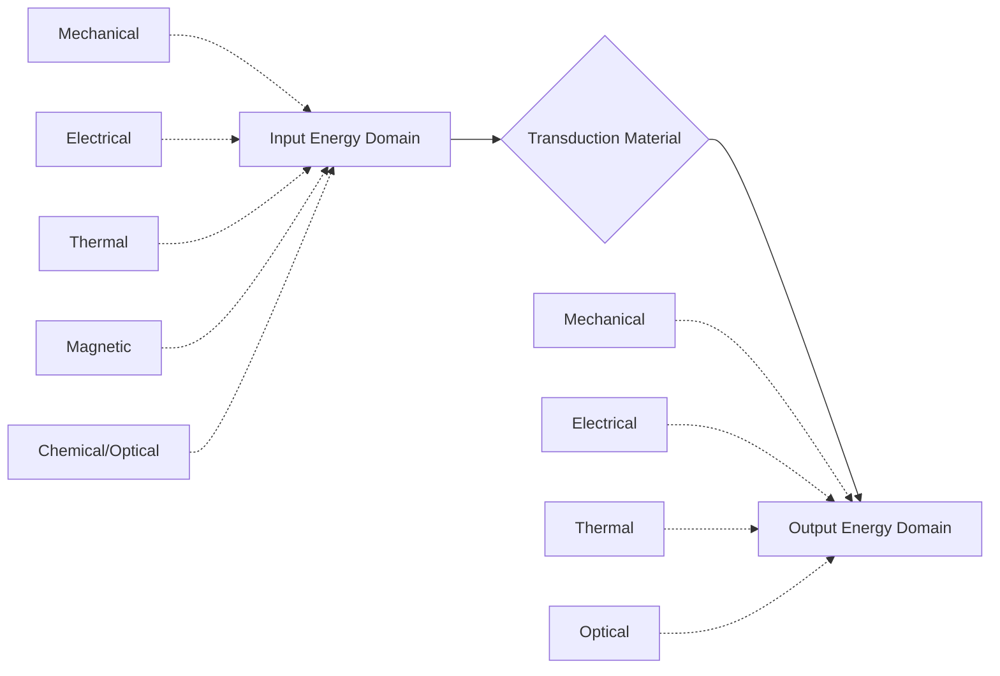

## Actuator and Sensor Materials

### Overview

Actuator and sensor materials convert energy between mechanical, electrical, thermal, magnetic, and chemical domains, forming the transduction backbone of smart systems. Sensor materials detect a stimulus and produce a measurable signal (typically electrical); actuator materials receive an input signal and produce a mechanical (or other functional) output. Many material classes are inherently bidirectional, functioning as both sensors and actuators depending on operating mode.

### Fundamental Transduction Framework

A material functioning as a **sensor** converts a non-electrical input (strain, temperature, light, chemical concentration) into an electrical output; as an **actuator**, it converts electrical (or thermal/magnetic) input into mechanical displacement or force output.

### Classification by Transduction Mechanism

#### 1. Piezoelectric Materials

Covered in depth separately (see Piezoelectric Materials), but summarized here in the actuator/sensor context:

- **As sensors**: direct piezoelectric effect converts applied stress/strain into charge/voltage — used in accelerometers, force sensors, microphones, ultrasonic receivers
- **As actuators**: converse piezoelectric effect converts applied voltage into precise, fast (µs-ms), sub-micron displacement — used in precision positioning stages, fuel injectors, ultrasonic motors
- Key materials: PZT ceramics, PVDF polymers, PMN-PT single crystals

#### 2. Shape Memory Alloys (SMAs)

Actuator materials that exploit a reversible, diffusionless **martensite-austenite phase transformation** to produce large-strain, high-force actuation.

- **Nitinol (NiTi)**: the dominant commercial SMA, exhibits both the **shape memory effect** (deformed martensite recovers original shape upon heating to austenite) and **superelasticity** (large recoverable strain, up to ~8%, at constant temperature above $A_f$)
- Actuation is thermally driven: resistive (Joule) heating above the austenite finish temperature ($A_f$) triggers the phase transformation and shape recovery
- Actuation strain: up to 6-8% (compared to <0.2% for piezoelectrics), but response is slow (governed by heating/cooling rates, typically tens of ms to seconds) and hysteretic

$$\varepsilon_{transformation} \approx 4-8\% \text{ (NiTi)}$$

- Applications: medical stents/guidewires, robotic actuators, orthodontic wires, aerospace deployable structures

#### 3. Magnetostrictive Materials

Materials that change dimension in response to an applied magnetic field (Joule magnetostriction) and, conversely, exhibit a change in magnetization under applied stress (Villari effect — used for sensing).

- **Terfenol-D (Tb-Dy-Fe alloy)**: giant magnetostriction, strain up to ~2000 ppm ($2 \times 10^{-3}$), fast response (kHz range), used in sonar transducers, precision actuators, active vibration damping
- **Galfenol (Fe-Ga alloy)**: lower magnetostriction (~200-400 ppm) but better mechanical properties (ductile, machinable) than brittle Terfenol-D, useful for structural sensing applications

$$\lambda = \frac{\Delta l}{l}\bigg|_{H} \quad \text{(magnetostrictive strain)}$$

#### 4. Electroactive Polymers (EAPs)

Divided into two major sub-classes with distinct actuation mechanisms:

- **Dielectric elastomer actuators (DEAs)**: a compliant elastomer (e.g., silicone, acrylic) sandwiched between compliant electrodes; applied high voltage generates Maxwell stress, compressing the film thickness and expanding its area — large strain (>100% possible) but requires high voltage (kV range)

$$p = \varepsilon_0\varepsilon_r E^2 \quad \text{(Maxwell stress pressure)}$$

- **Ionic EAPs** (IPMCs, conducting polymers): low-voltage (1-5 V) driven, based on ion migration/redox reactions causing volume change or bending; slower and lower force than dielectric elastomers, but low-voltage operation suits biomedical/soft robotics use

#### 5. Magnetorheological (MR) and Electrorheological (ER) Fluids

Smart fluids whose apparent viscosity changes reversibly and near-instantaneously under applied magnetic (MR) or electric (ER) field, due to particle chain formation within the fluid matrix. Used in semi-active dampers, clutches, and haptic devices rather than true "actuators" in the displacement sense, but classified among actuator materials for controllable force/damping.

#### 6. Thermal-Based Actuator/Sensor Materials

- **Bimetallic strips**: differential thermal expansion between two bonded metal layers causes bending — simple thermal actuators/switches (thermostats)
- **Thermocouples**: junction of dissimilar metals generating a Seebeck-effect voltage proportional to temperature difference — classic temperature sensor
- **Thermistors**: ceramic (metal oxide) semiconductors with strongly temperature-dependent resistance (NTC or PTC) — widely used for precision temperature sensing

#### 7. Resistive/Capacitive Strain and Pressure Sensor Materials

- **Metal foil strain gauges**: resistance changes with strain via the geometric (Poisson) effect and piezoresistivity, governed by the gauge factor:

$$GF = \frac{\Delta R/R}{\varepsilon}$$

- **Semiconductor piezoresistive materials** (doped silicon): much higher gauge factor (~100-200) than metal foils (~2), used in MEMS pressure sensors and accelerometers, but more temperature-sensitive
- **Carbon nanotube (CNT) and graphene-based flexible strain sensors**: percolation-network resistance change under strain, suited for flexible/wearable electronics; [Inference] these generally offer higher stretchability than rigid semiconductor sensors, though at the cost of more complex, less linear resistance-strain response

#### 8. Optical Fiber Sensor Materials

- **Fiber Bragg Gratings (FBGs)**: periodic refractive index modulation in the fiber core reflects a specific wavelength dependent on grating pitch, which shifts with applied strain or temperature — enables distributed, EMI-immune sensing along a single fiber, widely used in structural health monitoring

### Comparative Actuator Performance

| Actuator Type | Max Strain | Response Speed | Force/Stress Capability | Voltage/Field Required |
| --- | --- | --- | --- | --- |
| Piezoelectric (PZT) | ~0.1-0.2% | Very fast (µs) | High stress, low displacement | ~100s V |
| Shape Memory Alloy (NiTi) | 4-8% | Slow (ms-s, thermal) | Very high force | Thermal (resistive heating) |
| Magnetostrictive (Terfenol-D) | ~0.1-0.2% | Fast (kHz) | High force | Magnetic field |
| Dielectric Elastomer | >100% (some designs) | Moderate (ms) | Low-moderate force | High voltage (kV) |
| Ionic Polymer (IPMC) | Moderate bending | Slow-moderate | Low force | Low voltage (1-5V) |
| Electrorheological/MR Fluid | N/A (damping) | Very fast (ms) | Variable damping force | Field-dependent |

### Comparative Sensor Performance

| Sensor Type | Measurand | Sensitivity | Notable Feature |
| --- | --- | --- | --- |
| Metal foil strain gauge | Strain | GF ≈ 2 | Robust, linear, low cost |
| Semiconductor piezoresistor | Strain/pressure | GF ≈ 100-200 | High sensitivity, temperature-sensitive |
| Piezoelectric (PVDF, PZT) | Dynamic force/vibration | High for dynamic, zero for static | Cannot measure true DC/static load |
| Thermocouple | Temperature | ~10s of µV/°C | Wide range, no external power needed |
| Thermistor (NTC) | Temperature | High (near room temp) | Nonlinear, narrower range |
| FBG optical fiber | Strain/temperature | High, distributed sensing | EMI immune, multiplexable |

### Key Points

- Actuator materials are selected primarily on the trade-off between strain (displacement), force, and response speed: piezoelectrics offer speed and precision at low strain; SMAs offer large strain and force at slow, thermally-limited speed; EAPs offer very large strain at low force.
- Sensor material selection depends on whether static or dynamic measurement is needed — piezoelectric sensors cannot detect true static/DC loads (charge leaks away), whereas resistive strain gauges and semiconductor piezoresistors can.
- Many materials (piezoelectrics, magnetostrictives, some SMAs) are inherently reciprocal, functioning as both sensor and actuator depending on which effect (direct vs. converse) is exploited.

### Example

A robotic gripper finger design compares a piezoelectric bimorph actuator against a NiTi SMA wire actuator for a soft-grasping application. The piezoelectric bimorph achieves sub-millisecond response and precise, repeatable sub-millimeter deflection but produces limited displacement and requires a high-voltage driver circuit — appropriate for high-speed micro-manipulation tasks. The NiTi wire, driven by resistive heating (~500 mA current pulse), contracts by up to 5% of its length, generating substantial gripping force suitable for handling larger objects, but the actuation cycle (heating plus convective/passive cooling for the return stroke) limits cycling frequency to roughly 1-2 Hz in still air — illustrating the classic strain-versus-speed trade-off that drives actuator material selection in mechatronic design.

### Illustration: Actuator Selection Trade-off Space (svg_diagram)

<svg xmlns="http://www.w3.org/2000/svg" viewBox="0 0 600 340">
<text x="300" y="22" font-size="15" text-anchor="middle" font-weight="bold">Actuator Material Strain vs Response Speed (svg_diagram)</text>

<line x1="80" y1="290" x2="550" y2="290" stroke="black" stroke-width="2" />
<line x1="80" y1="290" x2="80" y2="50" stroke="black" stroke-width="2" />
<text x="315" y="320" font-size="12" text-anchor="middle">Response Speed →</text>
<text x="35" y="170" font-size="12" transform="rotate(-90 35,170)">Achievable Strain →</text>

<circle cx="470" cy="260" r="7" fill="steelblue" />
<text x="470" y="245" font-size="11" text-anchor="middle">PZT</text>
<circle cx="150" cy="90" r="7" fill="darkorange" />
<text x="150" y="75" font-size="11" text-anchor="middle">NiTi SMA</text>
<circle cx="440" cy="200" r="7" fill="seagreen" />
<text x="440" y="185" font-size="11" text-anchor="middle">Terfenol-D</text>
<circle cx="250" cy="60" r="7" fill="purple" />
<text x="250" y="45" font-size="11" text-anchor="middle">Dielectric Elastomer</text>
<circle cx="200" cy="230" r="7" fill="crimson" />
<text x="200" y="270" font-size="11" text-anchor="middle">IPMC</text>
</svg>

### Related Topics

- Piezoelectric Materials
- Shape Memory Alloys (Nitinol) — Transformation Mechanics
- MEMS Fabrication for Sensors and Actuators
- Magnetorheological and Electrorheological Fluids
- Soft Robotics Material Design
- Structural Health Monitoring with Fiber Optic Sensors
- Electroactive Polymers and Artificial Muscles
- Smart Material Hybrid/Composite Actuator Systems