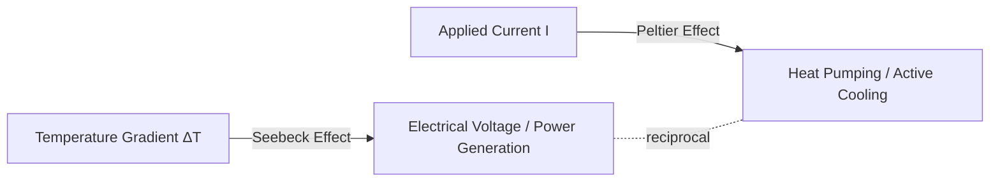
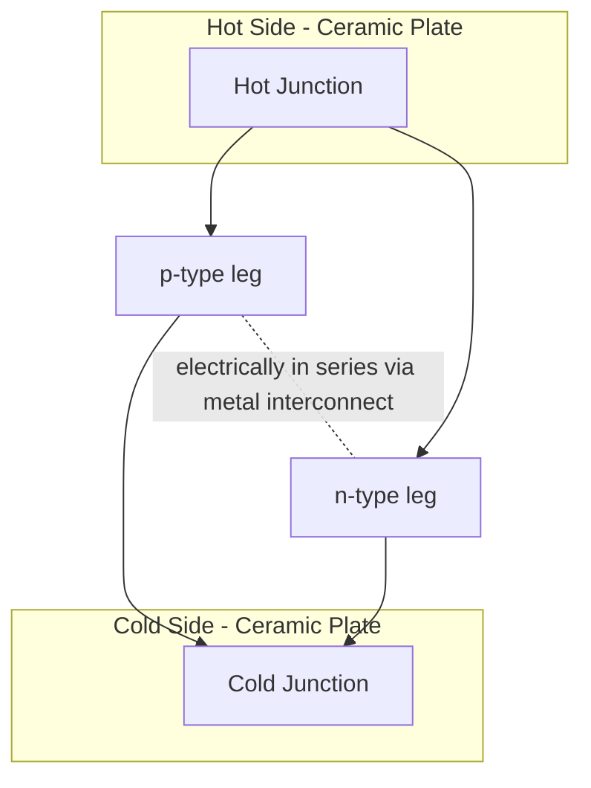

## Thermoelectric Materials

### Overview

Thermoelectric materials directly interconvert thermal energy (temperature gradients) and electrical energy through solid-state charge carrier transport, without moving parts. This enables two functional modes: **power generation** (Seebeck effect — converting a temperature gradient into electrical voltage) and **active cooling/heating** (Peltier effect — using applied current to pump heat). Their all-solid-state, silent, and scalable nature makes them valuable for waste-heat recovery, remote power generation, and precision thermal management.

### Fundamental Thermoelectric Effects

#### Seebeck Effect

When a temperature gradient is applied across a conductor or semiconductor, charge carriers diffuse from the hot to the cold end, generating an electric potential difference:

$$V = -S\Delta T$$

where $S$ (or $\alpha$) is the **Seebeck coefficient** (V/K), defined as the open-circuit voltage generated per unit temperature difference. Sign convention: $S > 0$ for p-type (hole-dominated) materials, $S < 0$ for n-type (electron-dominated) materials.

#### Peltier Effect

The reciprocal effect: passing current through a junction of two dissimilar conductors causes heat absorption at one junction and heat release at the other, enabling solid-state refrigeration:

$$Q = \Pi I$$

where $\Pi$ is the Peltier coefficient, related to the Seebeck coefficient via the **Kelvin (Thomson) relation**: $\Pi = ST$.

#### Thomson Effect

A less commonly exploited effect where heat is absorbed or released when current flows through a single homogeneous conductor with a temperature gradient along its length.

### Figure of Merit (zT)

Material performance is quantified by the dimensionless **thermoelectric figure of merit**:

$$zT = \frac{S^2\sigma T}{\kappa}$$

where:

- $S$ = Seebeck coefficient
- $\sigma$ = electrical conductivity
- $\kappa = \kappa_{lattice} + \kappa_{electronic}$ = total thermal conductivity (lattice/phonon + electronic contributions)
- $T$ = absolute temperature

The numerator $S^2\sigma$ is termed the **power factor**. Maximizing $zT$ requires simultaneously maximizing electrical conductivity and Seebeck coefficient while minimizing thermal conductivity — a fundamentally difficult optimization because $S$, $\sigma$, and the electronic component of $\kappa$ are strongly interdependent through carrier concentration.

**The "phonon-glass, electron-crystal" (PGEC) concept**, formulated by Slack, describes the ideal thermoelectric material: it conducts electricity as efficiently as a crystalline semiconductor while conducting heat as poorly as an amorphous glass, decoupling electronic and thermal transport.

### Carrier Concentration Optimization

$S$, $\sigma$, and $\kappa_{electronic}$ all depend on carrier concentration $n$, creating an inherent trade-off:

- Low $n$ (insulators): high $S$, but very low $\sigma$
- High $n$ (metals): high $\sigma$, but low $S$ (and high $\kappa_{electronic}$ via Wiedemann-Franz law)
- **Optimal $zT$ typically occurs in heavily-doped semiconductors**, with carrier concentrations in the range of $10^{19}-10^{21} \text{ cm}^{-3}$

$$\kappa_{electronic} = L\sigma T \quad \text{(Wiedemann-Franz law, } L \text{ = Lorenz number)}$$

### Major Material Classes by Operating Temperature Range

#### Low Temperature (near room temp to ~450 K): Bismuth Telluride-Based

- **Bi₂Te₃, Sb₂Te₃, and their solid solutions** ($\text{Bi}_2\text{Te}_3\text{-Sb}_2\text{Te}_3$ for p-type; $\text{Bi}_2\text{Te}_3\text{-Bi}_2\text{Se}_3$ for n-type): the dominant commercial thermoelectric material, $zT \approx 1$ near room temperature
- Layered rhombohedral crystal structure with weak van der Waals bonding between quintuple layers, contributing to intrinsically low lattice thermal conductivity
- Used in virtually all commercial Peltier coolers and low-grade waste heat recovery modules

#### Mid Temperature (~500-900 K): Lead Telluride and Skutterudites

- **PbTe and PbTe-based alloys**: rock-salt structure, historically important for space power (radioisotope thermoelectric generators, RTGs); nanostructuring and band engineering (e.g., "band convergence" strategies) have pushed $zT$ above 2 in optimized compositions
- **Skutterudites** (e.g., $\text{CoSb}_3$-based): cage-like crystal structure with large interstitial voids; filling these voids with "rattler" atoms (rare earths, alkaline earths) scatters phonons strongly while minimally disrupting electronic transport — a practical PGEC realization
- **Half-Heusler alloys** (e.g., ZrNiSn, TiNiSn-based): good mechanical robustness and thermal stability, attractive for automotive waste-heat recovery despite historically moderate $zT$

#### High Temperature (>900 K): Silicon-Germanium and Oxides

- **SiGe alloys**: used in RTGs for deep-space missions (e.g., Voyager, Cassini, Mars rovers) due to exceptional stability at high temperature (up to ~1300 K) and in radiation environments, despite modest $zT$ (~0.5-1)
- **Oxide thermoelectrics** (e.g., $\text{Ca}_3\text{Co}_4\text{O}_9$, $\text{NaCo}_2\text{O}_4$): chemically stable in air at high temperature, environmentally benign and non-toxic (unlike Te/Pb-based systems), though generally lower $zT$

### Advanced $zT$ Enhancement Strategies

1. **Nanostructuring**: introducing nanoscale grain boundaries, precipitates, or superlattices scatters mid-to-long wavelength phonons more strongly than electrons (whose wavelengths are typically shorter), reducing $\kappa_{lattice}$ with minimal impact on $\sigma$
2. **Band engineering / band convergence**: aligning multiple electronic band valleys (valence or conduction) at the same energy increases the effective density of states, boosting $S$ without sacrificing $\sigma$
3. **Resonant doping levels**: introducing impurity states that distort the density of states near the Fermi level to locally enhance $S$ (e.g., Tl-doped PbTe)
4. **All-scale hierarchical architecturing**: combining atomic-scale point defects, nanoscale precipitates, and mesoscale grain boundaries to scatter phonons across the full spectrum of wavelengths simultaneously
5. **Low-dimensional structures**: quantum wells, nanowires, and superlattices exploit quantum confinement to enhance the density of states near the Fermi level while independently engineering phonon transport

### Device Architecture

A practical thermoelectric generator (TEG) or Peltier module consists of alternating p-type and n-type legs connected electrically in series and thermally in parallel between a hot-side and cold-side ceramic substrate:

Module-level (rather than material-level) efficiency depends on the average $zT$ across the operating temperature range, the temperature difference $\Delta T$, and parasitic losses (contact resistance, thermal losses).

**Generator (Seebeck-mode) conversion efficiency:**

$$\eta = \frac{T_H - T_C}{T_H} \times \frac{\sqrt{1+zT_{avg}}-1}{\sqrt{1+zT_{avg}}+T_C/T_H}$$

where the first factor is the Carnot efficiency limit and the second factor represents the material-dependent efficiency reduction.

### Key Points

- Thermoelectric performance is governed by the dimensionless figure of merit $zT = S^2\sigma T/\kappa$; maximizing it requires decoupling electronic and thermal transport (the "phonon-glass, electron-crystal" concept).
- Material selection is strongly temperature-range dependent: Bi₂Te₃ for near-room-temperature (Peltier coolers), PbTe/skutterudites for mid-range waste heat recovery, SiGe for high-temperature/space power (RTGs).
- Modern $zT$ improvements rely heavily on nanostructuring and band engineering to suppress lattice thermal conductivity and enhance the Seebeck coefficient independently of carrier concentration, rather than on entirely new base compounds.

### Comparative Material Table

| Material | Type | Operating Range | Peak zT (approx.) | Key Application |
| --- | --- | --- | --- | --- |
| Bi₂Te₃ / Sb₂Te₃ | p/n | 250-450 K | ~1.0-1.4 | Peltier coolers, consumer electronics |
| PbTe (nanostructured) | p/n | 500-900 K | ~2.0-2.5 (optimized) | Waste heat recovery, RTGs (historical) |
| Skutterudites (filled CoSb₃) | p/n | 600-900 K | ~1.0-1.7 | Automotive/industrial waste heat |
| Half-Heusler (ZrNiSn-based) | p/n | 700-900 K | ~1.0-1.5 | High-temperature waste heat, robust applications |
| SiGe alloys | p/n | 900-1300 K | ~0.5-1.0 | Deep-space RTGs |
| Oxide TE (Ca₃Co₄O₉) | p-type | High temp, air-stable | <1 (typically) | High-temp, oxidation-resistant, non-toxic uses |

[Unverified] Reported peak $zT$ values vary considerably across the literature depending on specific doping, nanostructuring approach, and measurement methodology; the ranges above represent commonly cited approximate figures rather than a single definitive benchmark.

### Example

A radioisotope thermoelectric generator (RTG) for a deep-space probe uses SiGe thermoelectric couples to convert heat from radioactive decay (typically ²³⁸Pu) into electrical power. Although SiGe's $zT$ (~0.5-1) is substantially lower than optimized PbTe or skutterudite systems, its exceptional thermal and mechanical stability over multi-decade mission lifetimes at hot-side temperatures near 1300 K, combined with proven radiation tolerance, makes it the historically preferred choice over higher-$zT$ but less thermally robust alternatives — illustrating that material selection in thermoelectrics often balances peak efficiency against long-term operational stability rather than optimizing $zT$ alone.

### Illustration: zT Optimization vs Carrier Concentration (svg_diagram)

<svg xmlns="http://www.w3.org/2000/svg" viewBox="0 0 600 320">
<text x="300" y="22" font-size="15" text-anchor="middle" font-weight="bold">Thermoelectric Parameters vs Carrier Concentration (svg_diagram)</text>
<line x1="70" y1="280" x2="560" y2="280" stroke="black" stroke-width="2" />
<line x1="70" y1="280" x2="70" y2="50" stroke="black" stroke-width="2" />
<text x="315" y="305" font-size="12" text-anchor="middle">Carrier Concentration (n) →</text>
<text x="30" y="170" font-size="12" transform="rotate(-90 30,170)">Magnitude →</text>

<path d="M90,80 C200,90 300,180 540,260" stroke="steelblue" stroke-width="2.5" fill="none" />
<text x="450" y="245" font-size="11" fill="steelblue">Seebeck (S)</text>

<path d="M90,260 C200,220 300,120 540,70" stroke="darkorange" stroke-width="2.5" fill="none" />
<text x="450" y="90" font-size="11" fill="darkorange">Conductivity (σ)</text>

<path d="M90,270 C200,150 320,100 400,120 C460,140 500,200 540,240" stroke="seagreen" stroke-width="3" fill="none" />
<text x="330" y="95" font-size="11" fill="seagreen">Power Factor (S²σ)</text>

<line x1="380" y1="280" x2="380" y2="105" stroke="gray" stroke-width="1" stroke-dasharray="3,2" />
<text x="380" y="300" font-size="10" text-anchor="middle" fill="gray">Optimal doping (~10¹⁹-10²¹ cm⁻³)</text>
</svg>

### Related Topics

- Phonon Transport and Lattice Thermal Conductivity Engineering
- Skutterudite and Half-Heusler Crystal Structures
- Nanostructured and Superlattice Thermoelectrics
- Radioisotope Thermoelectric Generators (RTGs)
- Waste Heat Recovery Systems
- Band Structure Engineering in Semiconductors
- Wiedemann-Franz Law and Electronic Thermal Transport
- Peltier Cooling Module Design