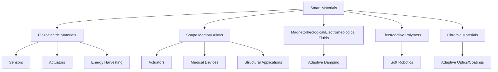

## Applications of Smart Materials in Engineering

### Introduction

Smart materials — piezoelectrics, shape memory alloys (SMAs), magnetorheological/electrorheological fluids, electroactive polymers, and thermochromic/photochromic materials — exhibit a controllable, reversible response to external stimuli (stress, temperature, electric/magnetic field, light, pH). Their engineering value lies in enabling structures and devices to sense, actuate, and adapt without discrete, bulky electromechanical subsystems. This section surveys application domains organized by material class and by function (sensing, actuation, damping, and energy harvesting).

### Piezoelectric Material Applications

Piezoelectric materials (e.g., $PZT$ — lead zirconate titanate, $BaTiO_3$, quartz, and polymer piezoelectrics like $PVDF$) generate an electric charge under mechanical stress (direct effect) and undergo mechanical deformation under an applied electric field (converse effect).

#### Sensing Applications

- **Structural health monitoring (SHM)**: Piezoelectric patches bonded to or embedded within aerospace and civil structures detect strain, vibration, and acoustic emission signatures associated with crack initiation and propagation, enabling condition-based maintenance rather than fixed-interval inspection
- **Accelerometers and pressure sensors**: The direct piezoelectric effect converts mechanical vibration or pressure directly into a proportional voltage signal, used extensively in automotive knock sensors and industrial vibration monitoring
- **Ultrasonic transducers**: Medical ultrasound imaging and non-destructive testing (NDT) both exploit the converse effect (generating ultrasonic waves) and direct effect (detecting reflected waves) in the same PZT element

#### Actuation Applications

- **Precision positioning**: Piezoelectric stack actuators provide sub-nanometer positioning resolution in scanning tunneling microscopes (STM), atomic force microscopes (AFM), and semiconductor lithography stages, exploiting the converse piezoelectric effect's near-instantaneous, hysteresis-limited response
- **Fuel injectors**: Piezoelectric injectors in modern diesel engines achieve faster switching times and more precise fuel metering than solenoid-based injectors, improving combustion efficiency and reducing emissions
- **Inkjet printing**: Piezoelectric elements deform the ink chamber to eject precisely metered droplets (drop-on-demand printing)

#### Energy Harvesting

Piezoelectric energy harvesters convert ambient mechanical vibration (from machinery, footsteps, or structural vibration) into usable electrical energy, typically to power low-consumption wireless sensor nodes in inaccessible or maintenance-difficult locations.

$$P_{\text{out}} \propto d_{33}^2 \cdot Y \cdot \sigma^2 \cdot V$$

Where $d_{33}$ is the piezoelectric charge constant along the poling axis, $Y$ is the Young's modulus, $\sigma$ is applied stress, and $V$ is the active material volume.

[Inference] Practical harvested power densities from ambient vibration are typically in the microwatt-to-milliwatt range, making this approach suitable for low-power sensor nodes rather than general power generation, though exact figures are strongly dependent on vibration frequency/amplitude matching to the harvester's resonant design.

### Shape Memory Alloy (SMA) Applications

SMAs (predominantly NiTi, "Nitinol") exploit a reversible, diffusionless martensitic-austenitic phase transformation to recover a pre-set "memory" shape upon heating, or to exhibit superelastic (pseudoelastic) large recoverable strains at constant temperature.

#### Medical Devices

- **Self-expanding stents**: NiTi stents are compressed into a catheter in the martensitic state at low temperature, then self-expand to their memorized diameter upon reaching body temperature (37°C), which is engineered to lie within the material's austenite transformation range
- **Orthodontic archwires**: Superelastic NiTi wires apply a near-constant, gentle corrective force across a wide range of tooth displacement, unlike stainless steel wires whose force drops off rapidly (linearly) as displacement decreases
- **Guidewires and surgical tools**: Superelasticity provides kink resistance combined with high flexibility, critical for navigating tortuous vasculature

#### Actuators

- **Thermal actuators**: SMA wires or springs contract upon heating (electrical resistive heating or ambient temperature change) and are used as compact, silent, lightweight linear actuators in robotics, valves, and consumer devices, though response speed is limited by heat dissipation during the return (cooling) stroke
- **Aerospace morphing structures**: SMA actuators enable variable-geometry chevrons on jet engine nacelles that passively or actively adjust shape to reduce noise during takeoff/landing while returning to the low-drag configuration at cruise
- **Automotive applications**: SMA actuators control small mechanisms such as active grille shutters and adaptive headlight leveling, replacing heavier motor-driven mechanisms

#### Structural and Damping Applications

- **Seismic damping**: Superelastic NiTi elements in structural braces absorb seismic energy through the hysteretic stress-strain loop of the martensitic transformation, then recover their original shape post-event without residual deformation, unlike conventional yielding steel dampers
- **Self-healing/self-tightening structures**: SMA fasteners and couplings (e.g., Cryofit pipe couplings originally developed for aerospace hydraulic systems) exploit shape recovery to generate a permanent, high-clamping-force joint upon warming

### Magnetorheological (MR) and Electrorheological (ER) Fluid Applications

MR and ER fluids consist of micron-scale magnetizable (MR) or polarizable (ER) particles suspended in a carrier fluid; applying a magnetic (MR) or electric (ER) field induces particle chain formation, reversibly and near-instantaneously increasing apparent viscosity/yield stress by orders of magnitude.

- **Semi-active vehicle suspension dampers**: MR dampers (e.g., in automotive and rail applications) continuously adjust damping coefficient in real time (response times ~milliseconds) based on road conditions sensed by onboard accelerometers, without the complexity of fully active hydraulic systems
- **Prosthetics**: MR fluid dampers in prosthetic knee joints adapt resistance to gait phase and walking speed in real time
- **Precision polishing (magnetorheological finishing, MRF)**: MR fluid stiffens locally under a magnetic field at the polishing interface, enabling deterministic, sub-nanometer surface finishing of optical components

### Electroactive Polymer (EAP) Applications

EAPs deform in response to an applied electric field (electronic EAPs, e.g., dielectric elastomers) or through ion migration (ionic EAPs, e.g., ionic polymer-metal composites, IPMCs).

- **Soft robotics**: Dielectric elastomer actuators (DEAs) provide muscle-like, large-strain (>100%), lightweight actuation for soft robotic grippers and artificial muscles, an area of active materials research
- **Haptic feedback devices**: EAP actuators generate localized tactile feedback in touchscreens and wearable devices
- **Biomimetic underwater propulsion**: IPMC actuators, which bend in response to low applied voltages in an aqueous environment, have been investigated for fish-like underwater propulsion in small-scale robotic devices

### Chromic (Stimuli-Responsive Color-Change) Material Applications

- **Thermochromic materials**: Used in temperature-indicating labels (food safety, battery thermal monitoring) and smart window coatings (e.g., vanadium dioxide, $VO_2$-based coatings) that switch between infrared-transmitting and infrared-reflecting states near a transition temperature, reducing building cooling loads
- **Photochromic materials**: Used in self-tinting eyewear lenses that darken reversibly under UV exposure
- **Electrochromic materials**: Used in smart windows (e.g., tungsten oxide, $WO_3$-based) with user-controlled, electrically switched tinting for architectural glazing, and in automotive auto-dimming rearview mirrors

### Cross-Cutting Application Domain: Structural Health Monitoring (SHM) Systems

Modern SHM systems frequently integrate multiple smart material classes into a single sensing network:

### Summary Table: Function-to-Material Mapping

| Engineering Function | Primary Material Class(es) | Representative Application |
| --- | --- | --- |
| Precision actuation | Piezoelectrics | AFM/STM positioning stages |
| Large-strain actuation | SMAs, EAPs | Robotic grippers, morphing structures |
| Vibration/impact damping | MR fluids, superelastic SMAs | Vehicle suspension, seismic bracing |
| Structural health sensing | Piezoelectrics | Aerospace SHM |
| Thermal-responsive switching | SMAs, thermochromics ($VO_2$) | Stents, smart windows |
| Energy harvesting | Piezoelectrics | Wireless sensor node power |
| Optical modulation | Electrochromics, photochromics | Smart glazing, adaptive eyewear |

### Design Considerations and Limitations

- **Fatigue and cycling life**: SMAs and piezoelectrics both experience property degradation (transformation temperature drift, depolarization) under extended cyclic loading, requiring application-specific fatigue characterization
- **Response speed constraints**: SMA actuators are fundamentally limited by heat transfer rates during both heating (activation) and, more significantly, cooling (deactivation), constraining their use in high-frequency actuation applications relative to piezoelectric or EAP alternatives
- **Field/temperature range constraints**: Piezoelectric materials lose piezoelectric activity above the Curie temperature; SMA transformation temperatures are composition-sensitive and must be precisely tailored (via alloying, typically Ni:Ti ratio adjustment) to the target operating environment
- [Inference] Cost remains a significant barrier to widespread SMA adoption in high-volume consumer applications relative to conventional actuators, though this gap is application- and volume-dependent and has narrowed in recent years for certain NiTi product forms

### Conclusion

Smart materials enable engineering functions — sensing, actuation, damping, and adaptive optical/thermal response — that would otherwise require complex, multi-component electromechanical assemblies. Their practical deployment spans aerospace morphing structures and structural health monitoring, minimally invasive medical devices, semi-active vehicle suspension systems, and adaptive building envelopes. Effective engineering application requires matching each material class's specific transduction mechanism, response speed, and operating envelope (temperature, field strength, fatigue life) to the functional requirements of the target system.

**Related Topics**

- Piezoelectric Effect: Direct and Converse Mechanisms
- Shape Memory Alloys: Martensitic Transformation and Superelasticity
- Magnetorheological and Electrorheological Fluid Behavior
- Electroactive Polymers and Soft Robotics
- Structural Health Monitoring System Design
- Smart Window Technologies: Thermochromic vs. Electrochromic