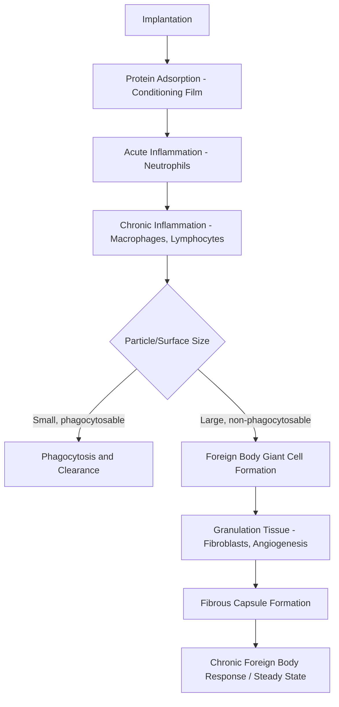

## Biocompatibility Principles

### Definition and Scope

Biocompatibility is the ability of a material to perform with an appropriate host response in a specific application. This definition, formalized by David Williams, emphasizes that biocompatibility is not an intrinsic material property but a context-dependent characteristic that depends on the specific application, anatomical location, duration of contact, and mechanical environment. A material biocompatible in one application (e.g., a hip implant) may be entirely unsuitable in another (e.g., a cardiovascular stent).

Biocompatibility encompasses two complementary aspects:

- **Biosafety**: freedom from toxicity, injury, or adverse immune/inflammatory responses
- **Biofunctionality**: the ability of the material to perform its intended mechanical, chemical, or biological function within the host

### Classification of Host Response

**Key Points**

- **Bioinert materials**: elicit minimal host response; a thin fibrous capsule forms around the implant with no significant chemical interaction (e.g., alumina, zirconia, titanium and its oxide layer)
- **Bioactive materials**: form a direct chemical bond with surrounding tissue, often through surface reactions (e.g., hydroxyapatite, bioactive glasses such as Bioglass 45S5)
- **Bioresorbable/biodegradable materials**: gradually dissolve or are metabolized and replaced by natural tissue over time (e.g., poly(lactic acid), poly(glycolic acid), magnesium alloys, tricalcium phosphate)
- **Bioviable/toxic materials**: elicit an unfavorable response ranging from chronic inflammation to necrosis; historically observed with certain early implant metals releasing toxic ion species

### Mechanisms of Host-Material Interaction

#### Protein Adsorption

Within seconds to minutes of implantation, blood and interstitial fluid proteins (albumin, fibrinogen, fibronectin, immunoglobulins) adsorb onto the implant surface, forming a conditioning layer. This layer, not the raw material surface, is what cells actually encounter. Protein conformation and orientation upon adsorption—governed by surface energy, wettability, roughness, and charge—determine subsequent cellular recognition and downstream biological cascades. This is often described by the Vroman effect, wherein initially adsorbed smaller, more mobile proteins are progressively displaced by larger proteins with higher surface affinity.

#### The Foreign Body Response (FBR)

The sequence of events following implantation typically follows this timeline:

1. **Protein adsorption** (seconds–minutes): conditioning film formation
2. **Acute inflammation** (hours–days): neutrophil infiltration, release of reactive oxygen species and proteolytic enzymes
3. **Chronic inflammation** (days–weeks): macrophage and lymphocyte infiltration
4. **Foreign body giant cell (FBGC) formation**: macrophage fusion at the implant surface when phagocytosis is frustrated by implant size
5. **Granulation tissue development**: fibroblast proliferation, angiogenesis
6. **Fibrous encapsulation**: deposition of a collagenous capsule isolating the implant from host tissue

The thickness and vascularity of the resulting fibrous capsule are inversely related to biocompatibility for many applications: bioinert materials typically stabilize with a thin, avascular capsule, whereas materials perceived as irritant provoke thicker, more vascularized, and persistently inflamed capsules.

### Toxicological Considerations

#### Local vs. Systemic Toxicity

- **Cytotoxicity**: direct cellular damage from leachable substances (unpolymerized monomers, metal ions, degradation byproducts, processing residues such as sterilization agents)
- **Genotoxicity/mutagenicity**: DNA damage potential, assessed via assays such as the Ames test and chromosomal aberration assays
- **Carcinogenicity**: long-term potential for tumor induction; historically relevant for certain metal ion releases (e.g., nickel, cobalt, chromium in specific oxidation states)
- **Systemic toxicity**: distribution of degradation products or wear debris via lymphatic or hematogenous routes to distant organs (liver, kidney, spleen)

#### Corrosion and Ion Release (Metallic Biomaterials)

Metallic implants are subject to electrochemical corrosion in the physiological environment (chloride-rich, ~pH 7.4, with proteins and enzymes capable of catalyzing degradation). Relevant corrosion mechanisms include:

- **Pitting corrosion**: localized breakdown of passive oxide films, notably in stainless steels
- **Crevice corrosion**: occurs at implant-implant or implant-bone interfaces with restricted oxygen diffusion
- **Fretting corrosion**: mechanically assisted degradation at micro-motion interfaces (e.g., modular hip taper junctions)
- **Galvanic corrosion**: accelerated corrosion when dissimilar metals are in electrical contact within an electrolyte

The passive oxide layer (Cr₂O₃ on stainless steel and Co-Cr alloys; TiO₂ on titanium alloys) is the primary determinant of corrosion resistance and, by extension, biocompatibility for metallic implants.

#### Wear Debris

Particulate debris generated at articulating or micro-moving interfaces (e.g., ultra-high-molecular-weight polyethylene [UHMWPE] particles in joint replacements) can trigger macrophage-mediated osteolysis, a major driver of aseptic loosening and implant failure. Particle size, shape, and volumetric wear rate govern the intensity of the resulting biological response, with sub-micron particles (roughly 0.1–1 μm) considered most biologically active for phagocytosis-driven inflammatory cascades. [Inference: exact size thresholds for peak osteolytic activity vary across studies and particle chemistries.]

### Immune Response Pathways

- **Innate immunity**: immediate, non-specific response involving complement activation, neutrophils, and macrophages; dominant in the initial post-implantation period
- **Adaptive immunity**: antigen-specific response involving T- and B-lymphocytes; relevant in hypersensitivity reactions to specific implant constituents (e.g., nickel allergy, bone cement components)
- **Complement activation**: implant surfaces can activate the complement cascade via the classical, alternative, or lectin pathways, amplifying inflammatory signaling
- **Hypersensitivity reactions**: Type IV (delayed-type, cell-mediated) hypersensitivity is most frequently implicated in metal implant sensitivity reactions

### Material-Specific Biocompatibility Behavior

| Material Class | Representative Examples | Typical Host Response | Primary Application Considerations |
| --- | --- | --- | --- |
| Bioinert ceramics | Alumina, zirconia | Thin fibrous capsule, minimal ion release | High wear resistance for articulating surfaces |
| Bioactive ceramics/glasses | Hydroxyapatite, Bioglass 45S5 | Direct bonding to bone (osseointegration) | Coatings, bone graft substitutes |
| Titanium and alloys | cp-Ti, Ti-6Al-4V | Stable TiO₂ passive layer, excellent osseointegration | Load-bearing implants, dental implants |
| Cobalt-chromium alloys | CoCrMo | Passive Cr₂O₃ layer; risk of metal ion release under wear/fretting | Articulating joint components |
| Stainless steels | 316L | Susceptible to pitting/crevice corrosion in chloride environment | Temporary fixation devices |
| Biodegradable polymers | PLA, PGA, PLGA | Controlled degradation, hydrolytic byproducts (lactic/glycolic acid) | Sutures, drug delivery, resorbable fixation |
| Biodegradable metals | Magnesium alloys | Hydrogen gas evolution during corrosion, alkalinization | Resorbable cardiovascular/orthopedic devices |

### Surface Properties Governing Biocompatibility

#### Key Surface Parameters

- **Wettability/surface energy**: quantified via contact angle measurements; moderate hydrophilicity (contact angles roughly 40–70°) is generally associated with favorable protein adsorption conformations and cell adhesion. [Inference: optimal ranges are cell-type and protein-dependent, not universal.]
- **Surface roughness**: influences cell attachment, spreading, and osseointegration; micro- and nano-scale topography can enhance osteoblast activity
- **Surface charge**: affects electrostatic interactions with charged protein domains and cell membrane glycocalyx
- **Surface chemistry/functional groups**: hydroxyl, carboxyl, and amine groups can be engineered to promote specific integrin-mediated cell adhesion

#### Illustration: Cell-Material Interface (svg_diagram)

<svg xmlns="http://www.w3.org/2000/svg" viewBox="0 0 700 320">
<title>Cell-Material Interface (svg_diagram)</title>
<rect x="0" y="0" width="700" height="320" fill="#ffffff" />
<rect x="50" y="220" width="600" height="40" fill="#8a8a8a" />
<text x="350" y="245" font-size="14" text-anchor="middle" fill="#ffffff">Implant Surface (Bulk Material)</text>
<rect x="50" y="205" width="600" height="15" fill="#b0b0b0" />
<text x="350" y="216" font-size="10" text-anchor="middle" fill="#000000">Oxide/Passive Layer</text>
<g>
<circle cx="120" cy="185" r="8" fill="#e07b39" />
<circle cx="150" cy="190" r="8" fill="#e07b39" />
<circle cx="185" cy="182" r="8" fill="#e07b39" />
<text x="150" y="165" font-size="11" text-anchor="middle">Adsorbed Proteins</text>
</g>
<ellipse cx="350" cy="140" rx="70" ry="35" fill="#a3c9f7" stroke="#2b6cb0" stroke-width="2" />
<text x="350" y="145" font-size="12" text-anchor="middle">Cell (e.g., Osteoblast)</text>
<line x1="300" y1="175" x2="280" y2="200" stroke="#2b6cb0" stroke-width="2" />
<line x1="400" y1="175" x2="420" y2="200" stroke="#2b6cb0" stroke-width="2" />
<text x="450" y="120" font-size="11" text-anchor="middle">Integrin-mediated</text>
<text x="450" y="135" font-size="11" text-anchor="middle">focal adhesion</text>
<circle cx="550" cy="180" r="10" fill="#c94c4c" />
<text x="550" y="160" font-size="11" text-anchor="middle">Macrophage</text>
<text x="350" y="30" font-size="16" text-anchor="middle" font-weight="bold">Cell-Material Interface (svg_diagram)</text>
</svg>

### Standardized Biological Evaluation Framework

#### ISO 10993 Series

The ISO 10993 series provides the internationally recognized framework for biological evaluation of medical devices, categorized by contact type and duration:

- **Contact type**: surface-contacting (skin, mucosal membrane, breached/compromised surface), external communicating (blood path, tissue/bone/dentin, circulating blood), and implant devices (tissue/bone, blood)
- **Contact duration**: limited (≤24 hours), prolonged (24 hours–30 days), permanent (>30 days)

Core test categories referenced within this framework include cytotoxicity (ISO 10993-5), sensitization and irritation (ISO 10993-10), systemic toxicity (ISO 10993-11), genotoxicity (ISO 10993-3), implantation effects (ISO 10993-6), and hemocompatibility (ISO 10993-4).

#### In Vitro Evaluation Methods

- **Cytotoxicity assays**: MTT, XTT, and neutral red uptake assays quantify cell viability following extract or direct-contact exposure
- **Cell adhesion/proliferation assays**: fluorescence microscopy, SEM imaging of cell morphology on material surfaces
- **Hemocompatibility assays**: hemolysis testing, platelet adhesion/activation assays, complement activation (e.g., C3a, SC5b-9 markers), coagulation cascade assessment (partial thromboplastin time)

#### In Vivo Evaluation Methods

- Subcutaneous/intramuscular implantation studies in animal models to assess local tissue response and capsule formation
- Bone implantation studies assessing osseointegration via histomorphometry and push-out/pull-out mechanical testing
- Systemic toxicity studies via chronic implantation with histopathological evaluation of distant organs

### Worked Example: Evaluating a Candidate Orthopedic Alloy

**Example**

Consider a newly developed Ti-Nb-Zr alloy proposed for a femoral stem implant. A structured biocompatibility assessment would proceed as:

1. Classify contact type and duration per ISO 10993-1 → permanent, tissue/bone contact
2. Characterize the passive oxide layer composition and stability (XPS, potentiodynamic polarization testing in simulated body fluid)
3. Conduct cytotoxicity screening (ISO 10993-5) using osteoblast-lineage cell lines exposed to material extracts
4. Assess ion release kinetics via inductively coupled plasma mass spectrometry (ICP-MS) under simulated physiological and inflammatory (lowered pH) conditions
5. Evaluate osseointegration potential through in vivo bone-implant contact studies
6. Assess mechanical compatibility (elastic modulus matching to reduce stress shielding, since a modulus mismatch with cortical bone, roughly 10–30 GPa vs. conventional Ti-6Al-4V at approximately 110 GPa, can be a design objective for alloys such as Ti-Nb-Zr)

[Unverified: specific elastic modulus values for a given Ti-Nb-Zr composition depend on exact alloying ratios and processing route, and should be confirmed against the specific alloy's characterization data.]

### Design Strategies to Improve Biocompatibility

- **Surface modification**: plasma spraying, anodization, sol-gel coating, or physical vapor deposition to apply bioactive or bioinert coatings (e.g., hydroxyapatite coating on titanium stems)
- **Alloy design**: elimination or minimization of cytotoxic alloying elements (e.g., shifting from Ti-6Al-4V, where aluminum and vanadium have raised long-term toxicity concerns, toward Ti-Nb-Zr-Ta systems)
- **Topographical engineering**: laser texturing or grit-blasting to optimize roughness for osseointegration without excessive stress concentration
- **Degradation rate tuning**: copolymer ratio adjustment in PLGA systems to match degradation rate to tissue healing timelines
- **Antimicrobial surface functionalization**: silver ion doping, antimicrobial peptide coatings, or nanostructured surfaces to mitigate implant-associated infection risk, which compounds foreign body response severity

### Common Failure Modes Linked to Biocompatibility

- **Aseptic loosening**: wear debris-induced osteolysis leading to progressive bone resorption around the implant
- **Metal hypersensitivity**: delayed-type hypersensitivity manifesting as periprosthetic inflammation, pain, and pseudotumor formation, notably associated with metal-on-metal bearing surfaces
- **Stress shielding**: excessive load transfer away from adjacent bone due to elastic modulus mismatch, resulting in bone resorption per Wolff's law adaptive remodeling principles
- **Capsular contracture**: excessive fibrous encapsulation, particularly noted with certain silicone breast implant surfaces
- **Infection (biofilm formation)**: bacterial colonization of the implant surface can precede and exacerbate host immune dysregulation, complicating differentiation between infective and sterile inflammatory responses

**Next Steps**

- Hemocompatibility and blood-contacting device design
- Osseointegration mechanisms and bone-implant interface mechanics
- Bioactive glass and ceramic coatings for orthopedic and dental applications
- Biodegradable polymer and metal implant degradation kinetics
- ISO 10993 testing methodology deep-dive
- Metal ion release and corrosion mechanisms in modular orthopedic devices
- Immune-mediated implant failure and periprosthetic osteolysis
- Surface engineering techniques for biomedical implants (plasma spraying, anodization, laser texturing)