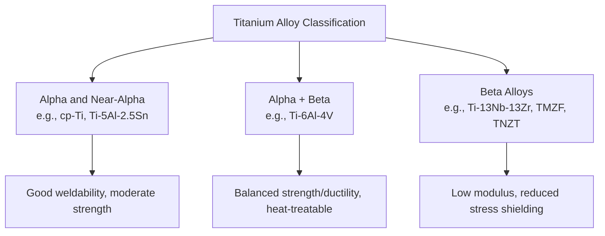
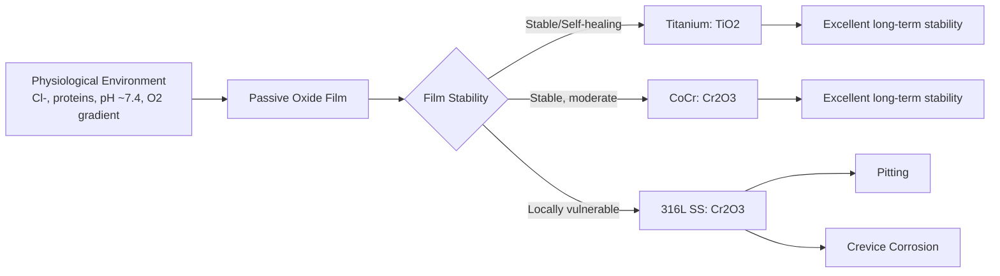

## Metallic Biomaterials: Titanium, Stainless Steel, and Cobalt Chromium

### Overview and Selection Rationale

Metallic biomaterials remain the dominant class for load-bearing implant applications due to their combination of high strength, fracture toughness, fatigue resistance, and ductility—properties that polymers and ceramics generally cannot match simultaneously. The three principal metallic systems used clinically are titanium and its alloys, austenitic stainless steels (primarily 316L), and cobalt-chromium (CoCr) alloys. Selection among them involves trade-offs across mechanical performance, corrosion resistance, biocompatibility, cost, and manufacturability.

| Property | 316L Stainless Steel | Ti-6Al-4V | CoCrMo (Cast) |
| --- | --- | --- | --- |
| Density (g/cm³) | ~8.0 | ~4.43 | ~8.3–8.4 |
| Elastic Modulus (GPa) | ~190–205 | ~110–114 | ~210–253 |
| Yield Strength (MPa) | ~190–690 (condition-dependent) | ~795–875 | ~450–1000 (process-dependent) |
| Ultimate Tensile Strength (MPa) | ~490–860 | ~860–965 | ~655–1277 |
| Corrosion Resistance | Moderate (pitting/crevice susceptible) | Excellent | Excellent |
| Primary Application Niche | Temporary fixation | Load-bearing, osseointegration | Articulating/wear surfaces |

[Inference: exact mechanical values vary substantially with processing route—wrought vs. cast vs. additively manufactured—and specific heat treatment or cold-work condition; the ranges above reflect commonly cited literature spans rather than a single standardized value.]

### Titanium and Titanium Alloys

#### Metallurgy and Phase Structure

Titanium exhibits an allotropic phase transformation from a hexagonal close-packed (HCP) α-phase at low temperature to a body-centered cubic (BCC) β-phase above the β-transus temperature (~882°C for pure titanium). Alloying elements are classified by their effect on this transformation:

- **α-stabilizers**: aluminum, oxygen, nitrogen, carbon (raise the β-transus)
- **β-stabilizers**: vanadium, molybdenum, niobium, tantalum, iron (lower the β-transus); further divided into β-isomorphous (e.g., Mo, V, Nb, Ta) and β-eutectoid formers (e.g., Fe, Cr, Ni)
- **Neutral elements**: zirconium, tin (minimal effect on transus temperature, primarily solid-solution strengtheners)

This classification yields three microstructural alloy families:

1. **α and near-α alloys** (e.g., commercially pure titanium [cp-Ti], Ti-5Al-2.5Sn): good weldability, creep resistance, and corrosion resistance; moderate strength
2. **α+β alloys** (e.g., Ti-6Al-4V, the most widely used biomedical titanium alloy): balanced strength and ductility via heat-treatable two-phase microstructure
3. **β alloys** (e.g., Ti-13Nb-13Zr, Ti-12Mo-6Zr-2Fe [TMZF], Ti-35Nb-7Zr-5Ta [TNZT]): lower elastic modulus (as low as ~55–85 GPa), high strength-to-weight ratio, developed specifically to reduce stress shielding

#### Commercially Pure Titanium (cp-Ti, ASTM F67)

Available in four grades (1–4) distinguished primarily by oxygen and iron content, which control the strength-ductility balance (higher interstitial content increases strength but reduces ductility). cp-Ti is favored for dental implants and applications prioritizing corrosion resistance and osseointegration over peak strength.

#### Ti-6Al-4V (ASTM F136, Grade 5/23 ELI)

The workhorse biomedical titanium alloy, an α+β system strengthened through controlled cooling from the β-phase field followed by aging. The extra-low interstitial (ELI) grade (F136) restricts oxygen, nitrogen, carbon, and iron content to improve fracture toughness and fatigue life relative to the standard grade, at a modest strength penalty. Long-term concerns regarding aluminum and vanadium ion release (implicated in potential neurological and cytotoxic effects with chronic exposure) have driven development of vanadium-free and aluminum-free alternatives.

#### Passive Oxide Layer and Corrosion Behavior

Titanium's biocompatibility and corrosion resistance derive almost entirely from a spontaneously formed, self-healing TiO₂ passive layer, typically 2–10 nm thick under ambient conditions. This layer:

- Forms within milliseconds upon exposure to oxygen or aqueous environments
- Exhibits high dielectric strength and chemical stability across the physiological pH range
- Self-repairs rapidly upon mechanical disruption (e.g., fretting, scratching) due to titanium's strong oxygen affinity
- Can be intentionally thickened via anodization to enhance wear resistance and enable controlled surface coloration or porosity for osseointegration enhancement

#### Osseointegration

Ti and its alloys are distinguished by their capacity for osseointegration—direct structural and functional connection between living bone and the implant surface without intervening fibrous tissue, first characterized by Brånemark in dental implant research. Surface treatments (grit-blasting, acid-etching, anodization, hydroxyapatite coating, plasma spraying) are commonly applied to increase surface area and roughness, promoting osteoblast attachment and bone ingrowth.

### Stainless Steels

#### Composition and Grade 316L

Austenitic stainless steel 316L (ASTM F138/F139) is the primary stainless steel grade used in implantable devices. Key compositional features:

- **Chromium (~17–20%)**: forms the protective Cr₂O₃ passive layer
- **Nickel (~12–14%)**: stabilizes the austenitic (face-centered cubic) phase at room temperature, improving ductility and toughness
- **Molybdenum (~2–3%)**: enhances resistance to pitting and crevice corrosion, particularly in chloride-containing environments
- **"L" designation**: low carbon content (≤0.03%), which suppresses chromium carbide precipitation at grain boundaries during welding or thermal processing—this precipitation, termed sensitization, would otherwise deplete grain-boundary chromium and cause severe intergranular corrosion susceptibility

#### Corrosion Vulnerabilities

Despite passivation, 316L remains more corrosion-prone than titanium or CoCr alloys in the physiological environment, primarily via:

- **Pitting corrosion**: localized chloride ion attack breaching the passive film at defect sites
- **Crevice corrosion**: oxygen-depleted micro-environments at implant-implant or implant-tissue interfaces, common at screw-plate junctions
- **Stress corrosion cracking**: combined effect of tensile stress and corrosive environment, relevant in permanently loaded fixation hardware

Because of this comparatively higher corrosion susceptibility, 316L is generally reserved for temporary fixation devices (bone plates, screws, intramedullary nails) rather than permanent implants, though it remains standard for guidewires, stents (some formulations), and surgical instruments.

#### Nickel Sensitivity

Nickel content in 316L is a recognized concern for patients with nickel hypersensitivity (a Type IV delayed hypersensitivity reaction), motivating development of nickel-free or nickel-reduced austenitic stainless steel formulations using nitrogen or manganese as alternative austenite stabilizers.

### Cobalt-Chromium Alloys

#### Alloy Systems and Processing Routes

Two principal CoCr alloy systems are used biomedically, differentiated by processing route:

- **Cast CoCrMo (ASTM F75)**: used for components requiring complex geometries (e.g., femoral heads, dental frameworks); molybdenum content (~5–7%) refines grain structure and increases strength
- **Wrought CoCrMo/CoNiCrMo (ASTM F799, F562)**: hot-forged or hot-worked, offering finer grain structure and superior fatigue strength compared to cast counterparts, used in high-stress applications such as hip stems

#### Microstructure and Strengthening

CoCr alloys derive strength from a combination of solid-solution strengthening, carbide precipitation (M₂₃C₆ and M₆C carbides, primarily chromium- and molybdenum-rich), and, in wrought alloys, grain refinement and strain hardening. The cobalt matrix exhibits an allotropic transformation between a high-temperature FCC phase and a low-temperature HCP phase; this transformation is sluggish and can be exploited through processing to control the ratio of FCC/HCP phases, which affects wear behavior through strain-induced martensitic transformation during articulation.

#### Passive Layer and Wear Resistance

CoCr alloys form a passive Cr₂O₃-rich oxide layer analogous in protective function to stainless steel's, but with substantially higher intrinsic hardness and wear resistance in the underlying substrate—making CoCr alloys the preferred choice for articulating bearing surfaces in total joint replacements (femoral heads, tibial trays) where high cycle counts (potentially exceeding 10⁶–10⁷ cycles over implant lifetime) demand exceptional wear performance.

#### Metal-on-Metal Concerns

CoCrMo-on-CoCrMo articulating bearings, once favored for reduced volumetric wear rates compared to metal-on-polyethylene systems, generate nanoscale wear particles and elevated systemic cobalt and chromium ion levels. This has been associated with adverse local tissue reactions (ALTR), pseudotumor formation, and metallosis, leading to substantially reduced clinical use of metal-on-metal bearing couples in recent design practice. [Unverified: current clinical prevalence and regulatory status of metal-on-metal bearings should be checked against current guidance, as practice has evolved significantly since peak historical usage.]

### Comparative Corrosion Mechanisms

### Mechanical Compatibility and Stress Shielding

**Key Points**

- Elastic modulus mismatch between implant and adjacent cortical bone (~10–30 GPa) drives non-physiological load transfer
- Stainless steel (~190–205 GPa) and CoCr (~210–253 GPa) exhibit the largest modulus mismatches, concentrating load in the implant and understressing surrounding bone
- Titanium alloys (~110–114 GPa for Ti-6Al-4V) offer a comparatively closer, though still substantial, modulus match
- β-titanium alloys (TMZF, TNZT, Ti-Nb-Zr systems) have been specifically engineered toward moduli in the 55–85 GPa range to further mitigate stress shielding
- Per Wolff's law, chronic understressing of periprosthetic bone promotes resorptive remodeling, contributing to aseptic loosening risk over the implant service life

### Manufacturing Considerations

| Process | Titanium Alloys | Stainless Steel | CoCr Alloys |
| --- | --- | --- | --- |
| Machinability | Poor (low thermal conductivity, work-hardens, chemically reactive with tooling) | Good | Poor to moderate (work-hardens significantly) |
| Casting | Requires inert/vacuum investment casting due to reactivity with oxygen at melt temperature | Standard investment casting | Standard investment casting (F75) |
| Forging | Common for wrought alloys (α+β processing) | Common | Common (F799) |
| Additive Manufacturing | Widely adopted (powder bed fusion, EBM/SLM) for porous/lattice structures | Less common for implants | Emerging use for custom components |
| Welding | Requires inert atmosphere shielding | Feasible; risk of sensitization if improperly controlled | Generally avoided; brittleness concerns |

### Worked Example: Material Selection for a Femoral Stem vs. Bearing Surface

**Example**

For a cementless total hip arthroplasty system:

1. **Femoral stem**: Ti-6Al-4V or a β-titanium alloy is selected for the stem body to leverage relatively lower elastic modulus (reducing stress shielding) and superior osseointegration when combined with a porous or hydroxyapatite-coated proximal surface for biological fixation.
2. **Femoral head (articulating surface)**: CoCrMo is selected over titanium because titanium's relatively soft oxide layer and poor wear resistance make it unsuitable for direct articulation; CoCrMo's hardness and wear resistance are required to minimize particulate generation against a polyethylene or ceramic acetabular liner.
3. **Modular taper junction**: the interface between a CoCrMo head and a Ti-6Al-4V stem introduces a dissimilar-metal junction; while both form stable passive oxides, mechanically assisted crevice corrosion (fretting corrosion) at this junction remains a recognized clinical concern requiring taper geometry and surface finish control to minimize micromotion.

This rationale illustrates why hip implant systems are frequently constructed from more than one metallic system rather than a single "optimal" material—each subcomponent's dominant failure mode (fatigue vs. wear vs. fixation) dictates a different material priority.

### Standards Summary

| Standard | Material Covered |
| --- | --- |
| ASTM F67 / ISO 5832-2 | Unalloyed (commercially pure) titanium |
| ASTM F136 / ISO 5832-3 | Ti-6Al-4V ELI wrought |
| ASTM F1295 | Ti-6Al-7Nb wrought |
| ASTM F138/F139 / ISO 5832-1 | 316L wrought stainless steel (bar/wire, sheet/strip) |
| ASTM F75 / ISO 5832-4 | CoCrMo cast alloy |
| ASTM F799 / ISO 5832-12 | CoCrMo wrought/thermomechanically processed |
| ASTM F562 | CoNiCrMo wrought alloy |

**Next Steps**

- Surface modification techniques for osseointegration (anodization, plasma spraying, HA coating)
- Fatigue behavior and fretting corrosion at modular implant junctions
- Additive manufacturing of titanium lattice structures for orthopedic implants
- Wear mechanisms and tribology of metal-on-polyethylene vs. ceramic-on-ceramic bearings
- Nickel and cobalt ion hypersensitivity in orthopedic patients
- Beta-titanium alloy development for low-modulus spinal and orthopedic devices
- Corrosion testing methodologies (potentiodynamic polarization, fretting-corrosion simulators)