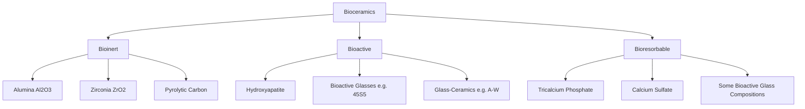
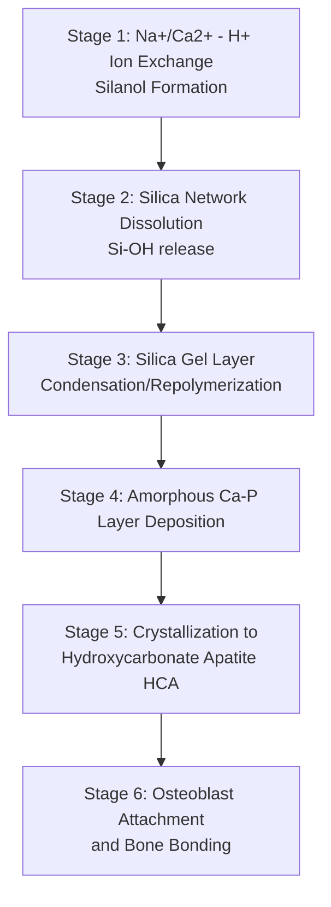

## Bioceramics and Bioactive Glasses

### Classification Overview

Bioceramics are inorganic, non-metallic materials engineered for use in contact with biological systems, classified according to the nature of host tissue interaction:

- **Bioinert ceramics**: negligible chemical interaction with surrounding tissue; a thin, non-adherent fibrous capsule typically forms (e.g., alumina, zirconia, pyrolytic carbon)
- **Bioactive ceramics/glasses**: form a direct, chemically bonded interface with living bone through surface reactions (e.g., hydroxyapatite, bioactive glasses, glass-ceramics such as A-W glass-ceramic)
- **Bioresorbable ceramics**: undergo progressive dissolution and are gradually replaced by natural tissue (e.g., tricalcium phosphate, calcium sulfate)

### Bioinert Ceramics

#### Alumina (Al₂O₃)

High-purity, fine-grained polycrystalline alumina (>99.5% purity, ASTM F603) is used primarily in load-bearing articulating applications, notably femoral heads and acetabular liners in total hip arthroplasty. Its properties derive from a stable, close-packed corundum crystal structure:

- **Hardness**: among the highest of biomedical ceramics, conferring excellent wear resistance and scratch resistance in articulating couples
- **Chemical inertness**: negligible ion release and minimal surface reactivity in physiological fluids
- **Wettability**: excellent, contributing to favorable lubrication behavior in ceramic-on-ceramic bearing systems, associated with reduced volumetric wear rates relative to metal-on-polyethylene couples
- **Fracture toughness limitation**: relatively low fracture toughness (typically ~3–4.5 MPa·m^0.5) renders alumina components susceptible to catastrophic (brittle) fracture under impact or edge-loading conditions, historically a significant clinical concern with earlier-generation alumina femoral heads

#### Zirconia (ZrO₂)

Zirconia, particularly yttria-stabilized tetragonal zirconia polycrystal (Y-TZP), offers substantially higher fracture toughness than alumina (~8–10 MPa·m^0.5) due to a stress-induced tetragonal-to-monoclinic phase transformation at crack tips, which absorbs fracture energy (transformation toughening).

- **Transformation toughening mechanism**: localized tensile stress at a propagating crack tip triggers the metastable tetragonal phase to transform to the monoclinic phase, accompanied by a volume expansion (~3–5%) that induces compressive stresses opposing crack propagation
- **Aging/degradation concern**: low-temperature degradation (LTD), a slow, spontaneous tetragonal-to-monoclinic transformation occurring in the presence of moisture at physiological temperatures, can progressively degrade surface integrity and mechanical properties over years of in vivo service, historically implicated in a notable clinical recall of zirconia femoral heads in the early 2000s
- **Zirconia-toughened alumina (ZTA) composites**: combine alumina's wear resistance and chemical stability with zirconia's toughening mechanism, mitigating monolithic zirconia's aging susceptibility while retaining improved fracture resistance relative to pure alumina

### Bioactive Glasses

#### Composition and the Original 45S5 Formulation

Bioactive glass, first developed by Larry Hench in 1969, is conventionally based on the Na₂O-CaO-SiO₂-P₂O₅ system. The original and most extensively studied composition, designated **45S5 Bioglass**, comprises approximately:

- SiO₂: 45 wt%
- Na₂O: 24.5 wt%
- CaO: 24.5 wt%
- P₂O₅: 6 wt%

The defining compositional feature enabling bioactivity is a silica content below approximately 60 mol%, combined with high Na₂O and CaO content and a relatively high CaO/P₂O₅ ratio—together producing a glass network with sufficient solubility to drive the surface reaction sequence described below.

#### Mechanism of Bioactivity: The Hench Reaction Sequence

Bioactive glass bonds to bone through a well-characterized sequence of surface reactions occurring upon exposure to physiological fluid:

**Key Points**

1. **Stage 1 — Rapid ion exchange**: Na⁺ and Ca²⁺ ions at the glass surface exchange with H⁺/H₃O⁺ from solution, forming silanol (Si-OH) groups at the surface
2. **Stage 2 — Silica network dissolution**: hydrolysis of Si-O-Si bonds releases soluble silica (Si(OH)₄) into solution and further increases surface silanol concentration
3. **Stage 3 — Silica gel layer formation**: silanol groups condense and repolymerize, forming a hydrated, amorphous silica-rich gel layer at the surface
4. **Stage 4 — Amorphous calcium phosphate (ACP) deposition**: calcium and phosphate ions migrate through the silica gel layer and precipitate onto its surface, forming an amorphous CaO-P₂O₅-rich film
5. **Stage 5 — Crystallization to hydroxycarbonate apatite (HCA)**: incorporation of hydroxyl and carbonate ions from solution crystallizes the amorphous layer into a biologically equivalent hydroxycarbonate apatite, structurally and chemically similar to the mineral phase of natural bone
6. **Stage 6 — Biological bonding**: the HCA layer provides a substrate for osteoblast attachment, proliferation, and collagen matrix deposition, ultimately forming a mechanically continuous, chemically bonded interface between implant and bone (osteoconduction culminating in true osseointegration at the molecular level)

#### Bioactivity Index and Compositional Sensitivity

Bioactive glass behavior is highly composition-sensitive; Hench characterized a bioactivity index ($I_B$, related to the time required for 50% of the interface to bond to bone) to compare formulations. Silica content above approximately 60 mol% substantially reduces bioactivity due to a more fully polymerized, less soluble glass network, and above roughly 60 mol% SiO₂, bonding to soft tissue as well as bone may be lost. [Inference: precise compositional bioactivity thresholds vary somewhat depending on the specific ternary/quaternary system and experimental conditions reported across the literature.]

#### Mesoporous and Sol-Gel Derived Bioactive Glasses

Sol-gel synthesis routes (as opposed to traditional melt-quench processing) enable production of bioactive glasses with substantially higher surface area and controlled mesoporosity, which:

- Accelerates the ion-exchange and dissolution kinetics described above, often enabling bioactivity at higher silica contents than melt-derived glasses of equivalent nominal composition
- Facilitates incorporation of therapeutic ions (e.g., copper for angiogenesis, silver or zinc for antimicrobial function, strontium for enhanced osteogenesis) within the glass network for controlled ionic release
- Supports fabrication of bioactive glass scaffolds with tailored, interconnected porosity for bone tissue engineering applications

### Hydroxyapatite and Calcium Phosphate Ceramics

#### Hydroxyapatite (HA)

Hydroxyapatite, Ca₁₀(PO₄)₆(OH)₂, is the calcium phosphate phase most closely resembling the mineral component of natural bone (which is itself a carbonate-substituted, non-stoichiometric, nanocrystalline apatite). Synthetic HA is used extensively as:

- **Coatings**: plasma-sprayed or otherwise deposited onto metallic implant surfaces (commonly Ti-6Al-4V) to combine the mechanical load-bearing capacity of the metal substrate with the osteoconductive surface chemistry of HA
- **Bulk bone graft substitutes and scaffolds**: porous HA structures support bone ingrowth (osteoconduction) though bulk HA's low fracture toughness and slow resorption rate limit its use in load-bearing bulk form

A critical processing parameter for HA coatings is the **Ca/P molar ratio**, ideally 1.67 (stoichiometric HA); deviations during high-temperature plasma spraying can produce secondary phases (tricalcium phosphate, tetracalcium phosphate, or amorphous calcium phosphate) with different dissolution rates, affecting long-term coating stability and delamination risk.

#### Tricalcium Phosphate (TCP)

β-tricalcium phosphate, Ca₃(PO₄)₂, exhibits substantially higher solubility and resorption rate than HA, making it suitable for applications where progressive replacement by natural bone is desired (bone void fillers, resorbable scaffolds). Biphasic calcium phosphate (BCP) ceramics, engineered blends of HA and β-TCP at controlled ratios, allow tuning of the overall resorption rate by adjusting the HA:TCP proportion—higher TCP fractions yield faster resorption.

### Glass-Ceramics

#### A-W Glass-Ceramic

Apatite-wollastonite (A-W) glass-ceramic, developed by Kokubo, is produced via controlled crystallization of a precursor MgO-CaO-SiO₂-P₂O₅ glass, yielding a two-phase microstructure of oxyfluorapatite crystals and wollastonite (CaO·SiO₂) crystals embedded in a residual glassy matrix. This controlled crystallization substantially improves mechanical strength (bending strength and fracture toughness) relative to monolithic bioactive glass while retaining bioactive bone-bonding capability, making it suitable for certain load-bearing applications such as vertebral prostheses.

### Property Comparison

| Property | Alumina | Y-TZP Zirconia | 45S5 Bioactive Glass | Hydroxyapatite (dense) |
| --- | --- | --- | --- | --- |
| Bioactivity | Bioinert | Bioinert | Bioactive (bone-bonding) | Bioactive (osteoconductive) |
| Compressive Strength (MPa) | ~4000–5000 | ~2000 (varies) | Low (glass, brittle) | ~500–1000 |
| Fracture Toughness (MPa·m^0.5) | ~3–4.5 | ~8–10 | Very low | ~0.7–1.2 |
| Primary Clinical Role | Wear-resistant articulating surfaces | Toughened articulating surfaces (ZTA/composites) | Bone graft substitute, coatings, scaffolds | Coatings, bone void fillers |
| Key Failure Mode Concern | Brittle fracture | Low-temperature aging degradation | Poor mechanical load-bearing capacity | Coating delamination, brittle fracture |

### Worked Example: Selecting a Bioceramic for Spinal Fusion Bone Graft Augmentation

**Example**

For a posterolateral spinal fusion procedure requiring a synthetic bone graft extender:

1. **Requirement analysis**: the material must be osteoconductive, resorbable at a rate compatible with new bone formation (typically months), and capable of being molded or granulated to fill irregular defect geometry—ruling out bioinert ceramics (alumina, zirconia) and monolithic dense HA (too slowly resorbed, insufficiently conformable).
2. **Candidate selection**: a biphasic calcium phosphate (BCP) granule composition, e.g., 60% HA / 40% β-TCP, is selected to balance sufficient initial scaffold stability (from the HA fraction) against a resorption timeline matched to osteogenic bone ingrowth (driven by the TCP fraction).
3. **Optional bioactive glass augmentation**: incorporation of a sol-gel derived bioactive glass component with strontium doping may be considered to further promote osteogenic ion signaling, leveraging the Hench reaction sequence to accelerate early-stage HCA layer formation and osteoblast recruitment at the graft-bone interface.
4. **Mechanical context check**: since spinal fusion bone graft is not itself the primary load-bearing element (supplemental instrumentation, typically titanium rods/screws, carries mechanical load during fusion), the low fracture toughness of the bioceramic/bioactive glass components is an acceptable trade-off against their superior biological performance.

### Illustration: Bioactive Glass Surface Reaction Layers (svg_diagram)

<svg xmlns="http://www.w3.org/2000/svg" viewBox="0 0 700 300">
<title>Bioactive Glass Surface Reaction Layers (svg_diagram)</title>
<rect x="0" y="0" width="700" height="300" fill="#ffffff" />
<text x="350" y="30" font-size="16" text-anchor="middle" font-weight="bold">Bioactive Glass Surface Reaction Layers (svg_diagram)</text>
<rect x="100" y="220" width="500" height="50" fill="#9fb8d9" />
<text x="350" y="250" font-size="12" text-anchor="middle" fill="#000000">Bulk Bioactive Glass (Unreacted)</text>
<rect x="100" y="190" width="500" height="30" fill="#c9d9ee" />
<text x="350" y="210" font-size="11" text-anchor="middle">Silica Gel Layer (SiO2-rich)</text>
<rect x="100" y="160" width="500" height="30" fill="#f4d58d" />
<text x="350" y="180" font-size="11" text-anchor="middle">Amorphous Calcium Phosphate Layer</text>
<rect x="100" y="130" width="500" height="30" fill="#e8a35c" />
<text x="350" y="150" font-size="11" text-anchor="middle">Crystalline Hydroxycarbonate Apatite (HCA)</text>
<ellipse cx="200" cy="105" rx="35" ry="18" fill="#a3c9f7" stroke="#2b6cb0" />
<ellipse cx="280" cy="100" rx="35" ry="18" fill="#a3c9f7" stroke="#2b6cb0" />
<ellipse cx="400" cy="105" rx="35" ry="18" fill="#a3c9f7" stroke="#2b6cb0" />
<ellipse cx="500" cy="100" rx="35" ry="18" fill="#a3c9f7" stroke="#2b6cb0" />
<text x="350" y="80" font-size="11" text-anchor="middle">Osteoblasts / New Bone Matrix</text>
</svg>

**Next Steps**

- Bioceramic and bioactive glass scaffold fabrication for bone tissue engineering
- Melt-quench vs. sol-gel synthesis routes for bioactive glass processing
- Fatigue and fracture behavior of ceramic femoral heads in total hip arthroplasty
- Ion doping strategies (Sr, Cu, Ag, Zn) in bioactive glass for therapeutic functionality
- Calcium phosphate cement chemistry and injectable bone substitutes
- Low-temperature degradation testing protocols for zirconia-based ceramics
- Coating adhesion characterization methods for plasma-sprayed hydroxyapatite