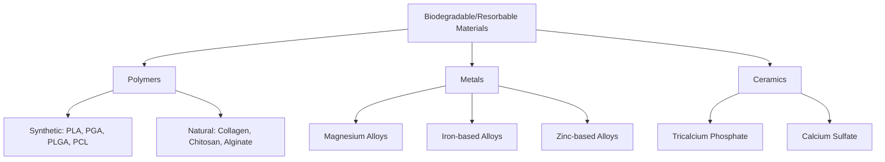
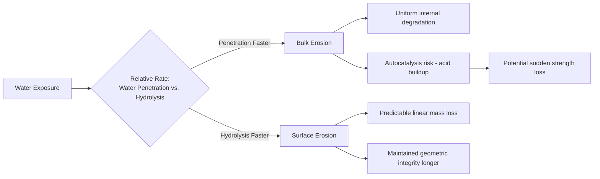
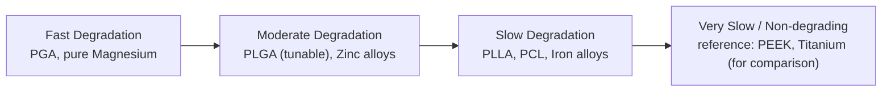

## Biodegradable and Resorbable Materials

### Definition and Design Rationale

Biodegradable (bioresorbable) materials are engineered to undergo progressive in vivo degradation into non-toxic byproducts that are metabolized or excreted, ideally at a rate matched to the tissue healing or regeneration timeline, eliminating the need for implant removal surgery and avoiding the long-term complications associated with permanent implants (chronic foreign body response, stress shielding, wear debris generation). The central design principle is **degradation-function matching**: mechanical properties must be retained long enough to fulfill the load-bearing or structural function, then decline in a controlled manner as the surrounding tissue regains its own mechanical competence.

Three major material classes fall under this category:

1. **Biodegradable polymers**: aliphatic polyesters (PLA, PGA, PLGA, PCL) and natural polymers (collagen, chitosan, alginate)
2. **Biodegradable metals**: magnesium, iron, and zinc-based alloys
3. **Bioresorbable ceramics**: tricalcium phosphate, calcium sulfate, and select bioactive glass compositions (addressed in the preceding bioceramics topic)

### Biodegradable Polymers

#### Aliphatic Polyester Family

The most clinically established biodegradable polymers are aliphatic polyesters, degrading primarily via **hydrolysis** of ester bonds in the polymer backbone, catalyzed by water uptake and, to a lesser extent, enzymatic activity in vivo.

**Poly(glycolic acid) (PGA)**

- Highly crystalline (~45–55% crystallinity), hydrophilic structure
- Rapid degradation: loses mechanical strength within weeks and mass within approximately 6–12 months
- Degrades to glycolic acid, metabolized via the citric acid cycle or excreted renally
- Applications: absorbable sutures (the original Dexon suture), where rapid strength loss is acceptable once wound apposition is achieved

**Poly(lactic acid) (PLA)**

- Exists in stereoisomeric forms: poly(L-lactic acid) (PLLA), poly(D-lactic acid) (PDLA), and poly(D,L-lactic acid) (PDLLA)
- PLLA is semicrystalline and more hydrophobic than PGA, degrading substantially more slowly (mechanical integrity retained for months; full resorption can extend to 2+ years depending on molecular weight and crystallinity)
- PDLLA is amorphous, degrading faster than PLLA but slower than PGA, and is often preferred where a more homogeneous, defect-free degradation is desired
- Degrades to lactic acid, similarly metabolized via the citric acid cycle
- Applications: bioresorbable fixation plates/screws, drug delivery microspheres, tissue engineering scaffolds

**Poly(lactic-co-glycolic acid) (PLGA)**

- Copolymer of lactic and glycolic acid monomers; degradation rate is tunable via the lactide:glycolide ratio—counterintuitively, a 50:50 ratio often degrades faster than either homopolymer due to reduced crystallinity and disrupted chain packing, while ratios closer to either extreme (e.g., 85:15 lactide-rich) degrade more slowly
- Widely used in controlled drug delivery systems (microspheres, implants) and resorbable sutures/mesh where tunable degradation kinetics are the primary design driver

**Poly(ε-caprolactone) (PCL)**

- Semicrystalline, highly hydrophobic polyester with a notably slow degradation rate (full resorption can take 2–4 years)
- Low melting point (~60°C) facilitates thermal processing and 3D printing/additive manufacturing
- Applications: long-term drug delivery devices, slowly resorbing tissue engineering scaffolds, and increasingly as a component in FDM-based bioresorbable scaffold printing

#### Degradation Mechanism: Bulk vs. Surface Erosion

**Key Points**

- **Bulk erosion**: water penetrates the polymer matrix faster than the rate of hydrolytic bond cleavage, causing degradation to occur relatively uniformly throughout the material volume; this is the dominant mode for PLA, PGA, and PLGA. A characteristic risk is **autocatalytic degradation**, where acidic degradation byproducts (lactic/glycolic acid) become trapped within the bulk of larger devices, locally lowering pH and accelerating further hydrolysis—potentially causing a sudden, unpredictable loss of mechanical integrity once a critical molecular weight threshold is crossed, sometimes with an associated inflammatory response to the bolus release of acidic degradation products
- **Surface erosion**: degradation is confined to the material surface because the rate of hydrolysis exceeds the rate of water penetration into the bulk; this produces more predictable, near-linear mass loss and is characteristic of certain polyanhydrides and poly(ortho esters), though these are less commonly used in load-bearing orthopedic applications compared to the polyester family

#### Molecular Weight and Mechanical Property Decay

Degradation of aliphatic polyesters typically proceeds through a two-stage mechanical decay pattern: an initial period of molecular weight reduction with relatively preserved mechanical strength (as the polymer chains are still long enough to maintain load transfer), followed by a more rapid strength loss once molecular weight drops below a critical threshold at which chain entanglement can no longer be sustained. Mass loss (measured gravimetrically) generally lags well behind both molecular weight decline and mechanical strength loss, since degraded oligomers and monomers must diffuse out of the bulk before contributing to measurable mass reduction.

#### Natural Biodegradable Polymers

- **Collagen**: the principal structural protein of the extracellular matrix; degrades via collagenase (matrix metalloproteinase) enzymatic action; widely used in wound dressings, hemostatic agents, and as a scaffold component due to inherent cell-adhesive (RGD-like) sequences, though batch-to-batch variability and potential immunogenicity (particularly with animal-derived sources) are recognized limitations
- **Chitosan**: derived from deacetylation of chitin (crustacean exoskeleton-derived); degrades via lysozyme-mediated hydrolysis; exhibits inherent antimicrobial and hemostatic properties, used in wound care and as a scaffold material
- **Alginate**: derived from brown algae; forms hydrogels via ionic crosslinking with divalent cations (typically Ca²⁺); degradation occurs through loss of crosslinking ion exchange with the physiological environment rather than covalent bond hydrolysis; widely used in cell encapsulation and soft tissue engineering applications

### Biodegradable Metals

#### Rationale for Metallic Degradation

Biodegradable metals address a gap left by biodegradable polymers: applications requiring transient but substantial mechanical load-bearing capacity beyond what polymeric systems can typically provide (e.g., cardiovascular stents, load-bearing orthopedic fixation), while still avoiding permanent implant retention.

#### Magnesium and Magnesium Alloys

Magnesium is the most extensively researched biodegradable metal, motivated by its mechanical properties being closer to natural bone than any other metallic biomaterial class (elastic modulus ~41–45 GPa, substantially closer to cortical bone's ~10–30 GPa than titanium or CoCr) and magnesium's essential physiological role as a cofactor in numerous enzymatic processes, enabling safe metabolic handling of released ions.

**Degradation mechanism**: magnesium corrodes in aqueous chloride-containing environments via the reaction:

$$Mg + 2H_2O \rightarrow Mg(OH)_2 + H_2$$

This reaction generates hydrogen gas, which, if produced faster than it can diffuse away or be resorbed by surrounding tissue, can accumulate as subcutaneous gas pockets—a well-documented clinical and design challenge for early magnesium implant generations. The reaction also locally elevates pH, which can be beneficial (mild alkalinity has been associated with some antibacterial and osteogenic signaling effects) but must be controlled to avoid tissue irritation.

**Alloying strategies** to control the (often too-rapid) baseline corrosion rate of pure magnesium include:

- **AZ system** (Mg-Al-Zn, e.g., AZ31, AZ91): aluminum improves strength and corrosion resistance, though aluminum ion release has raised long-term neurotoxicity concerns, motivating aluminum-free alternatives
- **WE system** (Mg-Y-RE, rare earth elements): yttrium and rare earth additions refine grain structure and improve corrosion resistance
- **Mg-Ca and Mg-Zn systems**: leverage physiologically essential elements to avoid toxicity concerns associated with aluminum or certain rare earth elements
- **Surface coatings**: micro-arc oxidation (MAO), polymer coatings (e.g., PLGA overcoat), and conversion coatings (fluoride treatment) are commonly applied to slow initial corrosion rate and mitigate early-stage hydrogen evolution

Clinical applications under active development and, in some cases, clinical use include biodegradable coronary stents and orthopedic fixation screws/plates for pediatric and low-load applications where implant removal surgery in a growing patient is particularly undesirable.

#### Iron-Based Alloys

Pure iron and iron alloys offer substantially higher initial mechanical strength than magnesium, closer to that of permanent stainless steel, but exhibit a notably slower and less predictable degradation rate in vivo—iron's corrosion products (iron oxides/hydroxides) are considerably less soluble than magnesium's, and complete resorption timelines observed in preclinical studies have often extended well beyond typical bone healing timescales. Alloying (e.g., with manganese) and surface/microstructural engineering are active research areas aimed at accelerating iron's degradation rate to more clinically useful timeframes. [Inference: iron-based biodegradable systems remain comparatively less clinically mature than magnesium-based systems as of current literature, with degradation rate control representing the primary unresolved engineering challenge.]

#### Zinc-Based Alloys

Zinc has emerged as an intermediate candidate, with a standard electrode potential and consequent degradation rate positioned between magnesium (too fast in many early designs) and iron (too slow), without magnesium's hydrogen gas evolution issue. Zinc is also an essential trace element with a well-characterized physiological role. Mechanical properties of pure zinc are relatively modest, motivating alloying (e.g., with magnesium, calcium, or silver) to improve strength and ductility while retaining favorable degradation kinetics. [Inference: zinc-alloy biodegradable systems are generally regarded as an earlier-stage research area relative to magnesium alloys, with fewer alloys having reached advanced clinical evaluation.]

### Comparative Degradation Rate Positioning

### Property Comparison Table

| Material | Approx. Degradation Timeframe (Mass Loss) | Elastic Modulus | Primary Degradation Byproduct(s) | Key Design Concern |
| --- | --- | --- | --- | --- |
| PGA | ~6–12 months | ~7 GPa | Glycolic acid | Rapid strength loss |
| PLLA | 1.5–2+ years | ~2.7 GPa | Lactic acid | Slow, potential late-stage bulk erosion effects |
| PLGA (50:50) | Weeks–months (tunable) | ~2 GPa | Lactic + glycolic acid | Autocatalytic acceleration in bulk devices |
| PCL | 2–4 years | ~0.4 GPa | Caproic acid | Very slow resorption |
| Magnesium alloys | Weeks–months (highly alloy-dependent) | ~41–45 GPa | Mg²⁺, H₂ gas, Mg(OH)₂ | Hydrogen gas evolution, rapid early corrosion |
| Iron alloys | Often >1–2 years (variable) | ~200 GPa | Fe²⁺/Fe³⁺ oxides/hydroxides | Degradation rate often too slow |
| Zinc alloys | Months–1+ year (alloy-dependent) | ~90–100 GPa | Zn²⁺ | Mechanical strength limitations in pure form |

[Unverified: specific degradation timeframes are highly dependent on alloy/polymer composition, processing history, implant geometry, and anatomical implantation site; the values above represent commonly cited literature ranges rather than fixed constants.]

### Worked Example: Selecting a Biodegradable System for a Pediatric Orthopedic Fixation Screw

**Example**

Consider fixation of a pediatric long-bone fracture, where avoiding a second surgery for hardware removal (necessary with permanent metal fixation in growing patients) is a primary clinical driver:

1. **Load requirement assessment**: pediatric fracture fixation generally involves lower absolute loads than adult trauma fixation, but sufficient initial stiffness is still required to maintain fracture reduction during the primary healing phase (typically 6–12 weeks).
2. **Candidate comparison**:
   - A PLLA or high-molecular-weight PLGA screw could be selected if the anatomical site tolerates polymeric fixation's comparatively lower initial stiffness; degradation is slow enough to avoid premature mechanical failure but proceeds fully over 1–2+ years, matching pediatric bone remodeling timescales without residual hardware.
   - A magnesium alloy screw (e.g., a WE-system or Mg-Ca alloy) could be selected where higher initial mechanical strength is needed, accepting the trade-off of managing potential early-stage hydrogen gas evolution through appropriate alloy selection and surface coating.
3. **Degradation-healing matching check**: the selected system's mechanical strength retention profile is compared against the expected fracture healing curve (rapid strength gain in the first 6–12 weeks, continued remodeling over months), ensuring the implant does not lose load-bearing capacity before adequate bony union.
4. **Regulatory and evidence consideration**: as biodegradable metal fixation systems are a comparatively newer clinical category relative to titanium/stainless steel fixation, available long-term clinical outcome data and specific regulatory approval status for the anatomical indication would need verification against current sources before final selection.

### Illustration: Two-Stage Mechanical Property Decay During Polymer Degradation (svg_diagram)

<svg xmlns="http://www.w3.org/2000/svg" viewBox="0 0 700 320">
<title>Two-Stage Mechanical Property Decay During Polymer Degradation (svg_diagram)</title>
<rect x="0" y="0" width="700" height="320" fill="#ffffff" />
<text x="350" y="25" font-size="15" text-anchor="middle" font-weight="bold">Two-Stage Mechanical Property Decay During Polymer Degradation (svg_diagram)</text>
<line x1="60" y1="270" x2="650" y2="270" stroke="#000000" stroke-width="1.5" />
<line x1="60" y1="270" x2="60" y2="50" stroke="#000000" stroke-width="1.5" />
<text x="350" y="300" font-size="12" text-anchor="middle">Time</text>
<text x="25" y="160" font-size="12" text-anchor="middle" transform="rotate(-90 25 160)">Relative Property</text>
<path d="M60,80 C200,85 300,90 380,110 C450,140 500,220 650,260" fill="none" stroke="#2b6cb0" stroke-width="2.5" />
<text x="150" y="70" font-size="11" fill="#2b6cb0">Mechanical Strength</text>
<path d="M60,90 C200,120 300,180 400,230 C480,255 550,262 650,265" fill="none" stroke="#c94c4c" stroke-width="2.5" />
<text x="450" y="200" font-size="11" fill="#c94c4c">Molecular Weight</text>
<path d="M60,260 C250,258 400,250 500,220 C570,190 620,140 650,90" fill="none" stroke="#38a169" stroke-width="2.5" />
<text x="480" y="130" font-size="11" fill="#38a169">Mass Loss</text>
<line x1="380" y1="50" x2="380" y2="270" stroke="#888888" stroke-dasharray="4,3" />
<text x="380" y="45" font-size="10" text-anchor="middle">Critical Mw Threshold</text>
</svg>

### Regulatory and Testing Considerations

Biodegradable implants require, in addition to standard ISO 10993 biocompatibility evaluation, characterization of **degradation products and their biological handling**, degradation kinetics under simulated physiological conditions (typically via in vitro immersion studies at 37°C in phosphate-buffered saline or simulated body fluid, tracking mass loss, molecular weight decline via gel permeation chromatography, and mechanical property retention over time), and correlation between in vitro accelerated/real-time degradation studies and actual in vivo degradation behavior—a correlation that is frequently imperfect, since in vivo enzymatic activity, mechanical loading, and localized biological responses can accelerate or otherwise alter degradation relative to static in vitro immersion conditions. [Inference: the degree of in vitro-in vivo correlation discrepancy is material- and application-specific and should be verified against device-specific validation literature rather than assumed uniform across all biodegradable material classes.]

**Next Steps**

- Drug-eluting bioresorbable stent design and degradation-release coupling
- Additive manufacturing of biodegradable polymer and magnesium alloy scaffolds
- Enzymatic vs. hydrolytic degradation pathways in natural polymer scaffolds
- Autocatalytic degradation modeling in bulk-eroding polyester devices
- Surface coating strategies for corrosion rate control in magnesium biomaterials
- In vitro degradation testing protocol design (ISO 10993, ASTM F1635)
- Tissue engineering scaffold design principles and degradation-regeneration matching