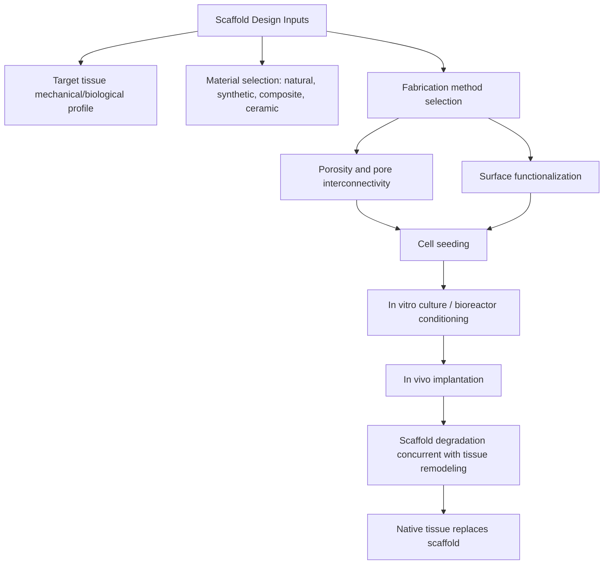

## Tissue Engineering Scaffolds

### Overview

Tissue engineering scaffolds are three-dimensional biomaterial constructs designed to provide a temporary structural and biochemical template that supports cell attachment, proliferation, differentiation, and new tissue formation, ultimately degrading as the host tissue regenerates its own extracellular matrix (ECM). The scaffold serves as a surrogate ECM during the regeneration window, and its design integrates materials science, cell biology, and mass transport engineering.

### Core Design Requirements

**Biocompatibility**

The scaffold and its degradation products must not elicit a chronic inflammatory or immune response. Evaluated per ISO 10993, analogous to other implantable biomaterials.

**Porosity and pore interconnectivity**

High porosity (typically 70–95%) with interconnected pore networks is required for cell infiltration, vascularization, nutrient/waste diffusion, and removal of degradation byproducts. Pore size is application-specific:

- Bone regeneration: ~100–500 μm (larger pores favor vascularization and osteogenesis)
- Skin/soft tissue: ~20–125 μm

  Insufficient interconnectivity creates diffusion-limited necrotic cores in the scaffold interior, since oxygen diffusion in avascular tissue is generally limited to a few hundred micrometers.

**Mechanical properties**

The scaffold must provide sufficient mechanical integrity to maintain its structure under physiological loading (or bioreactor culture conditions) while matching the target tissue's stiffness closely enough to avoid stress-shielding or mechanical mismatch at the healing interface.

$$E_{scaffold}(t) \text{ must remain} \geq E_{minimum, functional}\text{ throughout degradation}$$

**Degradation rate matching**

The scaffold's degradation kinetics should approximate the rate of new tissue formation — degrading neither so fast that structural support is lost prematurely, nor so slowly that it impedes remodeling or induces a prolonged foreign body response.

**Surface chemistry and bioactivity**

Surface properties (wettability, charge, presence of cell-adhesive ligands such as RGD peptides) govern initial protein adsorption and subsequent cell attachment, per the Vroman effect cascade of protein-surface interactions.

### Material Classes

**Natural polymers**

- Collagen — the dominant native ECM protein; excellent cell recognition but weak mechanically and batch-variable
- Gelatin — denatured collagen, often crosslinked (e.g., with genipin or EDC/NHS) to improve stability
- Alginate — algae-derived, ionically crosslinked with Ca²⁺; mild gelation conditions favorable for cell encapsulation, but lacks inherent cell-adhesion motifs
- Chitosan — derived from chitin; antibacterial properties, structurally similar to glycosaminoglycans
- Hyaluronic acid — native to cartilage and soft connective tissue ECM
- Silk fibroin — favorable mechanical strength and slow, tunable degradation

**Synthetic polymers**

- PLA, PGA, PLGA — tunable degradation, well-characterized processing, FDA-cleared history from suture applications
- Polycaprolactone (PCL) — slow degradation, good for load-bearing or long-term applications; frequently used in electrospun and 3D-printed scaffolds due to favorable rheology
- Polyethylene glycol (PEG) hydrogels — bioinert base that requires functionalization with adhesion peptides for cell attachment

**Ceramics and bioactive glasses**

- Hydroxyapatite (HA), tricalcium phosphate (TCP) — osteoconductive, used for bone scaffolds, often as composite reinforcement rather than standalone scaffold due to brittleness
- Bioactive glass (45S5 Bioglass) — forms a hydroxycarbonate apatite surface layer in vivo, promoting bone bonding

**Composites**

Combining polymer ductility/processability with ceramic osteoconductivity/stiffness is a common strategy for bone scaffolds (e.g., PCL/HA, collagen/HA), aiming to approximate the mineral-organic composite nature of native bone.

### Fabrication Techniques

| Technique | Principle | Pore Control | Typical Use |
| --- | --- | --- | --- |
| Solvent casting/particulate leaching | Polymer solution cast around porogen (salt, sugar), then leached out | Moderate, porogen-size-dependent | Simple lab-scale scaffolds |
| Freeze-drying (lyophilization) | Ice crystal sublimation leaves pores | Good, controllable via freezing rate | Collagen, gelatin sponges |
| Gas foaming | Supercritical CO₂ or chemical blowing agents | Moderate | Solvent-free processing |
| Electrospinning | Electrostatic drawing of polymer jets into nanofibers | Fiber diameter/density controllable, less so pore architecture | ECM-mimetic nanofibrous mats |
| 3D printing / bioprinting | Layer-by-layer deposition (FDM, SLA, extrusion, inkjet) | Precise, patient-specific, reproducible | Complex/anatomically specific geometries |
| Decellularization | Native tissue stripped of cellular content, retaining ECM architecture | Native (tissue-specific) | Whole-organ or tissue-specific scaffolds |

**3D bioprinting** deserves particular note as an actively evolving fabrication route: bioinks (cell-laden hydrogel formulations, often alginate, gelatin methacryloyl (GelMA), or collagen-based) are extruded or photopolymerized layer-by-layer, enabling direct incorporation of cells and spatially controlled multi-material or multi-cell-type architectures. [Inference — this remains a rapidly developing research area; specific process parameters and commercial platform capabilities should be verified against current literature/vendor documentation for production use]

### Scaffold Architecture Schematic

### Vascularization Challenge

A persistent engineering bottleneck is achieving adequate vascularization of thick (>200 μm) engineered constructs, since diffusion alone cannot sustain cell viability beyond this scale. Strategies include:

- Pre-vascularization (co-culturing endothelial cells to form microvascular networks in vitro before implantation)
- Incorporation of angiogenic growth factors (VEGF) via controlled-release delivery
- Sacrificial templating (printing removable channel networks that leave perfusable conduits)
- Modular assembly of smaller pre-vascularized units

### Bioreactor Conditioning

Dynamic culture systems (perfusion bioreactors, spinner flasks, mechanical stimulation chambers) are often used to improve nutrient transport and apply physiologically relevant mechanical cues (e.g., cyclic strain for tendon/ligament constructs, fluid shear for vascular constructs) prior to implantation, improving construct maturation relative to static culture. [Inference — the magnitude of benefit is construct- and protocol-dependent]

### Applications by Tissue Type

- **Bone**: PCL/HA composites, 3D-printed scaffolds with load-bearing architecture
- **Cartilage**: Hydrogel-based (alginate, collagen, HA) due to cartilage's avascular, low-cell-density native environment
- **Skin**: Collagen-GAG scaffolds (e.g., commercially established dermal regeneration templates), electrospun nanofiber mats
- **Vascular**: Electrospun or decellularized tubular scaffolds with mechanical anisotropy matching native vessel compliance
- **Nerve**: Aligned fiber or channel architectures to guide axonal regrowth directionally
- **Cardiac**: Conductive or elastomeric scaffolds (e.g., PGS — poly(glycerol sebacate)) to accommodate cyclic contraction

### Evaluation Metrics

- Cell viability/proliferation assays (MTT, live/dead staining)
- Histological assessment of tissue infiltration and matrix deposition
- Mechanical testing (compression, tension) over degradation timecourse
- Degradation profile (mass loss, molecular weight loss via GPC)
- In vivo functional outcomes (application-specific: bone density via micro-CT, vascular patency, etc.)

**Related Topics**

- Polymers in Medical Devices
- Hydrogels for Biomedical Applications
- Growth Factor Delivery Systems
- Decellularized Tissue Matrices
- 3D Bioprinting Techniques and Bioinks
- Ceramic Biomaterials (Alumina, Zirconia, Bioactive Glass)
- Cell-Material Interactions and Surface Functionalization