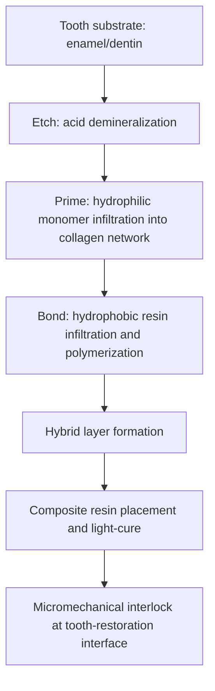

## Dental Materials

### Overview

Dental materials encompass a diverse set of metals, ceramics, polymers, and composites engineered to restore, replace, or repair tooth structure and supporting oral tissues. The intraoral environment imposes a demanding combined requirement set: cyclic mechanical loading (mastication forces reaching several hundred newtons), a wet, thermally cycling, chemically variable environment (pH swings from acidic beverages/bacterial metabolism to neutral saliva), and stringent esthetic demands for anterior restorations.

### Classification by Application

**Restorative materials** — replace lost tooth structure directly in the mouth (fillings)

**Prosthetic materials** — fabricated outside the mouth and cemented/bonded in place (crowns, bridges, dentures, implants)

**Cements and luting agents** — bond restorations to tooth structure or bond orthodontic appliances

**Impression materials** — capture negative replicas of oral anatomy for indirect fabrication

**Endodontic materials** — root canal filling and sealing

### Direct Restorative Materials

**Dental amalgam**

A metallic alloy (traditionally Ag-Sn-Cu-Hg, with modern "high-copper" formulations minimizing the weaker γ2 (Sn-Hg) phase) formed by mixing liquid mercury with a powdered alloy, triggering an amalgamation reaction that produces a plastic mass hardening in situ. Valued historically for compressive strength, wear resistance, and ease of placement in moisture-contaminated fields, though esthetic and mercury-related environmental/handling concerns have driven a long-term shift toward composite resins in many jurisdictions. [Unverified — regulatory status and clinical usage trends vary by country and are subject to change; consult current regulatory guidance for specifics]

**Composite resins**

The dominant modern direct restorative, consisting of:

- **Organic matrix**: typically Bis-GMA, UDMA, or TEGDMA methacrylate monomers, polymerized via free-radical addition (commonly light-cured with visible-light photoinitiators such as camphorquinone)
- **Inorganic filler**: silica, quartz, or glass particles (ranging from nanoscale to microscale) bonded to the matrix via a silane coupling agent, providing wear resistance, reduced polymerization shrinkage, and improved mechanical properties
- **Coupling agent**: silane treatment of filler particles ensures stress transfer between the rigid filler and the more compliant polymer matrix

Filler content and particle size classify composite subtypes (microfill, hybrid, nanofill, nanohybrid), trading off polish retention, strength, and wear resistance.

A key processing challenge is **polymerization shrinkage** (typically 1.5–5% volumetric contraction during cure), which generates internal stress at the tooth-restoration interface and can produce marginal microleakage if not managed through incremental placement techniques and appropriate adhesive bonding.

**Glass ionomer cements (GIC)**

Formed from an acid-base reaction between fluoroaluminosilicate glass powder and polyacrylic acid liquid, producing a matrix that chemically bonds to tooth structure (via chelation with calcium in hydroxyapatite) without requiring a separate adhesive. Notable for sustained fluoride release, which provides a degree of secondary caries protection. Resin-modified glass ionomers (RMGIC) incorporate a light-cured methacrylate component to improve early mechanical strength and reduce moisture sensitivity during setting.

### Indirect/Prosthetic Materials

**Dental ceramics**

- Feldspathic porcelain — traditional esthetic veneering material, high translucency but brittle (low fracture toughness, ~1 MPa·m^0.5)
- Leucite- and lithium disilicate-reinforced glass ceramics — improved strength (lithium disilicate: flexural strength ~300–400 MPa) while retaining good esthetics; commonly processed via pressing or CAD/CAM milling
- Zirconia (yttria-stabilized tetragonal zirconia polycrystal, Y-TZP) — high flexural strength (900–1200 MPa) and fracture toughness enhanced by transformation toughening (tetragonal-to-monoclinic phase transformation under stress-induced crack-tip loading absorbs energy), used for full-contour crowns, bridges, and implant abutments; historically less translucent than glass ceramics, though modern high-translucency zirconia formulations narrow this gap [Inference — translucency-strength trade-offs are formulation-specific and evolving with manufacturer development]

**Metal alloys (indirect)**

- Noble/high-noble alloys (Au-Pt-Pd based) — excellent biocompatibility and corrosion resistance, historically used for crowns and bridges, now less common due to cost
- Base metal alloys (Ni-Cr, Co-Cr) — higher strength, lower cost, used for metal-ceramic (PFM, porcelain-fused-to-metal) restorations and removable partial denture frameworks; nickel sensitivity is a recognized consideration in alloy selection
- Titanium and Ti-6Al-4V — implant fixtures (osseointegration relies on native titanium oxide layer biocompatibility) and some frameworks

**Denture base polymers**

PMMA remains the standard denture base material, processed via compression or injection molding with a heat- or chemical-cure polymerization cycle. Residual monomer content is a quality and biocompatibility consideration.

### Adhesive Systems (Dental Bonding)

Bonding composite resin to tooth structure relies on a multi-step or simplified adhesive protocol:

1. **Etching** (typically 30–37% phosphoric acid) — demineralizes enamel/dentin surface, creating microporosity
2. **Priming** — hydrophilic monomers infiltrate the demineralized dentin collagen network
3. **Bonding** — hydrophobic resin monomer infiltrates and polymerizes within the primed substrate, forming a micromechanically interlocked "hybrid layer"

Etch-and-rinse, self-etch, and universal adhesive systems represent different chemistries balancing bond strength, technique sensitivity, and postoperative sensitivity risk.

### Cements and Luting Agents

| Cement Type | Setting Mechanism | Key Property |
| --- | --- | --- |
| Zinc phosphate | Acid-base reaction | Long clinical history, no chemical adhesion |
| Glass ionomer | Acid-base (polyacrylic-glass) | Fluoride release, chemical bond to tooth |
| Resin cement | Free-radical polymerization | High bond strength, technique-sensitive |
| Resin-modified GIC | Dual (acid-base + light-cure) | Balance of adhesion and handling |

### Key Property Requirements Summary

- **Compressive/flexural strength**: must withstand cyclic occlusal loading without fatigue fracture
- **Wear resistance**: matched to opposing dentition to avoid excessive wear of either the restoration or antagonist tooth
- **Coefficient of thermal expansion (CTE)**: should approximate that of tooth structure (~11 × 10⁻⁶/°C for enamel) to minimize marginal gap formation under thermal cycling
- **Dimensional stability**: minimal setting shrinkage/expansion
- **Biocompatibility and low solubility**: resistance to degradation in the oral fluid environment
- **Esthetics**: shade matching, translucency, and polish retention for anterior applications

### Failure Modes

- Marginal microleakage from polymerization shrinkage stress or adhesive bond degradation, leading to secondary caries
- Bulk or chipping fracture in brittle ceramics, particularly at stress concentrators (occlusal contact points, connector regions in bridges)
- Low-cycle and high-cycle fatigue under repeated mastication loading
- Wear (both restoration surface wear and antagonist tooth wear) from filler particle pull-out in composites
- Galvanic corrosion when dissimilar metal restorations are present in the same oral environment

**Related Topics**

- Polymers in Medical Devices
- Ceramic Biomaterials (Alumina, Zirconia, Bioactive Glass)
- Metallic Implant Alloys (Ti-6Al-4V, CoCrMo, Nitinol)
- Fracture Toughness and Transformation Toughening in Zirconia
- Adhesion and Interfacial Bonding in Biomaterials
- CAD/CAM Machining and Digital Dentistry Workflows